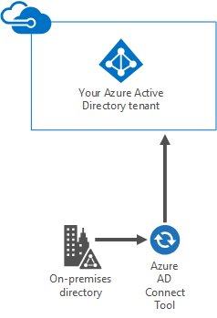
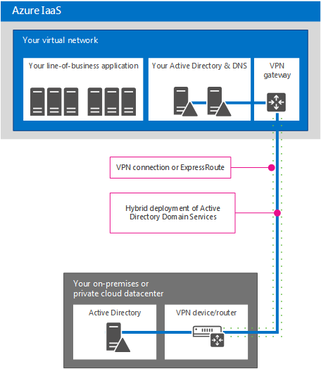
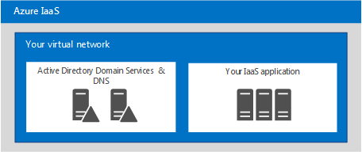

# Identità cloud Microsoft per Enterprise ArchitectsMicrosoft Cloud Identity for Enterprise Architects

 **Riepilogo:** Progettare una soluzione di identità per i servizi cloud e le piattaforme Microsoft.**Summary:** Design your identity solution for Microsoft cloud services and platforms.
  
In questo articolo viene descritto cosa devono sapere gli architetti IT sulla progettazione di identità per le organizzazioni che utilizzano i servizi cloud e le piattaforme Microsoft. È possibile visualizzare questo articolo anche come poster di 5 pagine e stamparlo in formato tabloid (noto anche come ledger, 11 x 17 o A3).This article describes what IT architects need to know about designing identity for organizations using Microsoft cloud services and platforms. You can also view this article as a 5-page poster and print it in tabloid format (also known as ledger, 11 x 17, or A3).
  

  
[PDF](https://go.microsoft.com/fwlink/p/?LinkId=524586) | [Visio](https://download.microsoft.com/download/2/3/8/238228E6-9017-4F6C-BD3C-5559E6708F82/MSFT_cloud_architecture_identity.vsd) | [Altre lingue](https://www.microsoft.com/download/details.aspx?id=54431)[PDF](https://go.microsoft.com/fwlink/p/?LinkId=524586) | [Visio](https://download.microsoft.com/download/2/3/8/238228E6-9017-4F6C-BD3C-5559E6708F82/MSFT_cloud_architecture_identity.vsd) | [More languages](https://www.microsoft.com/download/details.aspx?id=54431)
  
È inoltre possibile visualizzare tutti i modelli nelle [Risorse sull'architettura IT del cloud Microsoft](microsoft-cloud-it-architecture-resources.md) e consultare la [Guida di orientamento del cloud aziendale Microsoft: risorse per i decision maker del settore IT](https://aka.ms/cloudarchitecture).You can also see all of the models in the [Microsoft Cloud IT architecture resources](microsoft-cloud-it-architecture-resources.md) and swipe through [Microsoft's Enterprise Cloud Roadmap: Resources for IT Decision Makers](https://aka.ms/cloudarchitecture).
  
> [!NOTE]
> Questo articolo riflette la versione di gennaio 2016 del poster **Identità cloud Microsoft per Enterprise Architects**. Non contiene le modifiche apportate alla versione di aprile 2016 o successiva del poster.This article reflects the January 2016 version of the **Microsoft cloud identity for enterprise architects** poster. It does not contain the changes for the April 2016 or later versions of the poster.
  
## Progettazione dell'identità per il cloud MicrosoftDesigning identity for the Microsoft cloud

L'integrazione delle identità con il cloud Microsoft consente di accedere a una vasta gamma di servizi e opzioni di piattaforme cloud. Esistono due opzioni principali:Integrating your identities with the Microsoft cloud provides access to a broad range of services and cloud platform options. There are two main options:
  
- È possibile integrare con Microsoft Azure Active Directory (AD). Ciò include la sincronizzazione degli account locali con Azure AD, il provider di identità per il cloud Microsoft.You can integrate with Microsoft Azure Active Directory (AD). This involves synchronizing your on-premises accounts to Azure AD, the identity provider for the Microsoft cloud.
    
- È possibile estendere l'ambiente Servizi di dominio Active Directory (AD DS) alle macchine virtuali in esecuzione nei servizi infrastruttura di Microsoft Azure.You can extend your on-premises Active Directory Domain Services (AD DS) environment to virtual machines running in Microsoft Azure infrastructure services.
    

  
 **Figura 1: opzioni per la progettazione delle identità nel cloud****Figure 1: Options for designing your identities in the cloud**
  
Nella figura 1 viene illustrato che Azure AD è il provider di identità per i servizi Microsoft SaaS (Software as a Service) e le applicazioni Azure PaaS (Platform as a Service) e che le applicazioni line-of-business possono utilizzare AD DS locale.Figure 1 shows how Azure AD is the identity provider for Microsoft Software as a Service (SaaS) services and Azure Platform as a Service (PaaS) applications and how line-of-business applications can use on-premises AD DS. 
  
### Azure Active DirectoryAzure Active Directory

Microsoft Azure AD è il servizio di gestione degli accessi e delle identità ospitato nel cloud Microsoft. Si trova al centro dei servizi cloud e delle piattaforme Microsoft. L'integrazione con Azure AD fornisce l'accesso a tutti i servizi Microsoft SaaS tramite gli account e le password correnti. Tale integrazione fornisce inoltre l'identità basata su cloud per applicazioni PaaS di Azure.Microsoft Azure AD is the Microsoft cloud-hosted identity and access management service. It's at the center of Microsoft cloud services and platforms. Integrating with Azure AD provides access to all of the Microsoft SaaS services using your current set of accounts and passwords. That integration also provides cloud-based identity for Azure PaaS applications. 
  
> [!NOTE]
> Azure AD non sostituisce la necessità di disporre di AD DS locale per le aziende o di macchine virtuali basate su Windows in esecuzione nell'infrastruttura distribuita come servizio (Infrastructure as a Service, IaaS) di Azure.Azure AD does not replace the need for AD DS on-premises for enterprise organizations or for Windows -based virtual machines running in Azure Infrastructure as a Service (IaaS). 
  
Sono disponibili tre versioni di Azure AD: gratuita, di base e premium.There are three editions of Azure AD: Free, Basic, and Premium. 
  
||||
|:-----|:-----|:-----|
|**Gratuita****Free**   |**Di base****Basic**   |**Premium****Premium**   |
| 	Gestione degli account utenteManage user accounts    Sincronizzazione con directory localiSynchronize with on-premises directories    Single Sign-On in Azure, Office 365 e migliaia di altre note applicazioni SaaS, come Salesforce, Workday, Concur, DocuSign, Google Apps, Box, ServiceNow, Dropbox e altroSingle sign-on across Azure, Office 365, and thousands of other popular SaaS applications, such as Salesforce, Workday, Concur, DocuSign, Google Apps, Box, ServiceNow, Dropbox, and more   | Include tutte le capacità della versione gratuita, oltre a:Includes all of the abilities in the Free edition, plus:    Informazioni personalizzate distintive dell'aziendaCompany branding    Accesso alle applicazioni sulla base di un gruppoGroup-based application access    Reimpostazione password self-serviceSelf-service password reset    Contratto di servizio aziendale del 99,9%Enterprise SLA of 99.9%   | Include tutte le caratteristiche della versione gratuita e della versione di base, oltre a:Includes all of the features of the Free and Basic editions, plus:    Gestione gruppi self-serviceSelf-service group management    Avvisi e report di sicurezza avanzataAdvanced security reports and alerts    Autenticazione a più fattoriMulti-factor authentication    Reimpostazione della password con write-back in AD DS localePassword reset with write-back to on-premises AD DS    Sincronizzazione bidirezionale dello strumento Azure AD ConnectAzure AD Connect tool bidirectional synchronization    Proxy di applicazione Azure ADAzure AD Application Proxy    	Microsoft Forefront Identity Manager (MIM)Microsoft Forefront Identity Manager (MIM)   |
   
Per ulteriori informazioni sulle versioni, vedere [Edizioni di Azure Active Directory](https://go.microsoft.com/fwlink/p/?LinkId=524280).For more information about versions, see [Azure Active Directory editions](https://go.microsoft.com/fwlink/p/?LinkId=524280).
  
### Opzione 1: integrazione con Azure Active DirectoryOption 1: Integrate with Azure Active Directory

La maggior parte delle organizzazioni sincronizza un insieme di oggetti e attributi con il tenant di Azure AD. Lo strumento Azure AD Connect consente di sincronizzare gli account tra AD DS locale e un tenant di Azure AD.Most organizations synchronize a standard set of objects and attributes to their Azure AD tenant. The Azure AD Connect tool synchronizes your accounts between on-premises AD DS and an Azure AD tenant.
  

  
 **Figura 2: integrazione con Azure AD****Figure 2: Integrating with Azure AD**
  
Nella figura 2 viene illustrato come lo strumento Azure AD Connect ottiene le modifiche di AD DS e le invia al tenant di Azure AD. In questo caso, il tenant di Azure AD è un duplicato ospitato nel cloud di contenuto della directory locale essenziale.Figure 2 shows how the Azure AD Connect tool obtains AD DS changes and sends them to your Azure AD tenant. In this case, your Azure AD tenant is a cloud-hosted duplicate of essential on-premises directory content.
  
Molte organizzazioni utilizzano AD DS come provider di identità locale. È possibile utilizzare un altro tipo di provider di identità locale (come uno di quelli che usano LDAP) e sincronizzarlo con Azure AD.Many organizations use AD DS as their on-premises identity provider. You can use a different type of identity provider on-premises (such as one that uses LDAP), and synchronize these to Azure AD.
  
### Opzione 2: estensione di AD DS ad AzureOption 2: Extend AD DS to Azure

L'estensione di AD DS a macchine virtuali in esecuzione nei servizi infrastruttura di Azure supporta un diverso set di soluzioni e applicazioni rispetto alla sincronizzazione con Azure AD. Eccone due:Extending AD DS to virtual machines running in Azure infrastructure services supports a different set of solutions and applications compared to synchronization with Azure AD. Here are two:
  
- Supporta le soluzioni basate su cloud che richiedono l'autenticazione Kerberos o NTLM, oppure le macchine virtuali aggiunte a un dominio di AD DS.Supports cloud-based solutions that require NTLM or Kerberos authentication, or AD DS domain-joined virtual machines.
    
- Aggiunge un'ulteriore potenziale integrazione per i servizi cloud e le applicazioni nei servizi cloud e nelle piattaforme Microsoft.Adds additional integration potential for cloud services and applications across Microsoft cloud services and platforms.
    

  
 **Figura 3: estensione di AD DS ad Azure****Figure 3: Extending AD DS to Azure**
  
Nella figura 3 viene illustrato un controller di dominio di AD DS connesso a una rete virtuale di Azure mediante un dispositivo VPN locale e un gateway VPN di Azure. La rete virtuale di Azure contiene i server per un'applicazione line-of-business e il relativo insieme di controller di dominio di AD DS.Figure 3 shows an AD DS domain controller connected to an Azure virtual network through an on-premises VPN device and an Azure VPN gateway. The Azure virtual network contains servers for a line-of-business application and its own set of AD DS domain controllers.
  
### Ulteriori informazioniMore Information

- [La sincronizzazione della directory con Office 365 è facileSynchronizing your directory with Office 365 is easy](https://go.microsoft.com/fwlink/p/?LinkId=524281)
    
- [Infografica: Gestione di identità e accesso nel cloudInfographic: Cloud identity and access management](https://go.microsoft.com/fwlink/p/?LinkId=524282)
    
- [Azure Active DirectoryAzure Active Directory](https://go.microsoft.com/fwlink/p/?LinkId=524283)
    
## Integrazione degli account di AD DS locali con Microsoft Azure ADIntegrate your on-premises AD DS accounts with Microsoft Azure AD

Sincronizzando gli account di AD DS locali con Azure AD, gli utenti possono utilizzare i propri account di AD DS per accedere:By synchronizing your on-premises AD DS accounts with Azure AD, your users can use their on-premises AD DS accounts to access:
  
- A tutti i servizi SaaS Microsoft (Office 365, Microsoft Intune e Dynamics CRM Online)All of the Microsoft SaaS services (Office 365, Microsoft Intune, and Dynamics CRM Online)
    
- Alle applicazioni in esecuzione in PaaS di AzureYour applications running in Azure PaaS
    
Per configurare questa integrazione è possibile procedere in due modi:There are two ways to configure this integration:
  
- Sincronizzazione di password e directoryDirectory and password synchronization
    
- Federazione e Single Sign-OnFederation and single sign-on
    
Iniziare con l'opzione più semplice che risponde alle proprie esigenze. È possibile passare da un'opzione all'altra, se necessario.Start with the simplest option that meets your needs. You can switch between these options, if needed.
  
> [!NOTE]
> L'uso di account basati solo sul cloud (non integrati con AD DS locale) non è consigliabile per le organizzazioni su scala aziendale.Using cloud-only accounts (not integrating with your on-premises AD DS) is not recommended for enterprise-scale organizations. 
  
### Sincronizzazione di password e directoryDirectory and password synchronization

Questa è l'opzione più semplice e richiede solo un server che esegue lo strumento Azure AD Connect.This is the simplest option and requires only a server running the Azure AD Connect tool. 
  

  
 **Figura 4: configurazione della sincronizzazione di password e directory****Figure 4: Directory and password synchronization configuration**
  
Nella figura 4 viene illustrato un datacenter del cloud privato o locale con un controller di dominio di AD DS. Un server che esegue lo strumento Azure AD Connect consente di sincronizzare l'elenco di nomi dell'account con Azure AD.Figure 4 shows an on-premises or private cloud datacenter with an AD DS domain controller. A server running the Azure AD Connect tool synchronizes the list of account names with Azure AD.
  
Con questa opzione:With this option:
  
- Gli account utente vengono sincronizzati da AD DS locale (o da un altro provider di identità) al tenant di Azure AD. La directory locale rimane l'origine autorevole per gli account e consente all'utente di gestire le modifiche di tutti gli account.User accounts are synchronized from your on-premises AD DS (or other identity provider) to your Azure AD tenant. The on-premises directory remains the authoritative source for accounts and you manage all account changes from there.
    
- Azure AD esegue tutte le autenticazioni per i servizi basati su SaaS Microsoft e le applicazioni PaaS di Azure.Azure AD performs all authentication for Microsoft SaaS-based services and Azure PaaS applications.
    
- È inoltre possibile configurare la sincronizzazione per più foreste di AD DS.You can also configure synchronization for multiple AD DS forests.
    
Con la sincronizzazione delle password:With password synchronization:
  
- Agli utenti viene richiesto di immettere una password per accedere ai servizi cloud, che è identica a quella che utilizzano per le risorse locali.Users are prompted to enter a password when accessing cloud services, which is the same password that they use for on-premises resources.
    
- Le password degli utenti non vengono mai inviate come testo non crittografato ad Azure AD. Al contrario, viene utilizzato un hash della password. A livello di crittografia, non è possibile decrittografare o decompilare l'hash della password e ottenere la password come testo non crittografato.User passwords are never sent as cleartext to Azure AD. Instead, a hash of the password is used. It is cryptographically impossible to decrypt or reverse-engineer the password hash and obtain the cleartext password. 
    
Con l'autenticazione a più fattori (MFA):With multi-factor authentication (MFA):
  
- È possibile usufruire delle caratteristiche di base di MFA offerte con Office 365.You can take advantage of basic MFA features offered with Office 365.
    
- Gli sviluppatori di applicazioni PaaS di Azure possono usufruire del servizio di autenticazione a più fattori di Azure.Azure PaaS application developers can take advantage of the Azure Multi-Factor Authentication service.
    
La sincronizzazione delle directory non consente l'integrazione con soluzioni MFA locali.Directory synchronization does not provide integration with on-premises MFA solutions.
  
### Federazione e Single Sign-OnFederation and single sign-on

Questa opzione richiede server e infrastruttura aggiuntivi.This option requires additional servers and infrastructure. 
  

  
 **Figura 5: server necessari per l'autenticazione federata****Figure 5: Servers needed for federated authentication**
  
Nella figura 5 viene illustrato l'insieme di componenti per l'autenticazione federata. Azure AD contatta un proxy applicazione Web, che inoltra la richiesta di autenticazione a un server di Active Directory Federation Services (AD FS), che a sua volta inoltra la richiesta a un controller di dominio di AD DS per la valutazione e la risposta. Un server che esegue lo strumento Azure AD Connect consente di sincronizzare l'elenco di nomi dell'account da AD DS ad Azure AD.Figure 5 shows the set of components for federated authentication. Azure AD contacts a web application proxy, which forwards the authentication request to an Active Directory Federation Services (AD FS) server, which forwards the request to an AD DS domain controller for evaluation and response. A server running the Azure AD Connect tool synchronizes the list of account names from AD DS to Azure AD.
  
La federazione fornisce le seguenti funzionalità aziendali aggiuntive:Federation provides these additional enterprise capabilities:
  
- Tutte le richieste di autenticazione inviate ad Azure AD vengono inoltrate ed eseguite rispetto al provider di identità locale mediante AD FS.All authentication requests sent to Azure AD are forwarded to and performed against the on-premises identity provider through AD FS.
    
- Funziona con i provider di identità non Microsoft.Works with non-Microsoft identity providers.
    
- La sincronizzazione degli hash delle password può agire come backup delle informazioni di accesso per l'accesso federato (ad esempio, se l'autenticazione federata ha esito negativo).Password hash synchronization can act as a sign-in backup for federated sign-in (for example, if the federated authentication fails).
    
Usare la federazione nei seguenti casi:Use federation if:
  
- Single Sign-On è obbligatorio. Con Single Sign-On, agli utenti non viene richiesto di immettere le credenziali (nome utente o password) per accedere a un servizio cloud.Single sign-on is required. With single sign-on, users are not prompted to enter any credentials (user name or password), when accessing a cloud service.
    
- AD FS è già stato distribuito.AD FS is already deployed.
    
- Si utilizza un provider di identità di terze parti.You use a third-party identity provider.
    
- Si utilizza Forefront Identity Manager 2010 R2 (non supporta la sincronizzazione degli hash delle password).You use Forefront Identity Manager 2010 R2 (does not support password hash synchronization).
    
- Si dispone di una smart card integrata in locale o un'altra soluzione MFA.You have an on-premises integrated smart card or other MFA solution.
    
- Si necessita di controllare l'accesso e/o di disabilitare account.You require sign-in audit and/or disablement of accounts.
    
- L'organizzazione richiede restrizioni client di accesso in base al percorso di rete o alle ore lavorative.Your organization requires client sign-in restrictions by network location or work hours.
    
- È necessaria la conformità con Federal Information Processing Standards (FIPS).You must comply with Federal Information Processing Standards (FIPS).
    
L'autenticazione federata richiede un investimento maggiore in infrastrutture locali.Federated authentication requires a greater investment in infrastructure on-premises.
  
- I server locali devono essere accessibili da Internet mediante un firewall aziendale. È consigliabile utilizzare i server Proxy applicazione Web distribuiti nella rete perimetrale.The on-premises servers must be Internet-accessible through a corporate firewall. Microsoft recommends the use of Web Application Proxy servers deployed in your perimeter network.
    
- Richiede componenti hardware, licenze e operazioni per server AD FS, proxy AD FS o server proxy di applicazione Web, firewall e servizi di bilanciamento del carico.Requires hardware, licenses, and operations for AD FS servers, AD FS proxy or Web Application Proxy servers, firewalls, and load balancers. 
    
- Disponibilità e prestazioni sono importanti per garantire agli utenti l’accesso a Office 365 e ad altre applicazioni cloud.Availability and performance are important to ensure users can access Office 365 and other cloud applications.
    
### Ulteriori informazioniMore Information

- [La sincronizzazione della directory con Office 365 è facileSynchronizing your directory with Office 365 is easy](https://go.microsoft.com/fwlink/p/?LinkId=524281)
    
- [Preparazione per il provisioning degli utenti verso Office 365 tramite la sincronizzazione di directoryPrepare to provision users through directory synchronization to Office 365](https://go.microsoft.com/fwlink/p/?LinkId=524284)
    
- [Autenticazione a più fattori per Office 365Multi-Factor Authentication for Office 365](https://go.microsoft.com/fwlink/p/?LinkID=392012)
    
- [Multi-Factor Authentication di AzureAzure Multi-Factor Authentication](https://go.microsoft.com/fwlink/p/?LinkId=524285)
    
- [TechEd 2014: Integrazione directory: creazione di una directory con Active Directory e Azure Active DirectoryTechEd 2014: Directory Integration: Creating One Directory with Active Directory and Azure Active Directory](https://go.microsoft.com/fwlink/p/?LinkId=524286)
    
## estensione di AD DS ad AzureExtend AD DS to Azure

L'estensione di AD DS ad Azure è il primo passaggio per il supporto delle applicazioni line-of-business in esecuzione sulle macchine virtuali nei servizi infrastruttura di Azure, che fornisce:Extending AD DS to Azure is the first step to support line-of-business applications running on virtual machines in Azure infrastructure services, which provides:
  
- Supporto per le soluzioni basate su cloud che richiedono l'autenticazione Kerberos o NTLM, oppure le macchine virtuali aggiunte a un dominio di AD DS.Support for cloud-based solutions that require NTLM or Kerberos authentication, or AD DS domain-joined virtual machines.
    
- Potenziale integrazione aggiuntiva per servizi cloud e applicazioni e può essere aggiunto in qualsiasi momento.Additional integration potential for cloud services and applications and can be added at any time.
    

  
 **Figura 6: estensione di Servizi di dominio Active Directory a una rete virtuale di Azure****Figure 6: Extending AD DS to an Azure virtual network**
  
Nella figura 6 viene illustrato un datacenter del cloud privato o locale con AD DS connesso a una rete virtuale di Azure con una connessione VPN da sito a sito o ExpressRoute. La rete virtuale di Azure contiene i server per un'applicazione line-of-business e il relativo insieme di controller di dominio di AD DS. Questa configurazione è una distribuzione ibrida di AD DS in locale e nei servizi infrastruttura di Azure. Richiede:Figure 6 shows an on-premises or private cloud datacenter with AD DS connected to an Azure virtual network with a site-to-site VPN or ExpressRoute connection. The Azure virtual network contains servers for a line-of-business application and its own set of AD DS domain controllers. This configuration is a hybrid deployment of AD DS on-premises and in Azure infrastructure services. It requires:
  
- Una rete virtuale di Azure.An Azure virtual network.
    
- Una connessione tra un router o un dispositivo VPN (Virtual Private Network) locale e un gateway VPN di Azure.A connection between an on-premises virtual private network (VPN) device or router and an Azure VPN gateway.
    
- L'utilizzo di una porzione dello spazio di indirizzi IP locali per le macchine virtuali nella rete virtuale.Using a portion of your on-premises IP address space for the virtual machines in the virtual network.
    
- La distribuzione di uno o più controller di dominio nella rete virtuale designata come server di catalogo globale (riduce il traffico in uscita attraverso la connessione VPN).Deploying one or more domain controllers in the virtual network designated as global catalog servers (reduces egress traffic across the VPN connection).
    
Questa architettura di identità supporta un insieme di soluzioni e applicazioni diverso rispetto a quello della sincronizzazione con Azure AD.This identity architecture supports a different set of solutions and applications compared to synchronization with Azure AD.
  
### Opzioni di connessione dalla rete locale a quella di AzureOn-premises to Azure connection options

Per connettere la rete locale a una rete virtuale di Azure, è possibile utilizzare:To connect your on-premises network to an Azure virtual network, you can use:
  
- Una connessione VPN da sito a sito, che consente di connettere da 1 a 10 siti (comprese le altre reti virtuali di Azure) a una singola rete virtuale di Azure.A site-to-site VPN connection, which can connect 1-10 sites (including other Azure virtual networks) to a single Azure virtual network.
    
- ExpressRoute, un collegamento WAN sicuro e privato ad Azure mediante un provider di servizi di datacenter e di rete partner. Le connessioni ExpressRoute possono offrire una maggiore affidabilità, una larghezza di banda superiore e latenze inferiori.ExpressRoute, a private, secure WAN link to Azure through a partner network and datacenter services provider. ExpressRoute connections can offer increased reliability, higher bandwidth, and lower latencies.
    
### Ulteriori informazioniMore Information

- [Connessione cross-premise per reti virtualiCross-premises connectivity for virtual networks](https://go.microsoft.com/fwlink/p/?LinkId=524293)
    
- [Panoramica tecnica relativa a ExpressRouteExpressRoute Technical Overview](https://go.microsoft.com/fwlink/?LinkID=392081)
    
- [Linee guida per la distribuzione di Windows Server Active Directory in macchine virtuali di AzureGuidelines for Deploying Windows Server Active Directory on Azure Virtual Machines](https://go.microsoft.com/fwlink/p/?LinkId=524295)
    
## Integrare le applicazioni con identità cloudIntegrate your applications with cloud identities

Durante la progettazione e lo sviluppo delle applicazioni che vengono eseguite nel cloud, l'obiettivo deve essere la coerenza dell'esperienza utente in merito al processo di autenticazione, compreso l'insieme di credenziali necessarie. Ad esempio, quando si utilizzano le credenziali di Windows, che si tratti di Azure AD o di un'estensione di AD DS, occorre accertarsi che gli utenti possano eseguire l'autenticazione rapidamente e concentrarsi sulle proprie attività.When designing and developing applications that run in the cloud, you should aim for consistency of the user experience for the authentication process, including the set of required credentials. For example, when using Windows credentials, whether against Azure AD or an extended AD DS, ensure that users can quickly authenticate and focus on their tasks.
  

  
 **Figura 7: integrare le applicazioni con identità cloud****Figure 7: Integrate your applications with cloud identities**
  
Nella figura 7 vengono illustrate tre opzioni per l'integrazione dell'applicazione con identità cloud.Figure 7 shows three options for integrating your application with cloud identities.
  
1. Registrare le applicazioni ospitate nel cloud con Azure AD.Register your cloud-hosted applications with Azure AD.
    
    Vedere l'articolo MSDN [Integrazione di applicazioni con Azure Active Directory](https://go.microsoft.com/fwlink/p/?LinkId=524303). Ciò consente di utilizzare Azure AD per autenticare l'accesso all'applicazione PaaS, oltre a permettere a utenti o amministratori di autorizzare l'applicazione ad accedere ai contenuti per conto di altri servizi cloud, come Office 365. Ulteriori informazioni ed esempi di codice sono disponibili nell'articolo MSDN [Scenari di autenticazione per Azure AD](https://go.microsoft.com/fwlink/p/?LinkId=524304).See the MSDN article [Integrating Applications with Azure Active Directory](https://go.microsoft.com/fwlink/p/?LinkId=524303). This lets you use Azure AD to authenticate access to your PaaS application, as well as allowing users or administrators to grant rights to your application to access content on their behalf from other cloud services, such as Office 365. More details and code samples can be found in the MSDN article [Authentication Scenarios for Azure Active Directory](https://go.microsoft.com/fwlink/p/?LinkId=524304). 
    
2. Le applicazioni che richiedono l'autenticazione programmatica per avere accesso a un'applicazione protetta da AD DS, AD FS in Windows Server 2012 R2 o Azure AD possono utilizzare:Applications that require programmatic authentication to gain access to an application secured by AD SD, AD FS on Windows Server 2012 R2, or Azure AD can use:
    
  - [API Graph di Azure AD](https://go.microsoft.com/fwlink/p/?LinkId=524305)The [Azure AD Graph API](https://go.microsoft.com/fwlink/p/?LinkId=524305)
    
  - [Active Directory Authentication Library (ADAL)Active Directory Authentication Library (ADAL)](https://go.microsoft.com/fwlink/p/?LinkID=524297)
    
    L'API Graph di Azure AD supporta l'autorizzazione OAuth e la connessione OpenID. Funziona anche con le applicazioni PaaS.The Azure AD Graph API supports OAuth and OpenID Connect. It also works with PaaS applications.
    
3. Configurare le applicazioni locali o le applicazioni line-of-business in esecuzione su macchine virtuali in una rete virtuale di Azure per utilizzare direttamente l'autenticazione di Windows (NTLM o Kerberos). Si tratta dell'esperienza utente migliore e richiede la configurazione minima per gli sviluppatori di applicazioni server.Configure on-premises applications or line-of-business applications running on virtual machines in an Azure virtual network to use Windows authentication (NTLM or Kerberos) directly. This is the best experience for users and requires the least configuration for server application developers.
    
### Esempio di integrazione di applicazioniApplication integration example

Un'organizzazione compila un'applicazione ASP.NET che espone un endpoint REST in cui altre applicazioni possono ottenere i dati sulle vendite più recenti. L'accesso a tale endpoint REST è protetto con Azure AD. Le applicazioni devono fornire le credenziali per essere autenticate da Azure AD prima che l'applicazione ASP.NET invii i dati richiesti. Gli altri sviluppatori dell'organizzazione possono quindi scrivere le proprie applicazioni che utilizzano i dati sulle vendite dall'endpoint REST.An organization builds an ASP.NET application that exposes a REST endpoint where other applications can obtain the latest sales data. Access to that REST endpoint is secured with Azure AD. Applications must provide credentials that can be authenticated by Azure AD before the ASP.NET application sends the requested data. Other developers in the organization can then write their own applications that use the sales data from the REST endpoint.
  
Per eseguire l'autenticazione di Azure AD e recuperare i dati, ADAL gestisce il processo di autenticazione dell'utente e trasmette il token di accesso all'applicazione, affinché venga usato per accedere ai dati sulle vendite. ADAL supera gran parte della complessità dell'acquisizione e dell'analisi dei token, dei flussi OAuth e di altri elementi. ADAL è un'altra soluzione tecnologica in continua evoluzione, quindi gli sviluppatori devono cercare la versione più recente su NuGet.To authenticate to Azure AD and retrieve data, ADAL manages the user authentication process and hands the access token off to the application so it can be used to gain access to the sales data. ADAL abstracts out much of the complexity of obtaining and parsing tokens, OAuth flows, and other elements. ADAL is another technology solution that is rapidly changing so developers should look for the latest version on NuGet.
  
## Distribuzione dei componenti della directory ad AzureDeploying directory components in Azure

È possibile distribuire i componenti della directory, come i server per la sincronizzazione delle password o per l'autenticazione federata, in una rete virtuale di Azure anziché in un datacenter locale. Valutarne i vantaggi, specialmente se si ha intenzione di estendere AD DS ad Azure.You can deploy directory components, such as servers for password synchronization or federated authentication, in an Azure virtual network rather than an on-premises datacenter. Consider its benefits, especially if you plan to extend AD DS into Azure.
  
Di seguito sono riportati i componenti della directory che è possibile inserire in una rete virtuale di Azure:Here are the directory components that can be put in an Azure virtual network:
  
- 	Strumento Azure AD ConnectAzure AD Connect tool
    
- Componenti di autenticazione federataFederated authentication components
    
- Ambiente AD DS autonomoA standalone AD DS environment
    
### Strumento AD ConnectAD Connect tool

Lo strumento Azure AD Connect può essere ospitato nel cloud in una rete virtuale di Azure. Prendere in considerazione i vantaggi della distribuzione di questo carico di lavoro in Azure:The Azure AD Connect tool can be hosted in the cloud on an Azure virtual network. Consider these benefits of deploying this workload to Azure:
  
- Possibilità di provisioning più veloce e costi delle operazioni più bassiPotentially faster provisioning and lower cost of operations
    
- Disponibilità migliorataIncreased availability
    

  
 **Figura 8: strumento AD Connect in esecuzione in Azure****Figure 8: The AD Connect tool running in Azure**
  
Nella figura 8 viene illustrato lo strumento AD Connect in esecuzione su una macchina virtuale in una rete virtuale di Azure, che esegue una query in un controller di dominio AD DS locale per ottenere le modifiche apportate all'account e quindi invia tali modifiche a Office 365. Questa soluzione funziona con:Figure 8 shows the AD Connect tool running on a virtual machine in an Azure virtual network, which queries an on-premises AD DS domain controller for account changes and then sends those changes to Office 365. This solution works with:
  
- Servizi di Office 365.Office 365 services.
    
- Applicazioni PaaS di Azure disponibili su Internet.Azure PaaS applications that are available over the Internet.
    
- Applicazioni line-of-business in Azure disponibili da ambienti locali mediante la connessione VPN da sito a sito o ExpressRoute.Line-of-business applications in Azure that are available from on-premises environments through the site-to-site VPN or ExpressRoute connection.
    
Per ulteriori informazioni, vedere [Integrazione delle identità locali con Azure Active Directory](https://go.microsoft.com/fwlink/p/?LinkId=524307).For more information, see [Integrating your on-premises identities with Azure Active Directory](https://go.microsoft.com/fwlink/p/?LinkId=524307).
  
### Infrastruttura di autenticazione federataFederated authentication infrastructure

Se non è stato ancora distribuito AD FS locale, valutare i vantaggi della distribuzione del carico di lavoro in Azure:If you haven't already deployed AD FS on-premises, consider these benefits of deploying this workload to Azure:
  
- Garantisce autonomia per l'autenticazione ai servizi cloud (no dipendenze locali)Provides autonomy for authentication to cloud services (no on-premises dependencies)
    
- Riduce server e strumenti disponibili in localeReduces servers and tools hosted on-premises
    
- Utilizza un gateway VPN da sito a sito su un cluster di failover a due nodi per la connessione ad Azure (novità)Uses a site-to-site VPN gateway on a two-node failover cluster to connect to Azure (new)
    
- Usa ACL per permettere ai server proxy di applicazione Web di comunicare solo con AD FS, non direttamente con controller di dominio o altri serverUses ACLs to ensure that Web Application Proxy servers can only communicate with AD FS, not domain controllers or other servers directly
    

  
 **Figura 9: distribuzione dell'infrastruttura di autenticazione federata in Azure****Figure 9: Deploying your federated authentication infrastructure in Azure**
  
Nella figura 9 viene illustrato un insieme di controller di dominio locali che replicano le informazioni di AD DS con un insieme di controller di dominio in una rete virtuale di Azure. Lo strumento Azure AD Connect in esecuzione su un server nella rete virtuale di Azure esegue una query sui controller di dominio locali per ottenere le modifiche e quindi invia tali modifiche ad Azure AD. Le richieste di autenticazione in ingresso per Azure AD dai servizi Microsoft SaaS, dalle applicazioni PaaS di Azure e da altre applicazioni cloud vengono inoltrate a un bilanciamento del carico esterno, che inoltra la richiesta a un insieme di server proxy di applicazione Web. I server proxy di applicazione Web inoltrano la richiesta a un bilanciamento del carico interno, che inoltra la richiesta a un insieme di server AD FS. I server AD FS inoltrano quindi la richiesta a un controller di dominio per convalidare le credenziali inviate.Figure 9 shows a set of on-premises domain controllers replicating AD DS information with a set of domain controllers in an Azure virtual network. The Azure AD Connect tool running on a server in the Azure virtual network queries the local domain controllers for changes and then sends those changes to Azure AD. Incoming authentication requests to Azure AD from Microsoft SaaS services, Azure PaaS applications, and other cloud applications are forwarded to an external load balancer, which forwards the request to a set of Web Application Proxy servers. The Web Application Proxy servers forward the request to an internal load balancer, which forwards the request to a set of AD FS servers. The AD FS servers then forward the request to a domain controller to validate the send credentials.
  
 Questa soluzione funziona con:This solution works with:
  
- Applicazioni che richiedono KerberosApplications that require Kerberos
    
- Tutti i servizi SaaS di MicrosoftAll of Microsoft's SaaS services
    
- Applicazioni in Azure per InternetApplications in Azure that are Internet-facing
    
- Applicazioni in IaaS o PaaS di Azure che richiedono l'autenticazione con l'insieme di account nei servizi di dominio AD DS dell'organizzazioneApplications in Azure IaaS or PaaS that require authentication with the set of accounts in your organization's AD DS
    
Per ulteriori informazioni, vedere [Integrazione delle identità locali con Azure Active Directory](https://go.microsoft.com/fwlink/p/?LinkId=524307).For more information, see [Integrating your on-premises identities with Azure Active Directory](https://go.microsoft.com/fwlink/p/?LinkId=524307).
  
### Ambiente AD DS autonomo in una rete virtuale di AzureStandalone AD DS environment in an Azure virtual network

Non è sempre necessario integrare un'applicazione cloud con il proprio ambiente locale. Ad esempio, un dominio AD DS autonomo in una rete virtuale di Azure supporta le applicazioni pubbliche, come i siti Internet.You don't always need to integrate a cloud application with your on-premises environment. For example, a standalone AD DS domain in an Azure virtual network supports applications that are public-facing, such as Internet sites.
  

  
 **Figura 10: ambiente AD DS autonomo per un'applicazione basata su server****Figure 10: A standalone AD DS environment for a server-based application**
  
Nella figura 10 viene illustrata una rete virtuale di Azure che ospita un insieme di server AD DS, fornendo i servizi di AD DS e DNS, con un insieme di server che ospitano un'applicazione. Questa soluzione funziona con:Figure 10 shows an Azure virtual network hosting a set of AD DS servers, providing both AD DS and DNS services, with a set of servers that host an application. This solution works with:
  
- Applicazioni e siti Web con connessione InternetInternet-facing web sites and applications
    
- Applicazioni che richiedono l'autenticazione NTLM o KerberosApplications that require NTLM or Kerberos authentication
    
- Applicazioni in esecuzione su server basati su Windows che richiedono AD DSApplications running on Windows-based servers that require AD DS
    
Per ulteriori informazioni, vedere [Integrazione delle identità locali con Azure Active Directory](https://go.microsoft.com/fwlink/p/?LinkId=524307).For more information, see [Integrating your on-premises identities with Azure Active Directory](https://go.microsoft.com/fwlink/p/?LinkId=524307).
  
## Vedere ancheSee Also

[Risorse sull'architettura IT del cloud MicrosoftMicrosoft Cloud IT architecture resources](microsoft-cloud-it-architecture-resources.md)

[Guida di orientamento del cloud aziendale Microsoft: risorse per i decision maker del settore ITMicrosoft's Enterprise Cloud Roadmap: Resources for IT Decision Makers](https://sway.com/FJ2xsyWtkJc2taRD)

