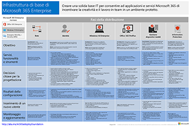
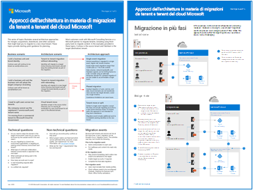
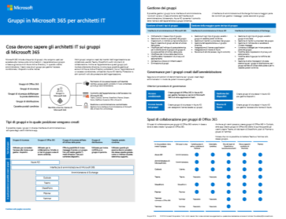

# Risorse sull'architettura IT del cloud Microsoft

 **Riepilogo:** informazioni sui concetti principali dell'architettura cloud per l'identità, la sicurezza, la rete e l'ambiente ibrido Microsoft. Controllare i suggerimenti sugli elementi consigliati per la protezione dei file, delle identità e dei dispositivi nel cloud Microsoft. Informazioni su come implementare un desktop protetto e moderno con Windows 10 e Office ProPlus.
  
Questi poster e strumenti dell'architettura forniscono informazioni sui servizi cloud Microsoft, tra cui Office 365, Windows 10, Azure Active Directory, Microsoft Intune, Microsoft Dynamics 365 e soluzioni cloud e locali ibride. Decision maker ed esperti IT possono usare queste risorse per determinare le soluzioni ideali per i propri carichi di lavoro e prendere decisioni sulla base di componenti dell'infrastruttura, quali sicurezza e identità. 
  
<!--**[Microsoft's Enterprise Cloud Roadmap](microsoft-cloud-it-architecture-resources.md#roadmap)** (Sway) -->
    
- **[Cloud Microsoft per Enterprise Architect Series](microsoft-cloud-it-architecture-resources.md#cloudarch)** 
    <!-- [Microsoft Cloud Services and Platform Options](microsoft-cloud-it-architecture-resources.md#platformoptions) -->
    - [Identità cloud Microsoft per Enterprise Architects](microsoft-cloud-it-architecture-resources.md#identity)
    - [Sicurezza cloud Microsoft per Enterprise Architects](microsoft-cloud-it-architecture-resources.md#security)
    - [Rete cloud Microsoft per Enterprise Architects](microsoft-cloud-it-architecture-resources.md#networking)
    - [Cloud ibrido Microsoft per Enterprise Architects](microsoft-cloud-it-architecture-resources.md#hybrid)
    - [Attacchi comuni e funzionalità di Microsoft che proteggono l'organizzazione](#common-attacks-and-microsoft-capabilities-that-protect-your-organization)
    - [Infrastruttura di base di Microsoft 365 Enterprise](#m365foundationinfra)
    - [Approcci dell'architettura in materia di migrazioni da tenant a tenant del cloud Microsoft](#architecture-approaches-for-microsoft-cloud-tenant-to-tenant-migrations)
    
- **[Serie di soluzioni di Microsoft 365 Enterprise](microsoft-cloud-it-architecture-resources.md#BKMK_o365solutions)**:
    - [Microsoft Teams e servizi di produttività correlati in Microsoft 365 per architetti IT](#microsoft-teams-and-related-productivity-services-in-microsoft-365-for-it-architects)
    - [Gruppi in Microsoft 365 per architetti IT](#groups-in-microsoft-365-for-it-architects)
    - [Protezione di dispositivi e identità per Office 365](microsoft-cloud-it-architecture-resources.md#BKMK_O365IDP)
    - [Soluzioni per la protezione dei file in Office 365](microsoft-cloud-it-architecture-resources.md#BKMK_O365fileprotect)
    - [Information Protection di Office 365 per il GDPR](#office-365-information-protection-for-gdpr)
    - [Guida sulla sicurezza Microsoft per organizzazioni che si occupano della campagna politica, no profit e altre organizzazioni Agile](#microsoft-security-guidance-for-political-campaigns-nonprofits-and-other-agile-organizations)
    - [Soluzioni di telefonia Microsoft](#microsoft-telephony-solutions) 
    - [Distribuire un desktop protetto e moderno con Microsoft](microsoft-cloud-it-architecture-resources.md#msd)
    
Inviare commenti e suggerimenti all'indirizzo [cloudadopt@microsoft.com](mailto:cloudadopt@microsoft.com). 

<!--

## Microsoft's Enterprise Cloud Roadmap

See the posters, icon sets, community venues, and other resources that describe the industry's most complete cloud solution.
  
|**Item**|**Description**|
|:-----|:-----|
|[          ](https://aka.ms/cloudarchitecture)   [Microsoft's Enterprise Cloud Roadmap](https://aka.ms/cloudarchitecture) (https://aka.ms/cloudarchitecture)   |Swipe through this Sway experience for the resources that describe the industry's most complete cloud solution.    |
-->
  

## Microsoft Cloud per Enterprise Architects Series

Questi poster e strumenti dell'architettura forniscono informazioni sui servizi cloud Microsoft, tra cui Office 365, Azure Active Directory, Microsoft Intune, Microsoft Dynamics CRM Online e soluzioni cloud e locali ibride. decision maker ed esperti IT possono usare queste risorse per determinare le soluzioni ideali per i propri carichi di lavoro e prendere decisioni sulla base di componenti dell'infrastruttura, quali sicurezza e identità.

<!--  

### Microsoft Cloud Services and Platform Options

Learn key differences between Microsoft cloud services and platform offerings. Find the best fit for your solution.
  
|**Item**|**Description**|
|:-----|:-----|
|[          ](https://www.microsoft.com/download/details.aspx?id=54432)   [PDF](https://go.microsoft.com/fwlink/p/?LinkId=524731)  \| [Visio](https://go.microsoft.com/fwlink/p/?LinkId=524732)  \| [More languages](https://www.microsoft.com/download/details.aspx?id=54432)   | This model describes: <ul><li>  Software as a Service (SaaS) offerings, including Office 365 </li><li>  Platform as a Service (PaaS) features in Microsoft Azure </li><li>  Infrastructure as a Service (IaaS) features in Microsoft Azure </li><li>  Private cloud datacenter capabilities using Windows Server and System Center </li><li>  Learn how Microsoft's own IT department is migrating to these cloud services and building its hybrid cloud. </li></ul> |
-->

   

### Identità cloud Microsoft per Enterprise Architect

Cosa devono sapere gli architetti IT sulla progettazione di identità per le organizzazioni che utilizzano i servizi cloud e le piattaforme Microsoft.
  
|**Elemento**|**Descrizione**|
|:-----|:-----|
|[          ](https://www.microsoft.com/download/details.aspx?id=54431)   [PDF](https://go.microsoft.com/fwlink/p/?LinkId=524586) \| [Visio](https://download.microsoft.com/download/2/3/8/238228E6-9017-4F6C-BD3C-5559E6708F82/MSFT_cloud_architecture_identity.vsd) \| [Altre lingue](https://www.microsoft.com/download/details.aspx?id=54431)   | Questo modello contiene: <ul><li>Introduzione all'identità con il cloud di Microsoft </li><li>Funzionalità IDaaS di Azure AD </li><li>Integrazione di account Active Directory Domain Services locali con Microsoft Azure Active Directory </li><li>Inserimento di componenti di directory in Azure </li><li>Opzioni dei servizi di dominio per i carichi di lavoro in IaaS di Azure </li></ul> |
   

### Sicurezza cloud Microsoft per Enterprise Architects

Cosa devono sapere gli architetti IT sulla sicurezza dei servizi e delle piattaforme cloud Microsoft.
  
|**Elemento**|**Descrizione**|
|:-----|:-----|
|[          ](https://www.microsoft.com/download/details.aspx?id=48121)   [PDF](https://go.microsoft.com/fwlink/p/?linkid=842070) \| [Visio](https://go.microsoft.com/fwlink/p/?LinkId=842071) \| [Altre lingue](https://www.microsoft.com/download/details.aspx?id=48121)   | Questo modello contiene: <ul><li>Ruolo di Microsoft nell'offerta di servizi e piattaforme sicuri</li><li>Responsabilità del cliente per ridurre i rischi per la sicurezza</li><li>Certificazioni di sicurezza principali </li><li>Offerte sulla sicurezza proposte da servizi di consulenza Microsoft </ul> |
   

### Rete cloud Microsoft per Enterprise Architects

Cosa devono sapere gli architetti IT della rete per i servizi cloud e le piattaforme Microsoft.
  
|**Elemento**|**Descrizione**|
|:-----|:-----|
|[          ](https://www.microsoft.com/download/details.aspx?id=54425)   [PDF](https://go.microsoft.com/fwlink/p/?linkid=842073) \| [Visio](https://go.microsoft.com/fwlink/p/?linkid=842074) \| [Altre lingue](https://www.microsoft.com/download/details.aspx?id=54425)   | Questo modello contiene: <ul><li> Trasformazione della rete per la connettività cloud </li><li> Elementi comuni della connettività cloud Microsoft </li><li> ExpressRoute per la connettività cloud Microsoft </li><li> Progettazione di rete per Microsoft SaaS, Azure PaaS e Azure IaaS </li></ul>    |
   

### Cloud ibrido Microsoft per Enterprise Architect

Cosa devono sapere gli architetti IT del cloud ibrido per i servizi cloud e le piattaforme Microsoft.
  
|**Elemento**|**Descrizione**|
|:-----|:-----|
|[          ](https://www.microsoft.com/download/details.aspx?id=54424)   [PDF](https://go.microsoft.com/fwlink/p/?linkid=842082) \| [Visio](https://go.microsoft.com/fwlink/p/?linkid=842083) \| [Altre lingue](https://www.microsoft.com/download/details.aspx?id=54424)   | Questo modello contiene: <ul><li> Offerte cloud Microsoft (SaaS, Azure PaaS e Azure IaaS) e relativi elementi comuni </li><li> Architettura cloud ibrida per le offerte cloud Microsoft </li><li> Scenari cloud ibridi per Microsoft SaaS (Office 365), Azure PaaS e Azure IaaS </li></ul> |
   

### Attacchi comuni e funzionalità di Microsoft che proteggono l'organizzazione
Informazioni sugli attacchi informatici più comuni e su come Microsoft è in grado di supportare l'organizzazione in tutte le fasi di un attacco. 

|**Elemento**|**Descrizione**|
|:-----|:-----|
|   [PDF](https://download.microsoft.com/download/F/A/C/FACFC1E9-FA35-4DF1-943C-8D4237B4275B/MSFT_Cloud_architecture_security_commonattacks.pdf) \| [Visio](https://download.microsoft.com/download/F/A/C/FACFC1E9-FA35-4DF1-943C-8D4237B4275B/MSFT_Cloud_architecture_security_commonattacks.vsdx)   | Questo poster illustra il percorso degli attacchi comuni e descrive le funzionalità che consentono di bloccare i pirati informatici in ogni fase di un attacco.  |

### Infrastruttura di base di Microsoft 365 Enterprise

Ottenere una visualizzazione immediata dell'[infrastruttura di base](https://docs.microsoft.com/microsoft-365/enterprise/deploy-foundation-infrastructure) per Microsoft 365 Enterprise per avviare la distribuzione.
  
|**Elemento**|**Descrizione**|
|:-----|:-----|
|   [Visualizza online](https://aka.ms/m365efoundinfraposter) \| [PDF](https://github.com/MicrosoftDocs/microsoft-365-docs/raw/public/microsoft-365/enterprise/media/deploy-foundation-infrastructure/Microsoft365EnterpriseFoundInfra.pdf)   | Questo poster riepiloga ogni fase dell'infrastruttura di base in termini di obiettivi, funzionalità e strumenti, scelte progettuali, risultati della configurazione, onboarding, monitoraggio continuo e aggiornamenti.  | 

### Approcci dell'architettura in materia di migrazioni da tenant a tenant del cloud Microsoft 
Questa serie di argomenti illustra diversi approcci dell'architettura in materia di fusioni, acquisizioni, cessioni e altri scenari che potrebbero indurre la migrazione in un nuovo tenant del cloud. Questi argomenti forniscono le indicazioni da cui partire per la pianificazione.

|**Elemento**|**Descrizione**|
|:-----|:-----|
|   [PDF](downloads/Microsoft-365-tenant-to-tenant-migration.pdf) \| [Visio](https://github.com/MicrosoftDocs/OfficeDocs-Enterprise/raw/live/Enterprise/downloads/Microsoft-365-tenant-to-tenant-migration.vsdx)     |Questo modello contiene: <ul><li>Un mapping di scenari da quelli aziendali a quelli dettati dagli approcci dell'architettura</li><li>Considerazioni sulla progettazione</li><li>Flusso di migrazione singolo</li><li>Flusso di migrazione in più fasi</li><li>Spostamento di tenant o flusso diviso</li></ul>|

## Serie di soluzioni di Microsoft 365 Enterprise

La serie di soluzioni di Microsoft 365 Enterprise fornisce indicazioni per l'implementazione delle funzionalità di Microsoft 365, in particolare quando si combinano funzionalità e tecnologie.

### Microsoft Teams e servizi di produttività correlati in Microsoft 365 per architetti IT
L'architettura logica dei servizi di produttività in Microsoft 365, con Microsoft Teams.

|**Elemento**|**Descrizione**|
|:-----|:-----|
|   [PDF](downloads/msft-m365-teams-logical-architecture.pdf) \| [Visio](https://github.com/MicrosoftDocs/OfficeDocs-Enterprise/raw/live/Enterprise/downloads/msft-m365-teams-logical-architecture.vsdx)     |Microsoft offre una serie di servizi di produttività che interagiscono tra loro per offrire esperienze di collaborazione con governance dei dati, sicurezza e conformità integrate.    Questa serie di immagini consente di visualizzare l'architettura logica di servizi di produttività per enterprise architect, con Microsoft Teams.|

### Gruppi in Microsoft 365 per architetti IT
Cosa devono sapere gli architetti IT sui gruppi di Microsoft 365

|**Elemento**|**Descrizione**|
|:-----|:-----|
|   [PDF](downloads/msft-m365-groups.pdf) \| [Visio](https://github.com/MicrosoftDocs/OfficeDocs-Enterprise/raw/live/Enterprise/downloads/msft-m365-groups.vsdx) |Queste immagini mostrano dettagliatamente i diversi gruppi, come questi vengono creati e gestiti, e alcuni consigli di governance.|

   

### Protezione di dispositivi e identità per Office 365

Funzionalità consigliate per proteggere le identità e i dispositivi che accedono a Office 365, ad altri servizi SaaS e ad applicazioni locali pubblicate con proxy di applicazione Azure AD.
  
|**Elemento**|**Descrizione**|
|:-----|:-----|
|[          ](https://www.microsoft.com/download/details.aspx?id=55032)   [PDF](https://go.microsoft.com/fwlink/p/?linkid=841656) \| [Visio](https://go.microsoft.com/fwlink/p/?linkid=841657) \| [Altre lingue](https://www.microsoft.com/download/details.aspx?id=55032)   |È importante utilizzare livelli di protezione coerenti tra dati, identità e dispositivi. Questo documento illustra quali funzionalità sono confrontabili con ulteriori informazioni sulle capacità per proteggere identità e dispositivi.    |
   

### Soluzioni per la protezione dei file in Office 365

Funzionalità consigliate per la protezione dei file in Office 365 in base a tre livelli di riservatezza diversi.
  
|**Elemento**|**Descrizione**|
|:-----|:-----|
|[          ](https://www.microsoft.com/download/details.aspx?id=55523)   [PDF](https://go.microsoft.com/fwlink/?linkid=2004320) \| [Visio](https://download.microsoft.com/download/7/8/9/789645A5-BD10-4541-BC33-F8D1EFF5E911/MSFT_cloud_architecture_O365%20file%20protection.vsdx)   |È importante usare livelli di protezione coerenti tra dati, identità e dispositivi. Questo documento illustra quali funzionalità sono confrontabili con ulteriori informazioni sulle capacità per proteggere file in Office 365.    |
   

### Protezione delle informazioni di Office 365 per il GDPR

Suggerimenti normativi per individuare, classificare, proteggere e monitorare i dati personali. Questa soluzione usa come esempio il GDPR, ma è possibile applicare lo stesso processo per raggiungere la conformità con molti altri regolamenti.

|**Elemento**|**Descrizione**|
|:-----|:-----|
|    [PDF](https://download.microsoft.com/download/E/C/D/ECD5A339-EF10-4420-B3A9-99098884D716/MSFT_Cloud_architecture_information%20protection%20for%20GDPR.pdf) \| [Visio](https://download.microsoft.com/download/E/C/D/ECD5A339-EF10-4420-B3A9-99098884D716/MSFT_Cloud_architecture_information%20protection%20for%20GDPR.vsdx)    |Per visualizzare il contenuto sotto forma di articolo, vedere [Protezione delle informazioni di Office 365 per il GDPR](https://docs.microsoft.com/Office365/SecurityCompliance/office-365-information-protection-for-gdpr).      |

### Guida sulla sicurezza Microsoft per organizzazioni che si occupano della campagna politica, no profit e altre organizzazioni Agile 

Questa guida descrive come implementare un ambiente cloud protetto. Può essere usata da qualsiasi organizzazione. Include informazioni aggiuntive per le organizzazioni Agile con accesso BYOD e account guest. È possibile usare questa guida come punto di partenza per la progettazione del proprio ambiente.

|**Elemento**|**Descrizione**|
|:-----|:-----|
|**Guida alla sicurezza Microsoft per le campagne politiche**      [PDF](https://download.microsoft.com/download/B/4/D/B4D520C3-4D0C-4B4D-BFB9-09F0651C2775/MSFT_Cloud_architecture_security%20for%20political%20campaigns.pdf) \| [Visio](https://download.microsoft.com/download/B/4/D/B4D520C3-4D0C-4B4D-BFB9-09F0651C2775/MSFT_Cloud_architecture_security%20for%20political%20campaigns.vsdx)   |La seguente guida utilizza un esempio di organizzazione della campagna politica. Utilizzare questa guida come punto di partenza per qualsiasi ambiente.    |
|**Guida alla sicurezza Microsoft per le organizzazioni no profit**      [PDF](https://download.microsoft.com/download/9/4/3/94389612-C679-4061-8DF2-D9A15D72B65F/Microsoft_Cloud%20Architecture_Security%20for%20Nonprofits.pdf) \| [Visio](https://download.microsoft.com/download/9/4/3/94389612-C679-4061-8DF2-D9A15D72B65F/Microsoft_Cloud%20Architecture_Security%20for%20Nonprofits.vsdx)   |Questa guida è stata leggermente modificata per le organizzazioni no profit. Ad esempio, fa riferimento ai piani di Office 365 Nonprofit. Le indicazioni tecniche sono identiche a quelle fornite nella guida alle soluzioni per le campagne politiche.    |

Questa guida include le guide al lab di test (TLG). Per altre informazioni, vedere [Guida sulla sicurezza Microsoft per organizzazioni che si occupano della campagna politica, no profit e altre organizzazioni Agile](https://docs.microsoft.com/Office365/SecurityCompliance/microsoft-security-guidance-for-political-campaigns-nonprofits-and-other-agile-o).

### Soluzioni di telefonia Microsoft

Microsoft supporta diverse opzioni per iniziare il viaggio verso l'implementazione di Teams nel cloud Microsoft. Questo poster è utile per decidere la soluzione di telefonia Microsoft (Sistema telefonico nel cloud o VoIP aziendale in locale) più adatta per gli utenti dell'organizzazione e per stabilire in che modo l'organizzazione si connetterà alla rete PSTN (Public Switched Telephone Network).

  
[PDF](https://github.com/MicrosoftDocs/OfficeDocs-SkypeForBusiness/blob/live/Teams/downloads/telephony-solutions/microsoft-telephony-solutions-12-18.pdf) | [Visio](https://github.com/MicrosoftDocs/OfficeDocs-SkypeForBusiness/blob/live/Teams/downloads/telephony-solutions/microsoft-telephony-solutions-12-18.vsdx) 

Per altre informazioni, vedere l'articolo correlato a questo poster: [Soluzioni di telefonia Microsoft](https://docs.microsoft.com/SkypeForBusiness/hybrid/msft-telephony-solutions).
  

### Distribuire un desktop protetto e moderno con Microsoft

Cosa devono sapere gli architetti IT della distribuzione e della gestione degli aggiornamenti per Office 365 ProPlus su Windows 10.
  
|**Elemento**|**Descrizione**|
|:-----|:-----|
|[          ](https://www.microsoft.com/download/details.aspx?id=55987)   [PDF](https://download.microsoft.com/download/4/E/9/4E90E227-770A-41D1-99FE-925A64D81A55/MSFT_modern_secure_desktop.pdf) \| [Visio](https://download.microsoft.com/download/4/E/9/4E90E227-770A-41D1-99FE-925A64D81A55/MSFT_modern_secure_desktop.vsdx)   | Questo modello contiene: <ul><li>  Distribuzione di Windows 10 e Office ProPlus dal cloud Microsoft </li><li>  Distribuzione di Windows 10 e Office ProPlus con System Center Configuration Manager </li><li>  Gestione degli aggiornamenti per Windows 10 e Office ProPlus dal cloud Microsoft </li><li>  Gestione degli aggiornamenti per Windows 10 e Office ProPlus con System Center Configuration Manager </li><li>  Funzionalità di protezione predefinite e aggiuntive di Windows 10 </li></ul>  |
   
## Vedere anche

[Modelli architetturali per SharePoint, Exchange, Skype for Business e Lync](architectural-models-for-sharepoint-exchange-skype-for-business-and-lync.md)
  
[Test Lab Guide (TLG) di adozione cloud](cloud-adoption-test-lab-guides-tlgs.md)
  
[Soluzioni di sicurezza](security-solutions.md)
  
[Soluzioni ibride](hybrid-solutions.md)

