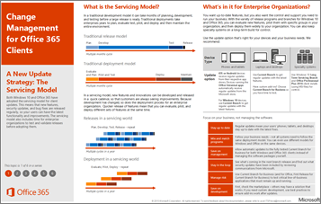

# Risorse sull'architettura IT del cloud Microsoft

 **Riepilogo:** Acquisire informazioni su servizi cloud Microsoft e opzioni delle piattaforme. Rivedere la guida di orientamento del cloud aziendale, esplorare serie di architetture cloud e altro ancora.
  
Questi poster e strumenti dell'architettura forniscono informazioni su servizi e piattaforme Microsoft Cloud, tra cui Office 365, Microsoft Azure, Microsoft Intune, Microsoft Dynamics 365, datacenter cloud privato e soluzioni cloud e locali ibride. Progettisti e architetti IT possono usare queste risorse per determinare le soluzioni ideali per i propri carichi di lavoro e prendere decisioni sulla base di componenti dell'infrastruttura, quali sicurezza e identità. 
  
- **[Guida di orientamento del cloud aziendale Microsoft](microsoft-cloud-it-architecture-resources.md#roadmap)** (Sway)
    
- **[Microsoft Cloud per Enterprise Architects Series](microsoft-cloud-it-architecture-resources.md#cloudarch)** che include i poster di[Servizi cloud Microsoft e opzioni della piattaforma](microsoft-cloud-it-architecture-resources.md#platformoptions), [Identità cloud Microsoft per Enterprise Architects](microsoft-cloud-it-architecture-resources.md#identity), [Sicurezza cloud Microsoft per Enterprise Architects](microsoft-cloud-it-architecture-resources.md#security), [Rete cloud Microsoft per Enterprise Architects](microsoft-cloud-it-architecture-resources.md#networking), [Sicurezza e mobilità Microsoft per Enterprise Architects](microsoft-cloud-it-architecture-resources.md#mobility), [Archiviazione cloud Microsoft per Enterprise Architects](microsoft-cloud-it-architecture-resources.md#storage), [Cloud ibrido Microsoft per Enterprise Architects](microsoft-cloud-it-architecture-resources.md#hybrid) e[Contoso nel Microsoft Cloud](microsoft-cloud-it-architecture-resources.md#contoso).
    
- **[Serie di soluzioni di Office 365 Enterprise](microsoft-cloud-it-architecture-resources.md#BKMK_o365solutions)** che include[Information Protection per Office 365](microsoft-cloud-it-architecture-resources.md#BKMK_infoprotect), [Identity and Device Protection per Office 365](microsoft-cloud-it-architecture-resources.md#BKMK_O365IDP), [Soluzioni per la protezione dei file in Office 365](microsoft-cloud-it-architecture-resources.md#BKMK_O365fileprotect), [Modificare la gestione dei client di Office 365](microsoft-cloud-it-architecture-resources.md#changemgmt) e[Distribuire un desktop protetto e moderno con Microsoft](microsoft-cloud-it-architecture-resources.md#msd).
    
> [!TIP]
> La maggior parte dei poster in questa pagina è disponibile in più lingue, tra cui cinese, inglese, francese, tedesco, italiano, giapponese, coreano, portoghese, russo e spagnolo. Per scaricare un poster in una di queste lingue, scegliere il collegamento **Altre lingue**.
  
Inviare la propria opinione via e-mail all'indirizzo [cloudadopt@microsoft.com](mailto:cloudadopt@microsoft.com). 
  
## Guida di orientamento del cloud aziendale Microsoft

Visualizzare poster, set di icone, spazio community e altre risorse che descrivono la soluzione cloud più completa del settore.
  
|**Elemento**|**Descrizione**|
|:-----|:-----|
|[          ](https://aka.ms/cloudarchitecture)   [Guida di orientamento del cloud aziendale Microsoft](https://aka.ms/cloudarchitecture) (https://aka.ms/cloudarchitecture)   |Scorrere rapidamente questa esperienza Sway per le risorse che descrivono la soluzione cloud più completa del settore.    |
   
## Microsoft Cloud per Enterprise Architects Series

Questi poster dell'architettura cloud forniscono informazioni su servizi e piattaforme Microsoft Cloud, tra cui Office 365, Microsoft Azure, Microsoft Intune, Microsoft Dynamics CRM Online, datacenter cloud privato e soluzioni cloud e locali ibride. Progettisti e architetti IT possono usare queste risorse per determinare le soluzioni ideali per i propri carichi di lavoro e prendere decisioni sulla base di componenti dell'infrastruttura, quali sicurezza e identità.
  
### Servizi cloud Microsoft e opzioni della piattaforma

Informazioni sulle differenze principali tra i servizi cloud Microsoft e le offerte della piattaforma. Trovare la soluzione ottimale.
  
|**Elemento**|**Descrizione**|
|:-----|:-----|
|[          ](https://www.microsoft.com/download/details.aspx?id=54432)   [PDF](https://go.microsoft.com/fwlink/p/?LinkId=524731) |[Visio](https://go.microsoft.com/fwlink/p/?LinkId=524732) |[Altre lingue](https://www.microsoft.com/download/details.aspx?id=54432)   | Questo modello illustra:    Offerte SaaS (Software come servizio), tra cui Office 365    Funzioni PaaS (Piattaforma come servizio) in Microsoft Azure    Funzioni IaaS (Infrastruttura come servizio) in Microsoft Azure    Funzionalità di datacenter cloud privati tramite Windows Server e System Center    Informazioni su come il reparto IT Microsoft esegue la migrazione a questi servizi cloud, creando il proprio cloud ibrido.   |
   
### Identità cloud Microsoft per Enterprise Architects

Cosa devono sapere gli architetti IT sulla progettazione di identità per le organizzazioni che utilizzano i servizi cloud e le piattaforme Microsoft.
  
|**Elemento**|**Descrizione**|
|:-----|:-----|
|[          ](https://www.microsoft.com/download/details.aspx?id=54431)   [PDF](https://go.microsoft.com/fwlink/p/?LinkId=524586) |[Visio](https://download.microsoft.com/download/2/3/8/238228E6-9017-4F6C-BD3C-5559E6708F82/MSFT_cloud_architecture_identity.vsd)          [Articolo](https://technet.microsoft.com/library/mt613459.aspx) |[Altre lingue](https://www.microsoft.com/download/details.aspx?id=54431)   | Questo modello contiene:    Uso di Azure AD come identità come provider di servizi (IDaaS)    Funzionalità IDaaS di Azure AD    Integrazione di account di servizi di dominio Active Directory locali con Microsoft Azure Active Directory    Inserimento di componenti della directory in Azure    Opzioni dei servizi di dominio per i carichi di lavoro in IaaS di Azure    Visualizzare le informazioni nel modulo dell'articolo:[Identità cloud Microsoft per Enterprise Architects](microsoft-cloud-identity-for-enterprise-architects.md).    |
   
### Sicurezza cloud Microsoft per Enterprise Architects

Cosa devono sapere gli architetti IT sulla sicurezza dei servizi e delle piattaforme cloud Microsoft.
  
|**Elemento**|**Descrizione**|
|:-----|:-----|
|[          ](https://www.microsoft.com/download/details.aspx?id=48121)   [PDF](https://go.microsoft.com/fwlink/p/?linkid=842070) |[Visio](https://go.microsoft.com/fwlink/p/?LinkId=842071) |[Altre lingue](https://www.microsoft.com/download/details.aspx?id=48121)   | Questo modello contiene:    Ruolo di Microsoft nel fornire piattaforme e servizi sicuri    Responsabilità del cliente per ridurre i rischi per la sicurezza    Certificazioni di sicurezza principali    Offerte sulla sicurezza fornite da servizi di consulenza Microsoft    Partecipare al corso Microsoft Virtual Academy sulla[sicurezza in un mondo abilitato al cloud](https://aka.ms/securecustomermva) basato su questo poster.   |
   
### Rete cloud Microsoft per Enterprise Architects

Cosa devono sapere gli architetti IT della rete per i servizi cloud e le piattaforme Microsoft.
  
|**Elemento**|**Descrizione**|
|:-----|:-----|
|[          ](https://www.microsoft.com/download/details.aspx?id=54425)   [PDF](https://go.microsoft.com/fwlink/p/?linkid=842073) |[Visio](https://go.microsoft.com/fwlink/p/?linkid=842074)          [Articolo](https://technet.microsoft.com/library/mt733214.aspx) |[Altre lingue](https://www.microsoft.com/download/details.aspx?id=54425)   | Il modello contiene le pagine seguenti:   **Trasformazione della tua rete per la connettività cloud** La migrazione cloud cambia il volume e la natura dei flussi del traffico all'interno e all'esterno di una rete aziendale. Influisce, inoltre, sugli approcci finalizzati alla mitigazione dei rischi per la sicurezza.   **Elementi comuni della connettività cloud Microsoft** L'integrazione della rete con il cloud di Microsoft consente di accedere facilmente a una vasta gamma di servizi.   **ExpressRoute per la connettività cloud Microsoft** ExpressRoute fornisce una connessione di rete a elevata velocità effettiva, dedicata e privata per il cloud Microsoft.   **Progettazione della rete per Microsoft SaaS (Office 365, Microsoft Intune e Dynamics CRM Online)** L'ottimizzazione della rete per i servizi SaaS di Microsoft richiede un'analisi approfondita della connessione Internet, dei dispositivi client e delle operazioni IT tipiche.   **Progettazione della rete per Azure PaaS** L'ottimizzazione della rete per le app PaaS di Azure necessita di una larghezza di banda Internet adeguata e può richiedere la distribuzione del traffico di rete in più siti o app.   **Progettazione della rete per Azure IaaS** Passaggi del processo di progettazione per creare una rete virtuale Azure ottimale (VNet) per l'hosting di carichi di lavoro IT basati su server, tra cui sottoreti, spazi di indirizzi, routing, DNS, bilanciamento del carico e connettività di rete locale, altri VNet e Internet.    Partecipare al nuovo corso[Ottimizzare la rete per le offerte cloud di Microsoft](https://aka.ms/optimizecloudnetworkingmva) della Microsoft Virtual Academy, basato su questo poster sull'architettura.   |
   
### Sicurezza e mobilità Microsoft per Enterprise Architects

Cosa devono sapere gli architetti IT riguardo alla mobilità con i servizi cloud e le piattaforme Microsoft.
  
|**Elemento**|**Descrizione**|
|:-----|:-----|
|[          ](https://www.microsoft.com/download/details.aspx?id=55023)   [PDF](https://go.microsoft.com/fwlink/p/?linkid=842076) |[Visio](https://go.microsoft.com/fwlink/p/?linkid=842077) |[Altre lingue](https://www.microsoft.com/download/details.aspx?id=55023)   | Microsoft fornisce supporto avanzato per produttività mobile con controlli amministrativi per proteggere dati e applicazioni.    App per dispositivi mobili Microsoft per le aziende.    Piattaforma, servizi e risorse per lo sviluppo di App per dispositivi mobili.    Gestione dell'accesso alle applicazioni basate su cloud e ai dati da dispositivi mobili.    Confronto delle funzionalità e la piattaforma di supporto per Office 365 MDM e Azure Active Directory Premium e Intune.   |
   
### Archiviazione cloud Microsoft per Enterprise Architects

Cosa devono sapere gli architetti IT delle opzioni di archiviazione per i servizi cloud e le piattaforme Microsoft.
  
|**Elemento**|**Descrizione**|
|:-----|:-----|
|[          ](https://www.microsoft.com/download/details.aspx?id=49552)   [PDF](https://go.microsoft.com/fwlink/p/?linkid=842079) |[Visio](https://go.microsoft.com/fwlink/p/?linkid=842080)          [Article](hhttps://technet.microsoft.com/library/mt842597.aspx) |[Altre lingue](https://www.microsoft.com/download/details.aspx?id=49552)   | Questo modello contiene:    Motivi per l'utilizzo di archiviazione sul cloud e scenari principali.    Opzioni di archiviazione cloud "pronte per l'uso" fornite con i servizi esistenti, da usare immediatamente e con la configurazione minima.    Opzioni di archiviazione "necessarie dell'assembly" che è possibile utilizzare come punto di partenza per la soluzione di archiviazione con configurazione aggiuntiva o codifica per un adattamento personalizzato.    "Partire da zero" con blocchi predefiniti di spazio di archiviazione per creare la propria soluzione di archiviazione o lo spazio di archiviazione per le app.   |
   
### Cloud ibrido Microsoft per Enterprise Architects

Cosa devono sapere gli architetti IT del cloud ibrido per i servizi cloud e le piattaforme Microsoft.
  
|**Elemento**|**Descrizione**|
|:-----|:-----|
|[          ](https://www.microsoft.com/download/details.aspx?id=54424)   [PDF](https://go.microsoft.com/fwlink/p/?linkid=842082) |[Visio](https://go.microsoft.com/fwlink/p/?linkid=842083)          [Articolo](https://technet.microsoft.com/library/mt750500.aspx) |[Altre lingue](https://www.microsoft.com/download/details.aspx?id=54424)   | Il modello contiene le pagine seguenti:   **Panoramica di cloud ibrido** Offerte di cloud Microsoft (SaaS, Azure PaaS e Azure IaaS) e relativi elementi comuni.   **Architettura di scenari sul cloud ibrido di Microsoft** Un diagramma dell'architettura del cloud ibrido per offerte sul cloud Microsoft, che mostra i livelli comuni di infrastruttura, rete e identità locali.   **Scenari di cloud ibrido per SaaS di Microsoft (Office 365)** Architettura di scenari ibridi per SaaS e descrizioni delle principali configurazioni ibride per Skype for Business, SharePoint Server ed Exchange Server.   **Scenari di cloud ibrido per PaaS di Azure** Architettura di scenari ibridi per PaaS di Azure, descrizione di un'applicazione ibrida per PaaS di Azure con esempio e descrizione di Estensione database di SQL Server 2016.   **Scenari di cloud ibridi per IaaS di Azure** Architettura di scenari ibridi per IaaS di Azure e descrizione di un'applicazione line-of business (LOB) ospitata in IaaS di Azure.   |
   
### Contoso nel Microsoft Cloud

Esempio di come un'organizzazione globale fittizia ma rappresentativa ha implementato offerte di cloud Microsoft, tra cui Office 365, Azure, Dynamics 365 e Intune.
  
|**Elemento**|**Descrizione**|
|:-----|:-----|
|[          ](https://www.microsoft.com/download/details.aspx?id=54427)   [PDF](https://go.microsoft.com/fwlink/p/?linkid=842085) |[Visio](https://go.microsoft.com/fwlink/p/?linkid=842086)          [Articolo](https://technet.microsoft.com/library/mt775341.aspx) |[Altre lingue](https://www.microsoft.com/download/details.aspx?id=54427)   |Esaminare il modo in cui Contoso Corporation, un complesso industriale globale con sede principale a Parigi, passa a un'infrastruttura IT con cloud e prende decisioni importanti sulla progettazione di rete, identità e sicurezza.    |
   
### Cloud Babbo Natale

Esempio di come Babbo Natale e gli elfi utilizzano offerte di cloud Microsoft per effettuare le consegne annuali.
  
|**Elemento**|**Descrizione**|
|:-----|:-----|
|[          ](https://www.microsoft.com/download/details.aspx?id=55039)   [PDF](https://go.microsoft.com/fwlink/p/?linkid=842088)   |Per stabilire chi è stato bravo e chi cattivo per la consegna dei regali il 24 dicembre, Babbo Natale e il suo reparto IT di elfi utilizzano Office 365, Azure, Dynamics 365 e Intune.    |
   
## Serie di soluzioni di Office 365 Enterprise

Le serie di soluzioni di Office 365 Enterprise forniscono indicazioni per l'implementazione delle funzionalità di Office 365, in particolare quando si combinano funzionalità e tecnologie.
  
### Information Protection per Office 365

Funzionalità per le organizzazioni aziendali finalizzate alla protezione degli asset aziendali.
  
|**Elemento**|**Descrizione**|
|:-----|:-----|
|[          ](https://www.microsoft.com/download/details.aspx?id=54429)   [PDF](http://download.microsoft.com/download/2/3/D/23D91386-8349-4F7A-9470-FD5AED861F16/MSFT_cloud_architecture_informationprotection.pdf) |[Visio](http://download.microsoft.com/download/2/3/D/23D91386-8349-4F7A-9470-FD5AED861F16/MSFT_cloud_architecture_informationprotection.vsd) |[Altre lingue](https://www.microsoft.com/download/details.aspx?id=54429)   |Microsoft fornisce il set più completo di funzionalità per proteggere gli asset aziendali. Questo modello consente alle organizzazioni di adottare un approccio metodico durante la pianificazione delle funzionalità da implementare.    |
   
### Identity and Device Protection per Office 365

Funzionalità consigliate per proteggere le identità e i dispositivi che accedono a Office 365, ad altri servizi SaaS e ad applicazioni locali pubblicate con proxy di applicazione Azure AD.
  
|**Elemento**|**Descrizione**|
|:-----|:-----|
|[          ](https://www.microsoft.com/download/details.aspx?id=55032)   [PDF](https://go.microsoft.com/fwlink/p/?linkid=841656) |[Visio](https://go.microsoft.com/fwlink/p/?linkid=841657) |[Altre lingue](https://www.microsoft.com/download/details.aspx?id=55032)   |È importante utilizzare livelli di protezione coerenti tra dati, identità e dispositivi. Questo documento illustra quali funzionalità sono confrontabili con ulteriori informazioni sulle capacità per proteggere identità e dispositivi.    |
   
### Soluzioni per la protezione dei file in Office 365

Funzionalità consigliate per la protezione dei file in Office 365 in base a tre livelli di sicurezza diversi.
  
|**Elemento**|**Descrizione**|
|:-----|:-----|
|[          ](https://www.microsoft.com/download/details.aspx?id=55523)   [PDF](http://download.microsoft.com/download/7/8/9/789645A5-BD10-4541-BC33-F8D1EFF5E911/MSFT_cloud_architecture_O365 file protection.pdf) |[Visio](http://download.microsoft.com/download/7/8/9/789645A5-BD10-4541-BC33-F8D1EFF5E911/MSFT_cloud_architecture_O365%20file%20protection.vsdx)   |È importante utilizzare livelli di protezione coerenti tra dati, identità e dispositivi. Questo documento illustra quali funzionalità sono confrontabili con ulteriori informazioni sulle capacità per proteggere file in Office 365.    |
   
### Modificare la gestione dei client di Office 365

Cosa devono sapere gli architetti IT sulla gestione di rilasci a diramazione per le applicazioni client di Office 365 e Windows 10. 
  
|**Elemento**|**Descrizione**|
|:-----|:-----|
|[          ](https://www.microsoft.com/download/details.aspx?id=49141)   [PDF](https://go.microsoft.com/fwlink/p/?LinkId=626681) |[Visio](https://go.microsoft.com/fwlink/p/?LinkId=626680)          [Articolo](https://technet.microsoft.com/library/mt584223.aspx) |[Altre lingue](https://www.microsoft.com/download/details.aspx?id=49141)   | Il modello di manutenzione per Windows 10 e le applicazioni client di Office 365    Opzioni di rilascio    Frequenza dei rilasci    Tipi di modifiche    Ruoli e responsabilità    Gestire le distribuzioni degli aggiornamenti    Visualizzare le informazioni nel modulo dell'articolo:[Change management for Office 365 clients](http://technet.microsoft.com/library/815fa1aa-0355-40b5-b7bc-cdf7d4610062.aspx).    |
   