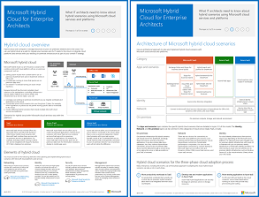
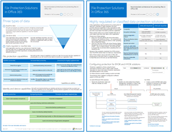

# Risorse sull'architettura IT del cloud MicrosoftMicrosoft Cloud IT architecture resources

 **Riepilogo:** Acquisire informazioni su servizi cloud Microsoft e opzioni delle piattaforme. Rivedere la guida di orientamento del cloud aziendale, esplorare serie di architetture cloud e altro ancora.**Summary:** Learn about Microsoft cloud services and platforms. Review our enterprise cloud roadmap, explore our cloud architecture series, and more.
  
Questi poster e strumenti dell'architettura forniscono informazioni su servizi e piattaforme Microsoft Cloud, tra cui Office 365, Microsoft Azure, Microsoft Intune, Microsoft Dynamics 365, datacenter cloud privato e soluzioni cloud e locali ibride. Progettisti e architetti IT possono usare queste risorse per determinare le soluzioni ideali per i propri carichi di lavoro e prendere decisioni sulla base di componenti dell'infrastruttura, quali sicurezza e identità.These architecture tools and posters give you information about Microsoft cloud services and platforms, including Office 365, Microsoft Azure, Microsoft Intune, Microsoft Dynamics 365, private cloud datacenter, and hybrid on-premises and cloud solutions. IT decision makers and architects can use these resources to determine the ideal solutions for their workloads and to make decisions about core infrastructure components such as identity and security. 
  
- **[Guida di orientamento del cloud aziendale Microsoft](microsoft-cloud-it-architecture-resources.md#roadmap)** (Sway)**[Microsoft's Enterprise Cloud Roadmap](microsoft-cloud-it-architecture-resources.md#roadmap)** (Sway)
    
- **[Microsoft Cloud per Enterprise Architects Series](microsoft-cloud-it-architecture-resources.md#cloudarch)****[Microsoft Cloud for Enterprise Architects Series](microsoft-cloud-it-architecture-resources.md#cloudarch)** 
    - [Servizi cloud Microsoft e opzioni della piattaformaMicrosoft Cloud Services and Platform Options](microsoft-cloud-it-architecture-resources.md#platformoptions)
    - [Identità di Microsoft Cloud per Enterprise ArchitectsMicrosoft Cloud Identity for Enterprise Architects](microsoft-cloud-it-architecture-resources.md#identity)
    - [Sicurezza cloud Microsoft per Enterprise ArchitectsMicrosoft Cloud Security for Enterprise Architects](microsoft-cloud-it-architecture-resources.md#security)
    - [Rete cloud Microsoft per Enterprise ArchitectsMicrosoft Cloud Networking for Enterprise Architects](microsoft-cloud-it-architecture-resources.md#networking)
    - [Sicurezza e mobilità Microsoft per Enterprise ArchitectsMicrosoft Mobility and Security for Enterprise Architects](microsoft-cloud-it-architecture-resources.md#mobility)
    - [Archiviazione cloud Microsoft per Enterprise ArchitectsMicrosoft Cloud Storage for Enterprise Architects](microsoft-cloud-it-architecture-resources.md#storage)
    - [Cloud ibrido Microsoft per Enterprise ArchitectsMicrosoft Hybrid Cloud for Enterprise Architects](microsoft-cloud-it-architecture-resources.md#hybrid)
    - [Contoso nel Microsoft CloudContoso in the Microsoft Cloud](microsoft-cloud-it-architecture-resources.md#contoso)
    - [Attacchi comuni e funzionalità di Microsoft che proteggono l'organizzazioneCommon attacks and Microsoft capabilities that protect your organizaion](#common-attacks-and-microsoft-capabilities-that-protect-your-organization)
    
- **[Serie di soluzioni di Office 365 Enterprise](microsoft-cloud-it-architecture-resources.md#BKMK_o365solutions)**:**[Office 365 Enterprise Solution Series](microsoft-cloud-it-architecture-resources.md#BKMK_o365solutions)**:
    - [Information Protection per Office 365Information Protection for Office 365](microsoft-cloud-it-architecture-resources.md#BKMK_infoprotect)
    - [Protezione di dispositivi e identità per Office 365Identity and Device Protection for Office 365](microsoft-cloud-it-architecture-resources.md#BKMK_O365IDP)
    - [Soluzioni per la protezione dei file in Office 365File Protection Solutions in Office 365](microsoft-cloud-it-architecture-resources.md#BKMK_O365fileprotect)
    - [Modificare la gestione dei client di Office 365Change Management for Office 365 Clients](microsoft-cloud-it-architecture-resources.md#changemgmt)
    - [Distribuire un desktop protetto e moderno con MicrosoftDeploy a modern and secure desktop with Microsoft](microsoft-cloud-it-architecture-resources.md#msd)
    
> [!TIP]
> La maggior parte dei poster in questa pagina è disponibile in più lingue, tra cui cinese, inglese, francese, tedesco, italiano, giapponese, coreano, portoghese, russo e spagnolo. Per scaricare un poster in una di queste lingue, scegliere il collegamento **Altre lingue**.Most of the posters on this page are available in multiple languages, including Chinese, English, French, German, Italian, Japanese, Korean, Portuguese, Russian, and Spanish. To download a poster in one of these languages, click the **More languages** link for that poster.
  
Inviare commenti e suggerimenti all'indirizzo [cloudadopt@microsoft.com](mailto:cloudadopt@microsoft.com).Let us know what you think! Send us email at [cloudadopt@microsoft.com](mailto:cloudadopt@microsoft.com). 
  

## Guida di orientamento del cloud aziendale MicrosoftMicrosoft's Enterprise Cloud Roadmap

Visualizzare poster, set di icone, spazio community e altre risorse che descrivono la soluzione cloud più completa del settore.See the posters, icon sets, community venues, and other resources that describe the industry's most complete cloud solution.
  
|**Elemento****Item**|**Descrizione****Description**|
|:-----|:-----|
|[          ](https://aka.ms/cloudarchitecture)[          ](https://aka.ms/cloudarchitecture)   [Guida di orientamento del cloud aziendale Microsoft](https://aka.ms/cloudarchitecture) (https://aka.ms/cloudarchitecture)[Microsoft's Enterprise Cloud Roadmap](https://aka.ms/cloudarchitecture) (https://aka.ms/cloudarchitecture)   |Scorrere rapidamente questa esperienza Sway per le risorse che descrivono la soluzione cloud più completa del settore.Swipe through this Sway experience for the resources that describe the industry's most complete cloud solution.    |
   

## Microsoft Cloud per Enterprise Architects SeriesMicrosoft Cloud for Enterprise Architects Series

Questi poster dell'architettura cloud forniscono informazioni su servizi e piattaforme Microsoft Cloud, tra cui Office 365, Microsoft Azure, Microsoft Intune, Microsoft Dynamics CRM Online, datacenter cloud privato e soluzioni cloud e locali ibride. Progettisti e architetti IT possono usare queste risorse per determinare le soluzioni ideali per i propri carichi di lavoro e prendere decisioni sulla base di componenti dell'infrastruttura, quali sicurezza e identità.These cloud architecture posters give you information about Microsoft cloud services and platforms, including Office 365, Microsoft Azure, Microsoft Intune, Microsoft Dynamics CRM Online, private cloud datacenter, and hybrid on-premises and cloud solutions. IT decision makers and architects can use these resources to determine the ideal solutions for their workloads and to make decisions about core infrastructure components such as identity and security.
  

### Servizi cloud Microsoft e opzioni della piattaformaMicrosoft Cloud Services and Platform Options

Informazioni sulle differenze principali tra i servizi cloud Microsoft e le offerte della piattaforma. Trovare la soluzione ottimale.Learn key differences between Microsoft cloud services and platform offerings. Find the best fit for your solution.
  
|**Elemento****Item**|**Descrizione****Description**|
|:-----|:-----|
|[          ](https://www.microsoft.com/download/details.aspx?id=54432)[          ](https://www.microsoft.com/download/details.aspx?id=54432)   [PDF](https://go.microsoft.com/fwlink/p/?LinkId=524731)  \| [Visio](https://go.microsoft.com/fwlink/p/?LinkId=524732)  \| [Altre lingue](https://www.microsoft.com/download/details.aspx?id=54432)[PDF](https://go.microsoft.com/fwlink/p/?LinkId=524731)  \| [Visio](https://go.microsoft.com/fwlink/p/?LinkId=524732)  \| [More languages](https://www.microsoft.com/download/details.aspx?id=54432)   | Questo modello illustra:This model describes: <ul><li>  Offerte SaaS (Software come servizio), tra cui Office 365Software as a Service (SaaS) offerings, including Office 365 </li><li>  Funzioni PaaS (Piattaforma come servizio) in Microsoft AzurePlatform as a Service (PaaS) features in Microsoft Azure </li><li>  Funzioni IaaS (Infrastruttura come servizio) in Microsoft AzureInfrastructure as a Service (IaaS) features in Microsoft Azure </li><li>  Funzionalità di datacenter cloud privati tramite Windows Server e System CenterPrivate cloud datacenter capabilities using Windows Server and System Center </li><li>  Informazioni su come il reparto IT Microsoft esegue la migrazione a questi servizi cloud, creando il proprio cloud ibrido.Learn how Microsoft's own IT department is migrating to these cloud services and building its hybrid cloud. </li></ul> |
   

### Identità cloud Microsoft per Enterprise ArchitectsMicrosoft Cloud Identity for Enterprise Architects

Cosa devono sapere gli architetti IT sulla progettazione di identità per le organizzazioni che utilizzano i servizi cloud e le piattaforme Microsoft.What IT architects need to know about designing identity for organizations using Microsoft cloud services and platforms.
  
|**Elemento****Item**|**Descrizione****Description**|
|:-----|:-----|
|[          ](https://www.microsoft.com/download/details.aspx?id=54431)[          ](https://www.microsoft.com/download/details.aspx?id=54431)   [PDF](https://go.microsoft.com/fwlink/p/?LinkId=524586)  \| [Visio](https://download.microsoft.com/download/2/3/8/238228E6-9017-4F6C-BD3C-5559E6708F82/MSFT_cloud_architecture_identity.vsd)           \| [Altre lingue](https://www.microsoft.com/download/details.aspx?id=54431)[PDF](https://go.microsoft.com/fwlink/p/?LinkId=524586)  \| [Visio](https://download.microsoft.com/download/2/3/8/238228E6-9017-4F6C-BD3C-5559E6708F82/MSFT_cloud_architecture_identity.vsd)  \| [More languages](https://www.microsoft.com/download/details.aspx?id=54431)   | Questo modello contiene:This model contains: <ul><li>Introduzione all'identità con il cloud di MicrosoftIntroduction to identity with Microsoft’s cloud </li> <li>Funzionalità IDaaS di Azure ADAzure AD IDaaS capabilities </li><li>Integrazione di account Active Directory Domain Services locali con Microsoft Azure Active DirectoryIntegrating on-premises Active Directory Domain Services accounts with Microsoft Azure Active Directory </li> <li>Inserimento di componenti di directory in AzurePutting directory components in Azure </li><li>Opzioni dei servizi di dominio per i carichi di lavoro in IaaS di AzureDomain services options for workloads in Azure IaaS </li></ul>  |
   

### Sicurezza cloud Microsoft per Enterprise ArchitectsMicrosoft Cloud Security for Enterprise Architects

Cosa devono sapere gli architetti IT sulla sicurezza dei servizi e delle piattaforme cloud Microsoft.What IT architects need to know about security in Microsoft cloud services and platforms.
  
|**Elemento****Item**|**Descrizione****Description**|
|:-----|:-----|
|[          ](https://www.microsoft.com/download/details.aspx?id=48121)[          ](https://www.microsoft.com/download/details.aspx?id=48121)   [PDF](https://go.microsoft.com/fwlink/p/?linkid=842070)  \| [Visio](https://go.microsoft.com/fwlink/p/?LinkId=842071)  \| [Altre lingue](https://www.microsoft.com/download/details.aspx?id=48121)[PDF](https://go.microsoft.com/fwlink/p/?linkid=842070)  \| [Visio](https://go.microsoft.com/fwlink/p/?LinkId=842071)  \| [More languages](https://www.microsoft.com/download/details.aspx?id=48121)   | Questo modello contiene:This model contains: <ul><li>Ruolo di Microsoft nell'offerta di servizi e piattaforme sicuriMicrosoft's role in providing secure services and platforms</li><li>Responsabilità del cliente per ridurre i rischi per la sicurezzaCustomer responsibilities to mitigate security risks</li><li>Certificazioni di sicurezza principaliTop security certifications </li><li>Offerte sulla sicurezza proposte da servizi di consulenza MicrosoftSecurity offerings provided by Microsoft consulting services </ul></li>Partecipare al corso Microsoft Virtual Academy sulla [sicurezza in un mondo abilitato al cloud](https://mva.microsoft.com/training-courses/security-in-a-cloudenabled-world-12725?l=CfLHobAcB_3904300474) basato su questo poster.Take [Security in a Cloud-Enabled World](https://mva.microsoft.com/training-courses/security-in-a-cloudenabled-world-12725?l=CfLHobAcB_3904300474), a Microsoft Virtual Academy course based on this architecture poster.  |
   

### Rete cloud Microsoft per Enterprise ArchitectsMicrosoft Cloud Networking for Enterprise Architects

Cosa devono sapere gli architetti IT della rete per i servizi cloud e le piattaforme Microsoft.What IT architects need to know about networking for Microsoft cloud services and platforms.
  
|**Elemento****Item**|**Descrizione****Description**|
|:-----|:-----|
|[          ](https://www.microsoft.com/download/details.aspx?id=54425)[          ](https://www.microsoft.com/download/details.aspx?id=54425)   [PDF](https://go.microsoft.com/fwlink/p/?linkid=842073)  \| [Visio](https://go.microsoft.com/fwlink/p/?linkid=842074)           \| [Articolo](https://technet.microsoft.com/library/mt733214.aspx)[PDF](https://go.microsoft.com/fwlink/p/?linkid=842073)  \| [Visio](https://go.microsoft.com/fwlink/p/?linkid=842074)           \| [Article](https://technet.microsoft.com/library/mt733214.aspx)  [Altre lingue](https://www.microsoft.com/download/details.aspx?id=54425)[More languages](https://www.microsoft.com/download/details.aspx?id=54425)   | Il modello contiene le pagine seguenti:This model contains the following pages: <ul><li> **Trasformazione della tua rete per la connettività cloud** La migrazione cloud cambia il volume e la natura dei flussi del traffico all'interno e all'esterno di una rete aziendale. Influisce, inoltre, sugli approcci finalizzati alla mitigazione dei rischi per la sicurezza.**Evolving your network for cloud connectivity** Cloud migration changes the volume and nature of traffic flows within and outside a corporate network. It also affects approaches to mitigating security risk. </li><li> **Elementi comuni della connettività cloud Microsoft** L'integrazione della rete con il cloud di Microsoft consente di accedere facilmente a una vasta gamma di servizi.**Common elements of Microsoft cloud connectivity** Integrating your networking with the Microsoft cloud provides optimal access to a broad range of services. </li><li> **ExpressRoute per la connettività cloud Microsoft** ExpressRoute fornisce una connessione di rete a elevata velocità effettiva, dedicata e privata per il cloud Microsoft.**ExpressRoute for Microsoft cloud connectivity** ExpressRoute provides a private, dedicated, high-throughput network connection to Microsoft's cloud. </li><li> **Progettazione della rete per Microsoft SaaS (Office 365, Microsoft Intune e Dynamics CRM Online)** L'ottimizzazione della rete per i servizi SaaS di Microsoft richiede un'analisi approfondita della connessione Internet, dei dispositivi client e delle operazioni IT tipiche.**Designing networking for Microsoft SaaS (Office 365, Microsoft Intune, and Dynamics CRM Online)** Optimizing your network for Microsoft SaaS services requires careful analysis of your Internet edge, your client devices, and typical IT operations. </li><li> **Progettazione della rete per Azure PaaS** L'ottimizzazione della rete per le app PaaS di Azure necessita di una larghezza di banda Internet adeguata e può richiedere la distribuzione del traffico di rete in più siti o app.**Designing networking for Azure PaaS** Optimizing networking for Azure PaaS apps requires adequate Internet bandwidth and can require the distribution of network traffic across multiple sites or apps. </li><li> **Progettazione della rete per Azure IaaS** Passaggi del processo di progettazione per creare una rete virtuale Azure ottimale (VNet) per l'hosting di carichi di lavoro IT basati su server, tra cui sottoreti, spazi di indirizzi, routing, DNS, bilanciamento del carico e connettività di rete locale, altri VNet e Internet.**Designing networking for Azure IaaS** Step through the design process to create an optimal Azure virtual network (VNet) for hosting server-based IT workloads, including subnets, address spaces, routing, DNS, load balancing, and connectivity to your on-premises network, other VNets, and the Internet. </li></ul>   Partecipare al nuovo corso [Ottimizzare la rete per le offerte cloud di Microsoft](https://aka.ms/optimizecloudnetworkingmva) della Microsoft Virtual Academy, basato su questo poster sull'architettura.Take [Optimize Your Network for Microsoft Cloud Offerings](https://aka.ms/optimizecloudnetworkingmva), a new Microsoft Virtual Academy course based on this architecture poster.   |
   

### Sicurezza e mobilità Microsoft per Enterprise ArchitectsMicrosoft Mobility and Security for Enterprise Architects

Cosa devono sapere gli architetti IT riguardo alla mobilità con i servizi cloud e le piattaforme Microsoft.What IT architects need to know about mobility with Microsoft cloud services and platforms.
  
|**Elemento****Item**|**Descrizione****Description**|
|:-----|:-----|
|[          ](https://www.microsoft.com/download/details.aspx?id=55023)[          ](https://www.microsoft.com/download/details.aspx?id=55023)   [PDF](https://go.microsoft.com/fwlink/p/?linkid=842076)  \| [Visio](https://go.microsoft.com/fwlink/p/?linkid=842077)  \| [Altre lingue](https://www.microsoft.com/download/details.aspx?id=55023)[PDF](https://go.microsoft.com/fwlink/p/?linkid=842076)  \| [Visio](https://go.microsoft.com/fwlink/p/?linkid=842077)  \| [More languages](https://www.microsoft.com/download/details.aspx?id=55023)   | Questo modello contiene:This model contains: <ul><li>Principali app per dispositivi mobili per le aziendeTop mobile apps for business </li><li>Piattaforma, servizi e risorse per lo sviluppo di app per dispositivi mobiliPlatform, services, and resources for developing mobile apps </li><li>Gestione dell'accesso alle applicazioni basate su cloud e ai dati provenienti dai dispositivi mobiliManaging access to cloud-based applications and data from mobile devices </li><li>Confronto delle funzionalità e la piattaforma di supporto per Office 365 MDM e Azure Active Directory Premium e IntuneComparison of capabilities and platform support for Office 365 MDM, Azure Active Directory Premium, and Intune </li></ul>  |
   

### Archiviazione cloud Microsoft per Enterprise ArchitectsMicrosoft Cloud Storage for Enterprise Architects

Cosa devono sapere gli architetti IT delle opzioni di archiviazione per i servizi cloud e le piattaforme Microsoft.What IT architects need to know about storage options in Microsoft cloud services and platforms.
  
|**Elemento****Item**|**Descrizione****Description**|
|:-----|:-----|
|[          ](https://www.microsoft.com/download/details.aspx?id=49552)[          ](https://www.microsoft.com/download/details.aspx?id=49552)   [PDF](https://go.microsoft.com/fwlink/p/?linkid=842079)  \| [Visio](https://go.microsoft.com/fwlink/p/?linkid=842080)           \| [Articolo](hhttps://technet.microsoft.com/library/mt842597.aspx)[PDF](https://go.microsoft.com/fwlink/p/?linkid=842079)  \| [Visio](https://go.microsoft.com/fwlink/p/?linkid=842080)           \| [Article](hhttps://technet.microsoft.com/library/mt842597.aspx)  [Altre lingue](https://www.microsoft.com/download/details.aspx?id=49552)[More languages](https://www.microsoft.com/download/details.aspx?id=49552)   | Questo modello contiene:This model contains: <ul><li>Motivi dell'uso dell'archiviazione cloud e scenari principaliReasons for using cloud storage and the key scenarios </li><li>Opzioni di archiviazione sul cloud fornite con i servizi esistentiCloud storage options that are bundled with existing services </li><li>Opzioni di archiviazione che è possibile utilizzare come punto di partenza per la propria soluzione di archiviazioneStorage options that you can use as a starting point for your storage solution </li><li>Blocchi predefiniti di spazio di archiviazione per creare la propria soluzione di archiviazione o lo spazio di archiviazione per le appStorage building blocks to create your own storage solution or storage for your apps</li></ul> |
   

### Cloud ibrido Microsoft per Enterprise ArchitectsMicrosoft Hybrid Cloud for Enterprise Architects

Cosa devono sapere gli architetti IT del cloud ibrido per i servizi cloud e le piattaforme Microsoft.What IT architects need to know about hybrid cloud for Microsoft services and platforms.
  
|**Elemento****Item**|**Descrizione****Description**|
|:-----|:-----|
|[          ](https://www.microsoft.com/download/details.aspx?id=54424)[          ](https://www.microsoft.com/download/details.aspx?id=54424)   [PDF](https://go.microsoft.com/fwlink/p/?linkid=842082)  \| [Visio](https://go.microsoft.com/fwlink/p/?linkid=842083)           \| [Articolo](https://technet.microsoft.com/library/mt750500.aspx)[PDF](https://go.microsoft.com/fwlink/p/?linkid=842082)  \| [Visio](https://go.microsoft.com/fwlink/p/?linkid=842083)           \| [Article](https://technet.microsoft.com/library/mt750500.aspx)  [Altre lingue](https://www.microsoft.com/download/details.aspx?id=54424)[More languages](https://www.microsoft.com/download/details.aspx?id=54424)   | Il modello contiene le pagine seguenti:This model contains the following pages: <ul><li> **Panoramica di cloud ibrido** Offerte di cloud Microsoft (SaaS, Azure PaaS e Azure IaaS) e relativi elementi comuni.**Hybrid cloud overview** Microsoft's cloud offerings (SaaS, Azure PaaS, and Azure IaaS) and their common elements. </li><li> **Architettura di scenari sul cloud ibrido di Microsoft** Un diagramma dell'architettura del cloud ibrido per offerte sul cloud Microsoft, che mostra i livelli comuni di infrastruttura, rete e identità locali.**Architecture of Microsoft hybrid cloud scenarios** An architectural diagram of hybrid cloud for Microsoft's cloud offerings, showing the common layers of on-premises infrastructure, networking, and identity. </li><li> **Scenari di cloud ibrido per SaaS di Microsoft (Office 365)** Architettura di scenari ibridi per SaaS e descrizioni delle principali configurazioni ibride per Skype for Business, SharePoint Server ed Exchange Server.**Hybrid cloud scenarios for Microsoft SaaS (Office 365)** The SaaS hybrid scenario architecture and descriptions of key hybrid configurations for Skype for Business, SharePoint Server, and Exchange Server. </li><li> **Scenari di cloud ibrido per PaaS di Azure** Architettura di scenari ibridi per PaaS di Azure, descrizione di un'applicazione ibrida per PaaS di Azure con esempio e descrizione di Estensione database di SQL Server 2016.**Hybrid cloud scenarios for Azure PaaS** The Azure PaaS hybrid scenario architecture, the description of an Azure PaaS hybrid application with an example, and the description of SQL Server 2016 Stretch Database. </li><li> **Scenari di cloud ibridi per IaaS di Azure** Architettura di scenari ibridi per IaaS di Azure e descrizione di un'applicazione line-of business (LOB) ospitata in IaaS di Azure.**Hybrid cloud scenarios for Azure IaaS** The Azure IaaS hybrid scenario architecture and the description of a line of business (LOB) application hosted in Azure IaaS. </li></ul> |
   

### Contoso nel Microsoft CloudContoso in the Microsoft Cloud

Esempio di come un'organizzazione globale fittizia ma rappresentativa ha implementato offerte di cloud Microsoft, tra cui Office 365, Azure, Dynamics 365 e Intune.How a fictional but representative global organization has implemented Microsoft's cloud offerings, including Office 365, Azure, Dynamics 365, and Intune.
  
|**Elemento****Item**|**Descrizione****Description**|
|:-----|:-----|
|[          ](https://www.microsoft.com/download/details.aspx?id=54427)[          ](https://www.microsoft.com/download/details.aspx?id=54427)   [PDF](https://go.microsoft.com/fwlink/p/?linkid=842085)  \| [Visio](https://go.microsoft.com/fwlink/p/?linkid=842086)           \| [Articolo](https://technet.microsoft.com/library/mt775341.aspx)[PDF](https://go.microsoft.com/fwlink/p/?linkid=842085)  \| [Visio](https://go.microsoft.com/fwlink/p/?linkid=842086)           \| [Article](https://technet.microsoft.com/library/mt775341.aspx)  [Altre lingue](https://www.microsoft.com/download/details.aspx?id=54427)[More languages](https://www.microsoft.com/download/details.aspx?id=54427)   |Questo modello contiene:This model contains: <ul><li>Panoramica di Contoso CorporationOverview of the Contoso Corporation </li><li>Infrastruttura IT ed esigenze di ContosoContoso's IT infrastructure and needs </li><li>Risorse di rete sul cloud per ContosoCloud networking for Contoso</li><li>Identità sul cloud per ContosoCloud identity for Contoso</li><li>Sottoscrizioni, licenze e account utente di ContosoContoso's subscriptions, licenses, and user accounts</li><li>Sicurezza sul cloud per ContosoCloud security for Contoso</li><li>Scenari di cloud aziendale per ContosoEnterprise cloud scenarios for Contoso</li></ul>  |
   

### Attacchi comuni e funzionalità di Microsoft che proteggono l'organizzazioneCommon attacks and Microsoft capabilities that protect your organization
Informazioni sugli attacchi informatici più comuni e su come Microsoft è in grado di supportare l'organizzazione in tutte le fasi di un attacco.Learn about the most common cyber attacks and how Microsoft can help your organization at every stage of an attack. 

|**Elemento****Item**|**Descrizione****Description**|
|:-----|:-----|
|   [PDF](http://download.microsoft.com/download/F/A/C/FACFC1E9-FA35-4DF1-943C-8D4237B4275B/MSFT_Cloud_architecture_security_commonattacks.pdf) \| [Visio](http://download.microsoft.com/download/F/A/C/FACFC1E9-FA35-4DF1-943C-8D4237B4275B/MSFT_Cloud_architecture_security_commonattacks.vsdx)[PDF](http://download.microsoft.com/download/F/A/C/FACFC1E9-FA35-4DF1-943C-8D4237B4275B/MSFT_Cloud_architecture_security_commonattacks.pdf) \| [Visio](http://download.microsoft.com/download/F/A/C/FACFC1E9-FA35-4DF1-943C-8D4237B4275B/MSFT_Cloud_architecture_security_commonattacks.vsdx)   | Questo poster illustra il percorso degli attacchi comuni e descrive le funzionalità che consentono di bloccare i pirati informatici in ogni fase di un attacco.This poster illustrates the path of common attacks and describes which capabilities help stop attackers at each stage of an attack.  |

### Cloud Babbo NataleThe Santa Cloud

Esempio di come Babbo Natale e gli elfi utilizzano offerte di cloud Microsoft per effettuare le consegne annuali.How Santa and his elves use Microsoft's cloud offerings to make their annual deliveries.
  
|**Elemento****Item**|**Descrizione****Description**|
|:-----|:-----|
|[          ](https://www.microsoft.com/download/details.aspx?id=55039)[          ](https://www.microsoft.com/download/details.aspx?id=55039)   [PDF](https://go.microsoft.com/fwlink/p/?linkid=842088)[PDF](https://go.microsoft.com/fwlink/p/?linkid=842088)   |Per stabilire chi è stato bravo e chi cattivo per la consegna dei regali il 24 dicembre, Babbo Natale e il suo reparto IT di elfi utilizzano Office 365, Azure, Dynamics 365 e Intune.To determine who is naughty and nice and the presents to deliver on December 24, Santa Claus and his elfin IT department use Office 365, Azure, Dynamics 365, and Intune.   |
   

## Serie di soluzioni di Office 365 EnterpriseOffice 365 Enterprise Solution Series

Le serie di soluzioni di Office 365 Enterprise forniscono indicazioni per l'implementazione delle funzionalità di Office 365, in particolare quando si combinano funzionalità e tecnologie.The Office 365 enterprise solution series provides guidance for implementing Office 365 capabilities, especially where capabilities cross technologies.
  

### Information Protection per Office 365Information Protection for Office 365

Funzionalità per le organizzazioni aziendali finalizzate alla protezione degli asset aziendali.Capabilities for enterprise organizations to protect corporate assets.
  
|**Elemento****Item**|**Descrizione****Description**|
|:-----|:-----|
|[          ](https://www.microsoft.com/download/details.aspx?id=54429)[          ](https://www.microsoft.com/download/details.aspx?id=54429)   [PDF](http://download.microsoft.com/download/2/3/D/23D91386-8349-4F7A-9470-FD5AED861F16/MSFT_cloud_architecture_informationprotection.pdf)  \| [Visio](http://download.microsoft.com/download/2/3/D/23D91386-8349-4F7A-9470-FD5AED861F16/MSFT_cloud_architecture_informationprotection.vsd)  \| [Altre lingue](https://www.microsoft.com/download/details.aspx?id=54429)[PDF](http://download.microsoft.com/download/2/3/D/23D91386-8349-4F7A-9470-FD5AED861F16/MSFT_cloud_architecture_informationprotection.pdf)  \| [Visio](http://download.microsoft.com/download/2/3/D/23D91386-8349-4F7A-9470-FD5AED861F16/MSFT_cloud_architecture_informationprotection.vsd)  \| [More languages](https://www.microsoft.com/download/details.aspx?id=54429)   |Microsoft fornisce il set più completo di funzionalità per proteggere gli asset aziendali. Questo modello consente alle organizzazioni di adottare un approccio metodico durante la pianificazione delle funzionalità da implementare.Microsoft provides the most complete set of capabilities to protect your corporate assets. This model helps organizations take a methodical approach when planning which capabilities to implement.   |
   

### Identity and Device Protection per Office 365Identity and Device Protection for Office 365

Funzionalità consigliate per proteggere le identità e i dispositivi che accedono a Office 365, ad altri servizi SaaS e ad applicazioni locali pubblicate con proxy di applicazione Azure AD.Recommended capabilities for protecting identities and devices that access Office 365, other SaaS services, and on-premises applications published with Azure AD Application Proxy.
  
|**Elemento****Item**|**Descrizione****Description**|
|:-----|:-----|
|[          ](https://www.microsoft.com/download/details.aspx?id=55032)[          ](https://www.microsoft.com/download/details.aspx?id=55032)   [PDF](https://go.microsoft.com/fwlink/p/?linkid=841656)  \| [Visio](https://go.microsoft.com/fwlink/p/?linkid=841657)  \| [Altre lingue](https://www.microsoft.com/download/details.aspx?id=55032)[PDF](https://go.microsoft.com/fwlink/p/?linkid=841656)  \| [Visio](https://go.microsoft.com/fwlink/p/?linkid=841657)  \| [More languages](https://www.microsoft.com/download/details.aspx?id=55032)   |È importante utilizzare livelli di protezione coerenti tra dati, identità e dispositivi. Questo documento illustra quali funzionalità sono confrontabili con ulteriori informazioni sulle capacità per proteggere identità e dispositivi.It's important to use consistent levels of protection across your data, identities, and devices. This document shows you which capabilities are comparable with more information on capabilities to protect identities and devices.    |
   

### Soluzioni per la protezione dei file in Office 365File Protection Solutions in Office 365

Funzionalità consigliate per la protezione dei file in Office 365 in base a tre livelli di sicurezza diversi.Recommended capabilities for protecting files in Office 365 based on three different sensitivity levels.
  
|**Elemento****Item**|**Descrizione****Description**|
|:-----|:-----|
|[          ](https://www.microsoft.com/download/details.aspx?id=55523)[          ](https://www.microsoft.com/download/details.aspx?id=55523)   [PDF](http://download.microsoft.com/download/7/8/9/789645A5-BD10-4541-BC33-F8D1EFF5E911/MSFT_cloud_architecture_O365 file protection.pdf)  \| [Visio](http://download.microsoft.com/download/7/8/9/789645A5-BD10-4541-BC33-F8D1EFF5E911/MSFT_cloud_architecture_O365%20file%20protection.vsdx)[PDF](http://download.microsoft.com/download/7/8/9/789645A5-BD10-4541-BC33-F8D1EFF5E911/MSFT_cloud_architecture_O365 file protection.pdf)  \| [Visio](http://download.microsoft.com/download/7/8/9/789645A5-BD10-4541-BC33-F8D1EFF5E911/MSFT_cloud_architecture_O365%20file%20protection.vsdx)   |È importante utilizzare livelli di protezione coerenti tra dati, identità e dispositivi. Questo documento illustra quali funzionalità sono confrontabili con ulteriori informazioni sulle capacità per proteggere file in Office 365.It's important to use consistent levels of protection across your data, identities, and devices. This document shows you which capabilities are comparable with more information on capabilities to protect files in Office 365.    |
   

### Modificare la gestione dei client di Office 365Change Management for Office 365 Clients

Cosa devono sapere gli architetti IT sulla gestione di rilasci per le applicazioni client di Office 365 e Windows 10.What IT architects need to know about managing releases for the Office 365 client applications and Windows 10. 
  
|**Elemento****Item**|**Descrizione****Description**|
|:-----|:-----|
|[          ](https://www.microsoft.com/download/details.aspx?id=49141)[          ](https://www.microsoft.com/download/details.aspx?id=49141)   [PDF](https://go.microsoft.com/fwlink/p/?LinkId=626681)  \| [Visio](https://go.microsoft.com/fwlink/p/?LinkId=626680)           \| [Articolo](https://technet.microsoft.com/library/mt584223.aspx)[PDF](https://go.microsoft.com/fwlink/p/?LinkId=626681)  \| [Visio](https://go.microsoft.com/fwlink/p/?LinkId=626680)           \| [Article](https://technet.microsoft.com/library/mt584223.aspx)  [Altre lingue](https://www.microsoft.com/download/details.aspx?id=49141)[More languages](https://www.microsoft.com/download/details.aspx?id=49141)   | Questo modello contiene:This model contains: <ul><li>Il modello di manutenzione per Windows 10 e le applicazioni client di Office 365The servicing model for Windows 10 and the Office 365 client applications </li><li>  Opzioni di rilascioRelease Options </li><li>  Frequenza dei rilasciRelease Cadences </li><li>  Tipi di modificheTypes of Changes </li><li>  Ruoli e responsabilitàRoles and Responsibilities </li><li>  Gestire le distribuzioni degli aggiornamentiManage Update Deployments </li></ul>   Visualizzare le informazioni nel modulo dell'articolo: [Modificare la gestione dei client di Office 365](http://technet.microsoft.com/library/815fa1aa-0355-40b5-b7bc-cdf7d4610062.aspx).View the information in article form: [Change management for Office 365 clients](http://technet.microsoft.com/library/815fa1aa-0355-40b5-b7bc-cdf7d4610062.aspx).    |
   

### Distribuire un desktop protetto e moderno con MicrosoftDeploy a modern and secure desktop with Microsoft

Cosa devono sapere gli architetti IT della distribuzione e della gestione degli aggiornamenti per Office 365 ProPlus su Windows 10.What IT architects need to know about deploying and managing updates for Office 365 ProPlus on Windows 10.
  
|**Elemento****Item**|**Descrizione****Description**|
|:-----|:-----|
|[          ](https://www.microsoft.com/download/details.aspx?id=55987)[          ](https://www.microsoft.com/download/details.aspx?id=55987)   [PDF](http://download.microsoft.com/download/4/E/9/4E90E227-770A-41D1-99FE-925A64D81A55/MSFT_modern_secure_desktop.pdf)  \| [Visio](http://download.microsoft.com/download/4/E/9/4E90E227-770A-41D1-99FE-925A64D81A55/MSFT_modern_secure_desktop.vsdx)[PDF](http://download.microsoft.com/download/4/E/9/4E90E227-770A-41D1-99FE-925A64D81A55/MSFT_modern_secure_desktop.pdf)  \| [Visio](http://download.microsoft.com/download/4/E/9/4E90E227-770A-41D1-99FE-925A64D81A55/MSFT_modern_secure_desktop.vsdx)   | Questo modello contiene:This model contains: <ul><li>  Distribuzione di Windows 10 e Office ProPlus dal cloud MicrosoftDeploying Windows 10 and Office ProPlus from the Microsoft cloud </li><li>  Distribuzione di Windows 10 e Office ProPlus con System Center Configuration ManagerDeploying Windows 10 and Office ProPlus with System Center Configuration Manager </li><li>  Gestione degli aggiornamenti per Windows 10 e Office ProPlus dal cloud MicrosoftManaging updates for Windows 10 and Office ProPlus from the Microsoft cloud </li><li>  Gestione degli aggiornamenti per Windows 10 e Office ProPlus con System Center Configuration ManagerManaging updates for Windows 10 and Office ProPlus with System Center Configuration Manager </li><li>  Funzionalità di protezione predefinite e aggiuntive di Windows 10Out-of-the-box and additional protection capabilities of Windows 10 </li></ul>  |
   
## Vedere ancheSee Also

[Modelli architetturali per SharePoint, Exchange, Skype for Business e LyncArchitectural models for SharePoint, Exchange, Skype for Business, and Lync](architectural-models-for-sharepoint-exchange-skype-for-business-and-lync.md)
  
[Test Lab Guide (TLG) di adozione cloudCloud adoption Test Lab Guides (TLGs)](cloud-adoption-test-lab-guides-tlgs.md)
  
[Soluzioni di sicurezzaSecurity solutions](security-solutions.md)
  
[Soluzioni ibrideHybrid solutions](hybrid-solutions.md)

