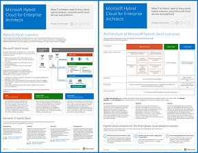

# Cloud ibrido Microsoft per Enterprise Architects

 **Riepilogo:** Cosa devono sapere gli architetti IT degli scenari ibridi che utilizzano i servizi cloud e le piattaforme Microsoft.
  
In questo articolo è disponibile il collegamento a una serie di articoli in cui viene descritto cosa devono sapere gli architetti IT sull'architettura ibrida e sulle configurazioni con i servizi cloud e le piattaforme Microsoft. È possibile visualizzare questo articolo anche come poster di 7 pagine e stamparlo in formato tabloid (noto anche come ledger, 11 x 17 o A3).
  

  
[PDF](https://go.microsoft.com/fwlink/p/?linkid=842082) | [Visio](https://go.microsoft.com/fwlink/p/?linkid=842083) | 
[Altre lingue](https://www.microsoft.com/download/details.aspx?id=54424)
  
È inoltre possibile visualizzare tutti i modelli nelle [Risorse sull'architettura IT del cloud Microsoft](microsoft-cloud-it-architecture-resources.md) e consultare la [Guida di orientamento del cloud aziendale Microsoft: risorse per i decision maker del settore IT](https://aka.ms/cloudarchitecture).
  
Vedere le seguenti sezioni:
  
- [Panoramica del cloud ibrida](hybrid-cloud-overview.md)
    
    Offerte di cloud Microsoft (SaaS, Azure PaaS e Azure IaaS) e relativi elementi comuni.
    
- [Architettura di scenari basati su cloud ibrida Microsoft](architecture-of-microsoft-hybrid-cloud-scenarios.md)
    
    Un diagramma dell'architettura del cloud ibrido per offerte sul cloud Microsoft, che mostra i livelli comuni di infrastruttura, rete e identità locali.
    
- [Scenari per il cloud ibrido per SaaS Microsoft (Office 365)](hybrid-cloud-scenarios-for-microsoft-saas-office-365.md)
    
    Architettura di scenari ibridi per SaaS e descrizioni delle principali configurazioni ibride per Skype for Business, SharePoint Server ed Exchange Server.
    
- [Scenari basati su cloud ibrida per Azure PaaS](hybrid-cloud-scenarios-for-azure-paas.md)
    
    Architettura di scenari ibridi per PaaS di Azure, descrizione di un'applicazione ibrida per PaaS di Azure con esempio e descrizione di Estensione database di SQL Server 2016.
    
- [Scenari cloud ibridi per IaaS di Azure](hybrid-cloud-scenarios-for-azure-iaas.md)
    
    Architettura di scenari ibridi per IaaS di Azure e descrizione di un'applicazione line-of business (LOB) ospitata in IaaS di Azure.
    
> [!NOTE]
> Questi articoli riflettono la versione di **giugno 2017** del poster sul cloud ibrido Microsoft per Enterprise Architects.
  
## Vedere anche

[Risorse sull'architettura IT del cloud Microsoft](microsoft-cloud-it-architecture-resources.md)

[Guida di orientamento del cloud aziendale Microsoft: risorse per i decision maker del settore IT](https://sway.com/FJ2xsyWtkJc2taRD)

