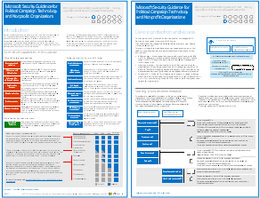
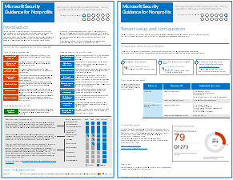

# Guida sulla sicurezza Microsoft per organizzazioni che si occupano della campagna politica, no profit e altre organizzazioni agili

 **Riepilogo:** Pianificazione e implementazione istruzioni relative allo spostamento fast organizzazioni che dispongono di un profilo di rischio maggiore.
  
Questa guida è utile se la propria organizzazione è agile, si dispone di un piccolo team IT e il proprio profilo è più a rischio rispetto alla media. Questa soluzione mostra come creare rapidamente un ambiente con i servizi cloud essenziali che includono controlli della sicurezza. Questa guida comprende suggerimenti sulla sicurezza per proteggere i dati, le identità, i messaggi di posta elettronica e l'accesso dai dispositivi mobili.
  
## Guida alle soluzioni di protezione

Questa guida viene descritto come implementare un ambiente protetto basato su cloud. Informazioni sulle soluzioni può essere utilizzato da tutte le organizzazioni. Include informazioni supplementari per le organizzazioni agile con account di accesso e guest BYOD. È possibile utilizzare questa guida come punto di partenza per la progettazione al proprio ambiente. Invitiamo i commenti e suggerimenti a [CloudAdopt@microsoft.com](mailto:CloudAdopt@microsoft.com). 
  
|||
|:-----|:-----|
|**Elemento**   |**Descrizione**   |
|**Microsoft Security Guidance for campagne politiche**   [          ](http://download.microsoft.com/download/B/4/D/B4D520C3-4D0C-4B4D-BFB9-09F0651C2775/MSFT_Cloud_architecture_security for political campaigns.pdf)   [VERSIONE PDF](http://download.microsoft.com/download/B/4/D/B4D520C3-4D0C-4B4D-BFB9-09F0651C2775/MSFT_Cloud_architecture_security for political campaigns.pdf)  \| [Visio](http://download.microsoft.com/download/B/4/D/B4D520C3-4D0C-4B4D-BFB9-09F0651C2775/MSFT_Cloud_architecture_security for political campaigns.vsdx)   |Questa guida utilizza un'organizzazione impegnata nella campagna politica come esempio. Utilizzare questa guida come punto di partenza per qualsiasi ambiente.     |
|**Microsoft Security Guidance for ricchi**   [          ](http://download.microsoft.com/download/9/4/3/94389612-C679-4061-8DF2-D9A15D72B65F/Microsoft_Cloud Architecture_Security for Nonprofits.pdf)   [VERSIONE PDF](http://download.microsoft.com/download/9/4/3/94389612-C679-4061-8DF2-D9A15D72B65F/Microsoft_Cloud Architecture_Security for Nonprofits.pdf)  \| [Visio](http://download.microsoft.com/download/9/4/3/94389612-C679-4061-8DF2-D9A15D72B65F/Microsoft_Cloud Architecture_Security for Nonprofits.vsdx)   |Questa guida è stata leggermente modificata per le organizzazioni no profit. Ad esempio, fa riferimento ai piani di Office 365 Nonprofit. Le indicazioni tecniche sono identiche a quelle fornite nella guida alle soluzioni per le campagne politiche.    |
   
## Guide dei laboratori di testing

Per creare un ambiente di sviluppo/test per questa soluzione, utilizzare le guide di lab di test seguenti:   
  
- [Configurare i gruppi e gli utenti per un ambiente di sviluppo e di testing campagne politici](configure-groups-and-users-for-a-political-campaign-dev-test-environment.md)
    
     Creare le sottoscrizioni di valutazione per Office 365 ed EMS e quindi creare gruppi e utenti per una campagna politico rappresentativa.
    
- [Creare siti del team in un ambiente di sviluppo e di testing campagne politici](create-team-sites-in-a-political-campaign-dev-test-environment.md)
    
    Creare quattro siti del team di SharePoint Online con interno privato, riservati e altamente riservati livelli di protezione.
    
Per ulteriori funzionalità di protezione per la dimostrazione o modello di prova, vedere [Office 365 guide dei laboratori di testing](http://aka.ms/o365tlgs).
  
## Vedere anche

[Soluzioni di sicurezza](security-solutions.md)
  
[Test Lab Guide (TLG) di adozione cloud](cloud-adoption-test-lab-guides-tlgs.md)
  
[Risorse sull'architettura IT del cloud Microsoft](microsoft-cloud-it-architecture-resources.md)

