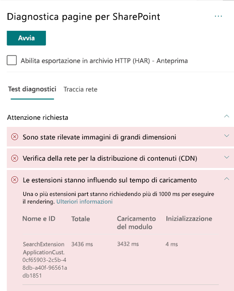

# Ottimizzare le prestazioni delle estensioni personalizzate nelle pagine moderne dei siti di SharePoint Online

Questo articolo illustra come determinare il modo in cui le estensioni personalizzate influiscono sulla latenza percepita dall'utente e su come risolvere i problemi comuni.

## Usare lo strumento Diagnostica pagine per SharePoint per analizzare le estensioni personalizzate

Lo strumento Diagnostica pagine per SharePoint è un'estensione del browser per il nuovo browser Microsoft Edge (https://www.microsoft.com/edge) e per Chrome che consente di analizzare le pagine del sito di pubblicazione di SharePoint Online sia classiche che dei portali moderni. Per ogni pagina analizzata lo strumento fornisce un report che mostra le prestazioni della pagina rispetto a un set definiti di criteri delle prestazioni. Per installare e conoscere lo strumento Diagnostica pagine per SharePoint, visitare [Usare lo strumento Diagnostica pagine per SharePoint Online](page-diagnostics-for-spo.md).

>[!NOTE]
>Lo strumento Diagnostica pagine funziona solo per SharePoint Online e non può essere usato in una pagina di sistema di SharePoint.

Quando si analizza una pagina del sito di SharePoint con lo strumento Diagnostica pagine per SharePoint, è possibile visualizzare informazioni sulle estensioni personalizzate che superano la metrica di base nel risultato **Le estensioni influiscono sul tempo di caricamento** del riquadro _Test diagnostici_.

I risultati possibili includono:

- **Attenzione** (rosso): in questa sezione sono elencate tutte le estensioni _personalizzate_ il cui caricamento richiede più di **un** secondo. Il tempo di caricamento totale visualizzato nei risultati del test è suddiviso per caricamento del modulo e inizializzazione.
- **Nessuna azione necessaria** (verde): nessuna estensione richiede più di un secondo per il caricamento.

Se un'estensione influisce sui tempi di caricamento delle pagine, il risultato viene visualizzato nella sezione **Attenzione richiesta** dei risultati. Fare clic sul risultato per visualizzare i dettagli sulle estensioni che vengono caricate lentamente. Gli aggiornamenti futuri dello strumento Diagnostica pagine per SharePoint potrebbero includere novità relative alle regole di analisi, di conseguenza assicurarsi di usare sempre la versione più recente dello strumento.

Le informazioni disponibili nei risultati includono:

- **Nome e ID**: informazioni di identificazione utili per trovare l’estensione nella pagina
- **Totale**: tempo totale di inizializzazione e caricamento dell'estensione
- **Caricamento modulo**: tempo necessario per recuperare e caricare l’estensione
- **Inizializzazione**: tempo necessario per l'inizializzazione dell’estensione

Queste informazioni vengono fornite per consentire a progettisti e sviluppatori di risolvere i problemi. Devono essere fornite al team di progettazione e sviluppo.

## Panoramica delle estensioni

È possibile usare le estensioni SharePoint Framework (SPFx) per ampliare l'esperienza utente di SharePoint. Con le estensioni SharePoint Framework è possibile personalizzare più aspetti dell'esperienza di SharePoint, tra cui le aree di notifica, le barre degli strumenti e le visualizzazioni dei dati degli elenchi.

Le estensioni possono avere un impatto negativo sulle prestazioni di una pagina di SharePoint, perché servono anche risorse della CPU e di rete per eseguire il lavoro necessario.

Sono disponibili quattro tipi di estensioni:

- **Personalizzatori delle applicazioni** aggiunge script alla pagina e accede ai segnaposto di elementi HTML noti estendendoli con rendering personalizzati.
- **Personalizzatori dei campi** fornisce delle visualizzazioni modificate dei dati per i campi in un elenco.
- **Set di comandi** estende le aree comando di SharePoint per aggiungere nuove azioni e fornisce un codice lato client che può essere usato per implementare comportamenti.
- **Modificatore query di ricerca (solo anteprima)** viene richiamato subito prima dell'esecuzione della query di ricerca.

## Risolvere i problemi di prestazioni delle estensioni

Seguire le indicazioni fornite in questa sezione per identificare e correggere i problemi di prestazioni relativi alle estensioni elencati nei risultati **Le estensioni influiscono sul tempo di caricamento delle pagine**.

>[!NOTE]
>È possibile che i personalizzatori delle applicazioni vengano eseguiti nella fase iniziale del ciclo di vita di una pagina e che influiscano sulle prestazioni di altre estensioni nella pagina.

I risultati del controllo nello strumento Diagnostica pagine mostreranno due fasi dell’esecuzione di un'estensione per identificare il potenziale impatto sulle prestazioni.

- **Caricamento del modulo** è il tempo necessario per caricare l'estensione e dipende dalle dimensioni di un'estensione, quindi è consigliabile aggregare nell'estensione solo le raccolte necessarie nonché scegliere le raccolte più leggere.
- **Inizializzazione** è il tempo di inizializzazione dell'estensione. Gli sviluppatori di estensioni devono valutare se l'estensione sta effettuando lavoro superfluo o eseguendo un numero eccessivo di comandi durante la fase di inizializzazione.

Gli autori delle pagine possono anche usare il risultato del controllo per verificare se una pagina contiene troppe estensioni, in quanto ciò avrebbe un impatto negativo sulle prestazioni di una pagina.

- **Dimensioni e dipendenze delle estensioni**
  - Per il download ottimale delle risorse statiche è necessario usare la rete per la distribuzione di contenuti di Office 365. Per i file _js/css_ sono preferibili origini pubbliche della rete per la distribuzione di contenuti. Per altre informazioni sull'uso della rete CDN di Office 365, vedere [Usare la rete per la distribuzione di contenuti di Office 365 con SharePoint Online](use-office-365-cdn-with-spo.md).
  - Riutilizzare framework come _React_ e _Fabric imports_, che fanno parte di SharePoint Framework (SPFx). Per altre informazioni, vedere [Panoramica di SharePoint Framework](https://docs.microsoft.com/sharepoint/dev/spfx/sharepoint-framework-overview).
  - Assicurarsi di usare la versione più recente di SharePoint Framework e di eseguire l'aggiornamento alle nuove versioni non appena disponibili.
- **Recupero e memorizzazione dei dati nella cache**
  - Se l’estensione si basa su chiamate server aggiuntive per il recupero dei dati da visualizzare, assicurarsi che le API server siano veloci e/o implementino la memorizzazione nella cache lato client, ad esempio con _localStorage_ o _IndexDB_ per set di dimensioni maggiori.
  - Se sono necessarie più chiamate per eseguire il rendering dei dati critici, provare a eseguirle in batch nel server o a usare altri metodi per consolidare le richieste in un'unica chiamata.
  - In alternativa, se alcuni elementi dei dati richiedono una API più lenta, ma non sono essenziali per il rendering iniziale, sdoppiarli in una chiamata separata che viene eseguita dopo il rendering dei dati critici.
  - Se più parti usano gli stessi dati, usare un livello dati comune per evitare chiamate duplicate.
- **Tempo di rendering**
  - Qualsiasi origine di file multimediale, ad esempio immagini e video, dovrebbe essere adeguata ai limiti del contenitore, del dispositivo e/o della rete per evitare il download non necessario di risorse di grandi dimensioni. Per altre informazioni sulle dipendenze di contenuto, vedere [Usare la rete per la distribuzione di contenuti di Office 365 con SharePoint Online](use-office-365-cdn-with-spo.md).
  - Evitare chiamate API che causano un adattamento dinamico del contenuto, regole CSS complesse o animazioni complicate. Per altre informazioni, vedere l'articolo su come [ridurre l'adattamento dinamico del contenuto nel browser](https://developers.google.com/speed/docs/insights/browser-reflow).
  - Evitare l'uso di attività concatenate a esecuzione prolungata. In alternativa, suddividere le attività a esecuzione prolungata in diverse code. Per altre informazioni, vedere l'articolo su come [ottimizzare l'esecuzione di JavaScript](https://developers.google.com/web/fundamentals/performance/rendering/optimize-javascript-execution).
  - Riservare lo spazio corrispondente per il rendering asincrono di elementi multimediali o visivi per evitare che i frame e gli stuttering (noti anche come _jank_) vengano ignorati.
  - Se un determinato browser non supporta una caratteristica usata nel rendering, caricare un polyfill o escludere il codice dipendente in esecuzione. Se la funzionalità non è critica, eliminare risorse quali i gestori eventi per evitare perdite di memoria.

Prima di revisionare le pagine per correggere i problemi di prestazioni, prendere nota del tempo di caricamento delle pagine nei risultati dell'analisi. Eseguire di nuovo lo strumento dopo la revisione per verificare se il nuovo risultato è compreso nello standard di base e controllare il nuovo tempo di caricamento della pagina per verificare se c'è stato un miglioramento.

>[!NOTE]
>Il tempo di caricamento delle pagine dipende da numerosi fattori, ad esempio il carico di rete, l'ora del giorno e altre condizioni transitorie. È consigliabile verificare il tempo di caricamento delle pagine alcune volte prima e dopo aver apportato modifiche in modo da ottenere una media dei risultati.

## Argomenti correlati

[Ottimizzare le prestazioni di SharePoint Online](tune-sharepoint-online-performance.md)

[Ottimizzare le prestazioni di Office 365](tune-office-365-performance.md)

[Prestazioni nell'esperienza moderna di SharePoint](https://docs.microsoft.com/sharepoint/modern-experience-performance)

[Reti per la distribuzione di contenuti](content-delivery-networks.md)

[Usare la rete per la distribuzione di contenuti di Office 365 con SharePoint Online](use-office-365-cdn-with-spo.md)