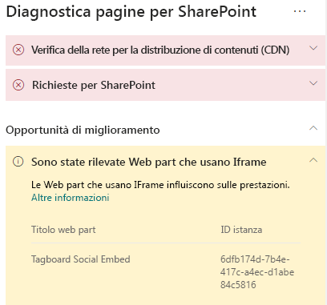
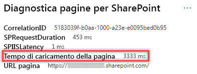

# Ottimizzare gli iFrame nelle pagine classiche e moderne del sito di pubblicazione di SharePoint OnlineOptimize iFrames in SharePoint Online modern and classic publishing site pages

Gli iFrame possono essere utili per visualizzare in anteprima contenuto complesso, ad esempio video o altri elementi multimediali.iFrames can be useful for previewing rich content such as videos or other media. Tuttavia, poiché gli iFrame caricano una pagina distinta nella pagina del sito di SharePoint, il contenuto caricato nell'iFrame potrebbe contenere immagini, video o altri elementi di grandi dimensioni che incidono sui tempi di caricamento complessivi della pagina e che non è possibile controllare nella pagina.However, because iFrames load a separate page within the SharePoint site page, content loaded in the iFrame could contain large images, videos or other elements that can contribute to overall page load times and that you cannot control on the page. Questo articolo illustra come determinare il modo in cui gli iFrame nelle pagine influiscono sulla latenza percepita dall'utente e su come risolvere i problemi comuni.This article will help you understand how to determine how iFrames in your pages affect user perceived latency, and how to remediate common issues.

>[!NOTE]
>Per altre informazioni sulle prestazioni nei siti moderni di SharePoint Online, vedere [Prestazioni nell'esperienza moderna di SharePoint](https://docs.microsoft.com/it-IT/sharepoint/modern-experience-performance).For more information about performance in SharePoint Online modern sites, see [Performance in the modern SharePoint experience](https://docs.microsoft.com/it-IT/sharepoint/modern-experience-performance).

## Usare lo strumento Diagnostica pagine per SharePoint per analizzare le Web part che usano iFrameUse the Page Diagnostics for SharePoint tool to analyze web parts using iFrames

Lo **strumento Diagnostica pagine per SharePoint** è un'estensione del browser per Chrome e per [Microsoft Edge versione 77 o successive](https://www.microsoftedgeinsider.com/en-us/download?form=MI13E8&OCID=MI13E8) che consente di analizzare le pagine del sito di pubblicazione di SharePoint sia classiche che moderne.The **Page Diagnostics for SharePoint tool** is a browser extension for Chrome and [Microsoft Edge version 77 or later](https://www.microsoftedgeinsider.com/en-us/download?form=MI13E8&OCID=MI13E8) you can use to analyze SharePoint both modern and classic publishing site pages. Lo strumento fornisce un report per ogni pagina analizzata che mostra le prestazioni della pagina rispetto a un set di criteri di prestazioni definito.The tool provides a report for each analyzed page showing how the page performs against a defined set of performance criteria. Per installare e conoscere lo strumento Diagnostica pagine per SharePoint, visitare [Usare lo strumento Diagnostica pagine per SharePoint Online](page-diagnostics-for-spo.md).To install and learn about the Page Diagnostics for SharePoint tool, visit [Use the Page Diagnostics tool for SharePoint Online](page-diagnostics-for-spo.md).

Quando si analizza una pagina del sito di SharePoint con lo strumento Diagnostica pagine per SharePoint, è possibile visualizzare le informazioni sulle Web part che contengono iFrame nel riquadro _Diagnostic tests_ (Test diagnostici).When you analyze a SharePoint site page with the Page Diagnostics for SharePoint tool, you can see information about web parts containing iFrames in the _Diagnostic tests_ pane. La metrica di base è la stessa per le pagine classiche e moderne.The baseline metric is the same for modern and classic pages.

I risultati possibili includono:Possible results include:

- **Attention required** (rosso): attenzione richiesta, la pagina contiene **tre o più** Web part che usano iFrame**Attention required** (red): The page contains **three or more** web parts using iFrames
- **Improvement opportunities** (giallo): opportunità di miglioramento, la pagina contiene **una o due** Web part che usano iFrame**Improvement opportunities** (yellow): The page contains **one or two** web parts using iFrames
- **No action required** (verde): nessuna azione necessaria, la pagina non contiene Web part che usano iFrame**No action required** (green): The page contains no web parts using iFrames

Se il risultato **Web parts using iFrames detected** (Rilevate Web che usano iFrame) compare nella sezione **Improvement opportunities** o **Attention required** dei risultati, fare clic sul risultato per vedere le Web part che contengono iFrame.If the **Web parts using iFrames detected** result appears in either the **Improvement opportunities** or **Attention required)** section of the results, you can click the result to see the web parts that contain iFrames.

## Risolvere i problemi di prestazioni degli iFrameRemediate iFrame performance issues

Usare il risultato **Web parts using iFrames detected** (Rilevate Web che usano iFrame) nello strumento Diagnostica pagine per determinare quali Web part contengono iFrame e potrebbero contribuire a rallentare i tempi di caricamento delle pagine.Use the **Web parts using iFrames detected** result in the Page Diagnostic tool to determine which web parts contain iFrames and may be contributing to slow page load times.

Gli iFrame sono intrinsecamente lenti perché caricano una pagina esterna separata che include tutto il contenuto associato, come elementi JavaScript, CSS e framework, aumentando potenzialmente il sovraccarico della pagina del sito di un fattore di due o più.iFrames are inherently slow because they load a separate external page including all associated content such as javascript, CSS and framework elements, potentially increasing the overhead of the site page by a factor of two or more.

Seguire le indicazioni riportate di seguito per garantire un uso ottimale degli iFrame.Follow the guidance below to ensure optimal use of iFrames.

- Se possibile, usare immagini al posto degli iFrame se l'anteprima è piccola o non interattiva.When possible, use images instead of iFrames if the preview is small to begin with or non-interactive.
- Se è necessario usare gli iFrame, ridurne il numero al minimo e/o spostarli all’esterno del viewport.If iFrames must be used, minimize the number and/or move them out of the viewport.
- I file di Office incorporati, come i file di Word, Excel e PowerPoint, sono interattivi, ma sono lenti da caricare.Embedded Office files like Word, Excel and PowerPoint are interactive, but are slow to load. Anteprime delle immagini con un collegamento al documento completo offriranno spesso prestazioni migliori.Image thumbnails with a link to the full document will often perform better.
- I video di YouTube e i feed di Twitter incorporati tendono a offrire prestazioni migliori negli iFrame, ma questi tipi di incorporamento vanno usati con giudizio.Embedded YouTube videos and Twitter feeds tend to perform better in iFrames, but use these kinds of embeds judiciously.
- Le Web part isolate rappresentano un'eccezione accettabile, ma ridurne al minimo il numero e l'impiego nel viewport.Isolated web parts are a reasonable exception, but minimize their number and placement in the viewport.
- Se un iFrame si trova all'esterno del viewport, è consigliabile usare un _IntersectionObserver_ per posticipare il rendering dell'iFrame al momento in cui diventa visibile.If an iFrame is located out of the viewport, consider using an _IntersectionObserver_ to delay rendering the iFrame until it comes into view.

Prima di eseguire le revisioni delle pagine per correggere i problemi di prestazioni, prendere nota del tempo di caricamento delle pagine nei risultati dell'analisi.Before you make page revisions to remediate performance issues, make a note of the page load time in the analysis results. Eseguire di nuovo lo strumento dopo la revisione per verificare se il nuovo risultato ora rientra nei parametri di riferimento e controllare il tempo di caricamento della nuova pagina per verificare se è migliorato.Run the tool again after your revision to see if the new result is within the baseline standard, and check the new page load time to see if there was an improvement.

>[!NOTE]
>Il tempo di caricamento delle pagine può variare in base a un'ampia varietà di fattori, ad esempio il carico di rete, l'ora del giorno e altre condizioni transitorie.Page load time can vary based on a variety of factors such as network load, time of day, and other transient conditions. È consigliabile verificare il tempo di caricamento delle pagine alcune volte prima e dopo aver apportato modifiche per ottenere la media dei risultati.You should test page load time a few times before and after making changes to help you average the results.

## Argomenti correlatiRelated topics

[Ottimizzare le prestazioni di SharePoint OnlineTune SharePoint Online performance](tune-sharepoint-online-performance.md)

[Ottimizzare le prestazioni di Office 365Tune Office 365 performance](tune-office-365-performance.md)

[Prestazioni nell'esperienza moderna di SharePointPerformance in the modern SharePoint experience](https://docs.microsoft.com/it-IT/sharepoint/modern-experience-performance.md)
