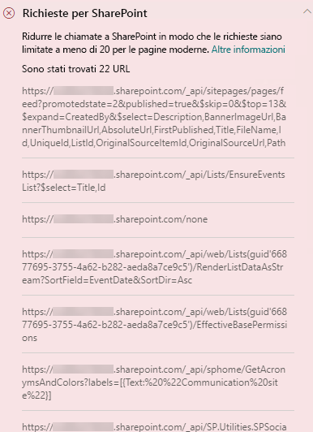

# Ottimizzare le chiamate di pagina nelle pagine classiche e moderne del sito di pubblicazione di SharePoint OnlineOptimize page calls in SharePoint Online modern and classic publishing site pages

Sia i siti di pubblicazione moderni che quelli classici di SharePoint Online contengono collegamenti che caricano i dati dalle (o effettuano chiamate a) funzionalità di SharePoint e CDN.Both SharePoint Online modern and classic publishing sites contain links that load data from (or make calls to) SharePoint features and CDNs. Per altre chiamate effettuate da una pagina, il caricamento della pagina sarà più lungo.The more calls made by a page, the longer the page takes to load. Si tratta di una **latenza percepita dagli utenti finali** o **EUPL**.This is known as **end user perceived latency** or **EUPL**.

Questo articolo illustra come determinare il numero e l'impatto delle chiamate agli endpoint esterni nelle pagine moderne e classiche del sito di pubblicazione e su come limitarne l'effetto sulla latenza percepita dagli utenti finali.This article will help you understand how to determine the number and impact of calls to external endpoints from your modern and classic publishing site pages and how to limit their effect on end user perceived latency.

>[!NOTE]
>Per ulteriori informazioni sulle prestazioni nei portali moderni di SharePoint Online, vedere [ Prestazioni nell'esperienza moderna di SharePoint](https://docs.microsoft.com/sharepoint/modern-experience-performance).For more information about performance in SharePoint Online modern portals, see [Performance in the modern SharePoint experience](https://docs.microsoft.com/sharepoint/modern-experience-performance).

## Usare lo strumento Diagnostica pagine per SharePoint per analizzare le chiamate di pagineUse the Page Diagnostics for SharePoint tool to analyze page calls

Lo **strumento Diagnostica pagine per SharePoint** è un'estensione del browser per Chrome e per la [versione di Microsoft Edge 77 o versioni successive](https://www.microsoftedgeinsider.com/download?form=MI13E8&OCID=MI13E8), che consente di analizzare sia le pagine di pubblicazione moderne che quelle classiche di SharePoint.The **Page Diagnostics for SharePoint tool** is a browser extension for Chrome and [Microsoft Edge version 77 or later](https://www.microsoftedgeinsider.com/download?form=MI13E8&OCID=MI13E8) you can use to analyze SharePoint both modern and classic publishing site pages. Per ogni pagina analizzata lo strumento fornisce un report che mostra le prestazioni della pagina rispetto a un set definiti di criteri delle prestazioni.The tool provides a report for each analyzed page showing how the page performs against a defined set of performance criteria. Per installare e conoscere lo strumento Diagnostica pagine per SharePoint, visitare [Usare lo strumento Diagnostica pagine per SharePoint Online](page-diagnostics-for-spo.md).To install and learn about the Page Diagnostics for SharePoint tool, visit [Use the Page Diagnostics tool for SharePoint Online](page-diagnostics-for-spo.md).

Quando si analizza una pagina del sito di SharePoint con lo strumento Diagnostica pagine per SharePoint, è possibile visualizzare le informazioni sulle chiamate esterne nel risultato **Richieste a SharePoint** nel riquadro _Test diagnostici_.When you analyze a SharePoint site page with the Page Diagnostics for SharePoint tool, you can see information about external calls in the **Requests to SharePoint** result in the _Diagnostic tests_ pane. La riga sarà verde se la pagina del sito contiene una quantità inferiore della linea di base di chiamate, mentre sarà rossa se la pagina supera il numero di linea di base.The line will appear in green if the site page contains fewer than the baseline number of calls, and red if the page exceeds the baseline number. Il numero della linea di base varia in base alle pagine moderne e classiche, perché le pagine classiche del sito usano HTTP1.1, mentre le moderne usano HTTP2.0:The baseline number is different for modern and classic pages because classic site pages use HTTP1.1 and modern pages use HTTP2.0:

- Le pagine moderne del sito non dovrebbero contenere più di **25** chiamateModern site pages should contain no more than **25** calls
- Le pagine classiche del sito non dovrebbero contenere più di **6** chiamateClassic publishing pages should contain no more than **6** calls

I risultati possibili includono:Possible results include:

- **Attenzione richiesta** (rosso): la pagina supera il numero di linea di base di chiamate**Attention required** (red): The page exceeds the baseline number of calls
- **Nessuna azione richiesta** (verde): la pagina contiene una quantità inferiore di linea di base di chiamate**No action required** (green): The page contains fewer than the baseline number of calls

Se il risultato delle **Richieste a SharePoint** viene visualizzato nella sezione **Attenzione richiesta**, è possibile fare clic sul risultato per informazioni dettagliate, tra cui il numero totale di chiamate della pagina e un elenco degli URL.If the **Requests to SharePoint** result appears in the **Attention required** section, you can click the result for details, including the total number of calls on the page and a list of the URLs.

## Risolvere i problemi di prestazioni relativi a un numero eccessivo di chiamate in una paginaRemediate performance issues related to too many calls on a page

Se una pagina contiene troppe chiamate, è possibile usare l'elenco di URL nei risultati delle **Richieste a SharePoint** per determinare se esistono chiamate ripetute, chiamate che devono essere in batch o chiamate che restituiscono dati da memorizzare nella cache.If a page contains too many calls, you can use the list of URLs in the **Requests to Sharepoint** results to determine whether there are any repeated calls, calls that should be batched, or calls that return data that should be cached.

**Le chiamate REST in batch** consentono di ridurre il sovraccarico delle prestazioni.**Batching REST calls** can help to reduce performance overhead. Per altre informazioni sulle chiamate API in batch, vedere [Effettuare richieste di batch con le API REST](https://docs.microsoft.com/sharepoint/dev/sp-add-ins/make-batch-requests-with-the-rest-apis).For more information about API call batching, see [Make batch requests with the REST APIs](https://docs.microsoft.com/sharepoint/dev/sp-add-ins/make-batch-requests-with-the-rest-apis).

**L'uso di una cache** per archiviare i risultati di una chiamata API può migliorare le prestazioni di una richiesta importante, consentendo al client di usare i dati della cache, anziché eseguire un’altra chiamata per ogni caricamento di pagina successivo.**Using a cache** to store the results of an API call can improve the performance of a warm request by allowing the client to use the cached data instead of making an additional call for each subsequent page load. Ci sono diversi modi per affrontare questa soluzione in base ai requisiti aziendali.There are multiple ways to approach this solution depending on the business requirement. In genere, se i dati sono identici per tutti gli utenti, l'uso di un servizio di memorizzazione nella cache a livello intermedio, come la cache di[_ Azure Redis_](https://azure.microsoft.com/services/cache/), è un'ottima opzione per ridurre significativamente il traffico API in un sito, perché gli utenti richiederebbero i dati del servizio di memorizzazione nella cache anziché direttamente da SPO.Typically if the data will be the same for all users, using a middle-tier caching service like [_Azure Redis_ cache](https://azure.microsoft.com/services/cache/) is a great option to significantly reduce API traffic against a site, as the users would request the data from the caching service instead of directly from SPO. Le uniche chiamate SPO sono necessarie per aggiornare la cache del livello intermedio.The only SPO calls needed would be to refresh the middle-tier's cache. Se i dati variano in base ai singoli utenti, può essere preferibile implementare una cache lato client, ad esempio LocalStorage o anche un cookie.If the data will fluctuate on an individual user basis, it may be best to implement a client side cache, like LocalStorage or even a Cookie. Il volume delle chiamate continuerà a essere ridotto eliminando le successive richieste effettuate dallo stesso utente per la durata della cache, ma sarà meno efficiente di un servizio di caching dedicato.This will still reduce call volumes by eliminating subsequent requests made by the same user for the cache duration, but will be less efficient than a dedicated caching service. PnP consente di usare LocalStorage con un po’ di strumenti aggiuntivi.PnP allows you to use LocalStorage with little additional development required.

Prima di eseguire le revisioni delle pagine per correggere i problemi di prestazioni, prendere nota del tempo di caricamento delle pagine nei risultati dell'analisi.Before you make page revisions to remediate performance issues, make a note of the page load time in the analysis results. Eseguire di nuovo lo strumento dopo la revisione per verificare se il nuovo risultato è compreso nello standard di base e controllare il nuovo tempo di caricamento della pagina per verificare se c'è stato un miglioramento.Run the tool again after your revision to see if the new result is within the baseline standard, and check the new page load time to see if there was an improvement.

>[!NOTE]
>Il tempo di caricamento delle pagine dipende da numerosi fattori, ad esempio il carico di rete, l'ora del giorno e altre condizioni transitorie.Page load time can vary based on a variety of factors such as network load, time of day, and other transient conditions. È consigliabile verificare il tempo di caricamento delle pagine alcune volte prima e dopo aver apportato modifiche in modo da ottenere una media dei risultati.You should test page load time a few times before and after making changes to help you average the results.

## Argomenti correlatiRelated topics

[Ottimizzare le prestazioni di SharePoint OnlineTune SharePoint Online performance](tune-sharepoint-online-performance.md)

[Ottimizzare le prestazioni di Office 365Tune Office 365 performance](tune-office-365-performance.md)

[Prestazioni nell'esperienza moderna di SharePointPerformance in the modern SharePoint experience](https://docs.microsoft.com/sharepoint/modern-experience-performance)

[Reti per la distribuzione di contenutiContent delivery networks](content-delivery-networks.md)

[Usare la rete per la distribuzione di contenuti di Office 365 con SharePoint OnlineUse the Office 365 Content Delivery Network (CDN) with SharePoint Online](use-office-365-cdn-with-spo.md)
