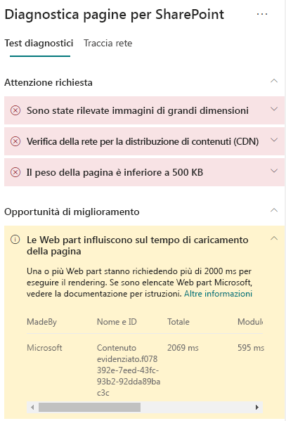

# Ottimizzare le prestazioni delle web part nelle pagine moderne di siti di SharePoint Online

>[!TIP]
>Per informazioni su come ottimizzare gli IFrame nelle pagine di siti di SharePoint, vedere [Ottimizzare gli IFrame nelle pagine classiche e moderne di siti di pubblicazione di SharePoint Online](modern-iframe-optimization.md).

Le pagine moderne dei siti di SharePoint Online contengono web part che possono influire sui tempi di caricamento complessivi delle pagine. Questo articolo spiega come determinare l'impatto delle web part presenti nelle pagine sulla latenza percepita dall'utente e come risolvere problemi comuni.

>[!NOTE]
>Per altre informazioni sulle prestazioni nei portali moderni di SharePoint Online, vedere [Prestazioni nell'esperienza moderna di SharePoint](https://docs.microsoft.com/it-IT/sharepoint/modern-experience-performance).

## Usare lo strumento Diagnostica pagine per SharePoint per analizzare le web part

Lo **strumento Diagnostica pagine per SharePoint** è un'estensione del browser per Chrome e per la [versione 77 o successiva di Microsoft Edge](https://www.microsoftedgeinsider.com/en-us/download?form=MI13E8&OCID=MI13E8) che consente di analizzare le pagine classiche e moderne di siti di pubblicazione di SharePoint. Per ogni pagina analizzata lo strumento fornisce un report che mostra le prestazioni della pagina rispetto a un set definiti di criteri delle prestazioni. Per installare Diagnostica pagine per SharePoint e saperne di più su questo strumento, vedere [Usare lo strumento Diagnostica pagine per SharePoint Online](page-diagnostics-for-spo.md).

Quando si analizza una pagina del sito di SharePoint con lo strumento Diagnostica pagine per SharePoint, è possibile visualizzare informazioni sulle web part che superano la metrica di base nel risultato **Le web part influiscono sul tempo di caricamento delle pagine** del riquadro _Test diagnostici_.

I risultati possibili includono:

- **Attenzione** (rosso): in questa sezione sono elencate tutte le web part _personalizzate_ il cui caricamento richiede più di **due** secondi. Il tempo di caricamento totale visualizzato nei risultati del test è suddiviso per caricamento del modulo, caricamento lazy, inizializzazione e rendering.
- **Possibilità di miglioramento** (giallo): in questa sezione sono visualizzati gli elementi che potrebbero influire sul tempo di caricamento delle pagine e che devono essere esaminati e monitorati. Tali elementi possono includere le web part Microsoft predefinite. I risultati relativi a tutte le web part Microsoft mostrati in questa sezione vengono segnalati automaticamente a Microsoft, di conseguenza **non è richiesta alcuna azione**. È opportuno aprire un ticket di supporto per l'analisi solo se si riscontra una notevole lentezza nel caricamento della pagina e **tutte le web part Microsoft** nella pagina vengono visualizzate nei risultati della sezione **Possibilità di miglioramento**. In un futuro aggiornamento dello strumento Diagnostica pagine i risultati verranno suddivisi ulteriormente in base alla specifica configurazione della web part Microsoft.
- **Non è richiesto alcun intervento** (verde): nessuna web part impiega più di **due** secondi per restituire dati.

Se il risultato **Le web part influiscono sul tempo di caricamento delle pagine** viene visualizzato nella sezione dei risultati **Attenzione** o **Possibilità di miglioramento**, fare clic sul risultato per visualizzare i dettagli relativi alle web part che vengono caricate lentamente. Gli aggiornamenti futuri dello strumento Diagnostica pagine per SharePoint potrebbero includere novità relative alle regole di analisi, di conseguenza assicurarsi di usare sempre la versione più recente dello strumento.

Le informazioni disponibili nei risultati includono:

- **Autore**: indica se la web part è personalizzata oppure predefinita Microsoft
- **Nome e ID**: informazioni di identificazione utili per trovare la web part nella pagina
- **Totale**: tempo totale di caricamento della web part
- **Caricamento modulo**: tempo necessario per recuperare e caricare i componenti della web part
- **Caricamento lazy**: tempo per il caricamento posticipato delle web part non visualizzate nella sezione principale della pagina
- **Inizializzazione**: tempo necessario per l'inizializzazione della web part
- **Rendering**: tempo necessario per consentire alla web part di recuperare ed eseguire il rendering dei risultati

Queste informazioni vengono fornite per consentire a progettisti e sviluppatori di risolvere i problemi. Devono essere fornite al team di progettazione e sviluppo.

## Risolvere i problemi di prestazioni delle web part

Seguire le indicazioni fornite in questa sezione per identificare e correggere i problemi di prestazioni relative alle web part elencati nei risultati **Le web part influiscono sul tempo di caricamento delle pagine**.

Sono tre le categorie delle possibili cause dei problemi di prestazioni delle web part. Usare le informazioni seguenti per determinare e risolvere i problemi applicabili alla propria situazione.

- Dimensioni e dipendenze dello script della web part
  - Ottimizzare lo script iniziale che esegue il rendering dello scenario principale per la _modalità di sola visualizzazione_.
  - Spostare gli scenari meno frequenti e modificare il codice della modalità, ad esempio il riquadro delle proprietà, per separare i blocchi con l'istruzione _import()_.
  - Esaminare le dipendenze del file _package.json_ per rimuovere completamente il codice inutilizzato. Spostare tutte le dipendenze relative solo a test/compilazione in devDependencies.
  - Per il download ottimale delle risorse statiche è necessario usare la rete per la distribuzione di contenuti di Office 365. Per i file _js/css_ sono preferibili origini pubbliche della rete per la distribuzione di contenuti. Per altre informazioni sull'uso della rete CDN di Office 365, vedere [Usare la rete per la distribuzione di contenuti di Office 365 con SharePoint Online](use-office-365-cdn-with-spo.md).
  - Riutilizzare framework come _React_ e _Fabric imports_, che fanno parte di SharePoint Framework (SPFx). Per altre informazioni, vedere [Panoramica di SharePoint Framework](https://docs.microsoft.com/it-IT/sharepoint/dev/spfx/sharepoint-framework-overview).
  - Assicurarsi di usare la versione più recente di SharePoint Framework e di eseguire l'aggiornamento alle nuove versioni non appena disponibili.
- Recupero e memorizzazione dei dati nella cache
  - Se la web part si basa su chiamate server aggiuntive per il recupero dei dati da visualizzare, assicurarsi che le API server siano veloci e/o implementino la memorizzazione nella cache lato client, ad esempio con _localStorage_ o _IndexDB_ per set di dimensioni maggiori.
  - Se sono necessarie più chiamate per eseguire il rendering dei dati critici, provare a eseguirle in batch nel server o a usare altri metodi per consolidare le richieste in un'unica chiamata.
  - In alternativa, se alcuni elementi dei dati richiedono una API più lenta, ma non sono essenziali per il rendering iniziale, sdoppiarli in una chiamata separata che viene eseguita dopo il rendering dei dati critici.
  - Se più parti usano gli stessi dati, usare un livello dati comune per evitare chiamate duplicate.
- Tempo di rendering
  - Qualsiasi origine di file multimediale, ad esempio immagini e video, dovrebbe essere adeguata ai limiti del contenitore, del dispositivo e/o della rete per evitare il download non necessario di risorse di grandi dimensioni. Per altre informazioni sulle dipendenze di contenuto, vedere [Usare la rete per la distribuzione di contenuti di Office 365 con SharePoint Online](use-office-365-cdn-with-spo.md).
  - Evitare chiamate API che causano un adattamento dinamico del contenuto, regole CSS complesse o animazioni complicate. Per altre informazioni, vedere l'articolo su come [ridurre l'adattamento dinamico del contenuto nel browser](https://developers.google.com/speed/docs/insights/browser-reflow).
  - Evitare l'uso di attività concatenate a esecuzione prolungata. In alternativa, suddividere le attività a esecuzione prolungata in diverse code. Per altre informazioni, vedere l'articolo su come [ottimizzare l'esecuzione di JavaScript](https://developers.google.com/web/fundamentals/performance/rendering/optimize-javascript-execution).
  - Riservare lo spazio corrispondente per il rendering asincrono di elementi multimediali o visivi per evitare fotogrammi saltati e il fenomeno dello stuttering, noto anche come <bpt id="p1">_</bpt>jank<ept id="p1">_</ept>.
  - Se un determinato browser non supporta una funzionalità usata nel rendering, caricare un polyfill o escludere il codice dipendente in esecuzione. Se la funzionalità non è critica, eliminare risorse quali i gestori eventi per evitare perdite di memoria.

Prima di revisionare le pagine per correggere i problemi di prestazioni, prendere nota del tempo di caricamento delle pagine nei risultati dell'analisi. Eseguire di nuovo lo strumento dopo la revisione per verificare se il nuovo risultato è compreso nello standard di base e controllare il nuovo tempo di caricamento della pagina per verificare se c'è stato un miglioramento.

>[!NOTE]
>Il tempo di caricamento delle pagine dipende da numerosi fattori, ad esempio il carico di rete, l'ora del giorno e altre condizioni transitorie. È consigliabile verificare il tempo di caricamento delle pagine alcune volte prima e dopo aver apportato modifiche in modo da ottenere una media dei risultati.

## Argomenti correlati

[Ottimizzare le prestazioni di SharePoint Online](tune-sharepoint-online-performance.md)

[Ottimizzare le prestazioni di Office 365](tune-office-365-performance.md)

[Prestazioni nell'esperienza moderna di SharePoint](https://docs.microsoft.com/it-IT/sharepoint/modern-experience-performance.md)

[Reti per la distribuzione di contenuti](content-delivery-networks.md)

[Usare la rete per la distribuzione di contenuti di Office 365 con SharePoint Online](use-office-365-cdn-with-spo.md)
