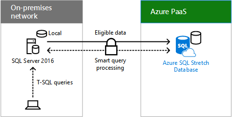
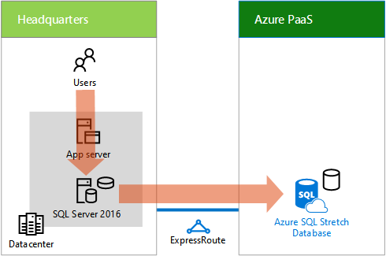

# Spostamento dei dati di cronologia delle transazioni per il cloudMoving historical transaction data to the cloud

 **Riepilogo:** Contoso ha implementato come database esteso di SQL Server per ridurre le esigenze di archiviazione in locale e giornaliera costi contenuti.**Summary:** How Contoso implemented SQL Server stretch database to reduce its on-premises data storage needs and daily running costs.
  
Sistema di archiviazione dell'organizzazione Contoso archivia una grande quantità di dati di cronologia delle transazioni per la conformità ai requisiti normativi e per la ricerca di marketing e Business Intelligence analisi delle tendenze di spese. Contoso deve anche per il ripristino dei dati archiviati nastro magnetico, un processo molto tempo. L'hardware nel sistema di archiviazione aziendale Contoso è stato quasi alla fine del ciclo di vita e sostituirlo potrebbe essere molto costosa.Contoso's enterprise storage system stores a large amount of historical transaction data for adherence with regulatory requirements and for marketing research and BI analysis of spending trends. Contoso also needs to restore archived data from magnetic tape, a time-intensive process. The hardware in Contoso's enterprise storage system was nearing its end of life and replacing it would be very expensive. 
  
Durante il relativo esigenza aziendale di scalabilità orizzontale verso il basso relativi centri dati locali, Contoso ha scelto per l'aggiornamento a SQL Server 2016 per la funzionalità ibrida Ridimensiona Database e il relativo una facile integrazione con Azure. Database esteso consente Contoso per spostare i dati con cold le tabelle in locale in storage cloud, liberare spazio su disco locale e la riduzione di manutenzione. Dati attivo e con cold sono le stesse tabelle e sono sempre disponibili per le applicazioni e dei relativi utenti e per la manutenzione, ad esempio backup e ripristino. Ridimensiona Database illustrato nella figura 1.As part of its business need to scale down its on-premises datacenters, Contoso chose to upgrade to SQL Server 2016 because of the Stretch Database hybrid feature and its seamless integration with Azure. Stretch Database allows Contoso to move the cold data in its tables from on-premises to cloud storage, freeing up local disk space and reducing maintenance. Both hot and cold data are in the same tables and are always available to applications and their users and for maintenance, such as backups and restores. Figure 1 shows Stretch Database.
  
**Nella figura 1: SQL Server stiramento Database****Figure 1: SQL Server Stretch Database**

  
Nella figura 1 viene illustrato il modo in cui un client SQL invia query T-SQL per un server che esegue SQL Server 2016, che li inoltra a un Database Ridimensiona SQL Azure in Azure PaaS.Figure 1 shows how a SQL client sends T-SQL queries to a server running SQL Server 2016, which forwards them to an Azure SQL Stretch Database in Azure PaaS.
  
Per ulteriori informazioni, vedere [Database adatta](https://msdn.microsoft.com/library/dn935011.aspx).For more information, see [Stretch Database](https://msdn.microsoft.com/library/dn935011.aspx).
  
Contoso utilizzata la procedura seguente per spostare i dati cronologici in cloud:Contoso used these steps to move their historical data to the cloud:
  
1. Analizzare i databaseAnalyze databases
    
    Eseguire un'analisi delle tabelle nei database che lo scopo di spostamento nel cloud e corretto eventuali problemi. Il nuovo Advisor Database Ridimensiona ha dato loro una panoramica completa dei quali si aspettano da tutte le funzionalità di SQL Server 2016, incluse le tabelle contengono dati freddi potrebbero essere ridimensionati.Performed an analysis of the tables in the databases that they intended to move to the cloud and fixed any issues. The new Stretch Database Advisor gave them a full overview of what they can expect from all features in SQL Server 2016, including which tables have cold data that could be stretched.
    
2. AggiornamentoUpgrade
    
    Esistenti SQL Server aggiornati nel centro dati headquarters Parigi a SQL Server 2016.Updated existing SQL servers in the Paris headquarters datacenter to SQL Server 2016.
    
3. Eseguire la migrazione dei dati con cold nel cloudMigrate cold data to the cloud
    
    Utilizzando SQL Management Studio, vengono identificati i database per estendere e le tabelle di eseguire la migrazione a istanze del Database esteso in Azure. Nel corso del tempo e in background, SQL Server 2016 spostati i dati cronologici per estendere i database in Azure.Using SQL Management Studio, they identified the databases to stretch and the tables to migrate to instances of Stretch Database in Azure. Over time and in the background, SQL Server 2016 moved the historical data to stretch databases in Azure.
    
Di seguito è la configurazione per un server che esegue SQL Server 2016 nella sede centrale Parigi risultante.Here is the resulting configuration for one server running SQL Server 2016 in the Paris headquarters.
  
**Figura 2: Utilizzo di Database adatta per un server di datacenter di Contoso****Figure 2: Using Stretch Database for a server in Contoso's datacenter**

  
Nella figura 2 viene illustrato come le query degli utenti a un server applicazioni nel centro dati di Contoso diventano query SQL che vengono passate a un Database Ridimensiona SQL Azure in Azure PaaS.Figure 2 shows how user queries to an application server in Contoso's datacenter become SQL queries that are passed to an Azure SQL Stretch Database in Azure PaaS.
  
Gli utenti di accedere ai dati tramite query e App esistente. Criteri di accesso rimangono invariate. Non è stato spostato in avanti, è necessario per i backup su nastro. Manutenzione è costituita da eseguire il backup e ripristino dei dati attivo.Users access the data through existing apps and queries. Access policies remain the same. Moving forward, there is no need for tape backups. Maintenance consists of backing up and restoring hot data.
  
Dopo l'implementazione di Database Ridimensiona, Contoso:After implementing Stretch Database, Contoso:
  
- Ridurre le esigenze di archiviazione locale 85%.Reduced its on-premises data storage needs by 85%.
    
- Eseguito l'aggiornamento del sistema di archiviazione dell'organizzazione e utilizzo del nastro magnetico archivi non necessarie.Made the update of the enterprise storage system and reliance on magnetic tape archives unnecessary.
    
- Riduzione dei costi in esecuzione giornalieri in modo significativo.Reduced its daily running costs significantly.
    
## Vedere ancheSee Also

[Scenari aziendali per Contoso CorporationEnterprise scenarios for the Contoso Corporation](enterprise-scenarios-for-the-contoso-corporation.md)
  
[Contoso nel Microsoft CloudContoso in the Microsoft Cloud](contoso-in-the-microsoft-cloud.md)
  
[Risorse sull'architettura IT del cloud MicrosoftMicrosoft Cloud IT architecture resources](microsoft-cloud-it-architecture-resources.md)

[Stretch DatabaseStretch Database](https://msdn.microsoft.com/library/dn935011.aspx)
  
[Guida di orientamento del cloud aziendale Microsoft: risorse per i decision maker del settore ITMicrosoft's Enterprise Cloud Roadmap: Resources for IT Decision Makers](https://sway.com/FJ2xsyWtkJc2taRD)

