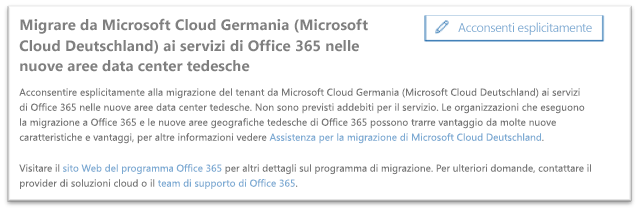
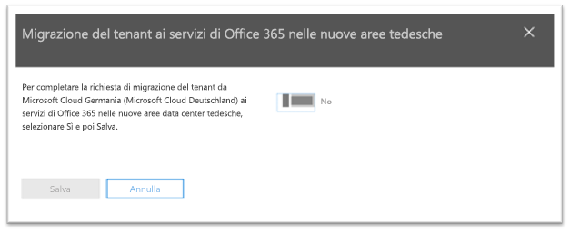
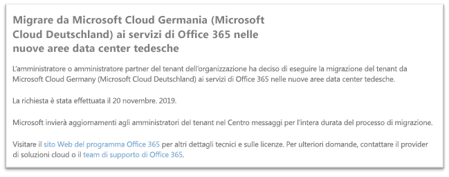

# Come acconsentire esplicitamente alla migrazione da Microsoft Cloud Germany (Microsoft Cloud Deutschland) ai servizi di Office 365 nelle nuove aree geografiche tedesche dei data centerHow to opt-In for migration from Microsoft Cloud Germany (Microsoft Cloud Deutschland) to Office 365 services in the new German datacenter regions

>[!Note]
>Questo articolo interessa solo i clienti idonei di Microsoft Cloud Germany/Deutschland.This article only applies to eligible Microsoft Cloud Germany/Deutschland customers.
>

## Come richiedere la migrazioneHow to request migration

I clienti idonei, con il servizio sottoposto a provisioning in Microsoft Cloud Germany, visualizzeranno una pagina nell'interfaccia di amministrazione di Microsoft 365 che consente a un amministratore del tenant del cliente di acconsentire esplicitamente alla migrazione.Eligible customers with service provisioned in Microsoft Cloud Germany will see a page in the Microsoft 365 admin center that will allow a customer tenant administrator to opt-in for migration.

Per accedere alla pagina nell'interfaccia di amministrazione di Microsoft 365, espandere **Impostazioni** nel riquadro di spostamento sinistro e quindi fare clic su **Profilo organizzazione**.To access the page in the Microsoft 365 admin center, in the navigation pane on the left, expand **Settings** and then click **Organization Profile**.

Nella pagina **Profilo organizzazione**, scorrere verso il basso fino alla sezione **Migrazione da Microsoft Cloud Germany (Microsoft Cloud Deutschland) ai servizi di Office 365 nelle nuove aree data center tedesche**.On the **Organization Profile** page, scroll down to the **Migrate from Microsoft Cloud Germany (Microsoft Cloud Deutschland) to Office 365 services in the new German datacenter regions** section.

Se l'organizzazione desidera eseguire la migrazione del servizio da Microsoft Cloud Germany (Microsoft Cloud Deutschland) ai servizi di Office 365 nelle nuove aree data center tedesche, fare clic su **Acconsenti esplicitamente**.If your organization wishes to migrate your service from Microsoft Cloud Germany (Microsoft Cloud Deutschland) to Office 365 services in the new German datacenter regions, click **Opt-in**.
 

Una nuova sezione apparirà sul lato destro dello schermo per accettare la conferma.A new section will appear on the right side of your screen to accept your confirmation. Impostare l'interruttore su **Sì**e quindi fare clic su **Salva**.Select the toggle button to **Yes**, and then click **Save**.
 

Dopo che un amministratore avrà acconsentito esplicitamente per conto del tenant, tutti gli amministratori visualizzeranno la conferma nella sezione **Migrazione da Microsoft Cloud Germany (Microsoft Cloud Deutschland) ai servizi di Office 365 nelle nuove aree data center tedesche**, inclusa la data del consenso esplicito.Once an administrator has opted-in on behalf of your tenant then all administrators will see the confirmation in **Migrate from Microsoft Cloud Germany (Microsoft Cloud Deutschland) to Office 365 services in the new German datacenter regions** section, including the date of opt-in. Gli amministratori riceveranno una conferma anche nel Centro messaggi dell'interfaccia di amministrazione di Microsoft 365.Administrators will also have a confirmation in Message Center of the Microsoft 365 admin center. 
 

## Cosa succede dopo aver acconsentito esplicitamente alla migrazione?What happens after opting-in for migration?

Per le organizzazioni che hanno acconsentito a partecipare all'approccio guidato da Microsoft, le migrazioni sono previste nel corso del 2020.Migrations are expected to take place in 2020 for organizations that opt-in to the Microsoft-driven approach.  A seguito della migrazione, gli abbonamenti e i dati principali dei clienti verranno spostati nelle nuove aree geografiche tedesche.As a result of the migration, core customer data and subscriptions are moved to the new German regions.  Microsoft invierà aggiornamenti nel Centro messaggi per l'intera durata del processo di migrazione.Microsoft will send updates throughout the migration process in Message Center.

## Altre informazioniMore information

- Assistenza sulla migrazione di Microsoft Cloud Deutschland disponibile all'indirizzo [https://aka.ms/germanymigrateassist](https://aka.ms/germanymigrateassist)Microsoft Cloud Deutschland Migration Assistance at [https://aka.ms/germanymigrateassist](https://aka.ms/germanymigrateassist)
- Migrazione di Office 365 disponibile all'indirizzo [https://aka.ms/office365germanymove](https://aka.ms/office365germanymove)Office 365 migration at [https://aka.ms/office365germanymove](https://aka.ms/office365germanymove)
- Migrazione di Dynamics 365 disponibile all'indirizzo [https://aka.ms/d365ceoptin](https://aka.ms/d365ceoptin)Dynamics 365 migration at [https://aka.ms/d365ceoptin](https://aka.ms/d365ceoptin)
- Migrazione di Power BI disponibile all'indirizzo [https://aka.ms/pbioptin](https://aka.ms/pbioptin)Power BI migration at [https://aka.ms/pbioptin](https://aka.ms/pbioptin)
- Inviare domande tramite il collegamento "Serve aiuto?"Submit questions using the “Need Help?” nell'[interfaccia di amministrazione di Microsoft 365](https://portal.office.de/)link of the [Microsoft 365 admin center](https://portal.office.de/)
