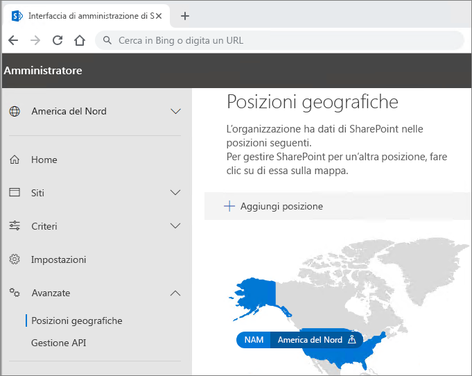

# Multi-Geo Capabilities in OneDrive e SharePoint Online

La funzionalità Multi-Geo Capabilities in OneDrive e SharePoint Online consente di controllare il paese/area geografica in cui sono archiviate le risorse condivise, ad esempio siti dei team di SharePoint e cassette postali dei gruppi di Microsoft 365.

Ogni utente, ogni cassetta postale di Gruppi e ogni sito SharePoint ha una posizione dei dati preferita che indica la posizione geografica in cui i dati associati vengono archiviati. I dati personali degli utenti (cassetta postale di Exchange e OneDrive) insieme ai siti SharePoint o ai gruppi di Microsoft 365 creati, possono essere archiviati nella posizione geografica specificata per soddisfare i requisiti di residenza dei dati. È possibile [specificare amministratori diversi per ogni posizione geografica](add-a-sharepoint-geo-admin.md).

In questo modo gli utenti avranno un’esperienza uniforme quando usano i servizi di Microsoft 365, incluse le applicazioni Office, OneDrive e Search. Per i dettagli vedere [Esperienza utente in un ambiente multi-geografico](multi-geo-user-experience.md).

## OneDrive

Ogni utente di OneDrive può essere gestito o [spostato da un amministratore](move-onedrive-between-geo-locations.md) in una posizione satellite in base alla propria posizione dei dati preferita. I file personali vengono quindi mantenuti in tale posizione geografica, ma possono essere condivisi con utenti di altre posizioni geografiche.

## Gruppi e siti di SharePoint

La gestione della funzionalità Multi-Geo è disponibile tramite l'interfaccia di amministrazione di SharePoint. Per informazioni dettagliate, vedere il [post del blog corrispondente](https://techcommunity.microsoft.com/t5/Office-365-Blog/Now-available-Multi-Geo-in-SharePoint-and-Office-365-Groups/ba-p/263302).

Quando un utente crea un sito connesso a un gruppo di SharePoint in un ambiente multi-geografico, la posizione preferita dei dati viene usata per determinare la posizione geografica in cui viene creato il sito e la relativa cassetta postale di Gruppi. Se la posizione dei dati preferita dell'utente non è stata impostata o è stata impostata una posizione geografica non configurata come satellite, il sito e la cassetta postale vengono creati nella posizione centrale.

Solo i servizi Exchange, OneDrive e SharePoint di Microsoft 365 dispongono della funzionalità Multi-Geo. Tuttavia, i gruppi di Microsoft 365 creati con questi servizi riportano la posizione dei dati preferita dell'autore e le cassette postali dei gruppi di Exchange e il sito SharePoint dei Gruppi di O365 verranno forniti nella posizione geografica corrispondente. 

## Gestione dell'ambiente multi-geografico

La configurazione e la gestione dell'ambiente multi-geo vengono eseguite tramite l'interfaccia di amministrazione di SharePoint. 

Per alcune azioni, come il trasferimento di un sito di SharePoint o OneDrive, è necessario Microsoft PowerShell.

## Vedere anche

[Multi-Geo in gruppi di SharePoint e Microsoft 365](https://techcommunity.microsoft.com/t5/Office-365-Blog/Now-available-Multi-Geo-in-SharePoint-and-Office-365-Groups/ba-p/263302)

[Amministrare un ambiente multi-geo](administering-a-multi-geo-environment.md)

[Quote di archiviazione di SharePoint in ambienti multi-geo ](sharepoint-multi-geo-storage-quota.md)

[Amministrazione delle cassette postali di Exchange Online in un ambiente multi-geo](administering-exchange-online-multi-geo.md)
