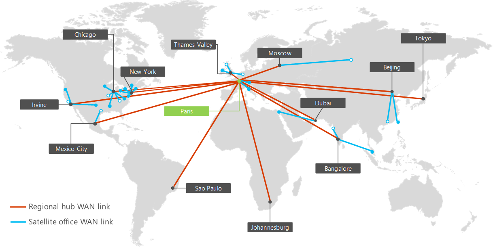

# Servizi di rete per Contoso CorporationNetworking for the Contoso Corporation

 **Riepilogo:** Informazioni sulla definizione e sugli elementi del cloud ibrido Microsoft.**Summary:** Understand the definition and elements of Microsoft hybrid cloud.
  
Per adottare un'infrastruttura con cloud, gli ingegneri di rete Contoso hanno fatto un importante passo in avanti in merito al flusso del traffico di rete verso i servizi basati su cloud. Invece di ottimizzare solo il traffico verso server e data center locali, occorre prestare la stessa attenzione all'ottimizzazione del traffico verso Internet e in Internet.To adopt a cloud-inclusive infrastructure, Contoso's network engineers realized the fundamental shift in the way that network traffic to cloud-based services travels. Instead of only optimizing traffic to on-premises servers and datacenters, equal attention must be paid to optimizing traffic to the Internet edge and across the Internet.
  
## Infrastruttura di rete di ContosoContoso's networking infrastructure

Contoso dispone dell'infrastruttura di rete mostrata nella figura 1.Contoso has the networking infrastructure shown in Figure 1.
  
**Figura 1: Infrastruttura WAN di Contoso****Figure 1: Contoso's WAN infrastructure**

  
Nella figura 1 vengono illustrate le sedi Contoso nel mondo e la serie di collegamenti WAN delle sedi secondarie e regionali tra di esse.Figure 1 shows the Contoso's offices across the globe and the set of regional and satellite office WAN links between them.
  
Elementi aggiuntivi della rete sono i seguenti:Additional elements of their network are the following:
  
- Rete localeOn-premises network
    
    I collegamenti WAN connettono la sede di Parigi ad altri uffici regionali e gli uffici regionali agli uffici secondari in una configurazione di tipo spoke and hub. All'interno di ogni ufficio, i router indirizzano il traffico a punti di accesso wireless o host sulle sottoreti, che utilizzano lo spazio di indirizzi IP privato.WAN links connect the Paris headquarters to regional offices and regional offices to satellite offices in a spoke and hub configuration. Within each office, routers deliver traffic to hosts or wireless access points on subnets, which use the private IP address space.
    
- Connessione InternetInternet connectivity
    
    Ogni ufficio ha una propria connettività Internet tramite un server proxy. Questa in genere viene implementata come collegamento WAN a un ISP locale che fornisce anche indirizzi IP pubblici per il server proxy.Each office has its own Internet connectivity via a proxy server. This is typically implemented as a WAN link to a local ISP that also provides public IP addresses for the proxy server.
    
- Presenza InternetInternet presence
    
    Contoso possiede il nome di dominio pubblico contoso.com. Il sito Web pubblico di Contoso per ordinare prodotti è un set di server in un datacenter connesso a Internet nel campus di Parigi. Contoso utilizza un intervallo di indirizzi IP pubblico /24 su Internet.Contoso owns the contoso.com public domain name. The Contoso public web site for ordering products is a set of servers in an Internet-connected datacenter in the Paris campus. Contoso uses a /24 public IP address range on the Internet.
    
## Infrastruttura delle app di ContosoContoso's app infrastructure

Contoso ha ideato l'applicazione e l'infrastruttura del server per le operazioni seguenti:Contoso has architected its application and server infrastructure for the following:
  
**Figura 2: infrastruttura di Contoso per applicazioni interne****Figure 2: Contoso's infrastructure for internal applications**

  
- Gli uffici secondari si avvalgono dei server di memorizzazione nella cache locale per archiviare documenti con accesso frequente e siti Web interni.Satellite offices use local caching servers to store frequently-accessed documents and internal web sites.
    
- Gli hub regionali si avvalgono di server applicazioni regionali per gli uffici regionali e quelli secondari. Tali server effettuano la sincronizzazione con i server della sede di Parigi.Regional hubs use regional application servers for the regional and satellite offices. These servers synchronize with servers in the Paris headquarters.
    
- Il campus di Parigi dispone di datacenter che contengono i server applicazioni centralizzati che servono l'intera organizzazione.The Paris campus has the datacenters that contain the centralized application servers that serve the entire organization.
    
Per gli utenti negli uffici secondari o negli hub regionali, il 60% delle risorse necessarie ai dipendenti può essere fornito da server degli uffici secondari e degli hub regionali. Il restante 40% delle richieste di risorse deve passare attraverso un collegamento WAN al campus di Parigi.For users in satellite or regional hub offices, 60% of the resources needed by employees can be served by satellite and regional hub office servers. The additional 40% of resource requests must go over the WAN link to the Paris campus.
  
## Analisi della rete di ContosoContoso's network analysis

Ecco i risultati dell'analisi di Contoso relativa alle modifiche necessarie all'interno della rete per adattare le diverse categorie di offerte cloud di Microsoft:Here are the results of Contoso's analysis of the changes needed on their network to accommodate the different categories of Microsoft's cloud offerings:
  
|**Offerte cloud SaaS: Office 365, EMS e Dynamics 365****SaaS cloud offerings: Office 365, EMS, and Dynamics 365**|**PaaS di Azure: Applicazioni mobili****Azure PaaS: Mobile applications**|**IaaS di Azure: Carichi di lavoro basati su server****Azure IaaS: Server-based workloads**|
|:-----|:-----|:-----|
|Un'adozione soddisfacente dei servizi SaaS da parte degli utenti dipende da una connettività a Internet efficiente e ad elevata disponibilità o direttamente ai servizi cloud di Microsoft.Successful adoption of SaaS services by users depends on highly-available and performant connectivity to the Internet, or directly to Microsoft cloud services.    Per gli utenti che operano da dispositivi mobili, l'accesso a Internet corrente verrà considerato adeguato.For mobile users, their current Internet access is assumed to be adequate.    Per gli utenti della rete Intranet di Contoso, ogni ufficio deve analizzare e ottimizzare la velocità di Internet e del ciclo di andata e ritorno al datacenter europeo di Microsoft che ospita i tenant di Office 365, EMS e Dynamics 365.For users on the Contoso intranet, each office must be analyzed and optimized for throughput to the Internet and round-trip times to Microsoft's Europe datacenter hosting the Office 365, EMS, and Dynamics 365 tenants.    |Per offrire un supporto migliore ai dipendenti che utilizzano dispositivi mobili, le app legacy e alcuni siti di condivisione dei file sono in fase di rielaborazione e distribuzione come app PaaS di Azure. Per ottenere prestazioni ottimali, Contoso intende distribuire le nuove app da più data center Azure in tutto il mondo. Gestione traffico di Azure consente di inviare richieste di app client, se provengono da un utente che usa dispositivi mobili o da un computer in ufficio, al più vicino data center di Azure che ospita l'app.To better support mobile workers, legacy apps and some file sharing sites are being reworked and deployed as Azure PaaS apps. For optimum performance, Contoso plans to deploy the new apps from multiple Azure datacenters across the world. Azure Traffic Manager to send client app requests, whether they originate from a mobile user or a computer in the office, to the nearest Azure datacenter hosting the app.     Il reparto IT dovrà integrare la propria soluzione di monitoraggio dello stato di integrità della rete con le prestazioni dell'applicazione PaaS e la distribuzione del traffico.The IT department will need to add PaaS application performance and traffic distribution to their network health monitoring solution.   |Per spostare alcuni server legacy e di archiviazione al di fuori dei datacenter del campus di Parigi e aggiungere i server necessari per l'elaborazione di fine trimestre, Contoso prevede di usare macchine virtuali che eseguono servizi di infrastruttura di Azure.To move some legacy and archival servers out of the Paris campus datacenters and add servers as needed for quarter-end processing, Contoso plans to use virtual machines running in Azure infrastructure services.    Le reti virtuali Azure contenenti questi server devono essere progettate per gli spazi indirizzo non sovrapposti, routing e DNS integrato.The Azure virtual networks that contain these servers must be designed for non-overlapping address spaces, routing, and integrated DNS.    Il reparto IT deve includere questi server nuovi nel sistema di monitoraggio e di gestione della rete.The IT department must include these new servers in their network management and monitoring system.    |
   
## Utilizzo di ExpressRoute da parte di ContosoContoso's use of ExpressRoute

ExpressRoute è una connessione WAN dedicata dalla propria posizione a una località peer Microsoft che connette la rete alla rete cloud di Microsoft. Le connessioni ExpressRoute offrono prestazioni prevedibili e un contratto di servizio pari al 99,9% di operatività. .ExpressRoute is a dedicated WAN connection from your location to a Microsoft peering location that connects your network to the Microsoft cloud network. ExpressRoute connections provide predictable performance and a 99.9% uptime SLA. .
  
Con una connessione ExpressRoute, si è connessi alla rete cloud Microsoft e a tutti i percorsi dei data center Microsoft nello stesso continente. Il traffico tra la posizione di peering sul cloud e il data center Microsoft di destinazione viene trasportato sulla rete cloud MicrosoftWith an ExpressRoute connection, you are connected to the Microsoft cloud network and all the Microsoft datacenter locations in the same continent. The traffic between the cloud peering location and the destination Microsoft datacenter is carried over the Microsoft cloud network
  
**Figura 3: rete mondiale Microsoft Cloud****Figure 3: The Microsoft cloud network worldwide**

  
Nella figura 3 viene mostrata la rete cloud Microsoft interconnessa per le varie aree geografiche nel mondo.Figure 3 shows the interconnected Microsoft cloud network for the various regions of the world.
  
Con ExpressRoute Premium, puoi raggiungere qualsiasi datacenter Microsoft in qualsiasi continente da qualsiasi posizione di peering Microsoft. Il traffico tra i continenti viene trasportato sulla rete cloud Microsoft.With ExpressRoute Premium, you can reach any Microsoft datacenter on any continent from any Microsoft peering location on any continent. The traffic between continents is carried over the Microsoft cloud network.
  
In base all'analisi di offerte sul traffico attuale e futuro sul cloud di Microsoft, Contoso ha eseguito una valutazione della rete e ha implementato una connessione (basata su MPLS) ExpressRoute punto a punto, con relazioni di peering pubblico e privato, dalla sede di Parigi alla posizione peer Microsoft in Europa.Based on the analysis of current and future traffic to Microsoft's cloud offerings, Contoso has performed a network assessment and implemented an any-to-any (MPLS-based) ExpressRoute connection for access to Azure resources, with private and public peering relationships, from the Paris headquarters to the Microsoft peering location in Europe.
  
Questa connessione fornisce al reparto IT di Contoso:This connection will give Contoso's IT department:
  
- Prestazioni coerenti per l'amministrazione delle app di Azure PaaS distribuiteConsistent performance for administration of distributed Azure PaaS apps
    
    Tutti gli sviluppatori di applicazioni e amministratori dell'infrastruttura IT principale di Contoso sono nel campus di Parigi. Con le app di Azure PaaS distribuite su diversi datacenter di Azure in tutto il mondo, Contoso necessita di prestazioni coerenti dal campus di Parigi per amministrare le app e le relative risorse di archiviazione, costituite da TB di documenti.All of Contoso's application developers and core infrastructure IT administrators are in the Paris campus. With Azure PaaS apps distributed to different Azure datacenters around the world, Contoso needs consistent performance from the Paris campus to administer the apps and their storage resources, which consist of TB of documents.
    
- Prestazioni coerenti per l'amministrazione dei server di Azure IaaSConsistent performance for administration of servers in Azure IaaS
    
    Gli amministratori dei datacenter di Contoso sono nel campus di Parigi e i server da distribuire in Azure sono un'estensione del datacenter di Parigi. Contoso necessita di prestazioni coerenti su questi nuovi server per accedere alle app legacy e allo spazio di archiviazione, nonché per l'elaborazione di fine trimestre.Contoso's datacenter administrators are in the Paris campus and the servers to be deployed in Azure are an extension of the Paris datacenter. Contoso needs consistent performance to these new servers for access to legacy apps and archival storage and for end-of-quarter processing.
    
## Percorso di Contoso per la predisposizione della rete cloudContoso's path to cloud networking readiness

Contoso usa la seguente procedura per predisporre la rete per il cloud Microsoft:Contoso uses the following steps to ready their network for the Microsoft cloud:
  
1. Ottimizzazione dei computer dei dipendenti per l'accesso a InternetOptimize employee computers for Internet access
    
    I computer degli utenti verranno verificati per assicurarsi che siano installati i più recenti stack TCP/IP, browser, driver NIC e gli aggiornamenti di sicurezza e del sistema operativo.Individual computers will be checked to ensure that the latest TCP/IP stack, browser, NIC drivers, and security and operating system updates are installed.
    
2. Analizzare l'utilizzo della connessione Internet in ogni ufficio e aumentare in base alle esigenzeAnalyze Internet connection utilization at each office and increase as needed
    
    Verrà analizzato l'utilizzo di Internet di ciascun ufficio e la larghezza di banda del collegamento WAN verrà incrementata se opera al 70% dell'utilizzo oppure oltre.Each office will be analyzed for the current Internet usage and WAN link bandwidth will be increased if operating at 70% or above utilization.
    
3. Analizzare i sistemi DMZ in ogni sede per ottenere prestazioni ottimaliAnalyze DMZ systems at each office for optimal performance
    
    Firewalls, IDS e altri sistemi verranno analizzati nel percorso Internet per ottenere prestazioni ottimali. I server proxy verranno aggiornati in base alle esigenze.Firewalls, IDSs, and other systems in the Internet path will be analyzed for optimal performance. Proxy servers will be updated or upgraded as needed.
    
4. Aggiunta di ExpressRoute per il campus di ParigiAdd ExpressRoute for the Paris campus
    
    Garantisce l'accesso coerente alle risorse Azure per l'amministrazione dei carichi di lavoro di PaaS e IaaS di Azure.Provides consistent access to Azure resources for administration of Azure PaaS and IaaS workloads.
    
5. Creazione e test di un profilo Azure Traffic Manager per le app PaaS di AzureCreate and test an Azure Traffic Manager profile for Azure PaaS apps
    
    Verifica di un profilo Azure Traffic Manager che utilizza il metodo di routing delle prestazioni per acquisire esperienza nella distribuzione del traffico Internet alle sedi regionali.Test an Azure Traffic Manager profile that uses the performance routing method to gain experience in distributing Internet traffic to regional locations.
    
6. Conservazione dello spazio di indirizzi privato per le reti virtuali di AzureReserve private address space for Azure VNets
    
    Conservazione dello spazio di indirizzi privato per le reti virtuali e le sottoreti di Azure in base ai numeri di server proiettati a breve e a lungo termine in IaaS di Azure.Based on the numbers of projected short and long-term servers in Azure IaaS, reserve private address space for Azure VNets and their subnets.
    
## Vedere ancheSee Also

[Contoso nel Microsoft CloudContoso in the Microsoft Cloud](contoso-in-the-microsoft-cloud.md)
  
[Risorse sull'architettura IT del cloud MicrosoftMicrosoft Cloud IT architecture resources](microsoft-cloud-it-architecture-resources.md)

[Guida di orientamento del cloud aziendale Microsoft: risorse per i decision maker del settore ITMicrosoft's Enterprise Cloud Roadmap: Resources for IT Decision Makers](https://sway.com/FJ2xsyWtkJc2taRD)

