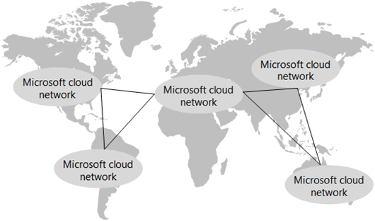

# Servizi di rete per Contoso Corporation

 **Riepilogo:** Informazioni sulla definizione e sugli elementi del cloud ibrido Microsoft.
  
Per adottare un'infrastruttura con cloud, gli ingegneri di rete Contoso hanno fatto un importante passo in avanti in merito al flusso del traffico di rete verso i servizi basati su cloud. Invece di ottimizzare solo il traffico verso server e data center locali, occorre prestare la stessa attenzione all'ottimizzazione del traffico verso Internet e in Internet.
  
## Infrastruttura di rete di Contoso

Contoso dispone dell'infrastruttura di rete mostrata nella figura 1.
  
**Figura 1: Infrastruttura WAN di Contoso**

  
Nella figura 1 vengono illustrate le sedi Contoso nel mondo e la serie di collegamenti WAN delle sedi secondarie e regionali tra di esse.
  
Elementi aggiuntivi della rete sono i seguenti:
  
- Rete locale
    
    I collegamenti WAN connettono la sede di Parigi ad altri uffici regionali e gli uffici regionali agli uffici secondari in una configurazione di tipo spoke and hub. All'interno di ogni ufficio, i router indirizzano il traffico a punti di accesso wireless o host sulle sottoreti, che utilizzano lo spazio di indirizzi IP privato.
    
- Connessione Internet
    
    Ogni ufficio ha una propria connettività Internet tramite un server proxy. Questa in genere viene implementata come collegamento WAN a un ISP locale che fornisce anche indirizzi IP pubblici per il server proxy.
    
- Presenza Internet
    
    Contoso possiede il nome di dominio pubblico contoso.com. Il sito Web pubblico di Contoso per ordinare prodotti è un set di server in un datacenter connesso a Internet nel campus di Parigi. Contoso utilizza un intervallo di indirizzi IP pubblico /24 su Internet.
    
## Infrastruttura delle app di Contoso

Contoso ha ideato l'applicazione e l'infrastruttura del server per le operazioni seguenti:
  
**Figura 2: infrastruttura di Contoso per applicazioni interne**

  
- Gli uffici secondari si avvalgono dei server di memorizzazione nella cache locale per archiviare documenti con accesso frequente e siti Web interni.
    
- Gli hub regionali utilizzano server applicazioni regionali per gli uffici secondari e regionali. Questi server vengono sincronizzati con i server della sede di Parigi.
    
- Il campus di Parigi dispone di datacenter che contengono i server applicazioni centralizzati che servono l'intera organizzazione.
    
Per gli utenti negli uffici secondari o negli hub regionali, il 60% delle risorse necessarie ai dipendenti può essere fornito da server degli uffici secondari e degli hub regionali. Il restante 40% delle richieste di risorse deve passare attraverso un collegamento WAN al campus di Parigi.
  
## Analisi della rete di Contoso

Ecco i risultati dell'analisi di Contoso relativa alle modifiche necessarie all'interno della rete per adattare le diverse categorie di offerte cloud di Microsoft:
  
|**Offerte cloud SaaS: Office 365, EMS e Dynamics 365**|**PaaS di Azure: Applicazioni mobili**|**IaaS di Azure: Carichi di lavoro basati su server**|
|:-----|:-----|:-----|
|Un'adozione soddisfacente dei servizi SaaS da parte degli utenti dipende da una connettività a Internet efficiente e ad elevata disponibilità o direttamente ai servizi cloud di Microsoft.    Per gli utenti che operano da dispositivi mobili, l'accesso a Internet corrente verrà considerato adeguato.    Per gli utenti della rete Intranet di Contoso, ogni ufficio deve analizzare e ottimizzare la velocità di Internet e del ciclo di andata e ritorno al datacenter europeo di Microsoft che ospita i tenant di Office 365, EMS e Dynamics 365.    |Per offrire un supporto migliore ai dipendenti che utilizzano dispositivi mobili, le app legacy e alcuni siti di condivisione dei file sono in fase di rielaborazione e distribuzione come app PaaS di Azure. Per ottenere prestazioni ottimali, Contoso intende distribuire le nuove app da più data center Azure in tutto il mondo. Gestione traffico di Azure consente di inviare richieste di app client, se provengono da un utente che usa dispositivi mobili o da un computer in ufficio, al più vicino data center di Azure che ospita l'app.     Il reparto IT dovrà integrare la propria soluzione di monitoraggio dello stato di integrità della rete con le prestazioni dell'applicazione PaaS e la distribuzione del traffico.   |Per spostare alcuni server legacy e di archiviazione al di fuori dei datacenter del campus di Parigi e aggiungere i server necessari per l'elaborazione di fine trimestre, Contoso prevede di usare macchine virtuali che eseguono servizi di infrastruttura di Azure.    Le reti virtuali Azure contenenti questi server devono essere progettate per gli spazi indirizzo non sovrapposti, routing e DNS integrato.    Il reparto IT deve includere questi server nuovi nel sistema di monitoraggio e di gestione della rete.    |
   
## Utilizzo di ExpressRoute da parte di Contoso

ExpressRoute è una connessione WAN dedicata dalla propria posizione a una località peer Microsoft che connette la rete alla rete cloud di Microsoft. Le connessioni ExpressRoute offrono prestazioni prevedibili e un contratto di servizio pari al 99,9% di operatività. .
  
Con una connessione ExpressRoute, si è connessi alla rete cloud Microsoft e a tutti i percorsi dei data center Microsoft nello stesso continente. Il traffico tra la posizione di peering sul cloud e il data center Microsoft di destinazione viene trasportato sulla rete cloud Microsoft
  
**Figura 3: rete mondiale Microsoft Cloud**

  
Nella figura 3 viene mostrata la rete cloud Microsoft interconnessa per le varie aree geografiche nel mondo.
  
Con ExpressRoute Premium, puoi raggiungere qualsiasi datacenter Microsoft in qualsiasi continente da qualsiasi posizione di peering Microsoft. Il traffico tra i continenti viene trasportato sulla rete cloud Microsoft.
  
In base all'analisi di offerte sul traffico attuale e futuro sul cloud di Microsoft, Contoso ha eseguito una valutazione della rete e ha implementato una connessione (basata su MPLS) ExpressRoute punto a punto, con relazioni di peering pubblico e privato, dalla sede di Parigi alla posizione peer Microsoft in Europa.
  
Questa connessione fornisce al reparto IT di Contoso:
  
- Prestazioni coerenti per l'amministrazione delle app di Azure PaaS distribuite
    
    Tutti gli sviluppatori di applicazioni e amministratori dell'infrastruttura IT principale di Contoso sono nel campus di Parigi. Con le app di Azure PaaS distribuite su diversi datacenter di Azure in tutto il mondo, Contoso necessita di prestazioni coerenti dal campus di Parigi per amministrare le app e le relative risorse di archiviazione, costituite da TB di documenti.
    
- Prestazioni coerenti per l'amministrazione dei server di Azure IaaS
    
    Gli amministratori dei datacenter di Contoso sono nel campus di Parigi e i server da distribuire in Azure sono un'estensione del datacenter di Parigi. Contoso necessita di prestazioni coerenti su questi nuovi server per accedere alle app legacy e allo spazio di archiviazione, nonché per l'elaborazione di fine trimestre.
    
## Percorso di Contoso per la predisposizione della rete cloud

Contoso usa la seguente procedura per predisporre la rete per il cloud Microsoft:
  
1. Ottimizzazione dei computer dei dipendenti per l'accesso a Internet
    
    I computer degli utenti verranno verificati per assicurarsi che siano installati i più recenti stack TCP/IP, browser, driver NIC e gli aggiornamenti di sicurezza e del sistema operativo.
    
2. Analizzare l'utilizzo della connessione Internet in ogni ufficio e aumentare in base alle esigenze
    
    Verrà analizzato l'utilizzo di Internet di ciascun ufficio e la larghezza di banda del collegamento WAN verrà incrementata se opera al 70% dell'utilizzo oppure oltre.
    
3. Analizzare i sistemi DMZ in ogni sede per ottenere prestazioni ottimali
    
    Firewalls, IDS e altri sistemi verranno analizzati nel percorso Internet per ottenere prestazioni ottimali. I server proxy verranno aggiornati in base alle esigenze.
    
4. Aggiunta di ExpressRoute per il campus di Parigi
    
    Garantisce l'accesso coerente alle risorse Azure per l'amministrazione dei carichi di lavoro di PaaS e IaaS di Azure.
    
5. Creazione e test di un profilo Azure Traffic Manager per le app PaaS di Azure
    
    Verifica di un profilo Azure Traffic Manager che utilizza il metodo di routing delle prestazioni per acquisire esperienza nella distribuzione del traffico Internet alle sedi regionali.
    
6. Conservazione dello spazio di indirizzi privato per le reti virtuali di Azure
    
    Conservazione dello spazio di indirizzi privato per le reti virtuali e le sottoreti di Azure in base ai numeri di server proiettati a breve e a lungo termine in IaaS di Azure.
    
## See Also

[Contoso nel Microsoft Cloud](contoso-in-the-microsoft-cloud.md)
  
[Risorse sull'architettura IT del cloud Microsoft](microsoft-cloud-it-architecture-resources.md)

[Guida di orientamento del cloud aziendale Microsoft: risorse per i decision maker del settore IT](https://sway.com/FJ2xsyWtkJc2taRD)

