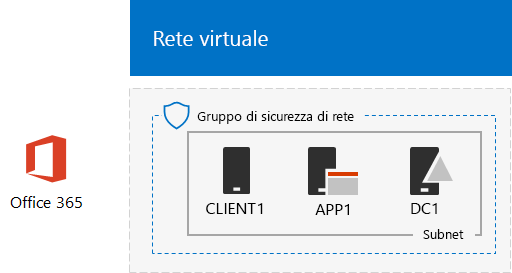

# <a name="office-365-devtest-environment"></a><span data-ttu-id="88ddd-103">Ambiente di sviluppo/test di Office 365</span><span class="sxs-lookup"><span data-stu-id="88ddd-103">Office 365 dev/test environment</span></span>

 <span data-ttu-id="88ddd-104">**Riepilogo:** usare la seguente guida al lab test per creare una sottoscrizione di valutazione di Office 365 per valutazione o sviluppo/test.</span><span class="sxs-lookup"><span data-stu-id="88ddd-104">**Summary:** Use this Test Lab Guide to create an Office 365 trial subscription for evaluation or dev/test.</span></span>
  
<span data-ttu-id="88ddd-p101">È possibile utilizzare una sottoscrizione di valutazione di Office 365 e creare un ambiente di sviluppo/test di Office 365 per le applicazioni o per illustrare le caratteristiche e funzionalità di Office 365. Sono disponibili due versioni:</span><span class="sxs-lookup"><span data-stu-id="88ddd-p101">You can use an Office 365 trial subscription and create an Office 365 dev/test environment for applications or to demonstrate features and capabilities of Office 365. There are two versions:</span></span>
  
- <span data-ttu-id="88ddd-107">L'ambiente di sviluppo/test di Office 365 semplificato è costituito da una sottoscrizione di valutazione di Office 365 che richiede l'accesso dal computer principale.</span><span class="sxs-lookup"><span data-stu-id="88ddd-107">The lightweight Office 365 dev/test environment consists of an Office 365 trial subscription that you access from your main computer.</span></span>
    
    <span data-ttu-id="88ddd-p102">Utilizzare questo ambiente quando si desidera illustrare rapidamente una funzionalità. Per l'ambiente di sviluppo/test di Office 365 semplificato, completare solamente le fasi 2 e 3 del presente articolo.</span><span class="sxs-lookup"><span data-stu-id="88ddd-p102">Use this environment when you want to quickly demonstrate a feature. For the lightweight Office 365 dev/test environment, complete only phases 2 and 3 of this article.</span></span>
    
- <span data-ttu-id="88ddd-p103">L'ambiente di sviluppo/test di Office 365 dell'azienda simulata è composto da una sottoscrizione di valutazione di Office 365 e da una intranet di un'organizzazione semplificata connessa a Internet, che è ospitata nei servizi infrastruttura di Microsoft Azure. È possibile compilare questa configurazione completamente nel cloud Microsoft.</span><span class="sxs-lookup"><span data-stu-id="88ddd-p103">The simulated enterprise Office 365 dev/test environment consists of an Office 365 trial subscription and a simplified organization intranet connected to the Internet, which is hosted in Microsoft Azure infrastructure services. You can build this configuration completely in the Microsoft cloud.</span></span>
    
    <span data-ttu-id="88ddd-p104">Utilizzare questo ambiente per illustrare una funzionalità o un'app in un ambiente simile a una rete di un'organizzazione tipica connessa a Internet o per le funzionalità che richiedono questo tipo di ambiente. Per l'ambiente di sviluppo/test di Office 365 dell'azienda simulata, completare le fasi 1, 2 e 3 di questo articolo.</span><span class="sxs-lookup"><span data-stu-id="88ddd-p104">Use this environment when you want to demonstrate a feature or an app in an environment that resembles a typical organization network connected to the Internet, or for features that require this type of environment. For the simulated enterprise Office 365 dev/test environment, complete phases 1, 2, and 3 of this article.</span></span>
    
> [!NOTE]
> <span data-ttu-id="88ddd-p105">Si consiglia di stampare questo articolo per registrare i valori specifici necessari per questo ambiente nei 30 giorni della sottoscrizione di valutazione di Office 365. È possibile estendere la sottoscrizione di valutazione per altri 30 giorni. Per un ambiente di sviluppo/test permanente, creare una nuova sottoscrizione a pagamento con un numero limitato di licenze.</span><span class="sxs-lookup"><span data-stu-id="88ddd-p105">You might want to print this article to record the specific values that you will need for this environment over the 30 days of the Office 365 trial subscription. You can easily extend the trail subscription for another 30 days. For a permanent dev/test environment, create a new paid subscription with a small number of licenses.</span></span> 
  

  
> [!TIP]
> <span data-ttu-id="88ddd-118">Fare clic [qui](http://aka.ms/catlgstack) per consultare una mappa di tutti gli articoli relativi alla guida al lab test di One Microsoft Cloud.</span><span class="sxs-lookup"><span data-stu-id="88ddd-118">Click [here](http://aka.ms/catlgstack) for a visual map to all the articles in the One Microsoft Cloud Test Lab Guide stack.</span></span>
  
## <a name="phase-1-create-the-base-configuration-in-azure"></a><span data-ttu-id="88ddd-119">Fase 1: creare la configurazione di base in Azure</span><span class="sxs-lookup"><span data-stu-id="88ddd-119">Phase 1: Create the base configuration in Azure</span></span>

<span data-ttu-id="88ddd-120">Seguire le istruzioni riportate in [Ambiente di sviluppo/test della configurazione di base](base-configuration-dev-test-environment.md).</span><span class="sxs-lookup"><span data-stu-id="88ddd-120">Follow the instructions in [Base Configuration dev/test environment](base-configuration-dev-test-environment.md).</span></span>
  
<span data-ttu-id="88ddd-p106">È necessario disporre di una sottoscrizione ad Azure. È possibile utilizzare [la versione di prova di Azure](https://azure.microsoft.com/pricing/free-trial/) per tale configurazione. Se si dispone di una sottoscrizione MSDN o Visual Studio, vedere [Credito Azure mensile per sottoscrittori di Visual Studio](https://azure.microsoft.com/pricing/member-offers/msdn-benefits-details/).</span><span class="sxs-lookup"><span data-stu-id="88ddd-p106">You will need an Azure subscription. You can use the [Azure Free Trial](https://azure.microsoft.com/pricing/free-trial/) for this configuration. If you have an MSDN or Visual Studio subscription, see [Monthly Azure credit for Visual Studio subscribers](https://azure.microsoft.com/pricing/member-offers/msdn-benefits-details/).</span></span>
  
<span data-ttu-id="88ddd-124">Di seguito è riportata la configurazione risultante.</span><span class="sxs-lookup"><span data-stu-id="88ddd-124">Here is the resulting configuration.</span></span>
  


  
<span data-ttu-id="88ddd-126">Questa configurazione è costituita dalle macchine virtuali DC1, APP1 e CLIENT1 in una subnet di una rete virtuale Azure.</span><span class="sxs-lookup"><span data-stu-id="88ddd-126">This configuration consists of the DC1, APP1, and CLIENT1 virtual machines on a subnet of an Azure virtual network.</span></span>
  
## <a name="phase-2-create-an-office-365-trial-subscription"></a><span data-ttu-id="88ddd-127">Fase 2: creare una sottoscrizione di valutazione di Office 365</span><span class="sxs-lookup"><span data-stu-id="88ddd-127">Phase 2: Create an Office 365 trial subscription</span></span>

<span data-ttu-id="88ddd-128">Per avviare la sottoscrizione di valutazione di Office 365 E5, è necessario innanzitutto un nome di società fittizia e un nuovo account Microsoft.</span><span class="sxs-lookup"><span data-stu-id="88ddd-128">To start your Office 365 E5 trial subscription, you first need a fictitious company name and a new Microsoft account.</span></span>
  
1. <span data-ttu-id="88ddd-p107">Si consiglia di utilizzare una variante del nome aziendale Contoso per il nome dell'azienda, che è un nome aziendale fittizio utilizzato nel contenuto di esempio di Microsoft, ma non è obbligatorio. Registrare il nome della società fittizia qui: </span><span class="sxs-lookup"><span data-stu-id="88ddd-p107">We recommend that you use a variant of the company name Contoso for your company name, which is a fictitious company used in Microsoft sample content, but it isn't required. Record your fictitious company name here: </span></span>
    
2. <span data-ttu-id="88ddd-p108">Per registrare un nuovo account Microsoft, andare su [https://outlook.com](https://outlook.com) e creare un account con un nuovo account di posta elettronica e indirizzo. Utilizzare questo account per iscriversi a Office 365.</span><span class="sxs-lookup"><span data-stu-id="88ddd-p108">To sign up for a new Microsoft account, go to [https://outlook.com](https://outlook.com) and create an account with a new email account and address. You will use this account to sign up for Office 365.</span></span>
    
  - <span data-ttu-id="88ddd-133">Registrare il nome e cognome del nuovo account qui: </span><span class="sxs-lookup"><span data-stu-id="88ddd-133">Record the first and last name of your new account here: </span></span>
    
  - <span data-ttu-id="88ddd-134">Registrare l'indirizzo e-mail del nuovo account qui: @outlook.com</span><span class="sxs-lookup"><span data-stu-id="88ddd-134">Record the new email account address here: @outlook.com</span></span>
    
### <a name="sign-up-for-an-office-365-e5-trial-subscription"></a><span data-ttu-id="88ddd-135">Registrare una sottoscrizione di valutazione di Office 365 E5</span><span class="sxs-lookup"><span data-stu-id="88ddd-135">Sign up for an Office 365 E5 trial subscription</span></span>

1. <span data-ttu-id="88ddd-136">Per l'ambiente di sviluppo/test semplificato di Office 365, aprire il browser Internet sul computer e andare su [https://aka.ms/e5trial](https://aka.ms/e5trial).</span><span class="sxs-lookup"><span data-stu-id="88ddd-136">For the lightweight Office 365 dev/test environment, open the Internet browser on your computer and go to [https://aka.ms/e5trial](https://aka.ms/e5trial).</span></span> 
    
    <span data-ttu-id="88ddd-137">Per l'ambiente di sviluppo/test aziendale simulato di Office 365, connettersi a CLIENT1 con l'account CORP\User1 dal portale di Azure.</span><span class="sxs-lookup"><span data-stu-id="88ddd-137">For the simulated enterprise Office 365 dev/test environment, connect to CLIENT1 with the CORP\User1 account from the Azure portal.</span></span>

    <span data-ttu-id="88ddd-138">Dalla schermata Start, eseguire Microsoft Edge e andare su [https://aka.ms/e5trial](https://aka.ms/e5trial).</span><span class="sxs-lookup"><span data-stu-id="88ddd-138">From the Start screen, run Microsoft Edge and go to [https://aka.ms/e5trial](https://aka.ms/e5trial).</span></span>
    
2. <span data-ttu-id="88ddd-139">Nella pagina **Benvenuto, vogliamo conoscerti meglio**, specificare:</span><span class="sxs-lookup"><span data-stu-id="88ddd-139">On the **Welcome, let's get to know you** page, specify:</span></span>
    
  - <span data-ttu-id="88ddd-140">La posizione fisica dell'utente</span><span class="sxs-lookup"><span data-stu-id="88ddd-140">Your physical location</span></span>
    
  - <span data-ttu-id="88ddd-141">Nome e cognome del nuovo account Microsoft</span><span class="sxs-lookup"><span data-stu-id="88ddd-141">The first and last name of your new Microsoft account</span></span>
    
  - <span data-ttu-id="88ddd-142">Il nuovo indirizzo di account di posta elettronica</span><span class="sxs-lookup"><span data-stu-id="88ddd-142">Your new email account address</span></span>
    
  - <span data-ttu-id="88ddd-143">Un numero di telefono dell'ufficio</span><span class="sxs-lookup"><span data-stu-id="88ddd-143">A business phone number</span></span>
    
  - <span data-ttu-id="88ddd-144">Il nome dell'azienda fittizia</span><span class="sxs-lookup"><span data-stu-id="88ddd-144">Your fictional company name</span></span>
    
  - <span data-ttu-id="88ddd-145">Dimensioni dell'organizzazione comprese tra 250-999 persone</span><span class="sxs-lookup"><span data-stu-id="88ddd-145">An organization size of 250-999 people</span></span>
    
3. <span data-ttu-id="88ddd-146">Fare clic su **Ultimo passaggio**.</span><span class="sxs-lookup"><span data-stu-id="88ddd-146">Click **Just one more step**.</span></span>
    
4. <span data-ttu-id="88ddd-147">Nella pagina **Crea ID utente**, digitare un nome utente in base al nuovo indirizzo di posta elettronica, il nome della società fittizia dopo il segno @ (rimuovere tutti gli spazi nel nome), quindi una password (due volte) del nuovo account di Office 365. </span><span class="sxs-lookup"><span data-stu-id="88ddd-147">On the **Create your user ID** page, type a user name based on your new email address, your fictional company after the @ sign (remove all spaces in the name), then a password (twice) for this new Office 365 account.</span></span>
    
    <span data-ttu-id="88ddd-148">Annotare la password in un posto sicuro.</span><span class="sxs-lookup"><span data-stu-id="88ddd-148">Record the password that you typed in a secure location.</span></span>
    
    <span data-ttu-id="88ddd-149">Registrare il nome della società fittizia, a cui fare riferimento con **nome dell'organizzazione**, qui: </span><span class="sxs-lookup"><span data-stu-id="88ddd-149">Record your fictional company name, to be referred to as the **organization name**, here: </span></span>
    
5. <span data-ttu-id="88ddd-150">Fare clic su **Crea account**.</span><span class="sxs-lookup"><span data-stu-id="88ddd-150">Click **Create my account**.</span></span>
    
6. <span data-ttu-id="88ddd-p109">Nella pagina **Dimostra che non sei un robot**, digitare il numero di telefono di un telefono che riceve SMS, quindi fare clic su **Inviami un SMS**.</span><span class="sxs-lookup"><span data-stu-id="88ddd-p109">On the **Prove. You're. Not. A. Robot.** page, type the phone number of your text-capable phone, and then click **Text me**.</span></span>
    
7. <span data-ttu-id="88ddd-153">Immettere il codice di verifica del messaggio di testo ricevuto, quindi fare clic su **Avanti**.</span><span class="sxs-lookup"><span data-stu-id="88ddd-153">Type the verification code from the received text message, and then click **Next**.</span></span>
    
8. <span data-ttu-id="88ddd-154">Registrare l'URL della pagina di accesso qui (selezionare e copiare): </span><span class="sxs-lookup"><span data-stu-id="88ddd-154">Record the sign-in page URL here (select and copy): </span></span>
    
9. <span data-ttu-id="88ddd-155">Registrare l'ID utente qui (selezionare e copiare): .onmicrosoft.com</span><span class="sxs-lookup"><span data-stu-id="88ddd-155">Record the user ID here (select and copy): .onmicrosoft.com</span></span>
    
    <span data-ttu-id="88ddd-156">Questo valore verrà denominato **Nome amministratore globale di Office 365**.</span><span class="sxs-lookup"><span data-stu-id="88ddd-156">This value will be referred to as the **Office 365 global administrator name**.</span></span>
    
10. <span data-ttu-id="88ddd-157">Quando viene visualizzato **Sei pronto per partire**, selezionarlo.</span><span class="sxs-lookup"><span data-stu-id="88ddd-157">When you see **You're ready to go**, click it.</span></span>
    
11. <span data-ttu-id="88ddd-158">Nella pagina successiva, attendere che Office 365 completi la configurazione e che siano disponibili tutti i riquadri.</span><span class="sxs-lookup"><span data-stu-id="88ddd-158">On the next page, wait until Office 365 completes setting up and all the tiles are available.</span></span>
    
<span data-ttu-id="88ddd-159">Dovrebbe essere visualizzata la pagina principale del portale di Office 365 dalla quale è possibile accedere ai servizi di Office Online e all'interfaccia di amministrazione di Microsoft 365.</span><span class="sxs-lookup"><span data-stu-id="88ddd-159">You should see main Office 365 portal page from which you can access Office Online services and the Office 365 Admin center.</span></span>
  
<span data-ttu-id="88ddd-160">Per l'ambiente di sviluppo/test di Office 365 dell'azienda simulata, ecco la configurazione risultante.</span><span class="sxs-lookup"><span data-stu-id="88ddd-160">For the simulated enterprise Office 365 dev/test environment, here is your resulting configuration.</span></span>
  

  
<span data-ttu-id="88ddd-162">Questa configurazione è costituita da:</span><span class="sxs-lookup"><span data-stu-id="88ddd-162">This configuration consists of:</span></span> 
  
- <span data-ttu-id="88ddd-163">Le macchine virtuali DC1, APP1 e CLIENT1 in una subnet di una rete virtuale Azure.</span><span class="sxs-lookup"><span data-stu-id="88ddd-163">The DC1, APP1, and CLIENT1 virtual machines on a subnet of an Azure virtual network.</span></span>
    
- <span data-ttu-id="88ddd-164">Una sottoscrizione di valutazione di Office 365 E5.</span><span class="sxs-lookup"><span data-stu-id="88ddd-164">An Office 365 E5 Trial Subscription.</span></span>
    
## <a name="phase-3-configure-your-office-365-trial-subscription"></a><span data-ttu-id="88ddd-165">Fase 3: configurazione di una sottoscrizione di valutazione di Office 365</span><span class="sxs-lookup"><span data-stu-id="88ddd-165">Phase 3: Configure your Office 365 trial subscription</span></span>

<span data-ttu-id="88ddd-166">In questa fase, configurare la sottoscrizione a Office 365 con altri utenti e i siti del team di SharePoint Online.</span><span class="sxs-lookup"><span data-stu-id="88ddd-166">In this phase, you configure your Office 365 subscription with additional users and SharePoint Online team sites.</span></span>
  
<span data-ttu-id="88ddd-167">Innanzitutto, aggiungere quattro nuovi utenti e assegnare loro le licenze E5.</span><span class="sxs-lookup"><span data-stu-id="88ddd-167">First, you add four new users and assign them E5 licenses.</span></span>
  
<span data-ttu-id="88ddd-168">Utilizzare le istruzioni fornite in [Connettersi a Office 365 PowerShell](https://technet.microsoft.com/library/dn975125.aspx) per installare i moduli di PowerShell e connettersi alla nuova sottoscrizione di Office 365 da:</span><span class="sxs-lookup"><span data-stu-id="88ddd-168">Use the instructions in [Connect to Office 365 PowerShell](https://technet.microsoft.com/library/dn975125.aspx) to install the PowerShell modules and connect to your new Office 365 subscription from:</span></span>
  
- <span data-ttu-id="88ddd-169">Dal computer (per l'ambiente di sviluppo/test di Office 365 leggero).</span><span class="sxs-lookup"><span data-stu-id="88ddd-169">Your computer (for the lightweight Office 365 dev/test environment).</span></span>
    
- <span data-ttu-id="88ddd-170">Dalla macchina virtuale CLIENT1 (per l'ambiente di sviluppo/test di Office 365 aziendale simulato).</span><span class="sxs-lookup"><span data-stu-id="88ddd-170">The CLIENT1 virtual machine (for the simulated enterprise Office 365 dev/test environment).</span></span>
    
 <span data-ttu-id="88ddd-171">Nella finestra di dialogo Richiesta credenziali di Windows PowerShell, digitare il nome dell'amministratore globale Office 365 (ad esempio: jdoe@contosotoycompany.onmicrosoft.com) e la password.</span><span class="sxs-lookup"><span data-stu-id="88ddd-171">In the Windows PowerShell Credential Request dialog box, type the Office 365 global administrator name (example: jdoe@contosotoycompany.onmicrosoft.com) and password.</span></span>
  
<span data-ttu-id="88ddd-172">Immettere il nome dell'organizzazione (ad esempio: contosotoycompany), il prefisso internazionale a due caratteri e quindi eseguire i comandi seguenti dal prompt Modulo Microsoft Azure Active Directory per Windows PowerShell:</span><span class="sxs-lookup"><span data-stu-id="88ddd-172">Fill in your organization name (example: contosotoycompany), the two-character country code for your location, and then run the following commands from the Windows Azure Active Directory Module for Windows PowerShell prompt:</span></span>
  
```
$orgName="<organization name>"
$loc="<two-character country code, such as US>"
$licAssignment= $orgName + ":ENTERPRISEPREMIUM"
$userName= "user2@" + $orgName + ".onmicrosoft.com"
New-MsolUser -DisplayName "User 2" -FirstName User -LastName 2 -UserPrincipalName $userName -UsageLocation $loc -LicenseAssignment $licAssignment
```
<!--
> [!TIP]
> Click [here](https://gallery.technet.microsoft.com/PowerShell-commands-for-fe3d7a34) to get a text file that has all the PowerShell commands in this article.
-->

<span data-ttu-id="88ddd-173">Dalla visualizzazione del comando **New-MsolUser**, prendere nota della password generata per l'account User 2 e conservarla in una posizione sicura.</span><span class="sxs-lookup"><span data-stu-id="88ddd-173">From the display of the **New-MsolUser** command, note the generated password for the User 2 account and record it in a safe location.</span></span>
  
<span data-ttu-id="88ddd-174">Eseguire i comandi seguenti dal prompt Modulo Microsoft Azure Active Directory per Windows PowerShell:</span><span class="sxs-lookup"><span data-stu-id="88ddd-174">Run the following commands from the Windows Azure Active Directory Module for Windows PowerShell prompt:</span></span>
  
```
$userName= "user3@" + $orgName + ".onmicrosoft.com"
New-MsolUser -DisplayName "User 3" -FirstName User -LastName 3 -UserPrincipalName $userName -UsageLocation $loc -LicenseAssignment $licAssignment
```

<span data-ttu-id="88ddd-175">Dalla visualizzazione del comando **New-MsolUser**, prendere nota della password generata per l'account User 3 e conservarla in una posizione sicura.</span><span class="sxs-lookup"><span data-stu-id="88ddd-175">From the display of the **New-MsolUser** command, note the generated password for the User 3 account and record it in a safe location.</span></span>
  
<span data-ttu-id="88ddd-176">Eseguire i comandi seguenti dal prompt Modulo Microsoft Azure Active Directory per Windows PowerShell:</span><span class="sxs-lookup"><span data-stu-id="88ddd-176">Run the following commands from the Windows Azure Active Directory Module for Windows PowerShell prompt:</span></span>
  
```
$userName= "user4@" + $orgName + ".onmicrosoft.com"
New-MsolUser -DisplayName "User 4" -FirstName User -LastName 4 -UserPrincipalName $userName -UsageLocation $loc -LicenseAssignment $licAssignment
```

<span data-ttu-id="88ddd-177">Dalla visualizzazione del comando **New-MsolUser**, prendere nota della password generata per l'account User 4 e conservarla in una posizione sicura.</span><span class="sxs-lookup"><span data-stu-id="88ddd-177">From the display of the **New-MsolUser** command, note the generated password for the User 4 account and record it in a safe location.</span></span>
  
<span data-ttu-id="88ddd-178">Eseguire i comandi seguenti dal prompt Modulo Microsoft Azure Active Directory per Windows PowerShell:</span><span class="sxs-lookup"><span data-stu-id="88ddd-178">Run the following commands from the Windows Azure Active Directory Module for Windows PowerShell prompt:</span></span>
  
```
$userName= "user5@" + $orgName + ".onmicrosoft.com"
New-MsolUser -DisplayName "User 5" -FirstName User -LastName 5 -UserPrincipalName $userName -UsageLocation $loc -LicenseAssignment $licAssignment
```

<span data-ttu-id="88ddd-179">Dalla visualizzazione del comando **New-MsolUser**, prendere nota della password generata per l'account User 5 e conservarla in una posizione sicura.</span><span class="sxs-lookup"><span data-stu-id="88ddd-179">From the display of the **New-MsolUser** command, note the generated password for the User 5 account and record it in a safe location.</span></span>
  
<span data-ttu-id="88ddd-180">Successivamente, creare tre nuovi siti del team di SharePoint Online per i reparti Vendite, Produzione e Supporto tecnico.</span><span class="sxs-lookup"><span data-stu-id="88ddd-180">Next, you create three new SharePoint Online team sites for the Sales, Production, and Support departments.</span></span>
  
## <a name="phase-4-create-three-new-sharepoint-online-team-sites-optional"></a><span data-ttu-id="88ddd-181">Fase 4: Creare tre nuovi siti del team di SharePoint Online (facoltativo)</span><span class="sxs-lookup"><span data-stu-id="88ddd-181">Phase 4: Create three new SharePoint Online team sites (optional)</span></span>

<span data-ttu-id="88ddd-182">In questa fase configurare un set di siti del team di SharePoint Online.</span><span class="sxs-lookup"><span data-stu-id="88ddd-182">In this phase, you configure a set of SharePoint Online team sites.</span></span>
  
1. <span data-ttu-id="88ddd-183">Installare [SharePoint Online Management Shell](https://go.microsoft.com/fwlink/p/?LinkId=255251) (versione x64).</span><span class="sxs-lookup"><span data-stu-id="88ddd-183">Install the [SharePoint Online Management Shell](https://go.microsoft.com/fwlink/p/?LinkId=255251) (the x64 version).</span></span>
    
2. <span data-ttu-id="88ddd-184">Nella schermata **Start** digitare **sharepoint**, quindi fare clic su **SharePoint Online Management Shell**.</span><span class="sxs-lookup"><span data-stu-id="88ddd-184">Click **Start**, type **sharepoint**, and then click **SharePoint Online Management Shell**.</span></span>
    
3. <span data-ttu-id="88ddd-185">Immettere il nome dell'organizzazione (esempio: contosotoycompany), quindi eseguire comandi seguenti dal prompt di SharePoint Online Management Shell per connettersi al servizio SharePoint Online</span><span class="sxs-lookup"><span data-stu-id="88ddd-185">Fill in your organization name (example: contosotoycompany), and then run the following commands from the SharePoint Online Management Shell prompt to connect to the SharePoint Online service</span></span>
```
$orgName="<organization name>"
$spURL="https://" + $orgName + "-admin.sharepoint.com"
Connect-SPOService -Url $spURL
```

4. <span data-ttu-id="88ddd-186">Nella finestra di dialogo **SharePoint Online Management Shell di Microsoft**, digitare il nome dell'amministratore globale di Office 365 (ad esempio: jdoe@contosotoycompany.onmicrosoft.com) e la password, quindi fare clic su **Accedi**.</span><span class="sxs-lookup"><span data-stu-id="88ddd-186">In the **Microsoft SharePoint Online Management Shell** dialog box, type the Office 365 global administrator name (example: jdoe@contosotoycompany.onmicrosoft.com) and password, and then click **Sign in**.</span></span>
    
5. <span data-ttu-id="88ddd-187">Per creare tre nuovi siti del team (Vendite, Produzione e Supporto tecnico), inserire il nome di un amministratore globale di Office 365, quindi eseguire i comandi seguenti dal prompt di SharePoint Online Management Shell:</span><span class="sxs-lookup"><span data-stu-id="88ddd-187">To create three new team sites (Sales, Production, and Support), fill in the Office 365 global administrator name, and then run the following commands from the SharePoint Online Management Shell prompt:</span></span>
    
  ```
  $owner = "<global administrator account name>"
$siteURL = "https://" + $orgName + ".sharepoint.com/sites/sales"
New-SPOSite -Url $siteURL -Owner $owner -StorageQuota 1000 -Title "Sales site collection" -Template "STS#0"
$siteURL = "https://" + $orgName + ".sharepoint.com/sites/production"
New-SPOSite -Url $siteURL -Owner $owner -StorageQuota 1000 -Title "Production site collection" -Template "STS#0"
$siteURL = "https://" + $orgName + ".sharepoint.com/sites/support"
New-SPOSite -Url $siteURL -Owner $owner -StorageQuota 1000 -Title "Support site collection" -Template "STS#0"
  ```

6. <span data-ttu-id="88ddd-188">Eseguire questo comando per elencare gli URL dei nuovi siti:</span><span class="sxs-lookup"><span data-stu-id="88ddd-188">Run this command to list the URLs of these new sites:</span></span>
    
  ```
  Get-SPOSite | Where URL -like "*/sites/*" | Sort URL | Select URL
  ```

7. <span data-ttu-id="88ddd-189">In Internet Explorer, immettere l'URL del sito Produzione per visualizzare il sito del team di SharePoint Online predefinito per il reparto di produzione.</span><span class="sxs-lookup"><span data-stu-id="88ddd-189">In Internet Explorer, enter the URL of the Production site to see the default SharePoint Online team site for the Production department.</span></span>
    
## <a name="record-values-for-future-reference"></a><span data-ttu-id="88ddd-190">Registrare i valori per consultarli in futuro</span><span class="sxs-lookup"><span data-stu-id="88ddd-190">Record values for future reference</span></span>

<span data-ttu-id="88ddd-191">Registrare questi valori per utilizzarli o distribuire altre guide al lab test nell'ambiente di test di distribuzione:</span><span class="sxs-lookup"><span data-stu-id="88ddd-191">Record these values for working with or deploying additional Test Lab Guides in this test environment:</span></span>
  
- <span data-ttu-id="88ddd-192">Nome amministratore globale di Office 365: .onmicrosoft.com (dal passaggio 9 della fase 2)</span><span class="sxs-lookup"><span data-stu-id="88ddd-192">Office 365 global administrator name: .onmicrosoft.com (from step 9 of Phase 2)</span></span>
    
    <span data-ttu-id="88ddd-193">Annotare anche la password dell'account in una posizione sicura.</span><span class="sxs-lookup"><span data-stu-id="88ddd-193">Also record the password for this account in a secure location.</span></span>
    
- <span data-ttu-id="88ddd-194">Nome dell'organizzazione della sottoscrizione di valutazione:  onmicrosoft.com (dal passaggio 4 della fase 2)</span><span class="sxs-lookup"><span data-stu-id="88ddd-194">Your trial subscription organization name:  (from step 4 of Phase 2)</span></span>
    
- <span data-ttu-id="88ddd-195">Per elencare gli account di User 2, User 3, User 4, e User 5, eseguire i comandi seguenti dal modulo di Microsoft Azure Active Directory per il prompt di Windows PowerShell:</span><span class="sxs-lookup"><span data-stu-id="88ddd-195">To list the accounts for User 2, User 3, User 4, and User 5, run the following command from the Windows Azure Active Directory Module for Windows PowerShell prompt:</span></span>
    
  ```
  Get-MSolUser | Sort UserPrincipalName | Select UserPrincipalName
  ```

    <span data-ttu-id="88ddd-196">Registrare i nomi degli account qui:</span><span class="sxs-lookup"><span data-stu-id="88ddd-196">Record the account names here:</span></span>
    
  - <span data-ttu-id="88ddd-197">Nome account utente User 2: user2@.onmicrosoft.com</span><span class="sxs-lookup"><span data-stu-id="88ddd-197">User 2 account name: user2@.onmicrosoft.com</span></span>
    
  - <span data-ttu-id="88ddd-198">Nome account utente User 3: user3@.onmicrosoft.com</span><span class="sxs-lookup"><span data-stu-id="88ddd-198">User 3 account name: user3@.onmicrosoft.com</span></span>
    
  - <span data-ttu-id="88ddd-199">Nome account utente User 4: user4@.onmicrosoft.com</span><span class="sxs-lookup"><span data-stu-id="88ddd-199">User 4 account name: user4@.onmicrosoft.com</span></span>
    
  - <span data-ttu-id="88ddd-200">Nome account utente User 5: user5@.onmicrosoft.com</span><span class="sxs-lookup"><span data-stu-id="88ddd-200">User 5 account name: user5@.onmicrosoft.com</span></span>
    
    <span data-ttu-id="88ddd-201">Annotare anche le password degli account in una posizione sicura.</span><span class="sxs-lookup"><span data-stu-id="88ddd-201">Also record the passwords for these accounts in a secure location.</span></span>
    
- <span data-ttu-id="88ddd-202">(Facoltativo) Per elencare gli URL dei siti dei team Vendite, Produzione e Supporto tecnico, eseguire il comando seguente dal prompt di SharePoint Online Management Shell:</span><span class="sxs-lookup"><span data-stu-id="88ddd-202">(optional) To list the URLs for the Sales, Production, and Support team sites, run the following command from the SharePoint Online Management Shell prompt:</span></span>
    
  ```
  Get-SPOSite | Where URL -like "*/sites/*" | Sort URL | Select URL
  ```

  - <span data-ttu-id="88ddd-203">URL del sito Produzione: https://.sharepoint.com/sites/production</span><span class="sxs-lookup"><span data-stu-id="88ddd-203">Production site URL: https://.sharepoint.com/sites/production</span></span>
    
  - <span data-ttu-id="88ddd-204">URL del sito Vendite: https://.sharepoint.com/sites/sales</span><span class="sxs-lookup"><span data-stu-id="88ddd-204">Sales site URL: https://.sharepoint.com/sites/sales</span></span>
    
  - <span data-ttu-id="88ddd-205">URL del sito Supporto tecnico: https://.sharepoint.com/sites/support</span><span class="sxs-lookup"><span data-stu-id="88ddd-205">Support site URL: https://.sharepoint.com/sites/support</span></span>
    
## <a name="next-steps"></a><span data-ttu-id="88ddd-206">Passaggi successivi</span><span class="sxs-lookup"><span data-stu-id="88ddd-206">Next steps</span></span>

<span data-ttu-id="88ddd-207">Utilizzare questi articoli aggiuntivi nell'ambiente di sviluppo/test di Office 365:</span><span class="sxs-lookup"><span data-stu-id="88ddd-207">Use these additional articles in your Office 365 dev/test environment:</span></span>
  
- [<span data-ttu-id="88ddd-208">Sincronizzazione della directory per l'ambiente di sviluppo/test di Office 365</span><span class="sxs-lookup"><span data-stu-id="88ddd-208">Directory Synchronization for your Office 365 dev/test environment</span></span>](dirsync-for-your-office-365-dev-test-environment.md)
    
- [<span data-ttu-id="88ddd-209">Autenticazione a più fattori per l'ambiente di sviluppo/test di Office 365. </span><span class="sxs-lookup"><span data-stu-id="88ddd-209">Multi-factor authentication for your Office 365 dev/test environment</span></span>](multi-factor-authentication-for-your-office-365-dev-test-environment.md)
    
- [<span data-ttu-id="88ddd-210">Identità federata per l'ambiente di sviluppo/test di Office 365</span><span class="sxs-lookup"><span data-stu-id="88ddd-210">Federated identity for your Office 365 dev/test environment</span></span>](federated-identity-for-your-office-365-dev-test-environment.md)
    
- [<span data-ttu-id="88ddd-211">Cloud App Security per l'ambiente di sviluppo/test di Office 365</span><span class="sxs-lookup"><span data-stu-id="88ddd-211">Cloud App Security for your Office 365 dev/test environment</span></span>](cloud-app-security-for-your-office-365-dev-test-environment.md)
    
- [<span data-ttu-id="88ddd-212">Protezione avanzata dalle minacce per l'ambiente di sviluppo/test di Office 365</span><span class="sxs-lookup"><span data-stu-id="88ddd-212">Advanced Threat Protection for your Office 365 dev/test environment</span></span>](advanced-threat-protection-for-your-office-365-dev-test-environment.md)
    
- [<span data-ttu-id="88ddd-213">Advanced eDiscovery per l'ambiente di sviluppo/test di Office 365</span><span class="sxs-lookup"><span data-stu-id="88ddd-213">Advanced eDiscovery for your Office 365 dev/test environment</span></span>](advanced-ediscovery-for-your-office-365-dev-test-environment.md)
    
- [<span data-ttu-id="88ddd-214">Protezione dei file sensibili nell’ambiente di sviluppo/test di Office 365</span><span class="sxs-lookup"><span data-stu-id="88ddd-214">Sensitive file protection in the Office 365 dev/test environment</span></span>](sensitive-file-protection-in-the-office-365-dev-test-environment.md)
    
- [<span data-ttu-id="88ddd-215">Sito del team SharePoint Online isolato nell'ambiente di sviluppo/test</span><span class="sxs-lookup"><span data-stu-id="88ddd-215">Isolated SharePoint Online team site dev/test environment</span></span>](isolated-sharepoint-online-team-site-dev-test-environment.md)
    
- [<span data-ttu-id="88ddd-216">Classificazione e assegnazione di etichette ai dati nell'ambiente di sviluppo/test di Office 365 </span><span class="sxs-lookup"><span data-stu-id="88ddd-216">Data classification and labeling in the Office 365 dev/test environment</span></span>](data-classification-and-labeling-in-the-office-365-dev-test-environment.md)
    
<span data-ttu-id="88ddd-217">Estendere l'ambiente di sviluppo/test di Office 365 per includere ulteriori offerte cloud di Microsoft:</span><span class="sxs-lookup"><span data-stu-id="88ddd-217">Extend your Office 365 dev/test environment to include additional Microsoft cloud offerings:</span></span>
  
- [<span data-ttu-id="88ddd-218">Ambiente di sviluppo/test di Microsoft 365 Enterprise</span><span class="sxs-lookup"><span data-stu-id="88ddd-218">The Microsoft 365 Enterprise dev/test environment</span></span>](the-microsoft-365-enterprise-dev-test-environment.md)
    
- [<span data-ttu-id="88ddd-219">Ambiente di sviluppo/test di Office 365 e Dynamics 365</span><span class="sxs-lookup"><span data-stu-id="88ddd-219">Office 365 and Dynamics 365 dev/test environment</span></span>](office-365-and-dynamics-365-dev-test-environment.md)
    
## <a name="see-also"></a><span data-ttu-id="88ddd-220">Vedere anche</span><span class="sxs-lookup"><span data-stu-id="88ddd-220">See Also</span></span>

- [<span data-ttu-id="88ddd-221">Guida al lab test (TLG) per adozione del cloud</span><span class="sxs-lookup"><span data-stu-id="88ddd-221">Cloud adoption Test Lab Guides (TLGs)</span></span>](cloud-adoption-test-lab-guides-tlgs.md)
  
- [<span data-ttu-id="88ddd-222">Ambiente di sviluppo/test di Office 365 e Dynamics 365</span><span class="sxs-lookup"><span data-stu-id="88ddd-222">Office 365 and Dynamics 365 dev/test environment</span></span>](office-365-and-dynamics-365-dev-test-environment.md)
  
- [<span data-ttu-id="88ddd-223">Adozione del cloud e soluzioni ibride</span><span class="sxs-lookup"><span data-stu-id="88ddd-223">Cloud adoption and hybrid solutions</span></span>](cloud-adoption-and-hybrid-solutions.md)


