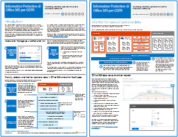

# Information Protection di Office 365 per GDPROffice 365 Information Protection for GDPR

 **Sintesi:** questa soluzione mostra come proteggere i dati riservati archiviati nei servizi di Office 365.**Summary:** This solution demonstrates how to protect sensitive data that is stored in Office 365 services.
  
Questa soluzione include suggerimenti prescrittivi per individuare, classificare, proteggere e monitorare i dati personali. Questa soluzione utilizza l'RGPD come esempio, ma è possibile applicare lo stesso processo per raggiungere la conformità con molti altri regolamenti.This solution includes prescriptive recommendations for discovering, classifying, protecting, and monitoring personal data. This solution uses General Data Protection Regulation (GDPR) as an example, but you can apply the same process to achieve compliance with many other regulations.

  
[PDF](http://download.microsoft.com/download/E/C/D/ECD5A339-EF10-4420-B3A9-99098884D716/MSFT_Cloud_architecture_information protection for GDPR.pdf)  | [Visio](http://download.microsoft.com/download/E/C/D/ECD5A339-EF10-4420-B3A9-99098884D716/MSFT_Cloud_architecture_information protection for GDPR.vsdx)[PDF](http://download.microsoft.com/download/E/C/D/ECD5A339-EF10-4420-B3A9-99098884D716/MSFT_Cloud_architecture_information protection for GDPR.pdf)  | [Visio](http://download.microsoft.com/download/E/C/D/ECD5A339-EF10-4420-B3A9-99098884D716/MSFT_Cloud_architecture_information protection for GDPR.vsdx)
  

## Vedere ancheSee Also

[Soluzioni di sicurezzaSecurity solutions](security-solutions.md)
  
[Guida sulla sicurezza Microsoft per organizzazioni che si occupano della campagna politica, no profit e altre organizzazioni agiliMicrosoft Security Guidance for Political Campaigns, Nonprofits, and Other Agile Organizations](microsoft-security-guidance-for-political-campaigns-nonprofits-and-other-agile-o.md)

