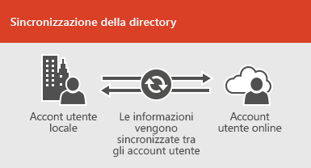
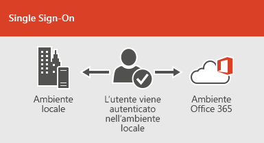

# Integrazione di Office 365 con ambienti localiOffice 365 integration with on-premises environments

È possibile integrare Office 365 con i servizi directory esistenti e con un'installazione locale di Exchange Server, Skype for Business Server 2015 o SharePoint Server 2013.You can integrate Office 365 with your existing directory services and with an on-premises installation of Exchange Server, Skype for Business Server 2015, or SharePoint Server 2013.
  
 - Quando si esegue l'integrazione con i servizi directory, è possibile sincronizzare e gestire gli account utente per entrambi gli ambienti.When you integrate with directory services, you can synchronize and manage user accounts for both environments. È inoltre possibile aggiungere la sincronizzazione hash delle password o Single Sign-on (SSO), in modo che gli utenti possano accedere a entrambi gli ambienti con le credenziali locali.You can also add password hash synchronization or single sign-on (SSO) so users can log on to both environments with their on-premises credentials.
 - Quando si esegue l'integrazione con i prodotti server locali, si crea un ambiente ibrido.When you integrate with on-premises server products, you create a hybrid environment. Un ambiente ibrido può essere di aiuto durante la migrazione di utenti o informazioni a Office 365 oppure è possibile continuare ad avere alcuni utenti o alcune informazioni in locale e altre nel cloud.A hybrid environment can help as you migrate users or information to Office 365, or you can continue to have some users or some information on-premises and some in the cloud. Per ulteriori informazioni sugli ambienti ibridi, vedere [Panoramica di Office 365 Hybrid Cloud Solutions](https://support.office.com/article/59616fab-acdb-40e9-b414-cf0c965c80b7).For more information about hybrid environments, see [Office 365 hybrid cloud solutions overview](https://support.office.com/article/59616fab-acdb-40e9-b414-cf0c965c80b7).

È inoltre possibile utilizzare i consulenti di Azure AD per le indicazioni di installazione personalizzate:You can also use the Azure AD advisors for customized setup guidance:
- [Advisor di Azure AD ConnectAzure AD Connect advisor](https://aka.ms/aadconnectpwsync)
- [Advisor per la distribuzione di ADFSAD FS deployment advisor](https://aka.ms/adfsguidance)
- [Distribuzione guidata di Azure RMSAzure RMS Deployment Wizard](https://aka.ms/azuremsguidance)
- [Guida alla configurazione di Azure AD PremiumAzure AD Premium setup guidance](https://aka.ms/aadpguidance)
   
## Informazioni preliminariBefore you begin
Prima di integrare Office 365 e un ambiente locale, è inoltre necessario partecipare alla [pianificazione della rete e all'ottimizzazione delle prestazioni per office 365](network-planning-and-performance.md).Before you integrate Office 365 and an on-premises environment, you also need to attend to [network planning and performance tuning for Office 365](network-planning-and-performance.md). Sarà inoltre necessario comprendere i [modelli di identità](about-office-365-identity.md) disponibili in Office 365.You will also want to understand the available [identity models](about-office-365-identity.md) in Office 365. 

Vedere [dove gestire gli account utente di office 365](manage-office-365-accounts.md) per un elenco di strumenti che è possibile utilizzare per gestire gli account e gli utenti di Office 365.See [where to manage Office 365 user accounts](manage-office-365-accounts.md) for a list of tools you can use to manage Office 365 users and accounts. 
  
## Integrazione di Office 365 con i servizi directoryIntegrate Office 365 with directory services
Se si dispone di account utente esistenti in una directory locale, non si vuole ricreare tutti gli account in Office 365 e rischiare di introdurre differenze o errori tra gli ambienti.If you have existing user accounts in an on-premises directory, you don't want to re-create all of those accounts in Office 365 and risk introducing differences or errors between the environments. La sincronizzazione della directory consente di rispecchiare gli account tra gli ambienti online e locali.Directory synchronization helps you mirror those accounts between your online and on-premises environments. Con la sincronizzazione della directory, gli utenti non devono ricordare nuove informazioni per ogni ambiente e non è necessario creare o aggiornare due volte gli account.With directory synchronization, your users don't have to remember new information for each environment, and you don't have to create or update accounts twice. Sarà necessario [preparare la directory locale](prepare-for-directory-synchronization.md) per la sincronizzazione della directory, è possibile eseguire questa operazione manualmente o utilizzare lo [strumento IdFix](install-and-run-idfix.md) (lo strumento IdFix funziona solo con Active Directory).You will need to [prepare your on-premises directory](prepare-for-directory-synchronization.md) for directory synchronization, you can do this manually or use the [IdFix tool](install-and-run-idfix.md) (IdFix tool only works with Active Directory). 
  

  
Se si desidera che gli utenti siano in grado di accedere a Office 365 con le credenziali locali, è anche possibile configurare SSO.If you want users to be able to log on to Office 365 with their on-premises credentials, you can also configure SSO. Con SSO, Office 365 è configurato per considerare attendibile l'ambiente locale per l'autenticazione degli utenti.With SSO, Office 365 is configured to trust the on-premises environment for user authentication.
  

  
Le diverse tecniche di gestione degli account utente offrono esperienze diverse per gli utenti, come illustrato nella tabella seguente.Different user account management techniques provide different experiences for your users, as shown in the following table.
 
### **Sincronizzazione della directory con o senza la sincronizzazione dell'hash delle password o l'autenticazione pass-through****Directory synchronization with or without password hash synchronization or pass-through authentication**
Un utente accede all'ambiente locale con il proprio account utente (dominio\nomeutente).A user logs on to their on-premises environment with their user account (domain\username). Quando si accede a Office 365, è necessario eseguire di nuovo l'accesso con l'account aziendale o dell'Istituto di istruzione (user@domain.com).When they go to Office 365, they must log on again with their work or school account (user@domain.com). Il nome utente è lo stesso in entrambi gli ambienti.The user name is the same in both environments. Quando si aggiunge l'autenticazione hash della password o pass-through, l'utente ha la stessa password per entrambi gli ambienti, ma sarà necessario fornire tali credenziali quando si accede a Office 365.When you add password hash sync or pass-through authentication, the user has the same password for both environments, but will have to provide those credentials again when logging on to Office 365. La sincronizzazione della directory con la sincronizzazione hash delle password è lo scenario di sincronizzazione della directory più comunemente utilizzato.Directory synchronization with password hash sync is the most commonly used directory sync scenario.

Per configurare la sincronizzazione della directory, utilizzare Azure Active Directory Connect.To set up directory synchronization, use Azure Active Directory Connect. Per istruzioni, leggere [configurare la sincronizzazione della directory per Office 365](set-up-directory-synchronization.md)e [utilizzare Azure ad Connect con le impostazioni Express](https://go.microsoft.com/fwlink/p/?LinkId=698537).For instructions, read [Set up directory synchronization for Office 365](set-up-directory-synchronization.md), and [Use Azure AD Connect with express settings](https://go.microsoft.com/fwlink/p/?LinkId=698537).

Per ulteriori informazioni, vedere [preparazione per il provisioning degli utenti tramite la sincronizzazione della directory in Office 365](prepare-for-directory-synchronization.md) e [l'integrazione delle identificazioni locali con Azure Active Directory](https://go.microsoft.com/fwlink/?LinkId=518101).Learn more about [preparing to provision users through directory synchronization to Office 365](prepare-for-directory-synchronization.md) and [integrating your on-premises identifies with Azure Active Directory](https://go.microsoft.com/fwlink/?LinkId=518101).

### **Sincronizzazione della directory con SSO****Directory synchronization with SSO**
Un utente accede all'ambiente locale con il proprio account utente.A user logs on to their on-premises environment with their user account. Quando si accede a Office 365, sono connessi automaticamente oppure eseguono l'accesso utilizzando le stesse credenziali utilizzate per l'ambiente locale (dominio\nomeutente).When they go to Office 365, they are either logged on automatically, or they log on using the same credentials they use for their on-premises environment (domain\username).

Per configurare SSO, è inoltre possibile utilizzare Azure AD Connect.To set up SSO you also use Azure AD Connect. Per istruzioni, leggere [utilizzare Azure ad Connect con impostazioni personalizzate](https://go.microsoft.com/fwlink/p/?LinkID=698430).For instructions, read [Use Azure AD Connect with custom settings](https://go.microsoft.com/fwlink/p/?LinkID=698430).

Per ulteriori informazioni [, vedere Accesso alle applicazioni e Single Sign-on con Azure Active Directory](https://go.microsoft.com/fwlink/p/?LinkId=698604).Learn more about [application access and single sign-on with Azure Active Directory](https://go.microsoft.com/fwlink/p/?LinkId=698604).

## Azure AD ConnectAzure AD Connect
Azure AD Connect sostituisce le versioni precedenti degli strumenti di integrazione delle identità, come DirSync e Azure AD Sync. Per ulteriori informazioni, vedere [integrazione delle identità locali con Azure Active Directory](https://go.microsoft.com/fwlink/p/?LinkId=527969).Azure AD Connect replaces older versions of identity integration tools such as DirSync and Azure AD Sync. For more information, see [Integrating your on-premises identities with Azure Active Directory](https://go.microsoft.com/fwlink/p/?LinkId=527969). Se si desidera eseguire l'aggiornamento dalla sincronizzazione di Azure Active Directory ad Azure AD Connect, vedere [le istruzioni per l'aggiornamento](https://go.microsoft.com/fwlink/p/?LinkId=733240).If you want to update from Azure Active Directory Sync to Azure AD Connect, see [the upgrade instructions](https://go.microsoft.com/fwlink/p/?LinkId=733240). Vedere un'architettura della soluzione creata per la [sincronizzazione della directory di Office 365 (dirsync) in Microsoft Azure](https://go.microsoft.com/fwlink/?LinkId=517887).See a solution architecture built for [Office 365 Directory Synchronization (DirSync) in Microsoft Azure](https://go.microsoft.com/fwlink/?LinkId=517887).