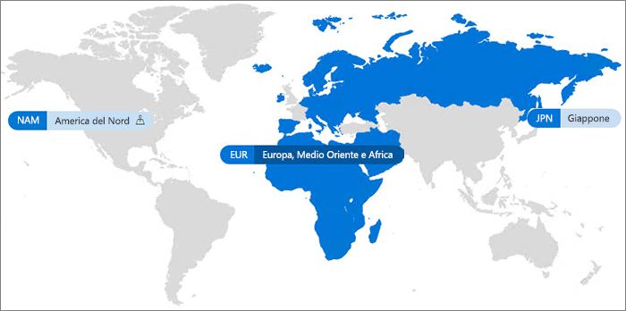

# Office 365 Multi-GeoOffice 365 Multi-Geo

Con Office 365 Multi-Geo l'organizzazione può espandere la presenza di Office 365 a più paesi/aree geografiche all'interno del tenant esistente.With Office 365 Multi-Geo, your organization can expand its Office 365 presence to multiple geographic regions and/or countries within your existing tenant. Invitare il team degli account Microsoft ad iscrivere la propria società multi-nazionale a Office 365 Multi-Geo.Reach out to your Microsoft Account Team to sign up your Multi-National Company for Office 365 Multi-Geo.
  
Con Office 365 Multi-Geo, è possibile effettuare il provisioning e archiviare i dati a riposo nelle località geografiche scelte per soddisfare i requisiti di residenza dei dati e allo stesso tempo sbloccare lo sviluppo globale delle esperienze di produttività moderna per i dipendenti.With Office 365 Multi-Geo, you can provision and store data at rest in the geo locations that you've chosen to meet data residency requirements, and at the same time unlock your global roll out of modern productivity experiences to your workforce.

#### Video: Introduzione a Office 365 Multi-GeoVideo: Introducing Office 365 Multi-Geo

> [!VIDEO https://www.microsoft.com/videoplayer/embed/RE1Yk6B?autoplay=false]

In un ambiente geografico Multi tenant di Office 365 è costituito da una posizione centralizzata (in cui l'abbonamento a Office 365 è stato originariamente provisioning) e uno o più località.In a Multi-Geo environment, your Office 365 tenant consists of a central location (where your Office 365 subscription was originally provisioned) and one or more satellite locations. In un tenant Multi-Geo, le informazioni su località geografiche, gruppi e le informazioni utente, vengono acquisite in Azure Active Directory (AAD).In a multi-geo tenant, the information about geo locations, groups, and user information, is mastered in Azure Active Directory (AAD). Poiché le informazioni del tenant sono acquisite in modo centralizzato e sincronizzate in ogni località geografica, la condivisione e le esperienze coinvolgono tutti gli utenti della società.Because your tenant information is mastered centrally and synchronized into each geo location, sharing and experiences involving anyone from your company contain global awareness.

Si noti che Office 365 Multi-Geo non è progettato principalmente per ottimizzare le prestazioni, ma per soddisfare i requisiti di residenza dei dati.Note that Office 365 Multi-Geo is not primarily designed for performance optimization, it is designed to meet data residency requirements. Per informazioni sull'ottimizzazione delle prestazioni di Office 365, vedere [Pianificazione della rete e ottimizzazione delle prestazioni per Office 365](https://support.office.com/article/e5f1228c-da3c-4654-bf16-d163daee8848) o contattare il gruppo di supporto.For information about performance optimization for Office 365, see [Network planning and performance tuning for Office 365](https://support.office.com/article/e5f1228c-da3c-4654-bf16-d163daee8848) or contact your support group.

## TerminologiaTerminology

Ecco i termini chiave utilizzati nella descrizione di Office 365 Multi-Geo:Here are the key terms used in describing Office 365 Multi-Geo:

- **Posizione centrale** - la posizione geografica in cui è stato effettuato originariamente il provisioning del tenant.**Central location** - the geo location where your tenant was originally provisioned.
- **Amministratore geografico** - un amministratore che può gestire una o più posizioni satellite specificato.**Geo administrator** - An administrator who can administer one or more specified satellite locations.
- **Codice geografico** - un codice di tre lettere per una posizione geografica specificata.**Geo code** - a three-letter code for a given geo location.
- **Posizione geografica** - un'area geografica che può essere usata in un tenant multi-geo per ospitare dati, tra cui cassette postali di Exchange, OneDrive e siti di SharePoint.**Geo location** – A geographic location that can be used in a multi-geo tenant to host data, including Exchange mailboxes and OneDrive and SharePoint sites.
- **Procedure dati posizione (PDL)** - proprietà dell’utente impostata dall'amministratore che indica la posizione geografica in cui si deve eseguire il provisioning della cassetta postale di Exchange di utenti e OneDrive.**Preferred Data Location (PDL)** – A user property set by the administrator that indicates where the geo location where the users Exchange mailbox and OneDrive should be provisioned. Il PDL determina anche se è stato effettuato il provisioning dei siti di SharePoint creati dall'utente.The PDL also determines where SharePoint sites that are created by the user are provisioned.
- **Posizione satellite** - le posizioni geografiche in cui i carichi di lavoro di Office 365 consapevoli della propria ubicazione (Exchange, SharePoint e OneDrive) sono abilitati in un tenant multi-geo.**Satellite location** – The geo locations where the geo-aware Office 365 workloads (SharePoint, OneDrive, and Exchange) are enabled in a multi-geo tenant.
- **Tenant**: rappresentazione di un'organizzazione in Office 365 che in genere contiene uno o più domini associati ad essa (ad esempio contoso.com)**Tenant** – An organization's representation in Office 365 which typically has one or more domains associated with it (for example, contoso.com).

## Disponibilità di Office 365 Multi-GeoOffice 365 Multi-Geo availability

Office 365 Multi-Geo è attualmente disponibile in questi paesi/aree geografiche:Office 365 Multi-Geo is currently offered in these regions and countries:

[!INCLUDE [Office 365 Multi-Geo locations](includes/office-365-multi-geo-locations.md)]

## IntroduzioneGetting started

Seguire questi semplici passaggi per iniziare con Multi-Geo:Follow these steps to get started with multi-geo:

1. Collaborare con il team responsabile dell'account per aggiungere _Multi-Geo Capabilities al piano di servizio di Office 365 _.Work with your account team to add the _Multi-Geo Capabilities in Office 365_ service plan. Verranno fornite le procedure per aggiungere il numero di licenze necessarie.They will guide you to add the number of licenses needed. La funzionalità Multi-Geo Capabilities è disponibile per i clienti con un minimo di 500 abbonamenti a Office 365.Multi-Geo feature is available to customers with a minimum of 500 Office 365 subscriptions.

   Prima di iniziare a usare Office 365 Multi-Geo, Microsoft deve configurare il tenant di Exchange Online per il supporto Multi-Geo.Before you can start using Office 365 Multi-Geo, Microsoft needs to configure your Exchange Online tenant for multi-geo support. La procedura di configurazione, da effettuare una sola volta, viene attivata dopo aver ordinato il piano di servizio *Funzionalità Multi-Geo di Office 365* e le licenze saranno visualizzate nel tenant.This one-time configuration process is triggered after you order the *Multi-Geo Capabilities in Office 365* service plan and the licenses show up in your tenant. Una volta che vengono applicate le licenze Multi-Geo, si riceveranno notifiche nel [Centro messaggi di Office 365](https://support.office.com/article/38FB3333-BFCC-4340-A37B-DEDA509C2093) e sarà quindi possibile iniziare la configurazione e l’uso della funzionalità Multi-Geo di Office 365.You'll receive notifications in the [Office 365 message center](https://support.office.com/article/38FB3333-BFCC-4340-A37B-DEDA509C2093) once your Multi-Geo licenses are applied and you then may begin configuring and using your Office 365 Multi-Geo capabilities.

2. Leggere [Pianificare l'ambiente Multi-Geo](plan-for-multi-geo.md).Read [Plan your multi-geo environment](plan-for-multi-geo.md).

3. Informazioni sull’[amministrazione di un ambiente Multi-Geo](administering-a-multi-geo-environment.md) e [ sul riscontro degli utenti sull’ambiente](multi-geo-user-experience.md).Learn about [administering a multi-geo environment](administering-a-multi-geo-environment.md) and [how your users will experience the environment](multi-geo-user-experience.md).

4. Quando si è pronti per impostare su Office 365 Multi-Geo, [Configurare il tenant per Multi-Geo](multi-geo-tenant-configuration.md).When you are ready to set up Office 365 Multi-Geo, [configure your tenant for multi-geo](multi-geo-tenant-configuration.md).

5. [Impostare la ricerca](configure-search-for-multi-geo.md).[Set up search](configure-search-for-multi-geo.md).

## Vedere ancheSee also

[Multi-Geo in Exchange Online e OneDriveMulti-Geo in Exchange Online and OneDrive](https://Aka.ms/GoMultiGeo)

[Multi-Geo Capabilities in OneDrive e SharePoint OnlineMulti-Geo Capabilities in OneDrive and SharePoint Online](https://docs.microsoft.com/office365/enterprise/multi-geo-capabilities-in-onedrive-and-sharepoint-online-in-office-365)

[Funzionalità Multi-Geo in Exchange OnlineMulti-Geo Capabilities in Exchange Online](https://docs.microsoft.com/office365/enterprise/multi-geo-capabilities-in-exchange-online)

[Esperienza di Teams in un ambiente multi-geograficoTeams experience in a multi-geo environment](https://docs.microsoft.com/microsoftteams/teams-experience-o365odb-spo-multi-geo)
