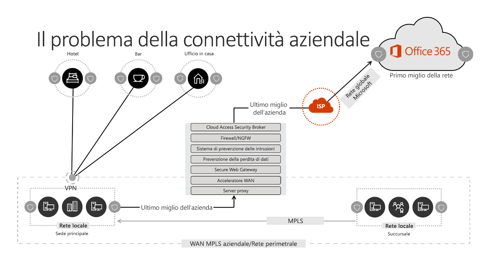
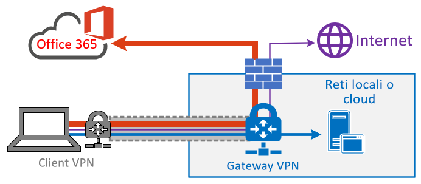
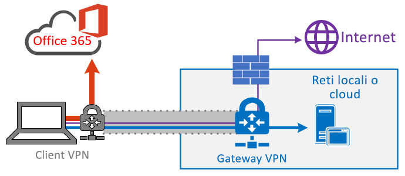
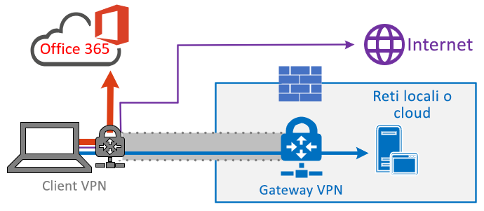
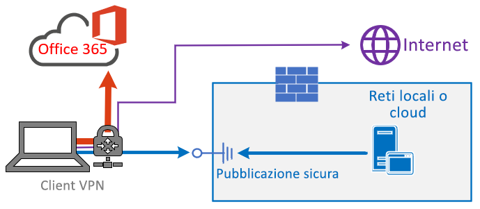

# <a name="implementing-vpn-split-tunnelling-for-office-365"></a><span data-ttu-id="c3966-103">Implementazione di split tunneling per VPN per Office 365</span><span class="sxs-lookup"><span data-stu-id="c3966-103">Implementing VPN split tunnelling for Office 365</span></span>

>[!NOTE]
><span data-ttu-id="c3966-104">Questo argomento fa parte di un set di argomenti relativi all'ottimizzazione di Office 365 per gli utenti remoti.</span><span class="sxs-lookup"><span data-stu-id="c3966-104">This topic is part of a set of topics that address Office 365 optimization for remote users.</span></span>
>- <span data-ttu-id="c3966-105">Per una panoramica sull'uso di split tunneling per VPN per ottimizzare la connettività Office 365 per gli utenti remoti, vedere [Panoramica: split tunneling per VPN per Office 365](office-365-vpn-split-tunnel.md).</span><span class="sxs-lookup"><span data-stu-id="c3966-105">For an overview of using VPN split tunnelling to optimize Office 365 connectivity for remote users, see [Overview: VPN split tunnelling for Office 365](office-365-vpn-split-tunnel.md).</span></span>
>- <span data-ttu-id="c3966-106">Per informazioni su come ottimizzare le prestazioni del tenant di Office 365 a livello mondiale per gli utenti della Cina, vedere [Ottimizzazione delle prestazioni di Office 365 per utenti della Cina](office-365-networking-china.md).</span><span class="sxs-lookup"><span data-stu-id="c3966-106">For information about optimizing Office 365 worldwide tenant performance for users in China, see [Office 365 performance optimization for China users](office-365-networking-china.md).</span></span>

<span data-ttu-id="c3966-107">Da molti anni le aziende usano reti VPN per supportare esperienze remote per gli utenti.</span><span class="sxs-lookup"><span data-stu-id="c3966-107">For many years enterprises have been using VPNs to support remote experiences for their users.</span></span> <span data-ttu-id="c3966-108">Sebbene i carichi di lavoro principali siano gestiti in locale, la rete VPN da client remoto instradata attraverso data center della rete aziendale era il metodo principale per consentire agli utenti remoti di accedere alle risorse aziendali.</span><span class="sxs-lookup"><span data-stu-id="c3966-108">Whilst core workloads remained on-premises, a VPN from the remote client routed through a datacenter on the corporate network was the primary method for remote users to access corporate resources.</span></span> <span data-ttu-id="c3966-109">Per proteggere queste connessioni, le aziende creano livelli di soluzioni di sicurezza per la rete lungo percorsi VPN.</span><span class="sxs-lookup"><span data-stu-id="c3966-109">To safeguard these connections, enterprises build layers of network security solutions along the VPN paths.</span></span> <span data-ttu-id="c3966-110">Tale soluzione permette di proteggere le infrastrutture interne e di salvaguardare la navigazione mobile di siti Web esterni reinstradando il traffico verso la VPN, quindi indirizzandolo all'esterno del perimetro Internet locale.</span><span class="sxs-lookup"><span data-stu-id="c3966-110">This was done to protect internal infrastructure as well as to safeguard mobile browsing of external web sites by rerouting traffic into the VPN and then out through the on-premises Internet perimeter.</span></span> <span data-ttu-id="c3966-111">VPN, perimetri di rete e l'infrastruttura di sicurezza associata sono stati spesso creati e ridimensionati per un volume di traffico definito, in genere con la maggior parte delle connessioni avviate dall'interno della rete aziendale, la cui maggior parte restava nei confini della rete interna.</span><span class="sxs-lookup"><span data-stu-id="c3966-111">VPNs, network perimeters and associated security infrastructure were often purpose built and scaled for a defined volume of traffic, typically with the majority of connectivity being initiated from within the corporate network, and most of it staying withing the internal network boundaries.</span></span>

<span data-ttu-id="c3966-112">Per un certo periodo di tempo, i modelli VPN in cui tutte le connessioni dal dispositivo dell'utente remoto sono inoltrate nuovamente alla rete locale (fenomeno noto come **tunnelling forzato**) erano ampiamente sostenibili fintanto che il numero di utenti remoti era contenuto e i volumi di traffico che attraversavano la VPN erano bassi.</span><span class="sxs-lookup"><span data-stu-id="c3966-112">For quite some time, VPN models where all connections from the remote user device are routed back into the on-premises network (known as **forced tunnelling**) were largely sustainable as long as the concurrent scale of remote users was modest and the traffic volumes traversing VPN were low.</span></span>  <span data-ttu-id="c3966-113">Alcuni clienti hanno continuato a usare l'imposizione del tunneling VPN come status quo, anche dopo lo spostamento delle applicazioni aziendali dall'interno del perimetro aziendale al cloud SaaS pubblico, di cui Office 365 è un esempio.</span><span class="sxs-lookup"><span data-stu-id="c3966-113">Some customers continued to use VPN force tunnelling as the status quo even after their applications moved from inside the corporate perimeter to public SaaS clouds, Office 365 being a prime example.</span></span>

<span data-ttu-id="c3966-114">L'uso di VPN con tunnel forzato per la connessione ad applicazioni cloud distribuite e sensibili alle prestazioni non è particolarmente ottimale, tuttavia tale aspetto negativo è stato accettato da alcune aziende per mantenere lo status quo dal punto di vista della sicurezza.</span><span class="sxs-lookup"><span data-stu-id="c3966-114">The use of forced tunneled VPNs for connecting to distributed and performance sensitive cloud applications is extremely suboptimal, but the negative impact of that may have been accepted by some enterprises so as to maintain the status quo from a security perspective.</span></span> <span data-ttu-id="c3966-115">Di seguito è illustrato un diagramma di esempio di questo scenario:</span><span class="sxs-lookup"><span data-stu-id="c3966-115">An example diagram of this scenario can be seen below:</span></span>



<span data-ttu-id="c3966-117">Il problema aumenta già da diversi anni, con molti clienti che segnalano un cambiamento significativo dei modelli di traffico di rete.</span><span class="sxs-lookup"><span data-stu-id="c3966-117">This problem has been growing for a number of years, with many customers reporting a significant shift of network traffic patterns.</span></span> <span data-ttu-id="c3966-118">Il traffico che in passato restava in locale, ora si connette a endpoint del cloud esterno.</span><span class="sxs-lookup"><span data-stu-id="c3966-118">Traffic which used to stay on premises now connects to external cloud endpoints.</span></span> <span data-ttu-id="c3966-119">Molti clienti Microsoft segnalano che, in precedenza, circa l'80% del traffico di rete era associato a un'origine interna, rappresentata dalla riga punteggiata nel diagramma precedente.</span><span class="sxs-lookup"><span data-stu-id="c3966-119">Numerous Microsoft customers report that previously, around 80% of their network traffic was to some internal source (represented by the dotted line in the above diagram).</span></span> <span data-ttu-id="c3966-120">Nel 2020 la percentuale è scesa a meno del 20%, perché i clienti hanno spostato i principali carichi di lavoro nel cloud. Questa tendenza è comune anche ad altre aziende.</span><span class="sxs-lookup"><span data-stu-id="c3966-120">In 2020 that number is now around 20% or lower as they have shifted major workloads to the cloud, these trends are not uncommon with other enterprises.</span></span> <span data-ttu-id="c3966-121">Con il graduale passaggio al cloud, il modello precedente risulta sempre più lento e insostenibile e ciò impedisce alle aziende di essere agili nel loro passaggio a un ambiente cloud-first.</span><span class="sxs-lookup"><span data-stu-id="c3966-121">Over time, as the cloud journey progresses, the above model becomes increasingly cumbersome and unsustainable, preventing an organization from being agile as they move into a cloud first world.</span></span>

<span data-ttu-id="c3966-122">La pandemia di COVID-19 ha aumentato il problema, per cui ora è necessario un intervento immediato.</span><span class="sxs-lookup"><span data-stu-id="c3966-122">The worldwide COVID-19 pandemic has escalated this problem to require immediate remediation.</span></span> <span data-ttu-id="c3966-123">La necessità di garantire la sicurezza dei dipendenti ha generato richieste senza precedenti all'IT aziendale per supportare la produttività lavorativa da casa su vasta scala.</span><span class="sxs-lookup"><span data-stu-id="c3966-123">The need to ensure employee safety has generated unprecedented demands on enterprise IT to support work-from-home productivity at a massive scale.</span></span> <span data-ttu-id="c3966-124">Microsoft Office 365 si trova in una posizione ottimale per consentire ai clienti di soddisfare la richiesta, ma l'alta livello di simultaneità degli utenti che lavorano da casa genera una grande quantità di traffico di Office 365, che, se instradato attraverso il tunnel VPN forzato e nel perimetro di rete locale, provoca una rapida saturazione e l'esaurimento di capacità dell'infrastruttura VPN.</span><span class="sxs-lookup"><span data-stu-id="c3966-124">Microsoft Office 365 is well positioned to help customers fulfil that demand, but high concurrency of users working from home generates a large volume of Office 365 traffic which, if routed through forced tunnel VPN and on-premises network perimeters, causes rapid saturation and runs VPN infrastructure out of capacity.</span></span> <span data-ttu-id="c3966-125">In questa nuova realtà, l'uso della VPN per accedere a Office 365 non è più solo un ostacolo alle prestazioni, ma un limite il cui impatto riguarda non solo Office 365, ma anche tutte le operazioni aziendali critiche che si avvalgono di VPN per funzionare.</span><span class="sxs-lookup"><span data-stu-id="c3966-125">In this new reality, using VPN to access Office 365 is no longer just a performance impediment, but a hard wall which not only impacts Office 365 but critical business operations which still have to rely on the VPN to operate.</span></span>

<span data-ttu-id="c3966-126">Microsoft collabora attivamente con i clienti e con il settore più ampio da molti anni, per offrire soluzioni efficaci e moderne a questi problemi all'interno dei propri servizi, e per allinearsi alle procedure consigliate del settore.</span><span class="sxs-lookup"><span data-stu-id="c3966-126">Microsoft has been working closely with customers and the wider industry for many years to provide effective, modern solutions to these problems from within our own services, and to align with industry best practice.</span></span> <span data-ttu-id="c3966-127">[I principi di connettività](https://aka.ms/pnc) per il servizio Office 365 sono stati sviluppati in modo da funzionare efficientemente per gli utenti remoti, pur consentendo a un'azienda di mantenere la sicurezza e il controllo sulla connettività.</span><span class="sxs-lookup"><span data-stu-id="c3966-127">[Connectivity principles](https://aka.ms/pnc) for the Office 365 service have been designed to work efficiently for remote users whilst still allowing an organization to maintain security and control over their connectivity.</span></span> <span data-ttu-id="c3966-128">Queste soluzioni di rapida implementazione con lavoro limitato possono avere un impatto positivo significativo sui problemi descritti.</span><span class="sxs-lookup"><span data-stu-id="c3966-128">These solutions can also be implemented very quickly with limited work yet achieve a significant positive impact on the problems outlined above.</span></span>

<span data-ttu-id="c3966-129">La strategia raccomandata da Microsoft per l'ottimizzazione della connettività dei lavoratori remoti si concentra sull'alleviamento rapido dei problemi con l'approccio tradizionale e sulla fornitura di alte prestazioni in pochi semplici passaggi.</span><span class="sxs-lookup"><span data-stu-id="c3966-129">Microsoft's recommended strategy for optimizing remote worker's connectivity is focused on rapidly alleviating the problems with the traditional approach and also providing high performance with a few simple steps.</span></span> <span data-ttu-id="c3966-130">Questa procedura regola l'approccio VPN legacy per un numero limitato di endpoint definiti che bypassano i server VPN con problemi di prestazioni.</span><span class="sxs-lookup"><span data-stu-id="c3966-130">These steps adjust the legacy VPN approach for a small number of defined endpoints which bypass bottlenecked VPN servers.</span></span> <span data-ttu-id="c3966-131">Un modello di sicurezza equivalente o addirittura superiore può essere applicato a livelli diversi per eliminare la necessità di proteggere tutto il traffico all'uscita della rete aziendale.</span><span class="sxs-lookup"><span data-stu-id="c3966-131">An equivalent or even superior security model can be applied at different layers to remove the need to secure all traffic at the egress of the corporate network.</span></span> <span data-ttu-id="c3966-132">Nella maggior parte dei casi, è possibile raggiungere questo risultato in modo efficace in poche ore, con conseguente scalabilità ad altri carichi di lavoro, come necessario e in base al tempo.</span><span class="sxs-lookup"><span data-stu-id="c3966-132">In most cases this can be effectively achieved within hours and is then scalable to other workloads as requirements demand and time allows.</span></span>

## <a name="common-vpn-scenarios"></a><span data-ttu-id="c3966-133">Scenari VPN comuni</span><span class="sxs-lookup"><span data-stu-id="c3966-133">Common VPN scenarios</span></span>

<span data-ttu-id="c3966-134">Nell'elenco riportato di seguito sono elencati gli scenari VPN più comuni verificatisi in ambiente aziendale.</span><span class="sxs-lookup"><span data-stu-id="c3966-134">In the list below you'll see the most common VPN scenarios seen in enterprise environments.</span></span> <span data-ttu-id="c3966-135">La maggior parte dei clienti gestisce tradizionalmente il modello 1 (tunnel forzato VPN).</span><span class="sxs-lookup"><span data-stu-id="c3966-135">Most customers traditionally operate model 1 (VPN Forced Tunnel).</span></span> <span data-ttu-id="c3966-136">In questa sezione è possibile passare rapidamente e in tutta sicurezza al **modello 2**, che è facilmente ottenibile e che offre enormi vantaggi alle prestazioni di rete e all'esperienza utente.</span><span class="sxs-lookup"><span data-stu-id="c3966-136">This section will help you to quickly and securely transition to **model 2**, which is achievable with relatively little effort, and which has enormous benefits to network performance and user experience.</span></span>

| <span data-ttu-id="c3966-137">**Modello**</span><span class="sxs-lookup"><span data-stu-id="c3966-137">**Model**</span></span> | <span data-ttu-id="c3966-138">**Descrizione**</span><span class="sxs-lookup"><span data-stu-id="c3966-138">**Description**</span></span> |
| --- | --- |
| [<span data-ttu-id="c3966-139">1. Tunnel forzato VPN</span><span class="sxs-lookup"><span data-stu-id="c3966-139">1. VPN Forced Tunnel</span></span>](#1-vpn-forced-tunnel) | <span data-ttu-id="c3966-140">Il 100% del traffico attraversa il tunnel VPN, incluse le attività locali, Internet e tutte le attività O365/M365</span><span class="sxs-lookup"><span data-stu-id="c3966-140">100% of traffic goes into VPN tunnel, including on-premise, Internet and all O365/M365</span></span> |
| [<span data-ttu-id="c3966-141">2. Tunnel forzato VPN con poche eccezioni</span><span class="sxs-lookup"><span data-stu-id="c3966-141">2. VPN Forced Tunnel with few exceptions</span></span>](#2-vpn-forced-tunnel-with-a-small-number-of-trusted-exceptions) | <span data-ttu-id="c3966-142">Il tunnel VPN viene usato per impostazione predefinita (la route predefinita punta alla VPN), con pochi importanti scenari che fanno eccezione e vengono eseguiti direttamente</span><span class="sxs-lookup"><span data-stu-id="c3966-142">VPN tunnel is used by default (default route points to VPN), with few, most important exempt scenarios that are allowed to go direct</span></span> |
| [<span data-ttu-id="c3966-143">3. Tunnel forzato VPN con ampie eccezioni</span><span class="sxs-lookup"><span data-stu-id="c3966-143">3. VPN Forced Tunnel with broad exceptions</span></span>](#3-vpn-forced-tunnel-with-broad-exceptions) | <span data-ttu-id="c3966-144">Il tunnel VPN viene usato per impostazione predefinita (la route predefinita punta alla VPN), con ampie eccezioni eseguite direttamente (ad esempio tutte le attività Office 365, tutte le attività Salesforce e tutte le attività Zoom)</span><span class="sxs-lookup"><span data-stu-id="c3966-144">VPN tunnel is used by default (default route points to VPN), with broad exceptions that are allowed to go direct (such as all Office 365, All Salesforce, All Zoom)</span></span> |
| [<span data-ttu-id="c3966-145">4. Tunnel selettivo VPN</span><span class="sxs-lookup"><span data-stu-id="c3966-145">4. VPN Selective Tunnel</span></span>](#4-vpn-selective-tunnel) | <span data-ttu-id="c3966-146">Il tunnel VPN viene usato solo per i servizi basati sulla rete aziendale.</span><span class="sxs-lookup"><span data-stu-id="c3966-146">VPN tunnel is used only for corpnet based services.</span></span> <span data-ttu-id="c3966-147">La route predefinita (tutti i servizi Internet e basati su Internet) viene eseguita direttamente.</span><span class="sxs-lookup"><span data-stu-id="c3966-147">Default route (Internet and all Internet based services) goes direct.</span></span> |
| [<span data-ttu-id="c3966-148">5. Nessuna VPN</span><span class="sxs-lookup"><span data-stu-id="c3966-148">5. No VPN</span></span>](#5-no-vpn) | <span data-ttu-id="c3966-149">Una variante del #2, dove al posto della VPN legacy, tutti i servizi della rete aziendale sono pubblicati con approcci di sicurezza moderni (come Zscaler ZPA, AAD Proxy/MCAS e così via)</span><span class="sxs-lookup"><span data-stu-id="c3966-149">A variation of #2, where instead of legacy VPN, all corpnet services are published through modern security approaches (like Zscaler ZPA, AAD Proxy/MCAS, etc)</span></span> |

### <a name="1-vpn-forced-tunnel"></a><span data-ttu-id="c3966-150">1. Tunnel forzato VPN</span><span class="sxs-lookup"><span data-stu-id="c3966-150">1. VPN Forced Tunnel</span></span>

<span data-ttu-id="c3966-151">Questo è lo scenario di partenza più comune per la maggior parte dei clienti aziendali.</span><span class="sxs-lookup"><span data-stu-id="c3966-151">This is the most common starting scenario for most enterprise customers.</span></span> <span data-ttu-id="c3966-152">Viene usata una VPN forzata, il che significa che il 100% del traffico viene indirizzato alla rete aziendale, indipendentemente dal fatto che l'endpoint risieda all'interno della rete aziendale o meno.</span><span class="sxs-lookup"><span data-stu-id="c3966-152">A forced VPN is used which means 100% of traffic is directed into the corporate network regardless of the fact the endpoint resides within the corporate network or not.</span></span> <span data-ttu-id="c3966-153">Il traffico associato esterno (Internet), ad esempio la navigazione Internet o Office 365, è quindi nuovamente sottoposto a hairpinning fuori dai sistemi di sicurezza locali, ad esempio i proxy.</span><span class="sxs-lookup"><span data-stu-id="c3966-153">Any external (Internet) bound traffic such as Office 365 or Internet browsing is then hairpinned back out of the on premises security equipment such as proxies.</span></span> <span data-ttu-id="c3966-154">Poiché nella situazione attuale quasi il 100% degli utenti lavora da remoto, questo modello impone un carico estremamente elevato all'infrastruttura VPN ed è probabile che ostacoli significativamente le prestazioni di tutto il traffico aziendale compromettendo l'efficienza lavorativa dell'azienda in questo momento di crisi.</span><span class="sxs-lookup"><span data-stu-id="c3966-154">In the current climate with nearly 100% of users working remotely, this model therefore puts extremely high load on the VPN infrastructure and is likely to significantly hinder performance of all corporate traffic and thus the enterprise to operate efficiently at a time of crisis.</span></span>



### <a name="2-vpn-forced-tunnel-with-a-small-number-of-trusted-exceptions"></a><span data-ttu-id="c3966-156">2. Tunnel forzato VPN con numero limitato di eccezioni attendibili</span><span class="sxs-lookup"><span data-stu-id="c3966-156">2. VPN Forced Tunnel with a small number of trusted exceptions</span></span>

<span data-ttu-id="c3966-157">Questo modello è significativamente più efficiente per un'azienda in quanto consente di ottenere un numero limitato di endpoint controllati e definiti, con carico molto elevato e sensibilità alla latenza che consentono di bypassare il tunnel VPN e l'esecuzione diretta nel servizio Office 365, in questo esempio.</span><span class="sxs-lookup"><span data-stu-id="c3966-157">This model is significantly more efficient for an enterprise to operate under as it allows a small number of controlled and defined endpoints which are very high load and latency sensitive to bypass the VPN tunnel and go direct to the Office 365 service in this example.</span></span> <span data-ttu-id="c3966-158">Ciò migliora significativamente le prestazioni per i servizi scaricati, e diminuisce anche il carico sull'infrastruttura VPN, consentendo così agli elementi che ancora lo richiedono di operare con un contenimento inferiore delle risorse.</span><span class="sxs-lookup"><span data-stu-id="c3966-158">This significantly improves the performance for the offloaded services, and also decreases the load on the VPN infrastructure, thus allowing elements which still require it to operate with lower contention for resources.</span></span> <span data-ttu-id="c3966-159">L'articolo pone l'attenzione su questo modello per facilitarvi il passaggio in quanto consente di intraprendere azioni semplici e definite molto rapidamente con numerosi esiti positivi.</span><span class="sxs-lookup"><span data-stu-id="c3966-159">It is this model which this article concentrates on assisting with the transition to as it allows for simple, defined actions to be taken very quickly with numerous positive outcomes.</span></span>


### <a name="3-vpn-forced-tunnel-with-broad-exceptions"></a><span data-ttu-id="c3966-161">3. Tunnel forzato VPN con ampie eccezioni</span><span class="sxs-lookup"><span data-stu-id="c3966-161">3. VPN Forced Tunnel with broad exceptions</span></span>

<span data-ttu-id="c3966-162">Il terzo modello allarga l'ambito del modello due, anziché semplicemente inviare un piccolo gruppo di endpoint definiti direttamente, invia tutto il traffico direttamente a servizi attendibili, ad esempio Office 365, SalesForce e così via.</span><span class="sxs-lookup"><span data-stu-id="c3966-162">The third model broadens the scope of model two as rather than just sending a small group of defined endpoints direct, it instead sends all traffic to trusted services such Office 365, SalesForce etc. direct.</span></span> <span data-ttu-id="c3966-163">Ciò consente di ridurre ulteriormente il carico sull'infrastruttura VPN aziendale e di migliorare le prestazioni dei servizi definiti.</span><span class="sxs-lookup"><span data-stu-id="c3966-163">This further reduces the load on the corporate VPN infrastructure and improves the performance of the services defined.</span></span> <span data-ttu-id="c3966-164">Poiché per questo modello è necessario più tempo per valutarne l'eseguibilità e l'implementazione, la procedura può essere eseguita in modo iterativo in un secondo momento, una volta attivato il modello 2.</span><span class="sxs-lookup"><span data-stu-id="c3966-164">As this model is likely to take more time to assess the feasibility of and implement, it is likely a step which can be taken iteratively at a later date once model two is successfully in place.</span></span>



### <a name="4-vpn-selective-tunnel"></a><span data-ttu-id="c3966-166">4. Tunnel selettivo VPN</span><span class="sxs-lookup"><span data-stu-id="c3966-166">4. VPN selective Tunnel</span></span>

<span data-ttu-id="c3966-167">Questo modello inverte il terzo modello in quanto solo il traffico identificato come avente un indirizzo IP aziendale viene inviato nel tunnel VPN e quindi il percorso Internet è la route predefinita per tutte le altre operazioni.</span><span class="sxs-lookup"><span data-stu-id="c3966-167">This model reverses the third model in that only traffic identified as having a corporate IP address is sent down the VPN tunnel and thus the Internet path is the default route for everything else.</span></span> <span data-ttu-id="c3966-168">Per implementare in sicurezza questo modello è necessario che l'organizzazione utilizzi [Zero Trust](https://www.microsoft.com/security/zero-trust?rtc=1).</span><span class="sxs-lookup"><span data-stu-id="c3966-168">This model requires an organization to be well on the path to [Zero Trust](https://www.microsoft.com/security/zero-trust?rtc=1) in able to safely implement this model.</span></span> <span data-ttu-id="c3966-169">Tenere presente che questo modello o alcune sue varianti probabilmente acquisteranno nel tempo un carattere necessario predefinito, man mano che sempre più servizi passeranno dalla rete aziendale al cloud.</span><span class="sxs-lookup"><span data-stu-id="c3966-169">It should be noted that this model or some variation thereof will likely become the necessary default over time as more and more services move away from the corporate network and into the cloud.</span></span> <span data-ttu-id="c3966-170">Microsoft fa uso di questo modello internamente. Sono disponibili ulteriori informazioni sull'implementazione della soluzione split tunneling per VPN di Microsoft nella pagina [Esecuzione del servizio VPN: la soluzione Microsoft per mantenere connessa la forza lavoro remota](https://www.microsoft.com/itshowcase/blog/running-on-vpn-how-microsoft-is-keeping-its-remote-workforce-connected/?elevate-lv).</span><span class="sxs-lookup"><span data-stu-id="c3966-170">Microsoft uses this model internally; you can find more information on Microsoft's implementation of VPN split tunnelling at [Running on VPN: How Microsoft is keeping its remote workforce connected](https://www.microsoft.com/itshowcase/blog/running-on-vpn-how-microsoft-is-keeping-its-remote-workforce-connected/?elevate-lv).</span></span>



### <a name="5-no-vpn"></a><span data-ttu-id="c3966-172">5. Nessuna VPN</span><span class="sxs-lookup"><span data-stu-id="c3966-172">5. No VPN</span></span>

<span data-ttu-id="c3966-173">Si tratta della versione più avanzata del modello 2, in cui i servizi interni sono pubblicati con un approccio di sicurezza moderno o una soluzione SDWAN, ad esempio Azure AD Proxy, MCAS, Zscaler ZPA e così via.</span><span class="sxs-lookup"><span data-stu-id="c3966-173">A more advanced version of model number two, whereby any internal services are published through a modern security approach or SDWAN solution such as Azure AD Proxy, MCAS, Zscaler ZPA etc.</span></span>



## <a name="implement-vpn-split-tunnelling"></a><span data-ttu-id="c3966-175">Implementazione di split tunneling per VPN</span><span class="sxs-lookup"><span data-stu-id="c3966-175">Implement VPN split tunnelling</span></span>

<span data-ttu-id="c3966-176">In questa sezione è disponibile la semplice procedura per eseguire la migrazione dell'architettura client VPN da _Tunnel forzato VPN_ a _Tunnel forzato VPN con numero limitato di eccezioni attendibili_, [Split tunneling per VPN, modello 2](#2-vpn-forced-tunnel-with-a-small-number-of-trusted-exceptions) della sezione [Scenari VPN comuni](#common-vpn-scenarios).</span><span class="sxs-lookup"><span data-stu-id="c3966-176">In this section, you'll find the simple steps required to migrate your VPN client architecture from a _VPN forced tunnel_ to a _VPN forced tunnel with a small number of trusted exceptions_, [VPN split tunnel model #2](#2-vpn-forced-tunnel-with-a-small-number-of-trusted-exceptions) in the [Common VPN scenarios](#common-vpn-scenarios) section.</span></span>

<span data-ttu-id="c3966-177">Il diagramma seguente illustra come funziona la soluzione split tunneling per VPN consigliata:</span><span class="sxs-lookup"><span data-stu-id="c3966-177">The diagram below illustrates how the recommended VPN split tunnel solution works:</span></span>


### <a name="1-identify-the-endpoints-to-optimize"></a><span data-ttu-id="c3966-179">1. Identificare gli endpoint da ottimizzare</span><span class="sxs-lookup"><span data-stu-id="c3966-179">1. Identify the endpoints to optimize</span></span>

<span data-ttu-id="c3966-180">Nell'argomento [URL e intervalli di indirizzi IP per Office 365](https://docs.microsoft.com/office365/enterprise/urls-and-ip-address-ranges), Microsoft identifica chiaramente i principali endpoint necessari per ottimizzarli e classificarli come **Optimize**.</span><span class="sxs-lookup"><span data-stu-id="c3966-180">In the [Office 365 URLs and IP address ranges](https://docs.microsoft.com/office365/enterprise/urls-and-ip-address-ranges) topic, Microsoft clearly identifies the key endpoints you need to optimize and categorizes them as **Optimize**.</span></span> <span data-ttu-id="c3966-181">Attualmente sono disponibili solamente quattro URL da ottimizzare e venti subnet IP.</span><span class="sxs-lookup"><span data-stu-id="c3966-181">There are currently just four URLS which need to be optimized and twenty IP subnets.</span></span> <span data-ttu-id="c3966-182">Questo piccolo gruppo di endpoint rappresenta circa il 70%-80% del volume di traffico nel servizio Office 365, che include endpoint sensibili alla latenza, come per i media di Teams.</span><span class="sxs-lookup"><span data-stu-id="c3966-182">This small group of endpoints accounts for around 70% - 80% of the volume of traffic to the Office 365 service including the latency sensitive endpoints such as those for Teams media.</span></span> <span data-ttu-id="c3966-183">Questo è il traffico cui è necessario prestare particolare attenzione ed è anche il traffico che eserciterà incredibile pressione sui percorsi di rete tradizionali e sull'infrastruttura VPN.</span><span class="sxs-lookup"><span data-stu-id="c3966-183">Essentially this is the traffic that we need to take special care of and is also the traffic which will put incredible pressure on traditional network paths and VPN infrastructure.</span></span>

<span data-ttu-id="c3966-184">Gli URL di questa categoria presentano le seguenti caratteristiche:</span><span class="sxs-lookup"><span data-stu-id="c3966-184">URLs in this category have the following characteristics:</span></span>

- <span data-ttu-id="c3966-185">Sono endpoint gestiti di proprietà di Microsoft, ospitati sull'infrastruttura Microsoft</span><span class="sxs-lookup"><span data-stu-id="c3966-185">Are Microsoft owned and managed endpoints, hosted on Microsoft infrastructure</span></span>
- <span data-ttu-id="c3966-186">Sono forniti di IP</span><span class="sxs-lookup"><span data-stu-id="c3966-186">Have IPs provided</span></span>
- <span data-ttu-id="c3966-187">Sono caratterizzati da indicatore ROC basso che dovrebbe mantenersi tale (attualmente 20 subnet IP)</span><span class="sxs-lookup"><span data-stu-id="c3966-187">Low rate of change and are expected to remain small in number (currently 20 IP subnets)</span></span>
- <span data-ttu-id="c3966-188">Sono caratterizzati da sensibilità alla latenza e/o larghezza di banda</span><span class="sxs-lookup"><span data-stu-id="c3966-188">Are bandwidth and/or latency sensitive</span></span>
- <span data-ttu-id="c3966-189">Sono in grado di avere elementi di sicurezza richiesti forniti nel servizio piuttosto che in linea sulla rete</span><span class="sxs-lookup"><span data-stu-id="c3966-189">Are able to have required security elements provided in the service rather than inline on the network</span></span>
- <span data-ttu-id="c3966-190">Rappresentano circa il 70-80% del volume di traffico nel servizio Office 365</span><span class="sxs-lookup"><span data-stu-id="c3966-190">Account for around 70-80% of the volume of traffic to the Office 365 service</span></span>

>[!NOTE]
><span data-ttu-id="c3966-191">Microsoft si impegna a sospendere le modifiche agli endpoint **Optimize** per Office 365 fino almeno al **30 giugno 2020**, per consentire agli utenti di porre l'attenzione su altre difficoltà anziché gestire l'elenco endpoint consentiti dopo l'implementazione iniziale.</span><span class="sxs-lookup"><span data-stu-id="c3966-191">Microsoft has committed to suspending changes to **Optimize** endpoints for Office 365 until at least **June 30 2020**, allowing customers to focus on other challenges rather than maintaining the endpoint whitelist once initially implemented.</span></span> <span data-ttu-id="c3966-192">Questo articolo verrà aggiornato in modo da riflettere eventuali modifiche future.</span><span class="sxs-lookup"><span data-stu-id="c3966-192">This article will be updated to reflect any future changes.</span></span>

<span data-ttu-id="c3966-193">Per altre informazioni sugli endpoint di Office 365 e su come sono classificati e gestiti, vedere l'articolo [Gestione degli endpoint di Office 365](managing-office-365-endpoints.md).</span><span class="sxs-lookup"><span data-stu-id="c3966-193">For more information about Office 365 endpoints and how they are categorized and managed, see the article [Managing Office 365 endpoints](managing-office-365-endpoints.md).</span></span>

#### <a name="optimize-urls"></a><span data-ttu-id="c3966-194">Ottimizzazione degli URL</span><span class="sxs-lookup"><span data-stu-id="c3966-194">Optimize URLs</span></span>

<span data-ttu-id="c3966-195">L'ottimizzazione degli URL corrente è disponibile nella tabella seguente.</span><span class="sxs-lookup"><span data-stu-id="c3966-195">The current Optimize URLs can be found in the table below.</span></span> <span data-ttu-id="c3966-196">Nella maggior parte dei casi, è necessario usare solo endpoint URL in un [file PAC del browser](managing-office-365-endpoints.md#use-a-pac-file-for-direct-routing-of-vital-office-365-traffic) in cui gli endpoint sono configurati per l'invio diretto, anziché al proxy.</span><span class="sxs-lookup"><span data-stu-id="c3966-196">Under most circumstances, you should only need to use URL endpoints in a [browser PAC file](managing-office-365-endpoints.md#use-a-pac-file-for-direct-routing-of-vital-office-365-traffic) where the endpoints are configured to be sent direct, rather than to the proxy.</span></span>

| <span data-ttu-id="c3966-197">Ottimizzazione degli URL</span><span class="sxs-lookup"><span data-stu-id="c3966-197">Optimize URLs</span></span> | <span data-ttu-id="c3966-198">Porta/Protocollo</span><span class="sxs-lookup"><span data-stu-id="c3966-198">Port/Protocol</span></span> | <span data-ttu-id="c3966-199">Finalità</span><span class="sxs-lookup"><span data-stu-id="c3966-199">Purpose</span></span> |
| --- | --- | --- |
| <https://outlook.office365.com> | <span data-ttu-id="c3966-200">TCP 443</span><span class="sxs-lookup"><span data-stu-id="c3966-200">TCP 443</span></span> | <span data-ttu-id="c3966-201">È uno degli URL principali che Outlook utilizza per connettersi al server Exchange Online e ha un elevato volume di utilizzo della larghezza di banda e di conteggio delle connessioni.</span><span class="sxs-lookup"><span data-stu-id="c3966-201">This is one of the primary URLs Outlook uses to connect to its Exchange Online server and has a high volume of bandwidth usage and connection count.</span></span> <span data-ttu-id="c3966-202">La latenza della rete ridotta è necessaria per le caratteristiche online, tra cui: ricerca immediata, altri calendari delle cassette postali, ricerche nella disponibilità, gestione di regole e avvisi, archiviazione Exchange Online, invio di messaggi dalla posta in uscita.</span><span class="sxs-lookup"><span data-stu-id="c3966-202">Low network latency is required for online features including: instant search, other mailbox calendars, free / busy lookup, manage rules and alerts, Exchange online archive, emails departing the outbox.</span></span> |
| <https://outlook.office.com> | <span data-ttu-id="c3966-203">TCP 443</span><span class="sxs-lookup"><span data-stu-id="c3966-203">TCP 443</span></span> | <span data-ttu-id="c3966-204">L'URL viene usato per la connessione di Outlook Online Web Access al server di Exchange Online, ed è sensibile alla latenza della rete.</span><span class="sxs-lookup"><span data-stu-id="c3966-204">This URL is used for Outlook Online Web Access to connect to Exchange Online server, and is sensitive to network latency.</span></span> <span data-ttu-id="c3966-205">Per il caricamento e il download di file di grandi dimensioni in SharePoint Online è necessaria la connettività.</span><span class="sxs-lookup"><span data-stu-id="c3966-205">Connectivity is particularly required for large file upload and download with SharePoint Online.</span></span> |
| <span data-ttu-id="c3966-206">https://\<tenant\>.sharepoint.com</span><span class="sxs-lookup"><span data-stu-id="c3966-206">https://\<tenant\>.sharepoint.com</span></span> | <span data-ttu-id="c3966-207">TCP 443</span><span class="sxs-lookup"><span data-stu-id="c3966-207">TCP 443</span></span> | <span data-ttu-id="c3966-208">È l'URL principale di SharePoint Online e offre uso della larghezza di banda elevato.</span><span class="sxs-lookup"><span data-stu-id="c3966-208">This is the primary URL for SharePoint Online and has high bandwidth usage.</span></span> |
| <span data-ttu-id="c3966-209">https://\<tenant\>-my.sharepoint.com</span><span class="sxs-lookup"><span data-stu-id="c3966-209">https://\<tenant\>-my.sharepoint.com</span></span> | <span data-ttu-id="c3966-210">TCP 443</span><span class="sxs-lookup"><span data-stu-id="c3966-210">TCP 443</span></span> | <span data-ttu-id="c3966-211">È l'URL principale di OneDrive for Business e offre uso della larghezza di banda elevato e possibile elevato numero di connessioni dallo strumento di sincronizzazione di OneDrive for Business.</span><span class="sxs-lookup"><span data-stu-id="c3966-211">This is the primary URL for OneDrive for Business and has high bandwidth usage and possibly high connection count from the OneDrive for Business Sync tool.</span></span> |
| <span data-ttu-id="c3966-212">IP dei media di Teams (nessun URL)</span><span class="sxs-lookup"><span data-stu-id="c3966-212">Teams Media IPs (no URL)</span></span> | <span data-ttu-id="c3966-213">UDP 3478, 3479, 3480 e 3481</span><span class="sxs-lookup"><span data-stu-id="c3966-213">UDP 3478, 3479, 3480, and 3481</span></span> | <span data-ttu-id="c3966-214">Allocazione Relay Discovery e traffico in tempo reale (3478), Audio (3479), Video (3480) e Condivisione schermo o video (3481).</span><span class="sxs-lookup"><span data-stu-id="c3966-214">Relay Discovery allocation and real time traffic (3478), Audio (3479), Video (3480), and Video Screen Sharing (3481).</span></span> <span data-ttu-id="c3966-215">Sono gli endpoint usati nel traffico Skype for Business e Microsoft Teams Media (chiamate, riunioni e così via).</span><span class="sxs-lookup"><span data-stu-id="c3966-215">These are the endpoints used for Skype for Business and Microsoft Teams Media traffic (calls, meetings etc).</span></span> <span data-ttu-id="c3966-216">La maggior parte degli endpoint viene specificata quando il client di Microsoft Teams stabilisce una chiamata (e vengono inclusi negli IP necessari elencati per il servizio).</span><span class="sxs-lookup"><span data-stu-id="c3966-216">Most endpoints are provided when the Microsoft Teams client establishes a call (and are contained within the required IPs listed for the service).</span></span> <span data-ttu-id="c3966-217">Per una qualità ottimale dei media, usare il protocollo UDP.</span><span class="sxs-lookup"><span data-stu-id="c3966-217">Use of the UDP protocol is required for optimal media quality.</span></span>   |

<span data-ttu-id="c3966-218">Negli esempi riportati sopra, sostituire il **tenant** con il nome del tenant di Office 365.</span><span class="sxs-lookup"><span data-stu-id="c3966-218">In the above examples, **tenant** should be replaced with your Office 365 tenant name.</span></span> <span data-ttu-id="c3966-219">Ad esempio, **contoso.onmicrosoft.com** userà _contoso.sharepoint.com_ e _contoso-my.sharepoint.com_.</span><span class="sxs-lookup"><span data-stu-id="c3966-219">For example, **contoso.onmicrosoft.com** would use _contoso.sharepoint.com_ and _constoso-my.sharepoint.com_.</span></span>

#### <a name="optimize-ip-address-ranges"></a><span data-ttu-id="c3966-220">Intervalli di indirizzi IP Optimize</span><span class="sxs-lookup"><span data-stu-id="c3966-220">Optimize IP address ranges</span></span>

<span data-ttu-id="c3966-221">Al momento della scrittura, gli intervalli IP a cui corrispondono questi endpoint sono i seguenti.</span><span class="sxs-lookup"><span data-stu-id="c3966-221">At the time of writing the IP ranges which these endpoints correspond to are as follows.</span></span> <span data-ttu-id="c3966-222">Si consiglia **vivamente** di usare uno [script come in questo](https://github.com/microsoft/Office365NetworkTools/tree/master/Scripts/Display%20URL-IPs-Ports%20per%20Category) esempio, l'[IP di Office 365 e il servizio Web dell'URL](https://docs.microsoft.com/office365/enterprise/office-365-ip-web-service) o l'[URL/la pagina IP](https://docs.microsoft.com/office365/enterprise/urls-and-ip-address-ranges) per controllare la disponibilità di aggiornamenti durante l'applicazione della configurazione e di applicare un criterio per questa operazione su base regolare.</span><span class="sxs-lookup"><span data-stu-id="c3966-222">It is **very strongly** advised you use a [script such as this](https://github.com/microsoft/Office365NetworkTools/tree/master/Scripts/Display%20URL-IPs-Ports%20per%20Category) example, the [Office 365 IP and URL web service](https://docs.microsoft.com/office365/enterprise/office-365-ip-web-service) or the [URL/IP page](https://docs.microsoft.com/office365/enterprise/urls-and-ip-address-ranges) to check for any updates when applying the configuration, and put a policy in place to do so on a regular basis.</span></span>

```
104.146.128.0/17
13.107.128.0/22
13.107.136.0/22
13.107.18.10/31
13.107.6.152/31
13.107.64.0/18
131.253.33.215/32
132.245.0.0/16
150.171.32.0/22
150.171.40.0/22
191.234.140.0/22
204.79.197.215/32
23.103.160.0/20
40.104.0.0/15
40.108.128.0/17
40.96.0.0/13
52.104.0.0/14
52.112.0.0/14
52.96.0.0/14
52.120.0.0/14
```

### <a name="2-optimize-access-to-these-endpoints-via-the-vpn"></a><span data-ttu-id="c3966-223">2. Ottimizzare l'accesso agli endpoint tramite VPN</span><span class="sxs-lookup"><span data-stu-id="c3966-223">2. Optimize access to these endpoints via the VPN</span></span>

<span data-ttu-id="c3966-224">Una volta identificati gli endpoint critici, è necessario allontanarli dal tunnel VPN e consentire loro di utilizzare la connessione Internet locale dell'utente per connettersi direttamente al servizio.</span><span class="sxs-lookup"><span data-stu-id="c3966-224">Now that we have identified these critical endpoints, we need to divert them away from the VPN tunnel and allow them to use the user's local Internet connection to connect directly to the service.</span></span> <span data-ttu-id="c3966-225">Il modo in cui ciò avviene varierà a seconda del prodotto VPN e della piattaforma del computer utilizzata, ma la maggior parte delle soluzioni VPN consentirà una semplice configurazione dei criteri per applicare questa logica.</span><span class="sxs-lookup"><span data-stu-id="c3966-225">The manner in which this is accomplished will vary depending on the VPN product and machine platform used but most VPN solutions will allow some simple configuration of policy to apply this logic.</span></span> <span data-ttu-id="c3966-226">Per informazioni su split tunneling specifico per piattaforme VPN, vedere [PROCEDURE per le piattaforme VPN più comuni](#howto-guides-for-common-vpn-platforms).</span><span class="sxs-lookup"><span data-stu-id="c3966-226">For information VPN platform-specific split tunnel guidance, see [HOWTO guides for common VPN platforms](#howto-guides-for-common-vpn-platforms).</span></span>

<span data-ttu-id="c3966-227">Se si desidera testare manualmente la soluzione, eseguire il seguente esempio di PowerShell per emulare la soluzione a livello di tabella di route.</span><span class="sxs-lookup"><span data-stu-id="c3966-227">If you wish to test the solution manually, you can execute the following PowerShell example to emulate the solution at the route table level.</span></span> <span data-ttu-id="c3966-228">Questo esempio aggiunge una route per ognuna delle subnet IP del traffico multimediale di Teams nella tabella di route.</span><span class="sxs-lookup"><span data-stu-id="c3966-228">This example adds a route for each of the Teams Media IP subnets into the route table.</span></span> <span data-ttu-id="c3966-229">È possibile testare le prestazioni del traffico multimediale di Teams prima e dopo e osservare la differenza nelle route per gli endpoint specificati.</span><span class="sxs-lookup"><span data-stu-id="c3966-229">You can test Teams media performance before and after, and observe the difference in routes for the specified endpoints.</span></span>

#### <a name="example-add-teams-media-ip-subnets-into-the-route-table"></a><span data-ttu-id="c3966-230">Esempio - Come aggiungere subnet IP al traffico multimediale di Teams nella tabella di route</span><span class="sxs-lookup"><span data-stu-id="c3966-230">Example: Add Teams Media IP subnets into the route table</span></span>

```powershell
$intIndex = "" # index of the interface connected to the internet
$gateway = "" # default gateway of that interface
$destPrefix = "52.120.0.0/14", "52.112.0.0/14", "13.107.64.0/18" # Teams Media endpoints
# Add routes to the route table
foreach ($prefix in $destPrefix) {New-NetRoute -DestinationPrefix $prefix -InterfaceIndex $intIndex -NextHop $gateway}
```

<span data-ttu-id="c3966-231">Nello script in alto, _$intIndex_ è l'indice dell'interfaccia connessa a Internet (che è possibile individuare eseguendo **get-netadapter** in PowerShell; cercare il valore di _ifIndex_) e _$gateway_ è il gateway predefinito di tale interfaccia (che è possibile individuare eseguendo **ipconfig** a un prompt dei comandi o **(Get-NetIPConfiguration | Foreach IPv4DefaultGateway).NextHop** in PowerShell).</span><span class="sxs-lookup"><span data-stu-id="c3966-231">In the above script, _$intIndex_ is the index of the interface connected to the internet (find by running **get-netadapter** in PowerShell; look for the value of _ifIndex_) and _$gateway_ is the default gateway of that interface (find by running **ipconfig** in a command prompt or **(Get-NetIPConfiguration | Foreach IPv4DefaultGateway).NextHop** in PowerShell).</span></span>

<span data-ttu-id="c3966-232">Una volta aggiunte le route, è possibile confermare che la tabella di route è corretta, eseguendo \*\*Route Print \*\* a un prompt dei comandi o PowerShell.</span><span class="sxs-lookup"><span data-stu-id="c3966-232">Once you have added the routes, you can confirm that the route table is correct by running **route print** in a command prompt or PowerShell.</span></span> <span data-ttu-id="c3966-233">L'output deve contenere i percorsi aggiunti, con l'indice dell'interfaccia (_22_ nell'esempio riportato) e il gateway per quell'interfaccia (_192.168.1.1_ nell'esempio riportato):</span><span class="sxs-lookup"><span data-stu-id="c3966-233">The output should contain the routes you added, showing the interface index (_22_ in this example) and the gateway for that interface (_192.168.1.1_ in this example):</span></span>


<span data-ttu-id="c3966-235">Per aggiungere route a **tutti** gli intervalli di indirizzi IP correnti nella categoria Optimize, è possibile usare la seguente variante di script per interrogare l'[IP di Office 365 e il servizio Web dell'URL](https://docs.microsoft.com/office365/enterprise/office-365-ip-web-service) per il set corrente delle subnet IP Optimize e aggiungerle alla tabella di route.</span><span class="sxs-lookup"><span data-stu-id="c3966-235">To add routes for **all** current IP address ranges in the Optimize category, you can use the following script variation to query the [Office 365 IP and URL web service](https://docs.microsoft.com/office365/enterprise/office-365-ip-web-service) for the current set of Optimize IP subnets and add them to the route table.</span></span>

#### <a name="example-add-all-optimize-subnets-into-the-route-table"></a><span data-ttu-id="c3966-236">Esempio - Come aggiungere tutte le subnet Optimize nella tabella di route</span><span class="sxs-lookup"><span data-stu-id="c3966-236">Example: Add all Optimize subnets into the route table</span></span>

```powershell
$intIndex = "" # index of the interface connected to the internet
$gateway = "" # default gateway of that interface
# Query the web service for IPs in the Optimize category
$ep = Invoke-RestMethod ("https://endpoints.office.com/endpoints/worldwide?clientrequestid=" + ([GUID]::NewGuid()).Guid)
# Output only IPv4 Optimize IPs to $optimizeIps
$destPrefix = $ep | where {$_.category -eq "Optimize"} | Select-Object -ExpandProperty ips | Where-Object { $_ -like '*.*' }
# Add routes to the route table
foreach ($prefix in $destPrefix) {New-NetRoute -DestinationPrefix $prefix -InterfaceIndex $intIndex -NextHop $gateway}
```

<span data-ttu-id="c3966-237">Se sono state inavvertitamente aggiunte route con parametri non corretti o se si vuole semplicemente annullare le modifiche, è possibile rimuovere le route appena aggiunte con il comando seguente:</span><span class="sxs-lookup"><span data-stu-id="c3966-237">If you inadvertently added routes with incorrect parameters or simply wish to revert your changes, you can remove the routes you just added with the following command:</span></span>

```powershell
foreach ($prefix in $destPrefix) {Remove-NetRoute -DestinationPrefix $prefix -InterfaceIndex $intIndex -NextHop $gateway}
```

<!--- remmed until we add more reliable interface selection logic
#### Example script to add Teams Media subnets to the route table

```powershell
$adapter = get-netadapter | ? {$_.Status -eq "Up"}
$adapterIndex = $adapter.ifIndex
$gateway = (Get-NetIPConfiguration | Foreach IPv4DefaultGateway).NextHop

$destPrefix = "52.120.0.0/14", "52.112.0.0/14", "13.107.64.0/18"
foreach ($prefix in $destPrefix) {New-NetRoute -DestinationPrefix $prefix -InterfaceIndex $intIndex -NextHop $gateway}
```
-->

<span data-ttu-id="c3966-238">Il client VPN deve essere configurato in modo che il traffico verso gli IP **Optimize** venga instradato in questo modo.</span><span class="sxs-lookup"><span data-stu-id="c3966-238">The VPN client should be configured so that traffic to the **Optimize** IPs are routed in this way.</span></span> <span data-ttu-id="c3966-239">Ciò consente al traffico di usare risorse Microsoft locali, quali ad esempio le porte di servizio ottimale di Office 365, come [Frontdoor di Azure](https://azure.microsoft.com/blog/azure-front-door-service-is-now-generally-available/), che fornisce servizi di Office 365 ed endpoint di connettività il più possibile vicini agli utenti.</span><span class="sxs-lookup"><span data-stu-id="c3966-239">This allows the traffic to utilize local Microsoft resources such as Office 365 Service Front Doors [such as the Azure Front Door](https://azure.microsoft.com/blog/azure-front-door-service-is-now-generally-available/) which deliver Office 365 services and connectivity endpoints as close to your users as possible.</span></span> <span data-ttu-id="c3966-240">Ciò consente di garantire livelli di prestazioni estremamente elevati agli utenti, ovunque si trovino, e sfrutta al meglio la [rete globale Microsoft](https://azure.microsoft.com/blog/how-microsoft-builds-its-fast-and-reliable-global-network/) di qualità superiore, diversa per pochi millisecondi dal traffico in uscita diretto.</span><span class="sxs-lookup"><span data-stu-id="c3966-240">This allows us to deliver extremely high performance levels to users wherever they are in the world and takes full advantage of [Microsoft's world class global network](https://azure.microsoft.com/blog/how-microsoft-builds-its-fast-and-reliable-global-network/), which is very likely within a small number of milliseconds of your users' direct egress.</span></span>

## <a name="configuring-and-securing-teams-media-traffic"></a><span data-ttu-id="c3966-241">Configurazione e protezione del traffico multimediale di Teams</span><span class="sxs-lookup"><span data-stu-id="c3966-241">Configuring and securing Teams media traffic</span></span>

<span data-ttu-id="c3966-242">Alcuni amministratori potrebbero richiedere informazioni più dettagliate sul funzionamento dei flussi delle chiamate in Teams tramite un modello di split tunneling e sulla protezione delle connessioni.</span><span class="sxs-lookup"><span data-stu-id="c3966-242">Some administrators may require more detailed information on how call flows operate in Teams using a split tunnelling model and how connections are secured.</span></span>

### <a name="configuration"></a><span data-ttu-id="c3966-243">Configurazione</span><span class="sxs-lookup"><span data-stu-id="c3966-243">Configuration</span></span>

<span data-ttu-id="c3966-244">Sia per le chiamate che per le riunioni, purché le subnet IP Optimize richieste per il traffico multimediale di Teams siano correttamente applicati nella tabella di route, quando Teams chiama il metodo _GetBestRoute_ per stabilire quale interfaccia utilizzare per una data destinazione, l'interfaccia locale verrà restituita per le destinazioni Microsoft nei blocchi IP Microsoft elencati sopra.</span><span class="sxs-lookup"><span data-stu-id="c3966-244">For both calls and meetings, as long as the required Optimize IP subnets for Teams media are correctly in place in the route table, when Teams calls the _GetBestRoute_ method to determine which interface it should use for a particular destination, the local interface will be returned for Microsoft destinations in the Microsoft IP blocks listed above.</span></span>

<span data-ttu-id="c3966-245">Alcuni software client VPN consentono di modificare il routing in base all'URL.</span><span class="sxs-lookup"><span data-stu-id="c3966-245">Some VPN client software allows routing manipulation based on URL.</span></span> <span data-ttu-id="c3966-246">Tuttavia, il traffico multimediale di Teams non ha alcun URL associato, quindi il controllo del routing per questo traffico deve essere eseguito con subnet IP.</span><span class="sxs-lookup"><span data-stu-id="c3966-246">However, Teams media traffic has no URL associated with it, so control of routing for this traffic must be done using IP subnets.</span></span>

<span data-ttu-id="c3966-247">In alcuni scenari, spesso non correlati alla configurazione del client Teams, il traffico multimediale continua ad attraversare il tunnel VPN anche con le route corrette applicate.</span><span class="sxs-lookup"><span data-stu-id="c3966-247">In certain scenarios, often unrelated to Teams client configuration, media traffic still traverses the VPN tunnel even with the correct routes in place.</span></span> <span data-ttu-id="c3966-248">Se si verifica questo scenario, è sufficiente usare una regola del firewall per bloccare le porte o le subnet IP di Teams affinché non utilizzino la VPN.</span><span class="sxs-lookup"><span data-stu-id="c3966-248">If you encounter this scenario then using a firewall rule to block the Teams IP subnets or ports from using the VPN should suffice.</span></span>

<span data-ttu-id="c3966-249">Affinché ciò funzioni nel 100% degli scenari, aggiungere anche l'intervallo IP **13.107.60.1/32**.</span><span class="sxs-lookup"><span data-stu-id="c3966-249">A current requirement for this to work in 100% of scenarios is to also add the IP range **13.107.60.1/32**.</span></span> <span data-ttu-id="c3966-250">Ciò non dovrebbe essere necessario a breve per via di un aggiornamento nel client Teams più recente previsto per il rilascio all'inizio di **aprile 2020**.</span><span class="sxs-lookup"><span data-stu-id="c3966-250">This should not be necessary very shortly due to an update in the latest Teams client due for release in early **April 2020**.</span></span> <span data-ttu-id="c3966-251">Questo articolo verrà aggiornato con i dettagli della build appena saranno disponibili queste informazioni.</span><span class="sxs-lookup"><span data-stu-id="c3966-251">We will update this article with the build details as soon as this information is available.</span></span>

<span data-ttu-id="c3966-252">Il traffico di segnalazione viene eseguito su HTTPS e non è sensibile alla latenza come il traffico multimediale. Inoltre è contrassegnato come **Allow** negli URL/dati IP, pertanto può essere instradato in modo sicuro attraverso il client VPN.</span><span class="sxs-lookup"><span data-stu-id="c3966-252">Signalling traffic is performed over HTTPS and is not as latency sensitive as the media traffic and is marked as **Allow** in the URL/IP data and thus can safely be routed through the VPN client if desired.</span></span>

### <a name="security"></a><span data-ttu-id="c3966-253">Sicurezza</span><span class="sxs-lookup"><span data-stu-id="c3966-253">Security</span></span>

<span data-ttu-id="c3966-254">Un valido motivo per evitare split tunnel è l'inferiore livello di sicurezza. Ad esempio</span><span class="sxs-lookup"><span data-stu-id="c3966-254">One common argument for avoiding split tunnels is that it is less secure to do so, i.e</span></span> <span data-ttu-id="c3966-255">tutto il traffico che non attraversa tunnel VPN non trarrà vantaggi dallo schema di crittografia applicato al tunnel VPN, pertanto sarà meno sicuro.</span><span class="sxs-lookup"><span data-stu-id="c3966-255">any traffic that does not go through the VPN tunnel will not benefit from whatever encryption scheme is applied to the VPN tunnel, and is therefore less secure.</span></span>

<span data-ttu-id="c3966-256">D'altra parte il traffico multimediale è già crittografato tramite il _protocollo di controllo per RTP sicuro (SRTP)_, un profilo RTP che garantisce riservatezza, autenticazione e la protezione da attacchi replay al traffico RTP.</span><span class="sxs-lookup"><span data-stu-id="c3966-256">The main counter-argument to this is that media traffic is already encrypted via _Secure Real-Time Transport Protocol (SRTP)_, a profile of Real-Time Transport Protocol (RTP) that provides confidentiality, authentication, and replay attack protection to RTP traffic.</span></span> <span data-ttu-id="c3966-257">SRTP si basa su una chiave della sessione generata casualmente, che viene scambiata tramite il canale di segnalazione sicuro TLS.</span><span class="sxs-lookup"><span data-stu-id="c3966-257">SRTP itself relies on a randomly generated session key, which is exchanged via the TLS secured signaling channel.</span></span> <span data-ttu-id="c3966-258">L'argomento è ampiamente trattato in questa [guida sulla sicurezza](https://docs.microsoft.com/skypeforbusiness/optimizing-your-network/security-guide-for-skype-for-business-online), tuttavia la sezione di maggiore interesse è la crittografia multimediale.</span><span class="sxs-lookup"><span data-stu-id="c3966-258">This is covered in great detail within [this security guide](https://docs.microsoft.com/skypeforbusiness/optimizing-your-network/security-guide-for-skype-for-business-online), but the primary section of interest is media encryption.</span></span>

<span data-ttu-id="c3966-259">Il traffico multimediale viene crittografato con SRTP, che usa una chiave della sessione generata da un generatore di numeri casuale e scambiata tramite il canale di segnalazione TLS.</span><span class="sxs-lookup"><span data-stu-id="c3966-259">Media traffic is encrypted using SRTP, which uses a session key generated by a secure random number generator and exchanged using the signaling TLS channel.</span></span> <span data-ttu-id="c3966-260">Inoltre, il flusso multimediale in entrambe le direzioni tra Mediation Server e il successivo hop interno è anche crittografato tramite SRTP.</span><span class="sxs-lookup"><span data-stu-id="c3966-260">In addition, media flowing in both directions between the Mediation Server and its internal next hop is also encrypted using SRTP.</span></span>

<span data-ttu-id="c3966-261">Skype for Business Online genera nome utente/password per l'accesso sicuro ai relay multimediali attraverso il protocollo _Traversal Using Relays around NAT (TURN)_.</span><span class="sxs-lookup"><span data-stu-id="c3966-261">Skype for Business Online generates username/passwords for secure access to media relays over _Traversal Using Relays around NAT (TURN)_.</span></span> <span data-ttu-id="c3966-262">I relay dei file multimediali scambiano nome utente/password su un canale SIP protetto da TLS.</span><span class="sxs-lookup"><span data-stu-id="c3966-262">Media relays exchange the username/password over a TLS-secured SIP channel.</span></span> <span data-ttu-id="c3966-263">Vale la pena notare che anche se un tunnel VPN può essere utilizzato per connettere il client alla rete aziendale, il traffico deve ancora fluire nella sua forma SRTP quando lascia la rete aziendale per raggiungere il servizio.</span><span class="sxs-lookup"><span data-stu-id="c3966-263">It is worth noting that even though a VPN tunnel may be used to connect the client to the corporate network, the traffic still needs to flow in its SRTP form when it leaves the corporate network to reach the service.</span></span>

<span data-ttu-id="c3966-264">Informazioni su come Teams riduce i problemi di sicurezza più comuni, ad esempio gli attacchi con amplificazione _Session Traversal Utilities for NAT (STUN)_ o vocali, sono disponibili [in questo articolo](https://docs.microsoft.com/openspecs/office_protocols/ms-ice2/69525351-8c68-4864-b8a6-04bfbc87785c).</span><span class="sxs-lookup"><span data-stu-id="c3966-264">Information on how Teams mitigates common security concerns such as voice or _Session Traversal Utilities for NAT (STUN)_ amplification attacks can be [found in this article](https://docs.microsoft.com/openspecs/office_protocols/ms-ice2/69525351-8c68-4864-b8a6-04bfbc87785c).</span></span>

<span data-ttu-id="c3966-265">Informazioni sui moderni controlli di sicurezza negli scenari di lavoro remoto nella pagina [Modi alternativi per i professionisti della sicurezza e l'IT per ottenere moderni controlli di sicurezza nei particolari scenari odierni di lavoro remoto (blog del team di sicurezza di Microsoft)](https://www.microsoft.com/security/blog/2020/03/26/alternative-security-professionals-it-achieve-modern-security-controls-todays-unique-remote-work-scenarios/)</span><span class="sxs-lookup"><span data-stu-id="c3966-265">You can also read about modern security controls in remote work scenarios at [Alternative ways for security professionals and IT to achieve modern security controls in today's unique remote work scenarios (Microsoft Security Team blog)](https://www.microsoft.com/security/blog/2020/03/26/alternative-security-professionals-it-achieve-modern-security-controls-todays-unique-remote-work-scenarios/).</span></span>

## <a name="testing"></a><span data-ttu-id="c3966-266">Test</span><span class="sxs-lookup"><span data-stu-id="c3966-266">Testing</span></span>

<span data-ttu-id="c3966-267">Una volta applicati i criteri, è consigliabile verificare che funzionino come previsto.</span><span class="sxs-lookup"><span data-stu-id="c3966-267">Once the policy is in place, you should confirm it is working as expected.</span></span> <span data-ttu-id="c3966-268">Esistono diversi modi per verificare se il percorso è impostato correttamente per l'uso della connessione Internet locale:</span><span class="sxs-lookup"><span data-stu-id="c3966-268">There are multiple ways of testing the path is correctly set to use the local Internet connection:</span></span>

- <span data-ttu-id="c3966-269">Eseguire lo [strumento di onboarding di rete di Office 365](https://aka.ms/netonboard) che eseguirà test di connettività per l'utente, incluso il tracciamento delle route come sopra.</span><span class="sxs-lookup"><span data-stu-id="c3966-269">Run the [Office 365 Network Onboarding tool](https://aka.ms/netonboard) which will run connectivity tests for you including trace routes as above.</span></span> <span data-ttu-id="c3966-270">Inoltre è in corso l'aggiunta di test VPN in questo strumento per alcune informazioni aggiuntive.</span><span class="sxs-lookup"><span data-stu-id="c3966-270">We're also adding in VPN tests into this tooling which should also provide some additional insight.</span></span>

- <span data-ttu-id="c3966-271">Una semplice applicazione tracert per un endpoint nell'ambito dello split tunnel mostrerà il percorso intrapreso, ad esempio:</span><span class="sxs-lookup"><span data-stu-id="c3966-271">A simple tracert to an endpoint within scope of the split tunnel should show the path taken, for example:</span></span>

  ```powershell
  tracert worldaz.tr.teams.microsoft.com
  ```

  <span data-ttu-id="c3966-272">Dovrebbe essere visualizzato un percorso attraverso l'ISP locale per l'endpoint che deve essere risolto in un indirizzo IP negli intervalli di Teams configurati per lo split tunneling.</span><span class="sxs-lookup"><span data-stu-id="c3966-272">You should then see a path via the local ISP to this endpoint which should resolve to an IP in the Teams ranges we have configured for split tunnelling.</span></span>

- <span data-ttu-id="c3966-273">Effettuare un'acquisizione di rete utilizzando uno strumento come Wireshark.</span><span class="sxs-lookup"><span data-stu-id="c3966-273">Take a network capture using a tool such as Wireshark.</span></span> <span data-ttu-id="c3966-274">Filtrare su UDP durante una chiamata per vedere il traffico che fluisce verso un IP nell'intervallo **Optimize** di Teams.</span><span class="sxs-lookup"><span data-stu-id="c3966-274">Filter on UDP during a call and you should see traffic flowing to an IP in the Teams **Optimize** range.</span></span> <span data-ttu-id="c3966-275">Se il tunnel VPN viene utilizzato per questo traffico, il traffico multimediale non sarà visibile nella traccia.</span><span class="sxs-lookup"><span data-stu-id="c3966-275">If the VPN tunnel is being used for this traffic, then the media traffic will not be visible in the trace.</span></span>

### <a name="additional-support-logs"></a><span data-ttu-id="c3966-276">Altri log di supporto</span><span class="sxs-lookup"><span data-stu-id="c3966-276">Additional support logs</span></span>

<span data-ttu-id="c3966-277">Se servono altre informazioni per la risoluzione dei problemi o per richiede l'assistenza del supporto Microsoft, è possibile ottenere le informazioni seguenti per accelerare l'individuazione di una soluzione.</span><span class="sxs-lookup"><span data-stu-id="c3966-277">If you need further data to troubleshoot, or are requesting assistance from Microsoft support, obtaining the following information should allow you to expedite finding a solution.</span></span> <span data-ttu-id="c3966-278">**Il set di strumenti per la risoluzione dei problemi universale basato su TSS Windows CMD**del supporto Microsoft può essere utile per raccogliere i log pertinenti in modo semplice.</span><span class="sxs-lookup"><span data-stu-id="c3966-278">Microsoft support's **TSS Windows CMD based universal TroubleShooting Script toolset** can help you to collect the relevant logs in a simple manner.</span></span> <span data-ttu-id="c3966-279">Lo strumento e le istruzioni per l'uso sono disponibili in <https://aka.ms/TssTools.></span><span class="sxs-lookup"><span data-stu-id="c3966-279">The tool and instructions on use can be found at <https://aka.ms/TssTools.></span></span>

## <a name="howto-guides-for-common-vpn-platforms"></a><span data-ttu-id="c3966-280">PROCEDURE per le piattaforme VPN più comuni</span><span class="sxs-lookup"><span data-stu-id="c3966-280">HOWTO guides for common VPN platforms</span></span>

<span data-ttu-id="c3966-281">Questa sezione fornisce collegamenti a guide dettagliate per l'implementazione di split tunneling per il traffico di Office 365 dai partner più comuni in questo spazio.</span><span class="sxs-lookup"><span data-stu-id="c3966-281">This section provides links to detailed guides for implementing split tunnelling for Office 365 traffic from the most common partners in this space.</span></span> <span data-ttu-id="c3966-282">Ulteriori guide verranno aggiunte non appena rese disponibili.</span><span class="sxs-lookup"><span data-stu-id="c3966-282">We'll add additional guides as they become available.</span></span>

- <span data-ttu-id="c3966-283">**Client VPN per Windows 10**: [ottimizzazione del traffico di Office 365 per i lavoratori remoti con il client VPN di Windows 10 nativo](https://docs.microsoft.com/windows/security/identity-protection/vpn/vpn-office-365-optimization)</span><span class="sxs-lookup"><span data-stu-id="c3966-283">**Windows 10 VPN client**: [Optimizing Office 365 traffic for remote workers with the native Windows 10 VPN client](https://docs.microsoft.com/windows/security/identity-protection/vpn/vpn-office-365-optimization)</span></span>
- <span data-ttu-id="c3966-284">**Cisco Anyconnect**: [Optimize Anyconnect Split Tunnel per Office365](https://www.cisco.com/c/en/us/support/docs/security/anyconnect-secure-mobility-client/215343-optimize-anyconnect-split-tunnel-for-off.html)</span><span class="sxs-lookup"><span data-stu-id="c3966-284">**Cisco Anyconnect**: [Optimize Anyconnect Split Tunnel for Office365](https://www.cisco.com/c/en/us/support/docs/security/anyconnect-secure-mobility-client/215343-optimize-anyconnect-split-tunnel-for-off.html)</span></span>
- <span data-ttu-id="c3966-285">**Palo Alto GlobalProtect**: [Optimizing Office 365 Traffic via VPN Split Tunnel Exclude Access Route](https://live.paloaltonetworks.com/t5/Prisma-Access-Articles/GlobalProtect-Optimizing-Office-365-Traffic/ta-p/319669)</span><span class="sxs-lookup"><span data-stu-id="c3966-285">**Palo Alto GlobalProtect**: [Optimizing Office 365 Traffic via VPN Split Tunnel Exclude Access Route](https://live.paloaltonetworks.com/t5/Prisma-Access-Articles/GlobalProtect-Optimizing-Office-365-Traffic/ta-p/319669)</span></span>
- <span data-ttu-id="c3966-286">**F5 Networks BIG-IP APM**: [Optimizing Office 365 traffic on Remote Access through VPNs when using BIG-IP APM](https://devcentral.f5.com/s/articles/SSL-VPN-Split-Tunneling-and-Office-365)</span><span class="sxs-lookup"><span data-stu-id="c3966-286">**F5 Networks BIG-IP APM**: [Optimizing Office 365 traffic on Remote Access through VPNs when using BIG-IP APM](https://devcentral.f5.com/s/articles/SSL-VPN-Split-Tunneling-and-Office-365)</span></span>
- <span data-ttu-id="c3966-287">**Gateway Citrix**: [ottimizzare lo split tunneling per VPN del gateway Citrix per Office365](https://docs.citrix.com/it-IT/citrix-gateway/13/optimizing-citrix-gateway-vpn-split-tunnel-for-office365.html)</span><span class="sxs-lookup"><span data-stu-id="c3966-287">**Citrix Gateway**: [Optimizing Citrix Gateway VPN split tunnel for Office365](https://docs.citrix.com/it-IT/citrix-gateway/13/optimizing-citrix-gateway-vpn-split-tunnel-for-office365.html)</span></span>
- <span data-ttu-id="c3966-288">**Pulse Secure**: [Tunneling VPN: come configurare lo split tunneling in modo da escludere le applicazioni Office365](https://kb.pulsesecure.net/articles/Pulse_Secure_Article/KB44417)</span><span class="sxs-lookup"><span data-stu-id="c3966-288">**Pulse Secure**: [VPN Tunneling: How to configure split tunneling to exclude Office365 applications](https://kb.pulsesecure.net/articles/Pulse_Secure_Article/KB44417)</span></span>

## <a name="faq"></a><span data-ttu-id="c3966-289">Domande frequenti</span><span class="sxs-lookup"><span data-stu-id="c3966-289">FAQ</span></span>

<span data-ttu-id="c3966-290">Il team di sicurezza Microsoft ha pubblicato [un articolo](https://www.microsoft.com/security/blog/2020/03/26/alternative-security-professionals-it-achieve-modern-security-controls-todays-unique-remote-work-scenarios/), che sottolinea i punti principali per i professionisti della sicurezza e l'IT per ottenere moderni controlli di sicurezza nei particolari scenari odierni di lavoro remoto.</span><span class="sxs-lookup"><span data-stu-id="c3966-290">The Microsoft Security Team have published [an article](https://www.microsoft.com/security/blog/2020/03/26/alternative-security-professionals-it-achieve-modern-security-controls-todays-unique-remote-work-scenarios/) which outlines key ways for security professionals and IT can achieve modern security controls in today's unique remote work scenarios.</span></span> <span data-ttu-id="c3966-291">Inoltre, di seguito sono riportate alcune delle domande e risposte più comuni su questo argomento.</span><span class="sxs-lookup"><span data-stu-id="c3966-291">In addition, below are some of the common customer questions and answers on this subject.</span></span>

### <a name="how-do-i-stop-users-accessing-other-tenants-i-do-not-trust-where-they-could-exfiltrate-data"></a><span data-ttu-id="c3966-292">Come si può impedire agli utenti di accedere ad altri tenant considerati non attendibili dove sussiste la possibilità di esfiltrazione dei dati?</span><span class="sxs-lookup"><span data-stu-id="c3966-292">How do I stop users accessing other tenants I do not trust where they could exfiltrate data?</span></span>

<span data-ttu-id="c3966-293">La risposta è rappresentata da una [funzionalità denominata Restrizioni del tenant](https://docs.microsoft.com/azure/active-directory/manage-apps/tenant-restrictions).</span><span class="sxs-lookup"><span data-stu-id="c3966-293">The answer is a [feature called tenant restrictions](https://docs.microsoft.com/azure/active-directory/manage-apps/tenant-restrictions).</span></span> <span data-ttu-id="c3966-294">Il traffico di autenticazione non è intenso né è particolarmente sensibile alla latenza, quindi può essere inviato tramite la soluzione VPN al proxy locale in cui viene applicata la funzionalità.</span><span class="sxs-lookup"><span data-stu-id="c3966-294">Authentication traffic is not high volume nor especially latency sensitive so can be sent through the VPN solution to the on-premises proxy where the feature is applied.</span></span> <span data-ttu-id="c3966-295">Un elenco di tenant attendibili viene gestito qui e se il client tenta di ottenere un token per un tenant non attendibile, il proxy semplicemente rifiuta la richiesta.</span><span class="sxs-lookup"><span data-stu-id="c3966-295">An allow list of trusted tenants is maintained here and if the client attempts to obtain a token to a tenant which is not trusted, the proxy simply denies the request.</span></span> <span data-ttu-id="c3966-296">Se il tenant è considerato attendibile, un token è accessibile se l'utente dispone delle credenziali e dei diritti giusti.</span><span class="sxs-lookup"><span data-stu-id="c3966-296">If the tenant is trusted, then a token is accessible if the user has the right credentials and rights.</span></span>

<span data-ttu-id="c3966-297">Quindi, anche se un utente può creare una connessione TCP/UDP agli endpoint contrassegnati come Optimize, senza un token valido per accedere al tenant in questione, non può accedere ai dati o spostarli.</span><span class="sxs-lookup"><span data-stu-id="c3966-297">So even though a user can make a TCP/UDP connection to the Optimize marked endpoints above, without a valid token to access the tenant in question, they simply cannot login and access/move any data.</span></span>

### <a name="does-this-model-allow-access-to-consumer-services-such-as-personal-onedrive-accounts"></a><span data-ttu-id="c3966-298">Questo modello consente l'accesso ai servizi privati, come account di OneDrive personali?</span><span class="sxs-lookup"><span data-stu-id="c3966-298">Does this model allow access to consumer services such as personal OneDrive accounts?</span></span>

<span data-ttu-id="c3966-299">No. Gli endpoint di Office 365 non sono gli stessi dei servizi consumer (ad esempio Onedrive.live.com), quindi lo split tunnel non consentirà a un utente di accedere direttamente ai servizi consumer.</span><span class="sxs-lookup"><span data-stu-id="c3966-299">No, it does not, the Office 365 endpoints are not the same as the consumer services (Onedrive.live.com as an example) so the split tunnel will not allow a user to directly access consumer services.</span></span> <span data-ttu-id="c3966-300">Il traffico verso gli endpoint consumer continuerà a usare il tunnel VPN e i criteri esistenti continueranno a essere applicati.</span><span class="sxs-lookup"><span data-stu-id="c3966-300">Traffic to consumer endpoints will continue to use the VPN tunnel and existing policies will continue to apply.</span></span>

### <a name="how-do-i-apply-dlp-and-protect-my-sensitive-data-when-the-traffic-no-longer-flows-through-my-on-premises-solution"></a><span data-ttu-id="c3966-301">Come si applicano i criteri di prevenzione della perdita dei dati e come si possono proteggere i dati sensibili quando il traffico non fluisce più nella soluzione locale?</span><span class="sxs-lookup"><span data-stu-id="c3966-301">How do I apply DLP and protect my sensitive data when the traffic no longer flows through my on-premises solution?</span></span>

<span data-ttu-id="c3966-302">Per evitare la divulgazione accidentale di informazioni riservate, Office 365 include un set completo di [strumenti predefiniti](https://docs.microsoft.com/microsoft-365/compliance/data-loss-prevention-policies?view=o365-worldwide).</span><span class="sxs-lookup"><span data-stu-id="c3966-302">To help you prevent the accidental disclosure of sensitive information, Office 365 has a rich set of [built-in tools](https://docs.microsoft.com/microsoft-365/compliance/data-loss-prevention-policies?view=o365-worldwide).</span></span> <span data-ttu-id="c3966-303">È possibile usare le [funzionalità DLP](https://docs.microsoft.com/microsoft-365/compliance/data-loss-prevention-policies?view=o365-worldwide) predefinite di Teams e SharePoint per rilevare informazioni riservate archiviate o condivise in modo non appropriato.</span><span class="sxs-lookup"><span data-stu-id="c3966-303">You can use the built-in [DLP capabilities](https://docs.microsoft.com/microsoft-365/compliance/data-loss-prevention-policies?view=o365-worldwide) of Teams and SharePoint to detect inappropriately stored or shared sensitive information.</span></span> <span data-ttu-id="c3966-304">Se parte della strategia di lavoro remoto include un criterio BYOD (bring-your-own-device), è possibile usare il [Controllo app per l'accesso condizionale](https://docs.microsoft.com/azure/active-directory/conditional-access/app-based-conditional-access) per impedire il download dei dati riservati nei dispositivi personali degli utenti.</span><span class="sxs-lookup"><span data-stu-id="c3966-304">If part of your remote work strategy involves a bring-your-own-device (BYOD) policy, you can use [Conditional Access App Control](https://docs.microsoft.com/azure/active-directory/conditional-access/app-based-conditional-access) to prevent sensitive data from being downloaded to users' personal devices</span></span>

### <a name="how-do-i-evaluate-and-maintain-control-of-the-users-authentication-when-they-are-connecting-directly"></a><span data-ttu-id="c3966-305">Come si può valutare e mantenere il controllo dell'autenticazione dell'utente quando la connessione avviene direttamente?</span><span class="sxs-lookup"><span data-stu-id="c3966-305">How do I evaluate and maintain control of the user's authentication when they are connecting directly?</span></span>

<span data-ttu-id="c3966-306">Oltre alla funzionalità Restrizioni del tenant indicata nel primo trimestre, [i criteri di accesso condizionale](https://docs.microsoft.com/azure/active-directory/conditional-access/overview) possono essere applicati per valutare in modo dinamico il rischio di una richiesta di autenticazione e rispondere in modo appropriato.</span><span class="sxs-lookup"><span data-stu-id="c3966-306">In addition to the tenant restrictions feature noted in Q1, [conditional access policies](https://docs.microsoft.com/azure/active-directory/conditional-access/overview) can be applied to dynamically assess the risk of an authentication request and react appropriately.</span></span> <span data-ttu-id="c3966-307">Microsoft consiglia di implementare il [modello Zero Trust](https://www.microsoft.com/security/zero-trust?rtc=1) nel tempo ed è possibile usare i criteri di accesso condizionale di Azure AD per mantenere il controllo in un ambiente mobile-first cloud-first.</span><span class="sxs-lookup"><span data-stu-id="c3966-307">Microsoft recommends the [Zero Trust model](https://www.microsoft.com/security/zero-trust?rtc=1) is implemented over time and we can use Azure AD conditional access policies to maintain control in a mobile and cloud first world.</span></span> <span data-ttu-id="c3966-308">È possibile usare i criteri di accesso condizionale per decidere in tempo reale se una richiesta di autenticazione sia riuscita in base a numerosi fattori, ad esempio:</span><span class="sxs-lookup"><span data-stu-id="c3966-308">Conditional access policies can be used to make a real-time decision on whether an authentication request is successful based on numerous factors such as:</span></span>

- <span data-ttu-id="c3966-309">Dispositivo - Il dispositivo è noto/attendibile/aggiunto a un dominio?</span><span class="sxs-lookup"><span data-stu-id="c3966-309">Device, is the device known/trusted/Domain joined?</span></span>
- <span data-ttu-id="c3966-310">IP - La richiesta di autenticazione proviene da un indirizzo IP aziendale noto?</span><span class="sxs-lookup"><span data-stu-id="c3966-310">IP – is the authentication request coming from a known corporate IP address?</span></span> <span data-ttu-id="c3966-311">O proviene da un paese non attendibile?</span><span class="sxs-lookup"><span data-stu-id="c3966-311">Or from a country we do not trust?</span></span>
- <span data-ttu-id="c3966-312">Applicazione - L'utente è autorizzato a usare l'applicazione?</span><span class="sxs-lookup"><span data-stu-id="c3966-312">Application – Is the user authorized to use this application?</span></span>

<span data-ttu-id="c3966-313">Possiamo quindi attivare criteri per approvare, attivare MFA o bloccare l'autenticazione in base a questi criteri.</span><span class="sxs-lookup"><span data-stu-id="c3966-313">We can then trigger policy such as approve, trigger MFA or block authentication based on these policies.</span></span>

### <a name="how-do-i-protect-against-viruses-and-malware"></a><span data-ttu-id="c3966-314">Come proteggersi da virus e malware?</span><span class="sxs-lookup"><span data-stu-id="c3966-314">How do I protect against viruses and malware?</span></span>

<span data-ttu-id="c3966-315">Anche in questo caso, Office 365 garantisce la protezione per gli endpoint contrassegnati come Optimize in vari livelli del servizio, [come descritto nel presente documento](https://docs.microsoft.com/office365/Enterprise/office-365-malware-and-ransomware-protection).</span><span class="sxs-lookup"><span data-stu-id="c3966-315">Again, Office 365 provides protection for the Optimize marked endpoints in various layers in the service itself, [outlined in this document](https://docs.microsoft.com/office365/Enterprise/office-365-malware-and-ransomware-protection).</span></span> <span data-ttu-id="c3966-316">Come indicato, è molto più efficiente fornire questi elementi di sicurezza nel servizio stesso anziché provarli in linea con i dispositivi che potrebbero non comprendere completamente i protocolli e il traffico. Per impostazione predefinita, SharePoint Online [esegue automaticamente la ricerca di malware noti nei caricamenti dei file](https://docs.microsoft.com/microsoft-365/security/office-365-security/virus-detection-in-spo?view=o365-worldwide)</span><span class="sxs-lookup"><span data-stu-id="c3966-316">As noted, it is vastly more efficient to provide these security elements in the service itself rather than try and do it in line with devices which may not fully understand the protocols/traffic.By default, SharePoint Online [automatically scans file uploads](https://docs.microsoft.com/microsoft-365/security/office-365-security/virus-detection-in-spo?view=o365-worldwide) for known malware</span></span>

<span data-ttu-id="c3966-317">Per gli endpoint di Exchange elencati sopra, [Exchange Online Protection](https://docs.microsoft.com/office365/servicedescriptions/exchange-online-protection-service-description/exchange-online-protection-service-description) e [Office 365 Advanced Threat Protection](https://docs.microsoft.com/office365/servicedescriptions/office-365-advanced-threat-protection-service-description) svolgono un ottimo lavoro per garantire la sicurezza del traffico nel servizio.</span><span class="sxs-lookup"><span data-stu-id="c3966-317">For the Exchange endpoints listed above, [Exchange Online Protection](https://docs.microsoft.com/office365/servicedescriptions/exchange-online-protection-service-description/exchange-online-protection-service-description) and [Office 365 Advanced Threat Protection](https://docs.microsoft.com/office365/servicedescriptions/office-365-advanced-threat-protection-service-description) do an excellent job of providing security of the traffic to the service.</span></span>

### <a name="can-i-send-more-than-just-the-optimize-traffic-direct"></a><span data-ttu-id="c3966-318">È possibile inviare più del traffico Optimize diretto?</span><span class="sxs-lookup"><span data-stu-id="c3966-318">Can I send more than just the Optimize traffic direct?</span></span>

<span data-ttu-id="c3966-319">La priorità dovrebbe essere assegnata agli endpoint contrassegnati come **Optimize**, per ottenere il massimo vantaggio per un livello basso di lavoro.</span><span class="sxs-lookup"><span data-stu-id="c3966-319">Priority should be given to the **Optimize** marked endpoints as these will give maximum benefit for a low level of work.</span></span> <span data-ttu-id="c3966-320">Se si preferisce, tuttavia, gli endpoint contrassegnati come Allow sono necessari per il funzionamento del servizio e dispongono di IP forniti per gli endpoint che possono essere utilizzati se necessario.</span><span class="sxs-lookup"><span data-stu-id="c3966-320">However, if you wish, the Allow marked endpoints are required for the service to work and have IPs provided for the endpoints which can be used if required.</span></span>

<span data-ttu-id="c3966-321">Sono inoltre disponibili vari fornitori che offrono soluzioni di sicurezza e proxy basati sul cloud, denominati gateway Web sicuri, che offrono servizi di sicurezza, controllo e criteri aziendali centralizzati per la navigazione Web generale.</span><span class="sxs-lookup"><span data-stu-id="c3966-321">There are also various vendors who offer cloud based proxy/security solutions called secure web gateways which provide central security, control and corporate policy application for general web browsing.</span></span> <span data-ttu-id="c3966-322">Queste soluzioni possono essere ottimali in un ambiente cloud-first, se sono altamente disponibili, performanti e offrono provisioning vicino agli utenti, consentendo l'accesso a Internet sicuro da una posizione basata sul cloud vicino all'utente.</span><span class="sxs-lookup"><span data-stu-id="c3966-322">These solutions can work well in a cloud first world, if highly available, performant, and provisioned close to your users by allowing secure Internet access to be delivered from a cloud based location close to the user.</span></span> <span data-ttu-id="c3966-323">In questo modo si rimuove la necessità di hairpinning attraverso la rete VPN/aziendale per il traffico di navigazione generale, pur consentendo comunque il controllo di sicurezza centrale.</span><span class="sxs-lookup"><span data-stu-id="c3966-323">This removes the need for a hairpin through the VPN/corporate network for general browsing traffic, whilst still allowing central security control.</span></span>

<span data-ttu-id="c3966-324">Anche se queste soluzioni sono già attuate, Microsoft consiglia vivamente che il traffico Office 365 contrassegnato come Optimize venga indirizzato direttamente al servizio.</span><span class="sxs-lookup"><span data-stu-id="c3966-324">Even with these solutions in place however, Microsoft still strongly recommends that Optimize marked Office 365 traffic is sent direct to the service.</span></span>

<span data-ttu-id="c3966-325">Per informazioni su come consentire l'accesso diretto a una rete virtuale di Azure, vedere l'articolo [Lavoro remoto tramite il gateway VPN di Azure da punto a sito](https://docs.microsoft.com/azure/vpn-gateway/work-remotely-support).</span><span class="sxs-lookup"><span data-stu-id="c3966-325">For guidance on allowing direct access to an Azure Virtual Network, see the article [Remote work using Azure VPN Gateway Point-to-site](https://docs.microsoft.com/azure/vpn-gateway/work-remotely-support).</span></span>

### <a name="why-is-port-80-required-is-traffic-sent-in-the-clear"></a><span data-ttu-id="c3966-326">Perché è necessaria la porta 80?</span><span class="sxs-lookup"><span data-stu-id="c3966-326">Why is port 80 required?</span></span> <span data-ttu-id="c3966-327">Il traffico è inviato con crittografia?</span><span class="sxs-lookup"><span data-stu-id="c3966-327">Is traffic sent in the clear?</span></span>

<span data-ttu-id="c3966-328">La porta 80 viene usata solo per operazioni come il reindirizzamento a una sessione della porta 443. Nessun dato dei clienti viene inviato o è accessibile sulla porta 80.</span><span class="sxs-lookup"><span data-stu-id="c3966-328">Port 80 is only used for things like redirect to a port 443 session, no customer data is sent or is accessible over port 80.</span></span> <span data-ttu-id="c3966-329">[Questo articolo](https://docs.microsoft.com/microsoft-365/compliance/encryption?view=o365-worldwide) illustra la crittografia per i dati in transito e inattivi di Office 365 e [questo articolo](https://docs.microsoft.com/microsoftteams/microsoft-teams-online-call-flows#types-of-traffic) spiega come usare SRTP per proteggere il traffico multimediale di Teams.</span><span class="sxs-lookup"><span data-stu-id="c3966-329">[This article](https://docs.microsoft.com/microsoft-365/compliance/encryption?view=o365-worldwide) outlines encryption for data in transit and at rest for Office 365, and [this article](https://docs.microsoft.com/microsoftteams/microsoft-teams-online-call-flows#types-of-traffic) outlines how we use SRTP to protect Teams media traffic.</span></span>

### <a name="does-this-advice-apply-to-users-in-china-using-a-worldwide-instance-of-office-365"></a><span data-ttu-id="c3966-330">Ciò è valido anche per gli utenti della Cina che usano un'istanza mondiale di Office 365?</span><span class="sxs-lookup"><span data-stu-id="c3966-330">Does this advice apply to users in China using a worldwide instance of Office 365?</span></span>

<span data-ttu-id="c3966-331">**No**, non lo è.</span><span class="sxs-lookup"><span data-stu-id="c3966-331">**No**, it does not.</span></span> <span data-ttu-id="c3966-332">L'unica precisazione sul consiglio riportato riguarda gli utenti della Cina che si connettono a un'istanza mondiale di Office 365.</span><span class="sxs-lookup"><span data-stu-id="c3966-332">The one caveat to the above advice is users in the PRC who are connecting to a worldwide instance of Office 365.</span></span> <span data-ttu-id="c3966-333">A causa del frequente verificarsi della congestione della rete nell'area geografica, le prestazioni di uscita Internet diretta possono essere variabili.</span><span class="sxs-lookup"><span data-stu-id="c3966-333">Due to the common occurrence of cross border network congestion in the region, direct Internet egress performance can be variable.</span></span> <span data-ttu-id="c3966-334">La maggior parte dei clienti dell'area geografica usa una VPN per portare il traffico nella rete aziendale e usa il circuito MPLS autorizzato, o soluzione analoga, per l'uscita all'esterno del paese con un percorso ottimizzato.</span><span class="sxs-lookup"><span data-stu-id="c3966-334">Most customers in the region operate using a VPN to bring the traffic into the corporate network and utilize their authorized MPLS circuit or similar to egress outside the country via an optimized path.</span></span> <span data-ttu-id="c3966-335">Questo argomento è descritto più avanti nell'articolo [Ottimizzazione delle prestazioni di Office 365 per utenti della Cina](office-365-networking-china.md).</span><span class="sxs-lookup"><span data-stu-id="c3966-335">This is outlined further in the article [Office 365 performance optimization for China users](office-365-networking-china.md).</span></span>

## <a name="related-topics"></a><span data-ttu-id="c3966-336">Argomenti correlati</span><span class="sxs-lookup"><span data-stu-id="c3966-336">Related topics</span></span>

[<span data-ttu-id="c3966-337">Panoramica: split tunneling per VPN per Office 365</span><span class="sxs-lookup"><span data-stu-id="c3966-337">Overview: VPN split tunnelling for Office 365</span></span>](office-365-vpn-split-tunnel.md)

[<span data-ttu-id="c3966-338">Ottimizzazione delle prestazioni di Office 365 per utenti della Cina</span><span class="sxs-lookup"><span data-stu-id="c3966-338">Office 365 performance optimization for China users</span></span>](office-365-networking-china.md)

[<span data-ttu-id="c3966-339">Modi alternativi per i professionisti della sicurezza e l'IT per ottenere moderni controlli di sicurezza nei particolari scenari odierni di lavoro remoto (blog del team di sicurezza di Microsoft)</span><span class="sxs-lookup"><span data-stu-id="c3966-339">Alternative ways for security professionals and IT to achieve modern security controls in today's unique remote work scenarios (Microsoft Security Team blog)</span></span>](https://www.microsoft.com/security/blog/2020/03/26/alternative-security-professionals-it-achieve-modern-security-controls-todays-unique-remote-work-scenarios/)

[<span data-ttu-id="c3966-340">Ottimizzazione delle prestazioni VPN in Microsoft: usare i profili VPN di Windows 10 per consentire connessioni automatiche</span><span class="sxs-lookup"><span data-stu-id="c3966-340">Enhancing VPN performance at Microsoft: using Windows 10 VPN profiles to allow auto-on connections</span></span>](https://www.microsoft.com/itshowcase/enhancing-remote-access-in-windows-10-with-an-automatic-vpn-profile)

[<span data-ttu-id="c3966-341">Esecuzione del servizio VPN: la soluzione Microsoft per mantenere connessa la forza lavoro remota</span><span class="sxs-lookup"><span data-stu-id="c3966-341">Running on VPN: How Microsoft is keeping its remote workforce connected</span></span>](https://www.microsoft.com/itshowcase/blog/running-on-vpn-how-microsoft-is-keeping-its-remote-workforce-connected/?elevate-lv)

[<span data-ttu-id="c3966-342">Principi della connettività di rete di Office 365</span><span class="sxs-lookup"><span data-stu-id="c3966-342">Office 365 Network Connectivity Principles</span></span>](office-365-network-connectivity-principles.md)

[<span data-ttu-id="c3966-343">Valutazione della connettività di rete di Office 365</span><span class="sxs-lookup"><span data-stu-id="c3966-343">Assessing Office 365 network connectivity</span></span>](assessing-network-connectivity.md)

[<span data-ttu-id="c3966-344">Ottimizzazione delle prestazioni e della rete di Office 365</span><span class="sxs-lookup"><span data-stu-id="c3966-344">Office 365 network and performance tuning</span></span>](network-planning-and-performance.md)
