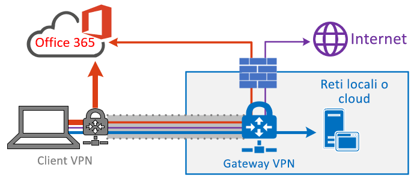

# Ottimizzare la connettività di Office 365 per gli utenti remoti tramite split tunneling VPNOptimize Office 365 connectivity for remote users using VPN split tunneling
<!---
>[!NOTE]
>This topic is part of a set of topics that address Office 365 optimization for remote users.
>- For VPN split tunnel implementation guidance, see [Implementing VPN split tunneling for Office 365](office-365-vpn-implement-split-tunnel.md).
>- For information about optimizing Office 365 worldwide tenant performance for users in China, see [Office 365 performance optimization for China users](office-365-networking-china.md).
-->

Microsoft consiglia ai lavoratori remoti che connettono i propri dispositivi all'infrastruttura cloud o alla rete aziendale tramite VPN, di instradare gli scenari principali di Office 365 **Microsoft Teams**, **SharePoint Online** ed **Exchange Online** su una configurazione di _split tunneling per VPN_.For customers who connect their remote worker devices to the corporate network or cloud infrastructure over VPN, Microsoft recommends that the key Office 365 scenarios **Microsoft Teams**, **SharePoint Online** and **Exchange Online** are routed over a _VPN split tunnel_ configuration. Questa soluzione assume particolare rilevanza come strategia da attuare per favorire la continuità produttiva dei dipendenti quando si fa uso del telelavoro su larga scala, come sta avvenendo per la crisi COVID-19.This becomes especially important as the first line strategy to facilitate continued employee productivity during large scale work-from-home events such as the COVID-19 crisis.

_Figura 1 - Soluzione split tunneling per VPN con evidenti eccezioni di Office 365 inviate direttamente al servizio. Tutto il resto del traffico attraversa il tunnel VPN indipendentemente dalla destinazione.__Figure 1: A VPN split tunnel solution with defined Office 365 exceptions sent directly to the service. All other traffic traverses the VPN tunnel regardless of destination._

L'aspetto fondamentale di questo approccio è quello di fornire alle aziende un metodo semplice per ridurre il rischio di saturazione dell'infrastruttura VPN e migliorare significativamente le prestazioni di Office 365 nel più breve tempo possibile.The essence of this approach is to provide a simple method for enterprises to mitigate the risk of VPN infrastructure saturation and dramatically improve Office 365 performance in the shortest timeframe possible. La configurazione dei client VPN per consentire all'intenso traffico di Office 365 di livello più critico di bypassare il tunnel VPN offre i seguenti vantaggi:Configuring VPN clients to allow the most critical, high volume Office 365 traffic to bypass the VPN tunnel achieves the following benefits:

- Attenua subito la causa principale della maggior parte dei problemi relativi alle prestazioni e alla capacità di rete segnalati dai clienti nelle architetture VPN aziendali che hanno impatto sull'esperienza utente di Office 365Immediately mitigates the root cause of a majority of customer-reported performance and network capacity issues in enterprise VPN architectures impacting Office 365 user experience
  
  La soluzione consigliata si rivolge in modo specifico agli endpoint del servizio Office 365 della categoria **Optimize** nell'argomento [URL e intervalli di indirizzi IP per Office 365](https://aka.ms/o365ips).The recommended solution specifically targets Office 365 service endpoints categorized as **Optimize** in the topic [Office 365 URLs and IP address ranges](https://aka.ms/o365ips). Il traffico verso questi endpoint è estremamente sensibile alla limitazione della latenza e della larghezza di banda, quindi consentire di bypassare il tunnel VPN può migliorare notevolmente l'esperienza dell'utente finale e ridurre il carico di rete aziendale.Traffic to these endpoints is highly sensitive to latency and bandwidth throttling, and enabling it to bypass the VPN tunnel can dramatically improve the end user experience as well as reduce the corporate network load. Le connessioni di Office 365, che non costituiscono la maggior parte delle larghezze di banda o dell'esperienza utente, possono continuare a essere instradate attraverso il tunnel VPN insieme al resto del traffico connesso a Internet.Office 365 connections that do not constitute the majority of bandwidth or user experience footprint can continue to be routed through the VPN tunnel along with the rest of the Internet-bound traffic. Per ulteriori informazioni, vedere [La strategia split tunneling per VPN](#the-vpn-split-tunnel-strategy).For more information, see [The VPN split tunnel strategy](#the-vpn-split-tunnel-strategy).

- Possibilità di configurazione, collaudo e implementazione rapida dai clienti e senza ulteriori requisiti di infrastruttura o applicazioniCan be configured, tested and implemented rapidly by customers and with no additional infrastructure or application requirements

  L'implementazione può richiedere alcune ore, a seconda della piattaforma VPN e dell'architettura di rete.Depending on the VPN platform and network architecture, implementation can take as little as a few hours. Per altre informazioni, vedere [Implementare lo split tunneling per VPN](office-365-vpn-implement-split-tunnel.md#implement-vpn-split-tunneling).For more information, see [Implement VPN split tunneling](office-365-vpn-implement-split-tunnel.md#implement-vpn-split-tunneling).

- Garantisce il livello di sicurezza delle implementazioni VPN dei clienti, senza modificare il modo in cui vengono instradate le altre connessioni, incluso il traffico su InternetPreserves the security posture of customer VPN implementations by not changing how other connections are routed, including traffic to the Internet

  La configurazione consigliata segue il principio dei **privilegi minimi** per le eccezioni relative al traffico VPN e consente ai clienti di implementare la funzione di split tunneling per VPN senza esporre gli utenti o l'infrastruttura a ulteriori rischi per la sicurezza.The recommended configuration follows the **least privilege** principle for VPN traffic exceptions and allows customers to implement split tunnel VPN without exposing users or infrastructure to additional security risks. Il traffico di rete instradato direttamente agli endpoint di Office 365 è crittografato e convalidato per l'integrità degli stack di applicazioni client di Office e viene limitato agli indirizzi IP dedicati ai servizi di Office 365, con protezione avanzata sia a livello di applicazione che di rete.Network traffic routed directly to Office 365 endpoints is encrypted, validated for integrity by Office client application stacks and scoped to IP addresses dedicated to Office 365 services which are hardened at both the application and network level. Per ulteriori informazioni, vedere [Modi alternativi per i professionisti della sicurezza e l'IT per ottenere moderni controlli di sicurezza nei particolari scenari odierni di lavoro remoto (blog del team di sicurezza di Microsoft)](https://www.microsoft.com/security/blog/2020/03/26/alternative-security-professionals-it-achieve-modern-security-controls-todays-unique-remote-work-scenarios/).For more information, see [Alternative ways for security professionals and IT to achieve modern security controls in today's unique remote work scenarios (Microsoft Security Team blog)](https://www.microsoft.com/security/blog/2020/03/26/alternative-security-professionals-it-achieve-modern-security-controls-todays-unique-remote-work-scenarios/).

- È supportato in modo nativo dalla maggior parte delle piattaforme VPN aziendaliIs natively supported by most enterprise VPN platforms

  Microsoft continua a collaborare con i partner del settore realizzando soluzioni VPN commerciali che consentono ai partner di sviluppare indicazioni mirate e modelli di configurazione per le soluzioni in linea con i suggerimenti sopra descritti.Microsoft continues to collaborate with industry partners producing commercial VPN solutions to help partners develop targeted guidance and configuration templates for their solutions in alignment with the above recommendations. Per altre informazioni, vedere [PROCEDURE per le piattaforme VPN più comuni](office-365-vpn-implement-split-tunnel.md#howto-guides-for-common-vpn-platforms).For more information, see [HOWTO guides for common VPN platforms](office-365-vpn-implement-split-tunnel.md#howto-guides-for-common-vpn-platforms).

>[!TIP]
>Microsoft consiglia di focalizzare la configurazione di split tunneling per VPN su intervalli IP dedicati indicati per i servizi di Office 365.Microsoft recommends focusing split tunnel VPN configuration on documented dedicated IP ranges for Office 365 services. Le configurazioni di split tunneling basate su FQDN o AppID sono possibili in determinate piattaforme client VPN, tuttavia potrebbero non coprire completamente gli scenari principali di Office 365 ed entrare in conflitto con le regole di routing VPN basate su IP.FQDN or AppID-based split tunnel configurations, while possible on certain VPN client platforms, may not fully cover key Office 365 scenarios and may conflict with IP based VPN routing rules. Per questo motivo, Microsoft consiglia di non usare FQDN di Office 365 per la configurazione di split tunneling per VPN.For this reason, Microsoft does not recommend using Office 365 FQDNs to configure split tunnel VPN. La configurazione FQDN può essere utile in altri scenari correlati, ad esempio per personalizzare file PAC o per implementare regole per bypassare il proxy.The use of FQDN configuration may be useful in other related scenarios, such as .pac file customizations or to implement proxy bypass.

Per informazioni sull'implementazione completa, vedere [Implementazione dello split tunneling per VPN per Office 365](office-365-vpn-implement-split-tunnel.md).For full implementation guidance, see [Implementing VPN split tunneling for Office 365](office-365-vpn-implement-split-tunnel.md).

## La strategia split tunneling per VPNThe VPN split tunnel strategy

Le reti aziendali tradizionali spesso sono progettate per garantire la sicurezza durante il lavoro in una situazione antecedente al cloud, in cui la maggior parte dei dati, dei servizi e delle applicazioni importanti sono ospitati in locale e sono direttamente collegati alla rete aziendale interna, come la maggior parte degli utenti.Traditional corporate networks are often designed to work securely for a pre-cloud world where most important data, services, applications are hosted on premises and are directly connected to the internal corporate network, as are the majority of users. Pertanto, l'infrastruttura di rete è costruita attorno a questi elementi in quanto le filiali sono collegate alla sede centrale tramite reti _Multiprotocol Label Switching (MPLS)_ e gli utenti remoti devono connettersi alla rete aziendale attraverso una rete VPN per accedere sia agli endpoint locali che a Internet.Thus network infrastructure is built around these elements in that branch offices are connected to the head office via _Multiprotocol Label Switching (MPLS)_ networks, and remote users must connect to the corporate network over a VPN to access both on premises endpoints and the Internet. In questo modello, tutto il traffico proveniente da utenti remoti attraversa la rete aziendale e viene instradato al servizio cloud attraverso un punto di uscita comune.In this model, all traffic from remote users traverses the corporate network and is routed to the cloud service through a common egress point.

_Figura 2 - Soluzione VPN comune per gli utenti remoti, in cui tutto il traffico è obbligato a tornare nella rete aziendale indipendentemente dalla destinazione__Figure 2: A common VPN solution for remote users where all traffic is forced back into the corporate network regardless of destination_

Da quando le organizzazioni spostano dati e applicazioni nel cloud, questo modello risulta meno efficace perché diventa rapidamente lento, costoso e non scalabile, con ripercussioni significative sulle prestazioni di rete e sull'efficienza degli utenti, riducendo così la possibilità dell'organizzazione di adattarsi a esigenze mutevoli.As organizations move data and applications to the cloud, this model has begun to become less effective as it quickly becomes cumbersome, expensive and unscalable, significantly impacting network performance and efficiency of users and restricting the ability of the organization to adapt to changing needs. Molti clienti Microsoft hanno riferito che alcuni anni fa l'80% del traffico di rete era diretto verso una destinazione interna, mentre nel 2020 oltre l'80% del traffico si collega a una risorsa basata su cloud esterno.Numerous Microsoft customers have reported that a few years ago 80% of network traffic was to an internal destination, but in 2020 80% plus of traffic connects to an external cloud based resource.

Il problema è stato aggravato dalla crisi COVID-19, che richiede soluzioni immediate per la maggior parte delle organizzazioni.The COVID-19 crisis has aggravated this problem to require immediate solutions for the vast majority of organizations. Molti clienti hanno rilevato che il modello VPN forzato non è scalabile o non è sufficiente per il 100% degli scenari di lavoro remoto, come quello sorto in seguito a questa crisi.Many customers have found that the forced VPN model is not scalable or performant enough for 100% remote work scenarios such as that which this crisis has necessitated. Le organizzazioni hanno bisogno di soluzioni rapide per continuare a operare in modo efficiente.Rapid solutions are required for these organization to continue to operate efficiently.

Per Office 365, Microsoft ha progettato requisiti di connettività per il servizio tenendo ben presente questo problema, in cui un set di endpoint di servizio in evidenza, strettamente controllati e relativamente statici può essere ottimizzato in modo molto semplice e rapido per offrire prestazioni elevate agli utenti che accedono al servizio e ridurre il carico sull'infrastruttura VPN così da renderla ancora disponibile per altro traffico.For the Office 365 service, Microsoft has designed the connectivity requirements for the service with this problem squarely in mind, where a focused, tightly controlled and relatively static set of service endpoints can be optimized very simply and quickly so as to deliver high performance for users accessing the service, and reducing the burden on the VPN infrastructure so it can be used by traffic which still requires it.

Office 365 classifica gli endpoint necessari per Office 365 in tre categorie: **Optimize**, **Allow** e **Default**.Office 365 categorizes the required endpoints for Office 365 into three categories: **Optimize**, **Allow**, and **Default**. Gli endpoint **Optimize** sono al centro di questa soluzione e presentano le seguenti caratteristiche:**Optimize** endpoints are our focus here and have the following characteristics:

- Sono endpoint gestiti di proprietà di Microsoft, ospitati sull'infrastruttura MicrosoftAre Microsoft owned and managed endpoints, hosted on Microsoft infrastructure
- Sono dedicati ai carichi di lavoro principali di Office 365, come Exchange Online, SharePoint Online, Skype for Business Online e Microsoft Teams.Are dedicated to core Office 365 workloads such as Exchange Online, SharePoint Online, Skype for Business Online, and Microsoft Teams
- Sono forniti di IPHave IPs provided
- Sono caratterizzati da indicatore ROC basso che dovrebbe mantenersi tale (attualmente 20 subnet IP)Low rate of change and are expected to remain small in number (currently 20 IP subnets)
- Sono caratterizzati da sensibilità alla latenza e/o intensitàAre high volume and/or latency sensitive
- Sono in grado di avere elementi di sicurezza richiesti forniti nel servizio piuttosto che in linea sulla reteAre able to have required security elements provided in the service rather than inline on the network
- Rappresentano circa il 70-80% del volume di traffico nel servizio Office 365Account for around 70-80% of the volume of traffic to the Office 365 service

Questo set limitato di endpoint può essere diviso dal tunnel VPN forzato e inviato in modo sicuro e diretto al servizio Office 365 tramite l'interfaccia locale dell'utente.This tightly scoped set of endpoints can be split out of the forced VPN tunnel and sent securely and directly to the Office 365 service via the user's local interface. Ciò è noto come **split tunneling**.This is known as **split tunneling**.

Elementi di sicurezza quali DLP, protezione AV, autenticazione e controllo degli accessi possono essere forniti in modo molto più efficiente rispetto a questi endpoint a diversi livelli all'interno del servizio.Security elements such as DLP, AV protection, authentication and access control can all be delivered much more efficiently against these endpoints at different layers within the service. Inoltre, distogliendo la maggior parte del volume del traffico dalla VPN, questa soluzione rende disponibile capacità VPN per il traffico aziendale critico che ancora si basa su di esso.As we also divert the bulk of the traffic volume away from the VPN solution, this frees the VPN capacity up for business critical traffic which still relies on it. Consente inoltre di evitare di passare attraverso un programma di aggiornamento, in molti casi, lungo e costoso per far fronte a questo nuovo modo di operare.It also should remove the need in many cases to go through a lengthy and costly upgrade program to deal with this new way of operating.

_Figura 3 - Soluzione split tunnel VPN con evidenti eccezioni di Office 365 inviate direttamente al servizio. Tutto il resto del traffico è obbligato a tornare nella rete aziendale indipendentemente dalla destinazione.__Figure 3: A VPN split tunnel solution with defined Office 365 exceptions sent direct to the service. All other traffic is forced back into the corporate network regardless of destination._

Da un punto di vista della sicurezza, Microsoft offre una vasta gamma di funzionalità che possono essere usate per garantire una sicurezza simile o anche superiore a quella offerta dal controllo in linea tramite stack di sicurezza locali.From a security perspective, Microsoft has an array of security features which can be used to provide similar, or even enhanced security than that delivered by inline inspection by on premises security stacks. Il post del blog del team di sicurezza di Microsoft [Modi alternativi per i professionisti della sicurezza e l'IT per ottenere moderni controlli di sicurezza nei particolari scenari odierni di lavoro remoto](https://www.microsoft.com/security/blog/2020/03/26/alternative-security-professionals-it-achieve-modern-security-controls-todays-unique-remote-work-scenarios/) contiene un chiaro riepilogo delle funzionalità disponibili oltre alle informazioni dettagliate in questo articolo.The Microsoft Security team's blog post [Alternative ways for security professionals and IT to achieve modern security controls in today's unique remote work scenarios](https://www.microsoft.com/security/blog/2020/03/26/alternative-security-professionals-it-achieve-modern-security-controls-todays-unique-remote-work-scenarios/) has a clear summary of features available and you'll find more detailed guidance within this article. È anche possibile leggere informazioni sull'implementazione della soluzione split tunneling per VPN di Microsoft nella pagina [Running on VPN: How Microsoft is keeping its remote workforce connected](https://www.microsoft.com/itshowcase/blog/running-on-vpn-how-microsoft-is-keeping-its-remote-workforce-connected/?elevate-lv) (Lavorare su VPN: la soluzione Microsoft per mantenere connessa la forza lavoro remota).You can also read about Microsoft's implementation of VPN split tunneling at [Running on VPN: How Microsoft is keeping its remote workforce connected](https://www.microsoft.com/itshowcase/blog/running-on-vpn-how-microsoft-is-keeping-its-remote-workforce-connected/?elevate-lv).

In molti casi, l'implementazione è possibile in poche ore, il che offre una rapida risoluzione a uno dei problemi più urgenti delle organizzazioni, il rapido passaggio al lavoro remoto su vasta scala.In many cases, this implementation can be achieved in a matter of hours, allowing rapid resolution to one of the most pressing problems facing organizations as they rapidly shift to full scale remote working. Per informazioni sullo split tunneling per VPN, vedere [Implementazione dello split tunneling per VPN per Office 365](office-365-vpn-implement-split-tunnel.md).For VPN split tunnel implementation guidance, see [Implementing VPN split tunneling for Office 365](office-365-vpn-implement-split-tunnel.md).

>[!NOTE]
>Microsoft si impegna a sospendere le modifiche agli endpoint **Optimize** per Office 365 fino almeno al **30 giugno 2020**, per consentire agli utenti di porre l'attenzione su altre difficoltà anziché gestire l'elenco endpoint consentiti dopo l'implementazione iniziale.Microsoft has committed to suspending changes to **Optimize** endpoints for Office 365 until at least **June 30 2020**, allowing customers to focus on other challenges rather than maintaining the endpoint whitelist once initially implemented.

## Argomenti correlatiRelated topics

[Implementazione dello split tunneling per VPN per Office 365Implementing VPN split tunneling for Office 365](office-365-vpn-implement-split-tunnel.md)

[Ottimizzazione delle prestazioni di Office 365 per utenti della CinaOffice 365 performance optimization for China users](office-365-networking-china.md)

[Modi alternativi per i professionisti della sicurezza e l'IT per ottenere moderni controlli di sicurezza nei particolari scenari odierni di lavoro remoto (blog del team di sicurezza di Microsoft)Alternative ways for security professionals and IT to achieve modern security controls in today's unique remote work scenarios (Microsoft Security Team blog)](https://www.microsoft.com/security/blog/2020/03/26/alternative-security-professionals-it-achieve-modern-security-controls-todays-unique-remote-work-scenarios/)

[Ottimizzazione delle prestazioni VPN in Microsoft: usare i profili VPN di Windows 10 per consentire connessioni automaticheEnhancing VPN performance at Microsoft: using Windows 10 VPN profiles to allow auto-on connections](https://www.microsoft.com/itshowcase/enhancing-remote-access-in-windows-10-with-an-automatic-vpn-profile)

[Esecuzione del servizio VPN: la soluzione Microsoft per mantenere connessa la forza lavoro remotaRunning on VPN: How Microsoft is keeping its remote workforce connected](https://www.microsoft.com/itshowcase/blog/running-on-vpn-how-microsoft-is-keeping-its-remote-workforce-connected/?elevate-lv)

[Principi della connettività di rete di Office 365Office 365 Network Connectivity Principles](office-365-network-connectivity-principles.md)

[Valutazione della connettività di rete di Office 365Assessing Office 365 network connectivity](assessing-network-connectivity.md)

[Test di connettività di Microsoft 365Microsoft 365 connectivity test](https://aka.ms/netonboard)
