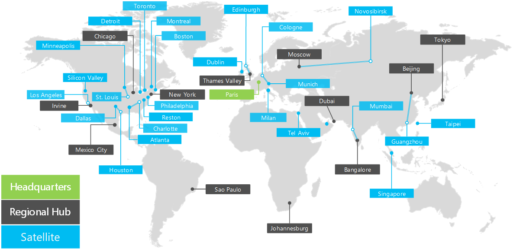

# Panoramica di Contoso Corporation

 **Riepilogo:** Informazioni sulla società Contoso Corporation e sulla struttura a livelli dei suoi uffici nel mondo.
  
Contoso Corporation è un'azienda globale con sede a Parigi, in Francia. Si tratta di un'azienda conglomerata di produzione, vendita e supporto con oltre 100.000 prodotti. 
  
## Contoso Corporation

L'organizzazione mondiale di Contoso dispone di uffici nelle seguenti posizioni:
  
**Figura 1: Uffici di Contoso in tutto il mondo**

  
Nella figura 1 viene mostrata la sede di Parigi e gli uffici secondari e gli hub regionali nei vari continenti.
  
Gli uffici di Contoso di tutto il mondo seguono una struttura a tre livelli.
  
- Sede centrale
    
    La sede di Contoso Corporation è un grande campus aziendale alla periferia di Parigi con decine di edifici per le strutture di amministrazione, ingegneria e produzione. Tutti i datacenter di Contoso e la presenza Internet sono ospitati nella sede di Parigi.
    
    La sede ha 15.000 dipendenti.
    
- Hub regionali
    
    Gli hub regionali servono una specifica area geografica del mondo con il 60% delle vendite e staff di supporto. Ogni hub regionale è connesso alla sede centrale di Parigi con un collegamento WAN con larghezza di banda elevata. 
    
    Ogni hub regionale ha una media di 2.000 dipendenti.
    
- Filiali
    
    Gli uffici secondari ospitano l'80% del personale addetto alle vendite e al supporto tecnico e forniscono una presenza sul posto e fisica per i clienti di Contoso nelle città principali o nelle aree geografiche secondarie. Ogni ufficio secondario è collegato a un hub regionale con un collegamento WAN ad elevata larghezza di banda.
    
    Ogni filiale ha una media di 250 dipendenti.
    
Il 25% dei dipendenti di Contoso è esclusivamente mobile, con una percentuale maggiore di dipendenti solo mobile negli hub regionali e negli uffici secondari. Fornire un supporto migliore ai dipendenti che operano solo da dispositivi mobili è un obiettivo aziendale importante per Contoso.
  
## Elementi dell'implementazione di Contoso di Microsoft Cloud

Gli architetti IT di Contoso hanno identificato gli elementi seguenti durante la pianificazione per l'adozione delle offerte cloud di Microsoft.
  
- Rete
    
    La rete include la connessione alle offerte cloud Microsoft e una larghezza di banda sufficiente per essere efficace nei carichi di picco. Una parte della connessione sfrutta collegamenti Internet locali e una parte si avvale dell'infrastruttura della rete privata di Contoso.
    
    Per ulteriori informazioni, vedere il poster [Rete cloud Microsoft per Enterprise Architects](microsoft-cloud-networking-for-enterprise-architects.md).
   
- Identità
    
    Contoso utilizza una foresta di Windows Server AD per i provider di identità interni e attua la federazione con provider di terze parti per clienti e partner. Contoso deve sfruttare il set di account interni per offerte cloud Microsoft. Anche l'accesso alle app basate su cloud per clienti e partner deve sfruttare i provider di identità di terze parti.
    
    Per ulteriori informazioni, vedere il poster [Identità cloud Microsoft per Enterprise Architects](microsoft-cloud-identity-for-enterprise-architects.md).
    
- Sicurezza
    
    La sicurezza per le identità basate su cloud e i dati deve includere la protezione dei dati, la gestione dei privilegi di amministrazione, la riconoscibilità delle minacce e l'implementazione dei criteri di governance e sicurezza dei dati.
    
    Per ulteriori informazioni, vedere il poster [Sicurezza cloud Microsoft per Enterprise Architects](http://aka.ms/cloudarchsecurity).
    
- Gestione
    
    La gestione per le app basate su cloud e i carichi di lavoro SaaS richiederà la capacità di mantenere impostazioni, dati, account, criteri e autorizzazioni e di monitorare le prestazioni e l'integrità in corso. Gli strumenti di gestione server esistenti verranno utilizzati per gestire macchine virtuali di Azure IaaS.
    
## Vedere anche

[Contoso nel Microsoft Cloud](contoso-in-the-microsoft-cloud.md)
  
[Risorse sull'architettura IT del cloud Microsoft](microsoft-cloud-it-architecture-resources.md)

[Guida di orientamento del cloud aziendale Microsoft: risorse per i decision maker del settore IT](https://sway.com/FJ2xsyWtkJc2taRD)
 

