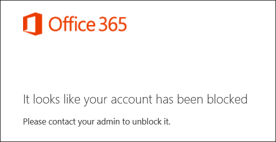

# <a name="block-user-accounts-with-office-365-powershell"></a><span data-ttu-id="4e0c4-103">Bloccare gli account utente con Office 365 PowerShell</span><span class="sxs-lookup"><span data-stu-id="4e0c4-103">Block user accounts with Office 365 PowerShell</span></span>

<span data-ttu-id="4e0c4-104">**Riepilogo:**  Questo articolo viene illustrato come utilizzare Office 365 PowerShell per bloccare e sbloccare l'accesso agli account di Office 365.</span><span class="sxs-lookup"><span data-stu-id="4e0c4-104">**Summary:**  Explains how to use Office 365 PowerShell to block and unblock access to Office 365 accounts.</span></span>
  
<span data-ttu-id="4e0c4-p101">Bloccare l'accesso a un account di Office 365 consente di evitare di utilizzare l'account per l'accesso e accedere ai servizi e dati all'interno dell'organizzazione Office 365. Quando si blocca l'accesso all'account, l'utente riceve il messaggio di errore quando si tenta di effettuare l'accesso:</span><span class="sxs-lookup"><span data-stu-id="4e0c4-p101">Blocking access to an Office 365 account prevents anyone from using the account to sign in and access the services and data in your Office 365 organization. When you block access to the account, the user receives the following error message when they attempt to sign in:</span></span>
  

  
<span data-ttu-id="4e0c4-108">È possibile utilizzare Office 365 PowerShell per bloccare l'accesso a singoli e più account utente.</span><span class="sxs-lookup"><span data-stu-id="4e0c4-108">You can use Office 365 PowerShell to block access to individual and multiple user accounts.</span></span>
  
## <a name="before-you-begin"></a><span data-ttu-id="4e0c4-109">Informazioni preliminari</span><span class="sxs-lookup"><span data-stu-id="4e0c4-109">Before you begin</span></span>

- <span data-ttu-id="4e0c4-p102">Le procedure descritte in questo argomento richiedono all'utente di connettersi a PowerShell di Office 365. Per istruzioni, vedere [Connettersi a PowerShell di Office 365](connect-to-office-365-powershell.md).</span><span class="sxs-lookup"><span data-stu-id="4e0c4-p102">The procedures in this topic require you to connect to Office 365 PowerShell. For instructions, see [Connect to Office 365 PowerShell](connect-to-office-365-powershell.md).</span></span>
    
- <span data-ttu-id="4e0c4-112">Quando si blocca un account utente, potrebbe impiegare fino a 24 ore per rendere effettive su client e dispositivi dell'utente.</span><span class="sxs-lookup"><span data-stu-id="4e0c4-112">When you block a user account, it might take as long as 24 hours to take effect on all the user's devices and clients.</span></span>
    
## <a name="use-office-365-powershell-to-block-access-to-individual-user-accounts"></a><span data-ttu-id="4e0c4-113">Utilizzare PowerShell di Office 365 per bloccare l'accesso a singoli account utente</span><span class="sxs-lookup"><span data-stu-id="4e0c4-113">Use Office 365 PowerShell to block access to individual user accounts</span></span>

<span data-ttu-id="4e0c4-114">Per bloccare l'accesso a un singolo account utente, utilizzare la sintassi seguente:</span><span class="sxs-lookup"><span data-stu-id="4e0c4-114">Use the following syntax to block access to an individual user account:</span></span>
  
```
Set-MsolUser -UserPrincipalName <UPN of user account>  -BlockCredential $true
```

<span data-ttu-id="4e0c4-115">Questo esempio consente di bloccare l'accesso all'account utente fabricec@litwareinc.com.</span><span class="sxs-lookup"><span data-stu-id="4e0c4-115">This example blocks access to the user account fabricec@litwareinc.com.</span></span>
  
```
Set-MsolUser -UserPrincipalName fabricec@litwareinc.com -BlockCredential $true
```

<span data-ttu-id="4e0c4-116">Per sbloccare l'account utente, eseguire il comando riportato di seguito:</span><span class="sxs-lookup"><span data-stu-id="4e0c4-116">To unblock the user account, run the following command:</span></span>
  
```
Set-MsolUser -UserPrincipalName <UPN of user account>  -BlockCredential $false
```

<span data-ttu-id="4e0c4-117">In qualsiasi momento, è possibile controllare lo stato bloccato di un account utente con il comando seguente:</span><span class="sxs-lookup"><span data-stu-id="4e0c4-117">At any time, you can check the blocked status of a user account with the following command:</span></span>
  
```
Get-MolUser -UserPrincipalName <UPN of user account> | Select DisplayName,BlockCredential
```

## <a name="use-office-365-powershell-to-block-access-to-multiple-user-accounts"></a><span data-ttu-id="4e0c4-118">Utilizzo di Office 365 PowerShell per bloccare l'accesso a più account utente</span><span class="sxs-lookup"><span data-stu-id="4e0c4-118">Use Office 365 PowerShell to block access to multiple user accounts</span></span>

<span data-ttu-id="4e0c4-119">Per prima cosa, creare un file di testo contenente un account su ogni riga simile alla seguente:</span><span class="sxs-lookup"><span data-stu-id="4e0c4-119">First, create a text file that contains one account on each line like this:</span></span>
    
  ```
akol@contoso.com
tjohnston@contoso.com
kakers@contoso.com
  ```
<span data-ttu-id="4e0c4-p103">Nei comandi seguenti, il file di testo di esempio è C:\My Documents\Accounts.txt. Sostituire con il percorso e il nome del file di testo.</span><span class="sxs-lookup"><span data-stu-id="4e0c4-p103">In the following commands, the example text file is C:\My Documents\Accounts.txt. Replace this with the path and file name of your text file.</span></span>
    
<span data-ttu-id="4e0c4-122">Per bloccare l'accesso agli account elencati nel file di testo, eseguire il comando seguente:</span><span class="sxs-lookup"><span data-stu-id="4e0c4-122">To block access to the accounts listed in the text file, run the following command:</span></span>
    
  ```
  Get-Content "C:\My Documents\Accounts.txt" | Set-MsolUser -UserPrincipalName $_.UserPrincipalName -BlockCredential $true
  ```
<span data-ttu-id="4e0c4-123">Per sbloccare gli account elencati nel file di testo, eseguire il comando seguente:</span><span class="sxs-lookup"><span data-stu-id="4e0c4-123">To unblock the accounts listed in the text file, run the following command:</span></span>
    
  ```
  Get-Content "C:\My Documents\Accounts.txt" | Set-MsolUser -UserPrincipalName $_.UserPrincipalName -BlockCredential $false
  ```

## <a name="use-the-azure-active-directory-v2-powershell-module-to-block-access-to-user-accounts"></a><span data-ttu-id="4e0c4-124">Utilizzare il modulo Azure Active Directory V2 PowerShell per bloccare l'accesso agli account utente</span><span class="sxs-lookup"><span data-stu-id="4e0c4-124">Use the Azure Active Directory V2 PowerShell module to block access to user accounts</span></span>

<span data-ttu-id="4e0c4-p104">Per utilizzare il cmdlet **New-AzureADUser** dal modulo Azure Active Directory V2 PowerShell, è necessario innanzitutto connettersi alla propria sottoscrizione. Per visualizzare le istruzioni, consultare[Connettersi con il modulo Azure Active Directory V2 PowerShell](https://go.microsoft.com/fwlink/?linkid=842218).</span><span class="sxs-lookup"><span data-stu-id="4e0c4-p104">To use the **New-AzureADUser** cmdlet from the Azure Active Directory V2 PowerShell module, you must first connect to your subscription. For the instructions, see[Connect with the Azure Active Directory V2 PowerShell module](https://go.microsoft.com/fwlink/?linkid=842218).</span></span>
  
<span data-ttu-id="4e0c4-127">Una volta stabilita la connessione, utilizzare la sintassi seguente per bloccare un singolo account utente:</span><span class="sxs-lookup"><span data-stu-id="4e0c4-127">After you have connected, use the following syntax to block an individual user account:</span></span>
  
```
Set-AzureADUser -ObjectID <UPN of user account> -AccountEnabled $false
```

> [!NOTE]
> <span data-ttu-id="4e0c4-128">Il parametro -ObjectID nel cmdlet Set-AzureAD accetta sia il nome account (anche detto "nome dell'entità utente) sia l'ID oggetto dell'account.</span><span class="sxs-lookup"><span data-stu-id="4e0c4-128">The -ObjectID parameter in the Set-AzureAD cmdlet accepts either the account name, also known as the User Principal Name, or the account's object ID.</span></span> 
  
<span data-ttu-id="4e0c4-129">Questo esempio consente di bloccare l'accesso all'account utente fabricec@litwareinc.com.</span><span class="sxs-lookup"><span data-stu-id="4e0c4-129">This example blocks access to the user account fabricec@litwareinc.com.</span></span>
  
```
Set-AzureADUser -ObjectID fabricec@litwareinc.com -AccountEnabled $false
```

<span data-ttu-id="4e0c4-130">Per sbloccare questo account utente, eseguire il comando riportato di seguito:</span><span class="sxs-lookup"><span data-stu-id="4e0c4-130">To unblock this user account, run the following command:</span></span>
  
```
Set-AzureADUser -ObjectID fabricec@litwareinc.com -AccountEnabled $true
```

<span data-ttu-id="4e0c4-131">Per visualizzare l'account utente che UPN in base al nome visualizzato dell'utente, utilizzare i comandi seguenti:</span><span class="sxs-lookup"><span data-stu-id="4e0c4-131">To display the user account UPN based on the user's display name, use the following commands:</span></span>
  
```
$userName="<user account display name>"
Write-Host (Get-AzureADUser | where {$_.DisplayName -eq $userName}).UserPrincipalName

```

<span data-ttu-id="4e0c4-132">In questo esempio viene visualizzato l'account utente UPN per l'utente denominato di Caleb Sills.</span><span class="sxs-lookup"><span data-stu-id="4e0c4-132">This example displays the user account UPN for the user named Caleb Sills.</span></span>
  
```
$userName="Caleb Sills"
Write-Host (Get-AzureADUser | where {$_.DisplayName -eq $userName}).UserPrincipalName
```

<span data-ttu-id="4e0c4-133">Per bloccare un account in base al nome dell'utente, utilizzare i comandi seguenti:</span><span class="sxs-lookup"><span data-stu-id="4e0c4-133">To block an account based on the user's name, use the following commands:</span></span>
  
```
$userName="<user account display name>"
Set-AzureADUser -ObjectID (Get-AzureADUser | where {$_.DisplayName -eq $userName}).UserPrincipalName -AccountEnabled $false

```

<span data-ttu-id="4e0c4-134">In qualsiasi momento, è possibile controllare lo stato bloccato di un account utente con il comando seguente:</span><span class="sxs-lookup"><span data-stu-id="4e0c4-134">At any time, you can check the blocked status of a user account with the following command:</span></span>
  
```
Get-AzureADUser -UserPrincipalName <UPN of user account> | Select DisplayName,AccountEnabled
```

<span data-ttu-id="4e0c4-135">Per bloccare l'accesso a più account utente, creare un file di testo che contiene un nome di account in ogni riga simile alla seguente:</span><span class="sxs-lookup"><span data-stu-id="4e0c4-135">To block access to multiple user accounts, create a text file that contains one account name on each line like this:</span></span>
    
  ```
akol@contoso.com
tjohnston@contoso.com
kakers@contoso.com
  ```

<span data-ttu-id="4e0c4-p105">Nei comandi seguenti, il file di testo di esempio è C:\My Documents\Accounts.txt. Sostituire con il percorso e il nome del file di testo.</span><span class="sxs-lookup"><span data-stu-id="4e0c4-p105">In the following commands, the example text file is C:\My Documents\Accounts.txt. Replace this with the path and file name of your text file.</span></span>
    
<span data-ttu-id="4e0c4-138">Per bloccare l'accesso agli account elencati nel file di testo, eseguire il comando seguente:</span><span class="sxs-lookup"><span data-stu-id="4e0c4-138">To block access to the accounts listed in the text file, run the following command:</span></span>
    
```
Get-Content "C:\My Documents\Accounts.txt" | Set-AzureADUSer -ObjectID $_.ObjectID -AccountEnabled $true
```

<span data-ttu-id="4e0c4-139">Per sbloccare gli account elencati nel file di testo, eseguire il comando seguente:</span><span class="sxs-lookup"><span data-stu-id="4e0c4-139">To unblock the accounts listed in the text file, run the following command:</span></span>
    
```
Get-Content "C:\My Documents\Accounts.txt" | Set-AzureADUSer -ObjectID $_.ObjectID -AccountEnabled $false
```

## <a name="see-also"></a><span data-ttu-id="4e0c4-140">Vedere anche</span><span class="sxs-lookup"><span data-stu-id="4e0c4-140">See also</span></span>
<span data-ttu-id="4e0c4-141"><a name="SeeAlso"> </a></span><span class="sxs-lookup"><span data-stu-id="4e0c4-141"></span></span>

<span data-ttu-id="4e0c4-142">Vedere i seguenti argomenti aggiuntivi sulla gestione degli utenti con Office 365 PowerShell:</span><span class="sxs-lookup"><span data-stu-id="4e0c4-142">See the following additional topics about managing users with Office 365 PowerShell:</span></span>
  
- [<span data-ttu-id="4e0c4-143">Creare account utente con Office 365 PowerShell</span><span class="sxs-lookup"><span data-stu-id="4e0c4-143">Create user accounts with Office 365 PowerShell</span></span>](create-user-accounts-with-office-365-powershell.md)
    
- [<span data-ttu-id="4e0c4-144">Eliminare e ripristinare account utente con Office 365 PowerShell</span><span class="sxs-lookup"><span data-stu-id="4e0c4-144">Delete and restore user accounts with Office 365 PowerShell</span></span>](delete-and-restore-user-accounts-with-office-365-powershell.md)
    
- [<span data-ttu-id="4e0c4-145">Assegnare le licenze agli account utente con Office 365 PowerShell</span><span class="sxs-lookup"><span data-stu-id="4e0c4-145">Assign licenses to user accounts with Office 365 PowerShell</span></span>](assign-licenses-to-user-accounts-with-office-365-powershell.md)
    
- [<span data-ttu-id="4e0c4-146">Rimuovere le licenze dagli account utente con Office 365 PowerShell</span><span class="sxs-lookup"><span data-stu-id="4e0c4-146">Remove licenses from user accounts with Office 365 PowerShell</span></span>](remove-licenses-from-user-accounts-with-office-365-powershell.md)
    
<span data-ttu-id="4e0c4-147">Per ulteriori informazioni sui cmdlet utilizzati in questa procedura, vedere i seguenti argomenti:</span><span class="sxs-lookup"><span data-stu-id="4e0c4-147">For more information about the cmdlets that are used in these procedures, see the following topics:</span></span>
  
- [<span data-ttu-id="4e0c4-148">Get-Content</span><span class="sxs-lookup"><span data-stu-id="4e0c4-148">Get-Content</span></span>](https://go.microsoft.com/fwlink/p/?LinkId=113310)
    
- [<span data-ttu-id="4e0c4-149">Set-MsolUser</span><span class="sxs-lookup"><span data-stu-id="4e0c4-149">Set-MsolUser</span></span>](https://go.microsoft.com/fwlink/p/?LinkId=691644)
    
- [<span data-ttu-id="4e0c4-150">Nuovo AzureADUser</span><span class="sxs-lookup"><span data-stu-id="4e0c4-150">New-AzureADUser</span></span>](https://docs.microsoft.com/powershell/module/azuread/new-azureaduser?view=azureadps-2.0)
    

