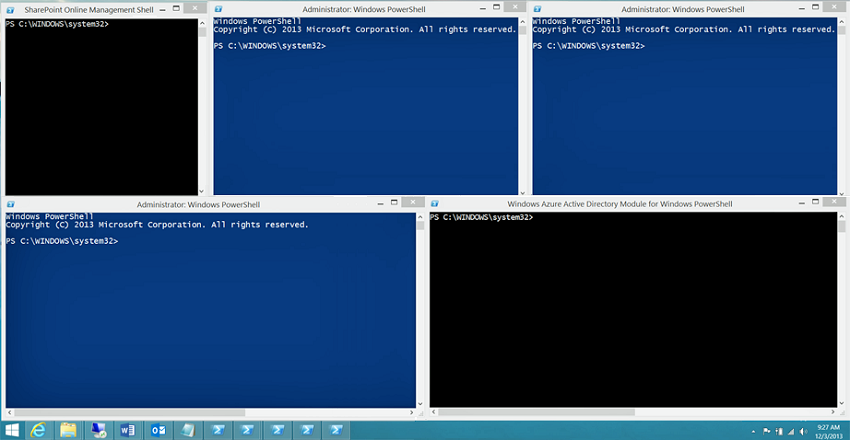
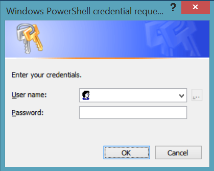
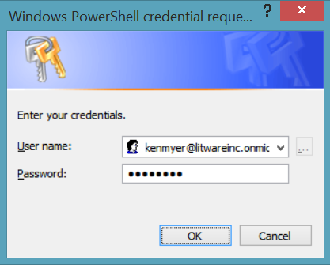
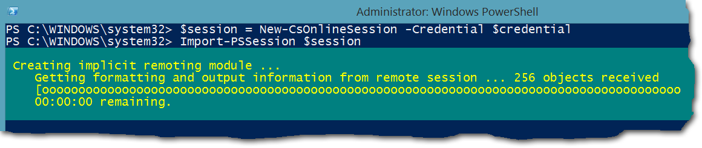
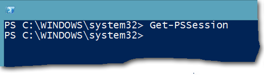

# <a name="connect-to-all-office-365-services-in-a-single-windows-powershell-window"></a>Effettuare la connessione a tutti i servizi Office 365 in un'unica finestra di Windows PowerShell

 **Riepilogo:** Invece di gestire diversi servizi di Office 365 nelle finestre di console PowerShell separate, è possibile connettersi a tutti i servizi di Office 365 e gestirli da unica finestra della console.
  
Quando si utilizza PowerShell per gestire Office 365, è possibile avere fino a cinque sessioni diverse di Windows PowerShell aprire contemporaneamente corrispondente all'interfaccia di amministrazione di Office 365, SharePoint Online, Exchange Online, Skype Business online e la protezione &amp;Centro conformità. Con i metodi di connessione differenti cinque sessioni di Windows PowerShell distinti, il desktop è simile al seguente:
  

  
Questo non è ottimale per la gestione di Office 365 perché non è possibile scambiare dati tra i cinque windows per la gestione dei servizi tra. In questo argomento viene descritto come utilizzare una singola istanza di Windows PowerShell da cui è possibile gestire Office 365, Skype Online Business, Exchange Online, SharePoint Online e la sicurezza &amp; centro conformità.
  
## <a name="before-you-begin"></a>Prima di iniziare
<a name="BeforeYouBegin"> </a>

Per poter gestire tutti di Office 365 da una singola istanza di Windows PowerShell, prendere in considerazione i prerequisiti seguenti:
  
- Office 365 di lavoro o scuola che l'account utilizzato per queste procedure esigenze per essere un membro di un ruolo di amministrazione di Office 365. Per ulteriori informazioni, vedere [ruoli di amministratore su Office 365](https://go.microsoft.com/fwlink/p/?LinkId=532367). Questo requisito per Office 365 PowerShell, non necessariamente per tutti gli altri servizi di Office 365.
    
- È possibile utilizzare le seguenti versioni a 64 bit di Windows:
    
  - Windows 10
    
  - Windows 8.1 o Windows 8
    
  - Windows Server 2016
    
  - Windows Server 2012 R2 o Windows Server 2012
    
  - Windows 7 Service Pack 1 (SP1)*
    
  - Windows Server 2008 R2 SP1*
    
    * È necessario installare Microsoft .NET Framework 4.5. _x_ e quindi su Windows Management Framework 3.0 o Windows Management Framework 4.0. Per ulteriori informazioni, vedere [installazione di .NET Framework](https://go.microsoft.com/fwlink/p/?LinkId=257868) e [Windows Management Framework 3.0](https://go.microsoft.com/fwlink/p/?LinkId=272757) o [Windows Management Framework 4.0](https://go.microsoft.com/fwlink/p/?LinkId=391344).
    
    È necessario utilizzare una versione a 64 bit di Windows per i requisiti per il Skype per la funzionalità di Business in linea e uno dei moduli di Office 365.
    
- È necessario installare i moduli necessari per Office 365, SharePoint Online e Skype Business online:
    
  - [Microsoft Online Services Assistente per l'accesso per i professionisti IT RTW](https://go.microsoft.com/fwlink/p/?LinkId=286152)
    
  - [Windows Azure Active Directory Module per Windows PowerShell (versione a 64 bit)](https://go.microsoft.com/fwlink/p/?linkid=236297)
    
  - [SharePoint Online Management Shell](https://go.microsoft.com/fwlink/p/?LinkId=255251)
    
  - [Skype per le aziende in linea, modulo di Windows PowerShell](https://go.microsoft.com/fwlink/p/?LinkId=532439)
    
-  Windows PowerShell deve essere configurato per l'esecuzione di script con firma per Skype per Business Online, Exchange Online e la sicurezza &amp; centro conformità. A tale scopo, eseguire il comando seguente in una sessione di Windows PowerShell con privilegi elevata (una finestra di Windows PowerShell per aprire è selezionare **Esegui come amministratore**).
    
  ```
  Set-ExecutionPolicy RemoteSigned
  ```

## <a name="the-short-version-instructions-without-explanations"></a>Versione breve (istruzioni senza spiegazioni)
<a name="ShortVersion"> </a>

In questa sezione vengono illustrate le procedure di connessione senza spiegazioni dettagliate. Se si hanno altre domande o si desiderano ulteriori informazioni, è possibile leggere il resto dell'argomento. I numeri dei passaggi corrispondono ai numeri dei passaggi delle sezioni del resto dell'argomento:
  
1. Aprire Windows PowerShell come amministratore (utilizzare **Esegui come amministratore**).
    
2. Eseguire questo comando e immettere il lavoro di Office 365 o scuola le credenziali dell'account.
    
  ```
  $credential = Get-Credential
  ```

3. Eseguire i comandi seguenti per connettersi a Office 365.
    
  ```
  Import-Module MsOnline
  Connect-MsolService -Credential $credential
  ```

4. Eseguire questi comandi per la connessione a SharePoint Online. Sostituire _ \<domainhost >_ con il valore effettivo per il dominio. Ad esempio, per `litwareinc.onmicrosoft.com`, il _ \<domainhost >_ valore è `litwareinc`.
    
  ```
  Import-Module Microsoft.Online.SharePoint.PowerShell -DisableNameChecking
  Connect-SPOService -Url https://<domainhost>-admin.sharepoint.com -credential $credential
  ```

5. Eseguire questi comandi a cui connettersi Skype Business online. Un avviso che indica l'aumento di `WSMan NetworkDelayms` valore previsto per la prima volta la connessione e deve essere ignorato.
    
  ```
  Import-Module SkypeOnlineConnector
  $sfboSession = New-CsOnlineSession -Credential $credential
  Import-PSSession $sfboSession
  ```

6. Eseguire questi comandi per la connessione a Exchange Online.
    
  ```
  $exchangeSession = New-PSSession -ConfigurationName Microsoft.Exchange -ConnectionUri "https://outlook.office365.com/powershell-liveid/" -Credential $credential -Authentication "Basic" -AllowRedirection
  Import-PSSession $exchangeSession -DisableNameChecking
  ```

7. Eseguire questi comandi per la connessione per la protezione &amp; centro conformità.
    
  ```
  $ccSession = New-PSSession -ConfigurationName Microsoft.Exchange -ConnectionUri https://ps.compliance.protection.outlook.com/powershell-liveid/ -Credential $credential -Authentication Basic -AllowRedirection
  Import-PSSession $ccSession -Prefix cc
  ```
> [!NOTE]
> Il prefisso di testo "cc" viene aggiunto a *tutti i* sicurezza &amp; sono presenti più nomi di cmdlet centro conformità in modo che è possibile eseguire i cmdlet in Exchange Online e la sicurezza &amp; centro conformità nella stessa sessione di Windows PowerShell. Ad esempio, **Get-RoleGroup** diventa **Get-ccRoleGroup** nella protezione &amp; centro conformità.
  
Di seguito sono tutti i comandi in un unico blocco. Specificare il nome dell'host del dominio e quindi eseguire tutte contemporaneamente.
  
```
$domainHost="<domain host name, such as litware for litwareinc.onmicrosoft.com>"
$credential = Get-Credential
Import-Module MsOnline
Connect-MsolService -Credential $credential
Import-Module Microsoft.Online.SharePoint.PowerShell -DisableNameChecking
Connect-SPOService -Url https://$domainHost-admin.sharepoint.com -credential $credential
Import-Module SkypeOnlineConnector
$sfboSession = New-CsOnlineSession -Credential $credential
Import-PSSession $sfboSession
$exchangeSession = New-PSSession -ConfigurationName Microsoft.Exchange -ConnectionUri "https://outlook.office365.com/powershell-liveid/" -Credential $credential -Authentication "Basic" -AllowRedirection
Import-PSSession $exchangeSession -DisableNameChecking
$ccSession = New-PSSession -ConfigurationName Microsoft.Exchange -ConnectionUri https://ps.compliance.protection.outlook.com/powershell-liveid/ -Credential $credential -Authentication Basic -AllowRedirection
Import-PSSession $ccSession -Prefix cc
```

Quando è pronti per chiudere la finestra di Windows PowerShell, eseguire questo comando per rimuovere le sessioni attive per Skype per Business Online, Exchange Online, SharePoint Online e la sicurezza &amp; centro conformità:
  
```
Remove-PSSession $sfboSession ; Remove-PSSession $exchangeSession ; Remove-PSSession $ccSession ; Disconnect-SPOService
```

## <a name="the-long-version-instructions-with-detailed-explanations"></a>Versione estesa (istruzioni con spiegazioni dettagliate)
<a name="LongVersion"> </a>

### <a name="step-1-open-windows-powershell-as-an-administrator"></a>Passaggio 1: Aprire Windows PowerShell come amministratore
<a name="Step1"> </a>

Se si esegue Windows 10, Windows 8, Windows 8.1, 2016 Server Windows, Windows Server 2012 R2 o Windows Server 2012 R2, eseguire questa operazione:
  
1. Per trovare il collegamento per **Windows PowerShell**, utilizzare uno dei seguenti metodi:
    
  - Nella schermata Start fare clic su un'area vuota e digitare Windows PowerShell.
    
  - Nella schermata Start o il desktop, premere Windows chiave + Q. L'accesso alla ricerca, digitare Windows PowerShell.
    
  - Nella schermata Start o il desktop, spostare il cursore all'angolo superiore destro o scorrere rapidamente dal bordo destro dello schermo per visualizzare gli accessi da sinistra. Selezionare l'accesso alla ricerca, quindi immettere Windows PowerShell.
    
2. Nei risultati della destro **Windows PowerShell**e scegliere **Esegui come amministratore**.
    
3. Se viene visualizzata la finestra di dialogo **Controllo Account utente** , selezionare **Sì** per confermare che si desidera eseguire Windows PowerShell con credenziali di amministratore.
    
Se si esegue Windows 7 SP1 (o Windows Server 2008 R2 SP1), eseguire questa operazione:
  
1. Nel menu **Start** , scegliere **Tutti i programmi** > **Accessori** > **Windows PowerShell**. Pulsante destro del mouse **Windows PowerShell**e quindi selezionare **Esegui come amministratore**.
    
2. Se viene visualizzata la finestra di dialogo **Controllo Account utente** , selezionare **Sì** per confermare che si desidera eseguire Windows PowerShell con credenziali di amministratore.
    
È necessario eseguire Windows PowerShell come amministratore. In caso contrario, verrà visualizzato un messaggio di errore simile al seguente quando si tenta di importare uno dei moduli necessari.
  
```
The specified module 'Microsoft.Online.SharePoint.Online.PowerShell' was not loaded because no valid module file was found in any directory.
```

L'unico modo per risolvere il problema si chiuderà Windows PowerShell e riavviare come amministratore. Ecco un modo semplice e veloce per indicare se si esegue Windows PowerShell come amministratore: prompt dei comandi è `PS C:\Windows\System32>`, non `PS C:\Users\YourUserName>`.

  
### <a name="step-2-create-a-windows-powershell-credentials-object"></a>Passaggio 2: creazione di un oggetto credenziali di Windows PowerShell
<a name="Step2"> </a>

L'oggetto credenziali consente di passare il nome utente e password di Windows PowerShell in modo crittografato. Per creare un oggetto credenziali, eseguire il seguente comando di Windows PowerShell.
  
```
$credential = Get-Credential
```

> [!NOTE]
>  `$credential`è una variabile di cui verrà archiviato l'oggetto credenziali. Non è necessario assegnare un nome di variabile `$credential`, ma in questo modo risulta più facile da ricordare la variabile contiene l'oggetto credenziali. (E che è importante, perché questa variabile verrà riutilizzato più volte). Che verrà inoltre rendono più semplice per poter eseguire quali ad esempio perché venga utilizzato sempre in questo articolo `$credential` per rappresentare l'oggetto credenziali.
  
Windows PowerShell verrà quindi visualizzare una finestra di dialogo simile al seguente.
  

  
Digitare il proprio lavoro o scuola nome utente dell'account nella casella **nome utente** , utilizzando il formato _username@domainname_ (ad esempio, kenmyer@litwareinc.onmicrosoft.com); Digitare la password nella casella **Password** . e quindi fare clic su **OK**:
  

  
Si noti che, quando si verifica in genere, si potrà essere visualizzato alcun tipo di conferma che sia stato creato l'oggetto credenziali. (Windows PowerShell in genere viene illustrato quando operazioni vanno male, ma non sempre a spiegare quando le cose vanno destra.) Se si desidera verificare che sia stato creato l'oggetto credenziali, digitare quanto segue in Windows PowerShell e quindi premere INVIO.
  
```
$credential
```

Quindi, sullo schermo verranno visualizzati elementi analoghi a quelli riportati di seguito.
  
```
UserName                               Password
--------                               --------
kenmyer@litwareinc.onmicrosoft.com     System.Security.SecureString
```

È necessario tenere presenti in questo caso è che il cmdlet [Get-Credential](https://go.microsoft.com/fwlink/p/?LinkId=389618) crea solo l'oggetto credenziali. non autenticare l'utente o in caso contrario verificare che il nome utente e la password che è fornito siano corrette. Si supponga, ad esempio, che è stato digitato correttamente il nome utente come kenmyer@litwareinc.onmicrosoft.com. In caso contrario, **Get-Credential** creerà un oggetto credenziali utilizzando tale nome utente e senza controllo per verificare che sia effettivamente un nome utente valido. Non si conosce se è stato creato un oggetto credenziali valide effettivamente finché non si utilizza effettivamente tale oggetto tenti di connettersi ai servizi di Office 365.
  
### <a name="step-3-connect-to-office-365"></a>Passaggio 3: Connettersi a Office 365
<a name="Step3"> </a>

Si verrà inizia tramite la connessione a Office 365 stesso. 
  
Come prima cosa che è necessario eseguire qui è importare il modulo di Office 365 (il Microsoft Azure Active Directory Module per Windows PowerShell). A tale scopo, eseguire questo comando di Windows PowerShell.
  
```
Import-Module MsOnline
```

Per verificare l'importazione del modulo, eseguire questo comando.
  
```
Get-Module
```

In un punto qualsiasi nell'elenco di moduli restituito da questo comando verrà visualizzato qualcosa di simile al seguente: `Manifest 1.0 MSOnline {Add-MsolForeignGroupToRole, Add-MsolG...}`.
  
Se viene visualizzato `MSOnline` nell'elenco, ciò significa che tutti gli elementi che indica la presenza in base alla pianificazione.
  
Con l'oggetto credenziali creato (vedere [passaggio 2: creare un oggetto credenziali di Windows PowerShell](connect-to-all-office-365-services-in-a-single-windows-powershell-window.md#Step2)) e con il `MsOnline` modulo caricati, è possibile ora connettersi a Office 365 utilizzando il cmdlet [Connect-MsolService](https://go.microsoft.com/fwlink/p/?LinkId=532375) e il comando seguente.
  
```
Connect-MsolService -Credential $credential
```

Si noti che tutto è necessario fornire sono l'oggetto credenziali ( `$credential`). In base, le credenziali di Office 365 si connetterà automaticamente si al dominio corretto. Non è necessario specificare il nome di dominio quando si esegue **Connect-MsolService**.
  
Per verificare che si really *sono* connessi a Office 365, eseguire il comando seguente.
  
```
Get-MsolDomain
```

Verrà restituito un elemento analogo al seguente:
  
```
Name                         Status          Authentication
----                         ------          --------------
litwareinc.onmicrosoft.com   Verified        Managed
```

### <a name="step-4-connect-to-sharepoint-online"></a>Passaggio 4: connessione a SharePoint Online
<a name="Step4"> </a>

Importare la funzionalità di SharePoint Online con il comando seguente:
  
```
Import-Module Microsoft.Online.SharePoint.PowerShell -DisableNameChecking
```

L'opzione _DisableNameChecking_ consente di ignorare questo avviso.
  
```
WARNING: The names of some imported commands from the module 'Microsoft.Online.SharePoint.PowerShell' include unapproved verbs that might make them less discoverable. To find the commands with unapproved verbs, run the Import-Module command again with the Verbose parameter. For a list of approved verbs, type Get-Verb.
```

Per connettersi a SharePoint Online, è necessario specificare due tipi di informazioni: le credenziali e l'URL del sito di amministrazione di SharePoint Online. La parte di credenziali è semplice: è già stata archiviata che nella variabile `$credential` (vedere [passaggio 2: creare un oggetto credenziali di Windows PowerShell](connect-to-all-office-365-services-in-a-single-windows-powershell-window.md#Step2)). Per quanto riguarda l'URL del sito di amministrazione, è difficile determinare anche. Si supponga che il nome di dominio di Office 365 è `litwareinc.onmicrosoft.com`.
  
Per determinare l'URL del sito di amministrazione, effettuare la seguente operazione:
  
1. Innanzitutto, utilizzare il prefisso `https://`.
    
2. Aggiungere la parte host di dominio del nome del dominio. Ad esempio, per `litwareinc.onmicrosoft.com`, il nome di dominio host è `litwareinc`. Per `contoso.onmicrosoft.com`, il nome di dominio host è `contoso`.
    
3. Aggiungere un segno meno (-) seguito da `admin.sharepoint.com`.
    
In altre parole:
  
 `https://` + `litwareinc` + `-admin.sharepoint.com` = `https://litwareinc-admin.sharepoint.com`
  
Dopo aver creato l'URL, è possibile utilizzare quindi questo URL e l'oggetto credenziali per connettersi a SharePoint Online. Chiamare il cmdlet [Connect-SPOService](https://go.microsoft.com/fwlink/p/?LinkId=532436) con un comando simile al seguente.
  
```
Connect-SPOService -Url https://litwareinc-admin.sharepoint.com -credential $credential
```

Per verificare che sia stata effettuata la connessione, eseguire il seguente comando di Windows PowerShell.
  
```
Get-SPOSite
```

È consigliabile ottenere un elenco di tutti i siti di SharePoint Online. Di seguito è riportato un esempio:
  
```
Url                                       Owner          Storage Quota
---                                       -----          -------------
http://litwareinc-public.sharepoint.com/                 1000
https://litwareinc.sharepoint.com/                       1000
https://litwareinc.sharepoint.com/search                 1000
```

I comandi di Office 365 (quelle descritte in [passaggio 3: connettersi a Office 365](connect-to-all-office-365-services-in-a-single-windows-powershell-window.md#Step3)) verrà funzionino come previsto. (Provare a eseguire **Get-MsolUser**e di valutare personalmente) Ciò significa che è possibile gestire Office 365 e SharePoint Online dalla stessa istanza di Windows PowerShell.
  
### <a name="step-5-connect-to-skype-for-business-online"></a>Passaggio 5: Connessione a Skype for Business online
<a name="Step5"> </a>

Connessione a Skype Business online (e per Exchange Online o la sicurezza &amp; centro conformità) è diverso rispetto alla connessione a Office 365 o SharePoint Online. Ciò avviene perché Skype per cmdlet Business Online ed Exchange Online non ottenere installato nel computer in uso come avviene per Office 365 e i cmdlet di SharePoint Online. In realtà, ogni volta che si effettua l'accesso, i cmdlet appropriati temporaneamente vengono copiati nel computer. Quando si accede, questi cmdlet vengono rimossi dal computer dell'utente.
  
Per connettersi al Skype Business online, è necessario importarlo Skype di funzionalità di Business in linea. A tale scopo, eseguire questo comando.
  
```
Import-Module SkypeOnlineConnector
```

La prima volta, potrebbe essere visualizzato il seguente messaggio di avviso, che può essere ignorato senza problemi.
  
```
WARNING: WSMan NetworkDelayms has been set to 30000 milliseconds. The previous value was 5000 milliseconds.
WARNING: To improve the performance of the Lync Online Connector, it is recommended that the network delay be set to
30000 milliseconds (30 seconds). However, you can use Set-WinRMNetworkDelayMS to change the network delay to any
integer value.
```

Una volta importato il modulo, eseguire il comando riportato di seguito.
  
```
$sfboSession = New-CsOnlineSession -Credential $credential
```

È stata creata una sessione remote PowerShell. In questo caso, ciò significa che è stata connessa a un'istanza di Windows PowerShell in esecuzione su uno dei server di Office 365. 
  
Anche se è stata effettuata una connessione a Office 365, è non scaricare gli script, i cmdlet e altri elementi necessari per gestire Skype Business online. A tale scopo, è necessario eseguire questo comando.
  
```
Import-PSSession $sfboSession
```

Quando si importa la sessione Windows PowerShell, è necessario visualizzare una barra di stato simile al seguente, un indicatore che segnala in tutti i Skype per cmdlet Business Online da importare nel computer.
  

  
Quando la barra di avanzamento scompare, verrà visualizzato un risultato analogo al seguente.
  
```
ModuleType Version    Name               ExportedCommands
---------- -------    ----               ----------------
Script     1.0        tmp_swc5mp4v.1ck  {Copy-CsVoicePolicy, Disabl...
```

### <a name="step-6-connect-to-exchange-online"></a>Passaggio 6: Connessione a Exchange Online
<a name="Step6"> </a>

Eseguire questo comando, che consente di creare una sessione remota di Windows PowerShell con Exchange Online.
  
```
$exchangeSession = New-PSSession -ConfigurationName Microsoft.Exchange -ConnectionUri "https://outlook.office365.com/powershell-liveid/" -Credential $credential -Authentication "Basic" -AllowRedirection
```

> [!NOTE]
> È il comando per la connessione a Exchange Online più complicati di comando per connettersi a Skype Business online? Tecnicamente, non è: entrambi i comandi eseguono nello stesso modo. Tuttavia Skype per team Business Online creato il proprio cmdlet: **New-CsOnlineSession** , ovvero che nasconde alcuni dei parametri (ad esempio, _l'autenticazione_ e _AllowRedirection_) che vengono utilizzati durante la connessione a Exchange Online. Invece di utilizzarlo sarà necessario digitare direttamente tali informazioni, i parametri di _autenticazione_ e _AllowRedirection_ sono in modo efficace incorporati per il cmdlet **New-CsOnlineSession** . È necessario digitare questi parametri durante la connessione a Exchange Online poiché in Exchange Online, viene utilizzato il cmdlet [New-PSSession](https://go.microsoft.com/fwlink/p/?LinkId=389621) standard per la connessione a Office 365. Lo svantaggio è la presenza di più digitando a tale. Il vantaggio è che non è necessario scaricare e installare un modulo di Exchange Online.
  
È necessario effettuare è fare importare questa sessione remota, così come sono state eseguite con Skype Business online.
  
```
Import-PSSession $exchangeSession -DisableNameChecking
```

Sullo schermo verranno visualizzati elementi analoghi a quelli riportati di seguito.
  
```
ModuleType Version  Name             ExportedCommands
---------- -------  ----             ----------------
Script     1.0      tmp_nweiqjvl.geu {Add-AvailabilityAddressSpace...
```

Provare ora a eseguire questo comando.
  
```
Get-AcceptedDomain
```

In cambio, visualizzate informazioni sui domini di Office 365 che sono configurati per l'indirizzo di posta elettronica di Exchange Online.
  
```
Name            DomainName          DomainType      Default
----            ----------          ----------      -------
litwareinc.com  litwareinc.com      Authoritative   True
```

### <a name="step-7-connect-to-the-security-amp-compliance-center"></a>Passaggio 7: Connessione per la protezione &amp; centro conformità
<a name="Step7"> </a>

La sicurezza &amp; centro conformità è un servizio disponibile in Office 365 che consente all'utente per gestire le funzionalità di conformità da una posizione. Per ulteriori informazioni, vedere [centro conformità di Office 365](http://technet.microsoft.com/library/fde83656-f136-448d-b250-6fa17b503e4e.aspx).
  
Le istruzioni di connessione per la sicurezza &amp; centro conformità sono molto simili a quelle per Exchange Online, ma con una rotazione sono state aggiunte, verrà visualizzato in un momento.
  
Eseguire questo comando, che consente di creare una sessione remote PowerShell con la protezione &amp; centro conformità.
  
```
$ccSession = New-PSSession -ConfigurationName Microsoft.Exchange -ConnectionUri https://ps.compliance.protection.outlook.com/powershell-liveid/ -Credential $credential -Authentication Basic -AllowRedirection
```

A questo punto, eseguire il comando seguente.
  
```
Import-PSSession $ccSession -Prefix cc
```

Nuovamente, questo comando è molto simile al comando per Exchange Online. L'opzione _DisableNameChecking_ non è necessaria perché non sono presenti alcun verbi non approvati la sicurezza &amp; centro conformità. Informazioni sul, ma che ulteriori `-Prefix cc` parametro e valore? È la rotazione sono state aggiunta su che avevamo detto.
  
Exchange Online e la sicurezza &amp; centro conformità condividere alcuni cmdlet esattamente gli stessi nomi e fornisce le stesse funzionalità. **Get-RoleGroup** è riportato un esempio.
  
Pertanto, cosa succede se si tenta di importare le due sessioni che contengono cmdlet con lo stesso nome? Si verifica un conflitto. Verrà visualizzato un messaggio di avviso giallo big che informa che, `WARNING: Proxy creation has been skipped for the following command:` seguito dall'elenco dei cmdlet in conflitto che non è stato importato. Il risultato finale? È possibile eseguire **Get-RoleGroup** in Exchange Online perché si è connessi vi prima, ma non è possibile eseguire **Get-RoleGroup** per la protezione &amp; Allinea al centro conformità perché si è connessi vi ultimo e i cmdlet in conflitto rifiutate da importare.
  
Il modo più semplice per affrontare il problema consiste nell'aggiungere un prefisso di testo arbitrario per la protezione importata &amp; cmdlet centro conformità. Sono state eseguite che utilizzano il parametro _Prefix_ con il valore "cc" nel cmdlet **Import-PSSession** . Cosa che per noi? Eliminava conflitti modificando (leggermente) la sicurezza &amp; i nomi dei cmdlet di centro conformità per la sessione corrente. Le impostazioni di protezione importata &amp; centro conformità cmdlet ora iniziano con "cc" nella parte del nome del cmdlet sostantivo (a destra del "-"). Ad esempio, il cmdlet **Get-RoleGroup** oggetto di controversia diventa **Get-ccRoleGroup** per la sicurezza &amp; centro conformità in modo che non sia in conflitto con **Get-RoleGroup** per Exchange Online.
  
Lo svantaggio?  *Tutti i*  Protezione &amp; i nomi dei cmdlet di centro conformità viene assegnato il prefisso "cc", ovvero anche cmdlet univoco che non è necessario. Ad esempio, **Get-ComplianceSearch** diventa **Get-ccComplianceSearch** anche se non esiste alcun quali cmdlet di Exchange Online. È un po' di un riquadro, ma non male quando si considerano i vantaggi di gestione di tutti i servizi di Office 365 in una singola sessione di Windows PowerShell. Ricordare di aggiungere "cc" ai nomi di cmdlet per tutte le procedure di sicurezza &amp; centro conformità.
  
Se tutto va bene, la schermata visualizzata sarà simile alla seguente:
  
```
ModuleType Version  Name             ExportedCommands
---------- -------  ----             ----------------
Script     1.0      tmp_xbbx5exr.ehm {Add-ccRoleGroupMember, Get-ccAdminAuditLogConfig, Get-ccA...
```

A questo punto è disponibile gestire tutti i servizi di Office 365 in una singola sessione di Windows PowerShell.
  
### <a name="step-8-gracefully-end-your-powershell-sessions"></a>Passaggio 8: Terminare normalmente le sessioni di PowerShell
<a name="Step8"> </a>

Se appena si chiude la finestra di Windows PowerShell, la Skype per la connessione remota Business Online rimane attiva per 15 minuti successivi o meno. Poiché Skype Business online limita il numero di connessioni simultanee che qualsiasi una persona o a qualsiasi uno dominio può essere aperti, che può essere un problema. Con Skype Business online, un amministratore singolo può avere al massimo tre connessioni alla volta, e un dominio può avere un massimo di connessioni aperte nove. Se si accedere a Skype Business online e quindi chiudere senza chiudere correttamente la sessione, tale sessione rimane aperto per 15 minuti successivi o meno. Di conseguenza, che è una sola connessione meno disponibile per l'utente o ad altri amministratori del dominio.
  
In realtà, possiamo chiudere le sessioni remote per Skype per Business Online, Exchange Online e la sicurezza &amp; del centro conformità normalmente. Prima di procedere è il seguente comando.
  
```
Get-PSSession
```

Il cmdlet [Get-PSSession](https://go.microsoft.com/fwlink/p/?LinkId=532437) dovrebbe essere inclusa la presenza di almeno tre sessioni remote Apri, uno per Skype Business online, uno per Exchange Online e uno per la sicurezza &amp; centro conformità (è possibile è possibile avere più di tre remote sessioni in esecuzione, a seconda se si utilizza questa istanza di Windows PowerShell per connettersi a un parametro oltre ai servizi Office 365). Verrà visualizzato qualcosa di simile al seguente.
  
```
Id Name     ComputerName     State   ConfigurationName    Availability
-- ----     ------------     -----   -----------------    ------------
 1 Session1 webdir0a.onl...  Opened  Microsoft.PowerShell    Available
 2 Session2 outlook.offi...  Opened  Microsoft.Exchange      Available
 3 Session3 ps.complianc...  Opened  Microsoft.Exchange      Available
```

Per chiudere le sessioni di tre, eseguire questi comandi uno alla volta. Il primo comando viene chiuso il Skype per sessione in linea aziendale, la seconda viene chiusa la sessione di Exchange Online, e la terza chiude la sicurezza &amp; sessione centro conformità.
  
```
Remove-PSSession $sfboSession
Remove-PSSession $exchangeSession
Remove-PSSession $ccSession
```

Se si esegue il cmdlet **Get-PSSession** , si verrà visualizzato alcun elemento affatto (a meno che non si dispone di sessioni remote configurate e in esecuzione).
  

  
> [!NOTE]
> Se si preferisce chiudere tutte le sessioni remote contemporaneamente, è possibile utilizzare questo comando: >`Get-PSSession | Remove-PSSession`
  
Se si prova a eseguire un cmdlet da uno di questi chiuso sessioni (ad esempio, **Get-CsMeetingConfiguration** in Skype Business online) verrà visualizzato un messaggio di errore simile al seguente.
  
```
Get-CsMeetingConfiguration : The term 'Get-CsMeetingConfiguration' is not recognized as the name of a cmdlet, function, script file, or operable program. Check the spelling of the name, or if a path was included, verify that the path is correct and try again.
```

Tale messaggio di errore viene visualizzato poiché i cmdlet per Skype per Business Online, Exchange Online e la sicurezza &amp; centro conformità sono stati eliminati quando viene chiuso le sessioni remote.
  
Per chiudere la sessione di SharePoint Online, digitare il comando seguente.
  
```
Disconnect-SPOService
```

Se ora si tenta di eseguire il cmdlet **Get-SPOSite** , verrà visualizzato un messaggio di errore simile al seguente.
  
```
get-sposite : No connection available. Use Connect-SPOService before running this CmdLet.
```

Perché non è più connessi a SharePoint Online non è possibile recuperare le informazioni sul sito.
  
Per quanto riguarda la connessione a Office 365, anche se non esiste un cmdlet **Connect-MsolService** , non esiste alcun cmdlet **Disconnect-MsolService** corrispondente. In modo per Office 365 appena chiudere la finestra di Windows PowerShell. Tuttavia, è comunque opportuno eseguire questa operazione ultimi in modo che è possibile correttamente disconnettersi da SharePoint Online, Skype per Business Online, Exchange Online e la sicurezza &amp; centro conformità.
  
## <a name="new-to-office-365"></a>Nuovo utente di Office 365?
<a name="LongVersion"> </a>

[!INCLUDE [LinkedIn Learning Info](../common/office/linkedin-learning-info.md)]

## <a name="see-also"></a>Vedere anche

#### 

[Gestire Office 365 con PowerShell di Office 365](manage-office-365-with-office-365-powershell.md)
  
[Guida introduttiva a PowerShell di Office 365](getting-started-with-office-365-powershell.md)
  
[Gestire SharePoint Online con PowerShell di Office 365](manage-sharepoint-online-with-office-365-powershell.md)
  
[Gestire gli account utente e le licenze con Office 365 PowerShell](manage-user-accounts-and-licenses-with-office-365-powershell.md)
  
[Utilizzo di Windows PowerShell per creare rapporti in Office 365](use-windows-powershell-to-create-reports-in-office-365.md)

