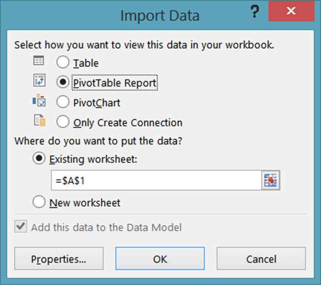
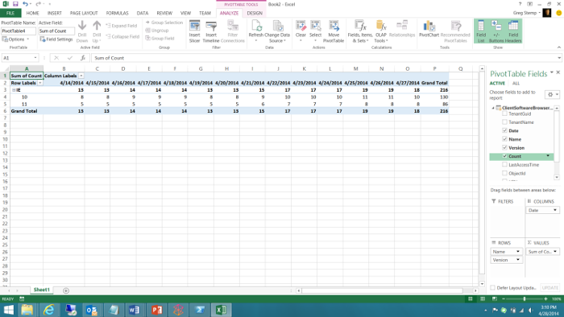

# <a name="using-excel-to-retrieve-office-365-reporting-data"></a><span data-ttu-id="a7dde-103">Usare Excel per recuperare dati di report Office 365</span><span class="sxs-lookup"><span data-stu-id="a7dde-103">Using Excel to Retrieve Office 365 Reporting Data</span></span>

 <span data-ttu-id="a7dde-104">**Sintesi:** Utilizzare la funzionalità oData in Microsoft Excel per recuperare informazioni di report dettagliate per la distribuzione di Office 365.</span><span class="sxs-lookup"><span data-stu-id="a7dde-104">**Summary:** Use the oData feature in Microsoft Excel to retrieve detailed reporting information for your deployment of Office 365</span></span>
  
<span data-ttu-id="a7dde-p101">La creazione di report è una parte fondamentale dell'amministrazione del sistema. L'interfaccia di amministrazione di Office 365 include un numero di report predefiniti, disponibili nella sezione **Report** del riquadro di spostamento sinistro. Qui, sono presenti report su utilizzo e sicurezza e report di conformità.</span><span class="sxs-lookup"><span data-stu-id="a7dde-p101">Reporting is a key part of system administration. The Office 365 Admin center includes a number of predefined reports, which you can access from the **Reports** section of the left navigation. There are usage reports and security and compliance reports.</span></span>
  
<span data-ttu-id="a7dde-p102">I report disponibili dipendono dalla versione di Office 365 in uso e quali servizi Office 365 sono attivati. Per ulteriori informazioni, vedere la [Pagina report](https://technet.microsoft.com/it-IT/library/office-365-reports.aspx).</span><span class="sxs-lookup"><span data-stu-id="a7dde-p102">The reports available to you depend on the version of Office 365 you are using and which Office 365 services you have enabled. For more information, see the [Reports page](https://technet.microsoft.com/it-IT/library/office-365-reports.aspx).</span></span>
  
<span data-ttu-id="a7dde-p103">I report Admin center predefiniti sono un'eccellente risorsa e facilitano il controllo dell'uso della cassetta postale o dei minuti che gli utenti hanno passato in conferente online. Tuttavia, per quanto concerne l'analisi dettagliata del dominio Office 365, i report hanno dei limiti.</span><span class="sxs-lookup"><span data-stu-id="a7dde-p103">The pre-defined Admin center reports are an excellent resource. They make it easy to check on such things as mailbox usage or the number of minutes that your users have been spending in online conferences. However, when it comes to detailed analysis of your Office 365 domain, the reports do have their limitations.</span></span>
  
<span data-ttu-id="a7dde-p104">Un modo per aggirare queste limitazioni è di usare Windows PowerShell o un altro linguaggio di sviluppo per accedere al servizio di Reporting di Office 365 e creare report personalizzati; i report personalizzati offrono l'abilità di imporre quali e quanti dati da restituire dal servizio di Reporting di Office 365. Attraverso la scrittura di report personalizzati è possibile specificare come i dati dovrebbero essere selezionati e raggruppati e, se possibile, come dovrebbero essere salvati; per esempio, è possibile salvare i dati in formato XML o in un formato separato da virgola importabile facilmente in Excel.</span><span class="sxs-lookup"><span data-stu-id="a7dde-p104">One way to work around these limitations is to use Windows PowerShell or another development language to access the Office 365 reporting service and create custom reports; custom reports give you the ability to dictate which data (and how much data) is returned from the Office 365 reporting service. By writing custom reports you can also specify how the data should be sorted and grouped, and, if applicable, how that data should be saved; for example, you can save data in XML format or in a comma-separated values format that can easily be imported in Excel.</span></span> 
  
<span data-ttu-id="a7dde-p105">Inoltre, script/applicazioni personalizzate consentono di accedere a report non disponibili nell'interfaccia di amministrazione di Office 365. Per esempio, l'interfaccia di amministrazione può mostrare di quante cassette postali "obsolete" si dispone, ma non a quali si è avuto accesso negli ultimi 30 giorni. Questa è una cosa che uno script di PowerShell personalizzato può mostrare. Presi insieme, ciò rappresenta una flessibilità enorme, grazie alla scrittura di un relativamente breve e semplice script Windows PowerShell.</span><span class="sxs-lookup"><span data-stu-id="a7dde-p105">In addition, custom scripts/applications enable you to access reports that are not available in the Office 365 Admin center. For example, the Admin center can tell you how many stale mailboxes you have, but it can't tell which mailboxes haven't been accessed in the past 30 days. That is something that a custom PowerShell script can tell you. Taken together, this represents an enormous amount of flexibility in return for having to write a short and relatively-simple Windows PowerShell script.</span></span>
  
> [!VISUAL BASIC NOTE]<span data-ttu-id="a7dde-119"> Per maggiori informazioni, vedere [home page](https://msdn.microsoft.com/it-IT/library/office/jj984325%28v=office.15%29.aspx) per il servizio di Reporting di Office 365.</span><span class="sxs-lookup"><span data-stu-id="a7dde-119"> For more information, see the [home page](https://msdn.microsoft.com/it-IT/library/office/jj984325%28v=office.15%29.aspx) for the Office 365 reporting service.</span></span>
  
<span data-ttu-id="a7dde-p106">Per poter recuperare questi dati è necessario scrivere un qualche tipo di codice. Ne vale la pena per un'organizzazione di grandi dimensioni che deve limitare la quantità e il tipo di informazioni da restituire. Ma se si è una piccola organizzazione e non è necessario dover limitare la quantità e il tipo di informazioni che devono essere restituite, è possibile considerare di aprire i report Office 365 direttamente da Excel.</span><span class="sxs-lookup"><span data-stu-id="a7dde-p106">In order to retrieve this data, you do have to write code of some kind. That's worth it if you are a larger organization that needs to limit the amount and the type of information that gets returned. But if you're a smaller organization, and you don't need to limit the amount and type of information that gets returned, you might consider opening the Office 365 reports from within Excel itself.</span></span>
  
<span data-ttu-id="a7dde-p107">Tuttavia, esistono alcune limitazioni; prima di tutto, non è possibile filtrare, ordinare, selezionare o manipolare in altro modo i dati prima che vengano restituiti. Si ottiene semplicemente il set predefinito di dati restituiti dal report. In alcuni casi potrebbero non esserci dati sufficienti. Ad esempio, il report potrebbe restituire dati solo per il mese precedente e non l'intero anno. Al contrario, in altri casi potrebbero esserci troppi dati: si potrebbero ricevere dati dell'intero anno anche se si desideravano solo quelli del mese precedente.</span><span class="sxs-lookup"><span data-stu-id="a7dde-p107">However, there are a few limitations here, the primary one being this: you cannot filter, sort, select, or otherwise manipulate the data that before it gets returned. Instead, you simply get back the default set of data returned by the report. In some cases that might not be enough data. For example, the report might return data for, say, only the previous month and not for the entire year. Conversely, in other cases that might be too much data: you might get back data for the entire year even though you only want data for the previous month.</span></span>
  
<span data-ttu-id="a7dde-128">Per aprire un report Office 365 direttamente da Excel, completare la procedura seguente:</span><span class="sxs-lookup"><span data-stu-id="a7dde-128">To open an Office 365 report directly from within Excel, complete the following procedure:</span></span>
  
1. <span data-ttu-id="a7dde-p108">Iniziare aprendo un nuovo foglio di lavoro in Excel. Sul foglio di lavoro, fare clic su **Dati**, fare clic su **Da altre origini** e quindi fare clic su **Da feed di dati OData**. Ciò consente di visualizzare la finestra di dialogo **Connessione guidata dati**:</span><span class="sxs-lookup"><span data-stu-id="a7dde-p108">Start by opening a new worksheet in Excel. On that worksheet, click **Data**, click **From Other Sources**, and then click **From OData Data Feed**. That brings up the **Data Connection Wizard** dialog box:</span></span>
    
     
  
2. <span data-ttu-id="a7dde-p109">Sulla pagina **Connessione a un feed di dati**, inserire **https://reports.office365.com/ecp/reportingwebservice/reporting.svc/** come percorso di feed dati. Si noti che è possibile immettere solo l'URL di base come indicato; non è possibile aggiungere alcun tipo di frase per selezionare, filtrare o formattare. Se si immette solo l'URL di base non verranno restituiti i dati; al contrario, si visualizzerà semplicemente il seguente messaggio di errore:</span><span class="sxs-lookup"><span data-stu-id="a7dde-p109">On the **Connect to a Data Feed** page, enter **https://reports.office365.com/ecp/reportingwebservice/reporting.svc/** as the data feed location. Note that you can only enter the base URL as shown; you cannot add any Select, Filter, or Format statements. If you enter anything but the base URL you won't get back any data; instead, you'll simply see the following error message:</span></span>
    
     
  
3. <span data-ttu-id="a7dde-p110">Dopo aver inserito l'URL di servizio reporting, selezionare **Usare questo nome è password** in **Credenziali di accesso**. Nella casella **Nome utente**, immettere il nome di accesso Office 365 (ad esempio, admin@litwareinc.onmicrosoft.com). Nella casella **Password** immettere la password di accesso di Office 365 e quindi fare clic su **Avanti**. Excel tenterà quindi di connettersi al servizio di Reporting utilizzando le credenziali fornite.</span><span class="sxs-lookup"><span data-stu-id="a7dde-p110">After entering the reporting service URL, select **Use this name and password** under **Log on credentials**. In the **User Name** box, enter your Office 365 logon name (for example, admin@litwareinc.onmicrosoft.com). In the **Password** box, enter your Office 365 logon password and then click **Next**. Excel will then attempt to connect to the reporting service using the supplied credentials.</span></span>
    
4. <span data-ttu-id="a7dde-p111">Dopo l'autenticazione, verrà visualizzata la pagina **Selezione tabelle**. Selezionare il report che si desidera visualizzare (per esempio, **MailTrafficTop** ) e quindi fare clic su **Avanti**:</span><span class="sxs-lookup"><span data-stu-id="a7dde-p111">After you have been authenticated, you'll see the **Select Tables** page. Select the report that you'd like to view (for example, **MailTrafficTop** ) and then click **Next**:</span></span>
    
     
  
    > [!NOTE]
    > <span data-ttu-id="a7dde-p112">È possibile selezionare più report; in questo modo si ottengono più tabelle e grafici da aggiungere al foglio di calcolo Excel. È anche possibile creare una singola tabella o un singolo grafico che combina i dati da più report. Tuttavia, non verrà analizzato in questo articolo introduttivo.</span><span class="sxs-lookup"><span data-stu-id="a7dde-p112">It's possible to select multiple reports; that results in multiple tables/charts being added to your Excel spreadsheet. It's even possible to create a single table/chart that combines data from multiple reports. However, we won't discuss that in this introductory article.</span></span> 
  
5. <span data-ttu-id="a7dde-147">Dopo aver fatto clic su **Avanti** si visualizzerà la pagina **Salvare file di connessione dati e terminare**:</span><span class="sxs-lookup"><span data-stu-id="a7dde-147">After clicking **Next** you'll be presented with the **Save Data Connection File and Finish** page:</span></span>
    
     
  
    <span data-ttu-id="a7dde-p113">Non è necessario immettere le informazioni qui. Per recuperare i dati, è necessario fare clic su **Fine**. Tuttavia, vale la pena notare che per impostazione predefinita Excel salva informazioni di ogni connessione dati eseguita; questi dati vengono archiviati nella cartella **Origini dati**:</span><span class="sxs-lookup"><span data-stu-id="a7dde-p113">You don't have to enter any information here. All you need to do to retrieve your data is to click **Finish**. However, it's worth noting that, by default, Excel saves information about each data connection you make; this data is stored in your **My Data Sources** folder:</span></span>
    
     
  
    <span data-ttu-id="a7dde-p114">Questo è il motivo perché la casella di dialogo include caselle di testo nominate come **Nome descrittivo** e **Ricerca parole chiave**; queste opzioni forniscono la possibilità di personalizzare le connessioni di dati. In questo modo, non si avrà un intero gruppo di origini dati come quelle riportate di seguito:</span><span class="sxs-lookup"><span data-stu-id="a7dde-p114">That's why the dialog box includes text boxes with labels like **Friendly Name** and **Search Keywords**; these options give you the chance to customize these data connections. That way you do not end up with a whole bunch of data sources that look like these:</span></span>
    
  ```
  DataFeed_1_reports-office365-com ClientSoftwareBrowserDetail.odc
DataFeed_1_reports-office365-com MailTrafficTop.odc
DataFeed_1_reports-office365-com Multiple Tables.odc
DataFeed_2_reports-office365-com MailboxActivityWeekly.odc
DataFeed_2_reports-office365-com MailTrafficTop.odc
DataFeed_3_reports-office365-com ClientSoftwareBrowserDetail.odc
  ```

<span data-ttu-id="a7dde-p115">Se si seleziona la casella di controllo **Salvare password nel file**, sarà possibile riutilizzare questi feed dati. Ad esempio, se si salva una connessione dati come **Report del browser client**. La volta successiva che si desidera avere informazioni sui browser Web usati per accedere al proprio dominio Office 365, non sarà necessario esaminare la Connessione guidata dati. Invece, basterà aprire Excel, fare clic su **Dati**, quindi fare clic su **Origini esistenti**. Selezionare la connessione dati desiderata nella casella di dialogo **Connessioni esistenti** e fare clic su **OK**:</span><span class="sxs-lookup"><span data-stu-id="a7dde-p115">If you select the checkbox **Save password in file**, you'll be able to reuse these data feeds. For example, suppose you save a data connection as **Client Browser Report**. The next time you want information about the web browsers being used to access your Office 365 domain you don't have to walk through the data connection wizard. Instead, all you need to do is open Excel, click **Data**, and then click **Existing Sources**. Select the desired data connection in the **Existing Connections** dialog box and then click **OK**:</span></span>
    

  
<span data-ttu-id="a7dde-161">A questo punto Excel effettuerà la connessione e recupererà i dati.</span><span class="sxs-lookup"><span data-stu-id="a7dde-161">At that point, Excel will make the connection for you and retrieve the data.</span></span>
    
<span data-ttu-id="a7dde-p116">Tenere presente che i file .ODC sono file XML di testo normale, che includono nome utente e password di Office 365:</span><span class="sxs-lookup"><span data-stu-id="a7dde-p116">Note that these .ODC files are plain-text XML files. Included in these plain-text XML files are your Office 365 user name and password:</span></span>
    
<span data-ttu-id="a7dde-164">\<odc:ConnectionString>Data Source=https://reports.office365.com/ecp/reportingwebservice/reporting.svc/;Namespaces to Include=\*;Max Received Message Size=4398046511104;Integrated Security=Basic; **User ID=admin@litwareinc.onmicrosoft.com;Password=MYpassw0rd!**;Persist Security Info=false;Service Document Url=https://reports.office365.com/ecp/reportingwebservice/reporting.svc/\</odc:ConnectionString></span><span class="sxs-lookup"><span data-stu-id="a7dde-164">\<odc:ConnectionString>Data Source=https://reports.office365.com/ecp/reportingwebservice/reporting.svc/;Namespaces to Include=\*;Max Received Message Size=4398046511104;Integrated Security=Basic; **User ID=admin@litwareinc.onmicrosoft.com;Password=MYpassw0rd!**;Persist Security Info=false;Service Document Url=https://reports.office365.com/ecp/reportingwebservice/reporting.svc/\</odc:ConnectionString></span></span>
    
<span data-ttu-id="a7dde-p117">Se non si desidera salvare il proprio nome utente e password in un file di testo normale, non selezionare la casella denominata **Salvare password nel file**. Se si fa in questo modo, ricordarsi che non sarà possibile riutilizzare queste connessioni di dati. Infatti, senza nome utente e password, Office 365 non sarà in grado di autenticare il tentativo di accesso al servizio.</span><span class="sxs-lookup"><span data-stu-id="a7dde-p117">If you don't like the idea of saving your user name and password in a plain-text file, then don't check the box labeled **Save password in file**. If you do that, however, keep in mind that you won't be able to reuse these data connections. That's because, without the user name and password, Office 365 will not be able to authenticate your attempt to log on to the service.</span></span>
    
6. <span data-ttu-id="a7dde-168">Fare clic su **Fine** sulla pagina **Salva file di connessione dati e chiudi** visualizzata con la casella di dialogo **Importa dati**:</span><span class="sxs-lookup"><span data-stu-id="a7dde-168">Click **Finish** on the **Save Data Connection File and Finish** page you'll be presented with the **Import Data** dialog box:</span></span>
    
     
  
7. <span data-ttu-id="a7dde-p118">Selezionare le opzioni di visualizzazione (ad esempio, **Report di tabella pivot**) e quindi fare clic su **OK**. Se tutto procede correttamente, i dati verranno importati e presentati in qualsiasi opzione di visualizzazione scelta:</span><span class="sxs-lookup"><span data-stu-id="a7dde-p118">Select your view options (for example, **PivotTable Report** ) and then click **OK**. If all goes well, your data will be imported and be presented in whichever view option you happened to choose:</span></span>
    
     
  
<span data-ttu-id="a7dde-p119">Cosa fare con questi dati è una scelta dell'utente. Per qualche suggerimento, consultare [Creare una dashboard di Excel Services usando un feed di dati OData](https://technet.microsoft.com/it-IT/library/jj873965%28v=office.15%29.aspx). Anche se questo articolo non utilizza il servizio di creazione report di Office 365, fornisce dei consigli pratici su certe operazioni come l'aggiunta di filtri e filtri dei dati alla nuova dashboard.</span><span class="sxs-lookup"><span data-stu-id="a7dde-p119">What you do with that data is then entirely up to you. For some suggestions. take a look at [Create an Excel Services dashboard using an oData data feed](https://technet.microsoft.com/it-IT/library/jj873965%28v=office.15%29.aspx). Although that article doesn't use the Office 365 reporting service, it does provide some handy hints for doing things like adding filters and slicers to your new dashboard.</span></span>
  
## <a name="see-also"></a><span data-ttu-id="a7dde-177">Vedere anche</span><span class="sxs-lookup"><span data-stu-id="a7dde-177">See also</span></span>

#### 

[<span data-ttu-id="a7dde-178">Gestire Office 365 con PowerShell di Office 365</span><span class="sxs-lookup"><span data-stu-id="a7dde-178">Manage Office 365 with Office 365 PowerShell</span></span>](manage-office-365-with-office-365-powershell.md)
  
[<span data-ttu-id="a7dde-179">Guida introduttiva a PowerShell di Office 365</span><span class="sxs-lookup"><span data-stu-id="a7dde-179">Getting started with Office 365 PowerShell</span></span>](getting-started-with-office-365-powershell.md)
  
[<span data-ttu-id="a7dde-180">Utilizzo di Windows PowerShell per creare rapporti in Office 365</span><span class="sxs-lookup"><span data-stu-id="a7dde-180">Use Windows PowerShell to create reports in Office 365</span></span>](use-windows-powershell-to-create-reports-in-office-365.md)

