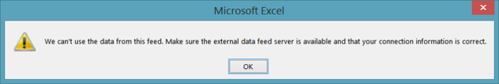
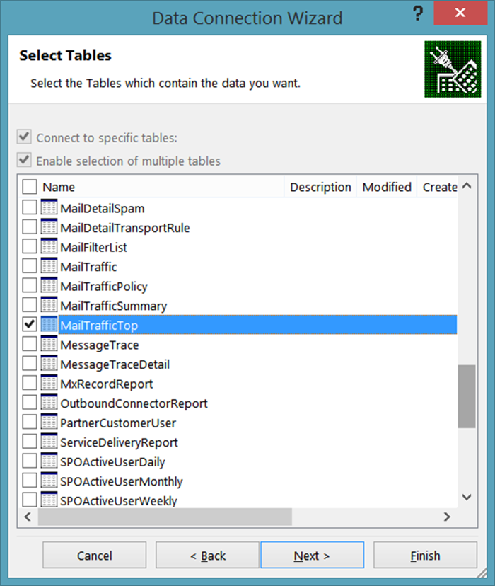
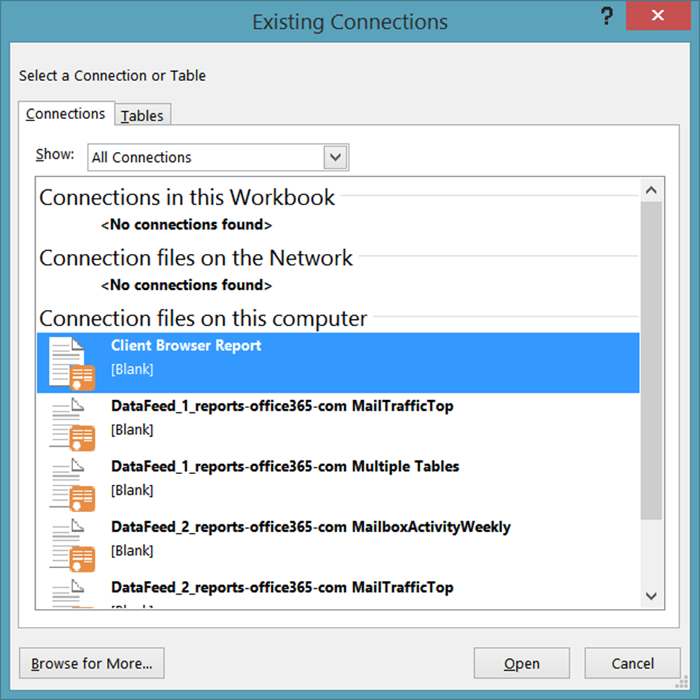

# <a name="using-excel-to-retrieve-office-365-reporting-data"></a>Usare Excel per recuperare dati di report Office 365

 **Sintesi:** Utilizzare la funzionalità oData in Microsoft Excel per recuperare informazioni di report dettagliate per la distribuzione di Office 365.
  
La creazione di report è una parte fondamentale dell'amministrazione del sistema. L'interfaccia di amministrazione di Office 365 include un numero di report predefiniti, disponibili nella sezione **Report** del riquadro di spostamento sinistro. Qui, sono presenti report su utilizzo e sicurezza e report di conformità.
  
I report disponibili dipendono dalla versione di Office 365 in uso e quali servizi Office 365 sono attivati. Per ulteriori informazioni, vedere la [Pagina report](https://technet.microsoft.com/it-IT/library/office-365-reports.aspx).
  
I report Admin center predefiniti sono un'eccellente risorsa e facilitano il controllo dell'uso della cassetta postale o dei minuti che gli utenti hanno passato in conferente online. Tuttavia, per quanto concerne l'analisi dettagliata del dominio Office 365, i report hanno dei limiti.
  
Un modo per aggirare queste limitazioni è di usare Windows PowerShell o un altro linguaggio di sviluppo per accedere al servizio di Reporting di Office 365 e creare report personalizzati; i report personalizzati offrono l'abilità di imporre quali e quanti dati da restituire dal servizio di Reporting di Office 365 Attraverso la scrittura di report personalizzati è possibile specificare come i dati dovrebbero essere selezionati e raggruppati e, se possibile, come dovrebbero essere salvati; per esempio, è possibile salvare i dati in formato XML o in un formato separato da virgola importabile facilmente in Excel. 
  
Inoltre, script/applicazioni personalizzate consentono di accedere a report non disponibili nell'Admin center di Office 365 Per esempio, l'Admin center può mostrare di quante cassette postali "obsolete" si dispone, ma non a quali si è avuto accesso negli ultimi 30 giorni. Ma questa è una cosa che uno script di PowerShell personalizzato può mostrare. Presi insieme, questo rappresenta una flessibilità enorme, grazie alla scrittura di un relativamente breve e semplice script Windows PowerShell.
  
> [!VISUAL BASIC NOTE] (Per maggiori informazioni, vedere [home page](https://msdn.microsoft.com/it-IT/library/office/jj984325%28v=office.15%29.aspx) per il servizio di Reporting di Office 365
  
Per poter recuperare questi dati è necessario scrivere un qualche tipo di codice. Ne vale la pena per un'organizzazione di grandi dimensioni che deve limitare la quantità e il tipo di informazioni che devono essere restituite. Ma se si è una piccola organizzazione e non è necessario dover limitare la quantità e il tipo di informazioni che devono essere restituite, è possibile considerare di aprire i report Office 365 direttamente da Excel.
  
Tuttavia, esistono alcune limitazioni, di cui la principale è: Non è possibile filtrare, scegliere, selezionare o comunque manipolare i dati prima che vengano restituiti. Ma si ottiene semplicemente il set predefinito di dati restituiti dal report. In alcuni casi potrebbero non esserci dati sufficienti. Ad esempio, il report potrebbe restituire dati solo per il mese precedente e non l'intero anno. Al contrario, in altri casi potrebbero esserci troppi dati: Potrebbe restituire dati dell'intero anno anche se si desiderava solo quelli del mese precedente.
  
Per aprire un report Office 365 direttamente da Excel, completare la procedura seguente:
  
1. Iniziare aprendo un nuovo foglio di lavoro in Excel. Sul foglio di lavoro, fare clic su **Dati**, fare clic su **Da altre origini** e quindi fare clic su **Da feed di dati OData**. Ciò consente di visualizzare la finestra di dialogo **Connessione guidata dati**:
    
     
  
2. Sulla pagina **Connettere a Feed dati**, inserire **https://reports.office365.com/ecp/reportingwebservice/reporting.svc/** come percorso di feed dati. Si noti che è possibile immettere solo l'URL di base come indicato; non è possibile aggiungere alcun tipo di frase per selezionare, filtrare o formattare. Se si immette solo l'URL di base non verranno restituiti i dati; al contrario, si visualizzerà semplicemente il seguente messaggio di errore:
    
     
  
3. Dopo aver inserito l'URL di servizio reporting, selezionare **Usare questo nome è password** in **Credenziali di accesso**. Nella casella **Nome utente**, immettere il nome di accesso Office 365 (ad esempio, admin@litwareinc.onmicrosoft.com). Nella casella **Password** immettere la password di accesso di Office 365 e quindi fare clic su **Avanti**. Excel tenterà quindi di connettersi al servizio di Reporting utilizzando le credenziali fornite.
    
4. Dopo che è stato autenticato, verrà visualizzata la pagina **Selezione tabelle** Selezionare il report che si desidera visualizzare (per esempio, **MailTrafficTop** ) e quindi fare clic su **Avanti**:
    
     
  
    > [!NOTE]
    > È possibile selezionare più report; questo risulta in più tabelle e grafici da aggiungere al foglio di calcolo Excel. È anche possibile creare una singola tabella/grafico che combina i dati da più report. Tuttavia, non verrà analizzato in questo articolo introduttivo. 
  
5. Dopo aver fatto clic su **Avanti** si visualizzerà la pagina **Salvare file di connessione dati e terminare**:
    
     
  
    Non è necessario immettere le informazioni qui. Per recuperare i dati, è necessario fare clic su **Terminare**. Tuttavia, vale la pena notare che Excel salva informazioni, in modo predefinito, di ogni connessione dati eseguita; questi dati vengono archiviati nella cartella **Origine dati**:
    
     
  
    Questo è il motivo perché la casella di dialogo include caselle di testo nominati come **Nome descrittivo** e **Ricerca parole chiave**; queste opzioni forniscono la possibilità di personalizzare le connessioni di dati. In modo che non si finisce con un intero gruppo di origini di dati come queste:
    
  ```
  DataFeed_1_reports-office365-com ClientSoftwareBrowserDetail.odc
DataFeed_1_reports-office365-com MailTrafficTop.odc
DataFeed_1_reports-office365-com Multiple Tables.odc
DataFeed_2_reports-office365-com MailboxActivityWeekly.odc
DataFeed_2_reports-office365-com MailTrafficTop.odc
DataFeed_3_reports-office365-com ClientSoftwareBrowserDetail.odc
  ```

Se si seleziona la casella di controllo **Salvare password nel file**, sarà possibile riutilizzare questi feed dati. Ad esempio, se si salva una connessione dati come **Report del browser client**. La volta successiva che si desidera avere informazioni sui browser Web usati per accedere al proprio dominio Office 365, non sarà necessario esaminare la Connessione guidata dati. Invece, basterà aprire Excel, fare clic su **Dati**, quindi fare clic su **Origini esistenti**. Selezionare la connessione dati desiderata nella casella di dialogo **Connessioni esistenti** e fare clic su **OK**:
    

  
A questo punto Excel effettuerà la connessione e recupererà i dati.
    
Tenere presente che i file .ODC sono file XML di testo normale, che includono nome utente e password di Office 365:
    
\<odc:ConnectionString>Data Source=https://reports.office365.com/ecp/reportingwebservice/reporting.svc/;Namespaces to Include=*;Max Received Message Size=4398046511104;Integrated Security=Basic; **User ID=admin@litwareinc.onmicrosoft.com;Password=MYpassw0rd!**;Persist Security Info=false;Service Document Url=https://reports.office365.com/ecp/reportingwebservice/reporting.svc/\</odc:ConnectionString>
    
Se non si desidera salvare il proprio nome utente e password in un file di testo normale, non selezionare la casella nominata **Salvare password nel file**. Se si fa in questo modo, ricordarsi che non si sarà in grado di riutilizzare queste connessioni di dati. Questo perché, senza nome utente e password, Office 365 non sarà in grado di autenticare il tentativo di accesso al servizio.
    
6. Fare clic su **Terminare** sulla pagina **Salvare file di connessione dati e terminare** visualizzata con la casella di dialogo **Importare dati**:
    
     
  
7. Selezionare le opzioni di visualizzazione (ad esempio, **Report di tabella pivot** ) e quindi fare clic su **OK**. Se tutto procede correttamente, i dati verranno importati e presentati in qualsiasi opzione di visualizzazione scelta:
    
     
  
Cosa fare con questi dati è una scelta dell'utente. Per qualche suggerimento dare un'occhiata a [Creare un dashboard di Excel Services usando un feed di dati OData](https://technet.microsoft.com/it-IT/library/jj873965%28v=office.15%29.aspx). Anche se questo articolo non utilizza il servizio di creazione report di Office 365, fornisce dei consigli pratici su certe operazioni come l'aggiunta di filtri e filtri dei dati al nuovo dashboard.
  
## <a name="see-also"></a>Vedere anche

#### 

[Gestire Office 365 con PowerShell di Office 365](manage-office-365-with-office-365-powershell.md)
  
[Guida introduttiva a PowerShell di Office 365](getting-started-with-office-365-powershell.md)
  
[Utilizzo di Windows PowerShell per creare rapporti in Office 365](use-windows-powershell-to-create-reports-in-office-365.md)

