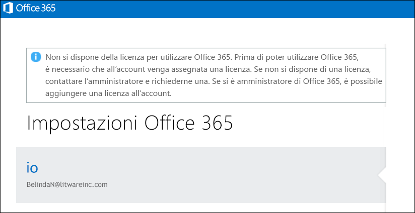

# <a name="view-licensed-and-unlicensed-users-with-office-365-powershell"></a>Visualizzare gli utenti con e senza licenza con PowerShell di Office 365

**Sintesi:** Viene spiegato come utilizzare PowerShell di Office 365 per visualizzare gli account utente con e senza licenza.
  
Gli account utente nell'organizzazione di Office 365 possono disporre di alcune, tutte o nessuna licenza in base ai piani di gestione delle licenze nell'organizzazione. È possibile utilizzare PowerShell di Office 365 per individuare rapidamente gli utenti dotati di licenza o meno all'interno dell'organizzazione.
  
## <a name="before-you-begin"></a>Prima di iniziare

- Le procedure descritte in questo argomento richiedono all'utente di connettersi a PowerShell di Office 365. Per istruzioni, vedere [Connettersi a PowerShell di Office 365](connect-to-office-365-powershell.md).
    
- Se si usa il cmdlet **Get-MsolUser** senza utilizzare il parametro _-All_, vengono restituiti solo i primi 500 account.
    
## <a name="the-short-version-instructions-without-explanations"></a>Versione breve (istruzioni senza spiegazioni)

In questa sezione vengono illustrate le procedure in modo chiaro e senza informazioni superflue. Se si hanno altre domande o si desiderano ulteriori informazioni, è possibile leggere il resto dell'argomento.
  
Per visualizzare l'elenco di tutti gli account utente e dei relativi stati di licenza nell'organizzazione, eseguire il comando seguente in PowerShell di Office 365:
  
```
Get-MsolUser -All
```

Per visualizzare l'elenco di tutti gli account utente senza licenza nell'organizzazione, eseguire il comando seguente:
  
```
Get-MsolUser -All -UnlicensedUsersOnly
```

Per visualizzare l'elenco di tutti gli account utente con licenza nell'organizzazione, eseguire il comando seguente:
  
```
Get-MsolUser -All | where {$_.isLicensed -eq $true}
```

## <a name="the-long-version-instructions-with-detailed-explanations"></a>Versione estesa (istruzioni con spiegazioni dettagliate)

Gli account utente di Office 365 e le licenze di Office 365 non necessitano di una corrispondenza uno a uno: è possibile che degli utenti di Office 365 non dispongano di una licenza di Office 365 come è possibile che esistano licenze di Office 365 che non sono state assegnate a un utente (in effetti, un singolo account utente può avere anche  *più*  licenze di Office 365). Quando si crea un nuovo account utente di Office 365 (per ulteriori informazioni in merito, consultare l'articolo [Concedere in licenza Office 365 agli utenti con Windows PowerShell](http://technet.microsoft.com/library/0ab9fcac-e5ea-4b5b-b72c-8c92c55565ac.aspx)) non si deve necessariamente assegnare a tale utente una licenza: il nuovo utente avrà un account valido, ma non potrà accedere a Office 365. Se proverà a effettuare l'accesso, vedrà qualcosa di simile a questo:
  

  
Allo stesso modo, potrebbe esserci un utente che ha preso un periodo di assenza, ad esempio per un periodo sabbatico o un congedo di maternità/paternità. In un caso simile, potresti rimuovere la licenza dall'utente, ma lasciarne integro l'account (vale a dire, lasciare invariati tutti i valori proprietà, come indirizzo e numero di telefono). Facendolo, puoi assegnare tale licenza a qualcun altro (ad esempio, al sostituto della persona assente). Quando l'utente tornerà a lavoro potrai assegnargli una nuova licenza e potrà riprendere a lavorare come se non se ne fosse mai andato.
  
Questo per dire che sì, puoi avere utenti che hanno account, ma che non hanno licenze. O viceversa.
  
Nell'articolo [Visualizzare le licenze e i servizi con PowerShell di Office 365](view-licenses-and-services-with-office-365-powershell.md) viene illustrato come è possibile determinare il numero di licenze di Office 365 acquistate dalla tua organizzazione nonché quante di quelle licenze sono state assegnate agli utenti. Sono informazioni importanti. Allo stesso modo, è importante sapere a quali dei tuoi utenti sono state assegnate le licenze e quali invece non ne hanno nessuna. E con questo articolo scoprirai come farlo.
  
Come è già noto, il cmdlet **Get-MsolUser** fornisce informazioni su tutti i tuoi account utente di Office 365. Se si cercano informazioni rapide sugli utenti di Office 365, non si deve fare altro che eseguire questo comando in PowerShell di Office 365:
  
```
Get-MsolUser
```

In cambio, Get-MsolUser restituisce dati simili al seguente:
  
```
UserPrincipalName           DisplayName                     isLicensed
-----------------           -----------                     ----------
ZrinkaM@litwareinc.com      Zrinka Makovac                  True
BelindaN@litwareinc.com     Belinda Newman                  False
BonnieK@litwareinc.com      Bonnie Kearney                  True
FabriceC@litwareinc.com     Fabrice Canel                   True
AnneW@litwareinc.com        Anne Wallace                    True
AlexD@litwareinc.com        Alex Darrow                     True
```

Come è possibile vedere, uno dei valori proprietà ottenuti riguarda la proprietà **isLicensed**. Se **isLicensed** è uguale a `False` allora l'utente non possiede una licenza per Office 365. In altre parole, se si desidera, è possibile semplicemente scorrere l'elenco degli utenti e scegliere quelli la cui proprietà **isLicensed** è impostata su `False`.
  
In ogni caso, scorrere un elenco di utenti per vedere quelli senza licenza può essere facile se hai un numero relativamente piccolo di utenti. Se invece hai un gran numero di utenti, tale operazione, nella migliore delle ipotesi, potrebbe essere decisamente noiosa (e, a seconda di come Windows PowerShell è stato configurato, potrebbe non essere possibile perché c'è un limite al numero di righe di output che possono essere visualizzate contemporaneamente nella console di Windows PowerShell).
  
Tenendo a mente ciò, un modo migliore per elencare gli utenti senza licenza consiste nell'eseguire il seguente comando:
  
```
Get-MsolUser -UnlicensedUsersOnly
```

Il comando restituirà solo gli utenti senza licenza di Office 365. In altre parole:
  
```
UserPrincipalName           DisplayName                     isLicensed
-----------------           -----------                     ----------
BelindaN@litwareinc.com     Belinda Newman                  False
```

Come puoi vedere, abbiamo un solo utente senza licenza. E se volessimo un elenco degli utenti  *con licenza*  ? Sarebbe leggermente più complicato:
  
```
Get-MsolUser | Where-Object {$_.isLicensed -eq $true}
```

Il comando, che viene visualizzato per tutti gli account utente la cui proprietà **isLicensed** è uguale a `True`, restituisce informazioni simili alle seguenti:
  
```
UserPrincipalName           DisplayName                     isLicensed
-----------------           -----------                     ----------
ZrinkaM@litwareinc.com      Zrinka Makovac                  True
BonnieK@litwareinc.com      Bonnie Kearney                  True
FabriceC@litwareinc.com     Fabrice Canel                   True
AnneW@litwareinc.com        Anne Wallace                    True
AlexD@litwareinc.com        Alex Darrow                     True
```

Come è possibile vedere, non ci sono informazioni per Belinda Newman. Perché? Ovviamente, perché la proprietà **isLicensed** per l'account di Belinda non è impostata su `True`.
  
## <a name="see-also"></a>Vedere anche
<a name="SeeAlso"> </a>

Per ulteriori informazioni sui cmdlet utilizzati in questa procedura, vedere i seguenti argomenti:
  
- [Get-MsolUser](https://go.microsoft.com/fwlink/p/?LinkId=691547)
    
- [Where-Object](https://go.microsoft.com/fwlink/p/?LinkId=113423)
    

