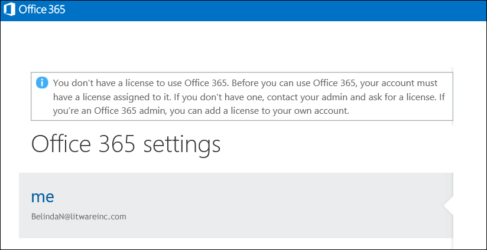

# <a name="view-licensed-and-unlicensed-users-with-office-365-powershell"></a><span data-ttu-id="9ba90-103">Visualizzare gli utenti con e senza licenza con PowerShell di Office 365</span><span class="sxs-lookup"><span data-stu-id="9ba90-103">View licensed and unlicensed users with Office 365 PowerShell</span></span>

<span data-ttu-id="9ba90-104">**Riepilogo:** Questo articolo viene illustrato come utilizzare Office 365 PowerShell per visualizzare gli account utente con licenza e senza licenza.</span><span class="sxs-lookup"><span data-stu-id="9ba90-104">**Summary:** Explains how to use Office 365 PowerShell to view licensed and unlicensed user accounts.</span></span>
  
<span data-ttu-id="9ba90-p101">Gli account utente nell'organizzazione di Office 365 possono disporre di alcune, tutte o nessuna licenza in base ai piani di gestione delle licenze nell'organizzazione. È possibile utilizzare PowerShell di Office 365 per individuare rapidamente gli utenti dotati di licenza o meno all'interno dell'organizzazione.</span><span class="sxs-lookup"><span data-stu-id="9ba90-p101">User accounts in your Office 365 organization may have some, all, or none of the available licenses assigned to them from the licensing plans that are available in your organization. You can use Office 365 PowerShell to quickly find the licensed and unlicensed users in your organization.</span></span>
  
## <a name="before-you-begin"></a><span data-ttu-id="9ba90-107">Informazioni preliminari</span><span class="sxs-lookup"><span data-stu-id="9ba90-107">Before you begin</span></span>

- <span data-ttu-id="9ba90-p102">Le procedure descritte in questo argomento richiedono all'utente di connettersi a PowerShell di Office 365. Per istruzioni, vedere [Connettersi a PowerShell di Office 365](connect-to-office-365-powershell.md).</span><span class="sxs-lookup"><span data-stu-id="9ba90-p102">The procedures in this topic require you to connect to Office 365 PowerShell. For instructions, see [Connect to Office 365 PowerShell](connect-to-office-365-powershell.md).</span></span>
    
- <span data-ttu-id="9ba90-110">Se si utilizza il cmdlet **Get-MsolUser** senza utilizzare il _-tutti_ parametro, vengono restituiti solo i primi 500 account.</span><span class="sxs-lookup"><span data-stu-id="9ba90-110">If you use the **Get-MsolUser** cmdlet without using the _-All_ parameter, only the first 500 accounts are returned.</span></span>
    
## <a name="the-short-version-instructions-without-explanations"></a><span data-ttu-id="9ba90-111">Versione breve (istruzioni senza spiegazioni)</span><span class="sxs-lookup"><span data-stu-id="9ba90-111">The short version (instructions without explanations)</span></span>

<span data-ttu-id="9ba90-p103">In questa sezione vengono illustrate le procedure in modo chiaro e senza informazioni superflue. Se si hanno altre domande o si desiderano ulteriori informazioni, è possibile leggere il resto dell'argomento.</span><span class="sxs-lookup"><span data-stu-id="9ba90-p103">This section presents the procedures without fanfare or superfluous explanation. If you have questions or want more information, you can read rest of the topic.</span></span>
  
<span data-ttu-id="9ba90-114">Per visualizzare l'elenco di tutti gli account utente e dei relativi stati di licenza nell'organizzazione, eseguire il comando seguente in PowerShell di Office 365:</span><span class="sxs-lookup"><span data-stu-id="9ba90-114">To view the list of all user accounts and their licensing status in your organization, run the following command in Office 365 PowerShell:</span></span>
  
```
Get-MsolUser -All
```

<span data-ttu-id="9ba90-115">Per visualizzare l'elenco di tutti gli account utente senza licenza nell'organizzazione, eseguire il comando seguente:</span><span class="sxs-lookup"><span data-stu-id="9ba90-115">To view the list of all unlicensed user accounts in your organization, run the following command:</span></span>
  
```
Get-MsolUser -All -UnlicensedUsersOnly
```

<span data-ttu-id="9ba90-116">Per visualizzare l'elenco di tutti gli account utente con licenza nell'organizzazione, eseguire il comando seguente:</span><span class="sxs-lookup"><span data-stu-id="9ba90-116">To view the list of all licensed user accounts in your organization, run the following command:</span></span>
  
```
Get-MsolUser -All | where {$_.isLicensed -eq $true}
```

## <a name="the-long-version-instructions-with-detailed-explanations"></a><span data-ttu-id="9ba90-117">Versione estesa (istruzioni con spiegazioni dettagliate)</span><span class="sxs-lookup"><span data-stu-id="9ba90-117">The long version (instructions with detailed explanations)</span></span>

<span data-ttu-id="9ba90-p104">Gli account utente di Office 365 e le licenze di Office 365 non è necessario disporre di una corrispondenza: è possibile lasciare che gli utenti di Office 365 che non dispongono di una licenza Office 365 ed è possibile disporre di licenze di Office 365 che non sono state assegnate a un utente. (Infatti un singolo account utente può anche dispongono di licenze *più* Office 365) Quando si crea un nuovo utente di Office 365 per gli account (vedere l'articolo [agli utenti di licenza di Office 365 con Windows PowerShell](http://technet.microsoft.com/library/0ab9fcac-e5ea-4b5b-b72c-8c92c55565ac.aspx) per ulteriori informazioni) è non è necessario assegnare una licenza utente: il nuovo utente avrà un account valido, ma all'utente non sarà in grado di accedere a distaccate CE 365. Se si tenta di effettuare l'accesso, si verrà visualizzato qualcosa di simile alla seguente:</span><span class="sxs-lookup"><span data-stu-id="9ba90-p104">Office 365 user accounts and Office 365 licenses don't need to have a one-to-one correspondence: it's possible to have Office 365 users who do not have an Office 365 license, and it's possible to have Office 365 licenses that haven't been assigned to a user. (In fact, a single user account can even have  *multiple*  Office 365 licenses.) When you create a new Office 365 user account (see the article [License Office 365 users with Windows PowerShell](http://technet.microsoft.com/library/0ab9fcac-e5ea-4b5b-b72c-8c92c55565ac.aspx) for more information) you don't have to assign that user a license: the new user will have a valid account, but he or she won't be able to sign in to Office 365. If they try to sign in, they'll see something similar to this:</span></span>
  

  
<span data-ttu-id="9ba90-p105">Allo stesso modo, potrebbe esserci un utente che ha preso un periodo di assenza, ad esempio per un periodo sabbatico o un congedo di maternità/paternità. In un caso simile, potresti rimuovere la licenza dall'utente, ma lasciarne integro l'account (vale a dire, lasciare invariati tutti i valori proprietà, come indirizzo e numero di telefono). Facendolo, puoi assegnare tale licenza a qualcun altro (ad esempio, al sostituto della persona assente). Quando l'utente tornerà a lavoro potrai assegnargli una nuova licenza e potrà riprendere a lavorare come se non se ne fosse mai andato.</span><span class="sxs-lookup"><span data-stu-id="9ba90-p105">Likewise, you might have a user who will be taking some extended time off, perhaps for a sabbatical or for maternity/paternity leave. In a case like that, you could remove the user's license but leave the user account intact (that is, leave all its property values, such as address and phone number, as-is). By doing that, you can assign their license to someone else (like, say, a temporary worker filling in for the person on leave). When the user returns to work you can issue them a new license and they'll be able to resume working as if they'd never been gone.</span></span>
  
<span data-ttu-id="9ba90-p106">Questo per dire che sì, puoi avere utenti che hanno account, ma che non hanno licenze. O viceversa.</span><span class="sxs-lookup"><span data-stu-id="9ba90-p106">Which simply means that, yes, you can have users who have accounts but who don't have licenses. Or vice-versa.</span></span>
  
<span data-ttu-id="9ba90-p107">Nell'articolo [Visualizzare le licenze e i servizi con PowerShell di Office 365](view-licenses-and-services-with-office-365-powershell.md) viene illustrato come è possibile determinare il numero di licenze di Office 365 acquistate dalla tua organizzazione nonché quante di quelle licenze sono state assegnate agli utenti. Sono informazioni importanti. Allo stesso modo, è importante sapere a quali dei tuoi utenti sono state assegnate le licenze e quali invece non ne hanno nessuna. E con questo articolo scoprirai come farlo.</span><span class="sxs-lookup"><span data-stu-id="9ba90-p107">The article [View licenses and services with Office 365 PowerShell](view-licenses-and-services-with-office-365-powershell.md) explains how you can determine the number of Office 365 licenses your organization has purchased as well as how many of those licenses have been assigned to users. That's important information. Equally important, however is knowing which of your users have been assigned these licenses and which ones haven't. And this article will tell you how to do just that.</span></span>
  
<span data-ttu-id="9ba90-p108">Come è già noto, il cmdlet **Get-MsolUser** fornisce informazioni su tutti i tuoi account utente di Office 365. Se si cercano informazioni rapide sugli utenti di Office 365, non si deve fare altro che eseguire questo comando in PowerShell di Office 365:</span><span class="sxs-lookup"><span data-stu-id="9ba90-p108">As you probably know, the **Get-MsolUser** cmdlet returns information about all your Office 365 user accounts. Need some quick info about all your Office 365 users? Then run this command in Office 365 PowerShell:</span></span>
  
```
Get-MsolUser
```

<span data-ttu-id="9ba90-135">In cambio, Get-MsolUser restituisce dati simili al seguente:</span><span class="sxs-lookup"><span data-stu-id="9ba90-135">In turn, Get-MsolUser returns data similar to this:</span></span>
  
```
UserPrincipalName           DisplayName                     isLicensed
-----------------           -----------                     ----------
ZrinkaM@litwareinc.com      Zrinka Makovac                  True
BelindaN@litwareinc.com     Belinda Newman                  False
BonnieK@litwareinc.com      Bonnie Kearney                  True
FabriceC@litwareinc.com     Fabrice Canel                   True
AnneW@litwareinc.com        Anne Wallace                    True
AlexD@litwareinc.com        Alex Darrow                     True
```

<span data-ttu-id="9ba90-p109">Come è possibile vedere, uno dei valori proprietà ottenuti riguarda la proprietà **isLicensed**. Se **isLicensed** è uguale a `False` allora l'utente non possiede una licenza per Office 365. In altre parole, se si desidera, è possibile semplicemente scorrere l'elenco degli utenti e scegliere quelli la cui proprietà **isLicensed** è impostata su `False`.</span><span class="sxs-lookup"><span data-stu-id="9ba90-p109">As you can see, one of the property values returned is for the **isLicensed** property. If **isLicensed** is equal to `False` that means that the user doesn't have a license for Office 365. In other words, and if you wanted to, you could simply scroll through your list of users and pick out the ones where the **isLicensed** property is set to `False`.</span></span>
  
<span data-ttu-id="9ba90-p110">In ogni caso, scorrere un elenco di utenti per vedere quelli senza licenza può essere facile se hai un numero relativamente piccolo di utenti. Se invece hai un gran numero di utenti, tale operazione, nella migliore delle ipotesi, potrebbe essere decisamente noiosa (e, a seconda di come Windows PowerShell è stato configurato, potrebbe non essere possibile perché c'è un limite al numero di righe di output che possono essere visualizzate contemporaneamente nella console di Windows PowerShell).</span><span class="sxs-lookup"><span data-stu-id="9ba90-p110">At any rate, scrolling through a list of users trying to pick out the unlicensed users works as long as you have a relatively small number of users. If you have a large number of users, however, scrolling through that list will be, at best, extremely tedious. (And, depending on how Windows PowerShell has been configured, perhaps downright impossible. That's because there's a limit to the number of lines of output that can be displayed in the Windows PowerShell console at any one time.)</span></span>
  
<span data-ttu-id="9ba90-143">Tenendo a mente ciò, un modo migliore per elencare gli utenti senza licenza consiste nell'eseguire il seguente comando:</span><span class="sxs-lookup"><span data-stu-id="9ba90-143">With that in mind, a much better way to list your unlicensed users is to run this command instead:</span></span>
  
```
Get-MsolUser -UnlicensedUsersOnly
```

<span data-ttu-id="9ba90-p111">Il comando restituirà solo gli utenti senza licenza di Office 365. In altre parole:</span><span class="sxs-lookup"><span data-stu-id="9ba90-p111">That command returns only those users who don't have a license for Office 365. In other words:</span></span>
  
```
UserPrincipalName           DisplayName                     isLicensed
-----------------           -----------                     ----------
BelindaN@litwareinc.com     Belinda Newman                  False
```

<span data-ttu-id="9ba90-p112">Come puoi vedere, abbiamo un solo utente senza licenza. E se volessimo un elenco degli utenti  *con licenza*  ? Sarebbe leggermente più complicato:</span><span class="sxs-lookup"><span data-stu-id="9ba90-p112">As you can see we have one unlicensed user. And what is we only wanted a list of the  *licensed*  users? That's a tiny bit more complicated, but only the tiniest bit:</span></span>
  
```
Get-MsolUser | Where-Object {$_.isLicensed -eq $true}
```

<span data-ttu-id="9ba90-149">Il comando, che viene visualizzato per tutti gli account utente la cui proprietà **isLicensed** è uguale a `True`, restituisce informazioni simili alle seguenti:</span><span class="sxs-lookup"><span data-stu-id="9ba90-149">That command, which looks for all the user accounts where the **isLicensed** property is equal to `True`, returns information similar to this:</span></span>
  
```
UserPrincipalName           DisplayName                     isLicensed
-----------------           -----------                     ----------
ZrinkaM@litwareinc.com      Zrinka Makovac                  True
BonnieK@litwareinc.com      Bonnie Kearney                  True
FabriceC@litwareinc.com     Fabrice Canel                   True
AnneW@litwareinc.com        Anne Wallace                    True
AlexD@litwareinc.com        Alex Darrow                     True
```

<span data-ttu-id="9ba90-p113">Come è possibile vedere, non ci sono informazioni per Belinda Newman. Perché? Ovviamente, perché la proprietà **isLicensed** per l'account di Belinda non è impostata su `True`.</span><span class="sxs-lookup"><span data-stu-id="9ba90-p113">As you can see, information is not returned for Belinda Newman. Why not? You got it: because the **isLicensed** property for Belinda's account is not set to `True`.</span></span>
  
## <a name="see-also"></a><span data-ttu-id="9ba90-153">Vedere anche</span><span class="sxs-lookup"><span data-stu-id="9ba90-153">See also</span></span>
<span data-ttu-id="9ba90-154"><a name="SeeAlso"> </a></span><span class="sxs-lookup"><span data-stu-id="9ba90-154"><a name="SeeAlso"> </a></span></span>

<span data-ttu-id="9ba90-155">Per ulteriori informazioni sui cmdlet utilizzati in questa procedura, vedere i seguenti argomenti:</span><span class="sxs-lookup"><span data-stu-id="9ba90-155">For more information about the cmdlets that are used in these procedures, see the following topics:</span></span>
  
- [<span data-ttu-id="9ba90-156">Get-MsolUser</span><span class="sxs-lookup"><span data-stu-id="9ba90-156">Get-MsolUser</span></span>](https://go.microsoft.com/fwlink/p/?LinkId=691547)
    
- [<span data-ttu-id="9ba90-157">Where-Object</span><span class="sxs-lookup"><span data-stu-id="9ba90-157">Where-Object</span></span>](https://go.microsoft.com/fwlink/p/?LinkId=113423)
    

