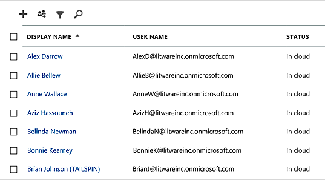
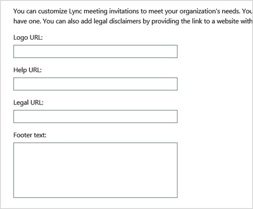
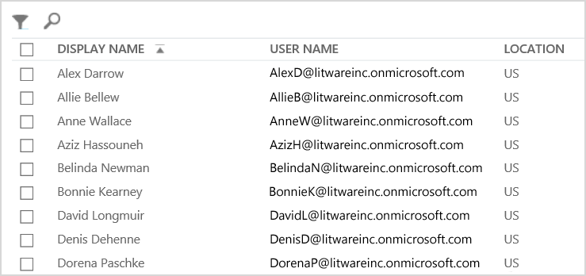

# <a name="why-you-need-to-use-office-365-powershell"></a><span data-ttu-id="e002a-103">Perché è necessario usare PowerShell di Office 365</span><span class="sxs-lookup"><span data-stu-id="e002a-103">Why you need to use Office 365 PowerShell</span></span>

 <span data-ttu-id="e002a-104">**Sintesi:** comprendere il motivo per cui è necessario utilizzare PowerShell di Office 365 per gestire Office 365, in alcuni casi in modo più efficiente e in altri casi per necessità.</span><span class="sxs-lookup"><span data-stu-id="e002a-104">**Summary:** Understand why you must use Office 365 PowerShell to manage Office 365, in some cases more efficiently and in other cases by necessity.</span></span>
  
<span data-ttu-id="e002a-p101">Con interfaccia di amministrazione di Office 365, è possibile gestire non solo gli account utente e le licenze di Office 365, ma anche i prodotti server di Office 365: Exchange, Skype for Business online e SharePoint Online. Tuttavia, questi elementi possono essere gestiti anche con i comandi PowerShell di PowerShell di Office 365, sfruttando un ambiente con riga di comando e linguaggio di scripting per velocità, automazione e funzionalità aggiuntive.</span><span class="sxs-lookup"><span data-stu-id="e002a-p101">With the Office 365 admin center, you can not only manage your Office 365 user accounts and licenses, but you can also manage your Office 365 server products: Exchange, Skype for Business Online, and SharePoint Online. However, you can also manage these elements with Office 365 PowerShell commands, taking advantage of a command-line and scripting language environment for speed, automation, and additional capability.</span></span>
  
<span data-ttu-id="e002a-107">In questo articolo verranno illustrati i modi in cui è possibile utilizzare PowerShell di Office 365 per gestire Office 365.</span><span class="sxs-lookup"><span data-stu-id="e002a-107">In this article, we'll show you these ways in which you can use Office 365 PowerShell to manage Office 365.</span></span>
  
- <span data-ttu-id="e002a-108">PowerShell di Office 365 può rivelare informazioni aggiuntive che non sono visibili con interfaccia di amministrazione di Office 365</span><span class="sxs-lookup"><span data-stu-id="e002a-108">Office 365 PowerShell can reveal additional information that you cannot see with the Office 365 admin center</span></span>
    
- <span data-ttu-id="e002a-109">Office 365 presenta funzionalità che è possibile configurare solo mediante PowerShell di Office 365</span><span class="sxs-lookup"><span data-stu-id="e002a-109">Office 365 has features that you can only configure by using Office 365 PowerShell</span></span>
    
- <span data-ttu-id="e002a-110">PowerShell di Office 365 è ideale per l'esecuzione di operazioni di massa</span><span class="sxs-lookup"><span data-stu-id="e002a-110">Office 365 PowerShell is great at performing bulk operations</span></span>
    
- <span data-ttu-id="e002a-111">PowerShell di Office 365 è molto utile per il filtro dei dati</span><span class="sxs-lookup"><span data-stu-id="e002a-111">Office 365 PowerShell is great at filtering data</span></span>
    
- <span data-ttu-id="e002a-112">PowerShell di Office 365 facilita la stampa e il salvataggio dei dati</span><span class="sxs-lookup"><span data-stu-id="e002a-112">Office 365 PowerShell makes it easy to print or save data</span></span>
    
- <span data-ttu-id="e002a-113">PowerShell di Office 365 consente di gestire diversi prodotti server</span><span class="sxs-lookup"><span data-stu-id="e002a-113">Office 365 PowerShell lets you manage across server products</span></span>
    
<span data-ttu-id="e002a-p102">Prima di iniziare, comprendere che PowerShell di Office 365 è un insieme di moduli per Windows PowerShell, un ambiente con riga di comando per i servizi e le piattaforme basati su Windows. Questo ambiente crea un linguaggio della shell dei comandi che è possibile estendere con moduli aggiuntivi e offre un modo per eseguire comandi o script semplici o complessi. Ad esempio, dopo l'installazione dei moduli di PowerShell di Office 365 e la connessione alla sottoscrizione di Office 365, è possibile eseguire questo comando per visualizzare l'elenco di tutte le cassette postali utente per Microsoft Exchange Online:</span><span class="sxs-lookup"><span data-stu-id="e002a-p102">Before you begin, understand that Office 365 PowerShell is a set of modules for Windows PowerShell, a command-line environment for Windows-based services and platforms. This environment creates a command shell language that can be extended with additional modules and provides a way to execute simple or complex commands or scripts For example, after you install the Office 365 PowerShell modules and connect to your Office 365 subscription, you can run this command to list all of the user mailboxes for Microsoft Exchange Online:</span></span>
  
```
Get-Mailbox
```

<span data-ttu-id="e002a-116">È inoltre possibile eseguire il comando per calcolare il numero di elementi in tutti gli elenchi per tutti i siti per tutte le app Web in SharePoint Online:</span><span class="sxs-lookup"><span data-stu-id="e002a-116">You can also run this command to calculate the number of items in all of the lists for all of the sites for all of your web apps in SharePoint Online:</span></span>
  
```
Get-SPOSite -Limit All | Get-SPWeb -Limit All | % {$_.Lists} | ? {$_ -is [Microsoft.SharePoint.SPDocumentLibrary]} | % {$total+= $_.ItemCount}; $total
```

<span data-ttu-id="e002a-117">L'elenco delle cassette postali può essere ottenuto anche tramite interfaccia di amministrazione di Office 365. Tuttavia, non è possibile eseguire con facilità il conteggio del numero di elementi in tutti gli elenchi per tutti i siti per tutte le app Web.</span><span class="sxs-lookup"><span data-stu-id="e002a-117">Getting the list of mailboxes can also be easily done using the Office 365 admin center, but counting the number of items in all of the lists for all of the sites for all of your web apps cannot be easily done.</span></span>
  
<span data-ttu-id="e002a-p103">Tenere presente che PowerShell di Office 365 è progettato per aumentare e migliorare la possibilità di gestire Office 365, non per sostituire interfaccia di amministrazione di Office 365. In qualità di amministratore di Office 365, è necessario almeno acquisire familiarità con PowerShell di Office 365 poiché esistono alcune procedure di configurazione che possono essere eseguite solo con i comandi di PowerShell di Office 365. In questi casi, verrà richiesto di conoscere le procedure per effettuare le seguenti operazioni:</span><span class="sxs-lookup"><span data-stu-id="e002a-p103">Please note that Office 365 PowerShell is designed to augment and enhance your ability to manage Office 365, not to replace the Office 365 admin center. As an Office 365 administrator, you must become at least comfortable with using Office 365 PowerShell because there are some configuration procedures that can only be done with Office 365 PowerShell commands. In these cases, you will be required to understand how to:</span></span>
  
- <span data-ttu-id="e002a-121">Installare i moduli di PowerShell di Office 365 (operazione eseguita solo una volta per ogni computer di amministratore).</span><span class="sxs-lookup"><span data-stu-id="e002a-121">Install the Office 365 PowerShell modules (done only once for each administrator computer).</span></span>
    
- <span data-ttu-id="e002a-122">Connettersi alla sottoscrizione di Office 365 (operazione eseguita una sola volta per ogni sessione di PowerShell).</span><span class="sxs-lookup"><span data-stu-id="e002a-122">Connect to your Office 365 subscription (done once for each PowerShell session).</span></span>
    
- <span data-ttu-id="e002a-123">Raccogliere le informazioni necessarie per eseguire i comandi di PowerShell di Office 365 necessari.</span><span class="sxs-lookup"><span data-stu-id="e002a-123">Gather the information needed to run the required Office 365 PowerShell commands.</span></span>
    
- <span data-ttu-id="e002a-124">Eseguire correttamente i comandi di PowerShell di Office 365.</span><span class="sxs-lookup"><span data-stu-id="e002a-124">Run the Office 365 PowerShell commands successfully.</span></span>
    
<span data-ttu-id="e002a-p104">Dopo aver appreso le competenze di base, non è necessario elencare gli utenti delle cassette postali con il comando **Get-Mailbox**, né saper creare un nuovo comando simile a quello precedente per contare tutti gli elementi in tutti gli elenchi di tutti i siti per tutte le app Web. Microsoft e la community degli amministratori di Office 365 possono offrire supporto per questa operazione.</span><span class="sxs-lookup"><span data-stu-id="e002a-p104">After learning these basic skills, you are not required to list your mailbox users with **Get-Mailbox** command, nor are you required to understand how to create a new command like the previous one to count all the items in all the lists for all of the sites for all of your web apps. Microsoft and the community of Office 365 administrators can help you with that as needed.</span></span>
  
## <a name="office-365-powershell-can-reveal-additional-information-that-you-cannot-see-with-the-office-365-admin-center"></a><span data-ttu-id="e002a-127">PowerShell di Office 365 può rivelare informazioni aggiuntive che non sono visibili con l'interfaccia di amministrazione di Office 365</span><span class="sxs-lookup"><span data-stu-id="e002a-127">Office 365 PowerShell can reveal additional information that you cannot see with the Office 365 admin center</span></span>
<span data-ttu-id="e002a-128"><a name="reveal"> </a></span><span class="sxs-lookup"><span data-stu-id="e002a-128"><a name="reveal"> </a></span></span>

<span data-ttu-id="e002a-p105">interfaccia di amministrazione di Office 365 rende disponibili molte informazioni utili, ma ciò non significa che siano visualizzate tutte le informazioni su utenti, licenze, cassette postali e siti memorizzate in Office 365. Ecco un esempio per **utenti e gruppi** nell'interfaccia di amministrazione di Office 365:</span><span class="sxs-lookup"><span data-stu-id="e002a-p105">The Office 365 admin center displays a lot of useful information, but that doesn't mean that it displays all the possible information that Office 365 stores on users, licenses, mailboxes, and sites. Here is an example for **users and groups** in the Office 365 admin center:</span></span>
  

  
<span data-ttu-id="e002a-p106">Per diversi scopi, verranno visualizzate le informazioni necessarie. Tuttavia, in alcuni casi sono necessarie informazioni aggiuntive. Ad esempio, la licenza di Office 365 (nonché le funzionalità di Office 365 disponibili per un utente) dipende in parte dalla posizione geografica dell'utente. I criteri e le funzionalità che è possibile estendere a un utente che vive negli Stati Uniti potrebbero non essere gli stessi per un utente che risiede in India o Belgio. È possibile utilizzare interfaccia di amministrazione di Office 365 per determinare la posizione geografica dell'utente attenendosi alla seguente procedura:</span><span class="sxs-lookup"><span data-stu-id="e002a-p106">For many purposes, this displays the information you need to know. However, there are times when you need more. For example, Office 365 licensing (as well as the Office 365 features available to a user) depend in part on that user's geographic location. The policies and features you can extend to a user who lives in the United States might not be the same as the policies and features you can extend to a user who lives in India or in Belgium. You can use the Office 365 admin center to determine a user's geographic location with these steps:</span></span>
  
1. <span data-ttu-id="e002a-137">Fare doppio clic sul **Nome visualizzato** dell'utente.</span><span class="sxs-lookup"><span data-stu-id="e002a-137">Double-click the user's **Display Name**.</span></span>
    
2. <span data-ttu-id="e002a-138">Nelle proprietà del riquadro di visualizzazione dell'utente, fare clic su **Dettagli**.</span><span class="sxs-lookup"><span data-stu-id="e002a-138">In the user properties display pane, click **details**.</span></span>
    
3. <span data-ttu-id="e002a-139">Nella visualizzazione dettagli, fare clic su **ulteriori dettagli**.</span><span class="sxs-lookup"><span data-stu-id="e002a-139">In the details display, click **additional details**.</span></span>
    
4. <span data-ttu-id="e002a-140">Scorrere verso il basso fino a quando non viene visualizzata l'intestazione **Paese o regione**:</span><span class="sxs-lookup"><span data-stu-id="e002a-140">Scroll down until you see the heading **Country or region**:</span></span>
    
     
  
5. <span data-ttu-id="e002a-142">Prendere nota del nome visualizzato e della posizione dell'utente su un pezzo di carta o copiarlo e incollarlo nel Blocco note.</span><span class="sxs-lookup"><span data-stu-id="e002a-142">Write the user's display name and location on a piece of paper, or copy and paste it into Notepad.</span></span> 
    
<span data-ttu-id="e002a-p107">È necessario ripetere questa procedura per ogni utente. Per molti utenti, potrebbe trattarsi di un'attività noiosa. Con PowerShell di Office 365, è possibile visualizzare queste informazioni per tutti gli utenti con il seguente comando:</span><span class="sxs-lookup"><span data-stu-id="e002a-p107">You must repeat this procedure for each user. For many users, this can be a tedious task. With Office 365 PowerShell, you can display this information for all of your users with the following command:</span></span>
  
```
Get-MsolUser | Select DisplayName, UsageLocation
```

> [!NOTE]
> <span data-ttu-id="e002a-146">Questo comando richiede l'installazione del [modulo di Windows Azure Active Directory](https://technet.microsoft.com/it-IT/library/jj151815.aspx).</span><span class="sxs-lookup"><span data-stu-id="e002a-146">This command requires you to install the [Windows Azure Active Directory module](https://technet.microsoft.com/it-IT/library/jj151815.aspx).</span></span> 
  
<span data-ttu-id="e002a-147">Ecco un esempio di visualizzazione:</span><span class="sxs-lookup"><span data-stu-id="e002a-147">Here is an example of the display:</span></span>
  
```
DisplayName                               UsageLocation
-----------                               -------------
Zrinka Makovac                            US
Bonnie Kearney                            GB
Fabrice Canel                             BR
Brian Johnson (TAILSPIN)                  US
Anne Wallace                              US
Alex Darrow                               US
David Longmuir                            BR
```

> [!TIP]
>  <span data-ttu-id="e002a-148">L'interpretazione di questo comando di PowerShell di Office 365 è: Recuperare tutti gli utenti nella sottoscrizione di Office 365 corrente ( **Get-MsolUser** ), ma visualizzare solo il nome e la posizione di ogni utente ( **Select DisplayName, UsageLocation** ).</span><span class="sxs-lookup"><span data-stu-id="e002a-148">The interpretation of this Office 365 PowerShell command is: Get all of the users in the current Office 365 subscription ( **Get-MsolUser** ), but only display the name and location for each user ( **Select DisplayName, UsageLocation** ).</span></span>
  
<span data-ttu-id="e002a-p108">Poiché PowerShell di Office 365 supporta un linguaggio della shell dei comandi, è possibile modificare ulteriormente le informazioni ottenute dal comando **Get-MSolUser**. Ad esempio, se si desidera ordinare tali utenti per posizione, è possibile raggruppare tutti gli utenti brasiliani, tutti gli utenti degli Stati Uniti e così via. Ecco il comando:</span><span class="sxs-lookup"><span data-stu-id="e002a-p108">Because Office 365 PowerShell supports a command shell language, you can further manipulate the information obtained from the **Get-MSolUser** command. For example, maybe you'd like to sort these users by their location, grouping all the Brazilian users together, all the United States users together, etc. Here is the command:</span></span>
  
```
Get-MsolUser | Select DisplayName, UsageLocation | Sort UsageLocation, DisplayName
```

<span data-ttu-id="e002a-151">Ecco un esempio di visualizzazione:</span><span class="sxs-lookup"><span data-stu-id="e002a-151">Here is an example of the display:</span></span>
  
```
DisplayName                                 UsageLocation
-----------                                 -------------
David Longmuir                              BR
Fabrice Canel                               BR
Bonnie Kearney                              GB
Alex Darrow                                 US
Anne Wallace                                US
Brian Johnson (TAILSPIN)                    US
Zrinka Makovac                              US
```

> [!TIP]
>  <span data-ttu-id="e002a-152">L'interpretazione di questo comando di PowerShell di Office 365 è: Recuperare tutti gli utenti nella sottoscrizione di Office 365 corrente, ma visualizzare solo il nome e il percorso per ciascun utente, e ordinarli prima in base alla posizione, quindi in base ai nomi ( **Sort UsageLocation, DisplayName** ).</span><span class="sxs-lookup"><span data-stu-id="e002a-152">The interpretation of this Office 365 PowerShell command is: Get all of the users in the current Office 365 subscription, but only display the name and location for each user and sort them first by their location, and then their names ( **Sort UsageLocation, DisplayName** ).</span></span>
  
<span data-ttu-id="e002a-p109">È inoltre possibile utilizzare altre opzioni di filtro. Ad esempio, se si desidera visualizzare tali informazioni sugli utenti residenti in Brasile, utilizzare questo comando:</span><span class="sxs-lookup"><span data-stu-id="e002a-p109">You can also employ additional filtering. For example, if you only want to see information about users based in Brazil, use this command:</span></span>
  
```
Get-MsolUser | Where {$_.UsageLocation -eq "BR"} | Select DisplayName, UsageLocation 
```

<span data-ttu-id="e002a-155">Ecco un esempio di visualizzazione:</span><span class="sxs-lookup"><span data-stu-id="e002a-155">Here is an example of the display:</span></span>
  
```
DisplayName                                           UsageLocation
-----------                                           -------------
David Longmuir                                        BR
Fabrice Canel                                         BR
```

> [!TIP]
>  <span data-ttu-id="e002a-156">L'interpretazione di questo comando di PowerShell di Office 365 è: Recuperare tutti gli utenti nella sottoscrizione di Office 365 corrente la cui posizione è il Brasile ( **Where {$\_.UsageLocation -eq "BR"}** ), quindi visualizzare posizione e nome di ogni utente.</span><span class="sxs-lookup"><span data-stu-id="e002a-156">The interpretation of this Office 365 PowerShell command is: Get all of the users in the current Office 365 subscription whose location is Brazil ( **Where {$\_.UsageLocation -eq "BR"}** ), then display the name and location for each user.</span></span>
  
 <span data-ttu-id="e002a-157">**Nota rapida riguardo i domini più grandi**</span><span class="sxs-lookup"><span data-stu-id="e002a-157">**A Quick Note Regarding Larger Domains**</span></span>
  
<span data-ttu-id="e002a-p110">Se si dispone di un dominio di grandi dimensioni, con decine di migliaia di utenti, alcuni degli esempi mostrati in questo articolo potrebbero causare una "limitazione". Ciò significa che, in base a dati come la potenza di elaborazione e lunghezza di banda disponibile, si sta cercando di effettuare troppe operazioni contemporaneamente. Per questo, le organizzazioni più grandi potrebbero desiderare di dividere alcuni comandi di PowerShell di Office 365 in due. Ad esempio, questo comando restituisce tutti gli account utente e mostra il nome e la posizione di ciascun utente:</span><span class="sxs-lookup"><span data-stu-id="e002a-p110">If you have a very large domain with tens of thousands of users, trying some of the examples we show in this article could lead to "throttling." That means that, based on things like computing power and available network bandwidth, you're trying to do a little too much at one time. Because of that, larger organizations might want to split some of these Office 365 PowerShell commands into two commands. For example, this one command returns all the user accounts and shows the name and location for each:</span></span>
  
```
Get-MsolUser | Select DisplayName, UsageLocation
```

<span data-ttu-id="e002a-p111">Questa operazione funziona perfettamente per i domini più piccoli. Nelle organizzazioni di grandi dimensioni, tuttavia, potrebbe essere necessario dividerlo in due comandi: un comando per archiviare le informazioni sugli account utente in una variabile, l'altro per visualizzare le informazioni necessarie. Ecco un esempio:</span><span class="sxs-lookup"><span data-stu-id="e002a-p111">That works great for smaller domains. In a large organization, however, you might need to split that into two commands: one command to store the user account information in a variable and another command to display the needed information. Here is an example:</span></span>
  
```
$x = Get-MsolUser
$x | Select DisplayName, UsageLocation
```


<span data-ttu-id="e002a-165">L'interpretazione di questo set di comandi PowerShell di Office 365 è:</span><span class="sxs-lookup"><span data-stu-id="e002a-165">The interpretation of this set of Office 365 PowerShell commands is:</span></span>
- <span data-ttu-id="e002a-166">Recuperare tutti gli utenti nella sottoscrizione di Office 365 corrente e archiviare le informazioni in una variabile denominata $x ( **$x = Get-MsolUser** ).</span><span class="sxs-lookup"><span data-stu-id="e002a-166">Get all of the users in the current Office 365 subscription and store the information in a variable named $x ( **$x = Get-MsolUser** ).</span></span>
- <span data-ttu-id="e002a-167">Visualizzare il contenuto della variabile $x, ma includere solo il nome e la posizione di ciascun utente ( **$x | Select DisplayName, UsageLocation** ).</span><span class="sxs-lookup"><span data-stu-id="e002a-167">Display the contents of the variable $x, but only include the name and location for each user ( **$x | Select DisplayName, UsageLocation** ).</span></span>
  
## <a name="office-365-has-features-that-you-can-only-configure-with-office-365-powershell"></a><span data-ttu-id="e002a-168">Office 365 presenta funzionalità che è possibile configurare solo con PowerShell di Office 365</span><span class="sxs-lookup"><span data-stu-id="e002a-168">Office 365 has features that you can only configure with Office 365 PowerShell</span></span>
<span data-ttu-id="e002a-169"><a name="only"> </a></span><span class="sxs-lookup"><span data-stu-id="e002a-169"><a name="only"> </a></span></span>

<span data-ttu-id="e002a-p112">interfaccia di amministrazione di Office 365 è stata concepita come strumento per accedere alle attività amministrative più comuni e utili. In altri termini, interfaccia di amministrazione di Office 365 è stata progettata in modo che l'amministratore tipico possa utilizzarla come strumento per portare a termine la maggior parte delle attività di gestione comuni. In base a questa definizione, alcune attività non possono essere completate mediante interfaccia di amministrazione di Office 365.</span><span class="sxs-lookup"><span data-stu-id="e002a-p112">The Office 365 admin center is intended to provide access to the most common or meaningful administrative tasks that apply to most people. In other words, the Office 365 admin center was designed so that the typical administrator could use the tool to carry out the most common management tasks. By this definition, that means that there are some tasks that can't be completed by using the Office 365 admin center.</span></span>
  
<span data-ttu-id="e002a-173">Ad esempio, l'interfaccia di amministrazione di Skype for Business online offre alcune opzioni per la creazione di convocazioni di riunioni personalizzate:</span><span class="sxs-lookup"><span data-stu-id="e002a-173">For example, the Skype for Business Online Admin center provides a few options for creating custom meeting invitations:</span></span>
  

  
<span data-ttu-id="e002a-p113">Con queste impostazioni, è possibile aggiungere un tocco di personalizzazione e professionalità alle convocazioni di riunioni. Tuttavia, esistono più impostazioni di configurazione di una riunione rispetto alla semplice creazione di convocazioni personalizzate. Ad esempio, per impostazione predefinita le riunioni consentono:</span><span class="sxs-lookup"><span data-stu-id="e002a-p113">With these settings, you can add a touch of personalization and professionalism to meeting invitations. However, there's more to meeting configuration settings than simply creating custom meeting invitations. For example, by default, meetings allow:</span></span>
  
- <span data-ttu-id="e002a-178">A utenti anonimi di ottenere l'ingresso automatico a ogni riunione.</span><span class="sxs-lookup"><span data-stu-id="e002a-178">Anonymous users to gain automatic entrance to each meeting.</span></span>
    
- <span data-ttu-id="e002a-179">Ai partecipanti di registrare una riunione.</span><span class="sxs-lookup"><span data-stu-id="e002a-179">Attendees to record the meeting.</span></span>
    
- <span data-ttu-id="e002a-180">A tutti gli utenti dell'organizzazione di essere designati come relatori quando partecipano a riunione.</span><span class="sxs-lookup"><span data-stu-id="e002a-180">All users from your organization to be designated as presenters when they join the meeting.</span></span>
    
<span data-ttu-id="e002a-p114">Queste impostazioni non sono disponibili dall'interfaccia di amministrazione di Skype for Business online. Tuttavia, è possibile controllarle da PowerShell di Office 365. Ecco un comando che consente di disabilitare queste tre impostazioni:</span><span class="sxs-lookup"><span data-stu-id="e002a-p114">These settings are not available from the Skype for Business Online Admin center. However, you can control them from Office 365 PowerShell. Here is a command that disables these three settings:</span></span>
  
```
Set-CsMeetingConfiguration -AdmitAnonymousUsersByDefault $False -AllowConferenceRecording $False -DesignateAsPresenter "None"
```

> [!NOTE]
> <span data-ttu-id="e002a-184">Questo comando richiede l'installazione del [modulo di PowerShell per Skype for Business Online ](https://www.microsoft.com/download/details.aspx?id=39366).</span><span class="sxs-lookup"><span data-stu-id="e002a-184">This command requires that you install the [Skype for Business Online PowerShell Module ](https://www.microsoft.com/download/details.aspx?id=39366).</span></span> 
  
> [!TIP]
>  <span data-ttu-id="e002a-185">L'interpretazione di questo comando di PowerShell di Office 365 è: Per le impostazioni per le nuove riunioni di Skype for Business online ( **Set-CsMeetingConfiguration** ), disabilitare l'autorizzazione per gli utenti anonimi a ottenere l'accesso automatico alle riunioni ( **- AdmitAnonymousUsersByDefault $False** ), disattivare la possibilità per i partecipanti di registrare le riunioni ( **- AllowConferenceRecording $False** ) e non designare tutti gli utenti dell'organizzazione come relatori ( **-DesignateAsPresenter "None"** ).</span><span class="sxs-lookup"><span data-stu-id="e002a-185">The interpretation of this Office 365 PowerShell command is: For the settings for new Skype for Business Online meetings ( **Set-CsMeetingConfiguration** ), disable allowing anonymous users to gain automatic entrance to meetings ( **-AdmitAnonymousUsersByDefault $False** ), disable the ability for attendees to record meetings ( **-AllowConferenceRecording $False** ), and do not designate all users from your organization as presenters ( **-DesignateAsPresenter "None"** ).</span></span>
  
<span data-ttu-id="e002a-186">Se si cambia idea e si desidera ripristinare le impostazioni predefinite (tutte abilitate), sarà sufficiente eseguire questo comando:</span><span class="sxs-lookup"><span data-stu-id="e002a-186">If you change your mind and want to restore these default settings (all of them enabled), run this command:</span></span>
  
```
Set-CsMeetingConfiguration -AdmitAnonymousUsersByDefault $True -AllowConferenceRecording $True -DesignateAsPresenter "Company"
```

<span data-ttu-id="e002a-p115">Questo è solo un esempio. Ne esistono altri, per questo motivo l'amministratore di Office 365 deve avere una certa familiarità con l'esecuzione dei comandi di PowerShell di Office 365.</span><span class="sxs-lookup"><span data-stu-id="e002a-p115">This is just one example. There are others, which is why you, as an Office 365 administrator, need to be comfortable with running Office 365 PowerShell commands.</span></span>
  
## <a name="office-365-powershell-is-great-at-carrying-out-bulk-operations"></a><span data-ttu-id="e002a-189">PowerShell di Office 365 è ottimale per eseguire operazioni in massa</span><span class="sxs-lookup"><span data-stu-id="e002a-189">Office 365 PowerShell is great at carrying out bulk operations</span></span>
<span data-ttu-id="e002a-190"><a name="bulk"> </a></span><span class="sxs-lookup"><span data-stu-id="e002a-190"><a name="bulk"> </a></span></span>

<span data-ttu-id="e002a-p116">Da sempre, interfacce visive come interfaccia di amministrazione di Office 365 risultano particolarmente utili quando l'operazione da eseguire è una sola. Ad esempio, se è necessario disattivare un account utente, è possibile utilizzare interfaccia di amministrazione di Office 365 per individuare rapidamente una casella di controllo e selezionarla. Questa operazione può risultare più semplice rispetto all'esecuzione di un'operazione simile in PowerShell di Office 365.</span><span class="sxs-lookup"><span data-stu-id="e002a-p116">Historically, visual interfaces like the Office 365 admin center are most valuable when you have a single operation to perform. For example, if you need to disable one user account, you can use the Office 365 admin center to quickly locate and clear a checkbox. This can be simpler than performing a similar operation in Office 365 PowerShell.</span></span>
  
<span data-ttu-id="e002a-p117">Tuttavia, se è necessario modificare molti aspetti o alcuni elementi selezionati all'interno di un insieme grande di altri elementi, interfaccia di amministrazione di Office 365 potrebbe non essere l'opzione più rapida. Ad esempio, se è necessario modificare il prefisso su migliaia di numeri di telefono o rimuovere un utente specifico, Ken Myer, da tutti i siti di SharePoint Online, come sarebbe possibile eseguire queste operazioni con interfaccia di amministrazione di Office 365?</span><span class="sxs-lookup"><span data-stu-id="e002a-p117">But if you have to change many things or some selected things within a large set of other things, the Office 365 admin center might not be the best use of your time. For example, if you had to change the prefix on thousands of phone numbers or you needed to remove a specific user, Ken Myer, from all of your SharePoint Online sites, how would you do that in the Office 365 admin center?</span></span>
  
<span data-ttu-id="e002a-p118">Per quanto riguarda l'ultimo esempio, sono presenti diverse centinaia di siti di SharePoint Online e non si sa nemmeno di quali di questi siti è membro Ken Meyer. Ciò significa che sarà necessario avviare interfaccia di amministrazione di Office 365 e quindi seguire questa procedura per ogni sito:</span><span class="sxs-lookup"><span data-stu-id="e002a-p118">For the latter example, you have several hundred SharePoint Online sites and you don't know even know which ones of which Ken Meyer is a member. That means you'll have to start at the Office 365 admin center and then perform this procedure for each site:</span></span>
  
1. <span data-ttu-id="e002a-198">Fare clic sull' **URL** del sito.</span><span class="sxs-lookup"><span data-stu-id="e002a-198">Click the **URL** of the site.</span></span>
    
2. <span data-ttu-id="e002a-199">Nella casella **proprietà della raccolta del sito**, fare clic sul link **Indirizzo sito Web** per aprire il sito.</span><span class="sxs-lookup"><span data-stu-id="e002a-199">In the **site collection properties** box, click the **Web Site Address** link to open the site.</span></span>
    
3. <span data-ttu-id="e002a-200">Nel sito, fare clic su **Condividi**.</span><span class="sxs-lookup"><span data-stu-id="e002a-200">On the site, click **Share**.</span></span>
    
4. <span data-ttu-id="e002a-201">Nella finestra di dialogo **Condividi** fare clic sul link che mostra tutti gli utenti che dispongono delle autorizzazioni per il sito:</span><span class="sxs-lookup"><span data-stu-id="e002a-201">In the **Share** dialog box click the link that shows you all the users who have permissions to the site:</span></span>
    
     
  
5. <span data-ttu-id="e002a-203">Nella finestra di dialogo **Condiviso con** fare clic su **Avanzate**.</span><span class="sxs-lookup"><span data-stu-id="e002a-203">In the **Shared With** dialog box, click **Advanced**.</span></span>
    
6. <span data-ttu-id="e002a-204">Scorrere l'elenco degli utenti, trovare e selezionare Ken Myer (presumendo che disponga delle autorizzazioni per il sito), quindi fare clic su **Rimuovi autorizzazioni utente**.</span><span class="sxs-lookup"><span data-stu-id="e002a-204">Scroll down the list of users, find and select Ken Myer (assuming he has permissions to the site), and then click **Remove User Permissions**.</span></span>
    
<span data-ttu-id="e002a-205">La procedura può richiedere molto tempo per diverse centinaia di siti.</span><span class="sxs-lookup"><span data-stu-id="e002a-205">This can take a long time for several hundred sites.</span></span>
  
<span data-ttu-id="e002a-206">L'alternativa consiste nell'usare PowerShell di Office 365 e il seguente comando per rimuovere Ken Myer da tutti i siti:</span><span class="sxs-lookup"><span data-stu-id="e002a-206">The alternative is to use Office 365 PowerShell and the following command to remove Ken Myer from all of your sites:</span></span>
  
```
Get-SPOSite | ForEach {Remove-SPOUser -Site $_.Url -LoginName "kenmyer@litwareinc.com"}
```

> [!NOTE]
> <span data-ttu-id="e002a-207">Questo comando richiede l'installazione di [ Connect per PowerShell di SharePoint Online](https://technet.microsoft.com/library/fp161372.aspx).</span><span class="sxs-lookup"><span data-stu-id="e002a-207">This command requires that you install the [Connect to SharePoint Online PowerShell](https://technet.microsoft.com/library/fp161372.aspx).</span></span> 
  
> [!TIP]
>  <span data-ttu-id="e002a-208">L'interpretazione di questo comando di PowerShell di Office 365 è: Recuperare tutti i siti di SharePoint nella sottoscrizione di Office 365 corrente ( **Get-SPOSite** ) e per ogni sito, rimuovere Ken Meyer dall'elenco di utenti che possono accedervi ( **ForEach {Remove-SPOUser -Site $\_.Url -LoginName "kenmyer@litwareinc.com"}** ).</span><span class="sxs-lookup"><span data-stu-id="e002a-208">The interpretation of this Office 365 PowerShell command is:  Get all of the SharePoint sites in the current Office 365 subscription ( **Get-SPOSite** ) and for each site, remove Ken Meyer from the list of users who can access it ( **ForEach {Remove-SPOUser -Site $\_.Url -LoginName "kenmyer@litwareinc.com"}** ).</span></span>
  
<span data-ttu-id="e002a-p119">Perché stiamo indicando a Office 365 di rimuovere Ken Meyer da tutti i siti, inclusi quelli a cui non può accedere, la visualizzazione di questo comando mostrerà degli errori per i siti per i quali al momento non dispone dell'accesso. È possibile utilizzare una condizione aggiuntiva su questo comando, per rimuovere Ken Meyer solo dai siti in cui compare nell'elenco degli accessi, ma gli errori elencati non danneggiano i siti. L'esecuzione di questo comando in centinaia di siti può richiedere alcuni minuti rispetto alle ore di lavoro necessarie utilizzando interfaccia di amministrazione di Office 365.</span><span class="sxs-lookup"><span data-stu-id="e002a-p119">Because we are telling Office 365 to remove Ken Meyer from every site, including those in which he does not have access, the display of this command will show errors for those sites in which he does not currently have access. We can use an additional condition on this command to remove Key Meyer only from the sites that have him in their login list, but the listed errors cause no harm to the sites themselves. This command might take a few minutes to run against hundreds of sites, rather than hours of working through the Office 365 admin center.</span></span>
  
<span data-ttu-id="e002a-p120">Ecco un altro esempio di operazione di massa. Utilizzare questo comando per aggiungere Bonnie Kearney, un nuovo amministratore di SharePoint, a tutti i siti dell'organizzazione:</span><span class="sxs-lookup"><span data-stu-id="e002a-p120">Here is another bulk operation example. Use this command to add Bonnie Kearney, a new SharePoint administrator, to all of the sites in the organization:</span></span>
  
```
Get-SPOSite | ForEach {Add-SPOUser -Site $_.Url -LoginName "bkearney@litwareinc.com" -Group "Members"}
```

> [!TIP]
>  <span data-ttu-id="e002a-214">L'interpretazione di questo comando di PowerShell di Office 365 è: Recuperare tutti i siti di SharePoint nella sottoscrizione di Office 365 corrente e, per ogni sito, consentire l'accesso a Bonnie Kearney aggiungendo il suo nome di accesso al gruppo Membri del sito ( **ForEach {Add-SPOUser -Site $\_.Url -LoginName "bkearney@litwareinc.com" -Group "Members"}** ).</span><span class="sxs-lookup"><span data-stu-id="e002a-214">The interpretation of this Office 365 PowerShell command is:  Get all of the SharePoint sites in the current Office 365 subscription and for each site, allow Bonnie Kearney access by adding her login name to the Members group of the site ( **ForEach {Add-SPOUser -Site $\_.Url -LoginName "bkearney@litwareinc.com" -Group "Members"}** ).</span></span>
  
## <a name="office-365-powershell-is-great-at-filtering-data"></a><span data-ttu-id="e002a-215">PowerShell di Office 365 è molto utile per il filtro dei dati</span><span class="sxs-lookup"><span data-stu-id="e002a-215">Office 365 PowerShell is great at filtering data</span></span>
<span data-ttu-id="e002a-216"><a name="filter"> </a></span><span class="sxs-lookup"><span data-stu-id="e002a-216"><a name="filter"> </a></span></span>

<span data-ttu-id="e002a-p121">interfaccia di amministrazione di Office 365 fornisce diversi modi per filtrare i dati e individuare in modo rapido e facile un sottoinsieme di informazioni di destinazione. Ad esempio, Exchange facilita il filtro di qualsiasi proprietà relativa alla cassetta postale di un utente. Ad esempio, questo è un elenco delle cassette postali degli utenti che vivono nella città di Bloomington:</span><span class="sxs-lookup"><span data-stu-id="e002a-p121">The Office 365 admin center provides several different ways to filter your data to quickly and easily locate a targeted subset of information. For example, Exchange makes it easy to filter on practically any property of a user mailbox. For example, here is the list of mailboxes for all the users who live in the city of Bloomington:</span></span>
  

  
<span data-ttu-id="e002a-p122">L'interfaccia di amministrazione di Exchange consente di combinare i criteri di filtro. Ad esempio, è possibile trovare le cassette postali di tutti i residenti di Bloomington e di coloro che lavorano nel reparto finanziario.</span><span class="sxs-lookup"><span data-stu-id="e002a-p122">The Exchange Admin center also lets you combine filter criteria. For example, you can find the mailboxes for all the people who live in Bloomington and who work in the Finance department.</span></span> 
  
<span data-ttu-id="e002a-p123">Tuttavia, esistono limitazioni per le operazioni che è possibile eseguire nell'interfaccia di amministrazione di Exchange. Ad esempio, si potrebbe desiderare di individuare le cassette postali di persone che vivono a Bloomington o San Diego oppure le cassette postali di tutte le persone non residenti a Bloomington.</span><span class="sxs-lookup"><span data-stu-id="e002a-p123">However, there are limitations to what you can do in the Exchange Admin center. For example, maybe you'd like to find the mailboxes of people who live in Bloomington or San Diego, or the mailboxes for all the people who don't live in Bloomington.</span></span> 
  
<span data-ttu-id="e002a-225">Con PowerShell di Office 365 è possibile ottenere un elenco delle cassette postali di tutte le persone che vivono nelle città di Bloomington o San Diego grazie a questo comando:</span><span class="sxs-lookup"><span data-stu-id="e002a-225">With Office 365 PowerShell, you can get a list of mailboxes for all the people who live in the cities of Bloomington or San Diego with this command:</span></span>
  
```
Get-User | Where {$_.RecipientTypeDetails -eq "UserMailbox" -and ($_.City -eq "San Diego" -or $_.City -eq "Bloomington")} | Select DisplayName, City
```

<span data-ttu-id="e002a-226">Ecco un esempio di visualizzazione:</span><span class="sxs-lookup"><span data-stu-id="e002a-226">Here is an example of the display:</span></span>
  
```
DisplayName                              City
-----------                              ----
Alex Darrow                              San Diego
Bonnie Kearney                           San Diego
Julian Isla                              Bloomington
Rob Young                                Bloomington
Zrinka Makovac                           San Diego
```

> [!TIP]
>  <span data-ttu-id="e002a-227">L'interpretazione di questo comando di PowerShell di Office 365 è: Recuperare tutti gli utenti nella sottoscrizione di Office 365 corrente che dispongono di una cassetta postale nelle città di San Diego o Bloomington ( **Where {$\_.RecipientTypeDetails -eq "UserMailbox" -and ($\_.City -eq "San Diego" -or $\_.City -eq "Bloomington")}** ), quindi visualizzare il nome e la città di ognuno ( **Select DisplayName, City** ).</span><span class="sxs-lookup"><span data-stu-id="e002a-227">The interpretation of this Office 365 PowerShell command is: Get all of the users in the current Office 365 subscription who have a mailbox in the cities of either San Diego or Bloomington ( **Where {$\_.RecipientTypeDetails -eq "UserMailbox" -and ($\_.City -eq "San Diego" -or $\_.City -eq "Bloomington")}** ), then display the name and city for each ( **Select DisplayName, City** ).</span></span>
  
<span data-ttu-id="e002a-228">Il comando di seguito consente di elencare tutte le cassette postali delle persone che vivono in qualsiasi altro posto a eccezione di Bloomington:</span><span class="sxs-lookup"><span data-stu-id="e002a-228">To list all the mailboxes for people who live anywhere except Bloomington, here is the command:</span></span>
  
```
Get-User | Where {$_.RecipientTypeDetails -eq "UserMailbox" -and $_.City -ne "Bloomington"} | Select DisplayName, City
```

<span data-ttu-id="e002a-229">Ecco un esempio di visualizzazione:</span><span class="sxs-lookup"><span data-stu-id="e002a-229">Here is an example of the display:</span></span>
  
```
DisplayName                               City
-----------                               ----
MOD Administrator                         Redmond
Alex Darrow                               San Diego
Allie Bellew                              Bellevue
Anne Wallace                              Louisville
Aziz Hassouneh                            Cairo
Belinda Newman                            Charlotte
Bonnie Kearney                            San Diego
David Longmuir                            Waukesha
Denis Dehenne                             Birmingham
Garret Vargas                             Seattle
Garth Fort                                Tulsa
Janet Schorr                              Bellevue
```

> [!TIP]
>  <span data-ttu-id="e002a-230">L'interpretazione di questo comando di PowerShell di Office 365 è: Recuperare tutti gli utenti nella sottoscrizione di Office 365 corrente che dispongono di una cassetta postale non ubicata a Bloomington ( **Where {$\_.RecipientTypeDetails -eq "UserMailbox" -and $\_.City -ne "Bloomington"}** ), quindi visualizzare il nome e la città di ognuno.</span><span class="sxs-lookup"><span data-stu-id="e002a-230">The interpretation of this Office 365 PowerShell command is: Get all of the users in the current Office 365 subscription who have a mailbox not located in the city of Bloomington ( **Where {$\_.RecipientTypeDetails -eq "UserMailbox" -and $\_.City -ne "Bloomington"}** ), then display the name and city for each.</span></span>
  
<span data-ttu-id="e002a-p124">È inoltre possibile utilizzare caratteri jolly nei filtri PowerShell di Office 365 per trovare una corrispondenza con parte di un nome. Ad esempio, si supponga di effettuare la ricerca di un account utente e di ricordare solo che il cognome potrebbe corrispondere ad Anderson o forse a Henderson oppure Jorgenson.</span><span class="sxs-lookup"><span data-stu-id="e002a-p124">You can also use wildcard characters in your Office 365 PowerShell filters to match part of a name. For example, suppose you're looking for a user account, and all you can remember is that their last name was Anderson, or maybe Henderson, or maybe it was Jorgenson.</span></span>
  
<span data-ttu-id="e002a-233">Nell'interfaccia di amministrazione di Office 365 è possibile tenere traccia di tale utente utilizzando uno strumento di ricerca ed effettuando tre tipi di ricerche differenti:</span><span class="sxs-lookup"><span data-stu-id="e002a-233">You could track down that user in the Office 365 admin center by using the search tool and carrying out three different searches:</span></span>
  
- <span data-ttu-id="e002a-234">Una per  *Anderson*</span><span class="sxs-lookup"><span data-stu-id="e002a-234">One for  *Anderson*</span></span> 
    
- <span data-ttu-id="e002a-235">Una per  *Henderson*</span><span class="sxs-lookup"><span data-stu-id="e002a-235">One for  *Henderson*</span></span> 
    
- <span data-ttu-id="e002a-236">Una per  *Jorgenson*</span><span class="sxs-lookup"><span data-stu-id="e002a-236">One for  *Jorgenson*</span></span> 
    
<span data-ttu-id="e002a-p125">Poiché tutti e tre questi nomi terminano in "son", è possibile indicare a PowerShell di Office 365 di visualizzare tutti gli utenti il cui nome termina con "son". Ecco il comando:</span><span class="sxs-lookup"><span data-stu-id="e002a-p125">Because all three of these names end in "son", you can tell Office 365 PowerShell to display all the users whose name ends in "son". Here is the command:</span></span>
  
```
Get-User -Filter '{LastName -like "*son"}'
```

> [!TIP]
>  <span data-ttu-id="e002a-p126">L'interpretazione di questo comando di PowerShell di Office 365 è: Recuperare tutti gli utenti nella sottoscrizione a Office 365 corrente, ma utilizzare un filtro che elenca solo gli utenti il cui cognome termina in "son"( **-Filter '{LastName -like "\*son"}'** ). \* rappresenta qualsiasi set di caratteri, vale a dire lettere, nel caso del cognome di un utente.</span><span class="sxs-lookup"><span data-stu-id="e002a-p126">The interpretation of this Office 365 PowerShell command is: Get all of the users in the current Office 365 subscription, but use a filter that only lists the users whose last names end in "son" ( **-Filter '{LastName -like "\*son"}'** ). The \* stands for any set of characters, which are letters in the case of the user's last name.</span></span>
  
## <a name="office-365-powershell-makes-it-easy-to-print-or-save-data"></a><span data-ttu-id="e002a-241">PowerShell di Office 365 facilita la stampa e il salvataggio dei dati</span><span class="sxs-lookup"><span data-stu-id="e002a-241">Office 365 PowerShell makes it easy to print or save data</span></span>
<span data-ttu-id="e002a-242"><a name="printsave"> </a></span><span class="sxs-lookup"><span data-stu-id="e002a-242"><a name="printsave"> </a></span></span>

<span data-ttu-id="e002a-p127">interfaccia di amministrazione di Office 365 consente di visualizzare elenchi di dati. Ecco un esempio dell'interfaccia di amministrazione di Skype for Business online che mostra un elenco di utenti che sono stati abilitati per Skype for Business online:</span><span class="sxs-lookup"><span data-stu-id="e002a-p127">The Office 365 admin center allows you to view lists of data. Here is an example of the Skype for Business Online Admin center displaying a list of users who have been enabled for Skype for Business Online:</span></span>
  

  
<span data-ttu-id="e002a-p128">Per salvare queste informazioni in un file, è necessario copiarle e incollarle in un documento o in Excel. In entrambi i casi, la copia potrebbe richiedere ulteriore formattazione. Inoltre, interfaccia di amministrazione di Office 365 non fornisce un modo per stampare direttamente l'elenco visualizzato.</span><span class="sxs-lookup"><span data-stu-id="e002a-p128">To save that information to a file, you must copy and paste it into a document or Excel. In either case, the copy might require additional formatting. Additionally, the Office 365 admin center does not provide a way to directly print the displayed list.</span></span>
  
<span data-ttu-id="e002a-p129">Fortunatamente, è possibile utilizzare PowerShell di Office 365 non solo per visualizzare l'elenco, ma anche per salvarlo in un file che può essere facilmente importato in Excel. Ecco un comando di esempio per salvare i dati utente di Skype for Business online in un file con valori delimitati da virgole (CSV), che può essere facilmente importato come tabella in un foglio di lavoro di Excel:</span><span class="sxs-lookup"><span data-stu-id="e002a-p129">Fortunately, you can use Office 365 PowerShell to not only display the list, but save it to a file that can be easily imported into Excel. Here is an example command to save Skype for Business Online user data to a comma-separated values (CSV) file, a file that can be easily imported as a table in an Excel worksheet:</span></span>
  
```
Get-CsOnlineUser | Select DisplayName, UserPrincipalName, UsageLocation | Export-Csv -Path "C:\\Logs\\SfBUsers.csv" -NoTypeInformation
```

<span data-ttu-id="e002a-251">Ecco un esempio di visualizzazione:</span><span class="sxs-lookup"><span data-stu-id="e002a-251">Here is an example of the display:</span></span>
  

  
> [!TIP]
>  <span data-ttu-id="e002a-253">L'interpretazione di questo comando di PowerShell di Office 365 è: Recuperare tutti gli utenti di Skype for Business online nella sottoscrizione di Office 365 corrente ( **Get-CsOnlineUser** ), ottenere solo il nome utente, l'UPN e la posizione ( **Select DisplayName, UserPrincipalName, UsageLocation** ), quindi salvare le informazioni nel file CSV denominato C:\\Logs\\SfBUsers.csv ( **Export-Csv -Path "C:\\Logs\\SfBUsers.csv" -NoTypeInformation** ).</span><span class="sxs-lookup"><span data-stu-id="e002a-253">The interpretation of this Office 365 PowerShell command is: Get all of the Skype for Business Online users in the current Office 365 subscription ( **Get-CsOnlineUser** ), obtain only the user name, UPN, and location ( **Select DisplayName, UserPrincipalName, UsageLocation** ), and then save that information in CSV file named C:\\Logs\\SfBUsers.csv ( **Export-Csv -Path "C:\\Logs\\SfBUsers.csv" -NoTypeInformation** ).</span></span>
  
<span data-ttu-id="e002a-p130">È anche possibile utilizzare le opzioni per salvare questo elenco come file XML o pagina HTML. Infatti, con altri comandi di PowerShell, è possibile salvarlo direttamente come file di Excel, con qualsiasi formattazione personalizzata che si desidera.</span><span class="sxs-lookup"><span data-stu-id="e002a-p130">You can also use options to save this list as an XML file or as an HTML page. In fact, with additional PowerShell commands, you could save it directly as an Excel file, with any custom formatting you desire.</span></span> 
  
<span data-ttu-id="e002a-p131">È anche possibile inviare l'output di un comando PowerShell di Office 365 che visualizza un elenco direttamente alla stampante predefinita in Windows. Ecco un esempio di comando:</span><span class="sxs-lookup"><span data-stu-id="e002a-p131">You can also send the output of an Office 365 PowerShell command that displays a list directly to the default printer in Windows. Here is an example command:</span></span>
  
```
Get-CsOnlineUser | Select DisplayName, UserPrincipalName, UsageLocation | Out-Printer
```

<span data-ttu-id="e002a-258">Di seguito, è riportato l'aspetto del documento stampato:</span><span class="sxs-lookup"><span data-stu-id="e002a-258">Here's what your printed document will look like:</span></span>
  

  
> [!TIP]
>  <span data-ttu-id="e002a-260">L'interpretazione di questo comando di PowerShell di Office 365 è: Recuperare tutti gli utenti di Skype for Business online nella sottoscrizione di Office 365 corrente, ottenere solo il nome utente, l'UPN e la posizione, e quindi inviare queste informazioni alla stampante predefinita di Windows ( **Out-Printer** ).</span><span class="sxs-lookup"><span data-stu-id="e002a-260">The interpretation of this Office 365 PowerShell command is:  Get all of the Skype for Business Online users in the current Office 365 subscription, obtain only the user name, UPN, and location, and then send that information to the default Windows printer ( **Out-Printer** ).</span></span>
  
<span data-ttu-id="e002a-261">Il documento stampato presenta la stessa formattazione semplice visualizzata all'interno della finestra del comando PowerShell di Office 365, ma dopo aver creato un comando PowerShell di Office 365 per elencare gli elementi necessari, è sufficiente aggiungere **| Out-Printer** alla fine del comando per ottenere una copia stampata su cui lavorare.</span><span class="sxs-lookup"><span data-stu-id="e002a-261">The printed document has the same simple formatting as the display within the Office 365 PowerShell command window, but once you have created an Office 365 PowerShell command to list what you need, you just add **| Out-Printer** to the end of the command to get a hard copy to work from.</span></span>
  
## <a name="office-365-powershell-lets-you-manage-across-server-products"></a><span data-ttu-id="e002a-262">PowerShell di Office 365 consente di gestire diversi prodotti server</span><span class="sxs-lookup"><span data-stu-id="e002a-262">Office 365 PowerShell lets you manage across server products</span></span>
<span data-ttu-id="e002a-263"><a name="printsave"> </a></span><span class="sxs-lookup"><span data-stu-id="e002a-263"><a name="printsave"> </a></span></span>

<span data-ttu-id="e002a-p132">I diversi componenti che costituiscono Office 365 sono progettati per collaborare. Si supponga, ad esempio, di aggiungere un nuovo utente a Office 365 e, dopo aver eseguito l'operazione, di specificare informazioni come il reparto e il numero di telefono dell'utente. Queste informazioni saranno quindi disponibili se si accede alle informazioni dell'utente usando uno dei prodotti server di Office 365: Skype for Business online, Exchange o SharePoint Online.</span><span class="sxs-lookup"><span data-stu-id="e002a-p132">The different components that make up Office 365 are designed to work together. For example, suppose you add a new user to Office 365 and, when you do, you specify such information as the user's department and phone number. That information will then be available if you access the user's information using any of the Office 365 server products: Skype for Business Online, Exchange, or SharePoint Online.</span></span>
  
<span data-ttu-id="e002a-p133">Si tratta di informazioni generali che interessano la famiglia di prodotti. Le informazioni specifiche di un prodotto, ad esempio quelle relative alla cassetta postale di Exchange di un utente, non sono generalmente disponibili tra le famiglie di prodotti. Ad esempio, se si desidera sapere se la cassetta postale di un utente è abilitata o meno, tale informazione è disponibile solo nell'interfaccia di amministrazione di Exchange.</span><span class="sxs-lookup"><span data-stu-id="e002a-p133">But that's for common information that spans the suite of products. Product-specific information-for example, information about a user's Exchange mailbox-is typically not available across the suite. For example, if you want to know if a user's mailbox is enabled or not, that information is available only in the Exchange Admin center.</span></span> 
  
<span data-ttu-id="e002a-270">Si supponga di voler creare un report che mostra le seguenti informazioni per tutti gli utenti:</span><span class="sxs-lookup"><span data-stu-id="e002a-270">Suppose you'd like to make a report that shows the following information for all your users:</span></span>
  
- <span data-ttu-id="e002a-271">Nome visualizzato dell'utente</span><span class="sxs-lookup"><span data-stu-id="e002a-271">The user's display name</span></span>
    
- <span data-ttu-id="e002a-272">La disponibilità della licenza per Office 365 dell'utente</span><span class="sxs-lookup"><span data-stu-id="e002a-272">Whether the user is licensed for Office 365</span></span>
    
- <span data-ttu-id="e002a-273">L'abilitazione della cassetta postale di Exchange dell'utente.</span><span class="sxs-lookup"><span data-stu-id="e002a-273">Whether the user's Exchange mailbox has been enabled</span></span>
    
- <span data-ttu-id="e002a-274">L'abilitazione per Skype for Business online dell'utente</span><span class="sxs-lookup"><span data-stu-id="e002a-274">Whether the user is enabled for Skype for Business Online</span></span>
    
<span data-ttu-id="e002a-p134">Attualmente, non è possibile utilizzare interfaccia di amministrazione di Office 365 per creare un report di questo tipo. Al contrario, è necessario creare un documento distinto per archiviare le informazioni, ad esempio un foglio di lavoro di Excel, e ottenere tutti i nomi utente e le informazioni sulle licenze da interfaccia di amministrazione di Office 365, ottenere le informazioni sulle cassette postali dall'interfaccia di amministrazione di Exchange, ottenere informazioni su Skype for Business online dall'interfaccia di amministrazione di Skype for Business online e quindi fascicolare e combinare tali informazioni.</span><span class="sxs-lookup"><span data-stu-id="e002a-p134">You currently cannot use the Office 365 admin center to easily produce such a report. Instead, you'll have to create a separate document to store the information, like an Excel worksheet, and get all the user names and licensing information from the Office 365 admin center, get mailbox information from the Exchange Admin center, get Skype for Business Online information from the Skype for Business Online Admin center, and then collate and combine that information.</span></span>
  
<span data-ttu-id="e002a-277">L'alternativa consiste nell'usare uno script di PowerShell di Office 365 che compili automaticamente questo report.</span><span class="sxs-lookup"><span data-stu-id="e002a-277">The alternative is to use an Office 365 PowerShell script to compile that report for you.</span></span>
  
<span data-ttu-id="e002a-p135">Il seguente script di esempio è più complesso dei comandi che finora sono stati illustrati in questo articolo. Tuttavia, mostra la possibilità di utilizzare PowerShell di Office 365 per creare visualizzazioni delle informazioni che sono molto difficili da creare in altri modi. Ecco lo script in grado di compilare e visualizzare l'elenco necessario:</span><span class="sxs-lookup"><span data-stu-id="e002a-p135">The following example script is more complicated than the commands you have seen so far in this article. But, it shows the potential of using Office 365 PowerShell to create views of information that are very difficult to do otherwise. Here is the script that can compile and display the needed list:</span></span>
  
```
$x = Get-MsolUser

foreach ($i in $x)
    {
      $y = Get-Mailbox -Identity $i.UserPrincipalName
      $i | Add-Member -MemberType NoteProperty -Name IsMailboxEnabled -Value $y.IsMailboxEnabled

      $y = Get-CsOnlineUser -Identity $i.UserPrincipalName
      $i | Add-Member -MemberType NoteProperty -Name EnabledForSfB -Value $y.Enabled
    }

$x | Select DisplayName, IsLicensed, IsMailboxEnabled, EnabledforSfB
```

<span data-ttu-id="e002a-281">Ecco un esempio di visualizzazione:</span><span class="sxs-lookup"><span data-stu-id="e002a-281">Here is an example of the display:</span></span>
  
```
DisplayName             IsLicensed   IsMailboxEnabled   EnabledForSfB
-----------             ----------   ----------------   --------------
Zrinka Makovac          True         True               True
Bonnie Kearney          True         True               True
Fabrice Canel           True         True               True
Brian Johnson           False        True               False
Anne Wallace            True         True               True
Alex Darrow             True         True               True
David Longmuir          True         True               True
Katy Jordan             False        True               False
Molly Dempsey           False        True               False
```

<span data-ttu-id="e002a-282">L'interpretazione di questo script di PowerShell di Office 365 è:</span><span class="sxs-lookup"><span data-stu-id="e002a-282">The interpretation of this Office 365 PowerShell script is:</span></span>  
- <span data-ttu-id="e002a-283">Recuperare tutti gli utenti nella sottoscrizione di Office 365 corrente e archiviare le informazioni in una variabile denominata $x ( **$x = Get-MsolUser** ).</span><span class="sxs-lookup"><span data-stu-id="e002a-283">Get all of the users in the current Office 365 subscription and store the information in a variable named $x ( **$x = Get-MsolUser** ).</span></span>
- <span data-ttu-id="e002a-284">Avviare un ciclo che viene eseguito su tutti gli utenti nella variabile denominata $x ( **foreach ($i in $x)** ).</span><span class="sxs-lookup"><span data-stu-id="e002a-284">Start a loop that runs over all the users in the variable named $x ( **foreach ($i in $x)** ).</span></span>  
- <span data-ttu-id="e002a-285">Definire una variabile denominata $y e archiviarvi all'interno le informazioni sulla cassetta postale dell'utente ( **$y = Get-Mailbox -Identity $i.UserPrincipalName** ).</span><span class="sxs-lookup"><span data-stu-id="e002a-285">Define a variable named $y and store the user's mailbox information in it ( **$y = Get-Mailbox -Identity $i.UserPrincipalName** ).</span></span>
- <span data-ttu-id="e002a-286">Aggiungere una nuova proprietà alle informazioni sull'utente denominata IsMailBoxEnabled e impostarla sul valore della proprietà IsMailBoxEnabled della cassetta postale dell'utente ( **$i | Add-Member -MemberType NoteProperty -Name IsMailboxEnabled -Value $y.IsMailboxEnabled** ).</span><span class="sxs-lookup"><span data-stu-id="e002a-286">Add a new property to the user information named IsMailBoxEnabled and set it to the value of the IsMailBoxEnabled property of the user's mailbox ( **$i | Add-Member -MemberType NoteProperty -Name IsMailboxEnabled -Value $y.IsMailboxEnabled** ).</span></span>
- <span data-ttu-id="e002a-287">Definire una variabile denominata $y e archiviarvi all'interno le informazioni su Skype for Business Online relative all'utente ( **$y = Get-CsOnlineUser -Identity $i.UserPrincipalName** ).</span><span class="sxs-lookup"><span data-stu-id="e002a-287">Define a variable named $y and store the user's Skype for Business Online information in it ( **$y = Get-CsOnlineUser -Identity $i.UserPrincipalName** ).</span></span>
- <span data-ttu-id="e002a-288">Aggiungere una nuova proprietà alle informazioni sull'utente denominata EnabledForSfB e impostarla sul valore della proprietà EnabledForSfB della cassetta postale dell'utente di Skype for Business Online ( **$i | Add-Member -MemberType NoteProperty -Name EnabledForSfB -Value $y.Enabled** ).</span><span class="sxs-lookup"><span data-stu-id="e002a-288">Add a new property to the user information named EnabledForSfB and set it to the value of the Enabled property of the user's Skype for Business Online information ( **$i | Add-Member -MemberType NoteProperty -Name EnabledForSfB -Value $y.Enabled** ).</span></span>
- <span data-ttu-id="e002a-289">Visualizzare l'elenco di utenti, ma includere solo il nome, se dispongono di una licenza e le due nuove proprietà che indicano se la loro cassetta postale è abilitata e se loro sono abilitati per Skype for Business Online ( **$x | Select DisplayName, IsLicensed, IsMailboxEnabled, EnabledforSfB** ).</span><span class="sxs-lookup"><span data-stu-id="e002a-289">Display the list of users, but include only their name, whether they are licensed, and the two new properties that indicate whether their mailbox is enabled and whether they are enabled for Skype for Business Online ( **$x | Select DisplayName, IsLicensed, IsMailboxEnabled, EnabledforSfB** ).</span></span>
  
## <a name="see-also"></a><span data-ttu-id="e002a-290">Vedere anche</span><span class="sxs-lookup"><span data-stu-id="e002a-290">See also</span></span>


#### 

[<span data-ttu-id="e002a-291">Guida introduttiva a PowerShell di Office 365</span><span class="sxs-lookup"><span data-stu-id="e002a-291">Getting started with Office 365 PowerShell</span></span>](getting-started-with-office-365-powershell.md)
  
[<span data-ttu-id="e002a-292">Gestire gli account utente e le licenze con Office 365 PowerShell</span><span class="sxs-lookup"><span data-stu-id="e002a-292">Manage user accounts and licenses with Office 365 PowerShell</span></span>](manage-user-accounts-and-licenses-with-office-365-powershell.md)
  
[<span data-ttu-id="e002a-293">Utilizzo di Windows PowerShell per creare rapporti in Office 365</span><span class="sxs-lookup"><span data-stu-id="e002a-293">Use Windows PowerShell to create reports in Office 365</span></span>](use-windows-powershell-to-create-reports-in-office-365.md)

