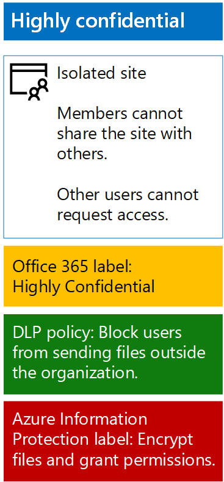

# Proteggere i file di SharePoint Online con Azure Information Protection

 **Riepilogo:** Applicare la protezione delle informazioni di Azure per proteggere i file in un sito del team di SharePoint Online di livello estremamente riservato.
  
Usare i passaggi descritti in questo articolo per configurare la protezione delle informazioni di Azure per fornire la crittografia e le autorizzazioni per i file in un sito del team di SharePoint Online di livello estremamente riservato. La crittografia e la protezione delle autorizzazioni viaggia con un file anche quando questo viene scaricato dal sito. Per ulteriori informazioni sui siti del team di SharePoint Online di livello estremamente riservato, vedere [Protezione di file e siti di SharePoint Online](secure-sharepoint-online-sites-and-files.md).
  
> [!NOTE]
> Quando la crittografia di Azure Information Protection viene applicata ai file di Office 365, il servizio non può elaborare il contenuto di tali file. Creazione condivisa, eDiscovery, ricerca, Delve e altre funzionalità di collaborazione non funzionano. I criteri di prevenzione della perdita dei dati (DLP) possono funzionare solo con i metadati (comprese le etichette di Office 365), ma non con i contenuti di tali file (ad esempio i numeri di carta di credito all'interno dei file). 
  
Innanzitutto, attenersi alle istruzioni in [Attivare Azure RMS con l'interfaccia di amministrazione di Office 365](https://docs.microsoft.com/information-protection/deploy-use/activate-office365) per la sottoscrizione di Office 365 in uso.
  
Configurare quindi Azure Information Protection con un nuovo criterio con ambito e un'etichetta secondaria per la protezione e le autorizzazioni del sito del team di SharePoint Online di livello estremamente riservato.
  
1. Accedere al portale di Office 365 con un account che dispone del ruolo Amministratore della sicurezza oppure Amministratore della società. Per informazioni, vedere [Dove accedere a Office 365 per le aziende](https://support.office.com/Article/Where-to-sign-in-to-Office-365-e9eb7d51-5430-4929-91ab-6157c5a050b4).
    
2. In una scheda a parte del browser, accedere al portale di Azure ([https://portal.azure.com](https://portal.azure.com)).
    
3. Se è la prima volta che viene configurato Azure Information Protection, consultare queste [istruzioni](https://docs.microsoft.com/information-protection/deploy-use/configure-policy#to-access-the-azure-information-protection-blade-for-the-first-time).
    
4. Nel riquadro dell'elenco, fare clic su **Ulteriori servizi**, digitare **Informazioni**, quindi fare clic su **Azure Information Protection**.
    
5. Nel pannello **Azure Information Protection**, fare clic su **Criteri con ambiti > + Aggiungi un nuovo criterio**.
    
6. Digitare un nome per il nuovo criterio in **Nome criterio** e una descrizione in **Descrizione**.
    
7. Fare clic su **Selezionare gli utenti o i gruppi a cui viene applicato il criterio > Utenti/Gruppi**, quindi selezionare i membri del gruppo di accesso per il sito del team di SharePoint Online di livello estremamente riservato. 
    
8. Fare clic su **Seleziona > OK**.
    
9. Per l'etichetta **Estremamente riservato**, fare clic sui puntini di sospensione (…), quindi su **Aggiungi un'etichetta secondaria**.
    
10. Digitare un nome per l'etichetta secondaria in **Nome** e una descrizione dell'etichetta in **Descrizione**.
    
11. In **Configurare le autorizzazioni per documenti e messaggi di posta elettronica contenenti questa etichetta** fare clic su **Proteggi**.
    
12. Nella sezione **Protezione**, fare clic su **Azure (chiave cloud)**.
    
13. Nel pannello **Protezione**, in **Impostazioni di protezione**, fare clic su **+ Aggiungi autorizzazioni**.
    
14. Nel pannello **Aggiungi autorizzazioni**, in **Specifica utenti e gruppi** fare clic su **+ Sfoglia la directory**.
    
15. Nel riquadro **Utenti e gruppi di AAD**, selezionare i membri del gruppo di accesso per il sito del team di SharePoint Online di livello estremamente riservato, quindi scegliere **Seleziona**.
    
16. In **Scegli autorizzazioni dal set di impostazioni**, deselezionare le caselle di controllo **Stampa**, **Copia ed estrai il contenuto** e **Inoltra**.
    
17. Fare due volte clic su **OK**.
    
18. Nel pannello **Etichetta secondaria** fare clic su **Salva**.
    
19. Chiudere il pannello del nuovo criterio con ambito.
    
20. Nel pannello **Azure Information Protection - Criteri con ambito**, fare clic su **Pubblica**.
    
Ecco il risultato della configurazione per il sito del team di SharePoint Online di livello estremamente riservato.
  

  
A questo punto si è pronti per iniziare a creare documenti e a proteggerli con la protezione delle informazioni di Azure e con la nuova etichetta.
  
È necessario [installare il client Azure Information Protection](https://docs.microsoft.com/information-protection/rms-client/install-client-app) nel computer che esegue Windows o nel dispositivo. È possibile creare uno script e automatizzare l'installazione oppure gli utenti possono installare il client manualmente. Vedere le risorse seguenti:
  
- [Lato client di Protezione delle informazioni di Azure](https://docs.microsoft.com/information-protection/rms-client/use-client)
    
- [Installazione del client Protezione delle informazioni di Azure](https://docs.microsoft.com/information-protection/rms-client/client-admin-guide)
    
- [Pagina di download per l'installazione manuale](https://www.microsoft.com/download/details.aspx?id=53018)
    
Dopo aver eseguito l'installazione, gli utenti eseguono il programma, quindi accedono da un'applicazione Office (ad esempio Microsoft Word) con l'account Office 365. Una nuova barra di **Information Protection** consente agli utenti di selezionare la nuova etichetta. Assicurarsi che gli utenti conoscano il sito del team di SharePoint Online e l'etichetta da usare per proteggere i file di livello estremamente riservato.
  
> [!NOTE]
> Se si dispone di più siti del team di SharePoint Online di livello estremamente riservato, è necessario creare più criteri con ambiti di Azure Information Protection con etichette secondarie con le impostazioni precedenti, con le autorizzazioni per ogni etichetta impostata per il gruppo di accesso dei membri di un sito del team di SharePoint Online specifico. 
  
## See Also

[Protezione di file e siti di SharePoint Online](secure-sharepoint-online-sites-and-files.md)
  
[Proteggere i siti di SharePoint Online in un ambiente di sviluppo e di testing](secure-sharepoint-online-sites-in-a-dev-test-environment.md)
  
[Guida sulla sicurezza Microsoft per organizzazioni che si occupano della campagna politica, no profit e altre organizzazioni agili](microsoft-security-guidance-for-political-campaigns-nonprofits-and-other-agile-o.md)
  
[Adozione del cloud e soluzioni ibride](cloud-adoption-and-hybrid-solutions.md)

