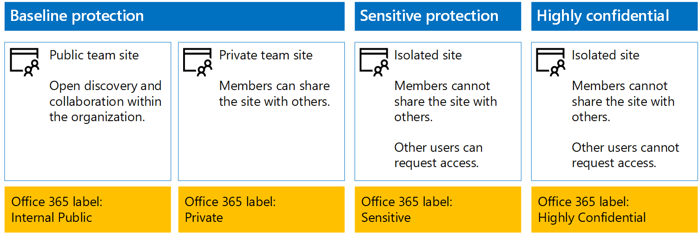
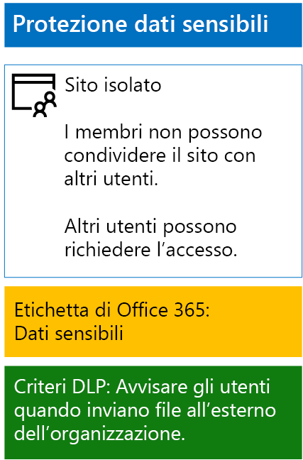

# <a name="protect-sharepoint-online-files-with-office-365-labels-and-dlp"></a><span data-ttu-id="c6397-103">Proteggere i file di SharePoint Online con Office 365 etichette e DLP</span><span class="sxs-lookup"><span data-stu-id="c6397-103">Protect SharePoint Online files with Office 365 labels and DLP</span></span>

 <span data-ttu-id="c6397-104">**Riepilogo:** Office 365 dati ed etichette perdita criterio DLP criteri applicati ai siti dei team SharePoint Online con diversi livelli di protezione delle informazioni.</span><span class="sxs-lookup"><span data-stu-id="c6397-104">**Summary:** Apply Office 365 labels and data loss prevention (DLP) policies for SharePoint Online team sites with various levels of information protection.</span></span>
  
<span data-ttu-id="c6397-p101">Utilizzare i passaggi descritti in questo articolo per progettare e distribuire le etichette di Office 365 e criteri DLP per la linea di base, importanti o altamente riservati team siti di SharePoint Online. Per ulteriori informazioni su questi tre livelli di protezione, vedere [file e siti di SharePoint Online sicura](secure-sharepoint-online-sites-and-files.md).</span><span class="sxs-lookup"><span data-stu-id="c6397-p101">Use the steps in this article to design and deploy Office 365 labels and DLP policies for baseline, sensitive, and highly confidential SharePoint Online team sites. For more information about these three tiers of protection, see [Secure SharePoint Online sites and files](secure-sharepoint-online-sites-and-files.md).</span></span>
  
## <a name="office-365-labels-for-your-sharepoint-online-sites"></a><span data-ttu-id="c6397-107">Etichette di Office 365 per i siti di SharePoint Online</span><span class="sxs-lookup"><span data-stu-id="c6397-107">Office 365 labels for your SharePoint Online sites</span></span>

<span data-ttu-id="c6397-108">Esistono tre fasi per creare e poi assegnare le etichette di Office 365 ai siti del team di SharePoint Online.</span><span class="sxs-lookup"><span data-stu-id="c6397-108">There are three phases to creating and then assigning Office 365 labels to SharePoint Online team sites.</span></span>
  
### <a name="phase-1-determine-the-office-365-label-names"></a><span data-ttu-id="c6397-109">Fase 1: Determinare i nomi delle etichette di Office 365</span><span class="sxs-lookup"><span data-stu-id="c6397-109">Phase 1: Determine the Office 365 label names</span></span>

<span data-ttu-id="c6397-p102">In questa fase, si determinano i nomi delle etichette di Office 365 per i quattro livelli di protezione delle informazioni applicati ai siti del team di SharePoint Online. Nella tabella seguente sono riportati i nomi consigliati per ogni livello.</span><span class="sxs-lookup"><span data-stu-id="c6397-p102">In this phase, you determine the names of your Office 365 labels for the four levels of information protection applied to SharePoint Online team sites. The following table lists the recommended names for each level.</span></span>
  
|<span data-ttu-id="c6397-112">**Livello di protezione del sito del team SharePoint Online**</span><span class="sxs-lookup"><span data-stu-id="c6397-112">**SharePoint Online team site protection level**</span></span>|<span data-ttu-id="c6397-113">**Nome di etichetta**</span><span class="sxs-lookup"><span data-stu-id="c6397-113">**Label name**</span></span>|
|:-----|:-----|
|<span data-ttu-id="c6397-114">Pubblico di livello di base</span><span class="sxs-lookup"><span data-stu-id="c6397-114">Baseline-Public</span></span>  <br/> |<span data-ttu-id="c6397-115">Pubblico di livello interno</span><span class="sxs-lookup"><span data-stu-id="c6397-115">Internal public</span></span>  <br/> |
|<span data-ttu-id="c6397-116">Privato di livello di base</span><span class="sxs-lookup"><span data-stu-id="c6397-116">Baseline-Private</span></span>  <br/> |<span data-ttu-id="c6397-117">Privato</span><span class="sxs-lookup"><span data-stu-id="c6397-117">Private</span></span>  <br/> |
|<span data-ttu-id="c6397-118">Riservato</span><span class="sxs-lookup"><span data-stu-id="c6397-118">Sensitive</span></span>  <br/> |<span data-ttu-id="c6397-119">Riservato</span><span class="sxs-lookup"><span data-stu-id="c6397-119">Sensitive</span></span>  <br/> |
|<span data-ttu-id="c6397-120">Estremamente riservato</span><span class="sxs-lookup"><span data-stu-id="c6397-120">Highly Confidential</span></span>  <br/> |<span data-ttu-id="c6397-121">Estremamente riservato</span><span class="sxs-lookup"><span data-stu-id="c6397-121">Highly Confidential</span></span>  <br/> |
   
### <a name="phase-2-create-the-office-365-labels"></a><span data-ttu-id="c6397-122">Fase 2: creare etichette di Office 365</span><span class="sxs-lookup"><span data-stu-id="c6397-122">Phase 2: Create the Office 365 labels</span></span>

<span data-ttu-id="c6397-123">In questa fase, creare e poi pubblicare le etichette determinate per i diversi livelli di protezione delle informazioni.</span><span class="sxs-lookup"><span data-stu-id="c6397-123">In this phase, you create and then publish your determined labels for the different levels of information protection.</span></span>
  
<span data-ttu-id="c6397-124">Per creare le etichette, è possibile utilizzare l'interfaccia di amministrazione di Office 365 o Microsoft PowerShell.</span><span class="sxs-lookup"><span data-stu-id="c6397-124">To create the labels, you can use the Office 365 Admin center or Microsoft PowerShell.</span></span>
  
### <a name="create-office-365-labels-with-the-office-365-admin-center"></a><span data-ttu-id="c6397-125">Creare etichette di Office 365 con l'interfaccia di amministrazione di Office 365</span><span class="sxs-lookup"><span data-stu-id="c6397-125">Create Office 365 labels with the Office 365 Admin center</span></span>

1. <span data-ttu-id="c6397-p103">Accedere al portale di Office 365 con un account che dispone del ruolo Amministratore della sicurezza oppure Amministratore della società. Per informazioni, vedere [Dove accedere a Office 365 per le aziende](https://support.office.com/Article/Where-to-sign-in-to-Office-365-e9eb7d51-5430-4929-91ab-6157c5a050b4).</span><span class="sxs-lookup"><span data-stu-id="c6397-p103">Sign in to the Office 365 portal with an account that has the Security Administrator or Company Administrator role. For help, see [Where to sign in to Office 365](https://support.office.com/Article/Where-to-sign-in-to-Office-365-e9eb7d51-5430-4929-91ab-6157c5a050b4).</span></span>
    
2. <span data-ttu-id="c6397-128">Nella scheda **Home page di Microsoft Office** , fare clic su tessera di **amministrazione** .</span><span class="sxs-lookup"><span data-stu-id="c6397-128">From the **Microsoft Office Home** tab, click the **Admin** tile.</span></span>
    
3. <span data-ttu-id="c6397-129">Scheda di **interfaccia di amministrazione di Office** nuovo del browser fare clic su **Admin Center > sicurezza &amp; conformità**.</span><span class="sxs-lookup"><span data-stu-id="c6397-129">From the new **Office Admin center** tab of your browser, click **Admin centers > Security &amp; Compliance**.</span></span>
    
4. <span data-ttu-id="c6397-130">Dalla nuova **Home - sicurezza &amp; conformità** scheda del browser, fare clic su **classificazioni > etichette**.</span><span class="sxs-lookup"><span data-stu-id="c6397-130">From the new **Home - Security &amp; Compliance** tab of your browser, click **Classifications > Labels**.</span></span>
    
5. <span data-ttu-id="c6397-131">Dal **Home > etichette** riquadro, fare clic su **Crea un'etichetta**.</span><span class="sxs-lookup"><span data-stu-id="c6397-131">From the **Home > Labels** pane, click **Create a label**.</span></span>
    
6. <span data-ttu-id="c6397-132">Nel riquadro di **nome dell'etichetta** , digitare il nome dell'etichetta e quindi fare clic su **Avanti**.</span><span class="sxs-lookup"><span data-stu-id="c6397-132">On the **Name your label** pane, type the name of the label, and then click **Next**.</span></span>
    
7. <span data-ttu-id="c6397-133">Nel riquadro di **impostazioni dell'etichetta** , fare clic su **Avanti**.</span><span class="sxs-lookup"><span data-stu-id="c6397-133">On the **Label settings** pane, click **Next**.</span></span>
    
8. <span data-ttu-id="c6397-134">Nel riquadro di **Rivedere le impostazioni** , fare clic su **Crea l'etichetta**e quindi fare clic su **Chiudi**.</span><span class="sxs-lookup"><span data-stu-id="c6397-134">On the **Review your settings** pane, click **Create this label**, and then click **Close**.</span></span>
    
9. <span data-ttu-id="c6397-135">Ripetere i passaggi da 5 a 8 per etichette aggiuntive.</span><span class="sxs-lookup"><span data-stu-id="c6397-135">Repeat steps 5-8 for your additional labels.</span></span>
    
### <a name="create-office-365-labels-with-powershell"></a><span data-ttu-id="c6397-136">Creare etichette di Office 365 con PowerShell</span><span class="sxs-lookup"><span data-stu-id="c6397-136">Create Office 365 labels with PowerShell</span></span>

1. <span data-ttu-id="c6397-137">[Connetti a Office 365 Security &amp; centro conformità utilizzando PowerShell remoto](http://go.microsoft.com/fwlink/?LinkID=799771&amp;clcid=0x409) e specificare le credenziali di un account che dispone del ruolo di amministratore della sicurezza o amministratore azienda.</span><span class="sxs-lookup"><span data-stu-id="c6397-137">[Connect to the Office 365 Security &amp; Compliance Center using remote PowerShell](http://go.microsoft.com/fwlink/?LinkID=799771&amp;clcid=0x409) and specify the credentials of an account that has the Security Administrator or Company Administrator role.</span></span>
    
2. <span data-ttu-id="c6397-138">Compilare l'elenco di nomi delle etichette, quindi eseguire questi comandi al prompt dei comandi di PowerShell:</span><span class="sxs-lookup"><span data-stu-id="c6397-138">Fill out the list of label names, and then run these commands at the PowerShell command prompt:</span></span>
    
  ```
  $labelNames=@(<list of label names, each enclosed in quotes and separated by commas>)
ForEach ($element in $labelNames){ New-ComplianceTag -Name $element }
  ```

<span data-ttu-id="c6397-139">Successivamente, seguire questi passaggi per pubblicare le nuove etichette di Office 365.</span><span class="sxs-lookup"><span data-stu-id="c6397-139">Next, use these steps to publish the new Office 365 labels.</span></span>
  
1. <span data-ttu-id="c6397-140">Dal **Home > etichette** riquadro della protezione &amp; centro conformità, fare clic su **pubblica etichette**.</span><span class="sxs-lookup"><span data-stu-id="c6397-140">From the **Home > Labels** pane the Security &amp; Compliance Center, click **Publish labels**.</span></span>
    
2. <span data-ttu-id="c6397-141">Nel riquadro di **scegliere le etichette per la pubblicazione** , fare clic su **etichette scegliere per la pubblicazione**.</span><span class="sxs-lookup"><span data-stu-id="c6397-141">On the **Choose labels to publish** pane, click **Choose labels to publish**.</span></span>
    
3. <span data-ttu-id="c6397-142">Nel riquadro **scegliere etichette** , fare clic su **Aggiungi** e selezionare tutte le etichette di quattro.</span><span class="sxs-lookup"><span data-stu-id="c6397-142">On the **Choose labels** pane, click **Add** and select all four labels.</span></span>
    
4. <span data-ttu-id="c6397-143">Fare clic su **Chiudi**.</span><span class="sxs-lookup"><span data-stu-id="c6397-143">Click **Done**.</span></span>
    
5. <span data-ttu-id="c6397-144">Nel riquadro di **scegliere le etichette per la pubblicazione** , fare clic su **Avanti**.</span><span class="sxs-lookup"><span data-stu-id="c6397-144">On the **Choose labels to publish** pane, click **Next**.</span></span>
    
6. <span data-ttu-id="c6397-145">Nel riquadro **scegliere percorsi** , fare clic su **Avanti**.</span><span class="sxs-lookup"><span data-stu-id="c6397-145">On the **Choose locations** pane, click **Next**.</span></span>
    
7. <span data-ttu-id="c6397-146">Nel riquadro **nome del criterio** digitare un nome per il set di etichette di **nome**e quindi fare clic su **Avanti**.</span><span class="sxs-lookup"><span data-stu-id="c6397-146">On the **Name your policy** pane, type a name for your set of labels in **Name**, and then click **Next**.</span></span>
    
8. <span data-ttu-id="c6397-147">Nel riquadro di **Rivedere le impostazioni** , fare clic su **etichette pubblica**e quindi fare clic su **Chiudi**.</span><span class="sxs-lookup"><span data-stu-id="c6397-147">On the **Review your settings** pane, click **Publish labels**, and then click **Close**.</span></span>
    
### <a name="phase-3-apply-the-office-365-labels-to-your-sharepoint-online-sites"></a><span data-ttu-id="c6397-148">Fase 3: Applicare le etichette di Office 365 per i siti di SharePoint Online</span><span class="sxs-lookup"><span data-stu-id="c6397-148">Phase 3: Apply the Office 365 labels to your SharePoint Online sites</span></span>

<span data-ttu-id="c6397-149">Seguire questi passaggi per applicare le etichette di Office 365 alle cartelle di documenti dei siti del team di SharePoint Online.</span><span class="sxs-lookup"><span data-stu-id="c6397-149">Use these steps to apply the Office 365 labels to the documents folders of your SharePoint Online team sites.</span></span>
  
1. <span data-ttu-id="c6397-150">Nella scheda **Home page di Microsoft Office** del browser, fare clic su tessera di **SharePoint** .</span><span class="sxs-lookup"><span data-stu-id="c6397-150">From the **Microsoft Office Home** tab of your browser, click the **SharePoint** tile.</span></span>
    
2. <span data-ttu-id="c6397-151">Nella scheda **SharePoint** nuovo nel browser, fare clic su un sito in cui è necessario assegnata un'etichetta di Office 365.</span><span class="sxs-lookup"><span data-stu-id="c6397-151">On the new **SharePoint** tab in your browser, click a site that needs an Office 365 label assigned.</span></span>
    
3. <span data-ttu-id="c6397-152">Nella scheda sito di SharePoint nuovo del browser fare clic su **documenti**.</span><span class="sxs-lookup"><span data-stu-id="c6397-152">In the new SharePoint site tab of your browser, click **Documents**.</span></span>
    
4. <span data-ttu-id="c6397-153">Fare clic sull'icona impostazioni e quindi fare clic su **Impostazioni raccolta**.</span><span class="sxs-lookup"><span data-stu-id="c6397-153">Click the settings icon, and then click **Library settings**.</span></span>
    
5. <span data-ttu-id="c6397-154">Nella sezione **autorizzazioni e gestione**, fare clic su **Applica etichetta agli elementi della raccolta**.</span><span class="sxs-lookup"><span data-stu-id="c6397-154">Under **Permissions and Management**, click **Apply label to items in this library**.</span></span>
    
6. <span data-ttu-id="c6397-155">In **Impostazioni si applicano etichetta**, selezionare l'etichetta appropriata e quindi fare clic su **Salva**.</span><span class="sxs-lookup"><span data-stu-id="c6397-155">In **Settings-Apply Label**, select the appropriate label, and then click **Save**.</span></span>
    
7. <span data-ttu-id="c6397-156">Chiudere la scheda per il sito di SharePoint Online.</span><span class="sxs-lookup"><span data-stu-id="c6397-156">Close the tab for the SharePoint Online site.</span></span>
    
8. <span data-ttu-id="c6397-157">Ripetere i passaggi da 3 a 8 per assegnare le etichette di Office 365 ai siti di SharePoint Online aggiuntivi.</span><span class="sxs-lookup"><span data-stu-id="c6397-157">Repeat steps 3-8 to assign Office 365 labels to your additional SharePoint Online sites.</span></span>
    
<span data-ttu-id="c6397-158">Di seguito è riportata la configurazione risultante.</span><span class="sxs-lookup"><span data-stu-id="c6397-158">Here is your resulting configuration.</span></span>
  

  
## <a name="dlp-policies-for-your-sharepoint-online-sites"></a><span data-ttu-id="c6397-160">Criteri DLP per i siti di SharePoint Online</span><span class="sxs-lookup"><span data-stu-id="c6397-160">DLP policies for your SharePoint Online sites</span></span>

<span data-ttu-id="c6397-161">Utilizzare la procedura seguente per configurare un criterio DLP che informa gli utenti quando si condivide un documento in un sito del team riservate SharePoint Online all'esterno dell'organizzazione.</span><span class="sxs-lookup"><span data-stu-id="c6397-161">Use these steps to configure a DLP policy that notifies users when they share a document on a SharePoint Online sensitive team site outside the organization.</span></span>
  
1. <span data-ttu-id="c6397-162">Nella scheda **Home page di Microsoft Office** nel browser, fare clic sul **protezione &amp; conformità** affiancate.</span><span class="sxs-lookup"><span data-stu-id="c6397-162">From the **Microsoft Office Home** tab in your browser, click the **Security &amp; Compliance** tile.</span></span>
    
2. <span data-ttu-id="c6397-163">Nel nuovo computer **protezione &amp; conformità** nel browser, fare clic **prevenzione della perdita di dati > criteri**.</span><span class="sxs-lookup"><span data-stu-id="c6397-163">On the new **Security &amp; Compliance** tab in your browser, click **Data loss prevention > Policy**.</span></span>
    
3. <span data-ttu-id="c6397-164">Nel riquadro di **prevenzione della perdita di dati** , fare clic su **+ Crea un criterio**.</span><span class="sxs-lookup"><span data-stu-id="c6397-164">In the **Data loss prevention** pane, click **+ Create a policy**.</span></span>
    
4. <span data-ttu-id="c6397-165">Nella **iniziare con un modello o creare un criterio personalizzato** riquadro, fare clic su **personalizzata**e quindi fare clic su **Avanti**.</span><span class="sxs-lookup"><span data-stu-id="c6397-165">In the **Start with a template or create a custom policy** pane, click **Custom**, and then click **Next**.</span></span>
    
5. <span data-ttu-id="c6397-166">Nel riquadro **nome del criterio** , digitare il nome per il criterio DLP livello riservato in **nome**e quindi fare clic su **Avanti**.</span><span class="sxs-lookup"><span data-stu-id="c6397-166">In the **Name your policy** pane, type the name for the sensitive level DLP policy in **Name**, and then click **Next**.</span></span>
    
6. <span data-ttu-id="c6397-167">Nel riquadro **scegliere percorsi** , fare clic su **Seleziona manualmente percorsi specifici**e quindi fare clic su **Avanti**.</span><span class="sxs-lookup"><span data-stu-id="c6397-167">In the **Choose locations** pane, click **Let me choose specific locations**, and then click **Next**.</span></span>
    
7. <span data-ttu-id="c6397-168">Nell'elenco delle posizioni, disattivare i percorsi di **posta elettronica di Exchange** e **gli account di OneDrive** e quindi fare clic su **Avanti**.</span><span class="sxs-lookup"><span data-stu-id="c6397-168">In the list of locations, disable the **Exchange email** and **OneDrive accounts** locations, and then click **Next**.</span></span>
    
8. <span data-ttu-id="c6397-169">Nel riquadro di **personalizzare i tipi di informazioni riservate che si desidera proteggere** , fare clic su **Modifica**.</span><span class="sxs-lookup"><span data-stu-id="c6397-169">In the **Customize the types of sensitive info you want to protect** pane, click **Edit**.</span></span>
    
9. <span data-ttu-id="c6397-170">Nel riquadro **scegliere i tipi di contenuto per la protezione** , fare clic su **Aggiungi** nella casella a discesa e quindi fare clic su **etichette**.</span><span class="sxs-lookup"><span data-stu-id="c6397-170">In the **Choose the types of content to protect** pane, click **Add** in the drop-down box, and then click **Labels**.</span></span>
    
10. <span data-ttu-id="c6397-171">Nel riquadro **etichette** fare clic su **+ Aggiungi**, selezionare l'etichetta **riservati** , fare clic su **Aggiungi**e quindi fare clic su **Fine**.</span><span class="sxs-lookup"><span data-stu-id="c6397-171">In the **Labels** pane, click **+ Add**, select the **Sensitive** label, click **Add**, and then click **Done**.</span></span>
    
11. <span data-ttu-id="c6397-172">Nel riquadro **scegliere i tipi di contenuto per la protezione** , fare clic su **Salva**.</span><span class="sxs-lookup"><span data-stu-id="c6397-172">In the **Choose the types of content to protect** pane, click **Save**.</span></span>
    
12. <span data-ttu-id="c6397-173">Nel riquadro di **personalizzare i tipi di informazioni riservate che si desidera proteggere** , fare clic su **Avanti**.</span><span class="sxs-lookup"><span data-stu-id="c6397-173">In the **Customize the types of sensitive info you want to protect** pane, click **Next**.</span></span>
    
13. <span data-ttu-id="c6397-174">Nella **Selezionare l'operazione da eseguire se si rileva informazioni riservate?** riquadro, fare clic su **Personalizza la descrizione e posta elettronica**.</span><span class="sxs-lookup"><span data-stu-id="c6397-174">In the **What do you want to do if we detect sensitive info?** pane, click **Customize the tip and email**.</span></span>
    
14. <span data-ttu-id="c6397-175">Nel riquadro **suggerimenti sui criteri di personalizzazione e notifiche tramite posta elettronica** , fare clic su **Personalizza il testo del suggerimento criteri**.</span><span class="sxs-lookup"><span data-stu-id="c6397-175">In the **Customize policy tips and email notifications** pane, click **Customize the policy tip text**.</span></span>
    
15. <span data-ttu-id="c6397-176">Nella casella di testo digitare o incollare negli articoli seguenti:</span><span class="sxs-lookup"><span data-stu-id="c6397-176">In the text box, type or paste in the following:</span></span>
    
  - <span data-ttu-id="c6397-p104">Per condividere con un utente esterno all'organizzazione, scaricare il file e quindi aprirlo. Fare clic su File, Proteggi documento, Crittografa con password, quindi specificare una password complessa. Inviare la password in un'e-mail separata o con altri mezzi di comunicazione.</span><span class="sxs-lookup"><span data-stu-id="c6397-p104">To share with a user outside the organization, download the file and then open it. Click File, then Protect Document, and then Encrypt with Password, and then specify a strong password. Send the password in a separate email or other means of communication.</span></span>
    
    <span data-ttu-id="c6397-180">In alternativa, digitare o incollare un suggerimento per i criteri che indica agli utenti come condividere un file all'esterno dell'organizzazione.</span><span class="sxs-lookup"><span data-stu-id="c6397-180">Alternately, type or paste in your own policy tip that instructs users on how to share a file outside your organization.</span></span>
    
16. <span data-ttu-id="c6397-181">Fare clic su **OK**.</span><span class="sxs-lookup"><span data-stu-id="c6397-181">Click **OK**.</span></span>
    
17. <span data-ttu-id="c6397-182">Nella **Selezionare l'operazione da eseguire se si rileva informazioni riservate?** riquadro, deselezionare la casella di controllo **Blocca la condivisione degli utenti e limitare l'accesso al contenuto condiviso** e quindi fare clic su **Avanti**.</span><span class="sxs-lookup"><span data-stu-id="c6397-182">In the **What do you want to do if we detect sensitive info?** pane, clear the **Block people from sharing, and restrict access to shared content** check box, and then click **Next**.</span></span>
    
18. <span data-ttu-id="c6397-183">Nella **si desidera attivare le operazioni criteri o di testing prima?** riquadro, fare clic su **Sì, attivarlo immediatamente**e quindi fare clic su **Avanti**.</span><span class="sxs-lookup"><span data-stu-id="c6397-183">In the **Do you want to turn on the policy or test things out first?** pane, click **Yes, turn it on right away**, and then click **Next**.</span></span>
    
19. <span data-ttu-id="c6397-184">Nel riquadro di **Rivedere le impostazioni** , fare clic su **Crea**e quindi fare clic su **Chiudi**.</span><span class="sxs-lookup"><span data-stu-id="c6397-184">In the **Review your settings** pane, click **Create**, and then click **Close**.</span></span>
    
<span data-ttu-id="c6397-185">Ne risulta la configurazione per i siti del team di SharePoint Online di livello riservato.</span><span class="sxs-lookup"><span data-stu-id="c6397-185">Here is your resulting configuration for sensitive SharePoint Online team sites.</span></span>
  

  
<span data-ttu-id="c6397-187">Successivamente, seguire questi passaggi per configurare un criterio DLP che blocca gli utenti quando condividono un documento in un sito di SharePoint Online di livello riservato all'esterno dell'organizzazione.</span><span class="sxs-lookup"><span data-stu-id="c6397-187">Next, use these steps to configure a DLP policy that blocks users when they share a document on a SharePoint Online highly confidential team site outside the organization.</span></span>
  
1. <span data-ttu-id="c6397-188">Nella scheda **Home page di Microsoft Office** nel browser, fare clic sul **protezione &amp; conformità** affiancate.</span><span class="sxs-lookup"><span data-stu-id="c6397-188">From the **Microsoft Office Home** tab in your browser, click the **Security &amp; Compliance** tile.</span></span>
    
2. <span data-ttu-id="c6397-189">Nel nuovo computer **protezione &amp; conformità** nel browser, fare clic **prevenzione della perdita di dati > criteri**.</span><span class="sxs-lookup"><span data-stu-id="c6397-189">On the new **Security &amp; Compliance** tab in your browser, click **Data loss prevention > Policy**.</span></span>
    
3. <span data-ttu-id="c6397-190">Nel riquadro di **prevenzione della perdita di dati** , fare clic su **+ Crea un criterio**.</span><span class="sxs-lookup"><span data-stu-id="c6397-190">In the **Data loss prevention** pane, click **+ Create a policy**.</span></span>
    
4. <span data-ttu-id="c6397-191">Nella **iniziare con un modello o creare un criterio personalizzato** riquadro, fare clic su **personalizzata**e quindi fare clic su **Avanti**.</span><span class="sxs-lookup"><span data-stu-id="c6397-191">In the **Start with a template or create a custom policy** pane, click **Custom**, and then click **Next**.</span></span>
    
5. <span data-ttu-id="c6397-192">Nel riquadro **nome del criterio** , digitare il nome per il criterio DLP livello altamente riservato in **nome**e quindi fare clic su **Avanti**.</span><span class="sxs-lookup"><span data-stu-id="c6397-192">In the **Name your policy** pane, type the name for the highly sensitive level DLP policy in **Name**, and then click **Next**.</span></span>
    
6. <span data-ttu-id="c6397-193">Nel riquadro **scegliere percorsi** , fare clic su **Seleziona manualmente percorsi specifici**e quindi fare clic su **Avanti**.</span><span class="sxs-lookup"><span data-stu-id="c6397-193">In the **Choose locations** pane, click **Let me choose specific locations**, and then click **Next**.</span></span>
    
7. <span data-ttu-id="c6397-194">Nell'elenco delle posizioni, disattivare i percorsi di **posta elettronica di Exchange** e **gli account di OneDrive** e quindi fare clic su **Avanti**.</span><span class="sxs-lookup"><span data-stu-id="c6397-194">In the list of locations, disable the **Exchange email** and **OneDrive accounts** locations, and then click **Next**.</span></span>
    
8. <span data-ttu-id="c6397-195">Nel riquadro di **personalizzare i tipi di informazioni riservate che si desidera proteggere** , fare clic su **Modifica**.</span><span class="sxs-lookup"><span data-stu-id="c6397-195">In the **Customize the types of sensitive info you want to protect** pane, click **Edit**.</span></span>
    
9. <span data-ttu-id="c6397-196">Nel riquadro **scegliere i tipi di contenuto per la protezione** , fare clic su **Aggiungi** nella casella a discesa e quindi fare clic su **etichette**.</span><span class="sxs-lookup"><span data-stu-id="c6397-196">In the **Choose the types of content to protect** pane, click **Add** in the drop-down box, and then click **Labels**.</span></span>
    
10. <span data-ttu-id="c6397-197">Nel riquadro **etichette** fare clic su **+ Aggiungi**, selezionare l'etichetta **Altamente riservati** , fare clic su **Aggiungi**e quindi fare clic su **Fine**.</span><span class="sxs-lookup"><span data-stu-id="c6397-197">In the **Labels** pane, click **+ Add**, select the **Highly Confidential** label, click **Add**, and then click **Done**.</span></span>
    
11. <span data-ttu-id="c6397-198">Nel riquadro **scegliere i tipi di contenuto per la protezione** , fare clic su **Salva**.</span><span class="sxs-lookup"><span data-stu-id="c6397-198">In the **Choose the types of content to protect** pane, click **Save**.</span></span>
    
12. <span data-ttu-id="c6397-199">Nel riquadro di **personalizzare i tipi di informazioni riservate che si desidera proteggere** , fare clic su **Avanti**.</span><span class="sxs-lookup"><span data-stu-id="c6397-199">In the **Customize the types of sensitive info you want to protect** pane, click **Next**.</span></span>
    
13. <span data-ttu-id="c6397-200">Nella **Selezionare l'operazione da eseguire se si rileva informazioni riservate?** riquadro, fare clic su **Personalizza la descrizione e posta elettronica**.</span><span class="sxs-lookup"><span data-stu-id="c6397-200">In the **What do you want to do if we detect sensitive info?** pane, click **Customize the tip and email**.</span></span>
    
14. <span data-ttu-id="c6397-201">Nel riquadro **suggerimenti sui criteri di personalizzazione e notifiche tramite posta elettronica** , fare clic su **Personalizza il testo del suggerimento criteri**.</span><span class="sxs-lookup"><span data-stu-id="c6397-201">In the **Customize policy tips and email notifications** pane, click **Customize the policy tip text**.</span></span>
    
15. <span data-ttu-id="c6397-202">Nella casella di testo digitare o incollare negli articoli seguenti:</span><span class="sxs-lookup"><span data-stu-id="c6397-202">In the text box, type or paste in the following:</span></span>
    
  - <span data-ttu-id="c6397-p105">Per condividere con un utente esterno all'organizzazione, scaricare il file e quindi aprirlo. Fare clic su File, Proteggi documento, Crittografa con password, quindi specificare una password complessa. Inviare la password in un'e-mail separata o con altri mezzi di comunicazione.</span><span class="sxs-lookup"><span data-stu-id="c6397-p105">To share with a user outside the organization, download the file and then open it. Click File, then Protect Document, and then Encrypt with Password, and then specify a strong password. Send the password in a separate email or other means of communication.</span></span>
    
    <span data-ttu-id="c6397-206">In alternativa, digitare o incollare un suggerimento per i criteri che indica agli utenti come condividere un file all'esterno dell'organizzazione.</span><span class="sxs-lookup"><span data-stu-id="c6397-206">Alternately, type or paste in your own policy tip that instructs users on how to share a file outside your organization.</span></span>
    
16. <span data-ttu-id="c6397-207">Fare clic su **OK**.</span><span class="sxs-lookup"><span data-stu-id="c6397-207">Click **OK**.</span></span>
    
17. <span data-ttu-id="c6397-208">Nella **Selezionare l'operazione da eseguire se si rileva informazioni riservate?** riquadro, selezionare **Richiedi motivazione aziendale per eseguire l'override**e quindi fare clic su **Avanti**.</span><span class="sxs-lookup"><span data-stu-id="c6397-208">In the **What do you want to do if we detect sensitive info?** pane, select **Require a business justification to override**, and then click **Next**.</span></span>
    
18. <span data-ttu-id="c6397-209">Nella **si desidera attivare le operazioni criteri o di testing prima?** riquadro, fare clic su **Sì, attivarlo immediatamente**e quindi fare clic su **Avanti**.</span><span class="sxs-lookup"><span data-stu-id="c6397-209">In the **Do you want to turn on the policy or test things out first?** pane, click **Yes, turn it on right away**, and then click **Next**.</span></span>
    
19. <span data-ttu-id="c6397-210">Nel riquadro di **Rivedere le impostazioni** , fare clic su **Crea**e quindi fare clic su **Chiudi**.</span><span class="sxs-lookup"><span data-stu-id="c6397-210">In the **Review your settings** pane, click **Create**, and then click **Close**.</span></span>
    
<span data-ttu-id="c6397-211">Ne risulta la configurazione per i siti del team di SharePoint Online di livello estremamente riservato.</span><span class="sxs-lookup"><span data-stu-id="c6397-211">Here is your resulting configuration for high confidentiality SharePoint Online team sites.</span></span>
  

  
## <a name="next-step"></a><span data-ttu-id="c6397-213">Passaggio successivo</span><span class="sxs-lookup"><span data-stu-id="c6397-213">Next step</span></span>

[<span data-ttu-id="c6397-214">Proteggere i file di SharePoint Online con la protezione delle informazioni di Azure</span><span class="sxs-lookup"><span data-stu-id="c6397-214">Protect SharePoint Online files with Azure Information Protection</span></span>](protect-sharepoint-online-files-with-azure-information-protection.md)
    
## <a name="see-also"></a><span data-ttu-id="c6397-215">Vedere anche</span><span class="sxs-lookup"><span data-stu-id="c6397-215">See Also</span></span>

[<span data-ttu-id="c6397-216">Protezione di file e siti di SharePoint Online</span><span class="sxs-lookup"><span data-stu-id="c6397-216">Secure SharePoint Online sites and files</span></span>](secure-sharepoint-online-sites-and-files.md)
  
[<span data-ttu-id="c6397-217">Proteggere i siti di SharePoint Online in un ambiente di sviluppo e di testing</span><span class="sxs-lookup"><span data-stu-id="c6397-217">Secure SharePoint Online sites in a dev/test environment</span></span>](secure-sharepoint-online-sites-in-a-dev-test-environment.md)
  
[<span data-ttu-id="c6397-218">Guida sulla sicurezza Microsoft per organizzazioni che si occupano della campagna politica, no profit e altre organizzazioni agili</span><span class="sxs-lookup"><span data-stu-id="c6397-218">Microsoft Security Guidance for Political Campaigns, Nonprofits, and Other Agile Organizations</span></span>](microsoft-security-guidance-for-political-campaigns-nonprofits-and-other-agile-o.md)
  
[<span data-ttu-id="c6397-219">Adozione del cloud e soluzioni ibride</span><span class="sxs-lookup"><span data-stu-id="c6397-219">Cloud adoption and hybrid solutions</span></span>](cloud-adoption-and-hybrid-solutions.md)


