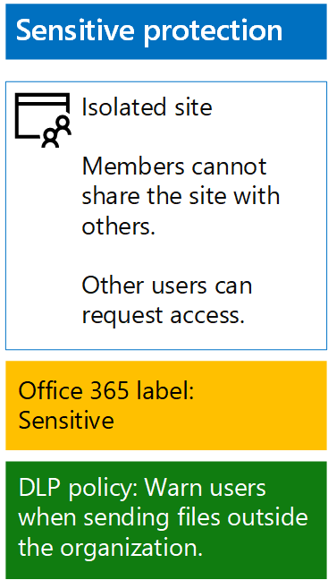

# <a name="protect-sharepoint-online-files-with-office-365-labels-and-dlp"></a>Protect SharePoint Online files with Office 365 labels and DLP

 **Summary:** Apply Office 365 labels and data loss prevention (DLP) policies for SharePoint Online team sites with various levels of information protection.
  
Use the steps in this article to design and deploy Office 365 labels and DLP policies for baseline, sensitive, and highly confidential SharePoint Online team sites. For more information about these three tiers of protection, see [Secure SharePoint Online sites and files](secure-sharepoint-online-sites-and-files.md).
  
## <a name="office-365-labels-for-your-sharepoint-online-sites"></a>Etichette di Office 365 per i siti di SharePoint Online

Esistono tre fasi per creare e poi assegnare le etichette di Office 365 ai siti del team di SharePoint Online.
  
### <a name="phase-1-determine-the-office-365-label-names"></a>Fase 1: Determinare i nomi delle etichette di Office 365

In questa fase, si determinano i nomi delle etichette di Office 365 per i quattro livelli di protezione delle informazioni applicati ai siti del team di SharePoint Online. Nella tabella seguente sono riportati i nomi consigliati per ogni livello.
  
|**SharePoint Online team site protection level**|**Label name**|
|:-----|:-----|
|Pubblico di livello di base  <br/> |Pubblico di livello interno  <br/> |
|Privato di livello di base  <br/> |Privato  <br/> |
|Riservato  <br/> |Riservato  <br/> |
|Estremamente riservato  <br/> |Estremamente riservato  <br/> |
   
### <a name="phase-2-create-the-office-365-labels"></a>Fase 2: creare etichette di Office 365

In questa fase, creare e poi pubblicare le etichette determinate per i diversi livelli di protezione delle informazioni.
  
Per creare le etichette, è possibile utilizzare l'interfaccia di amministrazione di Office 365 o Microsoft PowerShell.
  
### <a name="create-office-365-labels-with-the-office-365-admin-center"></a>Creare etichette di Office 365 con l'interfaccia di amministrazione di Office 365

1. Accedere al portale di Office 365 con un account che dispone del ruolo Amministratore della sicurezza oppure Amministratore della società. Per informazioni, vedere [Dove accedere a Office 365 per le aziende](https://support.office.com/Article/Where-to-sign-in-to-Office-365-e9eb7d51-5430-4929-91ab-6157c5a050b4).
    
2. From the **Microsoft Office Home** tab, click the **Admin** tile.
    
3. From the new **Office Admin center** tab of your browser, click **Admin centers > Security &amp; Compliance**.
    
4. From the new **Home - Security &amp; Compliance** tab of your browser, click **Classifications > Labels**.
    
5. From the **Home > Labels** pane, click **Create a label**.
    
6. On the **Name your label** pane, type the name of the label, and then click **Next**.
    
7. On the **Label settings** pane, click **Next**.
    
8. On the **Review your settings** pane, click **Create this label**, and then click **Close**.
    
9. Ripetere i passaggi da 5 a 8 per etichette aggiuntive.
    
### <a name="create-office-365-labels-with-powershell"></a>Creare etichette di Office 365 con PowerShell

1. [Connect to the Office 365 Security &amp; Compliance Center using remote PowerShell](http://go.microsoft.com/fwlink/?LinkID=799771&amp;clcid=0x409) and specify the credentials of an account that has the Security Administrator or Company Administrator role.
    
2. Compilare l'elenco di nomi delle etichette, quindi eseguire questi comandi al prompt dei comandi di PowerShell:
    
  ```
  $labelNames=@(<list of label names, each enclosed in quotes and separated by commas>)
ForEach ($element in $labelNames){ New-ComplianceTag -Name $element }
  ```

Successivamente, seguire questi passaggi per pubblicare le nuove etichette di Office 365.
  
1. From the **Home > Labels** pane the Security &amp; Compliance Center, click **Publish labels**.
    
2. On the **Choose labels to publish** pane, click **Choose labels to publish**.
    
3. On the **Choose labels** pane, click **Add** and select all four labels.
    
4. Click **Done**.
    
5. On the **Choose labels to publish** pane, click **Next**.
    
6. On the **Choose locations** pane, click **Next**.
    
7. On the **Name your policy** pane, type a name for your set of labels in **Name**, and then click **Next**.
    
8. On the **Review your settings** pane, click **Publish labels**, and then click **Close**.
    
### <a name="phase-3-apply-the-office-365-labels-to-your-sharepoint-online-sites"></a>Fase 3: Applicare le etichette di Office 365 per i siti di SharePoint Online

Seguire questi passaggi per applicare le etichette di Office 365 alle cartelle di documenti dei siti del team di SharePoint Online.
  
1. From the **Microsoft Office Home** tab of your browser, click the **SharePoint** tile.
    
2. On the new **SharePoint** tab in your browser, click a site that needs an Office 365 label assigned.
    
3. In the new SharePoint site tab of your browser, click **Documents**.
    
4. Click the settings icon, and then click **Library settings**.
    
5. Under **Permissions and Management**, click **Apply label to items in this library**.
    
6. In **Settings-Apply Label**, select the appropriate label, and then click **Save**.
    
7. Chiudere la scheda per il sito di SharePoint Online.
    
8. Ripetere i passaggi da 3 a 8 per assegnare le etichette di Office 365 ai siti di SharePoint Online aggiuntivi.
    
Di seguito è riportata la configurazione risultante.
  

  
## <a name="dlp-policies-for-your-sharepoint-online-sites"></a>Criteri DLP per i siti di SharePoint Online

Use these steps to configure a DLP policy that notifies users when they share a document on a SharePoint Online sensitive team site outside the organization.
  
1. From the **Microsoft Office Home** tab in your browser, click the **Security &amp; Compliance** tile.
    
2. On the new **Security &amp; Compliance** tab in your browser, click **Data loss prevention > Policy**.
    
3. In the **Data loss prevention** pane, click **+ Create a policy**.
    
4. In the **Start with a template or create a custom policy** pane, click **Custom**, and then click **Next**.
    
5. In the **Name your policy** pane, type the name for the sensitive level DLP policy in **Name**, and then click **Next**.
    
6. In the **Choose locations** pane, click **Let me choose specific locations**, and then click **Next**.
    
7. In the list of locations, disable the **Exchange email** and **OneDrive accounts** locations, and then click **Next**.
    
8. In the **Customize the types of sensitive info you want to protect** pane, click **Edit**.
    
9. In the **Choose the types of content to protect** pane, click **Add** in the drop-down box, and then click **Labels**.
    
10. In the **Labels** pane, click **+ Add**, select the **Sensitive** label, click **Add**, and then click **Done**.
    
11. In the **Choose the types of content to protect** pane, click **Save**.
    
12. In the **Customize the types of sensitive info you want to protect** pane, click **Next**.
    
13. In the **What do you want to do if we detect sensitive info?** pane, click **Customize the tip and email**.
    
14. In the **Customize policy tips and email notifications** pane, click **Customize the policy tip text**.
    
15. In the text box, type or paste in the following:
    
  - Per condividere con un utente esterno all'organizzazione, scaricare il file e quindi aprirlo. Fare clic su File, Proteggi documento, Crittografa con password, quindi specificare una password complessa. Inviare la password in un'e-mail separata o con altri mezzi di comunicazione.
    
    In alternativa, digitare o incollare un suggerimento per i criteri che indica agli utenti come condividere un file all'esterno dell'organizzazione.
    
16. Fare clic su **OK**.
    
17. In the **What do you want to do if we detect sensitive info?** pane, clear the **Block people from sharing, and restrict access to shared content** check box, and then click **Next**.
    
18. In the **Do you want to turn on the policy or test things out first?** pane, click **Yes, turn it on right away**, and then click **Next**.
    
19. In the **Review your settings** pane, click **Create**, and then click **Close**.
    
Ne risulta la configurazione per i siti del team di SharePoint Online di livello riservato.
  

  
Successivamente, seguire questi passaggi per configurare un criterio DLP che blocca gli utenti quando condividono un documento in un sito di SharePoint Online di livello riservato all'esterno dell'organizzazione.
  
1. From the **Microsoft Office Home** tab in your browser, click the **Security &amp; Compliance** tile.
    
2. On the new **Security &amp; Compliance** tab in your browser, click **Data loss prevention > Policy**.
    
3. In the **Data loss prevention** pane, click **+ Create a policy**.
    
4. In the **Start with a template or create a custom policy** pane, click **Custom**, and then click **Next**.
    
5. In the **Name your policy** pane, type the name for the highly sensitive level DLP policy in **Name**, and then click **Next**.
    
6. In the **Choose locations** pane, click **Let me choose specific locations**, and then click **Next**.
    
7. In the list of locations, disable the **Exchange email** and **OneDrive accounts** locations, and then click **Next**.
    
8. In the **Customize the types of sensitive info you want to protect** pane, click **Edit**.
    
9. In the **Choose the types of content to protect** pane, click **Add** in the drop-down box, and then click **Labels**.
    
10. In the **Labels** pane, click **+ Add**, select the **Highly Confidential** label, click **Add**, and then click **Done**.
    
11. In the **Choose the types of content to protect** pane, click **Save**.
    
12. In the **Customize the types of sensitive info you want to protect** pane, click **Next**.
    
13. In the **What do you want to do if we detect sensitive info?** pane, click **Customize the tip and email**.
    
14. In the **Customize policy tips and email notifications** pane, click **Customize the policy tip text**.
    
15. In the text box, type or paste in the following:
    
  - Per condividere con un utente esterno all'organizzazione, scaricare il file e quindi aprirlo. Fare clic su File, Proteggi documento, Crittografa con password, quindi specificare una password complessa. Inviare la password in un'e-mail separata o con altri mezzi di comunicazione.
    
    In alternativa, digitare o incollare un suggerimento per i criteri che indica agli utenti come condividere un file all'esterno dell'organizzazione.
    
16. Fare clic su **OK**.
    
17. In the **What do you want to do if we detect sensitive info?** pane, select **Require a business justification to override**, and then click **Next**.
    
18. In the **Do you want to turn on the policy or test things out first?** pane, click **Yes, turn it on right away**, and then click **Next**.
    
19. In the **Review your settings** pane, click **Create**, and then click **Close**.
    
Ne risulta la configurazione per i siti del team di SharePoint Online di livello estremamente riservato.
  

  
## <a name="next-step"></a>Passaggio successivo

[Protect SharePoint Online files with Azure Information Protection](protect-sharepoint-online-files-with-azure-information-protection.md)
    
## <a name="see-also"></a>See Also

[Protezione di file e siti di SharePoint Online](secure-sharepoint-online-sites-and-files.md)
  
[Proteggere i siti di SharePoint Online in un ambiente di sviluppo e di testing](secure-sharepoint-online-sites-in-a-dev-test-environment.md)
  
[Guida sulla sicurezza Microsoft per organizzazioni che si occupano della campagna politica, no profit e altre organizzazioni agili](microsoft-security-guidance-for-political-campaigns-nonprofits-and-other-agile-o.md)
  
[Adozione del cloud e soluzioni ibride](cloud-adoption-and-hybrid-solutions.md)


