# Ripristinare gli elementi eliminati in una cassetta postale utente - Guida per l'amministratoreRecover deleted items in a user mailbox - Admin Help

\*\*Questo articolo è rivolto agli amministratori. Si sta tentando di recuperare gli elementi eliminati nella propria cassetta postale? \*\***This article is for administrators. Are you trying to recover deleted items in your own mailbox?** Eseguire una delle seguenti operazioni:Try one of the following:
- [Recuperare gli elementi eliminati in Outlook per WindowsRecover deleted items in Outlook for Windows](https://support.office.com/article/49e81f3c-c8f4-4426-a0b9-c0fd751d48ce)
- [Recuperare elementi o messaggi di posta elettronica eliminati in Outlook Web AppRecover deleted items or email in Outlook Web App](https://support.office.com/article/c3d8fc15-eeef-4f1c-81df-e27964b7edd4)
- [Ripristinare i messaggi di posta elettronica eliminati in Outlook sul WebRestore deleted email messages in Outlook on the web](https://support.office.com/article/a8ca78ac-4721-4066-95dd-571842e9fb11)
- [Outlook.comOutlook.com](https://go.microsoft.com/fwlink/p/?LinkID=623435)
   
Può accadere che un utente elimini in modo permanente alcuni elementi della propria cassetta postale di OutlookDid a user permanently delete items from their Outlook mailbox? e che voglia recuperarli senza riuscirci.The user wants them back but can't recover them. È possibile recuperare gli elementi eliminati se non sono stati rimossi definitivamente dalla cassetta postale dell'utente.You may be able recover the purged items if they haven't been permanently removed from the user's mailbox. Per eseguire questa operazione, usare lo strumento eDiscovery sul posto di Exchange Online per cercare i messaggi e altri elementi eliminati, ad esempio i contatti, gli appuntamenti del calendario e le attività, dalla cassetta postale di un utente.You do this by using the In-Place eDiscovery tool in Exchange Online to search for deleted email and other items—and such as contacts, calendar appointments, and tasks—in a user's mailbox. Se si trovano gli elementi eliminati, è possibile esportarli in un file PST, o file di dati di Outlook, che l'utente può poi usare per ripristinare gli elementi nella cassetta postale.If you find the deleted items, you can export them to a PST file (also called an Outlook Data File), which the user can then use to restore the items back to their mailbox.
  
Ecco i passaggi per ripristinare gli elementi eliminati nella cassetta postale di un utente.Here are the steps for recovering deleted items in a user's mailbox. Quanto tempo è necessario?How long will this take? La prima volta può richiedere da 20 a 30 minuti per il completamento di tutti i passaggi, a seconda del numero di elementi che si vuole recuperare.The first time might take 20 or 30 minutes to complete all the steps, depending on how many items you're trying to recover.
  
> [!NOTE]
> Per eseguire i passaggi descritti in questo articolo, è necessario essere un **amministratore di Exchange** o **un amministratore globale** di Office 365 o essere un membro del gruppo di ruoli Gestione organizzazione di Exchange Online.You have to be an **Exchange administrator** or **Global administrator** in Office 365 or be a member of the Organization Management role group in Exchange Online to perform the steps in this article. Per ulteriori informazioni, vedere [Informazioni sui ruoli di amministratore di Office 365](https://support.office.com/article/da585eea-f576-4f55-a1e0-87090b6aaa9d).For more information, see [About Office 365 admin roles](https://support.office.com/article/da585eea-f576-4f55-a1e0-87090b6aaa9d). 
  
## Passaggio 1: Assegnare a se stessi le autorizzazioni di eDiscoveryStep 1: Assign yourself eDiscovery permissions

Il primo passaggio consiste nell'assegnare a se stessi le autorizzazioni necessarie di Exchange Online per poter usare lo strumento eDiscovery sul posto per eseguire ricerche nella cassetta postale di un utente.The first step is to assign yourself the necessary permissions in Exchange Online so you can use the In-Place eDiscovery tool to search a user's mailbox. Questa procedura deve essere eseguita una sola volta.You only have to do this once. Se sarà necessario eseguire una ricerca in un'altra cassetta postale in futuro, è possibile ignorare questo passaggio.If you have to search another mailbox in the future, you can skip this step.
  
1. [Dove accedere a Office 365 per le aziende](https://support.office.com/article/e9eb7d51-5430-4929-91ab-6157c5a050b4) con l'account aziendale o dell'istituto di istruzione.[Where to sign in to Office 365 for business](https://support.office.com/article/e9eb7d51-5430-4929-91ab-6157c5a050b4) with your work or school account. 
    
2. Selezionare l’icona di avvio dell’app  nell'angolo in alto a sinistra e fare clic su **Amministratore**.Select the app launcher icon  in the upper-left and click **Admin**.
    
3. Nel riquadro di spostamento a sinistra nell'interfaccia di amministrazione di Microsoft 365, espandere **Interfaccia di amministrazione** e poi fare clic su **Exchange**.In the left navigation in the Microsoft 365 admin center, expand **Admin centers**, and then click **Exchange**.
    
    
  
4. Nell’Interfaccia di amministrazione fare clic su **Autorizzazioni** e poi su **Ruoli amministratore**.In the Exchange admin center, click **Permissions**, and then click **Admin roles**.
    
5. In questo elenco, selezionare **Gestione individuazione**, poi fare clic su **Modifica**.In the list view, select **Discovery Management**, and then click **Edit**.
    
    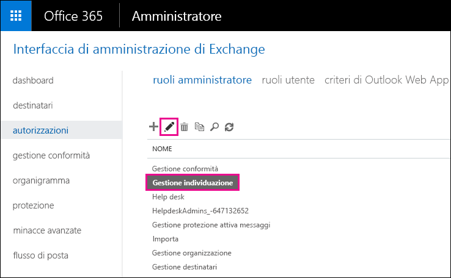
  
6. In **Gruppi di ruoli**, sotto **Membri**, fare clic su **Aggiungi**.In **Role Group**, under **Members**, click **Add**.
    
7. In **Scegli i membri**, selezionare il proprio nome nell'elenco, fare clic su **Aggiungi** e poi su **OK**.In **Select Members**, select yourself from the list of names, click **Add**, and then click **OK**.
    
    > [!NOTE]
    > È anche possibile aggiungere un gruppo di cui si è un membro, ad esempio il gruppo di gestione dell'organizzazione o degli amministratori del tenant.You can also add a group that you are a member of, such as Organization Management or TenantAdmins. Se si aggiunge un gruppo, agli altri membri del gruppo vengono assegnate le autorizzazioni necessarie per eseguire lo strumento eDiscovery sul posto.If you add a group, other members of the group will be assigned the necessary permissions to run the In-Place eDiscovery tool. 
  
8. In **Gruppo di ruoli**, fare clic su **Salva**.In **Role Group**, click **Save**.
    
9. Disconnettersi da Office 365.Sign out of Office 365.
    
    È necessario disconnettersi prima di iniziare il passaggio successivo, in modo da rendere effettive le nuove autorizzazioni.You have to sign out before you start the next step so the new permissions will take effect.
    
> [!CAUTION]
> I membri del gruppo di ruoli Gestione individuazione possono accedere al contenuto dei messaggi riservati.Members of the Discovery Management role group can access sensitive message content. Sono incluse le ricerche in tutte le cassette postali dell'organizzazione, la visualizzazione in anteprima dei risultati della ricerca, e di altri elementi della cassetta postale, la copia dei risultati in una cassetta postale di individuazione e l’esportazione dei risultati della ricerca in un file PST.This includes searching all mailboxes in your organization, previewing the search results (and other mailbox items), copying the results to a discovery mailbox, and exporting the search results to a PST file. 
  
[Inizio paginaReturn to top](recover-deleted-items-in-a-mailbox.md)
  
## Passaggio 2: Cercare gli elementi eliminati nella cassetta postale dell'utenteStep 2: Search the user's mailbox for deleted items

Quando si esegue una ricerca eDiscovery sul posto, la cartella Elementi ripristinabili nella cassetta postale in cui si sta eseguendo la ricerca viene automaticamente inclusa nella ricerca.When you run an In-Place eDiscovery search, the Recoverable Items folder in the mailbox that you search is automatically included in the search. La cartella Elementi ripristinabili è il luogo dove vengono archiviati gli elementi eliminati fino a quando non vengono rimossi per sempre dalla cassetta postale.The Recoverable Items folder is where permanently deleted items are stored until they're purged (permanently removed) from the mailbox. Pertanto, se un elemento non è stato rimosso, è possibile trovarlo con lo strumento eDiscovery sul posto.So, if an item hasn't been purged, you should be able to find it by using the In-Place eDiscovery tool.
  
1. [Dove accedere a Office 365 per le aziende](https://support.office.com/article/e9eb7d51-5430-4929-91ab-6157c5a050b4) con l'account aziendale o dell'istituto di istruzione.[Where to sign in to Office 365 for business](https://support.office.com/article/e9eb7d51-5430-4929-91ab-6157c5a050b4) with your work or school account. 
    
2. Selezionare l’icona di avvio dell’app  nell'angolo in alto a sinistra e fare clic su **Amministratore**.Select the app launcher icon  in the upper-left and click **Admin**.
    
3. Nel riquadro di spostamento a sinistra nell'interfaccia di amministrazione di Office 365, espandere **Amministratore** e poi fare clic su **Exchange**.In the left navigation in the Microsoft 365 admin center, expand **Admin**, and then click **Exchange**.
    
4. Nell'interfaccia di amministrazione di Exchange fare clic su **Gestione conformità**, poi su **eDiscovery &amp;blocco sul posto**e infine fare clic sull’icona **Nuovo**.In the Exchange admin center, click **Compliance management**, click **In-Place eDiscovery &amp; Hold**, and then click **New**.
    
    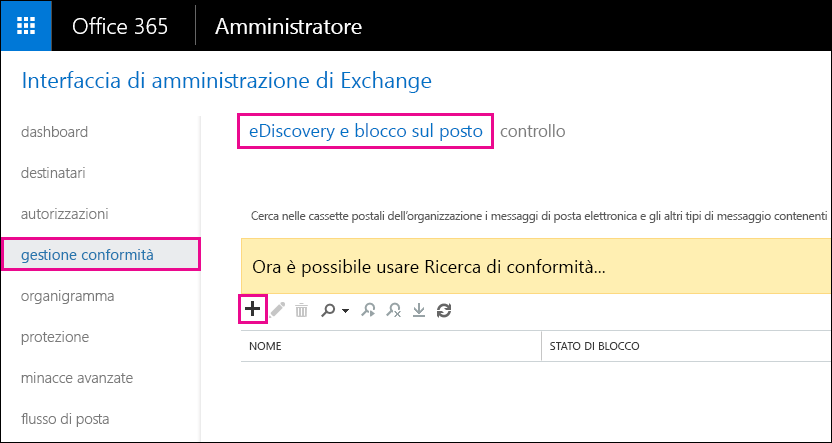
  
5. Nella pagina **Nome e descrizione** digitare un nome per la ricerca, ad esempio il nome dell'utente per cui si sta ripristinando la posta elettronica, una descrizione facoltativa e poi fare clic su **Avanti**.On the **Name and description** page, type a name for the search (such as the name of the user you're recovering email for), an optional description, and then click **Next**.
    
6. Nella pagina **Cassette postali** fare clic su **Specifica le cassette postali in cui cercare** e quindi fare clic su **Aggiungi**.On the **Mailboxes** page, click **Specify mailboxes to search**, and then click **Add**.
    
    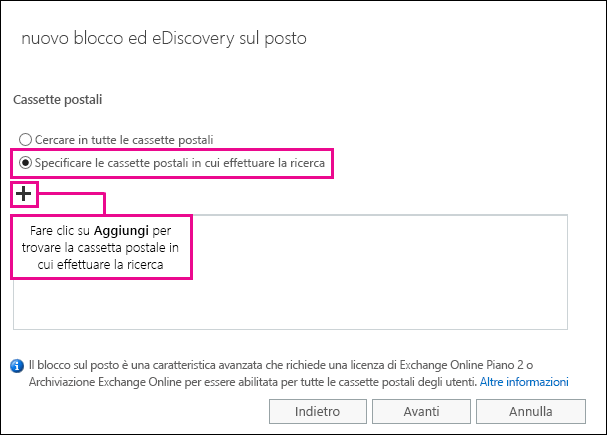
  
7. Trovare e selezionare il nome dell'utente per cui si ripristinano i messaggi di posta elettronica eliminati, fare clic su **Aggiungi** e dopo su **OK**.Find and select the name of the user that you're recovering the deleted email for, click **Add**, and then click **OK**.
    
8. Fare clic su **Avanti**.Click **Next**.
    
    Viene visualizzata la pagina **Query di ricerca**.The **Search query** page is displayed. In questa posizione si definiscono i criteri di ricerca che consentono di trovare gli elementi mancanti nella cassetta postale dell'utente.This is where you define the search criteria that will help you find the missing items in user's mailbox. 
    
9. Nella pagina **Query di ricerca** compilare i seguenti campi:On the **Search query** page, complete the following fields: 
    
  - **Includi tutto il contenuto** Selezionare questa opzione per includere tutto il contenuto della cassetta postale dell'utente nei risultati della ricerca.**Include all content** Select this option to include all content in the user's mailbox in the search results. Se viene selezionata questa opzione, non è possibile specificare ulteriori criteri di ricerca.If you select this option, you can't specify additional search criteria. 
    
  - **Filtra sulla base dei criteri** Selezionare questa opzione per specificare i criteri di ricerca, incluse le parole chiave, le date di inizio e di fine, gli indirizzi del mittente e del destinatario e i tipi di messaggio.**Filter based on criteria** Select this option to specify the search criteria, including keywords, start and end dates, sender and recipient addresses, and message types. 
    
    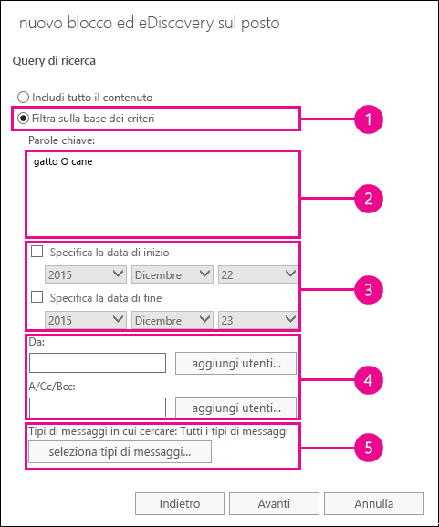
  
|**Campo****Field**|**Utilizzare questa opzione per...****Use this to...**|
|:-----|:-----|
|             |Specificare le parole chiave, un intervallo di date, i destinatari e i tipi di messaggi.Specify keywords, date range, recipients, and message types.    |
|             |Cercare i messaggi con parole chiave o frasi e usare gli operatori logici, ad esempio **AND** oppure **OR**.Search for messages with keywords or phrases, and use logical operators such as **AND** or **OR**.    |
|             |Cercare i messaggi inviati o ricevuti in un intervallo di date.Search for messages sent or received within a date range.    |
|             |Cercare i messaggi ricevuti o inviati a utenti specifici.Search for messages received from or sent to specific people.    |
|             |Cercare tutti i tipi di messaggi oppure selezionarne di specifici.Search for all message types or select specific ones.    |
   
   > [!TIP]
   >  Ecco alcuni suggerimenti su come creare una query di ricerca per trovare gli elementi mancanti.Here are a few tips about how to build a search query to find missing items. Provare a ottenere dall'utente tutte le informazioni necessarie per creare una query di ricerca idonea per trovare gli elementi cercati.Try to get as much information from the user to help you create a search query so you can find what you're looking for. Se non si è sicuri di come trovare un messaggio mancante, è consigliabile usare l'opzione **Includi tutto il contenuto**.If you are not sure how to find a missing message, consider using the **Include all content** option. I risultati della ricerca includeranno tutti gli elementi nella cartella Elementi ripristinabili dell'utente, tra cui la cartella nascosta (denominata Ripuliture) che contiene gli elementi che sono stati eliminati dall'utente.The search results will include all items in the user's Recoverable Items folder, including the hidden folder (called the Purges folder) that contain items that have been purged by the user. A questo punto è possibile passare al passaggio 3, copiare i risultati in una cassetta postale di individuazione e osservare il messaggio nella cartella nascosta.Then you can go to Step 3, copy the results to a discovery mailbox, and look at the message in the hidden folder. Se si conosce approssimativamente quando il messaggio mancante è stato inviato o ricevuto dall'utente originariamente, usare le opzioni **Specifica la data di inizio** e **Specifica la data di fine** per specificare un intervallo di date.If you know approximately when the missing message was originally sent or received by the user, use the **Specify start date** and **Specify end date** options to provide a date range. Verranno restituiti tutti i messaggi inviati o ricevuti dall'utente in tale intervallo di date.This will return all messages sent or received by the user within that date range. Specificare un intervallo di date è un modo molto efficace per limitare i risultati della ricerca.Specifying a date range is a really good way to narrow the search results. Se si conosce chi ha inviato i messaggi mancanti, usare la casella **Da** per specificare il mittente.If you know who sent the missing email, use the **From** box to specify this sender. Se si vuole limitare i risultati della ricerca a tipi diversi di elementi della cassetta postale, fare clic su **Seleziona tipi di messaggi**, quindi su **Scegli i tipi di messaggi in cui cercare** e infine scegliere un tipo di messaggio specifico da cercare.If you want to narrow the search results to different types of mailbox items, click **Select message types**, click **Select the message types to search**, and then choose a specific message type to search for. È ad esempio possibile cercare solo gli elementi del calendario o i contatti.For example, you can search only for calendar items or contacts. Ecco una schermata che illustra i diversi tipi di messaggio che è possibile cercare. Per impostazione predefinita vengono cercati tutti i tipi di messaggio.Here's a screenshot of the different message types you can search for; the default is to search for all message types. 
  
   Fare clic su **Avanti** dopo aver completato la pagina **Query di ricerca**.Click **Next** when you've completed the **Search query** page. 
    
10. Nella pagina **Impostazioni di blocco sul posto** fare clic su **Fine** per avviare la ricerca.On the **In-Place Hold settings** page, click **Finish** to start the search. Per recuperare i messaggi eliminati, non occorre impostare un blocco per la cassetta postale dell'utente.To recover deleted email, there's no reason to place the user's mailbox on hold. 
    
    Dopo aver iniziato la ricerca, Exchange visualizzerà una stima delle dimensioni totali e del numero di elementi restituiti dalla ricerca in base ai criteri specificati.After you start the search, Exchange will display an estimate of the total size and number of items that will be returned by the search based on the criteria you specified.
    
11. Selezionare la ricerca appena creata e fare clic su **Aggiorna** per aggiornare le informazioni visualizzate nel riquadro dei dettagli.Select the search you just created and click **Refresh** to update the information displayed in the details pane. Lo stato di **Stima completata** indica che la ricerca è terminata.The status of **Estimate Succeeded** indicates that the search has finished. Exchange visualizza anche una stima del numero totale di elementi, e delle relative dimensioni, trovati mediante la ricerca in base ai criteri di ricerca specificati nel passaggio 9.Exchange also displays an estimate of the total number of items (and their size) found by the search based on the search criteria you specified in step 9. 
    
12. Nel riquadro dei dettagli, fare clic su **Anteprima risultati della ricerca** per visualizzare gli elementi che sono stati individuati.In the details pane, click **Preview search results** to view the items that were found. Questo potrebbe aiutare a identificare gli elementi che si stanno cercando.This might help you identify the item(s) that you're looking for. Se si trovano gli elementi che si vogliono recuperare, andare al passaggio 4 per esportare i risultati della ricerca in un file PST.If you find the item(s) you're trying to recover, go to step 4 to export the search results to a PST file. 
    
    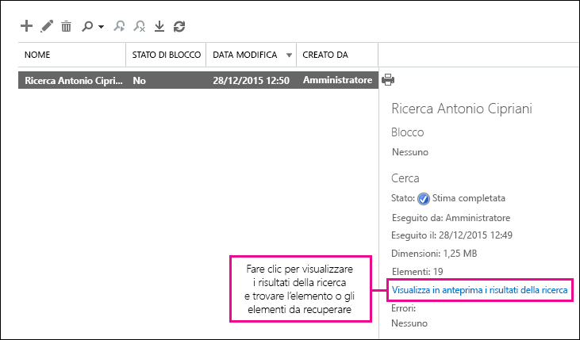
  
13. Se non si trova ciò che sta cercando, è possibile modificare i criteri di ricerca facendo clic sull’icona **Modifica** e poi su **Query di ricerca**.If you don't find what you're looking for, you can revise your search criteria by selecting the search, clicking **Edit**, and then clicking **Search query**. Modificare i criteri di ricerca e quindi eseguire di nuovo la ricerca.Change the search criteria and then rerun the search.
    
[Inizio paginaReturn to top](recover-deleted-items-in-a-mailbox.md)
  
## (Facoltativo) Passaggio 3: Copiare i risultati della ricerca in una cassetta postale di individuazione(Optional) Step 3: Copy the search results to a discovery mailbox

Se non si riesce a trovare un elemento nell’anteprima dei risultati della ricerca o se si vuole vedere quali elementi sono presenti nella cartella Elementi ripristinabili, è possibile copiare i risultati della ricerca in una cassetta postale speciale denominata cassetta postale di individuazione e quindi aprirla in Outlook sul Web per visualizzare gli elementi effettivi.If you can't find an items by previewing the search results or if you want to see which items are in the user's Recoverable Items folder, then you can copy the search results to a special mailbox (called a discovery mailbox) and then open that mailbox in Outlook on the web to view the actual items. La copia dei risultati della ricerca rappresenta il modo migliore di visualizzare gli elementi nella cartella Elementi ripristinabili dell'utente.The best reason to copy the search results is so you can view the items in the user's Recoverable Items folder. È molto probabile che l'elemento che si vuole recuperare si trovi nella sottocartella Ripuliture.More than likely, the item you're trying to recover is located in the Purges subfolder. 
  
1. Nell'interfaccia di amministrazione di Exchange passare a **Gestione conformità**\>**eDiscovery &amp; blocco sul posto**.In the Exchange admin center, go to **Compliance management** \> **In-Place eDiscovery &amp; Hold**.
    
2. Nell'elenco delle ricerche selezionare la ricerca creata nel passaggio 2.In the list of searches, select the search that you created in Step 2.
    
3. Fare clic su\*\* Ricerca\*\*, poi su **Copia risultati della ricerca** dall'elenco a discesa.Click **Search**, and then click **Copy search results** from the drop-down list. 
    
    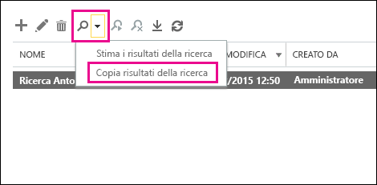
  
4. Nella pagina **Copia risultati della ricerca** fare clic su **Sfoglia**.On the **Copy Search Results** page, click **Browse**.
    
    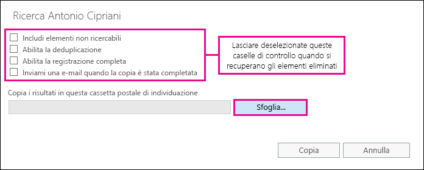
  
5. In **Nome visualizzato** fare clic su **Cassetta postale di individuazione** e quindi su **OK**.Under **Display Name**, click **Discovery Search Mailbox**, and then click **OK**.
    
    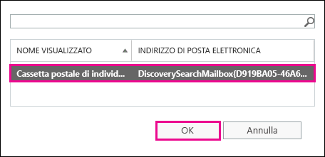
  
    > [!NOTE]
    > La cassetta postale di individuazione è una cassetta postale predefinita creata automaticamente nell'organizzazione di Office 365.The Discovery Search Mailbox is a default discovery mailbox that is automatically created in your Office 365 organization. 
  
6. Tornare alla pagina **Copia risultati della ricerca**, fare clic su **Copia** per avviare la copia dei risultati della ricerca nella assetta postale di individuazione.Back on the **Copy Search Results** page, click **Copy** to start the process to copy the search results to the Discovery Search Mailbox. 
    
    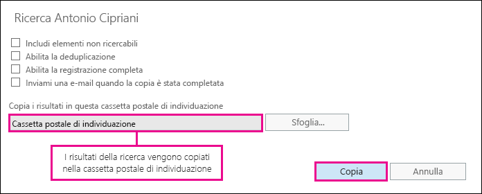
  
7. Fare clic su **Aggiorna** per aggiornare le informazioni sullo stato della copia visualizzate nel riquadro dei dettagli.Click **Refresh** to update the information about the copying status that is displayed in the details pane. 
    
8. Al termine della copia, fare clic su **Apri** per aprire la cassetta postale di individuazione e visualizzare i risultati della ricerca.When the copying is complete, click **Open** to open the Discovery Search Mailbox to view the search results. 
    
    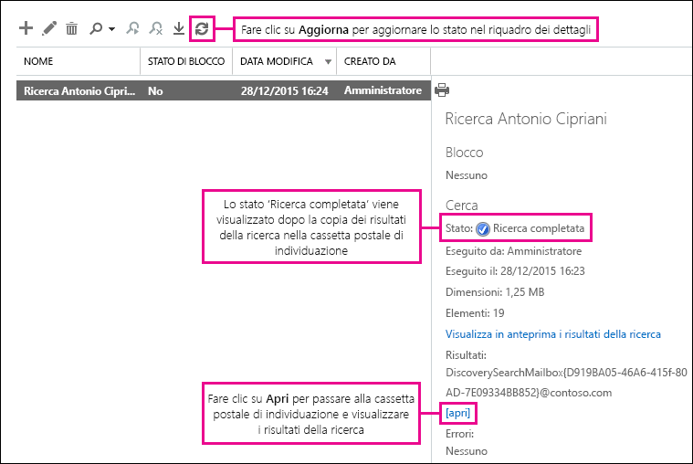
  
    I risultati della ricerca copiati nella cassetta postale di individuazione vengono inseriti in una cartella con lo stesso nome della ricerca eDiscovery sul posto.The search results copied to the Discovery Search Mailbox are placed in a folder that has the same name as the In-Place eDiscovery search. È possibile fare clic su una cartella per visualizzare gli elementi presenti.You can click a folder to display the items in that folder.
    
    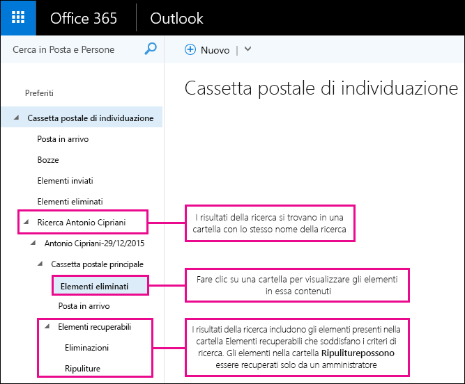
  
    Quando si esegue una ricerca, la ricerca viene effettuata anche nella cartella Elementi ripristinabili dell'utente.When you run a search, the user's Recoverable Items folder is also searched. Pertanto, se gli elementi nella cartella Elementi ripristinabili soddisfano i criteri di ricerca, vengono inclusi nei risultati della ricerca.That means if items in the Recoverable Items folder meet the search criteria, they are included in the search results. Gli elementi nella cartella Eliminazioni sono gli elementi eliminati in modo permanente dall'utente: gli elementi eliminati dalla cartella Posta eliminata oppure gli elementi selezionati con successiva esecuzione di **MAIUC+CANC**.Items in the Deletions folder are items that the user permanently deleted (by deleting an item from the Deleted Items folder or by selecting it and pressing **Shift+Delete**. Un utente può usare lo strumento Recupera Posta eliminata in Outlook o Outlook sul Web per recuperare gli elementi nella cartella Eliminazioni.A user can use the Recover Deleted Items tool in Outlook or Outlook on the web to recover items in the Deletions folder. Gli elementi nella cartella Ripuliture sono elementi che l'utente ha eliminato tramite lo strumento Recupera elementi eliminati o eliminati automaticamente dai criteri applicati alla cassetta postale.Items in the Purges folder are items that the user purged by using the Recover Deleted Items tool or items they were automatically purged by a policy applied to the mailbox. In entrambi i casi, solo un amministratore può recuperare gli elementi nella cartella Ripuliture.In either case, only an admin can recover items in the Purges folder. 
    
    > [!TIP]
    > Se un utente non riesce a trovare un elemento eliminato tramite lo strumento Elementi ripristinabili, ma tale elemento è comunque ripristinabile, in quanto non è stato rimosso definitivamente dalla cassetta postale, è molto probabile che si trovi nella cartella Purges.If a user can't find a deleted item using the Recoverable Items tool, but that item is still recoverable (meaning that it hasn't been permanently removed from the mailbox), it's more than likely located in the Purges folder. Pertanto, assicurarsi di controllare la cartella Ripuliture per cercare gli elementi eliminati che si vuole recuperare per un utente.So, be sure to look in the Purges folder for the deleted item you're trying to recover for a user. 
  
[Inizio paginaReturn to top](recover-deleted-items-in-a-mailbox.md)
  
## Passaggio 4: Esportare i risultati della ricerca in un file PSTStep 4: Export the search results to a PST file

Dopo aver individuato l'elemento che si vuole recuperare per un utente, occorre esportare i risultati della ricerca eseguita al passaggio 2 in un file PST.After you find the item you're trying to recover for a user, the next step is to export the results from the search you ran in Step 2 to a PST file. L'utente userà questo file PST nel passaggio successivo per ripristinare l'elemento eliminato nella propria cassetta postale.The user will use this PST file in the next step to restore the deleted item to their mailbox.
  
1. Nell'interfaccia di amministrazione di Exchange passare a **Gestione conformità**\>**eDiscovery &amp; blocco sul posto**.In the Exchange admin center, go to **Compliance management** \> **In-Place eDiscovery &amp; Hold**.
    
2. Nell'elenco delle ricerche selezionare la ricerca creata nel passaggio 2.In the list of searches, select the search that you created in Step 2.
    
3. Fare clic su **Esporta in un file PST**.Click **Export to a PST file**.
    
    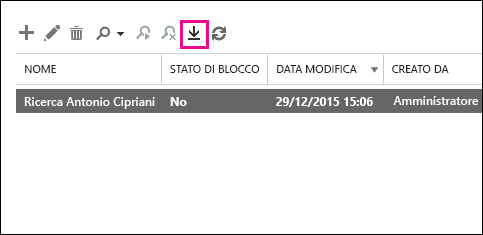
  
4. Se viene richiesto di installare lo strumento di esportazione di eDiscovery, fare clic su **Esegui**.If you're prompted to install the eDiscovery Export Tool, click **Run**.
    
5. Nello strumento di esportazione PST eDiscovery fare clic su **Sfoglia** per specificare il percorso in cui si vuole scaricare il file PST.In the eDiscovery PST Export Tool, click **Browse** to specify the location where you want to download the PST file. 
    
    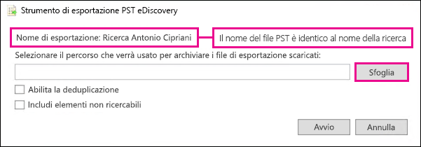
  
    È possibile ignorare le opzioni per abilitare la deduplicazione e includere elementi non ricercabili.You can ignore the options to enable deduplication and include unsearchable items.
    
6. Fare clic su **Start** per scaricare il file PST nel computer.Click **Start** to download the PST file to your computer. 
    
    Lo **strumento di esportazione di eDiscovery** mostra le informazioni relative all stato del processo di esportazione.The **eDiscovery PST Export Tool** displays status information about the export process. Quando l'esportazione è completa, è possibile accedere al file nella posizione in cui è stato scaricato.When the export is complete, you can access the file in the location where it was downloaded. 
    
[Inizio paginaReturn to top](recover-deleted-items-in-a-mailbox.md)
  
## Passaggio 5: Ripristinare gli elementi recuperati nella cassetta postale dell'utenteStep 5: Restore the recovered items to the user's mailbox

Il passaggio finale consiste nell'usare il file PST esportato nel passaggio 4 per ripristinare gli elementi recuperati nella cassetta postale dell'utente.The final step is to use the PST file that was exported in step 4 to restore the recovered items to the user's mailbox. Dopo l'invio del file PST, l'utente esegue la parte restante di questo passaggio per aprire il file PST e quindi spostare gli elementi recuperati in un'altra cartella nella propria cassetta postale.After you send the PST file to the user, the remainder of this step is performed by the user to open the PST file and then move the recovered items to another folder in their mailbox. Per istruzioni dettagliate, è anche possibile inviare all'utente un collegamento a questo argomento: [Aprire e chiudere file di dati di Outlook (PST)](https://support.office.com/article/381b776d-7511-45a0-953a-0935c79d24f2).For step-by-step instructions, you can also send the user a link to this topic: [Open and close Outlook Data Files (.pst)](https://support.office.com/article/381b776d-7511-45a0-953a-0935c79d24f2). In alternativa, è possibile inviare all'utente un collegamento alla sezione [Ripristinare gli elementi eliminati in una cassetta postale tramite un file PST](recover-deleted-items-in-a-mailbox.md#restoredeleteditems) e chiedergli di eseguire questa procedura.Or you can send the user a link to the [Restore deleted items to a mailbox using a PST file](recover-deleted-items-in-a-mailbox.md#restoredeleteditems) section below and ask them to perform these steps. 
  
 **Inviare il file PST all'utente****Send the PST file to the user**
  
Il passaggio finale che è necessario eseguire è inviare all'utente il file PST esportato al passaggio 4.The final step that you need to perform is sending the PST file that was exported in step 4 to the user. Questa operazione si può eseguire in vari modi:There are a few ways to do this:
  
- Allegare il file PST a un messaggio di posta elettronica.Attach the PST file to an email message. Se Outlook è configurato per bloccare i file PST, sarà necessario comprimere il file e quindi allegarlo al messaggio.If Outlook is configured to block PST files, then you will have to zip the file and then attach it to the message. Ecco come:Here's how:
    
1. In Windows Explorer o File Explorer passare al file PST.In Windows Explorer or File Explorer, browse to the PST file.
    
2. Fare clic con il pulsante destro del mouse sul file, quindi selezionare **Invia a** \> **Cartella compressa**.Right-click the file, and then select **Send to** \> **Compressed (zipped) folder**. Windows crea un nuovo file ZIP a cui assegna lo stesso nome del file PST.Windows creates a new zip file and gives it an identical name as the PST file.
    
3. Allegare il file PST compresso a un messaggio di posta elettronica e inviarlo all'utente, che potrà poi decomprimere il file semplicemente facendo clic su di esso.Attach the compressed PST file to an email message and send it to the user, who can then decompress the file just by clicking it.
    
- Copiare il file PST in una cartella condivisa a cui l'utente potrà accedere per recuperarlo.Copy the PST file to a shared folder that the user can access and retrieve it.
    
La procedura descritta nella sezione seguente viene eseguita dall'utente per ripristinare gli elementi eliminati nella propria cassetta postale.The steps in the next section are performed by the user to restore the deleted items to their mailbox.
  
 
**Ripristinare gli elementi eliminati in una cassetta postale tramite un file PST****Restore deleted items to a mailbox using a PST file**
  
Per ripristinare un elemento eliminato tramite un file PST, è necessario usare l'app desktop di Outlook.You have to use the Outlook desktop app to restore a deleted item by using a PST file. Non è possibile usare Outlook Web App o Outlook sul Web per aprire un file PST.You can't use Outlook Web App or Outlook on the web to open a PST file.
  
1. In Outlook 2013 o Outlook 2016 fare clic sulla scheda **File**.In Outlook 2013 or Outlook 2016, click the **File** tab. 
    
2. Fare clic su **Apri &amp; esporta** e quindi su **Apri file di dati di Outlook**.Click **Open &amp; Export**, and then click **Open Outlook Data File**.
    
3. Passare al percorso in cui è stato salvato il file PST inviato dall'amministratore.Browse to the location where you saved the PST file that your administrator sent.
    
4. Selezionare il file PST e poi fare clic su **Apri**.Select the PST and then click **Open**.
    
    Il file PST viene visualizzato nella barra di spostamento sinistra di Outlook.The PST file appears in the left-nav bar in Outlook.
    
    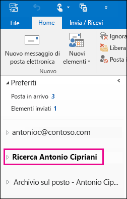
  
5. Fare clic sulle frecce per espandere il file PST e le cartelle secondarie per individuare l'elemento da recuperare.Click the arrows to expand the PST file and the folders under it to locate the item you want to recover.
    
    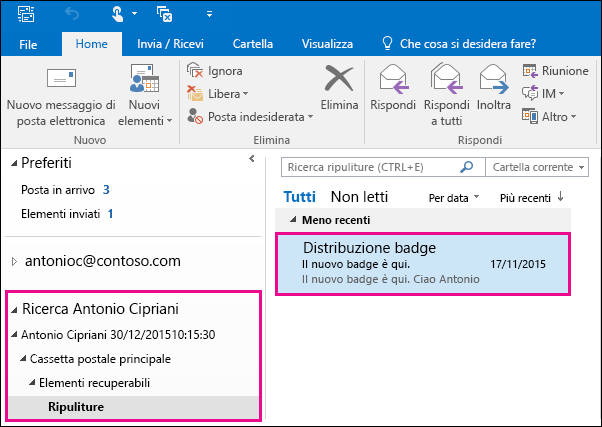
  
    > [!TIP]
    > Cercare l'elemento da recuperare nella cartella Ripuliture.Look in the Purges folder for the item you want to recover. Si tratta di una cartella nascosta in cui vengono spostati gli elementi eliminati.This is a hidden folder that purged items are moved to. È probabile che l'elemento recuperato dall'amministratore sia in questa cartella.It's likely the item that your administrator recovered is in this folder. 
  
6. Fare clic con il pulsante destro del mouse sull'elemento da recuperare e poi fare clic su **Sposta** \> **Altra cartella**.Right-click the item you want to recover and then click **Move** \> **Other Folder**.
    
    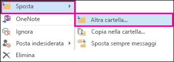
  
7. Per spostare l'elemento nella cartella Posta in arrivo, fare clic su **Posta in arrivo** e poi su **OK**.To move the item to your inbox, click **Inbox**, and then click **OK**.
    
    **Suggerimento:** Per recuperare altri tipi di elementi, eseguire una delle operazioni seguenti:**Tip:** To recover other types of items, do one of the following: 
    
  - Per recuperare un elemento del calendario, fare clic su di esso con il pulsante destro del mouse e scegliere **Sposta** \> **Altra cartella** \> **Calendario**.To recover a calendar item, right-click it, and then click **Move** \> **Other Folder** \> **Calendar**.
    
  - Per recuperare un contatto, fare clic su di esso con il pulsante destro del mouse e scegliere **Sposta** \> **Altra cartella** \> \*\* Contatti\*\*.To recover a contact, right-click it, and then click **Move** \> **Other Folder** \> **Contacts**.
    
  - Per recuperare un'attività, fare clic su di essa con il pulsante destro del mouse e scegliere **Sposta** \> **Altra cartella** \> **Attività**.To recover a task, right-click it, and then click **Move** \> **Other Folder** \> **Tasks**.
    
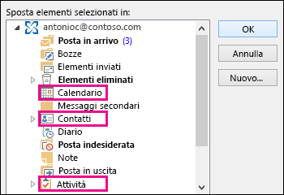
  
   > [!NOTE]
   > Gli elementi del calendario, i contatti e le attività si trovano direttamente nella cartella Ripuliture e non in una sottocartella del calendario, dei contatti o delle attività.Calendar items, contacts, and tasks are located directly in the Purges folder, and not in a Calendar, Contacts, or Tasks subfolder. È possibile tuttavia ordinare per **tipo** per raggruppare i tipi di elementi simili.However, you can sort by **Type** to group similar types of items. 
    
8. Dopo aver completato il recupero degli elementi eliminati, fare clic con il pulsante destro del mouse sul file PST nella barra di spostamento sinistra e selezionare **Chiudi "nome del file PST"**.When you're finished recovering deleted items, right-click the PST file in the left-nav bar and select **Close "name of PST file"**.
    
[Inizio paginaReturn to top](recover-deleted-items-in-a-mailbox.md)
  
## Altre informazioniMore information

- Un utente può recuperare un elemento eliminato definitivamente, se il periodo di conservazione degli elementi eliminati non è scaduto.It might be possible for a user to recover a permanently deleted item if the deleted item retention period for the item hasn't expired. È possibile che l'amministratore abbia specificato per quanto tempo sono disponibili gli elementi nella cartella Elementi ripristinabili.As an admin you may have specified how long items in the Recoverable Items folder are available for recovery. Ad esempio, possono essere stati configurati dei criteri in base ai quali tutti gli elementi contenuti nella cartella Posta eliminata vengono eliminati dopo 30 giorni e altri criteri che consentono di recuperare gli elementi nella cartella Elementi ripristinabili per altri 14 giorni.For example, there might be a policy that deletes anything that's been in a user's Deleted Items folder for 30 days, and another policy that lets users recover items in the Recoverable Items folder for up to another 14 days. Tuttavia, dopo 14 giorni, è ancora possibile recuperare un elemento della cassetta postale di un utente tramite le procedure descritte in questo argomento.However, after this 14 days, you may still be able to recover an item in a user's mailbox by using the procedures in this topic.
    
- Gli utenti possono ripristinare un elemento se non è stato rimosso e se non è scaduto il periodo di conservazione per quell'elemento.Users can recover a deleted item if it hasn't been purged and if the deleted item retention period for that item hasn't expired. Per aiutare gli utenti a recuperare gli elementi eliminati nella propria cassetta postale, suggerire loro di consultare gli argomenti seguenti:To help users recover deleted items in their mailbox, point them to one of the following topics:
    
  - [Ripristinare gli elementi eliminati in Outlook per WindowsRecover deleted items in Outlook for Windows](https://support.office.com/article/49e81f3c-c8f4-4426-a0b9-c0fd751d48ce)
    
  - [Ripristinare gli elementi eliminati in Outlook 2010Recover deleted items in Outlook 2010](https://support.office.com/article/cd9dfe12-8e8c-4a21-bbbf-4bd103a3f1fe)
    
  - [Recuperare elementi o messaggi di posta elettronica eliminati in Outlook Web AppRecover deleted items or email in Outlook Web App](https://support.office.com/article/c3d8fc15-eeef-4f1c-81df-e27964b7edd4)
    
  - [Ripristinare i messaggi di posta elettronica eliminati in Outlook sul WebRestore deleted email messages in Outlook on the web](https://support.office.com/article/a8ca78ac-4721-4066-95dd-571842e9fb11)
    
  - [Recuperare un contatto eliminato in OutlookRecover a deleted contact in Outlook](https://support.office.com/article/51c83288-6888-4dcd-8c99-4932daabf643)
    
  - [Ripristinare i messaggi di posta elettronica eliminati in Outlook.comRestore deleted email messages in Outlook.com](https://go.microsoft.com/fwlink/p/?LinkID=623435)
    
[Inizio paginaReturn to top](recover-deleted-items-in-a-mailbox.md)
  

