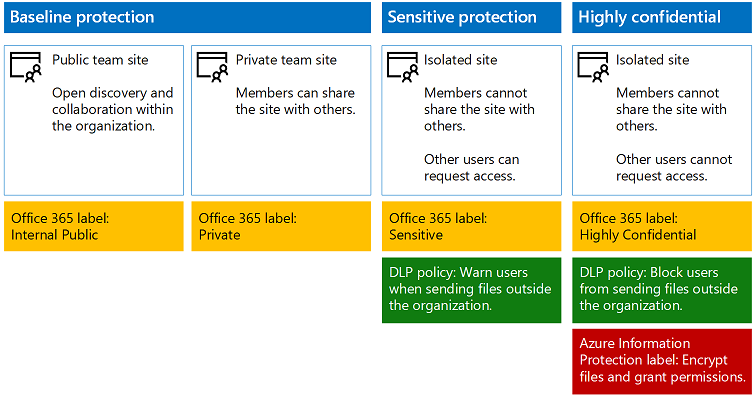
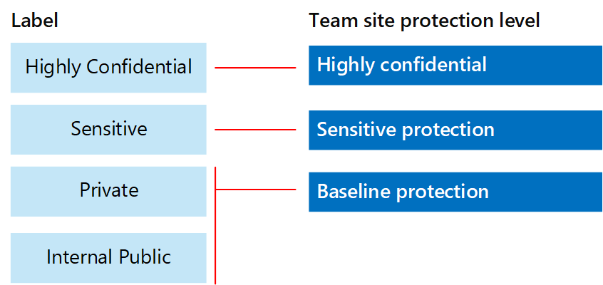
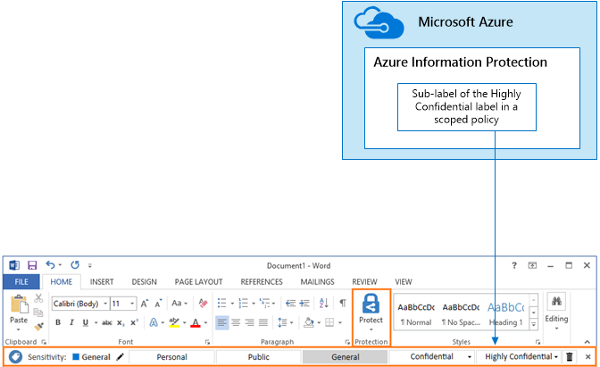

# Protezione di file e siti di SharePoint Online

 **Riepilogo:** Configurazioni consigliate per la protezione dei file in SharePoint Online e Office 365.
  
In questo articolo vengono forniti suggerimenti per la configurazione di SharePoint Online siti del team e protezione dei file che offre un buon livello di protezione e semplicità di collaborazione. In questo articolo definisce quattro diverse configurazioni, a partire da un sito pubblico all'interno dell'organizzazione con i criteri di condivisione più aperti. Ogni configurazione aggiuntiva rappresenta una fase significativa backup in protezione, ma la possibilità di accedere e collaborare su risorse viene ridotta per il gruppo di utenti. Utilizzare queste procedure consigliate come punto di partenza e modificare le configurazioni per soddisfare le esigenze dell'organizzazione. 
  
In questo articolo le configurazioni sono allineate con i suggerimenti di Microsoft per i tre livelli di protezione dei dati, identità e dispositivi:
  
- Protezione di base
    
- Protezione di dati riservati
    
- Protezione di dati estremamente riservati
    
Per ulteriori informazioni su questi livelli e sulle funzionalità consigliate per ogni livello, vedere le risorse seguenti.  
  
- [Protezione di dispositivi e identità per Office 365](microsoft-cloud-it-architecture-resources.md#BKMK_O365IDP)
    
- [Soluzioni per la protezione dei file in Office 365](microsoft-cloud-it-architecture-resources.md#BKMK_O365fileprotect)
    
## Panoramica delle funzionalità

Suggerimenti per il disegno di siti del team di SharePoint Online su un'ampia gamma di funzionalità di Office 365. Per i siti con dati estremamente riservati, è consigliabile Protezione delle informazioni di Azure. Questo è incluso in Enterprise Mobility + Security (EMS).  
  
La figura seguente mostra le configurazioni consigliate per quattro siti del team di SharePoint Online.
  

  
Come illustrato:
  
- la protezione di base include due opzioni per i siti del team di SharePoint Online, un sito pubblico e uno privato. I siti pubblici possono essere individuati e sono accessibili da chiunque nell'organizzazione. I siti privati possono essere individuati e sono accessibili solo dai membri del sito. Entrambe le configurazioni del sito consentono la condivisione all'esterno del gruppo.  
    
- I siti per la protezione di dati riservati ed estremamente riservati sono siti privati con accesso limitato solo ai membri di gruppi specifici.
    
- 	Le etichette di Office 365 consentono di classificare i dati con un livello di protezione necessario. Tutti i siti del team di SharePoint Online sono configurati per assegnare automaticamente un’etichetta ai file nelle raccolte documenti con un'etichetta predefinita per il sito. Le etichette riportate nell’esempio sono Dati pubblici interni, Dati privati, Dati riservati e Dati estremamente riservati, in corrispondenza delle quattro configurazioni del sito. Gli utenti possono modificare le etichette, ma grazie a questa configurazione tutti i file ricevono un'etichetta predefinita.
    
- I criteri di prevenzione della perdita dei dati sono configurati affinché le etichette di Office 365 Riservati ed Estremamente riservati avvisino o impediscano agli utenti quando provano a inviare questi tipi di file all'esterno dell'organizzazione
    
- Per i siti configurati con livello di protezione Dati estremamente riservati, Azure Information Protection esegue la crittografia e concede autorizzazioni per i file.
    
## Impostazioni a livello di tenant per SharePoint Online e OneDrive for Business

SharePoint Online e OneDrive for Business includono impostazioni a livello di tenant che influiscono su tutti i siti e gli utenti. Alcune di queste impostazioni possono essere modificate a livello di sito per essere più restrittive (ma non meno restrittive). In questa sezione vengono illustrate le impostazioni a livello di tenant che influiscono su sicurezza e collaborazione.  
  
### Condivisione

Per questa soluzione, si consiglia di seguire le seguenti impostazioni a livello di tenant:
  
- Mantenere il criterio di condivisione predefinito che consente la condivisione di tutti i contenuti con ogni tipo di account, inclusa la condivisione anonima.
    
- Impostare la scadenza dei collegamenti anonimi, se desiderato.
    
- Modificare il tipo di collegamento predefinito per la condivisione in Dati interni. Ciò consente di impedire la perdita accidentale dei dati all’esterno dell'organizzazione.
    
Consentire la condivisione esterna potrebbe sembrare poco intuitivo, tuttavia, tale approccio fornisce maggiore controllo sulla condivisione dei file rispetto all'invio di file tramite posta elettronica. SharePoint Online e Outlook interagiscono per fornire esperienze di collaborazione sui file protetta.  
  
- Per impostazione predefinita, Outlook condivide un collegamento a un file invece di inviare il file tramite posta elettronica.  
    
- SharePoint Online e OneDrive for Business facilitano la condivisione dei collegamenti ai file con i collaboratori interni ed esterni all'organizzazione
    
L’utente, inoltre, dispone di controlli utili per gestire la condivisione esterna. Ad esempio, è possibile:
  
- Disabilitare un collegamento guest anonimo.
    
- Revocare l'accesso degli utenti a un sito.
    
- Vedere chi ha accesso a un sito o documento specifico.
    
- Impostare la scadenza dei collegamenti di condivisione anonima (impostazione tenant).
    
- Limitare il numero di utenti che possono condividere all'esterno dell'organizzazione (impostazione tenant).
    
### Utilizzo della condivisione esterna con la prevenzione della perdita di dati (DLP)

Se non si consente la condivisione esterna, gli utenti con un'azienda necessario accedere a metodi e gli strumenti alternativi. È consigliabile che è combinare condivisione esterna con i criteri DLP per proteggere i file riservati e altamente riservati.
  
### Impostazioni di accesso al dispositivo

Impostazioni di accesso di dispositivi per SharePoint Online e OneDrive for Business consentono di determinare se l'accesso è limitato solo per il browser (non è possibile scaricare i file) o se viene bloccato l'accesso. Queste impostazioni sono attualmente nella prima versione e si applicano a livello di tenant. Disponibile a breve è la possibilità di configurare i criteri di accesso dispositivo a livello di sito. Per questa soluzione, è consigliabile non utilizzare impostazioni di accesso di dispositivi che si applicano a livello di tenant.
  
Utilizzare le impostazioni di accesso di dispositivi mentre sono disponibili in prima versione: [impostare Standard o opzioni prima versione di Office 365](https://support.office.com/article/Set-up-the-Standard-or-First-Release-options-in-Office-365-3B3ADFA4-1777-4FF0-B606-FB8732101F47).
  
### OneDrive for Business

Visitare queste impostazioni per decidere se modificare le impostazioni predefinite per i siti OneDrive for Business. Attualmente, le impostazioni di condivisione e di accesso al dispositivo vengono duplicate dall'interfaccia di amministrazione di SharePoint Online e vengono applicate in entrambi gli ambienti.
  
## Configurazione del sito del team di SharePoint

La tabella seguente contiene il riepilogo delle operazioni di configurazione per ognuno dei siti del team descritti in precedenza in questo articolo. Utilizzare queste configurazioni come suggerimenti da cui partire per modificare i tipi di siti in modo da soddisfare le esigenze dell'organizzazione. Non tutte le organizzazioni necessitano di tutti i tipi di siti. Solo un numero limitato di organizzazioni richiede una protezione estremamente riservata.
  
||||||
|:-----|:-----|:-----|:-----|:-----|
||**Protezione di base #1**   |**Protezione di base #2**   |**Protezione dati riservati**   |**Altamente riservati**   |
|Descrizione    |Aprire lo strumento di individuazione e collaborazione all'interno dell'organizzazione.    |Gruppo e siti privati con condivisione consentita all'esterno del gruppo.    |Sito isolato, in cui vengono definiti i livelli di accesso in base all'appartenenza a gruppi specifici. Condivisione consentita solamente ai membri del sito. I criteri DLP avvisano gli utenti quando provano a inviare file all'esterno dell'organizzazione.    |Sito isolato + la crittografia dei file e delle autorizzazioni con la protezione delle informazioni di Azure. DLP impedisce l'invio di file all'esterno dell'organizzazione.    |
|Sito del team pubblico o privato    |Pubblico    |Privato    |Privato    |Dati privati    |
|Utenti che hanno accesso    |Tutti gli utenti dell'organizzazione, inclusi gli utenti B2B e gli utenti guest.    |Solo i membri del sito. Altri utenti possono richiedere l'accesso.    |Solo i membri del sito. Altri utenti possono richiedere l'accesso.    |Solo i membri. Altri utenti non possono richiedere l'accesso.    |
|Controlli di condivisione a livello di sito    |Condivisione consentita con chiunque. Impostazioni predefinite.    |Condivisione consentita con chiunque. Impostazioni predefinite.    |I membri non possono condividere l'accesso al sito.    Chi non è membro può richiedere l'accesso al sito, ma queste richieste devono essere gestite solo dall'amministratore del sito.    |I membri non possono condividere l'accesso al sito.    Chi non è membro non può richiedere l'accesso al sito o ai contenuti.    |
|Controlli di accesso al dispositivo a livello di sito    |Nessun controllo aggiuntivo.    |Nessun controllo aggiuntivo.    |Controlli a livello di sito, presto disponibili, impediscono agli utenti di scaricare file su dispositivi collegati non compatibili o non di dominio. Ciò consente di accedere solo al browser da tutti gli altri dispositivi.    |Controlli a livello di sito, presto disponibili, impediscono agli utenti di scaricare file su dispositivi collegati non compatibili o non appartenenti al dominio.    |
|Etichette di Office 365    |Pubblico di livello interno    |Dati privati    |Riservato    |Estremamente riservato    |
|Criteri DLP    |||Avvisare gli utenti durante l'invio di file che sono etichettati come Riservati all'esterno dell'organizzazione.    Per bloccare la condivisione esterna di tipi di dati riservati, ad esempio numeri di carta di credito o altri dati personali, è possibile configurare criteri DLP aggiuntivi per questi tipi di dati (inclusi i tipi di dati personalizzati che è necessario configurare).    |Impedire agli utenti di inviare file etichettati come estremamente riservati all'esterno dell'organizzazione. Consentire agli utenti di sostituire questa impostazione specificando giustificazioni, inclusa l’informazione sugli utenti con cui si condivide il file.    |
|Protezione delle informazioni di Azure    ||||Utilizzare Protezione delle informazioni di Azure per crittografare automaticamente i file e concedere autorizzazioni per essi. Questo tipo di protezione viaggia con i file in caso di perdita.     Office 365 non è in grado di leggere i file crittografati con la protezione delle informazioni di Azure. Inoltre, i criteri DLP possono funzionano solo con i metadati (incluse le etichette), ma non il contenuto di questi file (ad esempio numeri di carta di credito all'interno dei file).    |
   
Per la procedura distribuire i quattro tipi diversi di SharePoint Online siti dei team in questa soluzione, vedere [distribuzione di SharePoint Online di siti per tre livelli di protezione](deploy-sharepoint-online-sites-for-three-tiers-of-protection.md). Per la procedura creare un ambiente di sviluppo e di testing, vedere [Secure SharePoint Online di siti in un ambiente di sviluppo e di testing](secure-sharepoint-online-sites-in-a-dev-test-environment.md). 
  
## Etichette e classificazione di Office 365

È consigliabile utilizzare le etichette di Office 365 per gli ambienti con i dati riservati. Dopo aver configurato e pubblicare le etichette di Office 365:
  
- È possibile applicare un'etichetta predefinita a una raccolta documenti in un sito del team di SharePoint Online, in modo che tutti i documenti nella raccolta dispongano di un'etichetta predefinita.  
    
- È possibile applicare automaticamente etichette al contenuto se questo soddisfa le condizioni specifiche.
    
- È possibile applicare i criteri DLP che dipendono da etichette di Office 365.
    
- Gli utenti dell'organizzazione possono applicare un'etichetta manualmente al contenuto in Outlook sul web, Outlook 2010 e versioni successive, OneDrive per i gruppi aziendali, SharePoint Online e Office 365. Gli utenti rilevano spesso meglio il tipo di contenuto che stanno, in modo che la classificazione viene e stato applicato il criterio DLP appropriato.
    

  
Come illustrato, questa soluzione include la creazione delle etichette seguenti:
  
- Dati estremamente riservati
    
- Riservato
    
- Dati privati
    
- Pubblico di livello interno
    
Queste etichette vengono mappate ai siti consigliati in illustrazioni e grafici presenti nelle sezioni precedenti di questo articolo. In questa soluzione viene consigliato di configurare criteri DLP per impedire la perdita di dati considerati riservati ed estremamente riservati.
  
Per le procedure configurare le etichette di Office 365 e criteri DLP in questa soluzione, vedere [file proteggere SharePoint Online con Office 365 etichette e DLP](protect-sharepoint-online-files-with-office-365-labels-and-dlp.md).
  
## Protezione delle informazioni di Azure

Per applicare etichette e impostazioni di protezione che seguono i file ovunque, utilizzare la protezione delle informazioni di Azure. Per questa soluzione, è consigliabile che utilizzare un'etichetta secondaria dell'etichetta altamente riservati e un criterio di protezione delle informazioni Azure con ambito per la crittografia e concedere le autorizzazioni per i file che devono essere protette con il livello massimo di protezione. 
  
Tenere presente che quando si applica crittografia Azure Information Protection per i file archiviati in Office 365, il servizio non riesce ad elaborare il contenuto di questi file. Creazione condivisa, eDiscovery, ricerca, Delve e altre funzionalità di collaborazione non funzionano. I criteri DLP possono funzionano solo con i metadati (incluse le etichette di Office 365), ma non il contenuto di questi file (ad esempio numeri di carta di credito all'interno dei file).
  

  
Come illustrato:
  
- Criteri di protezione delle informazioni Azure e le etichette vengono configurate nel portale dei Microsoft Azure. È consigliabile configurare un'etichetta secondarie di un criterio di protezione delle informazioni Azure con ambito.
    
- Protezione delle informazioni Azure etichette Mostra backup sotto forma di una barra di **protezione delle informazioni** nelle applicazioni di Office.
    
### Aggiunta di autorizzazioni per gli utenti esterni

Esistono due modi è possibile concedere agli utenti esterni l'accesso ai file protetta con la protezione delle informazioni di Azure. In entrambi i casi, gli utenti esterni devono disporre di un account di Azure Active Directory. Se gli utenti esterni non sono membri di un'organizzazione che utilizza Azure Active Directory, è possibile ottenere un account di Azure Active Directory come un singolo utente utilizzando la pagina di accesso: [https://aka.ms/aip-signup](https://aka.ms/aip-signup).
  
- Aggiungere utenti esterni a un gruppo di Azure Active Directory che consente di configurare la protezione per un'etichetta
    
     È necessario innanzitutto aggiungere l'account come utente B2B nella directory. Può richiedere alcune ore per [l'appartenenza al gruppo la memorizzazione nella cache per Azure Rights Management](https://docs.microsoft.com/information-protection/plan-design/prepare#group-membership-caching-by-azure-rights-management). Con questo metodo, vengono concesse autorizzazioni per tutti i file esistenti protetti con l'etichetta (compresi i file protetti da prima dell'aggiunta di un utente al gruppo di Azure Active Directory).
    
- Aggiungere gli utenti esterni direttamente alla protezione etichetta
    
     È possibile aggiungere tutti gli utenti da un'organizzazione (ad esempio Fabrikam.com), un gruppo di Azure Active Directory (ad esempio, un gruppo Finanza all'interno dell'organizzazione) o un singolo utente. Ad esempio, è possibile aggiungere un team di mobiliari esterno per la protezione di un controllo label. Con questo metodo, vengono concesse autorizzazioni solo per i file protetti con l'etichetta dopo l'aggiunta di entità esterna per la protezione.
    
### Distribuzione e utilizzo di Protezione delle informazioni di Azure

Per le procedure configurare la protezione delle informazioni di Azure in questa soluzione, vedere [file proteggere SharePoint Online con la protezione delle informazioni di Azure](protect-sharepoint-online-files-with-azure-information-protection.md).
  
## Vedere anche

[Guida sulla sicurezza Microsoft per organizzazioni che si occupano della campagna politica, no profit e altre organizzazioni agili](microsoft-security-guidance-for-political-campaigns-nonprofits-and-other-agile-o.md)
  
[Soluzioni di sicurezza](security-solutions.md)
  
[Adozione del cloud e soluzioni ibride](cloud-adoption-and-hybrid-solutions.md)
  
[Proteggere i siti di SharePoint Online in un ambiente di sviluppo e di testing](secure-sharepoint-online-sites-in-a-dev-test-environment.md)

