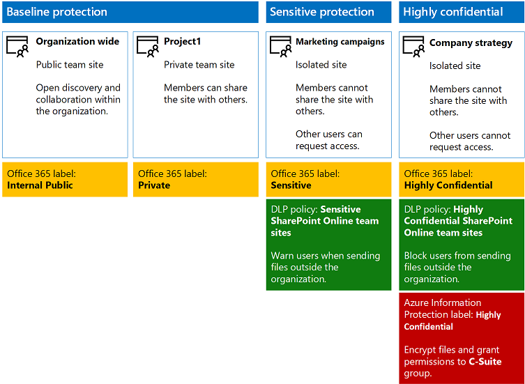
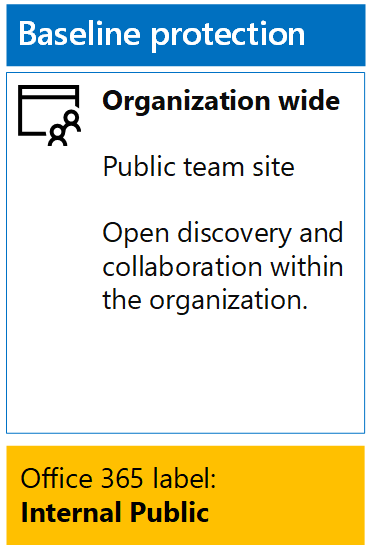
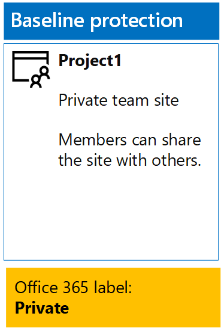
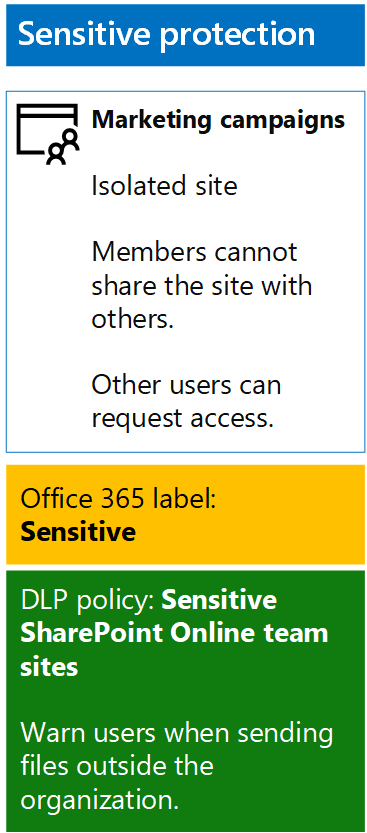
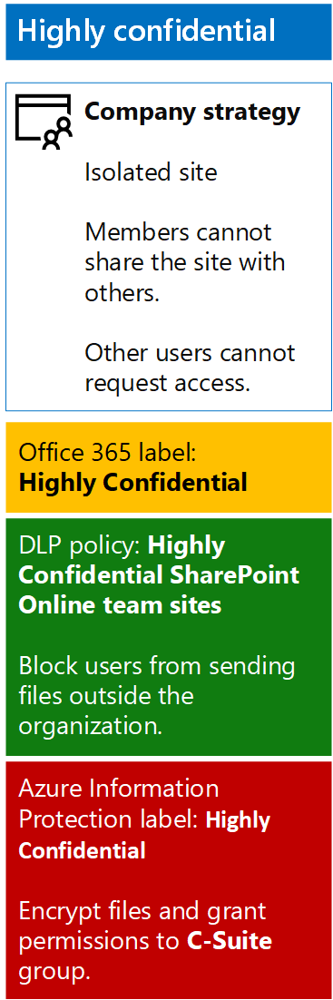

# <a name="secure-sharepoint-online-sites-in-a-devtest-environment"></a><span data-ttu-id="89372-103">Proteggere i siti di SharePoint Online in un ambiente di sviluppo e di testing</span><span class="sxs-lookup"><span data-stu-id="89372-103">Secure SharePoint Online sites in a dev/test environment</span></span>

 <span data-ttu-id="89372-104">**Riepilogo:** Creare siti di team di SharePoint Online pubblici, privati, riservati e altamente riservati in un ambiente di sviluppo e di testing.</span><span class="sxs-lookup"><span data-stu-id="89372-104">**Summary:** Create public, private, sensitive, and highly confidential SharePoint Online team sites in a dev/test environment.</span></span>
  
<span data-ttu-id="89372-105">In questo articolo vengono fornite istruzioni dettagliate per creare un ambiente di sviluppo e di testing che include quattro diversi tipi di siti del team SharePoint Online per la soluzione di [file e siti di SharePoint Online sicura](secure-sharepoint-online-sites-and-files.md) .</span><span class="sxs-lookup"><span data-stu-id="89372-105">This article provides step-by-step instructions to create a dev/test environment that includes the four different types of SharePoint Online team sites for the [Secure SharePoint Online sites and files](secure-sharepoint-online-sites-and-files.md) solution.</span></span>
  

  
<span data-ttu-id="89372-107">Utilizzare questo ambiente di sviluppo e di testing per sperimentare i comportamenti di protezione delle informazioni e l'ottimizzazione delle impostazioni in base alle esigenze prima della distribuzione di SharePoint Online siti del team nell'ambiente di produzione.</span><span class="sxs-lookup"><span data-stu-id="89372-107">Use this dev/test environment to experiment with the information protection behaviors and fine-tune settings for your specific needs before deploying SharePoint Online team sites in production.</span></span>
  
## <a name="phase-1-create-your-devtest-environment"></a><span data-ttu-id="89372-108">Fase 1: Creare l'ambiente di sviluppo e di testing</span><span class="sxs-lookup"><span data-stu-id="89372-108">Phase 1: Create your dev/test environment</span></span>

<span data-ttu-id="89372-109">In questa fase è ottenere sottoscrizioni di valutazione di Office 365 e mobilità aziendale + sicurezza per le organizzazioni fittizia.</span><span class="sxs-lookup"><span data-stu-id="89372-109">In this phase, you obtain trial subscriptions for Office 365 and Enterprise Mobility + Security for a fictional organization.</span></span>
  
<span data-ttu-id="89372-110">Per prima cosa, seguire le istruzioni nella **fase 2** dell' [ambiente di sviluppo e di testing di Office 365](office-365-dev-test-environment.md).</span><span class="sxs-lookup"><span data-stu-id="89372-110">First, follow the instructions in **Phase 2** of the [Office 365 dev/test environment](office-365-dev-test-environment.md).</span></span>
  
<span data-ttu-id="89372-111">Successivamente, Esegui l'iscrizione per la sottoscrizione di prova EMS e come aggiungerla alla stessa organizzazione la sottoscrizione di prova di Office 365.</span><span class="sxs-lookup"><span data-stu-id="89372-111">Next, sign up for the EMS trial subscription and add it to the same organization as your Office 365 trial subscription.</span></span>
  
1. <span data-ttu-id="89372-p101">Se necessario, accedere al portale di Office 365 con le credenziali dell'account amministratore globale della sottoscrizione di prova. Per ulteriori informazioni, vedere [la posizione in cui eseguire l'accesso a Office 365](https://support.office.com/Article/Where-to-sign-in-to-Office-365-e9eb7d51-5430-4929-91ab-6157c5a050b4).</span><span class="sxs-lookup"><span data-stu-id="89372-p101">If needed, sign in to the Office 365 portal with the credentials of the global administrator account of your trial subscription. For help, see [Where to sign in to Office 365](https://support.office.com/Article/Where-to-sign-in-to-Office-365-e9eb7d51-5430-4929-91ab-6157c5a050b4).</span></span>
    
2. <span data-ttu-id="89372-114">Fare clic sul riquadro **Amministratore**.</span><span class="sxs-lookup"><span data-stu-id="89372-114">Click the **Admin** tile.</span></span>
    
3. <span data-ttu-id="89372-115">Scheda di **interfaccia di amministrazione di Office** nel browser, nel riquadro di spostamento sinistra fare clic su **fatturazione > servizi di acquisto**.</span><span class="sxs-lookup"><span data-stu-id="89372-115">On the **Office Admin center** tab in your browser, in the left navigation, click **Billing > Purchase services**.</span></span>
    
4. <span data-ttu-id="89372-p102">Nella pagina **servizi di acquisto** individuare l'elemento di **sicurezza E5 + mobilità aziendale** . Posizionare il puntatore del mouse su di esso e fare clic su **Start versione di valutazione gratuita**.</span><span class="sxs-lookup"><span data-stu-id="89372-p102">On the **Purchase services** page, find the **Enterprise Mobility + Security E5** item. Hover your mouse pointer over it and click **Start free trial**.</span></span>
    
5. <span data-ttu-id="89372-118">Nella pagina **Conferma l'ordine**, fare clic su **Prova adesso**.</span><span class="sxs-lookup"><span data-stu-id="89372-118">On the **Confirm your order** page, click **Try now**.</span></span>
    
6. <span data-ttu-id="89372-119">Nella pagina **Ricevuta ordine**, fare clic su **Continua**.</span><span class="sxs-lookup"><span data-stu-id="89372-119">On the **Order receipt** page, click **Continue**.</span></span>
    
<span data-ttu-id="89372-120">Successivamente, abilitare la mobilità aziendale + sicurezza E5 licenza per l'account amministratore globale.</span><span class="sxs-lookup"><span data-stu-id="89372-120">Next, enable the Enterprise Mobility + Security E5 license for your global administrator account.</span></span>
  
1. <span data-ttu-id="89372-121">Nella scheda **Centro di amministrazione di Office 365** nel browser, nel riquadro di spostamento sinistra fare clic su **utenti > utenti attivi**.</span><span class="sxs-lookup"><span data-stu-id="89372-121">On the **Office 365 Admin center** tab in your browser, in the left navigation, click **Users > Active users**.</span></span>
    
2. <span data-ttu-id="89372-122">Fare clic sull'account di amministratore globale e quindi fare clic su **Modifica** per **le licenze del prodotto**.</span><span class="sxs-lookup"><span data-stu-id="89372-122">Click your global administrator account, and then click **Edit** for **Product licenses**.</span></span>
    
3. <span data-ttu-id="89372-123">Nel riquadro di **licenze per i prodotti** , attivare la licenza del prodotto per la **mobilità aziendale + E5 di sicurezza** per **in**, fare clic su **Salva** e quindi fare doppio clic su **Chiudi** .</span><span class="sxs-lookup"><span data-stu-id="89372-123">On the **Product licenses** pane, turn the product license for **Enterprise Mobility + Security E5** to **On**, click **Save,** and then click **Close** twice.</span></span>
    
## <a name="phase-2-create-and-configure-your-azure-active-directory-ad-groups-and-users"></a><span data-ttu-id="89372-124">Fase 2: Creare e configurare i gruppi di Azure Active Directory (AD) e gli utenti</span><span class="sxs-lookup"><span data-stu-id="89372-124">Phase 2: Create and configure your Azure Active Directory (AD) groups and users</span></span>

<span data-ttu-id="89372-125">In questa fase, creare e configurare i gruppi di Azure Active Directory e gli utenti per l'organizzazione fittizio.</span><span class="sxs-lookup"><span data-stu-id="89372-125">In this phase, you create and configure the Azure AD groups and users for your fictional organization.</span></span>
  
<span data-ttu-id="89372-126">Creare innanzitutto un insieme di gruppi per una tipica organizzazione con il portale di Azure.</span><span class="sxs-lookup"><span data-stu-id="89372-126">First, create a set of groups for a typical organization with the Azure portal.</span></span>
  
1. <span data-ttu-id="89372-127">Creare una scheda separata del browser e andare al portale di Azure [all'https://portal.azure.com](https://portal.azure.com). Se necessario, accedere con le credenziali dell'account amministratore globale per la sottoscrizione di valutazione di Office 365 E5.</span><span class="sxs-lookup"><span data-stu-id="89372-127">Create a separate tab in your browser, and then go to the Azure portal at [https://portal.azure.com](https://portal.azure.com). If needed, sign in with the credentials of the global administrator account for your Office 365 E5 trial subscription.</span></span>
    
2. <span data-ttu-id="89372-128">Nel portale di Azure, fare clic su **Azure Active Directory > utenti e gruppi > tutti i gruppi di**.</span><span class="sxs-lookup"><span data-stu-id="89372-128">In the Azure portal, click **Azure Active Directory > Users and groups > All groups**.</span></span>
    
3. <span data-ttu-id="89372-129">Su blade **tutti i gruppi** , fare clic su **+ nuovo gruppo**.</span><span class="sxs-lookup"><span data-stu-id="89372-129">On the **All groups** blade, click **+ New group**.</span></span>
    
4. <span data-ttu-id="89372-130">Su blade **gruppo** :</span><span class="sxs-lookup"><span data-stu-id="89372-130">On the **Group** blade:</span></span>
    
  - <span data-ttu-id="89372-131">Tipo **Famiglia di prodotti C** nella **casella Nome**.</span><span class="sxs-lookup"><span data-stu-id="89372-131">Type **C-Suite** in **Name**.</span></span>
    
  - <span data-ttu-id="89372-132">In **appartenenza**, selezionare **assegnato** .</span><span class="sxs-lookup"><span data-stu-id="89372-132">Select **Assigned** in **Membership**.</span></span>
    
  - <span data-ttu-id="89372-133">Fare clic su **Sì** per **caratteristiche di attivare Office**.</span><span class="sxs-lookup"><span data-stu-id="89372-133">Click **Yes** for **Enable Office features**.</span></span>
    
5. <span data-ttu-id="89372-134">Fare clic su **Crea**e quindi chiudere blade **gruppo** .</span><span class="sxs-lookup"><span data-stu-id="89372-134">Click **Create**, and then close the **Group** blade.</span></span>
    
6. <span data-ttu-id="89372-135">Ripetere i passaggi da 3 a 5 per i nomi dei gruppi seguenti:</span><span class="sxs-lookup"><span data-stu-id="89372-135">Repeat steps 3-5 for the following group names:</span></span>
    
  - <span data-ttu-id="89372-136">Personale IT</span><span class="sxs-lookup"><span data-stu-id="89372-136">IT staff</span></span>
    
  - <span data-ttu-id="89372-137">Personale di ricerca</span><span class="sxs-lookup"><span data-stu-id="89372-137">Research staff</span></span>
    
  - <span data-ttu-id="89372-138">Regolare personale</span><span class="sxs-lookup"><span data-stu-id="89372-138">Regular staff</span></span>
    
  - <span data-ttu-id="89372-139">Personale di marketing</span><span class="sxs-lookup"><span data-stu-id="89372-139">Marketing staff</span></span>
    
  - <span data-ttu-id="89372-140">Personale addetto alle vendite</span><span class="sxs-lookup"><span data-stu-id="89372-140">Sales staff</span></span>
    
7. <span data-ttu-id="89372-141">Tenere aperto il browser nella scheda portal Azure.</span><span class="sxs-lookup"><span data-stu-id="89372-141">Keep the Azure portal tab in your browser open.</span></span>
    
<span data-ttu-id="89372-142">Successivamente, si configurano le licenze automatiche in modo che ai membri dei gruppi vengano automaticamente assegnate le licenze per le sottoscrizioni di Office 365 ed EMS.</span><span class="sxs-lookup"><span data-stu-id="89372-142">Next, you configure automatic licensing so that members of your groups are automatically assigned licenses for your Office 365 and EMS subscriptions.</span></span>
  
1. <span data-ttu-id="89372-143">Nel portale di Azure, fare clic su **Azure Active Directory > licenze > tutti i prodotti**.</span><span class="sxs-lookup"><span data-stu-id="89372-143">In the Azure portal, click **Azure Active Directory > Licenses > All products**.</span></span>
    
2. <span data-ttu-id="89372-144">Nell'elenco, selezionare **mobilità aziendale + sicurezza E5** e **Office 365 Enterprise E5**e quindi fare clic su **Assegna**.</span><span class="sxs-lookup"><span data-stu-id="89372-144">In the list, select **Enterprise Mobility + Security E5** and **Office 365 Enterprise E5**, and then click **Assign**.</span></span>
    
3. <span data-ttu-id="89372-145">In blade **assegnare licenze** , fare clic su **utenti e gruppi**.</span><span class="sxs-lookup"><span data-stu-id="89372-145">In the **Assign license** blade, click **Users and groups**.</span></span>
    
4. <span data-ttu-id="89372-146">Nell'elenco dei gruppi, selezionare quanto segue:</span><span class="sxs-lookup"><span data-stu-id="89372-146">In the list of groups, select the following:</span></span>
    
  - <span data-ttu-id="89372-147">C-famiglia di prodotti</span><span class="sxs-lookup"><span data-stu-id="89372-147">C-Suite</span></span>
    
  - <span data-ttu-id="89372-148">Personale IT</span><span class="sxs-lookup"><span data-stu-id="89372-148">IT staff</span></span>
    
  - <span data-ttu-id="89372-149">Personale di ricerca</span><span class="sxs-lookup"><span data-stu-id="89372-149">Research staff</span></span>
    
  - <span data-ttu-id="89372-150">Regolare personale</span><span class="sxs-lookup"><span data-stu-id="89372-150">Regular staff</span></span>
    
  - <span data-ttu-id="89372-151">Personale di marketing</span><span class="sxs-lookup"><span data-stu-id="89372-151">Marketing staff</span></span>
    
  - <span data-ttu-id="89372-152">Personale addetto alle vendite</span><span class="sxs-lookup"><span data-stu-id="89372-152">Sales staff</span></span>
    
5. <span data-ttu-id="89372-153">Fare clic su **Seleziona**e quindi fare clic su **Assegna**.</span><span class="sxs-lookup"><span data-stu-id="89372-153">Click **Select**, and then click **Assign**.</span></span>
    
6. <span data-ttu-id="89372-154">Chiudere la scheda del portale di Azure nel browser.</span><span class="sxs-lookup"><span data-stu-id="89372-154">Close the Azure portal tab in your browser.</span></span>
    
<span data-ttu-id="89372-155">Quindi, si [Connetti con il modulo di Azure Active Directory V2 PowerShell](https://go.microsoft.com/fwlink/?linkid=842218).</span><span class="sxs-lookup"><span data-stu-id="89372-155">Next, you [Connect with the Azure Active Directory V2 PowerShell module](https://go.microsoft.com/fwlink/?linkid=842218).</span></span>
  
<span data-ttu-id="89372-156">Immettere il nome dell'organizzazione, la posizione e una password comune e quindi eseguire questi comandi dal prompt dei comandi di PowerShell o integrata Script Environment (ISE) per creare gli account utente e aggiungerli ai rispettivi gruppi:</span><span class="sxs-lookup"><span data-stu-id="89372-156">Fill in your organization name, your location, and a common password, and then run these commands from the PowerShell command prompt or Integrated Script Environment (ISE) to create user accounts and add them to their groups:</span></span>
  
```
$orgName="<organization name, such as contoso for the contoso.onmicrosoft.com trial subscription domain name>"
$location="<the ISO ALPHA2 country code, such as US for the United States>"
$commonPassword="<common password for all the new accounts>"

$PasswordProfile=New-Object -TypeName Microsoft.Open.AzureAD.Model.PasswordProfile
$PasswordProfile.Password=$commonPassword

$groupName="C-Suite"
$userNames=@("CEO","CFO","CIO") 
$groupID=(Get-AzureADGroup | Where { $_.DisplayName -eq $groupName }).ObjectID
ForEach ($element in $userNames){ 
New-AzureADUser -DisplayName $element -PasswordProfile $PasswordProfile -UserPrincipalName ($element + "@" + $orgName + ".onmicrosoft.com") -AccountEnabled $true -MailNickName $element -UsageLocation $location 
Add-AzureADGroupMember -RefObjectId (Get-AzureADUser | Where { $_.DisplayName -eq $element }).ObjectID -ObjectId $groupID
}
$groupName="IT staff"
$userNames=@("ITAdmin1","ITAdmin2") 
$groupID=(Get-AzureADGroup | Where { $_.DisplayName -eq $groupName }).ObjectID
ForEach ($element in $userNames){ 
New-AzureADUser -DisplayName $element -PasswordProfile $PasswordProfile -UserPrincipalName ($element + "@" + $orgName + ".onmicrosoft.com") -AccountEnabled $true -MailNickName $element -UsageLocation $location 
Add-AzureADGroupMember -RefObjectId (Get-AzureADUser | Where { $_.DisplayName -eq $element }).ObjectID -ObjectId $groupID
}
$groupName="Research staff"
$userNames=@("Researcher1") 
$groupID=(Get-AzureADGroup | Where { $_.DisplayName -eq $groupName }).ObjectID
ForEach ($element in $userNames){ 
New-AzureADUser -DisplayName $element -PasswordProfile $PasswordProfile -UserPrincipalName ($element + "@" + $orgName + ".onmicrosoft.com") -AccountEnabled $true -MailNickName $element -UsageLocation $location 
Add-AzureADGroupMember -RefObjectId (Get-AzureADUser | Where { $_.DisplayName -eq $element }).ObjectID -ObjectId $groupID
}
$groupName="Regular staff"
$userNames=@("Regular1", "Regular2") 
$groupID=(Get-AzureADGroup | Where { $_.DisplayName -eq $groupName }).ObjectID
ForEach ($element in $userNames){ 
New-AzureADUser -DisplayName $element -PasswordProfile $PasswordProfile -UserPrincipalName ($element + "@" + $orgName + ".onmicrosoft.com") -AccountEnabled $true -MailNickName $element -UsageLocation $location 
Add-AzureADGroupMember -RefObjectId (Get-AzureADUser | Where { $_.DisplayName -eq $element }).ObjectID -ObjectId $groupID
}
$groupName="Marketing staff"
$userNames=@("Marketing1", "Marketing2") 
$groupID=(Get-AzureADGroup | Where { $_.DisplayName -eq $groupName }).ObjectID
ForEach ($element in $userNames){ 
New-AzureADUser -DisplayName $element -PasswordProfile $PasswordProfile -UserPrincipalName ($element + "@" + $orgName + ".onmicrosoft.com") -AccountEnabled $true -MailNickName $element -UsageLocation $location 
Add-AzureADGroupMember -RefObjectId (Get-AzureADUser | Where { $_.DisplayName -eq $element }).ObjectID -ObjectId $groupID
}
$groupName="Sales staff"
$userNames=@("SalesPerson1") 
$groupID=(Get-AzureADGroup | Where { $_.DisplayName -eq $groupName }).ObjectID
ForEach ($element in $userNames){ 
New-AzureADUser -DisplayName $element -PasswordProfile $PasswordProfile -UserPrincipalName ($element + "@" + $orgName + ".onmicrosoft.com") -AccountEnabled $true -MailNickName $element -UsageLocation $location 
Add-AzureADGroupMember -RefObjectId (Get-AzureADUser | Where { $_.DisplayName -eq $element }).ObjectID -ObjectId $groupID
}
```

> [!NOTE]
> <span data-ttu-id="89372-p103">L'utilizzo di una password comune in questo caso è per rendere automatica e facile la configurazione per un ambiente di sviluppo/test. Non è una scelta consigliata per sottoscrizioni di produzione.</span><span class="sxs-lookup"><span data-stu-id="89372-p103">The use of a common password here is for automation and ease of configuration for a dev/test environment. This is not recommended for production subscriptions.</span></span> 
  
<span data-ttu-id="89372-159">Utilizzare la procedura seguente per verificare che le licenze basate su gruppo funzioni correttamente.</span><span class="sxs-lookup"><span data-stu-id="89372-159">Use these steps to verify that group-based licensing is working correctly.</span></span>
  
1. <span data-ttu-id="89372-160">Nella scheda **Home page di Microsoft Office** del browser, fare clic su tessera di **amministrazione** .</span><span class="sxs-lookup"><span data-stu-id="89372-160">From the **Microsoft Office Home** tab of your browser, click the **Admin** tile.</span></span>
    
2. <span data-ttu-id="89372-161">Dalla nuova scheda di **interfaccia di amministrazione di Office** del browser, fare clic su **utenti**.</span><span class="sxs-lookup"><span data-stu-id="89372-161">From the new **Office Admin center** tab of your browser, click **Users**.</span></span>
    
3. <span data-ttu-id="89372-162">Nell'elenco di utenti, fare clic su **amministratore delegato**.</span><span class="sxs-lookup"><span data-stu-id="89372-162">In the list of users, click **CEO**.</span></span>
    
4. <span data-ttu-id="89372-163">Nel riquadro in cui sono elencati le proprietà dell'account utente **amministratore delegato** , verificare è stato assegnato le licenze **Enterprise mobilità + sicurezza E5** e **Office 365 Enterprise E5** (nelle **licenze per i prodotti**).</span><span class="sxs-lookup"><span data-stu-id="89372-163">In the pane that lists the properties of the **CEO** user account, verify that it has been assigned the **Enterprise Mobility + Security E5** and **Office 365 Enterprise E5** licenses (in **Product licenses**).</span></span>
    
## <a name="phase-3-create-office-365-labels"></a><span data-ttu-id="89372-164">Fase 3: Creare etichette di Office 365</span><span class="sxs-lookup"><span data-stu-id="89372-164">Phase 3: Create Office 365 labels</span></span>

<span data-ttu-id="89372-165">In questa fase, vengono create le etichette per i diversi livelli di sicurezza per cartelle di documenti dei siti del team di SharePoint Online.</span><span class="sxs-lookup"><span data-stu-id="89372-165">In this phase, you create the labels for the different levels of security for SharePoint Online team site documents folders.</span></span>
  
1. <span data-ttu-id="89372-p104">Se necessario, utilizzare un'istanza del browser Internet privata e accedere al portale di Office 365 con l'account amministratore globale della sottoscrizione di prova di Office 365 E5. Per ulteriori informazioni, vedere [la posizione in cui eseguire l'accesso a Office 365](https://support.office.com/Article/Where-to-sign-in-to-Office-365-e9eb7d51-5430-4929-91ab-6157c5a050b4).</span><span class="sxs-lookup"><span data-stu-id="89372-p104">If needed, use a private instance of your Internet browser and sign in to the Office 365 portal with the global administrator account of your Office 365 E5 trial subscription. For help, see [Where to sign in to Office 365](https://support.office.com/Article/Where-to-sign-in-to-Office-365-e9eb7d51-5430-4929-91ab-6157c5a050b4).</span></span>
    
2. <span data-ttu-id="89372-168">Nella scheda **Home page di Microsoft Office** , fare clic su tessera di **amministrazione** .</span><span class="sxs-lookup"><span data-stu-id="89372-168">From the **Microsoft Office Home** tab, click the **Admin** tile.</span></span>
    
3. <span data-ttu-id="89372-169">Scheda di **interfaccia di amministrazione di Office** nuovo del browser fare clic su **Admin Center > sicurezza &amp; conformità**.</span><span class="sxs-lookup"><span data-stu-id="89372-169">From the new **Office Admin center** tab of your browser, click **Admin centers > Security &amp; Compliance**.</span></span>
    
4. <span data-ttu-id="89372-170">Dalla nuova **Home - sicurezza &amp; conformità** scheda del browser, fare clic su **classificazioni > etichette**.</span><span class="sxs-lookup"><span data-stu-id="89372-170">From the new **Home - Security &amp; Compliance** tab of your browser, click **Classifications > Labels**.</span></span>
    
5. <span data-ttu-id="89372-171">Dal **Home > etichette** riquadro, fare clic su **Crea un'etichetta**.</span><span class="sxs-lookup"><span data-stu-id="89372-171">From the **Home > Labels** pane, click **Create a label**.</span></span>
    
6. <span data-ttu-id="89372-172">Nel riquadro **nome dell'etichetta** digitare **Interno pubblica**e quindi fare clic su **Avanti**.</span><span class="sxs-lookup"><span data-stu-id="89372-172">On the **Name your label** pane, type **Internal Public**, and then click **Next**.</span></span>
    
7. <span data-ttu-id="89372-173">Nel riquadro di **impostazioni dell'etichetta** , fare clic su **Avanti**.</span><span class="sxs-lookup"><span data-stu-id="89372-173">On the **Label settings** pane, click **Next**.</span></span>
    
8. <span data-ttu-id="89372-174">Nel riquadro di **Rivedere le impostazioni** , fare clic su **Crea l'etichetta**e quindi fare clic su **Chiudi**.</span><span class="sxs-lookup"><span data-stu-id="89372-174">On the **Review your settings** pane, click **Create this label**, and then click **Close**.</span></span>
    
9. <span data-ttu-id="89372-175">Ripetere i passaggi 5-8 per queste etichette aggiuntive:</span><span class="sxs-lookup"><span data-stu-id="89372-175">Repeat steps 5-8 for these additional labels:</span></span>
    
  - <span data-ttu-id="89372-176">Privato</span><span class="sxs-lookup"><span data-stu-id="89372-176">Private</span></span>
    
  - <span data-ttu-id="89372-177">Riservato</span><span class="sxs-lookup"><span data-stu-id="89372-177">Sensitive</span></span>
    
  - <span data-ttu-id="89372-178">Dati estremamente riservati</span><span class="sxs-lookup"><span data-stu-id="89372-178">Highly Confidential</span></span>
    
10. <span data-ttu-id="89372-179">Dal **Home > etichette** riquadro, fare clic su **pubblica etichette**.</span><span class="sxs-lookup"><span data-stu-id="89372-179">From the **Home > Labels** pane, click **Publish labels**.</span></span>
    
11. <span data-ttu-id="89372-180">Nel riquadro di **scegliere le etichette per la pubblicazione** , fare clic su **etichette scegliere per la pubblicazione**.</span><span class="sxs-lookup"><span data-stu-id="89372-180">On the **Choose labels to publish** pane, click **Choose labels to publish**.</span></span>
    
12. <span data-ttu-id="89372-181">Nel riquadro **scegliere etichette** , fare clic su **Aggiungi** e selezionare tutte le etichette di quattro.</span><span class="sxs-lookup"><span data-stu-id="89372-181">On the **Choose labels** pane, click **Add** and select all four labels.</span></span>
    
13. <span data-ttu-id="89372-182">Fare clic su **Chiudi**.</span><span class="sxs-lookup"><span data-stu-id="89372-182">Click **Done**.</span></span>
    
14. <span data-ttu-id="89372-183">Nel riquadro di **scegliere le etichette per la pubblicazione** , fare clic su **Avanti**.</span><span class="sxs-lookup"><span data-stu-id="89372-183">On the **Choose labels to publish** pane, click **Next**.</span></span>
    
15. <span data-ttu-id="89372-184">Nel riquadro **scegliere percorsi** , fare clic su **Avanti**.</span><span class="sxs-lookup"><span data-stu-id="89372-184">On the **Choose locations** pane, click **Next**.</span></span>
    
16. <span data-ttu-id="89372-185">Nel riquadro **nome del criterio** digitare **esempio organizzazione** nella casella **nome**e quindi fare clic su **Avanti**.</span><span class="sxs-lookup"><span data-stu-id="89372-185">On the **Name your policy** pane, type **Example organization** in **Name**, and then click **Next**.</span></span>
    
17. <span data-ttu-id="89372-186">Nel riquadro di **Rivedere le impostazioni** , fare clic su **etichette pubblica**e quindi fare clic su **Chiudi**.</span><span class="sxs-lookup"><span data-stu-id="89372-186">On the **Review your settings** pane, click **Publish labels**, and then click **Close**.</span></span>
    
## <a name="phase-4-create-your-sharepoint-online-team-sites"></a><span data-ttu-id="89372-187">Fase 4: Creare i siti del team di SharePoint Online</span><span class="sxs-lookup"><span data-stu-id="89372-187">Phase 4: Create your SharePoint Online team sites</span></span>

<span data-ttu-id="89372-188">In questa fase, creare e configurare i quattro tipi di siti di team di SharePoint Online per l'organizzazione di esempio.</span><span class="sxs-lookup"><span data-stu-id="89372-188">In this phase, you create and configure the four types of SharePoint Online team sites for your example organization.</span></span>
  
### <a name="organization-wide-team-site"></a><span data-ttu-id="89372-189">Sito del team di livello di organizzazione</span><span class="sxs-lookup"><span data-stu-id="89372-189">Organization wide team site</span></span>

<span data-ttu-id="89372-190">Per creare un sito del team di SharePoint Online pubblico di base, eseguire le operazioni seguenti:</span><span class="sxs-lookup"><span data-stu-id="89372-190">To create a baseline public SharePoint Online team site, do the following:</span></span>
  
1. <span data-ttu-id="89372-p105">Se necessario, utilizzare un browser nel computer locale e accedere al portale di Office 365 utilizzando l'account amministratore globale. Per ulteriori informazioni, vedere [la posizione in cui eseguire l'accesso a Office 365](https://support.office.com/Article/Where-to-sign-in-to-Office-365-e9eb7d51-5430-4929-91ab-6157c5a050b4).</span><span class="sxs-lookup"><span data-stu-id="89372-p105">If needed, use a browser on your local computer and sign in to the Office 365 portal using your global administrator account. For help, see [Where to sign in to Office 365](https://support.office.com/Article/Where-to-sign-in-to-Office-365-e9eb7d51-5430-4929-91ab-6157c5a050b4).</span></span>
    
2. <span data-ttu-id="89372-193">Nell'elenco delle sezioni, fare clic su **SharePoint**.</span><span class="sxs-lookup"><span data-stu-id="89372-193">In the list of tiles, click **SharePoint**.</span></span>
    
3. <span data-ttu-id="89372-194">Nella scheda **SharePoint** nuovo nel browser, fare clic su **Crea sito +**.</span><span class="sxs-lookup"><span data-stu-id="89372-194">On the new **SharePoint** tab in your browser, click **+ Create site**.</span></span>
    
4. <span data-ttu-id="89372-195">Nella pagina **Crea sito** fare clic su **sito del Team**.</span><span class="sxs-lookup"><span data-stu-id="89372-195">On the **Create a site** page, click **Team site**.</span></span>
    
5. <span data-ttu-id="89372-196">In **nome sito**digitare **a livello di organizzazione**.</span><span class="sxs-lookup"><span data-stu-id="89372-196">In **Site name**, type **Organization wide**.</span></span> 
    
6. <span data-ttu-id="89372-197">Nella **descrizione del sito del Team**, digitare **il sito di SharePoint per l'intera organizzazione**.</span><span class="sxs-lookup"><span data-stu-id="89372-197">In **Team site description**, type **SharePoint site for the entire organization**.</span></span>
    
7. <span data-ttu-id="89372-198">In **impostazioni di Privacy**, selezionare **Pubblica - tutti gli utenti dell'organizzazione possono accedere al sito**e quindi fare clic su **Avanti**.</span><span class="sxs-lookup"><span data-stu-id="89372-198">In **Privacy settings**, select **Public - anyone in the organization can access this site**, and then click **Next**.</span></span>
    
8. <span data-ttu-id="89372-199">Nella **che si desidera aggiungere?** riquadro, fare clic su **Fine**.</span><span class="sxs-lookup"><span data-stu-id="89372-199">On the **Who do you want to add?** pane, click **Finish**.</span></span>
    
<span data-ttu-id="89372-200">Configurare quindi la cartella documenti del sito del team ampia organizzazione per l'etichetta interno pubblica.</span><span class="sxs-lookup"><span data-stu-id="89372-200">Next, configure the documents folder of the Organization wide team site for the Internal Public label.</span></span>
  
1. <span data-ttu-id="89372-201">Nella scheda **Home page di livello di organizzazione** del browser fare clic su **documenti**.</span><span class="sxs-lookup"><span data-stu-id="89372-201">In the **Organization wide-Home** tab of your browser, click **Documents**.</span></span>
    
2. <span data-ttu-id="89372-202">Fare clic sull'icona impostazioni e quindi fare clic su **Impostazioni raccolta**.</span><span class="sxs-lookup"><span data-stu-id="89372-202">Click the settings icon, and then click **Library settings**.</span></span>
    
3. <span data-ttu-id="89372-203">Nella sezione **autorizzazioni e gestione**, fare clic su **Applica etichetta agli elementi della raccolta**.</span><span class="sxs-lookup"><span data-stu-id="89372-203">Under **Permissions and Management**, click **Apply label to items in this library**.</span></span>
    
4. <span data-ttu-id="89372-204">In **Impostazioni si applicano etichetta**, selezionare **Interno pubblica**e quindi fare clic su **Salva**.</span><span class="sxs-lookup"><span data-stu-id="89372-204">In **Settings-Apply Label**, select **Internal Public**, and then click **Save**.</span></span>
    
<span data-ttu-id="89372-205">Di seguito è riportata la configurazione risultante.</span><span class="sxs-lookup"><span data-stu-id="89372-205">Here is your resulting configuration.</span></span>
  

  
### <a name="project-1-team-site"></a><span data-ttu-id="89372-207">Sito team di progetto 1</span><span class="sxs-lookup"><span data-stu-id="89372-207">Project 1 team site</span></span>

<span data-ttu-id="89372-208">Per creare un sito del team previsto privato SharePoint Online per un progetto all'interno dell'organizzazione, eseguire le operazioni seguenti:</span><span class="sxs-lookup"><span data-stu-id="89372-208">To create a baseline private SharePoint Online team site for a project within the organization, do the following:</span></span>
  
1. <span data-ttu-id="89372-p106">Se necessario, utilizzare un browser nel computer locale e accedere al portale di Office 365 utilizzando l'account amministratore globale. Per ulteriori informazioni, vedere [la posizione in cui eseguire l'accesso a Office 365](https://support.office.com/Article/Where-to-sign-in-to-Office-365-e9eb7d51-5430-4929-91ab-6157c5a050b4).</span><span class="sxs-lookup"><span data-stu-id="89372-p106">If needed, use a browser on your local computer and sign in to the Office 365 portal using your global administrator account. For help, see [Where to sign in to Office 365](https://support.office.com/Article/Where-to-sign-in-to-Office-365-e9eb7d51-5430-4929-91ab-6157c5a050b4).</span></span>
    
2. <span data-ttu-id="89372-211">Nell'elenco delle sezioni, fare clic su **SharePoint**.</span><span class="sxs-lookup"><span data-stu-id="89372-211">In the list of tiles, click **SharePoint**.</span></span>
    
3. <span data-ttu-id="89372-212">Nella scheda **SharePoint** nuovo nel browser, fare clic su **Crea sito +**.</span><span class="sxs-lookup"><span data-stu-id="89372-212">On the new **SharePoint** tab in your browser, click **+ Create site**.</span></span>
    
4. <span data-ttu-id="89372-213">Nella pagina **Crea sito** fare clic su **sito del Team**.</span><span class="sxs-lookup"><span data-stu-id="89372-213">On the **Create a site** page, click **Team site**.</span></span>
    
5. <span data-ttu-id="89372-214">In **nome sito**digitare **Project 1**.</span><span class="sxs-lookup"><span data-stu-id="89372-214">In **Site name**, type **Project 1**.</span></span> 
    
6. <span data-ttu-id="89372-215">Nella **descrizione del sito del Team,** digitare **il sito di SharePoint per il progetto 1**.</span><span class="sxs-lookup"><span data-stu-id="89372-215">In **Team site description,** type **SharePoint site for Project 1**.</span></span>
    
7. <span data-ttu-id="89372-216">**Le impostazioni di Privacy**, selezionare **privato: solo membri possono accedere al sito**e quindi fare clic su **Avanti**.</span><span class="sxs-lookup"><span data-stu-id="89372-216">In **Privacy settings**, select **Private - only members can access this site**, and then click **Next**.</span></span>
    
8. <span data-ttu-id="89372-217">Nella **che si desidera aggiungere?** riquadro, fare clic su **Fine**.</span><span class="sxs-lookup"><span data-stu-id="89372-217">On the **Who do you want to add?** pane, click **Finish**.</span></span>
    
<span data-ttu-id="89372-218">Configurare quindi la cartella documenti del sito del team di progetto 1 per l'etichetta privata.</span><span class="sxs-lookup"><span data-stu-id="89372-218">Next, configure the documents folder of the Project 1 team site for the Private label.</span></span>
  
1. <span data-ttu-id="89372-219">Nella scheda **progetto 1 Home** del browser fare clic su **documenti**.</span><span class="sxs-lookup"><span data-stu-id="89372-219">In the **Project 1-Home** tab of your browser, click **Documents**.</span></span>
    
2. <span data-ttu-id="89372-220">Fare clic sull'icona impostazioni e quindi fare clic su **Impostazioni raccolta**.</span><span class="sxs-lookup"><span data-stu-id="89372-220">Click the settings icon, and then click **Library settings**.</span></span>
    
3. <span data-ttu-id="89372-221">Nella sezione **autorizzazioni e gestione**, fare clic su **Applica etichetta agli elementi della raccolta**.</span><span class="sxs-lookup"><span data-stu-id="89372-221">Under **Permissions and Management**, click **Apply label to items in this library**.</span></span>
    
4. <span data-ttu-id="89372-222">In **Applica impostazioni etichetta**, selezionare **privata**e quindi fare clic su **Salva**.</span><span class="sxs-lookup"><span data-stu-id="89372-222">In **Settings-Apply Label**, select **Private**, and then click **Save**.</span></span>
    
<span data-ttu-id="89372-223">Di seguito è riportata la configurazione risultante.</span><span class="sxs-lookup"><span data-stu-id="89372-223">Here is your resulting configuration.</span></span>
  

  
### <a name="marketing-campaigns-team-site"></a><span data-ttu-id="89372-225">Sito del team campagne di marketing</span><span class="sxs-lookup"><span data-stu-id="89372-225">Marketing campaigns team site</span></span>

<span data-ttu-id="89372-226">Per creare un livello riservati isolato SharePoint Online sito del team di risorse campagne di marketing, eseguire le operazioni seguenti:</span><span class="sxs-lookup"><span data-stu-id="89372-226">To create a sensitive-level isolated SharePoint Online team site for marketing campaign resources, do the following:</span></span>
  
1. <span data-ttu-id="89372-p107">Utilizzando un browser nel computer locale, accedere al portale di Office 365 utilizzando l'account amministratore globale. Per ulteriori informazioni, vedere [la posizione in cui eseguire l'accesso a Office 365](https://support.office.com/Article/Where-to-sign-in-to-Office-365-e9eb7d51-5430-4929-91ab-6157c5a050b4).</span><span class="sxs-lookup"><span data-stu-id="89372-p107">Using a browser on your local computer, sign in to the Office 365 portal using your global administrator account. For help, see [Where to sign in to Office 365](https://support.office.com/Article/Where-to-sign-in-to-Office-365-e9eb7d51-5430-4929-91ab-6157c5a050b4).</span></span>
    
2. <span data-ttu-id="89372-229">Nell'elenco delle sezioni, fare clic su **SharePoint**.</span><span class="sxs-lookup"><span data-stu-id="89372-229">In the list of tiles, click **SharePoint**.</span></span>
    
3. <span data-ttu-id="89372-230">Nella scheda **SharePoint** nuovo nel browser, fare clic su **Crea sito +**.</span><span class="sxs-lookup"><span data-stu-id="89372-230">On the new **SharePoint** tab in your browser, click **+ Create site**.</span></span>
    
4. <span data-ttu-id="89372-231">Nella pagina **Crea sito** fare clic su **sito del Team**.</span><span class="sxs-lookup"><span data-stu-id="89372-231">On the **Create a site** page, click **Team site**.</span></span>
    
5. <span data-ttu-id="89372-232">**Nome del sito del Team**, digitare **campagne di Marketing**.</span><span class="sxs-lookup"><span data-stu-id="89372-232">In **Team site name**, type **Marketing campaigns**.</span></span>
    
6. <span data-ttu-id="89372-233">Nella **descrizione del sito del Team**, digitare **sito di SharePoint per risorse campagne di marketing (maiuscole/minuscole)**.</span><span class="sxs-lookup"><span data-stu-id="89372-233">In **Team site description**, type **SharePoint site for marketing campaign resources (sensitive)**.</span></span>
    
7.  <span data-ttu-id="89372-234">**Le impostazioni di Privacy**, selezionare **privato: solo membri possono accedere al sito**e quindi fare clic su **Avanti**.</span><span class="sxs-lookup"><span data-stu-id="89372-234">In **Privacy settings**, select **Private - only members can access this site**, and then click **Next**.</span></span>
    
8. <span data-ttu-id="89372-235">Nella **che si desidera aggiungere?** riquadro, fare clic su **Fine**.</span><span class="sxs-lookup"><span data-stu-id="89372-235">On the **Who do you want to add?** pane, click **Finish**.</span></span>
    
9. <span data-ttu-id="89372-236">Nella scheda **campagne di Marketing** nuovo nel browser, nella barra degli strumenti, fare clic sull'icona impostazioni e quindi fare clic su **autorizzazioni sito**.</span><span class="sxs-lookup"><span data-stu-id="89372-236">On the new **Marketing campaigns** tab in your browser, in the tool bar, click the settings icon, and then click **Site permissions**.</span></span>
    
10. <span data-ttu-id="89372-237">Nel riquadro **autorizzazioni sito** fare clic su **impostazioni di autorizzazioni avanzate**.</span><span class="sxs-lookup"><span data-stu-id="89372-237">In the **Site permissions** pane, click **Advanced permissions settings**.</span></span>
    
11. <span data-ttu-id="89372-238">Nella scheda **autorizzazioni** nuova nel browser, fare clic su **Impostazioni richieste di accesso**.</span><span class="sxs-lookup"><span data-stu-id="89372-238">In the new **Permissions** tab in your browser, click **Access Request Settings**.</span></span>
    
12. <span data-ttu-id="89372-239">Nella finestra di dialogo **Impostazioni richieste di accesso** , deselezionare le caselle di controllo **Consenti ai membri di condividere il sito e i singoli file e cartelle** e i **membri Consenti per invitare altre persone al gruppo membri del sito** , digitare **ITAdmin1 @**\<il nome dell'organizzazione >**. onmicrosoft.com** di **inviare tutte le richieste di accesso**, quindi scegliere **OK**.</span><span class="sxs-lookup"><span data-stu-id="89372-239">In the **Access Request Settings** dialog box, clear the **Allow members to share the site and individual files and folders** and **Allow members to invite others to the site members group** check boxes, type **ITAdmin1@**\<your organization name>**.onmicrosoft.com** in **Send all requests for access**, and then click **OK**.</span></span>
    
13. <span data-ttu-id="89372-240">Fare clic su **campagne di Marketing membri** nell'elenco.</span><span class="sxs-lookup"><span data-stu-id="89372-240">Click **Marketing campaigns Members** in the list.</span></span>
    
14. <span data-ttu-id="89372-241">Nella pagina **Utenti e gruppi** fare clic su **Nuovo**.</span><span class="sxs-lookup"><span data-stu-id="89372-241">On the **People and Groups** page, click **New**.</span></span>
    
15. <span data-ttu-id="89372-242">Nella finestra di dialogo **Condividi** digitare **Marketing staff**, selezionarlo e fare clic su **Condividi**.</span><span class="sxs-lookup"><span data-stu-id="89372-242">In the **Share** dialog box, type **Marketing staff**, select it, and then click **Share**.</span></span>
    
16. <span data-ttu-id="89372-243">Ripetere i passaggi 14 e 15 per l'account utente **Researcher1** .</span><span class="sxs-lookup"><span data-stu-id="89372-243">Repeat steps 14 and 15 for the **Researcher1** user account.</span></span>
    
17. <span data-ttu-id="89372-244">Fare clic sul pulsante Indietro del browser.</span><span class="sxs-lookup"><span data-stu-id="89372-244">Click the back button on your browser.</span></span>
    
18. <span data-ttu-id="89372-245">Nell'elenco, fare clic su **campagne di Marketing proprietari** .</span><span class="sxs-lookup"><span data-stu-id="89372-245">Click **Marketing campaigns Owners** in the list.</span></span>
    
19. <span data-ttu-id="89372-246">Nella pagina **Utenti e gruppi** fare clic su **Nuovo**.</span><span class="sxs-lookup"><span data-stu-id="89372-246">On the **People and Groups** page, click **New**.</span></span>
    
20. <span data-ttu-id="89372-247">Nella finestra di dialogo **condivisione** digitare **il personale IT**, selezionarlo e fare clic su **Condividi**.</span><span class="sxs-lookup"><span data-stu-id="89372-247">In the **Share** dialog box, type **IT staff**, select it, and then click **Share**.</span></span>
    
21. <span data-ttu-id="89372-248">Fare clic sul pulsante Indietro del browser.</span><span class="sxs-lookup"><span data-stu-id="89372-248">Click the back button on your browser.</span></span>
    
22. <span data-ttu-id="89372-249">Chiudere la scheda **utenti e gruppi** nel browser, fare clic sulla scheda **Home campagne di Marketing** nel browser e quindi chiudere il riquadro **autorizzazioni sito** .</span><span class="sxs-lookup"><span data-stu-id="89372-249">Close the **People and Groups** tab in your browser, click the **Marketing campaigns-Home** tab in your browser, and then close the **Site permissions** pane.</span></span>
    
<span data-ttu-id="89372-250">Ecco i risultati della configurazione delle autorizzazioni:</span><span class="sxs-lookup"><span data-stu-id="89372-250">Here are the results of configuring permissions:</span></span>
  
- <span data-ttu-id="89372-251">Gruppo di SharePoint **Membri di campagne di Marketing** contiene solo il gruppo di **campagne di Marketing** (che include l'account utente amministratore globale), il gruppo **Marketing staff** (che contiene l'utente Marketing1 e Marketing2 account) e l'account utente **Researcher1** .</span><span class="sxs-lookup"><span data-stu-id="89372-251">The **Marketing campaigns-Members** SharePoint group contains only the **Marketing campaigns** group (which contains the global administrator user account), the **Marketing staff** group (which contains the Marketing1 and Marketing2 user accounts), and the **Researcher1** user account.</span></span>
    
- <span data-ttu-id="89372-252">Il gruppo di SharePoint **Proprietari di campagne di Marketing** contiene solo il gruppo di **personale IT** (che include solo gli account utente ITAdmin1 e ITAdmin2).</span><span class="sxs-lookup"><span data-stu-id="89372-252">The **Marketing campaigns-Owners** SharePoint group contains only the **IT staff** group (which contains only the ITAdmin1 and ITAdmin2 user accounts).</span></span>
    
- <span data-ttu-id="89372-253">Gruppo di SharePoint **Visitatori di campagne di Marketing** non contiene gruppi o gli account utente.</span><span class="sxs-lookup"><span data-stu-id="89372-253">The **Marketing campaigns-Visitors** SharePoint group contains no groups or user accounts.</span></span>
    
- <span data-ttu-id="89372-254">Membri non possono modificare le autorizzazioni a livello di sito (questa operazione può essere eseguita solo dai membri del gruppo **Proprietari di campagne di Marketing** ).</span><span class="sxs-lookup"><span data-stu-id="89372-254">Members cannot modify site-level permissions (this can only be done by members of the **Marketing campaigns-Owners** group).</span></span>
    
- <span data-ttu-id="89372-255">Altri account utente non possono accedere al sito o alle sue risorse, ma possono richiedere l'accesso al sito, che invierà un'e-mail alla cassetta postale dell'account utente ITAdmin1.</span><span class="sxs-lookup"><span data-stu-id="89372-255">Other user accounts cannot access the site or its resources, but can request access to the site, which will send an email to the ITAdmin1 user account mailbox.</span></span>
    
<span data-ttu-id="89372-256">Configurare quindi la cartella documenti del sito del team campagne di Marketing per l'etichetta riservato.</span><span class="sxs-lookup"><span data-stu-id="89372-256">Next, configure the documents folder of the Marketing campaigns team site for the Sensitive label.</span></span>
  
1. <span data-ttu-id="89372-257">Nella scheda **Home campagne di Marketing** del browser fare clic su **documenti**.</span><span class="sxs-lookup"><span data-stu-id="89372-257">In the **Marketing campaigns-Home** tab of your browser, click **Documents**.</span></span>
    
2. <span data-ttu-id="89372-258">Fare clic sull'icona impostazioni e quindi fare clic su **Impostazioni raccolta**.</span><span class="sxs-lookup"><span data-stu-id="89372-258">Click the settings icon, and then click **Library settings**.</span></span>
    
3. <span data-ttu-id="89372-259">Nella sezione **autorizzazioni e gestione**, fare clic su **Applica etichetta agli elementi della raccolta**.</span><span class="sxs-lookup"><span data-stu-id="89372-259">Under **Permissions and Management**, click **Apply label to items in this library**.</span></span>
    
4. <span data-ttu-id="89372-260">In **Applica impostazioni etichetta**, selezionare **riservati**e quindi fare clic su **Salva**.</span><span class="sxs-lookup"><span data-stu-id="89372-260">In **Settings-Apply Label**, select **Sensitive**, and then click **Save**.</span></span>
    
<span data-ttu-id="89372-261">Successivamente, configurare un criterio di criterio DLP perdita di dati che informa gli utenti quando si condivide un documento in un sito del team di SharePoint Online con etichetta sensibile, che include il sito campagne di Marketing, all'esterno dell'organizzazione.</span><span class="sxs-lookup"><span data-stu-id="89372-261">Next, configure a data loss prevention (DLP) policy that notifies users when they share a document on a SharePoint Online team site with the Sensitive label, which includes the Marketing campaigns site, outside the organization.</span></span>
  
1. <span data-ttu-id="89372-262">Nella scheda **Home page di Microsoft Office** nel browser, fare clic sul **protezione &amp; conformità** affiancate.</span><span class="sxs-lookup"><span data-stu-id="89372-262">From the **Microsoft Office Home** tab in your browser, click the **Security &amp; Compliance** tile.</span></span>
    
2. <span data-ttu-id="89372-263">Nel nuovo computer **protezione &amp; conformità** nel browser, fare clic **prevenzione della perdita di dati > criteri**.</span><span class="sxs-lookup"><span data-stu-id="89372-263">On the new **Security &amp; Compliance** tab in your browser, click **Data loss prevention > Policy**.</span></span>
    
3. <span data-ttu-id="89372-264">Nel riquadro di **prevenzione della perdita di dati** , fare clic su **+ Crea un criterio**.</span><span class="sxs-lookup"><span data-stu-id="89372-264">In the **Data loss prevention** pane, click **+ Create a policy**.</span></span>
    
4. <span data-ttu-id="89372-265">Nella **iniziare con un modello o creare un criterio personalizzato** riquadro, fare clic su **personalizzata**e quindi fare clic su **Avanti**.</span><span class="sxs-lookup"><span data-stu-id="89372-265">In the **Start with a template or create a custom policy** pane, click **Custom**, and then click **Next**.</span></span>
    
5. <span data-ttu-id="89372-266">Nel riquadro **nome del criterio** digitare **siti del team di SharePoint Online riservati etichetta** **nome**e quindi fare clic su **Avanti**.</span><span class="sxs-lookup"><span data-stu-id="89372-266">In the **Name your policy** pane, type **Sensitive label SharePoint Online team sites** in **Name**, and then click **Next**.</span></span>
    
6. <span data-ttu-id="89372-267">Nel riquadro **scegliere percorsi** , fare clic su **Seleziona manualmente percorsi specifici**e quindi fare clic su **Avanti**.</span><span class="sxs-lookup"><span data-stu-id="89372-267">In the **Choose locations** pane, click **Let me choose specific locations**, and then click **Next**.</span></span>
    
7. <span data-ttu-id="89372-268">Nell'elenco delle posizioni, disattivare i percorsi di **posta elettronica di Exchange** e **gli account di OneDrive** e quindi fare clic su **Avanti**.</span><span class="sxs-lookup"><span data-stu-id="89372-268">In the list of locations, disable the **Exchange email** and **OneDrive accounts** locations, and then click **Next**.</span></span>
    
8. <span data-ttu-id="89372-269">Nel riquadro di **personalizzare i tipi di informazioni riservate che si desidera proteggere** , fare clic su **Modifica**.</span><span class="sxs-lookup"><span data-stu-id="89372-269">In the **Customize the types of sensitive info you want to protect** pane, click **Edit**.</span></span>
    
9. <span data-ttu-id="89372-270">Nel riquadro **scegliere i tipi di contenuto per la protezione** , fare clic su **Aggiungi** nella casella a discesa e quindi fare clic su **etichette**.</span><span class="sxs-lookup"><span data-stu-id="89372-270">In the **Choose the types of content to protect** pane, click **Add** in the drop-down box, and then click **Labels**.</span></span>
    
10. <span data-ttu-id="89372-271">Nel riquadro **etichette** fare clic su **+ Aggiungi**, selezionare l'etichetta **riservati** , fare clic su **Aggiungi**e quindi fare clic su **Fine**.</span><span class="sxs-lookup"><span data-stu-id="89372-271">In the **Labels** pane, click **+ Add**, select the **Sensitive** label, click **Add**, and then click **Done**.</span></span>
    
11. <span data-ttu-id="89372-272">Nel riquadro **scegliere i tipi di contenuto per la protezione** , fare clic su **Salva**.</span><span class="sxs-lookup"><span data-stu-id="89372-272">In the **Choose the types of content to protect** pane, click **Save**.</span></span>
    
12. <span data-ttu-id="89372-273">Nel riquadro di **personalizzare i tipi di informazioni riservate che si desidera proteggere** , fare clic su **Avanti**.</span><span class="sxs-lookup"><span data-stu-id="89372-273">In the **Customize the types of sensitive info you want to protect** pane, click **Next**.</span></span>
    
13. <span data-ttu-id="89372-274">Nella **Selezionare l'operazione da eseguire se si rileva informazioni riservate?** riquadro, fare clic su **Personalizza la descrizione e posta elettronica**.</span><span class="sxs-lookup"><span data-stu-id="89372-274">In the **What do you want to do if we detect sensitive info?** pane, click **Customize the tip and email**.</span></span>
    
14. <span data-ttu-id="89372-275">Nel riquadro **suggerimenti sui criteri di personalizzazione e notifiche tramite posta elettronica** , fare clic su **Personalizza il testo del suggerimento criteri**.</span><span class="sxs-lookup"><span data-stu-id="89372-275">In the **Customize policy tips and email notifications** pane, click **Customize the policy tip text**.</span></span>
    
15. <span data-ttu-id="89372-276">Nella casella di testo digitare o incollare negli articoli seguenti:</span><span class="sxs-lookup"><span data-stu-id="89372-276">In the text box, type or paste in the following:</span></span>
    
  - <span data-ttu-id="89372-p108">Per condividere con un utente esterno all'organizzazione, scaricare il file e quindi aprirlo. Fare clic su File, Proteggi documento, Crittografa con password, quindi specificare una password complessa. Inviare la password in un'e-mail separata o con altri mezzi di comunicazione.</span><span class="sxs-lookup"><span data-stu-id="89372-p108">To share with a user outside the organization, download the file and then open it. Click File, then Protect Document, and then Encrypt with Password, and then specify a strong password. Send the password in a separate email or other means of communication.</span></span>
    
16. <span data-ttu-id="89372-280">Fare clic su **OK**.</span><span class="sxs-lookup"><span data-stu-id="89372-280">Click **OK**.</span></span>
    
17. <span data-ttu-id="89372-281">Nella **Selezionare l'operazione da eseguire se si rileva informazioni riservate?** riquadro, deselezionare la casella di controllo **Blocca la condivisione degli utenti e limitare l'accesso al contenuto condiviso** e quindi fare clic su **Avanti**.</span><span class="sxs-lookup"><span data-stu-id="89372-281">In the **What do you want to do if we detect sensitive info?** pane, clear the **Block people from sharing, and restrict access to shared content** check box, and then click **Next**.</span></span>
    
18. <span data-ttu-id="89372-282">Nella **si desidera attivare le operazioni criteri o di testing prima?** riquadro, fare clic su **Sì, attivarlo immediatamente**e quindi fare clic su **Avanti**.</span><span class="sxs-lookup"><span data-stu-id="89372-282">In the **Do you want to turn on the policy or test things out first?** pane, click **Yes, turn it on right away**, and then click **Next**.</span></span>
    
19. <span data-ttu-id="89372-283">Nel riquadro di **Rivedere le impostazioni** , fare clic su **Crea**e quindi fare clic su **Chiudi**.</span><span class="sxs-lookup"><span data-stu-id="89372-283">In the **Review your settings** pane, click **Create**, and then click **Close**.</span></span>
    
<span data-ttu-id="89372-284">Di seguito è riportata la configurazione risultante.</span><span class="sxs-lookup"><span data-stu-id="89372-284">Here is your resulting configuration.</span></span>
  

  
### <a name="company-strategy-team-site"></a><span data-ttu-id="89372-286">Sito team strategia aziendale</span><span class="sxs-lookup"><span data-stu-id="89372-286">Company strategy team site</span></span>

<span data-ttu-id="89372-287">Per creare un sito del team di SharePoint Online isolato a livello di altamente riservato per risorse aziendali strategico dei dirigenti amministratore dell'organizzazione, eseguire le operazioni seguenti:</span><span class="sxs-lookup"><span data-stu-id="89372-287">To create an isolated SharePoint Online team site at the highly confidential level for strategic company resources of the chief executives of the organization, do the following:</span></span>
  
1. <span data-ttu-id="89372-p109">Se necessario, utilizzare un browser nel computer locale e accedere al portale di Office 365 utilizzando l'account amministratore globale. Per ulteriori informazioni, vedere [la posizione in cui eseguire l'accesso a Office 365](https://support.office.com/Article/Where-to-sign-in-to-Office-365-e9eb7d51-5430-4929-91ab-6157c5a050b4).</span><span class="sxs-lookup"><span data-stu-id="89372-p109">If needed, use a browser on your local computer and sign in to the Office 365 portal using your global administrator account. For help, see [Where to sign in to Office 365](https://support.office.com/Article/Where-to-sign-in-to-Office-365-e9eb7d51-5430-4929-91ab-6157c5a050b4).</span></span>
    
2. <span data-ttu-id="89372-290">Nell'elenco delle sezioni, fare clic su **SharePoint**.</span><span class="sxs-lookup"><span data-stu-id="89372-290">In the list of tiles, click **SharePoint**.</span></span>
    
3. <span data-ttu-id="89372-291">Nella scheda **SharePoint** nuovo nel browser, fare clic su **Crea sito +**.</span><span class="sxs-lookup"><span data-stu-id="89372-291">On the new **SharePoint** tab in your browser, click **+ Create site**.</span></span>
    
4. <span data-ttu-id="89372-292">Nella pagina **Crea sito** fare clic su **sito del Team**.</span><span class="sxs-lookup"><span data-stu-id="89372-292">On the **Create a site** page, click **Team site**.</span></span>
    
5. <span data-ttu-id="89372-293">**Nome del sito del Team**, digitare **strategia aziendale**.</span><span class="sxs-lookup"><span data-stu-id="89372-293">In **Team site name**, type **Company strategy**.</span></span>
    
6. <span data-ttu-id="89372-294">Nella **descrizione del sito del Team**, digitare **il sito di SharePoint per la strategia aziendale (altamente riservato)**.</span><span class="sxs-lookup"><span data-stu-id="89372-294">In **Team site description**, type **SharePoint site for company strategy (highly confidential)**.</span></span>
    
7.  <span data-ttu-id="89372-295">**Le impostazioni di Privacy**, selezionare **privato: solo membri possono accedere al sito**e quindi fare clic su **Avanti**.</span><span class="sxs-lookup"><span data-stu-id="89372-295">In **Privacy settings**, select **Private - only members can access this site**, and then click **Next**.</span></span>
    
8. <span data-ttu-id="89372-296">Nella **che si desidera aggiungere?** riquadro, fare clic su **Fine**.</span><span class="sxs-lookup"><span data-stu-id="89372-296">On the **Who do you want to add?** pane, click **Finish**.</span></span>
    
9. <span data-ttu-id="89372-297">Nella scheda **strategia società** nuovo nel browser, nella barra degli strumenti, fare clic sull'icona impostazioni e quindi fare clic su **autorizzazioni sito**.</span><span class="sxs-lookup"><span data-stu-id="89372-297">On the new **Company strategy** tab in your browser, in the tool bar, click the settings icon, and then click **Site permissions**.</span></span>
    
10. <span data-ttu-id="89372-298">Nel riquadro **autorizzazioni sito** fare clic su **impostazioni di autorizzazioni avanzate**.</span><span class="sxs-lookup"><span data-stu-id="89372-298">In the **Site permissions** pane, click **Advanced permissions settings**.</span></span>
    
11. <span data-ttu-id="89372-299">Nella scheda **autorizzazioni** nuova nel browser, fare clic su **Impostazioni richieste di accesso**.</span><span class="sxs-lookup"><span data-stu-id="89372-299">In the new **Permissions** tab in your browser, click **Access Request Settings**.</span></span>
    
12. <span data-ttu-id="89372-300">Nella finestra di dialogo **Impostazioni richieste di accesso** , deselezionare **Consenti ai membri di condividere il sito e i singoli file e cartelle** e **Consenti ai membri per invitare altre persone al gruppo membri del sito** (in modo che tutti i tre caselle di controllo è deselezionate), quindi fare clic su ** OK**.</span><span class="sxs-lookup"><span data-stu-id="89372-300">In the **Access Request Settings** dialog box, clear **Allow members to share the site and individual files and folders** and **Allow members to invite others to the site members group** (so that all three check boxes are cleared), and then click **OK**.</span></span>
    
13. <span data-ttu-id="89372-301">Fare clic su **strategia società membri** nell'elenco.</span><span class="sxs-lookup"><span data-stu-id="89372-301">Click **Company strategy Members** in the list.</span></span>
    
14. <span data-ttu-id="89372-302">Nella pagina **Utenti e gruppi** fare clic su **Nuovo**.</span><span class="sxs-lookup"><span data-stu-id="89372-302">On the **People and Groups** page, click **New**.</span></span>
    
15. <span data-ttu-id="89372-303">Nella finestra di dialogo **Condividi** digitare **C famiglia di prodotti**, selezionarlo e quindi fare clic su **Condividi**.</span><span class="sxs-lookup"><span data-stu-id="89372-303">In the **Share** dialog box, type **C-Suite**, select it, and then click **Share**.</span></span>
    
16. <span data-ttu-id="89372-304">Nell'elenco, fare clic su **strategia società proprietari** .</span><span class="sxs-lookup"><span data-stu-id="89372-304">Click **Company strategy Owners** in the list.</span></span>
    
17. <span data-ttu-id="89372-305">Nella pagina **Utenti e gruppi** fare clic su **Nuovo**.</span><span class="sxs-lookup"><span data-stu-id="89372-305">On the **People and Groups** page, click **New**.</span></span>
    
18. <span data-ttu-id="89372-306">Nella finestra di dialogo **condivisione** digitare **il personale IT**, selezionarlo e fare clic su **Condividi**.</span><span class="sxs-lookup"><span data-stu-id="89372-306">In the **Share** dialog box, type **IT staff**, select it, and then click **Share**.</span></span>
    
19. <span data-ttu-id="89372-307">Fare clic sul pulsante Indietro del browser.</span><span class="sxs-lookup"><span data-stu-id="89372-307">Click the back button on your browser.</span></span>
    
20. <span data-ttu-id="89372-308">Chiudere la scheda **utenti e gruppi** nel browser, fare clic sulla scheda **Home page della strategia - società** nel browser e quindi chiudere il riquadro **autorizzazioni sito** .</span><span class="sxs-lookup"><span data-stu-id="89372-308">Close the **People and Groups** tab in your browser, click the **Company strategy-Home** tab in your browser, and then close the **Site permissions** pane.</span></span>
    
<span data-ttu-id="89372-309">Ecco i risultati della configurazione delle autorizzazioni:</span><span class="sxs-lookup"><span data-stu-id="89372-309">Here are the results of configuring permissions:</span></span>
  
- <span data-ttu-id="89372-310">Il gruppo di SharePoint **Membri strategia aziendale** contiene solo il gruppo **C famiglia di prodotti** (che include solo gli account utente amministratore delegato, responsabile finanziario e CIO) e del gruppo **strategia società** (che contiene solo l'account utente amministratore globale).</span><span class="sxs-lookup"><span data-stu-id="89372-310">The **Company strategy-Members** SharePoint group contains only the **C-Suite** group (which contains only the CEO, CFO, and CIO user accounts) and the **Company strategy** group (which contains only the global administrator user account).</span></span>
    
- <span data-ttu-id="89372-311">Gruppo di SharePoint **Proprietari di strategia aziendale** contiene solo il gruppo di **personale IT** (che include solo gli account utente ITAdmin1 e ITAdmin2).</span><span class="sxs-lookup"><span data-stu-id="89372-311">The **Company strategy-Owners** SharePoint group contains only the **IT staff** group (which contains only the ITAdmin1 and ITAdmin2 user accounts).</span></span>
    
- <span data-ttu-id="89372-312">Gruppo di SharePoint **Visitatori di strategia società** non contiene gruppi o gli account utente.</span><span class="sxs-lookup"><span data-stu-id="89372-312">The **Company strategy-Visitors** SharePoint group contains no groups or user accounts.</span></span>
    
- <span data-ttu-id="89372-313">Membri non possono modificare le autorizzazioni a livello di sito (ciò può essere eseguita solo dai membri del gruppo **Proprietari di strategia aziendale** ).</span><span class="sxs-lookup"><span data-stu-id="89372-313">Members cannot modify site-level permissions (this can only be done by members of the **Company strategy-Owners** group).</span></span>
    
- <span data-ttu-id="89372-p110">Altri account utente non può accedere al sito e le relative risorse o richiedere l'accesso al sito. Autorizzazioni aggiuntive per il sito devono essere eseguite dall'amministratore globale o da un membro del gruppo **Proprietari di strategia aziendale** .</span><span class="sxs-lookup"><span data-stu-id="89372-p110">Other user accounts cannot access the site or its resources or request access to the site. Additional permissions to the site must be done by the global administrator or by a member of the **Company strategy-Owners** group.</span></span>
    
<span data-ttu-id="89372-316">Configurare quindi la cartella documenti del sito del team aziendale strategia per l'etichetta altamente riservati.</span><span class="sxs-lookup"><span data-stu-id="89372-316">Next, configure the documents folder of the Company strategy team site for the Highly Confidential label.</span></span>
  
1. <span data-ttu-id="89372-317">Nella scheda **Home page di strategia aziendale** del browser fare clic su **documenti**.</span><span class="sxs-lookup"><span data-stu-id="89372-317">In the **Company strategy-Home** tab of your browser, click **Documents**.</span></span>
    
2. <span data-ttu-id="89372-318">Fare clic sull'icona impostazioni e quindi fare clic su **Impostazioni raccolta**.</span><span class="sxs-lookup"><span data-stu-id="89372-318">Click the settings icon, and then click **Library settings**.</span></span>
    
3. <span data-ttu-id="89372-319">Nella sezione **autorizzazioni e gestione**, fare clic su **Applica etichetta agli elementi della raccolta**.</span><span class="sxs-lookup"><span data-stu-id="89372-319">Under **Permissions and Management**, click **Apply label to items in this library**.</span></span>
    
4. <span data-ttu-id="89372-320">In **Applica impostazioni etichetta**, selezionare **Altamente riservati**e quindi fare clic su **Salva**.</span><span class="sxs-lookup"><span data-stu-id="89372-320">In **Settings-Apply Label**, select **Highly Confidential**, and then click **Save**.</span></span>
    
<span data-ttu-id="89372-321">Quindi, configurare un criterio DLP che gli utenti blocchi quando si condivide un documento in un sito del team di SharePoint Online con etichetta altamente riservati, che include il sito strategia aziendale, all'esterno dell'organizzazione.</span><span class="sxs-lookup"><span data-stu-id="89372-321">Next, configure a DLP policy that blocks users when they share a document on a SharePoint Online team site with the Highly Confidential label, which includes the Company strategy site, outside the organization.</span></span>
  
1. <span data-ttu-id="89372-p111">Se necessario, utilizzare un browser nel computer locale e accedere al portale di Office 365 con un account che dispone del ruolo di amministratore della sicurezza o amministratore azienda. Per ulteriori informazioni, vedere [la posizione in cui eseguire l'accesso a Office 365](https://support.office.com/Article/Where-to-sign-in-to-Office-365-e9eb7d51-5430-4929-91ab-6157c5a050b4).</span><span class="sxs-lookup"><span data-stu-id="89372-p111">If needed, use a browser on your local computer and sign in to the Office 365 portal with an account that has the Security Administrator or Company Administrator role. For help, see [Where to sign in to Office 365](https://support.office.com/Article/Where-to-sign-in-to-Office-365-e9eb7d51-5430-4929-91ab-6157c5a050b4).</span></span>
    
2. <span data-ttu-id="89372-324">Nella scheda **Home page di Microsoft Office** nel browser, fare clic sul **protezione &amp; conformità** affiancate.</span><span class="sxs-lookup"><span data-stu-id="89372-324">From the **Microsoft Office Home** tab in your browser, click the **Security &amp; Compliance** tile.</span></span>
    
3. <span data-ttu-id="89372-325">Nel nuovo computer **protezione &amp; conformità** nel browser, fare clic **prevenzione della perdita di dati > criteri**.</span><span class="sxs-lookup"><span data-stu-id="89372-325">On the new **Security &amp; Compliance** tab in your browser, click **Data loss prevention > Policy**.</span></span>
    
4. <span data-ttu-id="89372-326">Nel riquadro di **prevenzione della perdita di dati** , fare clic su **+ Crea un criterio**.</span><span class="sxs-lookup"><span data-stu-id="89372-326">In the **Data loss prevention** pane, click **+ Create a policy**.</span></span>
    
5. <span data-ttu-id="89372-327">Nella **iniziare con un modello o creare un criterio personalizzato** riquadro, fare clic su **personalizzata**e quindi fare clic su **Avanti**.</span><span class="sxs-lookup"><span data-stu-id="89372-327">In the **Start with a template or create a custom policy** pane, click **Custom**, and then click **Next**.</span></span>
    
6. <span data-ttu-id="89372-328">Nel riquadro **nome del criterio** digitare **siti del team di SharePoint Online di altamente riservati etichetta** **nome**e quindi fare clic su **Avanti**.</span><span class="sxs-lookup"><span data-stu-id="89372-328">In the **Name your policy** pane, type **Highly Confidential label SharePoint Online team sites** in **Name**, and then click **Next**.</span></span>
    
7. <span data-ttu-id="89372-329">Nel riquadro **scegliere percorsi** , fare clic su **Seleziona manualmente percorsi specifici**e quindi fare clic su **Avanti**.</span><span class="sxs-lookup"><span data-stu-id="89372-329">In the **Choose locations** pane, click **Let me choose specific locations**, and then click **Next**.</span></span>
    
8. <span data-ttu-id="89372-330">Nell'elenco delle posizioni, disattivare i percorsi di **posta elettronica di Exchange** e **gli account di OneDrive** e quindi fare clic su **Avanti**.</span><span class="sxs-lookup"><span data-stu-id="89372-330">In the list of locations, disable the **Exchange email** and **OneDrive accounts** locations, and then click **Next**.</span></span>
    
9. <span data-ttu-id="89372-331">Nel riquadro di **personalizzare i tipi di informazioni riservate che si desidera proteggere** , fare clic su **Modifica**.</span><span class="sxs-lookup"><span data-stu-id="89372-331">In the **Customize the types of sensitive info you want to protect** pane, click **Edit**.</span></span>
    
10. <span data-ttu-id="89372-332">Nel riquadro **scegliere i tipi di contenuto per la protezione** , fare clic su **Aggiungi** nella casella a discesa e quindi fare clic su **etichette**.</span><span class="sxs-lookup"><span data-stu-id="89372-332">In the **Choose the types of content to protect** pane, click **Add** in the drop-down box, and then click **Labels**.</span></span>
    
11. <span data-ttu-id="89372-333">Nel riquadro **etichette** fare clic su **+ Aggiungi**, selezionare l'etichetta **Altamente riservati** , fare clic su **Aggiungi**e quindi fare clic su **Fine**.</span><span class="sxs-lookup"><span data-stu-id="89372-333">In the **Labels** pane, click **+ Add**, select the **Highly Confidential** label, click **Add**, and then click **Done**.</span></span>
    
12. <span data-ttu-id="89372-334">Nel riquadro **scegliere i tipi di contenuto per la protezione** , fare clic su **Salva**.</span><span class="sxs-lookup"><span data-stu-id="89372-334">In the **Choose the types of content to protect** pane, click **Save**.</span></span>
    
13. <span data-ttu-id="89372-335">Nel riquadro di **personalizzare i tipi di informazioni riservate che si desidera proteggere** , fare clic su **Avanti**.</span><span class="sxs-lookup"><span data-stu-id="89372-335">In the **Customize the types of sensitive info you want to protect** pane, click **Next**.</span></span>
    
14. <span data-ttu-id="89372-336">Nella **Selezionare l'operazione da eseguire se si rileva informazioni riservate?** riquadro, fare clic su **Personalizza la descrizione e posta elettronica**.</span><span class="sxs-lookup"><span data-stu-id="89372-336">In the **What do you want to do if we detect sensitive info?** pane, click **Customize the tip and email**.</span></span>
    
15. <span data-ttu-id="89372-337">Nel riquadro **suggerimenti sui criteri di personalizzazione e notifiche tramite posta elettronica** , fare clic su **Personalizza il testo del suggerimento criteri**.</span><span class="sxs-lookup"><span data-stu-id="89372-337">In the **Customize policy tips and email notifications** pane, click **Customize the policy tip text**.</span></span>
    
16. <span data-ttu-id="89372-338">Nella casella di testo digitare o incollare negli articoli seguenti:</span><span class="sxs-lookup"><span data-stu-id="89372-338">In the text box, type or paste in the following:</span></span>
    
  - <span data-ttu-id="89372-p112">Per condividere con un utente esterno all'organizzazione, scaricare il file e quindi aprirlo. Fare clic su File, Proteggi documento, Crittografa con password, quindi specificare una password complessa. Inviare la password in un'e-mail separata o con altri mezzi di comunicazione.</span><span class="sxs-lookup"><span data-stu-id="89372-p112">To share with a user outside the organization, download the file and then open it. Click File, then Protect Document, and then Encrypt with Password, and then specify a strong password. Send the password in a separate email or other means of communication.</span></span>
    
17. <span data-ttu-id="89372-342">Fare clic su **OK**.</span><span class="sxs-lookup"><span data-stu-id="89372-342">Click **OK**.</span></span>
    
18. <span data-ttu-id="89372-343">Nella **Selezionare l'operazione da eseguire se si rileva informazioni riservate?** riquadro, selezionare **Richiedi motivazione aziendale per eseguire l'override**e quindi fare clic su **Avanti**.</span><span class="sxs-lookup"><span data-stu-id="89372-343">In the **What do you want to do if we detect sensitive info?** pane, select **Require a business justification to override**, and then click **Next**.</span></span>
    
19. <span data-ttu-id="89372-344">Nella **si desidera attivare le operazioni criteri o di testing prima?** riquadro, fare clic su **Sì, attivarlo immediatamente**e quindi fare clic su **Avanti**.</span><span class="sxs-lookup"><span data-stu-id="89372-344">In the **Do you want to turn on the policy or test things out first?** pane, click **Yes, turn it on right away**, and then click **Next**.</span></span>
    
20. <span data-ttu-id="89372-345">Nel riquadro di **Rivedere le impostazioni** , fare clic su **Crea**e quindi fare clic su **Chiudi**.</span><span class="sxs-lookup"><span data-stu-id="89372-345">In the **Review your settings** pane, click **Create**, and then click **Close**.</span></span>
    
<span data-ttu-id="89372-346">Successivamente, seguire le istruzioni in [Attivare Azure RMS con l'interfaccia di amministrazione di Office 365](https://docs.microsoft.com/information-protection/deploy-use/activate-office365).</span><span class="sxs-lookup"><span data-stu-id="89372-346">Next, follow the instructions in [Activate Azure RMS with the Office 365 admin center](https://docs.microsoft.com/information-protection/deploy-use/activate-office365).</span></span>
  
<span data-ttu-id="89372-347">Configurare quindi la protezione delle informazioni di Azure con un nuovo criterio con ambito e secondaria etichetta per la protezione e autorizzazioni con le operazioni seguenti:</span><span class="sxs-lookup"><span data-stu-id="89372-347">Next, configure Azure Information Protection with a new scoped policy and sub-label for protection and permissions with the following steps:</span></span>
  
1. <span data-ttu-id="89372-p113">Accedere al portale di Office 365 con un account che dispone del ruolo Amministratore della sicurezza oppure Amministratore della società. Per informazioni, vedere [Dove accedere a Office 365 per le aziende](https://support.office.com/Article/Where-to-sign-in-to-Office-365-e9eb7d51-5430-4929-91ab-6157c5a050b4).</span><span class="sxs-lookup"><span data-stu-id="89372-p113">Sign in to the Office 365 portal with an account that has the Security Administrator or Company Administrator role. For help, see [Where to sign in to Office 365](https://support.office.com/Article/Where-to-sign-in-to-Office-365-e9eb7d51-5430-4929-91ab-6157c5a050b4).</span></span>
    
2. <span data-ttu-id="89372-350">In una scheda a parte del browser, accedere al portale di Azure ([https://portal.azure.com](https://portal.azure.com)).</span><span class="sxs-lookup"><span data-stu-id="89372-350">In a separate tab of your browser, go to the Azure portal ([https://portal.azure.com](https://portal.azure.com)).</span></span>
    
3. <span data-ttu-id="89372-351">Se è la prima volta che viene configurato Azure Information Protection, consultare queste [istruzioni](https://docs.microsoft.com/information-protection/deploy-use/configure-policy#to-access-the-azure-information-protection-blade-for-the-first-time).</span><span class="sxs-lookup"><span data-stu-id="89372-351">If this is the first time you are configuring Azure Information Protection, see these [instructions](https://docs.microsoft.com/information-protection/deploy-use/configure-policy#to-access-the-azure-information-protection-blade-for-the-first-time).</span></span>
    
4. <span data-ttu-id="89372-352">Nel riquadro dell'elenco, fare clic su **Ulteriori servizi**, digitare **Informazioni**, quindi fare clic su **Azure Information Protection**.</span><span class="sxs-lookup"><span data-stu-id="89372-352">In the list pane, click **More services**, type **information**, and then click **Azure Information Protection**.</span></span>
    
5. <span data-ttu-id="89372-353">Nel pannello **Azure Information Protection**, fare clic su **Criteri con ambiti > + Aggiungi un nuovo criterio**.</span><span class="sxs-lookup"><span data-stu-id="89372-353">On the **Azure Information protection** blade, , click **Scoped policies > + Add a new policy**.</span></span>
    
6. <span data-ttu-id="89372-354">Digitare **CompanyStrategy** **nome del criterio** e l' **etichetta per i documenti nel sito del team strategia aziendale** nella **casella Descrizione**.</span><span class="sxs-lookup"><span data-stu-id="89372-354">Type **CompanyStrategy** in **Policy name** and **Label for documents in the Company strategy team site** in **Description**.</span></span>
    
7. <span data-ttu-id="89372-355">Fare clic su **Selezionare gli utenti o gruppi di ottenere il criterio > utenti/gruppi**, quindi selezionare **C famiglia di prodotti**.</span><span class="sxs-lookup"><span data-stu-id="89372-355">Click **Select which users or groups get this policy > User/Groups**, and then select **C-Suite**.</span></span>
    
8. <span data-ttu-id="89372-356">Fare clic su **Seleziona > OK**.</span><span class="sxs-lookup"><span data-stu-id="89372-356">Click **Select > OK**.</span></span>
    
9. <span data-ttu-id="89372-357">Per l'etichetta **Estremamente riservato**, fare clic sui puntini di sospensione (…), quindi su **Aggiungi un'etichetta secondaria**.</span><span class="sxs-lookup"><span data-stu-id="89372-357">For the **Highly Confidential** label, click the ellipses (…), and then click **Add a sub-label**.</span></span>
    
10. <span data-ttu-id="89372-358">Digitare un nome per l'etichetta secondaria in **Nome** e una descrizione dell'etichetta in **Descrizione**.</span><span class="sxs-lookup"><span data-stu-id="89372-358">Type a name for the sub-label in **Name** and a description of the label in **Description**.</span></span>
    
11. <span data-ttu-id="89372-359">In **Configurare le autorizzazioni per documenti e messaggi di posta elettronica contenenti questa etichetta** fare clic su **Proteggi**.</span><span class="sxs-lookup"><span data-stu-id="89372-359">In **Set permissions for documents and emails containing this label**, click **Protect**.</span></span>
    
12. <span data-ttu-id="89372-360">Nella sezione **Protezione**, fare clic su **Azure (chiave cloud)**.</span><span class="sxs-lookup"><span data-stu-id="89372-360">In the **Protection** section, click **Azure (cloud key)**.</span></span>
    
13. <span data-ttu-id="89372-361">Nel pannello **Protezione**, in **Impostazioni di protezione**, fare clic su **+ Aggiungi autorizzazioni**.</span><span class="sxs-lookup"><span data-stu-id="89372-361">On the **Protection** blade, under **Protection settings**, click **+ Add permissions**.</span></span>
    
14. <span data-ttu-id="89372-362">Nel pannello **Aggiungi autorizzazioni**, in **Specifica utenti e gruppi** fare clic su **+ Sfoglia la directory**.</span><span class="sxs-lookup"><span data-stu-id="89372-362">On the **Add permissions** blade, under **Specify users and groups**, click **+ Browse directory**.</span></span>
    
15. <span data-ttu-id="89372-363">Nel riquadro **AAD utenti e gruppi** selezionare **C famiglia di prodotti**e quindi fare clic su **Seleziona**.</span><span class="sxs-lookup"><span data-stu-id="89372-363">On the **AAD Users and Groups** pane, select **C-Suite**, and then click **Select**.</span></span>
    
16. <span data-ttu-id="89372-364">In **Scegli autorizzazioni dal set di impostazioni**, deselezionare le caselle di controllo **Stampa**, **Copia ed estrai il contenuto** e **Inoltra**.</span><span class="sxs-lookup"><span data-stu-id="89372-364">Under **Choose permissions from the preset**, clear the **Print**, **Copy and extract content**, and **Forward** check boxes.</span></span>
    
17. <span data-ttu-id="89372-365">Fare due volte clic su **OK**.</span><span class="sxs-lookup"><span data-stu-id="89372-365">Click **OK** twice.</span></span>
    
18. <span data-ttu-id="89372-366">Nel pannello **Etichetta secondaria** fare clic su **Salva**.</span><span class="sxs-lookup"><span data-stu-id="89372-366">On the **Sub-label** blade, click **Save**.</span></span>
    
19. <span data-ttu-id="89372-367">Chiudere il pannello del nuovo criterio con ambito.</span><span class="sxs-lookup"><span data-stu-id="89372-367">Close the new scoped policy blade.</span></span>
    
20. <span data-ttu-id="89372-368">Su blade **Azure Information protection - criteri con ambiti** , fare clic su **pubblica**e quindi fare clic su **Sì**.</span><span class="sxs-lookup"><span data-stu-id="89372-368">On the **Azure Information protection - Scoped policies** blade, click **Publish**, and then click **Yes**.</span></span>
    
<span data-ttu-id="89372-369">Per proteggere un documento con Azure Information Protection and questa nuova etichetta, è necessario [installare il client per la protezione delle informazioni di Azure](https://docs.microsoft.com/information-protection/rms-client/install-client-app) in un computer di test, installare Office dal portale di Office 365 e quindi accedere da Microsoft Word con un account nel ** Famiglia di prodotti C** group dell'abbonamento prova.</span><span class="sxs-lookup"><span data-stu-id="89372-369">To protect a document with Azure Information Protection and this new label, you must [install the Azure Information Protection client](https://docs.microsoft.com/information-protection/rms-client/install-client-app) on a test machine, install Office from the Office 365 portal, and then sign in from Microsoft Word with an account in the **C-Suite** group of your trial subscription.</span></span>
  
<span data-ttu-id="89372-370">Di seguito è riportata la configurazione risultante.</span><span class="sxs-lookup"><span data-stu-id="89372-370">Here is your resulting configuration.</span></span>
  

  
<span data-ttu-id="89372-372">È ora possibile creare documenti in questi quattro siti e verificare l'accesso a tali con diversi account utente nella sottoscrizione di prova.</span><span class="sxs-lookup"><span data-stu-id="89372-372">You are now ready to create documents in these four sites and test access to them with various user accounts in your trial subscription.</span></span>
  
<span data-ttu-id="89372-373">Di seguito è la configurazione globale per tutti i siti dei team quattro SharePoint Online.</span><span class="sxs-lookup"><span data-stu-id="89372-373">Here is the overall configuration for all four SharePoint Online team sites.</span></span>
  

  
## <a name="next-step"></a><span data-ttu-id="89372-375">Passaggio successivo</span><span class="sxs-lookup"><span data-stu-id="89372-375">Next step</span></span>

<span data-ttu-id="89372-376">Quando si è pronti per la distribuzione di produzione di protezione dei siti SharePoint Online, vedere [file e siti di SharePoint Online sicura](secure-sharepoint-online-sites-and-files.md) per informazioni dettagliate e collegamenti ad articoli sulla distribuzione dettagliate.</span><span class="sxs-lookup"><span data-stu-id="89372-376">When you are ready for production deployment of secure SharePoint Online sites, see [Secure SharePoint Online sites and files](secure-sharepoint-online-sites-and-files.md) for detailed information and links to step-by-step deployment articles.</span></span>
  
## <a name="see-also"></a><span data-ttu-id="89372-377">Vedere anche</span><span class="sxs-lookup"><span data-stu-id="89372-377">See Also</span></span>

[<span data-ttu-id="89372-378">Protezione di file e siti di SharePoint Online</span><span class="sxs-lookup"><span data-stu-id="89372-378">Secure SharePoint Online sites and files</span></span>](secure-sharepoint-online-sites-and-files.md)
  
[<span data-ttu-id="89372-379">Soluzioni di sicurezza</span><span class="sxs-lookup"><span data-stu-id="89372-379">Security solutions</span></span>](security-solutions.md)
  
[<span data-ttu-id="89372-380">Adozione del cloud e soluzioni ibride</span><span class="sxs-lookup"><span data-stu-id="89372-380">Cloud adoption and hybrid solutions</span></span>](cloud-adoption-and-hybrid-solutions.md)
  
[<span data-ttu-id="89372-381">Guida sulla sicurezza Microsoft per organizzazioni che si occupano della campagna politica, no profit e altre organizzazioni agili</span><span class="sxs-lookup"><span data-stu-id="89372-381">Microsoft Security Guidance for Political Campaigns, Nonprofits, and Other Agile Organizations</span></span>](microsoft-security-guidance-for-political-campaigns-nonprofits-and-other-agile-o.md)


