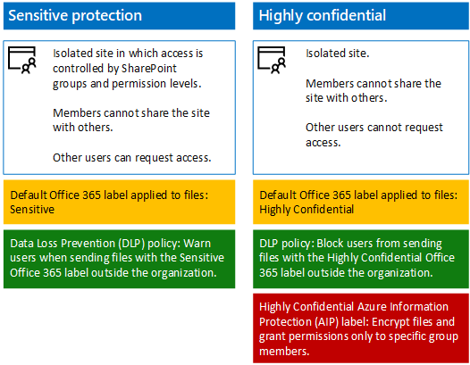

# Proteggere i siti del team di SharePoint Online per risorse estremamente riservate e sensibili

 **Sintesi:** informazioni su come Contoso ha implementato siti del team di SharePoint Online estremamente riservati e sensibili per una collaborazione più facile, ma comunque sicura, per i dirigenti e i rispettivi centri di ricerca.
  
La direzione esecutiva di Contoso desidera utilizzare Office 365 e archiviare i propri file in un unico posto per la collaborazione, indipendentemente dalla posizione di un dirigente. Analogamente, i reparti di ricerca di Contoso (con divisioni a Parigi, Mosca, New York, Pechino e Bangalore) desiderano spostare le proprie risorse digitali locali nel cloud per un accesso più semplice e una collaborazione migliore tra i team.
  
Tuttavia, in entrambi i casi, l'accesso a tali risorse deve essere limitato al subset di persone autorizzate a visualizzarle o modificarle, con autorizzazioni valide per il sito gestito dallo staff IT. Inoltre, anche se alcune risorse sono distribuite intenzionalmente o meno, devono essere crittografate e dotate di autorizzazioni per evitare che gli utenti senza autorizzazioni possano visualizzare o modificare il loro contenuto.
  
Gli amministratori della sicurezza e di SharePoint nel reparto IT di Contoso hanno deciso di utilizzare i siti del team di SharePoint Online estremamente riservati e sensibili, come mostrato nella figura 1.
  
**Figura 1: Confronto tra siti del team di SharePoint Online estremamente riservati e sensibili**

  
Contoso ha utilizzato questa procedura per creare siti del team di SharePoint Online sicuri per i dirigenti e i team di ricerca:
  
1. Creare un sito del team di SharePoint Online riservato **Dirigenti**
    
    Il nuovo sito del team utilizza i gruppi di Azure Active Directory (AD) esistenti per i dirigenti come membri con il livello di autorizzazione Modifica di SharePoint e un piccolo set di account Administrator di SharePoint come proprietari con il livello di autorizzazione Controllo completo.
    
2. Eseguire la migrazione di file dei dirigenti
    
    Spostare i file e le cartelle dei dirigenti locali esistenti nel nuovo sito del team Dirigenti di SharePoint Online.
    
3. Creare un sito del team di SharePoint Online estremamente riservato **Ricerca**
    
    Il nuovo sito del team utilizza i gruppi di team di ricerca Azure AD esistenti come membri con il livello di autorizzazione Modifica e un piccolo set di account Administrator di SharePoint come proprietari con il livello di autorizzazione Controllo completo. Un'etichetta AIP assegnata ai file di ricerca garantisce che questi siano crittografati e solo i membri di un gruppo di ricerca possono aprirli.
    
4. Eseguire la migrazione di file di ricerca
    
    Spostare i file e le cartelle locali del team di ricerca esistenti nel nuovo sito del team Ricerca di SharePoint Online.
    
Si ottengono due siti di collaborazione il cui accesso è rigidamente controllato dagli amministratori della sicurezza e di SharePoint. I file con l'etichetta Riservatezza elevata, anche se sono distribuiti all'esterno del sito del team Ricerca, sono crittografati e possono essere aperti solo da un membro di un team di ricerca.
  
Per ulteriori informazioni, vedere [Proteggere siti e file di SharePoint Online](https://docs.microsoft.com/microsoft-365-enterprise/secure-sharepoint-online-sites-and-files).
  
 Per configurarli per una dimostrazione, un modello di verifica o sviluppo/test, vedere[Proteggere i siti di SharePoint Online in un ambiente di sviluppo/test](https://docs.microsoft.com/microsoft-365-enterprise/secure-sharepoint-online-sites-dev-test).
  
## See Also

#### 

[Scenari aziendali per Contoso Corporation](enterprise-scenarios-for-the-contoso-corporation.md)
  
[Contoso nel Microsoft Cloud](contoso-in-the-microsoft-cloud.md)
  
[Risorse sull'architettura IT del cloud Microsoft](microsoft-cloud-it-architecture-resources.md)
#### 

[Stretch Database](https://msdn.microsoft.com/library/dn935011.aspx)
  
[Guida di orientamento del cloud aziendale Microsoft: risorse per i decision maker del settore IT](https://sway.com/FJ2xsyWtkJc2taRD)

