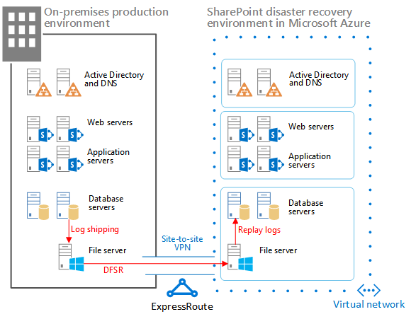

# <a name="sharepoint-server-2013-disaster-recovery-in-microsoft-azure"></a><span data-ttu-id="ad9a4-104">Ripristino di emergenza di SharePoint Server 2013 in Microsoft Azure</span><span class="sxs-lookup"><span data-stu-id="ad9a4-104">SharePoint Server 2013 Disaster Recovery in Microsoft Azure</span></span>

 <span data-ttu-id="ad9a4-p102">**Riepilogo:** Con Azure è possibile creare un ambiente di ripristino di emergenza per la farm locale di SharePoint. In questo articolo viene descritto come progettare e implementare questa soluzione.</span><span class="sxs-lookup"><span data-stu-id="ad9a4-p102">**Summary:** Using Azure, you can create a disaster-recovery environment for your on-premises SharePoint farm. This article describes how to design and implement this solution.</span></span>
  
 <span data-ttu-id="ad9a4-p103">Quando nell'ambiente locale di SharePoint si verifica un'emergenza, la massima priorità consiste nel riportare in funzione il sistema rapidamente. Il ripristino di emergenza con SharePoint è più semplice quando si dispone di un ambiente di backup già in esecuzione in Microsoft Azure. In questo video vengono illustrati i concetti principali di un ambiente di failover a caldo di SharePoint e forniti i dettagli completi disponibili in questo articolo.</span><span class="sxs-lookup"><span data-stu-id="ad9a4-p103">When disaster strikes your SharePoint on-premises environment, your top priority is to get the system running again quickly. Disaster recovery with SharePoint is quicker and easier when you have a backup environment already running in Microsoft Azure. This video explains the main concepts of a SharePoint warm failover environment and complements the full details available in this article.</span></span>
  

  
<span data-ttu-id="ad9a4-111">Utilizzare questo articolo con il modello della soluzione seguente: **Ripristino di emergenza di SharePoint Microsoft Azure**.</span><span class="sxs-lookup"><span data-stu-id="ad9a4-111">Use this article with the following solution model: **SharePoint Disaster Recovery in Microsoft Azure**.</span></span>
  
<span data-ttu-id="ad9a4-112">[</span><span class="sxs-lookup"><span data-stu-id="ad9a4-112">[</span></span>
  
<span data-ttu-id="ad9a4-114">](https://go.microsoft.com/fwlink/p/?LinkId=392555)</span><span class="sxs-lookup"><span data-stu-id="ad9a4-114">](https://go.microsoft.com/fwlink/p/?LinkId=392555)</span></span>
  
<span data-ttu-id="ad9a4-115">[PDF](https://go.microsoft.com/fwlink/p/?LinkId=392555) |[Visio](https://go.microsoft.com/fwlink/p/?LinkId=392554)</span><span class="sxs-lookup"><span data-stu-id="ad9a4-115">[PDF](https://go.microsoft.com/fwlink/p/?LinkId=392555) |[Visio](https://go.microsoft.com/fwlink/p/?LinkId=392554)</span></span>
  
<span data-ttu-id="ad9a4-116">Contenuto dell'articolo:</span><span class="sxs-lookup"><span data-stu-id="ad9a4-116">In this article:</span></span>
  
- [<span data-ttu-id="ad9a4-117">Utilizzare i servizi infrastruttura di Azure per il ripristino di emergenza</span><span class="sxs-lookup"><span data-stu-id="ad9a4-117">Use Azure Infrastructure Services for disaster recovery</span></span>](sharepoint-server-2013-disaster-recovery-in-microsoft-azure.md#AZ)
    
- [<span data-ttu-id="ad9a4-118">Descrizione della soluzione</span><span class="sxs-lookup"><span data-stu-id="ad9a4-118">Solution description</span></span>](sharepoint-server-2013-disaster-recovery-in-microsoft-azure.md#SOL)
    
- [<span data-ttu-id="ad9a4-119">Architettura dettagliata</span><span class="sxs-lookup"><span data-stu-id="ad9a4-119">Detailed architecture</span></span>](sharepoint-server-2013-disaster-recovery-in-microsoft-azure.md#arch)
    
- [<span data-ttu-id="ad9a4-120">Guida di orientamento al ripristino di emergenza</span><span class="sxs-lookup"><span data-stu-id="ad9a4-120">Disaster recovery roadmap</span></span>](sharepoint-server-2013-disaster-recovery-in-microsoft-azure.md#RDmap)
    
- [<span data-ttu-id="ad9a4-121">Fase 1: Progettare l'ambiente di ripristino di emergenza</span><span class="sxs-lookup"><span data-stu-id="ad9a4-121">Phase 1: Design the disaster recovery environment</span></span>](sharepoint-server-2013-disaster-recovery-in-microsoft-azure.md#Phase1)
    
- [<span data-ttu-id="ad9a4-122">Fase 2: Creare la rete virtuale di Azure e la connessione VPN.</span><span class="sxs-lookup"><span data-stu-id="ad9a4-122">Phase 2: Create the Azure virtual network and VPN connection</span></span>](sharepoint-server-2013-disaster-recovery-in-microsoft-azure.md#Phase2)
    
- [<span data-ttu-id="ad9a4-123">Fase 3: Distribuire Active Directory e Domain Name Services nella rete virtuale di Azure</span><span class="sxs-lookup"><span data-stu-id="ad9a4-123">Phase 3: Deploy Active Directory and Domain Name Services to the Azure virtual network</span></span>](sharepoint-server-2013-disaster-recovery-in-microsoft-azure.md#Phase3)
    
- [<span data-ttu-id="ad9a4-124">Fase 4: Distribuire la farm di ripristino di SharePoint in Azure</span><span class="sxs-lookup"><span data-stu-id="ad9a4-124">Phase 4: Deploy the SharePoint recovery farm in Azure</span></span>](sharepoint-server-2013-disaster-recovery-in-microsoft-azure.md#Phase4)
    
- [<span data-ttu-id="ad9a4-125">Fase 5: Configurare DFSR tra le farm</span><span class="sxs-lookup"><span data-stu-id="ad9a4-125">Phase 5: Set up DFSR between the farms</span></span>](sharepoint-server-2013-disaster-recovery-in-microsoft-azure.md#Phase5)
    
- [<span data-ttu-id="ad9a4-126">Fase 6: Configurare il log shipping nella farm di ripristino</span><span class="sxs-lookup"><span data-stu-id="ad9a4-126">Phase 6: Set up log shipping to the recovery farm</span></span>](sharepoint-server-2013-disaster-recovery-in-microsoft-azure.md#Phase6)
    
- [<span data-ttu-id="ad9a4-127">Fase 7: Convalidare failover e ripristino</span><span class="sxs-lookup"><span data-stu-id="ad9a4-127">Phase 7: Validate failover and recovery</span></span>](sharepoint-server-2013-disaster-recovery-in-microsoft-azure.md#Phase7)
    
- [<span data-ttu-id="ad9a4-128">Ambiente del modello di verifica di Microsoft</span><span class="sxs-lookup"><span data-stu-id="ad9a4-128">Microsoft proof-of-concept environment</span></span>](sharepoint-server-2013-disaster-recovery-in-microsoft-azure.md#POC)
    
- [<span data-ttu-id="ad9a4-129">Suggerimenti per la risoluzione dei problemi</span><span class="sxs-lookup"><span data-stu-id="ad9a4-129">Troubleshooting tips</span></span>](sharepoint-server-2013-disaster-recovery-in-microsoft-azure.md#Troubleshooting)
    
## <a name="use-azure-infrastructure-services-for-disaster-recovery"></a><span data-ttu-id="ad9a4-130">Utilizzare i servizi infrastruttura di Azure per il ripristino di emergenza</span><span class="sxs-lookup"><span data-stu-id="ad9a4-130">Use Azure Infrastructure Services for disaster recovery</span></span>
<span data-ttu-id="ad9a4-131"><a name="AZ"> </a></span><span class="sxs-lookup"><span data-stu-id="ad9a4-131"><a name="AZ"> </a></span></span>

<span data-ttu-id="ad9a4-p104">Molte organizzazioni non dispongono di un ambiente di ripristino di emergenza per SharePoint, che può essere costoso creare e gestire in locale. servizi infrastruttura di Azure fornisce opzioni interessanti per gli ambienti di ripristino di emergenza che sono più flessibili e meno costosi rispetto alle alternative locali.</span><span class="sxs-lookup"><span data-stu-id="ad9a4-p104">Many organizations do not have a disaster recovery environment for SharePoint, which can be expensive to build and maintain on-premises. Azure Infrastructure Services provides compelling options for disaster recovery environments that are more flexible and less expensive than the on-premises alternatives.</span></span>
  
<span data-ttu-id="ad9a4-134">I vantaggi per l'uso di servizi infrastruttura di Azure includono:</span><span class="sxs-lookup"><span data-stu-id="ad9a4-134">The advantages for using Azure Infrastructure Services include:</span></span>
  
- <span data-ttu-id="ad9a4-p105">**Meno risorse costose** Gestire e pagare per un numero di risorse ridotto rispetto agli ambienti di ripristino di emergenza locali. Il numero di risorse dipende dall'ambiente di ripristino di emergenza scelto: cold standby, warm standby oppure hot standby.</span><span class="sxs-lookup"><span data-stu-id="ad9a4-p105">**Fewer costly resources** Maintain and pay for fewer resources than on-premises disaster recovery environments. The number of resources depends on which disaster-recovery environment you choose: cold standby, warm standby, or hot standby.</span></span>
    
- <span data-ttu-id="ad9a4-p106">**Migliore flessibilità delle risorse** In caso di emergenza, è possibile aumentare facilmente la farm di SharePoint di ripristino in modo da soddisfare i requisiti di caricamento. Ridurre quando la risorsa non è più necessaria.</span><span class="sxs-lookup"><span data-stu-id="ad9a4-p106">**Better resource flexibility** In the event of a disaster, easily scale out your recovery SharePoint farm to meet load requirements. Scale in when you no longer need the resources.</span></span>
    
- <span data-ttu-id="ad9a4-139">**Impegno ridotto dei centri dati** Utilizzare servizi infrastruttura di Azure anziché investire in un centro dati secondario in un'area diversa.</span><span class="sxs-lookup"><span data-stu-id="ad9a4-139">**Lower datacenter commitment** Use Azure Infrastructure Services instead of investing in a secondary datacenter in a different region.</span></span>
    
<span data-ttu-id="ad9a4-p107">Sono disponibili opzioni meno complesse per le organizzazioni con poca esperienza con il ripristino di emergenza e opzioni avanzate per le organizzazioni con requisiti di resilienza elevata. Le definizioni di ambienti cold standby, warm standby e hot standby sono leggermente diverse quando l'ambiente è ospitato su una piattaforma cloud. Nella tabella seguente vengono descritti questi ambienti per la creazione di una farm di ripristino di SharePoint in Azure.</span><span class="sxs-lookup"><span data-stu-id="ad9a4-p107">There are less-complex options for organizations just getting started with disaster recovery and advanced options for organizations with high-resilience requirements. The definitions for cold, warm, and hot standby environments are a little different when the environment is hosted on a cloud platform. The following table describes these environments for building a SharePoint recovery farm in Azure.</span></span>
  
<span data-ttu-id="ad9a4-143">**Tabella: Ambienti di ripristino**</span><span class="sxs-lookup"><span data-stu-id="ad9a4-143">**Table: Recovery environments**</span></span>

|<span data-ttu-id="ad9a4-144">**Tipo di ambiente di ripristino**</span><span class="sxs-lookup"><span data-stu-id="ad9a4-144">**Type of recovery environment**</span></span>|<span data-ttu-id="ad9a4-145">**Descrizione**</span><span class="sxs-lookup"><span data-stu-id="ad9a4-145">**Description**</span></span>|
|:-----|:-----|
|<span data-ttu-id="ad9a4-146">Hot</span><span class="sxs-lookup"><span data-stu-id="ad9a4-146">Hot</span></span>  <br/> |<span data-ttu-id="ad9a4-147">Una farm a dimensioni complete viene sottoposta a provisioning e viene eseguita allo standby.</span><span class="sxs-lookup"><span data-stu-id="ad9a4-147">A fully sized farm is provisioned, updated, and running on standby.</span></span>  <br/> |
|<span data-ttu-id="ad9a4-148">Warm</span><span class="sxs-lookup"><span data-stu-id="ad9a4-148">Warm</span></span>  <br/> |<span data-ttu-id="ad9a4-149">La farm viene creata e le macchine virtuali sono in esecuzione e aggiornate.</span><span class="sxs-lookup"><span data-stu-id="ad9a4-149">The farm is built and virtual machines are running and updated.</span></span>  <br/> <span data-ttu-id="ad9a4-150">Il ripristino include il collegamento di database di contenuto, le applicazioni dei servizii di provisioning e la ricerca per indicizzazione del contenuto.</span><span class="sxs-lookup"><span data-stu-id="ad9a4-150">Recovery includes attaching content databases, provisioning service applications, and crawling content.</span></span>  <br/> <span data-ttu-id="ad9a4-151">La farm può essere una versione ridotta della farm di produzione e quindi essere ampliata per soddisfare la base utenti completa.</span><span class="sxs-lookup"><span data-stu-id="ad9a4-151">The farm can be a smaller version of the production farm and then scaled out to serve the full user base.</span></span>  <br/> |
|<span data-ttu-id="ad9a4-152">Cold</span><span class="sxs-lookup"><span data-stu-id="ad9a4-152">Cold</span></span>  <br/> |<span data-ttu-id="ad9a4-153">La farm viene creata completamente, ma le macchine virtuali sono arrestate.</span><span class="sxs-lookup"><span data-stu-id="ad9a4-153">The farm is fully built, but the virtual machines are stopped.</span></span>  <br/> <span data-ttu-id="ad9a4-154">La gestione dell'ambiente include l'avvio periodico delle macchine virtuali, l'applicazione di patch, l'aggiornamento e la verifica dell'ambiente.</span><span class="sxs-lookup"><span data-stu-id="ad9a4-154">Maintaining the environment includes starting the virtual machines from time to time, patching, updating, and verifying the environment.</span></span>  <br/> <span data-ttu-id="ad9a4-155">Avviare l'ambiente completo in caso di calamità.</span><span class="sxs-lookup"><span data-stu-id="ad9a4-155">Start the full environment in the event of a disaster.</span></span>  <br/> |
   
<span data-ttu-id="ad9a4-p108">È importante valutare gli RTO e gli RPO dell'organizzazione. Questi requisiti determinano quale ambiente rappresenta l'investimento più appropriato per l'organizzazione.</span><span class="sxs-lookup"><span data-stu-id="ad9a4-p108">It's important to evaluate your organization's Recovery Time Objectives (RTOs) and Recovery Point Objectives (RPOs). These requirements determine which environment is the most appropriate investment for your organization.</span></span>
  
<span data-ttu-id="ad9a4-p109">Nel materiale sussidiario di questo articolo viene descritto come implementare un ambiente warm standby. È anche possibile adattarlo a un ambiente cold standby, anche se è necessario seguire ulteriori procedure per supportare questo tipo di ambiente. In questo articolo non viene descritto come implementare una ambiente hot standby.</span><span class="sxs-lookup"><span data-stu-id="ad9a4-p109">The guidance in this article describes how to implement a warm standby environment. You can also adapt it to a cold standby environment, although you need to follow additional procedures to support this kind of environment. This article does not describe how to implement a hot standby environment.</span></span>
  
<span data-ttu-id="ad9a4-161">Per ulteriori informazioni sulle soluzioni di ripristino di emergenza, vedere [Concetti relativi a ripristino di emergenza e disponibilità elevata in SharePoint 2013](https://go.microsoft.com/fwlink/p/?LinkID=393114) e[Scegliere una strategia di ripristino di emergenza per SharePoint 2013](https://go.microsoft.com/fwlink/p/?linkid=203228).</span><span class="sxs-lookup"><span data-stu-id="ad9a4-161">For more information about disaster recovery solutions, see [High availability and disaster recovery concepts in SharePoint 2013](https://go.microsoft.com/fwlink/p/?LinkID=393114) and[Choose a disaster recovery strategy for SharePoint 2013](https://go.microsoft.com/fwlink/p/?linkid=203228).</span></span>
  
## <a name="solution-description"></a><span data-ttu-id="ad9a4-162">Descrizione della soluzione</span><span class="sxs-lookup"><span data-stu-id="ad9a4-162">Solution description</span></span>
<span data-ttu-id="ad9a4-163"><a name="SOL"> </a></span><span class="sxs-lookup"><span data-stu-id="ad9a4-163"><a name="SOL"> </a></span></span>

<span data-ttu-id="ad9a4-164">La soluzione di ripristino di emergenza con warm standby richiede l'ambiente seguente:</span><span class="sxs-lookup"><span data-stu-id="ad9a4-164">The warm standby disaster-recovery solution requires the following environment:</span></span>
  
- <span data-ttu-id="ad9a4-165">Una farm di produzione di SharePoint locale</span><span class="sxs-lookup"><span data-stu-id="ad9a4-165">An on-premises SharePoint production farm</span></span>
    
- <span data-ttu-id="ad9a4-166">Una farm di SharePoint di ripristino in Azure</span><span class="sxs-lookup"><span data-stu-id="ad9a4-166">A recovery SharePoint farm in Azure</span></span>
    
- <span data-ttu-id="ad9a4-167">Una connessione VPN da sito a sito tra i due ambienti.</span><span class="sxs-lookup"><span data-stu-id="ad9a4-167">A site-to-site VPN connection between the two environments</span></span>
    
<span data-ttu-id="ad9a4-168">La figura seguente illustra questi tre elementi.</span><span class="sxs-lookup"><span data-stu-id="ad9a4-168">The following figure illustrates these three elements.</span></span>
  
<span data-ttu-id="ad9a4-169">**Figura: elementi di una soluzione con warm standby in Azure**</span><span class="sxs-lookup"><span data-stu-id="ad9a4-169">**Figure: Elements of a warm standby solution in Azure**</span></span>


  
<span data-ttu-id="ad9a4-171">Il log shipping di SQL Server con Replica DFS viene utilizzato per copiare i backup di database e i registri transazioni nella farm di ripristino in Azure:</span><span class="sxs-lookup"><span data-stu-id="ad9a4-171">SQL Server log shipping with Distributed File System Replication (DFSR) is used to copy database backups and transaction logs to the recovery farm in Azure:</span></span> 
  
- <span data-ttu-id="ad9a4-p110">Replica DFS trasferisce i registri dall'ambiente di produzione all'ambiente di ripristino. In uno scenario WAN, Replica DFS è più efficiente della spedizione diretta dei registri al server secondario in Azure.</span><span class="sxs-lookup"><span data-stu-id="ad9a4-p110">DFSR transfers logs from the production environment to the recovery environment. In a WAN scenario, DFSR is more efficient than shipping the logs directly to the secondary server in Azure.</span></span>
    
- <span data-ttu-id="ad9a4-174">I registri vengono riprodotti in SQL Server nell'ambiente di ripristino in Azure.</span><span class="sxs-lookup"><span data-stu-id="ad9a4-174">Logs are replayed to the SQL Server in the recovery environment in Azure.</span></span>
    
- <span data-ttu-id="ad9a4-175">I database di contenuto di SharePoint sottoposti a log shipping non vengono associati nell'ambiente di ripristino finché non viene eseguita un esercizio di ripristino.</span><span class="sxs-lookup"><span data-stu-id="ad9a4-175">You don't attach log-shipped SharePoint content databases in the recovery environment until a recovery exercise is performed.</span></span>
    
<span data-ttu-id="ad9a4-176">Per ripristinare la farm, effettuare i seguenti passaggi:</span><span class="sxs-lookup"><span data-stu-id="ad9a4-176">Perform the following steps to recover the farm:</span></span>
  
1. <span data-ttu-id="ad9a4-177">Arrestare il log shipping</span><span class="sxs-lookup"><span data-stu-id="ad9a4-177">Stop log shipping.</span></span>
    
2. <span data-ttu-id="ad9a4-178">Smettere di accettare il traffico alla farm primaria.</span><span class="sxs-lookup"><span data-stu-id="ad9a4-178">Stop accepting traffic to the primary farm.</span></span>
    
3. <span data-ttu-id="ad9a4-179">Riprodurre i registri di transazioni finali.</span><span class="sxs-lookup"><span data-stu-id="ad9a4-179">Replay the final transaction logs.</span></span>
    
4. <span data-ttu-id="ad9a4-180">Collegare i database di contenuto alla farm.</span><span class="sxs-lookup"><span data-stu-id="ad9a4-180">Attach the content databases to the farm.</span></span>
    
5. <span data-ttu-id="ad9a4-181">Ripristinare le applicazioni di servizio dai database di servizi replicati.</span><span class="sxs-lookup"><span data-stu-id="ad9a4-181">Restore service applications from the replicated services databases.</span></span>
    
6. <span data-ttu-id="ad9a4-182">Aggiornare i record DNS in modo che puntino alla farm di ripristino.</span><span class="sxs-lookup"><span data-stu-id="ad9a4-182">Update Domain Name System (DNS) records to point to the recovery farm.</span></span>
    
7. <span data-ttu-id="ad9a4-183">Avviare una ricerca per indicizzazione completa.</span><span class="sxs-lookup"><span data-stu-id="ad9a4-183">Start a full crawl.</span></span>
    
<span data-ttu-id="ad9a4-p111">È consigliabile provare questa procedura regolarmente e documentarla in modo da garantire che il ripristino dal vivo venga eseguito senza problemi. L'associazione dei database di contenuto e il ripristino delle applicazioni di servizio può richiedere del tempo e in genere implica alcune configurazioni manuali.</span><span class="sxs-lookup"><span data-stu-id="ad9a4-p111">We recommend that you rehearse these steps regularly and document them to help ensure that your live recovery runs smoothly. Attaching content databases and restoring service applications can take some time and typically involves some manual configuration.</span></span>
  
<span data-ttu-id="ad9a4-186">Dopo che è stato eseguito un ripristino, questa soluzione fornisce gli elementi elencati nella tabella seguente.</span><span class="sxs-lookup"><span data-stu-id="ad9a4-186">After a recovery is performed, this solution provides the items listed in the following table.</span></span>
  
<span data-ttu-id="ad9a4-187">**Tabella: Obiettivi del ripristino della soluzione**</span><span class="sxs-lookup"><span data-stu-id="ad9a4-187">**Table: Solution recovery objectives**</span></span>

|<span data-ttu-id="ad9a4-188">**Elemento**</span><span class="sxs-lookup"><span data-stu-id="ad9a4-188">**Item**</span></span>|<span data-ttu-id="ad9a4-189">**Descrizione**</span><span class="sxs-lookup"><span data-stu-id="ad9a4-189">**Description**</span></span>|
|:-----|:-----|
|<span data-ttu-id="ad9a4-190">Siti e contenuto</span><span class="sxs-lookup"><span data-stu-id="ad9a4-190">Sites and content</span></span>  <br/> |<span data-ttu-id="ad9a4-191">Siti e contenuto sono disponibili nell'ambiente di ripristino.</span><span class="sxs-lookup"><span data-stu-id="ad9a4-191">Sites and content are available in the recovery environment.</span></span>  <br/> |
|<span data-ttu-id="ad9a4-192">Una nuova istanza di ricerca</span><span class="sxs-lookup"><span data-stu-id="ad9a4-192">A new instance of search</span></span>  <br/> |<span data-ttu-id="ad9a4-p112">In questa soluzione con warm standby, la ricerca non viene ripristinata dai database di ricerca. I componenti della ricerca nella farm di ripristino sono configurati in modo più simile possibile alla farm di produzione. Una volta ripristinati i siti e il contenuto, viene avviata una ricerca per indicizzazione completa per ricompilare l'indice di ricerca. Non è necessario attendere che la ricerca per indicizzazione venga completata per rendere disponibili i siti e il contenuto.</span><span class="sxs-lookup"><span data-stu-id="ad9a4-p112">In this warm standby solution, search is not restored from search databases. Search components in the recovery farm are configured as similarly as possible to the production farm. After the sites and content are restored, a full crawl is started to rebuild the search index. You do not need to wait for the crawl to complete to make the sites and content available.</span></span>  <br/> |
|<span data-ttu-id="ad9a4-197">Servizi</span><span class="sxs-lookup"><span data-stu-id="ad9a4-197">Services</span></span>  <br/> | <span data-ttu-id="ad9a4-p113">I servizi che archiviano i dati nei database vengono ripristinati dai database sottoposti a log shipping. I servizi che non archiviano i dati nei database vengono semplicemente avviati.</span><span class="sxs-lookup"><span data-stu-id="ad9a4-p113">Services that store data in databases are restored from the log-shipped databases. Services that do not store data in databases are simply started.</span></span> <br/>  <span data-ttu-id="ad9a4-p114">Non tutti i servizi con i database devono essere ripristinati. Per i seguenti servizi non è necessario il ripristino dai database e possono essere semplicemente avviati dopo il failover:</span><span class="sxs-lookup"><span data-stu-id="ad9a4-p114">Not all services with databases need to be restored. The following services do not need to be restored from databases and can simply be started after failover:</span></span> <br/>  <span data-ttu-id="ad9a4-202">Raccolta dati di utilizzo e integrità</span><span class="sxs-lookup"><span data-stu-id="ad9a4-202">Usage and Health Data Collection</span></span> <br/>  <span data-ttu-id="ad9a4-203">Servizio informazioni sullo stato</span><span class="sxs-lookup"><span data-stu-id="ad9a4-203">State service</span></span> <br/>  <span data-ttu-id="ad9a4-204">Word Automation</span><span class="sxs-lookup"><span data-stu-id="ad9a4-204">Word automation</span></span> <br/>  <span data-ttu-id="ad9a4-205">Qualsiasi altro servizio che non usa un database</span><span class="sxs-lookup"><span data-stu-id="ad9a4-205">Any other service that doesn't use a database</span></span> <br/> |
   
<span data-ttu-id="ad9a4-p115">È possibile lavorare con Microsoft Consulting Services (MCS) o un partner per risolvere obiettivi di ripristino più complessi. Tali obiettivi sono riepilogati nella tabella riportata di seguito:</span><span class="sxs-lookup"><span data-stu-id="ad9a4-p115">You can work with Microsoft Consulting Services (MCS) or a partner to address more-complex recovery objectives. These are summarized in the following table.</span></span>
  
<span data-ttu-id="ad9a4-208">**Tabella: Altri elementi che possono essere gestiti da MCS o da un partner**</span><span class="sxs-lookup"><span data-stu-id="ad9a4-208">**Table: Other items that can be addressed by MCS or a partner**</span></span>

|<span data-ttu-id="ad9a4-209">**Elemento**</span><span class="sxs-lookup"><span data-stu-id="ad9a4-209">**Item**</span></span>|<span data-ttu-id="ad9a4-210">**Descrizione**</span><span class="sxs-lookup"><span data-stu-id="ad9a4-210">**Description**</span></span>|
|:-----|:-----|
|<span data-ttu-id="ad9a4-211">Sincronizzazione di soluzioni farm personalizzate</span><span class="sxs-lookup"><span data-stu-id="ad9a4-211">Synchronizing custom farm solutions</span></span>  <br/> |<span data-ttu-id="ad9a4-p116">In teoria, la configurazione della farm di ripristino è identica alla farm di produzione. È possibile lavorare con un consulente o un partner per valutare se le soluzioni farm personalizzate vengono replicate e se il processo per mantenere sincronizzati i due ambienti è attivo.</span><span class="sxs-lookup"><span data-stu-id="ad9a4-p116">Ideally, the recovery farm configuration is identical to the production farm. You can work with a consultant or partner to evaluate whether custom farm solutions are replicated and whether the process is in place for keeping the two environments synchronized.</span></span>  <br/> |
|<span data-ttu-id="ad9a4-214">Connessioni a origini dati in locale</span><span class="sxs-lookup"><span data-stu-id="ad9a4-214">Connections to data sources on-premises</span></span>  <br/> |<span data-ttu-id="ad9a4-215">Potrebbe non essere pratico replicare le connessioni a sistemi di dati di back-end, ad esempio le connessioni controller di dominio di backup e le origini di contenuto di ricerca.</span><span class="sxs-lookup"><span data-stu-id="ad9a4-215">It might not be practical to replicate connections to back-end data systems, such as backup domain controller (BDC) connections and search content sources.</span></span>  <br/> |
|<span data-ttu-id="ad9a4-216">Scenari di ripristino di ricerca</span><span class="sxs-lookup"><span data-stu-id="ad9a4-216">Search restore scenarios</span></span>  <br/> |<span data-ttu-id="ad9a4-p117">Poiché le distribuzioni di ricerca aziendali tendono a essere abbastanza univoche e complesse, il ripristino della ricerca dai database richiede un investimento maggiore. È possibile lavorare con un consulente o un partner per identificare e implementare gli scenari di ripristino della ricerca che potrebbero essere richiesti dall'organizzazione.</span><span class="sxs-lookup"><span data-stu-id="ad9a4-p117">Because enterprise search deployments tend to be fairly unique and complex, restoring search from databases requires a greater investment. You can work with a consultant or partner to identify and implement search restore scenarios that your organization might require.</span></span>  <br/> |
   
<span data-ttu-id="ad9a4-219">Le istruzioni fornite in questo articolo presuppongono che la farm locale sia già progettata e distribuita.</span><span class="sxs-lookup"><span data-stu-id="ad9a4-219">The guidance provided in this article assumes that the on-premises farm is already designed and deployed.</span></span>
  
## <a name="detailed-architecture"></a><span data-ttu-id="ad9a4-220">Architettura dettagliata</span><span class="sxs-lookup"><span data-stu-id="ad9a4-220">Detailed architecture</span></span>
<span data-ttu-id="ad9a4-221"><a name="arch"> </a></span><span class="sxs-lookup"><span data-stu-id="ad9a4-221"><a name="arch"> </a></span></span>

<span data-ttu-id="ad9a4-222">In teoria, la configurazione della farm di ripristino in Azure è identica alla farm di produzione locale, incluse le seguenti caratteristiche:</span><span class="sxs-lookup"><span data-stu-id="ad9a4-222">Ideally, the recovery farm configuration in Azure is identical to the production farm on-premises, including the following:</span></span>
  
- <span data-ttu-id="ad9a4-223">Stessa rappresentazione dei ruoli del server</span><span class="sxs-lookup"><span data-stu-id="ad9a4-223">The same representation of server roles</span></span>
    
- <span data-ttu-id="ad9a4-224">Stessa configurazione delle personalizzazioni</span><span class="sxs-lookup"><span data-stu-id="ad9a4-224">The same configuration of customizations</span></span>
    
- <span data-ttu-id="ad9a4-225">Stessa configurazione dei componenti di ricerca</span><span class="sxs-lookup"><span data-stu-id="ad9a4-225">The same configuration of search components</span></span>
    
<span data-ttu-id="ad9a4-p118">L'ambiente in Azure può essere una versione ridotta della farm di produzione. Se si prevede di ampliare la farm di ripristino dopo il failover, è importante che all'inizio sia rappresentato ciascun tipo di ruolo del server.</span><span class="sxs-lookup"><span data-stu-id="ad9a4-p118">The environment in Azure can be a smaller version of the production farm. If you plan to scale out the recovery farm after failover, it's important that each type of server role be initially represented.</span></span>
  
<span data-ttu-id="ad9a4-p119">La replica di alcune configurazioni nell'ambiente di failover potrebbe non essere pratica. Assicurarsi di testare le procedure di failover e l'ambiente per garantire che la farm di failover offra il livello di servizio previsto.</span><span class="sxs-lookup"><span data-stu-id="ad9a4-p119">Some configurations might not be practical to replicate in the failover environment. Be sure to test the failover procedures and environment to help ensure that the failover farm provides the expected service level.</span></span>
  
<span data-ttu-id="ad9a4-p120">Questa soluzione non prevede una topologia specifica per una farm di SharePoint. Il punto centrale di questa soluzione consiste nell'usare Azure per la farm failover e nell'implementare il log shipping e la Replica DFS tra i due ambienti.</span><span class="sxs-lookup"><span data-stu-id="ad9a4-p120">This solution doesn't prescribe a specific topology for a SharePoint farm. The focus of this solution is to use Azure for the failover farm and to implement log shipping and DFSR between the two environments.</span></span>
  
### <a name="warm-standby-environments"></a><span data-ttu-id="ad9a4-232">Ambienti con warm standby</span><span class="sxs-lookup"><span data-stu-id="ad9a4-232">Warm standby environments</span></span>

<span data-ttu-id="ad9a4-p121">In un ambiente con warm standby, tutte le macchine virtuali nell'ambiente Azure sono in esecuzione. L'ambiente è pronto per un esercizio o un evento di failover.</span><span class="sxs-lookup"><span data-stu-id="ad9a4-p121">In a warm standby environment, all virtual machines in the Azure environment are running. The environment is ready for a failover exercise or event.</span></span>
  
<span data-ttu-id="ad9a4-235">Nella figura seguente viene illustrata una soluzione di ripristino di emergenza da una farm di SharePoint locale a una farm di SharePoint basata su Azure che viene configurata come ambiente con warm standby.</span><span class="sxs-lookup"><span data-stu-id="ad9a4-235">The following figure illustrates a disaster recovery solution from an on-premises SharePoint farm to an Azure-based SharePoint farm that is configured as a warm standby environment.</span></span>
  
<span data-ttu-id="ad9a4-236">**Figura: topologia ed elementi chiave di una farm di produzione e di una farm di ripristino con warm standby.**</span><span class="sxs-lookup"><span data-stu-id="ad9a4-236">**Figure: Topology and key elements of a production farm and a warm standby recovery farm**</span></span>


  
<span data-ttu-id="ad9a4-238">In questo diagramma:</span><span class="sxs-lookup"><span data-stu-id="ad9a4-238">In this diagram:</span></span>
  
- <span data-ttu-id="ad9a4-239">Sono illustrati due ambienti affiancati: la farm di SharePoint locale e la farm con warm standby in Azure.</span><span class="sxs-lookup"><span data-stu-id="ad9a4-239">Two environments are illustrated side by side: the on-premises SharePoint farm and the warm standby farm in Azure.</span></span>
    
- <span data-ttu-id="ad9a4-240">Ogni ambiente include una condivisione di file.</span><span class="sxs-lookup"><span data-stu-id="ad9a4-240">Each environment includes a file share.</span></span>
    
- <span data-ttu-id="ad9a4-p122">Ogni farm include quattro livelli. Per ottenere la disponibilità elevata, ogni livello include due server o macchine virtuali configurate in modo identico per un ruolo specifico, ad esempio servizi front-end, cache distribuita, servizi back-end e database. Non è importante in questa figura per mettere in evidenza componenti specifici. Le due farm sono configurate in modo identico.</span><span class="sxs-lookup"><span data-stu-id="ad9a4-p122">Each farm includes four tiers. To achieve high availability, each tier includes two servers or virtual machines that are configured identically for a specific role, such as front-end services, distributed cache, back-end services, and databases. It isn't important in this illustration to call out specific components. The two farms are configured identically.</span></span>
    
- <span data-ttu-id="ad9a4-p123">Il quarto livello è il livello database. Il log shipping viene usato per copiare i log dal server di database secondario dell'ambiente locale nella condivisione file nello stesso ambiente.</span><span class="sxs-lookup"><span data-stu-id="ad9a4-p123">The fourth tier is the database tier. Log shipping is used to copy logs from the secondary database server in the on-premises environment to the file share in the same environment.</span></span>
    
- <span data-ttu-id="ad9a4-247">Replica DFS copia i file dalla condivisione file nell'ambiente locale alla condivisione file nell'ambiente Azure.</span><span class="sxs-lookup"><span data-stu-id="ad9a4-247">DFSR copies files from the file share in the on-premises environment to the file share in the Azure environment.</span></span>
    
- <span data-ttu-id="ad9a4-248">Il log shipping riproduce i log dalla condivisione di file dell'ambiente Azure nella replica primaria nel gruppo di disponibilità AlwaysOn di SQL Server nell'ambiente di ripristino.</span><span class="sxs-lookup"><span data-stu-id="ad9a4-248">Log shipping replays the logs from the file share in the Azure environment to the primary replica in the SQL Server AlwaysOn availability group in the recovery environment.</span></span>
    
### <a name="cold-standby-environments"></a><span data-ttu-id="ad9a4-249">Ambienti con cold standby</span><span class="sxs-lookup"><span data-stu-id="ad9a4-249">Cold standby environments</span></span>

<span data-ttu-id="ad9a4-p124">In un ambiente con cold standby, è possibile arrestare la maggior parte delle macchine virtuali della farm di SharePoint. Si consiglia di avviare le macchine virtuali di tanto in tanto, ad esempio ogni due settimane o una volta al mese, in modo che ogni macchina virtuale possa sincronizzarsi con il dominio. Le seguenti macchine virtuali nell'ambiente di ripristino Azure devono rimanere in esecuzione per garantire le operazioni continue di log shipping e Replica DFS:</span><span class="sxs-lookup"><span data-stu-id="ad9a4-p124">In a cold standby environment, most of the SharePoint farm virtual machines can be shut down. (We recommend occasionally starting the virtual machines, such as every two weeks or once a month, so that each virtual machine can sync with the domain.) The following virtual machines in the Azure recovery environment must remain running to help ensure continuous operations of log shipping and DFSR:</span></span>
  
- <span data-ttu-id="ad9a4-252">Condivisione file</span><span class="sxs-lookup"><span data-stu-id="ad9a4-252">The file share</span></span>
    
- <span data-ttu-id="ad9a4-253">Server database primario</span><span class="sxs-lookup"><span data-stu-id="ad9a4-253">The primary database server</span></span>
    
- <span data-ttu-id="ad9a4-254">Almeno una macchina virtuale che esegue Active Directory Domain Services di Windows Server e DNS</span><span class="sxs-lookup"><span data-stu-id="ad9a4-254">At least one virtual machine running Windows Server Active Directory Domain Services and DNS</span></span>
    
<span data-ttu-id="ad9a4-p125">La figura seguente mostra un ambiente di failover Azure in cui sono in esecuzione la macchina virtuale della condivisione file e la macchina virtuale database SharePoint principale. Tutte le altre macchine virtuali di SharePoint vengono arrestate. La macchina virtuale che esegue Windows Server Active Directory e DNS non è visualizzata.</span><span class="sxs-lookup"><span data-stu-id="ad9a4-p125">The following figure shows an Azure failover environment in which the file share virtual machine and the primary SharePoint database virtual machine are running. All other SharePoint virtual machines are stopped. The virtual machine that is running Windows Server Active Directory and DNS is not shown.</span></span>
  
<span data-ttu-id="ad9a4-258">**Figura: farm di ripristino con cold standby e macchine virtuali in esecuzione**</span><span class="sxs-lookup"><span data-stu-id="ad9a4-258">**Figure: Cold standby recovery farm with running virtual machines**</span></span>


  
<span data-ttu-id="ad9a4-260">Dopo il failover a un ambiente con cold standby, tutte le macchine virtuali vengono avviate ed è necessario configurar il metodo per ottenere la disponibilità elevata dei server di database, ad esempio i gruppi di disponibilità di SQL Server AlwaysOn.</span><span class="sxs-lookup"><span data-stu-id="ad9a4-260">After failover to a cold standby environment, all virtual machines are started, and the method to achieve high availability of the database servers must be configured, such as SQL Server AlwaysOn availability groups.</span></span>
  
<span data-ttu-id="ad9a4-261">Se vengono implementati più gruppi di archiviazione (i database vengono suddivisi tra più set di disponibilità elevata di SQL Server), il database primario per ogni gruppo di archiviazione deve essere in esecuzione per accettare i log associati al relativo gruppo di archiviazione.</span><span class="sxs-lookup"><span data-stu-id="ad9a4-261">If multiple storage groups are implemented (databases are spread across more than one SQL Server high availability set), the primary database for each storage group must be running to accept the logs associated with its storage group.</span></span>
  
### <a name="skills-and-experience"></a><span data-ttu-id="ad9a4-262">Competenze ed esperienze</span><span class="sxs-lookup"><span data-stu-id="ad9a4-262">Skills and experience</span></span>

<span data-ttu-id="ad9a4-p126">In questa soluzione di ripristino di emergenza vengono utilizzate più tecnologie. Per garantire che tali tecnologie interagiscano come previsto, ogni componente nell'ambiente locale e Azure deve essere installato e configurato correttamente. È consigliabile che la persona o il team che configura questa soluzione abbia una buona conoscenza operativa e competenze pratiche relative alle tecnologie descritte nei seguenti articoli:</span><span class="sxs-lookup"><span data-stu-id="ad9a4-p126">Multiple technologies are used in this disaster recovery solution. To help ensure that these technologies interact as expected, each component in the on-premises and Azure environment must be installed and configured correctly. We recommend that the person or team who sets up this solution have a strong working knowledge of and hands-on skills with the technologies described in the following articles:</span></span>
  
- [<span data-ttu-id="ad9a4-266">Servizi di replica DFS</span><span class="sxs-lookup"><span data-stu-id="ad9a4-266">Distributed File System (DFS) Replication Services</span></span>](https://go.microsoft.com/fwlink/p/?LinkId=392698)
    
- [<span data-ttu-id="ad9a4-267">Windows Server Failover Clustering (WSFC) con SQL Server</span><span class="sxs-lookup"><span data-stu-id="ad9a4-267">Windows Server Failover Clustering (WSFC) with SQL Server</span></span>](https://go.microsoft.com/fwlink/p/?LinkId=392701)
    
- [<span data-ttu-id="ad9a4-268">Gruppi di disponibili AlwaysOn (SQL Server)</span><span class="sxs-lookup"><span data-stu-id="ad9a4-268">AlwaysOn Availability Groups (SQL Server)</span></span>](https://go.microsoft.com/fwlink/p/?LinkId=392725)
    
- [<span data-ttu-id="ad9a4-269">Backup e ripristino di database SQL Server</span><span class="sxs-lookup"><span data-stu-id="ad9a4-269">Back Up and Restore of SQL Server Databases</span></span>](https://go.microsoft.com/fwlink/p/?LinkId=392728)
    
- [<span data-ttu-id="ad9a4-270">Installazione di SharePoint Server 2013 e distribuzione delle farm</span><span class="sxs-lookup"><span data-stu-id="ad9a4-270">SharePoint Server 2013 installation and farm deployment</span></span>](https://go.microsoft.com/fwlink/p/?LinkId=393119)
    
- [<span data-ttu-id="ad9a4-271">Microsoft Azure</span><span class="sxs-lookup"><span data-stu-id="ad9a4-271">Microsoft Azure</span></span>](https://go.microsoft.com/fwlink/p/?LinkId=392729)
    
<span data-ttu-id="ad9a4-p127">Infine, si consigliano competenze di scripting che è possibile utilizzare per automatizzare le attività associate a tali tecnologie. È possibile usare le interfacce utente disponibili per completare tutte le attività descritte in questa soluzione. Tuttavia, un approccio manuale può essere dispendioso in termini di tempo e tendente all'errore e offre risultati non coerenti.</span><span class="sxs-lookup"><span data-stu-id="ad9a4-p127">Finally, we recommend scripting skills that you can use to automate tasks associated with these technologies. It's possible to use the available user interfaces to complete all the tasks described in this solution. However, a manual approach can be time consuming and error prone and delivers inconsistent results.</span></span>
  
<span data-ttu-id="ad9a4-p128">Oltre a Windows PowerShell, sono disponibili anche le librerie di Windows PowerShell per SQL Server, SharePoint Server e Azure. Non dimenticare T-SQL, che può anche essere utile per ridurre il tempo necessario a configurare e gestire l'ambiente di ripristino di emergenza.</span><span class="sxs-lookup"><span data-stu-id="ad9a4-p128">In addition to Windows PowerShell, there are also Windows PowerShell libraries for SQL Server, SharePoint Server, and Azure. Don't forget T-SQL, which can also help reduce the time to configure and maintain your disaster-recovery environment.</span></span>
  
## <a name="disaster-recovery-roadmap"></a><span data-ttu-id="ad9a4-277">Guida di orientamento al ripristino di emergenza</span><span class="sxs-lookup"><span data-stu-id="ad9a4-277">Disaster recovery roadmap</span></span>
<span data-ttu-id="ad9a4-278"><a name="RDmap"> </a></span><span class="sxs-lookup"><span data-stu-id="ad9a4-278"><a name="RDmap"> </a></span></span>


  
<span data-ttu-id="ad9a4-280">Questa guida di orientamento presuppone che si disponga già di una farm SharePoint Server 2013 distribuita nell'ambiente di produzione.</span><span class="sxs-lookup"><span data-stu-id="ad9a4-280">This roadmap assumes that you already have a SharePoint Server 2013 farm deployed in production.</span></span>
  
<span data-ttu-id="ad9a4-281">**Tabella: Guida di orientamento per il ripristino di emergenza**</span><span class="sxs-lookup"><span data-stu-id="ad9a4-281">**Table: Roadmap for disaster recovery**</span></span>

|<span data-ttu-id="ad9a4-282">**Fase**</span><span class="sxs-lookup"><span data-stu-id="ad9a4-282">**Phase**</span></span>|<span data-ttu-id="ad9a4-283">**Descrizione**</span><span class="sxs-lookup"><span data-stu-id="ad9a4-283">**Description**</span></span>|
|:-----|:-----|
|<span data-ttu-id="ad9a4-284">Fase 1</span><span class="sxs-lookup"><span data-stu-id="ad9a4-284">Phase 1</span></span>  <br/> |<span data-ttu-id="ad9a4-285">Progettare l'ambiente di ripristino di emergenza.</span><span class="sxs-lookup"><span data-stu-id="ad9a4-285">Design the disaster recovery environment.</span></span>  <br/> |
|<span data-ttu-id="ad9a4-286">Fase 2</span><span class="sxs-lookup"><span data-stu-id="ad9a4-286">Phase 2</span></span>  <br/> |<span data-ttu-id="ad9a4-287">Creare la rete virtuale di Azure e la connessione VPN.</span><span class="sxs-lookup"><span data-stu-id="ad9a4-287">Create the Azure virtual network and VPN connection.</span></span>  <br/> |
|<span data-ttu-id="ad9a4-288">Fase 3</span><span class="sxs-lookup"><span data-stu-id="ad9a4-288">Phase 3</span></span>  <br/> |<span data-ttu-id="ad9a4-289">Distribuire Active Directory e Domain Name Services nella rete virtuale di Azure.</span><span class="sxs-lookup"><span data-stu-id="ad9a4-289">Deploy Windows Active Directory and Domain Name Services to the Azure virtual network.</span></span>  <br/> |
|<span data-ttu-id="ad9a4-290">Fase 4</span><span class="sxs-lookup"><span data-stu-id="ad9a4-290">Phase 4</span></span>  <br/> |<span data-ttu-id="ad9a4-291">Distribuire la farm di ripristino di SharePoint in Azure</span><span class="sxs-lookup"><span data-stu-id="ad9a4-291">Deploy the SharePoint recovery farm in Azure.</span></span>  <br/> |
|<span data-ttu-id="ad9a4-292">Fase 5</span><span class="sxs-lookup"><span data-stu-id="ad9a4-292">Phase 5</span></span>  <br/> |<span data-ttu-id="ad9a4-293">Configurare DFSR tra le farm</span><span class="sxs-lookup"><span data-stu-id="ad9a4-293">Set up DFSR between the farms.</span></span>  <br/> |
|<span data-ttu-id="ad9a4-294">Fase 6</span><span class="sxs-lookup"><span data-stu-id="ad9a4-294">Phase 6</span></span>  <br/> |<span data-ttu-id="ad9a4-295">Configurare il log shipping nella farm di ripristino</span><span class="sxs-lookup"><span data-stu-id="ad9a4-295">Set up log shipping to the recovery farm.</span></span>  <br/> |
|<span data-ttu-id="ad9a4-296">Fase 7</span><span class="sxs-lookup"><span data-stu-id="ad9a4-296">Phase 7</span></span>  <br/> | <span data-ttu-id="ad9a4-p129">Convalidare le soluzioni di failover e ripristino. Sono incluse le seguenti procedure e tecnologie:</span><span class="sxs-lookup"><span data-stu-id="ad9a4-p129">Validate failover and recovery solutions. This includes the following procedures and technologies:</span></span> <br/>  <span data-ttu-id="ad9a4-299">Arrestare il log shipping</span><span class="sxs-lookup"><span data-stu-id="ad9a4-299">Stop log shipping.</span></span> <br/>  <span data-ttu-id="ad9a4-300">Ripristinare i backup.</span><span class="sxs-lookup"><span data-stu-id="ad9a4-300">Restore the backups.</span></span> <br/>  <span data-ttu-id="ad9a4-301">Eseguire la ricerca per indicizzazione del contenuto.</span><span class="sxs-lookup"><span data-stu-id="ad9a4-301">Crawl content.</span></span> <br/>  <span data-ttu-id="ad9a4-302">Ripristinare i servizi.</span><span class="sxs-lookup"><span data-stu-id="ad9a4-302">Recover services.</span></span> <br/>  <span data-ttu-id="ad9a4-303">Gestire i record DNS.</span><span class="sxs-lookup"><span data-stu-id="ad9a4-303">Manage DNS records.</span></span> <br/> |
   
## <a name="phase-1-design-the-disaster-recovery-environment"></a><span data-ttu-id="ad9a4-304">Fase 1: Progettare l'ambiente di ripristino di emergenza</span><span class="sxs-lookup"><span data-stu-id="ad9a4-304">Phase 1: Design the disaster recovery environment</span></span>
<span data-ttu-id="ad9a4-305"><a name="Phase1"> </a></span><span class="sxs-lookup"><span data-stu-id="ad9a4-305"><a name="Phase1"> </a></span></span>

<span data-ttu-id="ad9a4-p130">Utilizzare le istruzioni in [Microsoft Azure Architectures for SharePoint 2013](microsoft-azure-architectures-for-sharepoint-2013.md) per progettare l'ambiente di ripristino di emergenza, inclusa la farm di ripristino di SharePoint. È possibile utilizzare le immagini nella[soluzione di ripristino di emergenza di SharePoint nel file Azure](https://go.microsoft.com/fwlink/p/?LinkId=392554) Visio per avviare il processo di progettazione. È consigliabile progettare l'intero ambiente prima di iniziare qualsiasi lavoro nell'ambiente Azure.</span><span class="sxs-lookup"><span data-stu-id="ad9a4-p130">Use the guidance in [Microsoft Azure Architectures for SharePoint 2013](microsoft-azure-architectures-for-sharepoint-2013.md) to design the disaster-recovery environment, including the SharePoint recovery farm. You can use the graphics in the[SharePoint Disaster Recovery Solution in Azure](https://go.microsoft.com/fwlink/p/?LinkId=392554) Visio file to start the design process. We recommend that you design the entire environment before beginning any work in the Azure environment.</span></span>
  
<span data-ttu-id="ad9a4-309">Oltre al materiale sussidiario fornito in [Microsoft Azure Architectures for SharePoint 2013](microsoft-azure-architectures-for-sharepoint-2013.md) per la progettazione della rete virtuale, la connessione VPN, Active Directory e la farm di SharePoint, assicurarsi di aggiungere un ruolo di condivisione file per l'ambiente di Azure.</span><span class="sxs-lookup"><span data-stu-id="ad9a4-309">In addition to the guidance provided in [Microsoft Azure Architectures for SharePoint 2013](microsoft-azure-architectures-for-sharepoint-2013.md) for designing the virtual network, VPN connection, Active Directory, and SharePoint farm, be sure to add a file share role to the Azure environment.</span></span>
  
<span data-ttu-id="ad9a4-p131">Per supportare il log shipping in una soluzione di ripristino di emergenza, una macchina virtuale di condivisione file viene aggiunta alla subnet in cui si trovano i ruoli di database. Condivisione file funge anche come terzo nodo di Maggioranza dei nodi per il gruppo di disponibilità SQL Server AlwaysOn. Si tratta della configurazione consigliata per una farm di SharePoint standard che utilizza i gruppi di disponibilità SQL Server AlwaysOn.</span><span class="sxs-lookup"><span data-stu-id="ad9a4-p131">To support log shipping in a disaster-recovery solution, a file share virtual machine is added to the subnet where the database roles reside. The file share also serves as the third node of a Node Majority for the SQL Server AlwaysOn availability group. This is the recommended configuration for a standard SharePoint farm that uses SQL Server AlwaysOn availability groups.</span></span> 
  
> [!NOTE]
> <span data-ttu-id="ad9a4-p132">È importante esaminare i prerequisiti per la partecipazione di un database a un gruppo di disponibilità SQL Server AlwaysOn. Per ulteriori informazioni, vedere [Prerequisiti, restrizioni e consigli relativi ai gruppi di disponibilità AlwaysOn](https://go.microsoft.com/fwlink/p/?LinkId=510870).</span><span class="sxs-lookup"><span data-stu-id="ad9a4-p132">It is important to review the prerequisites for a database to participate in a SQL Server AlwaysOn availability group. For more information, see [Prerequisites, Restrictions, and Recommendations for AlwaysOn Availability Groups](https://go.microsoft.com/fwlink/p/?LinkId=510870).</span></span> 
  
<span data-ttu-id="ad9a4-315">**Figura: Posizionamento di un file server utilizzato per una soluzione di ripristino di emergenza**</span><span class="sxs-lookup"><span data-stu-id="ad9a4-315">**Figure: Placement of a file server used for a disaster recovery solution**</span></span>


  
<span data-ttu-id="ad9a4-p133">In questo diagramma viene aggiunta una macchina virtuale di condivisione file alla stessa subnet Azure che contiene i ruoli del server di database. Non aggiungere la macchina virtuale di condivisione file a un set di disponibilità con altri ruoli del server, ad esempio ruoli di SQL Server.</span><span class="sxs-lookup"><span data-stu-id="ad9a4-p133">In this diagram, a file share virtual machine is added to the same subnet in Azure that contains the database server roles. Do not add the file share virtual machine to an availability set with other server roles, such as the SQL Server roles.</span></span>
  
<span data-ttu-id="ad9a4-p134">In caso di preoccupazioni relativamente alla disponibilità elevata dei log, prendere in considerazione un approccio diverso utilizzando [Backup e ripristino di SQL Server con il servizio di archiviazione BLOB di Azure](https://go.microsoft.com/fwlink/p/?LinkId=393113). Si tratta di una nuova funzionalità di Azure che salva i log in un URL di archiviazione del BLOB. Questa soluzione non include materiale sussidiario sull'uso di questa caratteristica.</span><span class="sxs-lookup"><span data-stu-id="ad9a4-p134">If you are concerned about the high availability of the logs, consider taking a different approach by using [SQL Server backup and restore with Azure Blob Storage Service](https://go.microsoft.com/fwlink/p/?LinkId=393113). This is a new feature in Azure that saves logs directly to a blob storage URL. This solution does not include guidance about using this feature.</span></span>
  
<span data-ttu-id="ad9a4-p135">Quando si progetta la farm di ripristino, tenere presente che un ambiente di ripristino di emergenza corretto riflette precisamente la farm di produzione che si desidera ripristinare. Le dimensioni della farm di ripristino non sono la caratteristica più importante nel progetto, nella distribuzione e nel test della farm di ripristino. La scala della farm varia da organizzazione a organizzazione in base alle esigenze aziendali. Esiste la possibilità di utilizzare una farm ridimensionata per una breve interruzione o fin quando la domanda di prestazioni e capacità richiede il ridimensionamento della farm.</span><span class="sxs-lookup"><span data-stu-id="ad9a4-p135">When you design the recovery farm, keep in mind that a successful disaster recovery environment accurately reflects the production farm that you want to recover. The size of the recovery farm is not the most important thing in the recovery farm's design, deployment, and testing. Farm scale varies from organization to organization based on business requirements. It might be possible to use a scaled-down farm for a short outage or until performance and capacity demands require you to scale the farm.</span></span>
  
<span data-ttu-id="ad9a4-p136">Configurare la farm di ripristino in modo identico alla farm di produzione, per quanto possibile, facendo sì che soddisfi i requisiti di Contratto di servizio in uso e fornisca la funzionalità necessaria a supportare l'azienda. Quando si progetta l'ambiente di ripristino di emergenza, osservare inoltre il processo di gestione delle modifiche per l'ambiente di produzione in uso. È consigliabile estendere il processo di gestione delle modifiche all'ambiente di ripristino aggiornando l'ambiente di ripristino allo stesso intervallo dell'ambiente di produzione. Come parte del processo di gestione delle modifiche, si consiglia di mantenere un elenco dettagliato della configurazione, delle applicazioni e degli utenti della farm.</span><span class="sxs-lookup"><span data-stu-id="ad9a4-p136">Configure the recovery farm as identically as possible to the production farm so that it meets your service level agreement (SLA) requirements and provides the functionality that you need to support your business. When you design the disaster recovery environment, also look at your change management process for your production environment. We recommend that you extend the change management process to the recovery environment by updating the recovery environment at the same interval as the production environment. As part of the change management process, we recommend maintaining a detailed inventory of your farm configuration, applications, and users.</span></span> 
  
## <a name="phase-2-create-the-azure-virtual-network-and-vpn-connection"></a><span data-ttu-id="ad9a4-330">Fase 2: Creare la rete virtuale di Azure e la connessione VPN.</span><span class="sxs-lookup"><span data-stu-id="ad9a4-330">Phase 2: Create the Azure virtual network and VPN connection</span></span>
<span data-ttu-id="ad9a4-331"><a name="Phase2"> </a></span><span class="sxs-lookup"><span data-stu-id="ad9a4-331"><a name="Phase2"> </a></span></span>

<span data-ttu-id="ad9a4-p137">In [Connettere una rete locale a una rete virtuale di Microsoft Azure](connect-an-on-premises-network-to-a-microsoft-azure-virtual-network.md)viene illustrato come pianificare e distribuire la rete virtuale in Azure e su come creare la connessione VPN. Seguire il materiale sussidiario nell'argomento per completare le procedure seguenti:</span><span class="sxs-lookup"><span data-stu-id="ad9a4-p137">[Connect an on-premises network to a Microsoft Azure virtual network](connect-an-on-premises-network-to-a-microsoft-azure-virtual-network.md) shows you how to plan and deploy the virtual network in Azure and how to create the VPN connection. Follow the guidance in the topic to complete the following procedures:</span></span>
  
- <span data-ttu-id="ad9a4-334">Pianificare lo spazio di indirizzi IP privato di Rete virtuale.</span><span class="sxs-lookup"><span data-stu-id="ad9a4-334">Plan the private IP address space of the Virtual Network.</span></span>
    
- <span data-ttu-id="ad9a4-335">Pianificare le modifiche dell'infrastruttura di routing per la Rete virtuale.</span><span class="sxs-lookup"><span data-stu-id="ad9a4-335">Plan the routing infrastructure changes for the Virtual Network.</span></span>
    
- <span data-ttu-id="ad9a4-336">Pianificare le regole del firewall per il traffico da e verso il dispositivo VPN locale.</span><span class="sxs-lookup"><span data-stu-id="ad9a4-336">Plan firewall rules for traffic to and from the on-premises VPN device.</span></span>
    
- <span data-ttu-id="ad9a4-337">Creare la rete virtuale cross-premise in Azure.</span><span class="sxs-lookup"><span data-stu-id="ad9a4-337">Create the cross-premises virtual network in Azure.</span></span>
    
- <span data-ttu-id="ad9a4-338">Configurare il routing tra la rete locale e la Rete virtuale.</span><span class="sxs-lookup"><span data-stu-id="ad9a4-338">Configure routing between your on-premises network and the Virtual Network.</span></span>
    
## <a name="phase-3-deploy-active-directory-and-domain-name-services-to-the-azure-virtual-network"></a><span data-ttu-id="ad9a4-339">Fase 3: Distribuire Active Directory e Domain Name Services nella rete virtuale di Azure</span><span class="sxs-lookup"><span data-stu-id="ad9a4-339">Phase 3: Deploy Active Directory and Domain Name Services to the Azure virtual network</span></span>
<span data-ttu-id="ad9a4-340"><a name="Phase3"> </a></span><span class="sxs-lookup"><span data-stu-id="ad9a4-340"><a name="Phase3"> </a></span></span>

<span data-ttu-id="ad9a4-341">Questa fase include la distribuzione di Windows Server Active Directory e DNS alla Rete virtuale in uno scenario ibrido come descritto in [Microsoft Azure Architectures for SharePoint 2013](microsoft-azure-architectures-for-sharepoint-2013.md) e come illustrato nella figura seguente.</span><span class="sxs-lookup"><span data-stu-id="ad9a4-341">This phase includes deploying both Windows Server Active Directory and DNS to the Virtual Network in a hybrid scenario as described in [Microsoft Azure Architectures for SharePoint 2013](microsoft-azure-architectures-for-sharepoint-2013.md) and as illustrated in the following figure.</span></span>
  
<span data-ttu-id="ad9a4-342">**Figura: Configurazione del dominio ibrido Active Directory**</span><span class="sxs-lookup"><span data-stu-id="ad9a4-342">**Figure: Hybrid Active Directory domain configuration**</span></span>


  
<span data-ttu-id="ad9a4-p138">Nella figura, nella stessa sottorete vengono distribuite due macchine virtuali. Ognuna delle macchine virtuali ospita due ruoli: Active Directory e DNS</span><span class="sxs-lookup"><span data-stu-id="ad9a4-p138">In the illustration, two virtual machines are deployed to the same subnet. These virtual machines are each hosting two roles: Active Directory and DNS.</span></span>
  
<span data-ttu-id="ad9a4-p139">Prima di distribuire Active Directory in Azure, leggere [Linee guida per la distribuzione di Active Directory di Windows Server in macchine virtuali di Azure](https://go.microsoft.com/fwlink/p/?linkid=392681). Queste linee guida consentono di determinare se è necessaria un'architettura diversa o servono impostazioni di configurazione differenti per la soluzione.</span><span class="sxs-lookup"><span data-stu-id="ad9a4-p139">Before deploying Active Directory in Azure, read [Guidelines for Deploying Windows Server Active Directory on Azure Virtual Machines](https://go.microsoft.com/fwlink/p/?linkid=392681). These guidelines help you determine whether you need a different architecture or different configuration settings for your solution.</span></span>
  
<span data-ttu-id="ad9a4-348">Per il materiale sussidiario sulla configurazione di un controller di dominio in Azure, vedere [Installazione di un controller di dominio Active Directory di replica in una rete virtuale di Azure](https://go.microsoft.com/fwlink/p/?LinkId=392687).</span><span class="sxs-lookup"><span data-stu-id="ad9a4-348">For detailed guidance on setting up a domain controller in Azure, see [Install a Replica Active Directory Domain Controller in Azure Virtual Networks](https://go.microsoft.com/fwlink/p/?LinkId=392687).</span></span>
  
<span data-ttu-id="ad9a4-p140">Prima di questa fase, non sono state distribuite macchine virtuali nella Rete virtuale. Le macchine virtuali per l'hosting di DNS e Active Directory probabilmente non solo le macchine virtuali più grandi necessarie per la soluzione. Prima di distribuire queste macchine virtuali, creare innanzitutto la macchina virtuale più grande che si pianifica di utilizzare nella Rete virtuale in uso. In questo modo è possibile garantire che la soluzione sia un tag di Azure che consente le dimensioni massime necessarie. Non è necessario configurare tale macchina virtuale in questo momento. È sufficiente crearla e metterla da parte. Se non si esegue questa operazione, è possibile incorrere in una limitazione quando si tenta di creare macchine virtuali più grandi in un secondo momento, un problema già riscontrato al momento della stesura di questo articolo.</span><span class="sxs-lookup"><span data-stu-id="ad9a4-p140">Before this phase, you didn't deploy virtual machines to the Virtual Network. The virtual machines for hosting Active Directory and DNS are likely not the largest virtual machines you need for the solution. Before you deploy these virtual machines, first create the largest virtual machine that you plan to use in your Virtual Network. This helps ensure that your solution lands on a tag in Azure that allows the largest size you need. You do not need to configure this virtual machine at this time. Simply create it, and set it aside. If you do not do this, you might run into a limitation when you try to create larger virtual machines later, which was an issue at the time this article was written.</span></span> 
  
## <a name="phase-4-deploy-the-sharepoint-recovery-farm-in-azure"></a><span data-ttu-id="ad9a4-356">Fase 4: Distribuire la farm di ripristino di SharePoint in Azure</span><span class="sxs-lookup"><span data-stu-id="ad9a4-356">Phase 4: Deploy the SharePoint recovery farm in Azure</span></span>
<span data-ttu-id="ad9a4-357"><a name="Phase4"> </a></span><span class="sxs-lookup"><span data-stu-id="ad9a4-357"><a name="Phase4"> </a></span></span>

<span data-ttu-id="ad9a4-p141">Distribuire la farm di SharePoint nella Rete virtuale in base ai piani di progettazione. Potrebbe essere utile rivedere [Pianificazione per SharePoint 2013 nei servizi infrastruttura di Azure](https://go.microsoft.com/fwlink/p/?LinkId=400984) prima di distribuire i ruoli di SharePoint in Azure.</span><span class="sxs-lookup"><span data-stu-id="ad9a4-p141">Deploy the SharePoint farm in your Virtual Network according to your design plans. It might be helpful to review [Planning for SharePoint 2013 on Azure Infrastructure Services](https://go.microsoft.com/fwlink/p/?LinkId=400984) before you deploy SharePoint roles in Azure.</span></span>
  
<span data-ttu-id="ad9a4-360">Considerare le seguenti procedure apprese con la creazione del nostro ambiente per modelli di verifica:</span><span class="sxs-lookup"><span data-stu-id="ad9a4-360">Consider the following practices that we learned by building our proof of concept environment:</span></span>
  
- <span data-ttu-id="ad9a4-361">Creare macchine virtuali mediante il portale Azure o PowerShell.</span><span class="sxs-lookup"><span data-stu-id="ad9a4-361">Create virtual machines by using the Azure portal or PowerShell.</span></span>
    
- <span data-ttu-id="ad9a4-p142">Azure e Hyper-V non supportano la memoria dinamica. Assicurarsi che sia stato considerato nelle prestazioni e nella pianificazione delle capacità.</span><span class="sxs-lookup"><span data-stu-id="ad9a4-p142">Azure and Hyper-V do not support dynamic memory. Be sure this is factored into your performance and capacity plans.</span></span>
    
- <span data-ttu-id="ad9a4-p143">Riavviare le macchine virtuali tramite l'interfaccia di Azure, non dall'accesso alla macchina virtuale stessa. L'utilizzo dell'interfaccia di Azure funziona meglio ed è più prevedibile.</span><span class="sxs-lookup"><span data-stu-id="ad9a4-p143">Restart virtual machines through the Azure interface, not from the virtual machine logon itself. Using the Azure interface works better and is more predictable.</span></span>
    
- <span data-ttu-id="ad9a4-p144">Se si desidera arrestare una macchina virtuale per risparmiare sui costi, utilizzare l'interfaccia di Azure. Se si arresta dall'accesso macchina virtuale, gli addebiti continuano ad accumularsi.</span><span class="sxs-lookup"><span data-stu-id="ad9a4-p144">If you want to shut down a virtual machine to save costs, use the Azure interface. If you shut down from the virtual machine logon, charges continue to accrue.</span></span>
    
- <span data-ttu-id="ad9a4-368">Utilizzare una convenzione di denominazione per le macchine virtuali.</span><span class="sxs-lookup"><span data-stu-id="ad9a4-368">Use a naming convention for the virtual machines.</span></span>
    
- <span data-ttu-id="ad9a4-369">Prestare attenzione alla posizione del centro dati in cui vengono distribuite le macchine virtuali.</span><span class="sxs-lookup"><span data-stu-id="ad9a4-369">Pay attention to which datacenter location the virtual machines are being deployed.</span></span>
    
- <span data-ttu-id="ad9a4-370">La funzione di adattamento automatico in Azure non è supportata per i ruoli di SharePoint.</span><span class="sxs-lookup"><span data-stu-id="ad9a4-370">The automatic scaling feature in Azure is not supported for SharePoint roles.</span></span>
    
- <span data-ttu-id="ad9a4-371">Non configurare gli elementi nella farm che verrà ripristinata, ad esempio le raccolte siti.</span><span class="sxs-lookup"><span data-stu-id="ad9a4-371">Do not configure items in the farm that will be restored, such as site collections.</span></span> 
    
## <a name="phase-5-set-up-dfsr-between-the-farms"></a><span data-ttu-id="ad9a4-372">Fase 5: Configurare DFSR tra le farm</span><span class="sxs-lookup"><span data-stu-id="ad9a4-372">Phase 5: Set up DFSR between the farms</span></span>
<span data-ttu-id="ad9a4-373"><a name="Phase5"> </a></span><span class="sxs-lookup"><span data-stu-id="ad9a4-373"><a name="Phase5"> </a></span></span>

<span data-ttu-id="ad9a4-p145">Per configurare la replica di file tramite DFSR, utilizzare il componente aggiuntivo di gestione DNS. Tuttavia, prima della configurazione di DFSR, accedere al file server locale e al file server Azure e abilitare il servizio in Windows.</span><span class="sxs-lookup"><span data-stu-id="ad9a4-p145">To set up file replication by using DFSR, use the DNS Management snap-in. However, before the DFSR setup, log on to your on-premises file server and Azure file server and enable the service in Windows.</span></span>
  
<span data-ttu-id="ad9a4-376">Dal Dashboard Server Manager, procedere come segue:</span><span class="sxs-lookup"><span data-stu-id="ad9a4-376">From the Server Manager Dashboard, complete the following steps:</span></span>
  
- <span data-ttu-id="ad9a4-377">Configurare il server locale.</span><span class="sxs-lookup"><span data-stu-id="ad9a4-377">Configure the local server.</span></span>
    
- <span data-ttu-id="ad9a4-378">Avviare **Aggiunta guidata ruoli e funzionalità**.</span><span class="sxs-lookup"><span data-stu-id="ad9a4-378">Start the **Add Roles and Features Wizard**.</span></span>
    
- <span data-ttu-id="ad9a4-379">Apri il nodo **Servizi file e archiviazione**.</span><span class="sxs-lookup"><span data-stu-id="ad9a4-379">Open the **File and Storage Services** node.</span></span>
    
- <span data-ttu-id="ad9a4-380">Selezionare **Spazi dei nomi DFS** e **Replica DFS**.</span><span class="sxs-lookup"><span data-stu-id="ad9a4-380">Select **DFS Namespaces** and **DFS replication**.</span></span>
    
- <span data-ttu-id="ad9a4-381">Fare clic su **Avanti** per completare la procedura guidata.</span><span class="sxs-lookup"><span data-stu-id="ad9a4-381">Click **Next** to finish the wizard steps.</span></span>
    
<span data-ttu-id="ad9a4-382">Nella tabella seguente vengono forniti i collegamenti ad articoli di riferimento DFSR e ai post di blog.</span><span class="sxs-lookup"><span data-stu-id="ad9a4-382">The following table provides links to DFSR reference articles and blog posts.</span></span>
  
<span data-ttu-id="ad9a4-383">**Tabella: Articoli di riferimento per DFSR**</span><span class="sxs-lookup"><span data-stu-id="ad9a4-383">**Table: Reference articles for DFSR**</span></span>

|<span data-ttu-id="ad9a4-384">**Title**</span><span class="sxs-lookup"><span data-stu-id="ad9a4-384">**Title**</span></span>|<span data-ttu-id="ad9a4-385">**Descrizione**</span><span class="sxs-lookup"><span data-stu-id="ad9a4-385">**Description**</span></span>|
|:-----|:-----|
|[<span data-ttu-id="ad9a4-386">Replica</span><span class="sxs-lookup"><span data-stu-id="ad9a4-386">Replication</span></span>](https://go.microsoft.com/fwlink/p/?LinkId=392732) <br/> |<span data-ttu-id="ad9a4-387">Argomento di DFS Management TechNet con collegamenti per la replica</span><span class="sxs-lookup"><span data-stu-id="ad9a4-387">DFS Management TechNet topic with links for replication</span></span>  <br/> |
|[<span data-ttu-id="ad9a4-388">Replica DFS: Guida di sopravvivenza</span><span class="sxs-lookup"><span data-stu-id="ad9a4-388">DFS Replication: Survival Guide</span></span>](https://go.microsoft.com/fwlink/p/?LinkId=392737) <br/> |<span data-ttu-id="ad9a4-389">Wiki con collegamenti a informazioni DFS</span><span class="sxs-lookup"><span data-stu-id="ad9a4-389">Wiki with links to DFS information</span></span>  <br/> |
|[<span data-ttu-id="ad9a4-390">Replica DFS: Domande frequenti</span><span class="sxs-lookup"><span data-stu-id="ad9a4-390">DFS Replication: Frequently Asked Questions</span></span>](https://go.microsoft.com/fwlink/p/?LinkId=392738) <br/> |<span data-ttu-id="ad9a4-391">Argomento DFS replica TechNet</span><span class="sxs-lookup"><span data-stu-id="ad9a4-391">DFS Replication TechNet topic</span></span>  <br/> |
|[<span data-ttu-id="ad9a4-392">Blog di Jose Barreto</span><span class="sxs-lookup"><span data-stu-id="ad9a4-392">Jose Barreto's Blog</span></span>](https://go.microsoft.com/fwlink/p/?LinkId=392739) <br/> |<span data-ttu-id="ad9a4-393">Blog scritto dal responsabile programma di un’entità di sicurezza del team di File Server Microsoft</span><span class="sxs-lookup"><span data-stu-id="ad9a4-393">Blog written by a Principal Program Manager on the File Server team at Microsoft</span></span>  <br/> |
|[<span data-ttu-id="ad9a4-394">Team di Archiviazione Microsoft - Blog sugli schedari</span><span class="sxs-lookup"><span data-stu-id="ad9a4-394">The Storage Team at Microsoft - File Cabinet Blog</span></span>](https://go.microsoft.com/fwlink/p/?LinkId=392740) <br/> |<span data-ttu-id="ad9a4-395">Blog su servizi file e le funzionalità di archiviazione in Windows Server</span><span class="sxs-lookup"><span data-stu-id="ad9a4-395">Blog about file services and storage features in Windows Server</span></span>  <br/> |
   
## <a name="phase-6-set-up-log-shipping-to-the-recovery-farm"></a><span data-ttu-id="ad9a4-396">Fase 6: Configurare il log shipping nella farm di ripristino</span><span class="sxs-lookup"><span data-stu-id="ad9a4-396">Phase 6: Set up log shipping to the recovery farm</span></span>
<span data-ttu-id="ad9a4-397"><a name="Phase6"> </a></span><span class="sxs-lookup"><span data-stu-id="ad9a4-397"><a name="Phase6"> </a></span></span>

<span data-ttu-id="ad9a4-p146">Il log shipping è il componente fondamentale per la configurazione del ripristino di emergenza in questo ambiente. È possibile utilizzare il log shipping per inviare automaticamente i file di registro delle transazioni per i database da un'istanza del server di database primaria a un'istanza del server di database secondaria. Per configurare il log shipping, vedere [Configure log shipping in SharePoint 2013]((http://technet.microsoft.com/library/482aeb81-e2aa-419f-a269-5b349a6c4721.aspx)).</span><span class="sxs-lookup"><span data-stu-id="ad9a4-p146">Log shipping is the critical component for setting up disaster recovery in this environment. You can use log shipping to automatically send transaction log files for databases from a primary database server instance to a secondary database server instance. To set up log shipping, see [Configure log shipping in SharePoint 2013]((http://technet.microsoft.com/library/482aeb81-e2aa-419f-a269-5b349a6c4721.aspx)).</span></span> 
  
> [!IMPORTANT]
> <span data-ttu-id="ad9a4-p147">Il supporto del log shipping in SharePoint Server è limitato a determinati database. Per ulteriori informazioni, vedere [Opzioni di disponibilità elevata e di ripristino di emergenza supportate per database di SharePoint (SharePoint 2013)](https://go.microsoft.com/fwlink/p/?LinkId=393121).</span><span class="sxs-lookup"><span data-stu-id="ad9a4-p147">Log shipping support in SharePoint Server is limited to certain databases. For more information, see [Supported high availability and disaster recovery options for SharePoint databases (SharePoint 2013)](https://go.microsoft.com/fwlink/p/?LinkId=393121).</span></span> 
  
## <a name="phase-7-validate-failover-and-recovery"></a><span data-ttu-id="ad9a4-403">Fase 7: Convalidare failover e ripristino</span><span class="sxs-lookup"><span data-stu-id="ad9a4-403">Phase 7: Validate failover and recovery</span></span>
<span data-ttu-id="ad9a4-404"><a name="Phase7"> </a></span><span class="sxs-lookup"><span data-stu-id="ad9a4-404"><a name="Phase7"> </a></span></span>

<span data-ttu-id="ad9a4-p148">L'obiettivo di questa fase finale consiste nel verificare che la soluzione di ripristino di emergenza funzioni come pianificato. A tale scopo, creare un evento di failover che arresti la farm di produzione e avvii di farm di ripristino di sostituzione. È possibile avviare uno scenario di failover manualmente o mediante gli script.</span><span class="sxs-lookup"><span data-stu-id="ad9a4-p148">The goal of this final phase is to verify that the disaster recovery solution works as planned. To do this, create a failover event that shuts down the production farm and starts up the recovery farm as a replacement. You can start a failover scenario manually or by using scripts.</span></span>
  
<span data-ttu-id="ad9a4-p149">Il primo passaggio consiste nell'interrompere le richieste utente in arrivo per i servizi farm o il contenuto. È possibile farlo disattivando le voci DNS o arrestando i server Web front-end. Quando la farm è "inattiva", è possibile eseguire il failover alla farm di ripristino.</span><span class="sxs-lookup"><span data-stu-id="ad9a4-p149">The first step is to stop incoming user requests for farm services or content. You can do this by disabling DNS entries or by shutting down the front-end web servers. After the farm is "down," you can fail over to the recovery farm.</span></span>
  
### <a name="stop-log-shipping"></a><span data-ttu-id="ad9a4-411">Arrestare il log shipping</span><span class="sxs-lookup"><span data-stu-id="ad9a4-411">Stop log shipping</span></span>

<span data-ttu-id="ad9a4-p150">È necessario arrestare il log shipping prima del ripristino della farm. Innanzitutto, arrestare il log shipping sul server secondario in Azure, quindi arrestarlo sul server primario locale. Usare lo script seguente per interrompere il log shipping innanzitutto sul server secondario e quindi sul server primario. I nomi dei database nello script potrebbero essere diversi, a seconda dell'ambiente.</span><span class="sxs-lookup"><span data-stu-id="ad9a4-p150">You must stop log shipping before farm recovery. Stop log shipping on the secondary server in Azure first, and then stop it on the primary server on-premises. Use the following script to stop log shipping on the secondary server first and then on the primary server. The database names in the script might be different, depending on your environment.</span></span>
  
```
-- This script removes log shipping from the server.
-- Commands must be executed on the secondary server first and then on the primary server.

SET NOCOUNT ON
DECLARE  @PriDB nvarchar(max)
,@SecDB nvarchar(250)
,@PriSrv nvarchar(250)
,@SecSrv nvarchar(250)

Set @PriDB= ''
SET @PriDB = UPPER(@PriDB)
SET @PriDB = REPLACE(@PriDB, ' ', '')
SET @PriDB = '''' + REPLACE(@PriDB, ',', ''', ''') + ''''

Set @SecDB = @PriDB

Exec ( 'Select  ''exec master..sp_delete_log_shipping_secondary_database '' + '''''''' + prm.primary_database +  ''''''''   
from msdb.dbo.log_shipping_monitor_primary prm INNER JOIN msdb.dbo.log_shipping_primary_secondaries sec  ON  prm.primary_database=sec.secondary_database
where prm.primary_database in ( ' + @PriDB + ' )')

Exec ( 'Select  ''exec master..sp_delete_log_shipping_primary_secondary '' + '''''''' + prm.Primary_Database + '''''', '''''' + sec.Secondary_Server + '''''', '''''' + sec.Secondary_database + ''''''''   
from msdb.dbo.log_shipping_monitor_primary prm INNER JOIN msdb.dbo.log_shipping_primary_secondaries sec  ON  prm.primary_database=sec.secondary_database
where prm.primary_database in ( ' + @PriDB + ' )')

Exec ( 'Select  ''exec master..sp_delete_log_shipping_primary_database '' + '''''''' + prm.primary_database +  ''''''''   
from msdb.dbo.log_shipping_monitor_primary prm INNER JOIN msdb.dbo.log_shipping_primary_secondaries sec  ON  prm.primary_database=sec.secondary_database
where prm.primary_database in ( ' + @PriDB + ' )')

Exec ( 'Select  ''exec master..sp_delete_log_shipping_secondary_primary '' + '''''''' + prm.primary_server + '''''', '''''' + prm.primary_database +  ''''''''   
from msdb.dbo.log_shipping_monitor_primary prm INNER JOIN msdb.dbo.log_shipping_primary_secondaries sec  ON  prm.primary_database=sec.secondary_database
where prm.primary_database in ( ' + @PriDB + ' )')

```

### <a name="restore-the-backups"></a><span data-ttu-id="ad9a4-416">Ripristinare i backup</span><span class="sxs-lookup"><span data-stu-id="ad9a4-416">Restore the backups</span></span>

<span data-ttu-id="ad9a4-p151">I backup devono essere ripristinati nell'ordine in cui sono stati creati. Prima di poter ripristinare uno specifico backup dei log delle transazioni, è necessario innanzitutto ripristinare i backup precedenti indicati di seguito senza eseguire il rollback delle transazioni di cui non è stato eseguito il commit (vale a dire, tramite  `WITH NORECOVERY`):</span><span class="sxs-lookup"><span data-stu-id="ad9a4-p151">Backups must be restored in the order in which they were created. Before you can restore a particular transaction log backup, you must first restore the following previous backups without rolling back uncommitted transactions (that is, by using  `WITH NORECOVERY`):</span></span>
  
- <span data-ttu-id="ad9a4-p152">Backup completo del database e ultimo backup differenziale: ripristinare questi backup, se presenti, effettuati prima del backup del log delle transazioni specifico. Prima della creazione del backup di database completo o differenziale più recente, il database utilizzava il modello di recupero completo o il modello di recupero con registrazione minima delle operazioni bulk.</span><span class="sxs-lookup"><span data-stu-id="ad9a4-p152">The full database backup and the last differential backup - Restore these backups, if any exist, taken before the particular transaction log backup. Before the most recent full or differential database backup was created, the database was using the full recovery model or bulk-logged recovery model.</span></span>
    
- <span data-ttu-id="ad9a4-p153">Tutti i backup dei log delle transazioni: ripristinare qualsiasi backup dei log delle transazioni creato dopo il backup del database completo o il backup differenziale (se ne viene ripristinato uno) e prima del backup del log delle transazioni particolare. I backup dei log devono essere applicati nella sequenza in cui sono stati creati, senza gap nella catena di log.</span><span class="sxs-lookup"><span data-stu-id="ad9a4-p153">All transaction log backups - Restore any transaction log backups taken after the full database backup or the differential backup (if you restore one) and before the particular transaction log backup. Log backups must be applied in the sequence in which they were created, without any gaps in the log chain.</span></span>
    
<span data-ttu-id="ad9a4-p154">Per ripristinare il database del contenuto nel server secondario in modo che venga eseguito il rendering dei siti, rimuovere tutte le connessioni di database prima del ripristino. Per ripristinare il database, eseguire l'istruzione SQL seguente.</span><span class="sxs-lookup"><span data-stu-id="ad9a4-p154">To recover the content database on the secondary server so that the sites render, remove all database connections before recovery. To restore the database, run the following SQL statement.</span></span>
  
```
restore database WSS_Content with recovery

```

> [!IMPORTANT]
> <span data-ttu-id="ad9a4-p155">Quando si utilizza T-SQL in modo esplicito, specificare **WITH NORECOVERY** o **WITH RECOVERY** in ogni istruzione RESTORE per eliminare qualsiasi ambiguità. Ciò è molto importante quando si creano gli script. Dopo aver ripristinato i backup completi e differenziali, i log delle transazioni possono essere ripristinati in SQL Server Management Studio. Inoltre, poiché il log shipping è già stato arrestato, il database del contenuto è in stato di standby, pertanto è necessario modificare lo stato per l'accesso completo.</span><span class="sxs-lookup"><span data-stu-id="ad9a4-p155">When you use T-SQL explicitly, specify either **WITH NORECOVERY** or **WITH RECOVERY** in every RESTORE statement to eliminate ambiguity—this is very important when writing scripts. After the full and differential backups are restored, the transaction logs can be restored in SQL Server Management Studio. Also, because log shipping is already stopped, the content database is in a standby state, so you must change the state to full access.</span></span>
  
<span data-ttu-id="ad9a4-p156">In SQL Server Management Studio fare clic con il pulsante destro del mouse sul database **WSS_Content**, puntare ad **Attività** > **Ripristina**, quindi fare clic su **Log delle transazioni** (se non è stato ripristinato il backup completo, questa opzione non è disponibile). Per ulteriori informazioni, vedere[Ripristinare un backup del log delle transazioni (SQL Server)](https://go.microsoft.com/fwlink/p/?LinkId=392778).</span><span class="sxs-lookup"><span data-stu-id="ad9a4-p156">In SQL Server Management Studio, right-click the **WSS_Content** database, point to **Tasks** > **Restore**, and then click **Transaction Log** (if you have not restored the full backup, this is not available). For more information, see[Restore a Transaction Log Backup (SQL Server)](https://go.microsoft.com/fwlink/p/?LinkId=392778).</span></span>
  
### <a name="crawl-the-content-source"></a><span data-ttu-id="ad9a4-430">Ricerca per indicizzazione dell'origine contenuto</span><span class="sxs-lookup"><span data-stu-id="ad9a4-430">Crawl the content source</span></span>

<span data-ttu-id="ad9a4-p157">È necessario avviare una ricerca per indicizzazione completa per ogni origine di contenuto per ripristinare il servizio di ricerca. Si noti che alcune informazioni di analisi dalla farm locale vengono perse, ad esempio i suggerimenti di ricerca. Prima di iniziare la ricerca per indicizzazione completa, utilizzare il cmdlet **Restore-SPEnterpriseSearchServiceApplication** di Windows PowerShell e specificare il database di amministrazione della ricerca di cui è stato eseguito il log shipping e che è stato replicato, **Search_Service__DB_<GUID>**. Questo cmdlet fornisce la configurazione di ricerca, lo schema, le proprietà gestite, le regole e le origini e consente di creare un set predefinito di altri componenti.</span><span class="sxs-lookup"><span data-stu-id="ad9a4-p157">You must start a full crawl for each content source to restore the Search Service. Note that you lose some analytics information from the on-premises farm, such as search recommendations. Before you start the full crawls, use the Windows PowerShell cmdlet **Restore-SPEnterpriseSearchServiceApplication** and specify the log-shipped and replicated Search Administration database, **Search_Service__DB_<GUID>**. This cmdlet gives the search configuration, schema, managed properties, rules, and sources and creates a default set of the other components.</span></span>
  
<span data-ttu-id="ad9a4-435">Per avviare una ricerca per indicizzazione completa, procedere come segue:</span><span class="sxs-lookup"><span data-stu-id="ad9a4-435">To start a full crawl, complete the following steps:</span></span>
  
1. <span data-ttu-id="ad9a4-436">In Amministrazione centrale SharePoint 2013 andare a **Gestione applicazioni** > **Applicazioni di servizio** > **Gestisci applicazioni di servizio** e fare clic sull'applicazione Servizio di ricerca di cui si desidera effettuare una ricerca per indicizzazione.</span><span class="sxs-lookup"><span data-stu-id="ad9a4-436">In the SharePoint 2013 Central Administration, go to **Application Management** > **Service Applications** > **Manage service applications**, and then click the Search Service application that you want to crawl.</span></span>
    
2. <span data-ttu-id="ad9a4-437">Nella pagina **Amministrazione ricerca** fare clic su **Origini di contenuto**, puntare all'origine contenuto desiderata, fare clic sulla freccia e quindi fare clic su **Avvia ricerca per indicizzazione completa**.</span><span class="sxs-lookup"><span data-stu-id="ad9a4-437">On the **Search Administration** page, click **Content Sources**, point to the content source that you want, click the arrow, and then click **Start Full Crawl**.</span></span>
    
### <a name="recover-farm-services"></a><span data-ttu-id="ad9a4-438">Ripristinare i servizi farm</span><span class="sxs-lookup"><span data-stu-id="ad9a4-438">Recover farm services</span></span>
<span data-ttu-id="ad9a4-439"><a name="Reco"> </a></span><span class="sxs-lookup"><span data-stu-id="ad9a4-439"><a name="Reco"> </a></span></span>

<span data-ttu-id="ad9a4-440">Nella tabella seguente viene illustrato come ripristinare i servizi che dispongono di database per i quali è stato eseguito il log shipping, i servizi che dispongono di database per i quali non si consiglia il ripristino con il log shipping e i servizi che non dispongono di database.</span><span class="sxs-lookup"><span data-stu-id="ad9a4-440">The following table shows how to recover services that have log-shipped databases, the services that have databases but are not recommended to restore with log shipping, and the services that do not have databases.</span></span>
  
> [!IMPORTANT]
> <span data-ttu-id="ad9a4-441">Ripristinando un database di SharePoint locale nell'ambiente di Azure, i servizi di SharePoint che non sono stati già installati manualmente in Azure non verranno ripristinati.</span><span class="sxs-lookup"><span data-stu-id="ad9a4-441">Restoring an on-premises SharePoint database into the Azure environment will not recover any SharePoint services that you did not already install in Azure manually.</span></span> 
  
<span data-ttu-id="ad9a4-442">**Tabella: Riferimenti di database dell'applicazione di servizio**</span><span class="sxs-lookup"><span data-stu-id="ad9a4-442">**Table: Service application database reference**</span></span>

|<span data-ttu-id="ad9a4-443">**Ripristinare questi servizi dai database per i quali è stato eseguito il log shipping**</span><span class="sxs-lookup"><span data-stu-id="ad9a4-443">**Restore these services from log-shipped databases**</span></span>|<span data-ttu-id="ad9a4-444">**Sebbene questi servizi dispongano di database, ma è consigliabile avviarli senza ripristinarne i database**</span><span class="sxs-lookup"><span data-stu-id="ad9a4-444">**These services have databases, but we recommend that you start these services without restoring their databases**</span></span>|<span data-ttu-id="ad9a4-445">**Questi servizi non archiviano i dati nei database. Avviarli dopo il failover**</span><span class="sxs-lookup"><span data-stu-id="ad9a4-445">**These services do not store data in databases; start these services after failover**</span></span>|
|:-----|:-----|:-----|
| <span data-ttu-id="ad9a4-446">Servizio di traduzione automatica</span><span class="sxs-lookup"><span data-stu-id="ad9a4-446">Machine Translation Service</span></span> <br/>  <span data-ttu-id="ad9a4-447">Servizio metadati gestiti</span><span class="sxs-lookup"><span data-stu-id="ad9a4-447">Managed Metadata Service</span></span> <br/>  <span data-ttu-id="ad9a4-448">Servizio di archiviazione sicura</span><span class="sxs-lookup"><span data-stu-id="ad9a4-448">Secure Store Service</span></span> <br/>  <span data-ttu-id="ad9a4-p158">Profilo utente. Sono supportati solo i database Profilo e Social tagging. Il database Sincronizzazione non è supportato.</span><span class="sxs-lookup"><span data-stu-id="ad9a4-p158">User Profile. (Only the Profile and Social Tagging databases are supported. The Synchronization database is not supported.)</span></span> <br/>  <span data-ttu-id="ad9a4-452">Servizio impostazioni di sottoscrizione di Microsoft SharePoint Foundation</span><span class="sxs-lookup"><span data-stu-id="ad9a4-452">Microsoft SharePoint Foundation Subscription Settings Service</span></span> <br/> | <span data-ttu-id="ad9a4-453">Raccolta dati di integrità e utilizzo</span><span class="sxs-lookup"><span data-stu-id="ad9a4-453">Usage and Health Data Collection</span></span> <br/>  <span data-ttu-id="ad9a4-454">Servizio informazioni sullo stato</span><span class="sxs-lookup"><span data-stu-id="ad9a4-454">State service</span></span> <br/>  <span data-ttu-id="ad9a4-455">Word Automation</span><span class="sxs-lookup"><span data-stu-id="ad9a4-455">Word automation</span></span> <br/> | <span data-ttu-id="ad9a4-456">Excel Services</span><span class="sxs-lookup"><span data-stu-id="ad9a4-456">Excel Services</span></span> <br/>  <span data-ttu-id="ad9a4-457">PerformancePoint Services</span><span class="sxs-lookup"><span data-stu-id="ad9a4-457">PerformancePoint Services</span></span> <br/>  <span data-ttu-id="ad9a4-458">Conversione PowerPoint</span><span class="sxs-lookup"><span data-stu-id="ad9a4-458">PowerPoint Conversion</span></span> <br/>  <span data-ttu-id="ad9a4-459">Servizio grafica di Visio</span><span class="sxs-lookup"><span data-stu-id="ad9a4-459">Visio Graphics Service</span></span> <br/>  <span data-ttu-id="ad9a4-460">Gestione del lavoro</span><span class="sxs-lookup"><span data-stu-id="ad9a4-460">Work Management</span></span> <br/> |
   
<span data-ttu-id="ad9a4-461">Nell'esempio seguente viene illustrato come ripristinare il servizio metadati gestiti da un database.</span><span class="sxs-lookup"><span data-stu-id="ad9a4-461">The following example shows how to restore the Managed Metadata service from a database.</span></span>
  
<span data-ttu-id="ad9a4-p159">Questo metodo utilizza il database Managed_Metadata_DB esistente. Viene eseguito il log shipping del database, ma non è presente alcuna applicazione di servizio attivo nella farm secondaria, pertanto deve essere connesso dopo l'installazione dell'applicazione di servizio.</span><span class="sxs-lookup"><span data-stu-id="ad9a4-p159">This uses the existing Managed_Metadata_DB database. This database is log shipped, but there is no active service application on the secondary farm, so it needs to be connected after the service application is in place.</span></span>
  
<span data-ttu-id="ad9a4-464">Innanzitutto, utilizzare  `New-SPMetadataServiceApplication` e specificare l'opzione `DatabaseName` con il nome del database ripristinato.</span><span class="sxs-lookup"><span data-stu-id="ad9a4-464">First, use  `New-SPMetadataServiceApplication`, and specify the  `DatabaseName` switch with the name of the restored database.</span></span>
  
<span data-ttu-id="ad9a4-465">Successivamente, configurare la nuova applicazione di servizio metadati gestiti sul server secondario, come indicato di seguito:</span><span class="sxs-lookup"><span data-stu-id="ad9a4-465">Next, configure the new Managed Metadata Service Application on the secondary server, as follows:</span></span>
  
- <span data-ttu-id="ad9a4-466">Nome: Servizio metadati gestiti</span><span class="sxs-lookup"><span data-stu-id="ad9a4-466">Name: Managed Metadata Service</span></span>
    
- <span data-ttu-id="ad9a4-467">Server di database: il nome del database del log delle transazioni spedito</span><span class="sxs-lookup"><span data-stu-id="ad9a4-467">Database server: The database name from the shipped transaction log</span></span>
    
- <span data-ttu-id="ad9a4-468">Nome database:Managed_Metadata_DB</span><span class="sxs-lookup"><span data-stu-id="ad9a4-468">Database name: Managed_Metadata_DB</span></span>
    
- <span data-ttu-id="ad9a4-469">Pool di applicazioni: Applicazioni di servizio di SharePoint</span><span class="sxs-lookup"><span data-stu-id="ad9a4-469">Application pool: SharePoint Service Applications</span></span> 
    
### <a name="manage-dns-records"></a><span data-ttu-id="ad9a4-470">Gestione dei record DNS</span><span class="sxs-lookup"><span data-stu-id="ad9a4-470">Manage DNS records</span></span>
<span data-ttu-id="ad9a4-471"><a name="DNS"> </a></span><span class="sxs-lookup"><span data-stu-id="ad9a4-471"><a name="DNS"> </a></span></span>

<span data-ttu-id="ad9a4-472">È necessario creare manualmente i record DNS in modo che puntino alla farm di SharePoint in uso.</span><span class="sxs-lookup"><span data-stu-id="ad9a4-472">You must manually create DNS records to point to your SharePoint farm.</span></span>
  
<span data-ttu-id="ad9a4-p160">Nella maggior parte dei casi in cui si dispone di più server Web front-end, è opportuno sfruttare la funzionalità Bilanciamento carico di rete in Windows Server 2012 o un bilanciamento del carico hardware per distribuire le richieste tra i server Web-front-end della farm. Bilanciamento carico di rete consente inoltre di ridurre i rischi distribuendo le richieste agli altri server se uno dei server Web-front-end ha esito negativo.</span><span class="sxs-lookup"><span data-stu-id="ad9a4-p160">In most cases where you have multiple front-end web servers, it makes sense to take advantage of the Network Load Balancing feature in Windows Server 2012 or a hardware load balancer to distribute requests among the web-front-end servers in your farm. Network load balancing can also help reduce risk by distributing requests to the other servers if one of your web-front-end servers fails.</span></span> 
  
<span data-ttu-id="ad9a4-p161">In genere, quando si configura il bilanciamento del carico di rete, al cluster viene assegnato un singolo indirizzo IP. Viene quindi creato un record host DNS nel provider DNS per la rete che punta al cluster (per questo progetto, un server DNS è inserito in Azure per la resilienza in caso di un errore del centro dati locale.) Ad esempio, è possibile creare un record DNS, in Gestore DNS in Active Directory, denominato  `http://sharepoint.contoso.com`, che punta all'indirizzo IP per il cluster con carico bilanciato.</span><span class="sxs-lookup"><span data-stu-id="ad9a4-p161">Typically, when you set up network load balancing, your cluster is assigned a single IP address. You then create a DNS host record in the DNS provider for your network that points to the cluster. (For this project, we put a DNS server in Azure for resiliency in case of an on-premises datacenter failure.) For instance, you can create a DNS record, in DNS Manager in Active Directory, for example, called  `http://sharepoint.contoso.com`, that points to the IP address for your load-balanced cluster.</span></span>
  
<span data-ttu-id="ad9a4-p162">Per l'accesso esterno alla farm di SharePoint, è possibile creare un record host su un server DNS esterno con lo stesso URL utilizzato dai client nella rete Intranet (ad esempio, http://sharepoint.contoso.com) che punta a un indirizzo IP esterno del firewall. Utilizzando questo esempio, una procedura consigliata consiste nel configurare un DNS suddiviso in modo che il server DNS interno sia rilevante per contoso.com e instradi le richieste direttamente al cluster di farm di SharePoint, invece di instradare le richieste DNS al server DNS esterno. È quindi possibile mappare l'indirizzo IP esterno all'indirizzo IP interno del cluster locale in modo che i client trovino le risorse che stanno cercando.</span><span class="sxs-lookup"><span data-stu-id="ad9a4-p162">For external access to your SharePoint farm, you can create a host record on an external DNS server with the same URL that clients use on your intranet (for example, http://sharepoint.contoso.com) that points to an external IP address in your firewall. (A best practice, using this example, is to set up split DNS so that the internal DNS server is authoritative for contoso.com and routes requests directly to the SharePoint farm cluster, rather than routing DNS requests to your external DNS server.) You can then map the external IP address to the internal IP address of your on-premises cluster so that clients find the resources they are looking for.</span></span>
  
<span data-ttu-id="ad9a4-480">Da qui è possibile incorrere in scenari di ripristino di emergenza diversi:</span><span class="sxs-lookup"><span data-stu-id="ad9a4-480">From here, you might run into a couple of different disaster-recovery scenarios:</span></span>
  
 <span data-ttu-id="ad9a4-p163">**Scenario di esempio: La farm di SharePoint locale non è disponibile a causa di un errore hardware nella farm di SharePoint locale.** In questo caso, dopo aver completato la procedura per eseguire il failover alla farm di SharePoint di Azure, è possibile configurare il bilanciamento del carico di rete nei server Web front-end della farm di ripristino di SharePoint nello stesso modo utilizzato con la farm locale. È possibile reindirizzare il record host nel provider DNS interno in modo che punti all'indirizzo IP del cluster della farm di ripristino. Si noti che prima che i record memorizzati nella cache dei client vengano aggiornati e puntino alla farm di ripristino potrebbe trascorrere del tempo.</span><span class="sxs-lookup"><span data-stu-id="ad9a4-p163">**Example scenario: The on-premises SharePoint farm is unavailable because of hardware failure in the on-premises SharePoint farm.** In this case, after you have completed the steps for failover to the Azure SharePoint farm, you can configure network load balancing on the recovery SharePoint farm's web-front-end servers, the same way you did with the on-premises farm. You can then redirect the host record in your internal DNS provider to point to the recovery farm's cluster IP address. Note that it can take some time before cached DNS records on clients are refreshed and point to the recovery farm.</span></span>
  
 <span data-ttu-id="ad9a4-p164">**Scenario di esempio: il centro dati locale viene perso completamente.** Questo scenario potrebbe verificarsi a causa di un disastro naturale, ad esempio un incendio o un'alluvione. In tal caso, è probabile che un'azienda disponga di un centro dati secondario ospitato in un'altra area geografica, nonché una subnet Azure con servizi directory e DNS propri. Come illustrato nello scenario di emergenza precedente, è possibile reindirizzare i record DNS interni ed esterni in modo che puntino alla farm di SharePoint di Azure. Anche in questo caso, prendere nota che la propagazione dei record DNS può richiedere un po' di tempo.</span><span class="sxs-lookup"><span data-stu-id="ad9a4-p164">**Example scenario: The on-premises datacenter is lost completely.** This scenario might occur due to a natural disaster, such as a fire or flood. In this case, for an enterprise, you would likely have a secondary datacenter hosted in another region as well as your Azure subnet that has its own directory services and DNS. As in the previous disaster scenario, you can redirect your internal and external DNS records to point to the Azure SharePoint farm. Again, take note that DNS-record propagation can take some time.</span></span>
  
<span data-ttu-id="ad9a4-p165">Se si usano raccolte siti con nome host, come consigliato in [Architettura e distribuzione di raccolte siti con nome host (SharePoint 2013)](https://go.microsoft.com/fwlink/p/?LinkId=393120), è possibile che più raccolte siti siano ospitate dalla stessa applicazione Web nella farm di SharePoint, con nomi DNS univoci (ad esempio, http://sales.contoso.com e http://marketing.contoso.com). In questo caso, è possibile creare record DNS per ogni raccolta siti che punta all'indirizzo IP del cluster. Quando una richiesta raggiunge i server Web front-end di SharePoint, questi gestiscono il routing di ogni richiesta alla raccolta siti appropriata.</span><span class="sxs-lookup"><span data-stu-id="ad9a4-p165">If you are using host-named site collections, as recommended in [Host-named site collection architecture and deployment (SharePoint 2013)](https://go.microsoft.com/fwlink/p/?LinkId=393120), you might have several site collections hosted by the same web application in your SharePoint farm, with unique DNS names (for example, http://sales.contoso.com and http://marketing.contoso.com). In this case, you can create DNS records for each site collection that point to your cluster IP address. After a request reaches your SharePoint web-front-end servers, they handle routing each request to the appropriate site collection.</span></span>
  
## <a name="microsoft-proof-of-concept-environment"></a><span data-ttu-id="ad9a4-493">Ambiente del modello di verifica di Microsoft</span><span class="sxs-lookup"><span data-stu-id="ad9a4-493">Microsoft proof-of-concept environment</span></span>
<span data-ttu-id="ad9a4-494"><a name="POC"> </a></span><span class="sxs-lookup"><span data-stu-id="ad9a4-494"><a name="POC"> </a></span></span>

<span data-ttu-id="ad9a4-p166">Abbiamo progettato e testato un ambiente di prova per questa soluzione. L'obiettivo di progettazione per il nostro ambiente di testing era quello di distribuire e ripristinare una farm di SharePoint che era possibile trovare in un ambiente del cliente. Dopo aver fatto alcune supposizioni, siamo giunti alla conclusione che la farm dovesse fornire tutte le funzionalità predefinite senza personalizzazioni. La topologia è stata progettata per l'elevata disponibilità utilizzando il materiale sussidiario delle procedure consigliate dal campo e dal gruppo di prodotti.</span><span class="sxs-lookup"><span data-stu-id="ad9a4-p166">We designed and tested a proof-of-concept environment for this solution. The design goal for our test environment was to deploy and recover a SharePoint farm that we might find in a customer environment. We made several assumptions, but we knew that the farm needed to provide all of the out-of-the-box functionality without any customizations. The topology was designed for high availability by using best practice guidance from the field and product group.</span></span>
  
<span data-ttu-id="ad9a4-499">La tabella seguente descrive le macchine virtuali Hyper-V che sono state create e configurate per l'ambiente di test locale.</span><span class="sxs-lookup"><span data-stu-id="ad9a4-499">The following table describes the Hyper-V virtual machines that we created and configured for the on-premises test environment.</span></span>
  
<span data-ttu-id="ad9a4-500">**Tabella: Macchine virtuali per il test locale**</span><span class="sxs-lookup"><span data-stu-id="ad9a4-500">**Table: Virtual machines for on-premises test**</span></span>

|<span data-ttu-id="ad9a4-501">**Nome del server**</span><span class="sxs-lookup"><span data-stu-id="ad9a4-501">**Server name**</span></span>|<span data-ttu-id="ad9a4-502">**Ruolo**</span><span class="sxs-lookup"><span data-stu-id="ad9a4-502">**Role**</span></span>|<span data-ttu-id="ad9a4-503">**Configurazione**</span><span class="sxs-lookup"><span data-stu-id="ad9a4-503">**Configuration**</span></span>|
|:-----|:-----|:-----|
|<span data-ttu-id="ad9a4-504">DC1</span><span class="sxs-lookup"><span data-stu-id="ad9a4-504">DC1</span></span>  <br/> |<span data-ttu-id="ad9a4-505">Controller di dominino con Active Directory</span><span class="sxs-lookup"><span data-stu-id="ad9a4-505">Domain controller with Active Directory.</span></span>  <br/> |<span data-ttu-id="ad9a4-506">Due processori</span><span class="sxs-lookup"><span data-stu-id="ad9a4-506">Two processors</span></span>  <br/> <span data-ttu-id="ad9a4-507">Da 512 MB a 4 GB di RAM</span><span class="sxs-lookup"><span data-stu-id="ad9a4-507">From 512 MB through 4 GB of RAM</span></span>  <br/> <span data-ttu-id="ad9a4-508">1 disco rigido da 127 GB</span><span class="sxs-lookup"><span data-stu-id="ad9a4-508">1 x 127-GB hard disk</span></span>  <br/> |
|<span data-ttu-id="ad9a4-509">RRAS</span><span class="sxs-lookup"><span data-stu-id="ad9a4-509">RRAS</span></span>  <br/> |<span data-ttu-id="ad9a4-510">Server configurato con il ruolo di Routing e Accesso remoto (RRAS).</span><span class="sxs-lookup"><span data-stu-id="ad9a4-510">Server configured with the Routing and Remote Access Service (RRAS) role.</span></span>  <br/> |<span data-ttu-id="ad9a4-511">Due processori</span><span class="sxs-lookup"><span data-stu-id="ad9a4-511">Two processors</span></span>  <br/> <span data-ttu-id="ad9a4-512">2 - 8 GB di RAM</span><span class="sxs-lookup"><span data-stu-id="ad9a4-512">2-8 GB of RAM</span></span>  <br/> <span data-ttu-id="ad9a4-513">1 disco rigido da 127 GB</span><span class="sxs-lookup"><span data-stu-id="ad9a4-513">1 x 127-GB hard disk</span></span>  <br/> |
|<span data-ttu-id="ad9a4-514">FS1</span><span class="sxs-lookup"><span data-stu-id="ad9a4-514">FS1</span></span>  <br/> |<span data-ttu-id="ad9a4-515">File server con condivisioni per i backup e un endpoint per DFSR.</span><span class="sxs-lookup"><span data-stu-id="ad9a4-515">File server with shares for backups and an end point for DFSR.</span></span>  <br/> |<span data-ttu-id="ad9a4-516">Quattro processori</span><span class="sxs-lookup"><span data-stu-id="ad9a4-516">Four processors</span></span>  <br/> <span data-ttu-id="ad9a4-517">2 - 12 GB di RAM</span><span class="sxs-lookup"><span data-stu-id="ad9a4-517">2-12 GB of RAM</span></span>  <br/> <span data-ttu-id="ad9a4-518">1 disco rigido da 127 GB</span><span class="sxs-lookup"><span data-stu-id="ad9a4-518">1 x 127-GB hard disk</span></span>  <br/> <span data-ttu-id="ad9a4-519">1 disco rigido da 1 TB (SAN)</span><span class="sxs-lookup"><span data-stu-id="ad9a4-519">1 x 1-TB hard disk (SAN)</span></span>  <br/> <span data-ttu-id="ad9a4-520">1 disco rigido da 750 GB</span><span class="sxs-lookup"><span data-stu-id="ad9a4-520">1 x 750-GB hard disk</span></span>  <br/> |
|<span data-ttu-id="ad9a4-521">SP-WFE1, SP-WFE2</span><span class="sxs-lookup"><span data-stu-id="ad9a4-521">SP-WFE1, SP-WFE2</span></span>  <br/> |<span data-ttu-id="ad9a4-522">Server Web front-end.</span><span class="sxs-lookup"><span data-stu-id="ad9a4-522">Front-end web servers.</span></span>  <br/> |<span data-ttu-id="ad9a4-523">Quattro processori</span><span class="sxs-lookup"><span data-stu-id="ad9a4-523">Four processors</span></span>  <br/> <span data-ttu-id="ad9a4-524">16 GB di RAM</span><span class="sxs-lookup"><span data-stu-id="ad9a4-524">16 GB of RAM</span></span>  <br/> |
|<span data-ttu-id="ad9a4-525">SP-APP1, SP-APP2, SP-APP3</span><span class="sxs-lookup"><span data-stu-id="ad9a4-525">SP-APP1, SP-APP2, SP-APP3</span></span>  <br/> |<span data-ttu-id="ad9a4-526">Server applicazioni.</span><span class="sxs-lookup"><span data-stu-id="ad9a4-526">Application servers.</span></span>  <br/> |<span data-ttu-id="ad9a4-527">Quattro processori</span><span class="sxs-lookup"><span data-stu-id="ad9a4-527">Four processors</span></span>  <br/> <span data-ttu-id="ad9a4-528">2 - 16 GB di RAM</span><span class="sxs-lookup"><span data-stu-id="ad9a4-528">2-16 GB of RAM</span></span>  <br/> |
|<span data-ttu-id="ad9a4-529">SP-SQL-HA1 SP-SQL-HA2</span><span class="sxs-lookup"><span data-stu-id="ad9a4-529">SP-SQL-HA1, SP-SQL-HA2</span></span>  <br/> |<span data-ttu-id="ad9a4-p167">Server di database, configurati con gruppi di disponibilità AlwaysOn SQL Server 2012 per garantire disponibilità elevata. Questa configurazione utilizza SP-SQL-HA1 e SP-SQL-HA2 come repliche primarie e secondarie.</span><span class="sxs-lookup"><span data-stu-id="ad9a4-p167">Database servers, configured with SQL Server 2012 AlwaysOn availability groups to provide high availability. This configuration uses SP-SQL-HA1 and SP-SQL-HA2 as the primary and secondary replicas.</span></span>  <br/> |<span data-ttu-id="ad9a4-532">Quattro processori</span><span class="sxs-lookup"><span data-stu-id="ad9a4-532">Four processors</span></span>  <br/> <span data-ttu-id="ad9a4-533">2 - 16 GB di RAM</span><span class="sxs-lookup"><span data-stu-id="ad9a4-533">2-16 GB of RAM</span></span>  <br/> |
   
<span data-ttu-id="ad9a4-534">La tabella seguente descrive le configurazioni di unità per le macchine virtuali Hyper-V che abbiamo creato e configurato per i server Web front-end e i server applicazioni per l'ambiente di test locale.</span><span class="sxs-lookup"><span data-stu-id="ad9a4-534">The following table describes drive configurations for the Hyper-V virtual machines that we created and configured for the front-end web and application servers for the on-premises test environment.</span></span>
  
<span data-ttu-id="ad9a4-535">**Tabella: Requisiti delle unità macchina virtuale per i server Web front-end e i server applicazioni per il test locale**</span><span class="sxs-lookup"><span data-stu-id="ad9a4-535">**Table: Virtual machine drive requirements for the Front End Web and Application servers for the on-premises test**</span></span>

|<span data-ttu-id="ad9a4-536">**Lettera di unità**</span><span class="sxs-lookup"><span data-stu-id="ad9a4-536">**Drive letter**</span></span>|<span data-ttu-id="ad9a4-537">**Dimensioni**</span><span class="sxs-lookup"><span data-stu-id="ad9a4-537">**Size**</span></span>|<span data-ttu-id="ad9a4-538">**Nome della directory**</span><span class="sxs-lookup"><span data-stu-id="ad9a4-538">**Directory name**</span></span>|<span data-ttu-id="ad9a4-539">**Percorso**</span><span class="sxs-lookup"><span data-stu-id="ad9a4-539">**Path**</span></span>|
|:-----|:-----|:-----|:-----|
|<span data-ttu-id="ad9a4-540">C</span><span class="sxs-lookup"><span data-stu-id="ad9a4-540">C</span></span>  <br/> |<span data-ttu-id="ad9a4-541">80</span><span class="sxs-lookup"><span data-stu-id="ad9a4-541">80</span></span>  <br/> |<span data-ttu-id="ad9a4-542">Unità di sistema</span><span class="sxs-lookup"><span data-stu-id="ad9a4-542">System drive</span></span>  <br/> |<span data-ttu-id="ad9a4-543"><DriveLetter>:\\Programmi\\Microsoft SQL Server\\</span><span class="sxs-lookup"><span data-stu-id="ad9a4-543"><DriveLetter>:\\Program Files\\Microsoft SQL Server\\</span></span>  <br/> |
|<span data-ttu-id="ad9a4-544">E</span><span class="sxs-lookup"><span data-stu-id="ad9a4-544">E</span></span>  <br/> |<span data-ttu-id="ad9a4-545">80</span><span class="sxs-lookup"><span data-stu-id="ad9a4-545">80</span></span>  <br/> |<span data-ttu-id="ad9a4-546">Unità di registro (40 GB)</span><span class="sxs-lookup"><span data-stu-id="ad9a4-546">Log drive (40 GB)</span></span>  <br/> |<span data-ttu-id="ad9a4-547"><DriveLetter>:\\Programmi\\Microsoft SQL Server\\MSSQL10_50.MSSQLSERVER\\MSSQL\\DATI</span><span class="sxs-lookup"><span data-stu-id="ad9a4-547"><DriveLetter>:\\Program Files\\Microsoft SQL Server\\MSSQL10_50.MSSQLSERVER\\MSSQL\\DATA</span></span>  <br/> |
|<span data-ttu-id="ad9a4-548">F</span><span class="sxs-lookup"><span data-stu-id="ad9a4-548">F</span></span>  <br/> |<span data-ttu-id="ad9a4-549">80</span><span class="sxs-lookup"><span data-stu-id="ad9a4-549">80</span></span>  <br/> |<span data-ttu-id="ad9a4-550">Pagina (36 GB)</span><span class="sxs-lookup"><span data-stu-id="ad9a4-550">Page (36 GB)</span></span>  <br/> |<span data-ttu-id="ad9a4-551"><DriveLetter>:\\Programmi\\Microsoft SQL Server\\MSSQL\\DATI</span><span class="sxs-lookup"><span data-stu-id="ad9a4-551"><DriveLetter>:\\Program Files\\Microsoft SQL Server\\MSSQL\\DATA</span></span>  <br/> |
   
<span data-ttu-id="ad9a4-p168">La tabella seguente descrive le configurazioni di unità per le macchine virtuali Hyper-V create e configurate per fungere da server di database locali. Nella pagina **Configurazione del motore di database** accedere alla scheda **Directory dati** per impostare e confermare le impostazioni riportate nella tabella seguente.</span><span class="sxs-lookup"><span data-stu-id="ad9a4-p168">The following table describes drive configurations for the Hyper-V virtual machines created and configured to serve as the on-premises database servers. On the **Database Engine Configuration** page, access the **Data Directories** tab to set and confirm the settings shown in the following table.</span></span>
  
<span data-ttu-id="ad9a4-554">**Tabella: Requisiti delle unità macchina virtuale per i server di database per il test locale**</span><span class="sxs-lookup"><span data-stu-id="ad9a4-554">**Table: Virtual machine drive requirements for the database server for the on-premises test**</span></span>

|<span data-ttu-id="ad9a4-555">**Lettera di unità**</span><span class="sxs-lookup"><span data-stu-id="ad9a4-555">**Drive letter**</span></span>|<span data-ttu-id="ad9a4-556">**Dimensioni**</span><span class="sxs-lookup"><span data-stu-id="ad9a4-556">**Size**</span></span>|<span data-ttu-id="ad9a4-557">**Nome della directory**</span><span class="sxs-lookup"><span data-stu-id="ad9a4-557">**Directory name**</span></span>|<span data-ttu-id="ad9a4-558">**Percorso**</span><span class="sxs-lookup"><span data-stu-id="ad9a4-558">**Path**</span></span>|
|:-----|:-----|:-----|:-----|
|<span data-ttu-id="ad9a4-559">C</span><span class="sxs-lookup"><span data-stu-id="ad9a4-559">C</span></span>  <br/> |<span data-ttu-id="ad9a4-560">80</span><span class="sxs-lookup"><span data-stu-id="ad9a4-560">80</span></span>  <br/> |<span data-ttu-id="ad9a4-561">Directory radice dati</span><span class="sxs-lookup"><span data-stu-id="ad9a4-561">Data root directory</span></span>  <br/> |<span data-ttu-id="ad9a4-562"><DriveLetter>:\\Programmi\\Microsoft SQL Server\\</span><span class="sxs-lookup"><span data-stu-id="ad9a4-562"><DriveLetter>:\\Program Files\\Microsoft SQL Server\\</span></span>  <br/> |
|<span data-ttu-id="ad9a4-563">E</span><span class="sxs-lookup"><span data-stu-id="ad9a4-563">E</span></span>  <br/> |<span data-ttu-id="ad9a4-564">500</span><span class="sxs-lookup"><span data-stu-id="ad9a4-564">500</span></span>  <br/> |<span data-ttu-id="ad9a4-565">Directory database utente</span><span class="sxs-lookup"><span data-stu-id="ad9a4-565">User database directory</span></span>  <br/> |<span data-ttu-id="ad9a4-566"><DriveLetter>:\\Programmi\\Microsoft SQL Server\\MSSQL10_50.MSSQLSERVER\\MSSQL\\DATI</span><span class="sxs-lookup"><span data-stu-id="ad9a4-566"><DriveLetter>:\\Program Files\\Microsoft SQL Server\\MSSQL10_50.MSSQLSERVER\\MSSQL\\DATA</span></span>  <br/> |
|<span data-ttu-id="ad9a4-567">F</span><span class="sxs-lookup"><span data-stu-id="ad9a4-567">F</span></span>  <br/> |<span data-ttu-id="ad9a4-568">500</span><span class="sxs-lookup"><span data-stu-id="ad9a4-568">500</span></span>  <br/> |<span data-ttu-id="ad9a4-569">Directory log database utente</span><span class="sxs-lookup"><span data-stu-id="ad9a4-569">User database log directory</span></span>  <br/> |<span data-ttu-id="ad9a4-570"><DriveLetter>:\\Programmi\\Microsoft SQL Server\\MSSQL10_50.MSSQLSERVER\\MSSQL\\DATI</span><span class="sxs-lookup"><span data-stu-id="ad9a4-570"><DriveLetter>:\\Program Files\\Microsoft SQL Server\\MSSQL10_50.MSSQLSERVER\\MSSQL\\DATA</span></span>  <br/> |
|<span data-ttu-id="ad9a4-571">G</span><span class="sxs-lookup"><span data-stu-id="ad9a4-571">G</span></span>  <br/> |<span data-ttu-id="ad9a4-572">500</span><span class="sxs-lookup"><span data-stu-id="ad9a4-572">500</span></span>  <br/> |<span data-ttu-id="ad9a4-573">Directory DB temp</span><span class="sxs-lookup"><span data-stu-id="ad9a4-573">Temp DB directory</span></span>  <br/> |<span data-ttu-id="ad9a4-574"><DriveLetter>:\\Programmi\\Microsoft SQL Server\\MSSQL10_50.MSSQLSERVER\\MSSQL\\DATI</span><span class="sxs-lookup"><span data-stu-id="ad9a4-574"><DriveLetter>:\\Program Files\\Microsoft SQL Server\\MSSQL10_50.MSSQLSERVER\\MSSQL\\DATA</span></span>  <br/> |
|<span data-ttu-id="ad9a4-575">H</span><span class="sxs-lookup"><span data-stu-id="ad9a4-575">H</span></span>  <br/> |<span data-ttu-id="ad9a4-576">500</span><span class="sxs-lookup"><span data-stu-id="ad9a4-576">500</span></span>  <br/> |<span data-ttu-id="ad9a4-577">Directory log DB temp</span><span class="sxs-lookup"><span data-stu-id="ad9a4-577">Temp DB log directory</span></span>  <br/> |<span data-ttu-id="ad9a4-578"><DriveLetter>:\\Programmi\\Microsoft SQL Server\\MSSQL10_50.MSSQLSERVER\\MSSQL\\DATI</span><span class="sxs-lookup"><span data-stu-id="ad9a4-578"><DriveLetter>:\\Program Files\\Microsoft SQL Server\\MSSQL10_50.MSSQLSERVER\\MSSQL\\DATA</span></span>  <br/> |
   
### <a name="setting-up-the-test-environment"></a><span data-ttu-id="ad9a4-579">Configurazione dell'ambiente di testing</span><span class="sxs-lookup"><span data-stu-id="ad9a4-579">Setting up the test environment</span></span>

<span data-ttu-id="ad9a4-p169">Durante le diverse fasi di distribuzione, in genere il team ha lavorato innanzitutto all'architettura locale e quindi sull'ambiente Azure corrispondente. Questo riflette i casi generali reali in cui erano già in esecuzione le farm di produzione interne. Ciò che è ancora più importante è che è necessario conoscere il carico di lavoro di produzione corrente, la capacità e le prestazioni tipiche. Oltre a creare un modello di ripristino di emergenza in grado di soddisfare i requisiti aziendali, è consigliabile ridimensionare i server della farm di ripristino in modo da fornire un livello minimo di servizio. In un ambiente con cold oppure warm standby, una farm di ripristino in genere è più piccola di una farm di produzione. Quando la farm di ripristino è stabile e in produzione, la farm può essere ridimensionata in verticale e in orizzontale per soddisfare i requisiti di carico di lavoro.</span><span class="sxs-lookup"><span data-stu-id="ad9a4-p169">During the different deployment phases, the test team typically worked on the on-premises architecture first and then on the corresponding Azure environment. This reflects the general real-world cases where in-house production farms are already running. What is even more important is that you should know the current production workload, capacity, and typical performance. In addition to building a disaster recovery model that can meet business requirements, you should size the recovery farm servers to deliver a minimum level of service. In a cold or warm standby environment, a recovery farm is typically smaller than a production farm. After the recovery farm is stable and in production, the farm can be scaled up and out to meet workload requirements.</span></span>
  
<span data-ttu-id="ad9a4-586">Abbiamo distribuito l'ambiente di testing nelle tre fasi indicate di seguito:</span><span class="sxs-lookup"><span data-stu-id="ad9a4-586">We deployed our test environment in the following three phases:</span></span>
  
- <span data-ttu-id="ad9a4-587">Configurazione dell'infrastruttura ibrida</span><span class="sxs-lookup"><span data-stu-id="ad9a4-587">Set up the hybrid infrastructure</span></span>
    
- <span data-ttu-id="ad9a4-588">Provisioning dei server</span><span class="sxs-lookup"><span data-stu-id="ad9a4-588">Provision the servers</span></span>
    
- <span data-ttu-id="ad9a4-589">Distribuzione delle farm di SharePoint.</span><span class="sxs-lookup"><span data-stu-id="ad9a4-589">Deploy the SharePoint farms</span></span>
    
#### <a name="set-up-the-hybrid-infrastructure"></a><span data-ttu-id="ad9a4-590">Configurazione dell'infrastruttura ibrida</span><span class="sxs-lookup"><span data-stu-id="ad9a4-590">Set up the hybrid infrastructure</span></span>

<span data-ttu-id="ad9a4-p170">Questa fase ha implicato la configurazione di un ambiente di dominio per la farm locale e per la farm di ripristino in Azure. Oltre alle normali attività associate alla configurazione di Active Directory, il team di testing ha implementato una soluzione di routing e una connessione VPN tra i due ambienti.</span><span class="sxs-lookup"><span data-stu-id="ad9a4-p170">This phase involved setting up a domain environment for the on-premises farm and for the recovery farm in Azure. In addition to the normal tasks associated with configuring Active Directory, the test team implemented a routing solution and a VPN connection between the two environments.</span></span>
  
#### <a name="provision-the-servers"></a><span data-ttu-id="ad9a4-593">Provisioning dei server</span><span class="sxs-lookup"><span data-stu-id="ad9a4-593">Provision the servers</span></span>

<span data-ttu-id="ad9a4-p171">Oltre ai server della farm, è stato necessario eseguire il provisioning dei server per i controller di dominio e configurare un server per gestire l'RRAS, nonché la rete VPN da sito a sito. Per il servizio DFSR, è stato eseguito il provisioning di due file server, mentre per i tester è stato eseguito il provisioning di diversi computer client.</span><span class="sxs-lookup"><span data-stu-id="ad9a4-p171">In addition to the farm servers, it was necessary to provision servers for the domain controllers and configure a server to handle RRAS as well as the site-to-site VPN. Two file servers were provisioned for the DFSR service, and several client computers were provisioned for testers.</span></span>
  
#### <a name="deploy-the-sharepoint-farms"></a><span data-ttu-id="ad9a4-596">Distribuzione delle farm di SharePoint.</span><span class="sxs-lookup"><span data-stu-id="ad9a4-596">Deploy the SharePoint farms</span></span>

<span data-ttu-id="ad9a4-p172">Le farm di SharePoint sono state distribuite in due fasi, in modo da semplificare la stabilizzazione e la risoluzione dei problemi dell'ambiente, se necessarie. Durante la prima fase, ogni farm è stata distribuita su un numero minimo di server per ogni livello della topologia per supportare la funzionalità necessaria.</span><span class="sxs-lookup"><span data-stu-id="ad9a4-p172">The SharePoint farms were deployed in two stages in order to simplify environment stabilization and troubleshooting, if required. During the first stage, each farm was deployed on the minimum number of servers for each tier of the topology to support the required functionality.</span></span>
  
<span data-ttu-id="ad9a4-p173">Abbiamo creato i server di database con SQL Server installato prima di creare i server SharePoint 2013. Poiché si trattava di una nuova distribuzione, abbiamo creato i gruppi di disponibilità prima di distribuire SharePoint. Abbiamo creato tre gruppi in base al materiale sussidiario delle procedure consigliate di MCS.</span><span class="sxs-lookup"><span data-stu-id="ad9a4-p173">We created the database servers with SQL Server installed before creating the SharePoint 2013 servers. Because this was a new deployment, we created the availability groups before deploying SharePoint. We created three groups based on MCS best practice guidance.</span></span> 
  
> [!NOTE]
> <span data-ttu-id="ad9a4-p174">Creare database di segnaposto in modo che sia possibile creare gruppi di disponibilità prima dell'installazione di SharePoint. Per ulteriori informazioni, vedere [Configurare gruppi di disponibilità AlwaysOn di SQL Server 2012 per SharePoint 2013](https://go.microsoft.com/fwlink/p/?LinkId=517626)</span><span class="sxs-lookup"><span data-stu-id="ad9a4-p174">Create placeholder databases so that you can create availability groups before the SharePoint installation. For more information, see [Configure SQL Server 2012 AlwaysOn Availability Groups for SharePoint 2013](https://go.microsoft.com/fwlink/p/?LinkId=517626)</span></span>
  
<span data-ttu-id="ad9a4-604">Abbiamo la farm e unito altri server nell'ordine seguente:</span><span class="sxs-lookup"><span data-stu-id="ad9a4-604">We created the farm and joined additional servers in the following order:</span></span>
  
- <span data-ttu-id="ad9a4-605">Provisioning di SP-SQL-HA1 e SP-SQL-HA2.</span><span class="sxs-lookup"><span data-stu-id="ad9a4-605">Provision SP-SQL-HA1 and SP-SQL-HA2.</span></span>
    
- <span data-ttu-id="ad9a4-606">Configurazione di AlwaysOn e creazione di tre gruppi di disponibilità per la farm.</span><span class="sxs-lookup"><span data-stu-id="ad9a4-606">Configure AlwaysOn and create the three availability groups for the farm.</span></span> 
    
- <span data-ttu-id="ad9a4-607">Provisioning di SP-APP1 all'host Amministrazione centrale.</span><span class="sxs-lookup"><span data-stu-id="ad9a4-607">Provision SP-APP1 to host Central Administration.</span></span>
    
- <span data-ttu-id="ad9a4-608">Provisioning di SP-WFE1 e SP-WFE2 per ospitare la cache distribuita.</span><span class="sxs-lookup"><span data-stu-id="ad9a4-608">Provision SP-WFE1 and SP-WFE2 to host the distributed cache.</span></span> 
    
<span data-ttu-id="ad9a4-p175">Abbiamo utilizzato il parametro  _skipRegisterAsDistributedCachehost_ quando abbiamo eseguito **psconfig.exe** alla riga di comando. Per ulteriori informazioni, vedere[Pianificare i feed e il servizio cache distribuita in SharePoint Server 2013](https://go.microsoft.com/fwlink/p/?linkid=270985).</span><span class="sxs-lookup"><span data-stu-id="ad9a4-p175">We used the  _skipRegisterAsDistributedCachehost_ parameter when we ran **psconfig.exe** at the command line. For more information, see[Plan for feeds and the Distributed Cache service in SharePoint Server 2013](https://go.microsoft.com/fwlink/p/?linkid=270985).</span></span> 
  
<span data-ttu-id="ad9a4-611">Abbiamo ripetuto i passaggi seguenti nell'ambiente di ripristino:</span><span class="sxs-lookup"><span data-stu-id="ad9a4-611">We repeated the following steps in the recovery environment:</span></span>
  
- <span data-ttu-id="ad9a4-612">Provisioning di AZ-SQL-HA1 e AZ-SQL-HA2.</span><span class="sxs-lookup"><span data-stu-id="ad9a4-612">Provision AZ-SQL-HA1 and AZ-SQL-HA2.</span></span>
    
- <span data-ttu-id="ad9a4-613">Configurazione di AlwaysOn e creazione di tre gruppi di disponibilità per la farm.</span><span class="sxs-lookup"><span data-stu-id="ad9a4-613">Configure AlwaysOn and create the three availability groups for the farm.</span></span>
    
- <span data-ttu-id="ad9a4-614">Provisioning di  AZ-APP1 per l’hosting di Amministrazione centrale.</span><span class="sxs-lookup"><span data-stu-id="ad9a4-614">Provision AZ-APP1 to host Central Administration.</span></span>
    
- <span data-ttu-id="ad9a4-615">Provisioning di AZ-WFE1 e AZ-WFE2 per ospitare la cache distribuita.</span><span class="sxs-lookup"><span data-stu-id="ad9a4-615">Provision AZ-WFE1 and AZ-WFE2 to host the distributed cache.</span></span>
    
<span data-ttu-id="ad9a4-p176">Dopo aver configurato la cache distribuita e aggiunto utenti di test e contenuto di test, abbiamo avviato la fase due della distribuzione. Questa operazione ha richiesto la scalabilità dei livelli e la configurazione dei server della farm per supportare la topologia di elevata disponibilità descritta nell'architettura della farm.</span><span class="sxs-lookup"><span data-stu-id="ad9a4-p176">After we configured the distributed cache and added test users and test content, we started stage two of the deployment. This required scaling out the tiers and configuring the farm servers to support the high-availability topology described in the farm architecture.</span></span>
  
<span data-ttu-id="ad9a4-618">La tabella seguente descrive le macchine virtuali, le subnet e i set di disponibilità che abbiamo configurato per la nostra farm di ripristino.</span><span class="sxs-lookup"><span data-stu-id="ad9a4-618">The following table describes the virtual machines, subnets, and availability sets we set up for our recovery farm.</span></span>
  
<span data-ttu-id="ad9a4-619">**Tabella: Infrastruttura della farm di ripristino**</span><span class="sxs-lookup"><span data-stu-id="ad9a4-619">**Table: Recovery farm infrastructure**</span></span>

|<span data-ttu-id="ad9a4-620">**Nome del server**</span><span class="sxs-lookup"><span data-stu-id="ad9a4-620">**Server name**</span></span>|<span data-ttu-id="ad9a4-621">**Ruolo**</span><span class="sxs-lookup"><span data-stu-id="ad9a4-621">**Role**</span></span>|<span data-ttu-id="ad9a4-622">**Configurazione**</span><span class="sxs-lookup"><span data-stu-id="ad9a4-622">**Configuration**</span></span>|<span data-ttu-id="ad9a4-623">**Subnet**</span><span class="sxs-lookup"><span data-stu-id="ad9a4-623">**Subnet**</span></span>|<span data-ttu-id="ad9a4-624">**Set di disponibilità**</span><span class="sxs-lookup"><span data-stu-id="ad9a4-624">**Availability set**</span></span>|
|:-----|:-----|:-----|:-----|:-----|
|<span data-ttu-id="ad9a4-625">spDRAD</span><span class="sxs-lookup"><span data-stu-id="ad9a4-625">spDRAD</span></span>  <br/> |<span data-ttu-id="ad9a4-626">Controller di dominino con Active Directory</span><span class="sxs-lookup"><span data-stu-id="ad9a4-626">Domain controller with Active Directory</span></span>  <br/> |<span data-ttu-id="ad9a4-627">Due processori</span><span class="sxs-lookup"><span data-stu-id="ad9a4-627">Two processors</span></span>  <br/> <span data-ttu-id="ad9a4-628">Da 512 MB a 4 GB di RAM</span><span class="sxs-lookup"><span data-stu-id="ad9a4-628">From 512 MB through 4 GB of RAM</span></span>  <br/> <span data-ttu-id="ad9a4-629">1 disco rigido da 127 GB</span><span class="sxs-lookup"><span data-stu-id="ad9a4-629">1 x 127-GB hard disk</span></span>  <br/> |<span data-ttu-id="ad9a4-630">sp-ADservers</span><span class="sxs-lookup"><span data-stu-id="ad9a4-630">sp-ADservers</span></span>  <br/> ||
|<span data-ttu-id="ad9a4-631">AZ-SP-FS</span><span class="sxs-lookup"><span data-stu-id="ad9a4-631">AZ-SP-FS</span></span>  <br/> |<span data-ttu-id="ad9a4-632">File server con condivisioni per i backup e un endpoint per DFSR.</span><span class="sxs-lookup"><span data-stu-id="ad9a4-632">File server with shares for backups and an endpoint for DFSR</span></span>  <br/> | <span data-ttu-id="ad9a4-633">Configurazione di A5:</span><span class="sxs-lookup"><span data-stu-id="ad9a4-633">A5 configuration:</span></span> <br/>  <span data-ttu-id="ad9a4-634">Due processori</span><span class="sxs-lookup"><span data-stu-id="ad9a4-634">Two processors</span></span> <br/>  <span data-ttu-id="ad9a4-635">14 GB di RAM</span><span class="sxs-lookup"><span data-stu-id="ad9a4-635">14 GB of RAM</span></span> <br/>  <span data-ttu-id="ad9a4-636">1 disco rigido da 127 GB</span><span class="sxs-lookup"><span data-stu-id="ad9a4-636">1 x 127-GB hard disk</span></span> <br/>  <span data-ttu-id="ad9a4-637">1 disco rigido da 135 GB</span><span class="sxs-lookup"><span data-stu-id="ad9a4-637">1 x 135-GB hard disk</span></span> <br/>  <span data-ttu-id="ad9a4-638">1 disco rigido da 127 GB</span><span class="sxs-lookup"><span data-stu-id="ad9a4-638">1 x 127-GB hard disk</span></span> <br/>  <span data-ttu-id="ad9a4-639">1 disco rigido da 150 GB</span><span class="sxs-lookup"><span data-stu-id="ad9a4-639">1 x 150-GB hard disk</span></span> <br/> |<span data-ttu-id="ad9a4-640">sp-databaseservers</span><span class="sxs-lookup"><span data-stu-id="ad9a4-640">sp-databaseservers</span></span>  <br/> |<span data-ttu-id="ad9a4-641">DATA_SET</span><span class="sxs-lookup"><span data-stu-id="ad9a4-641">DATA_SET</span></span>  <br/> |
|<span data-ttu-id="ad9a4-642">AZ-WFE1, AZ -WFE2</span><span class="sxs-lookup"><span data-stu-id="ad9a4-642">AZ-WFE1, AZ -WFE2</span></span>  <br/> |<span data-ttu-id="ad9a4-643">Server Web di front-end</span><span class="sxs-lookup"><span data-stu-id="ad9a4-643">Front End Web servers</span></span>  <br/> | <span data-ttu-id="ad9a4-644">Configurazione di A5:</span><span class="sxs-lookup"><span data-stu-id="ad9a4-644">A5 configuration:</span></span> <br/>  <span data-ttu-id="ad9a4-645">Due processori</span><span class="sxs-lookup"><span data-stu-id="ad9a4-645">Two processors</span></span> <br/>  <span data-ttu-id="ad9a4-646">14 GB di RAM</span><span class="sxs-lookup"><span data-stu-id="ad9a4-646">14 GB of RAM</span></span> <br/>  <span data-ttu-id="ad9a4-647">1 disco rigido da 127 GB</span><span class="sxs-lookup"><span data-stu-id="ad9a4-647">1 x 127-GB hard disk</span></span> <br/> |<span data-ttu-id="ad9a4-648">sp-webservers</span><span class="sxs-lookup"><span data-stu-id="ad9a4-648">sp-webservers</span></span>  <br/> |<span data-ttu-id="ad9a4-649">WFE_SET</span><span class="sxs-lookup"><span data-stu-id="ad9a4-649">WFE_SET</span></span>  <br/> |
|<span data-ttu-id="ad9a4-650">AZ -APP1, AZ -APP2, AZ -APP3</span><span class="sxs-lookup"><span data-stu-id="ad9a4-650">AZ -APP1, AZ -APP2, AZ -APP3</span></span>  <br/> |<span data-ttu-id="ad9a4-651">Server applicazioni</span><span class="sxs-lookup"><span data-stu-id="ad9a4-651">Application servers</span></span>  <br/> | <span data-ttu-id="ad9a4-652">Configurazione di A5:</span><span class="sxs-lookup"><span data-stu-id="ad9a4-652">A5 configuration:</span></span> <br/>  <span data-ttu-id="ad9a4-653">Due processori</span><span class="sxs-lookup"><span data-stu-id="ad9a4-653">Two processors</span></span> <br/>  <span data-ttu-id="ad9a4-654">14 GB di RAM</span><span class="sxs-lookup"><span data-stu-id="ad9a4-654">14 GB of RAM</span></span> <br/>  <span data-ttu-id="ad9a4-655">1 disco rigido da 127 GB</span><span class="sxs-lookup"><span data-stu-id="ad9a4-655">1 x 127-GB hard disk</span></span> <br/> |<span data-ttu-id="ad9a4-656">sp-applicationservers</span><span class="sxs-lookup"><span data-stu-id="ad9a4-656">sp-applicationservers</span></span>  <br/> |<span data-ttu-id="ad9a4-657">APP_SET</span><span class="sxs-lookup"><span data-stu-id="ad9a4-657">APP_SET</span></span>  <br/> |
|<span data-ttu-id="ad9a4-658">AZ -SQL-HA1, AZ -SQL-HA2</span><span class="sxs-lookup"><span data-stu-id="ad9a4-658">AZ -SQL-HA1, AZ -SQL-HA2</span></span>  <br/> |<span data-ttu-id="ad9a4-659">Server di database e repliche primarie e secondarie per gruppi di disponibilità AlwaysOn</span><span class="sxs-lookup"><span data-stu-id="ad9a4-659">Database servers and primary and secondary replicas for AlwaysOn availability groups</span></span>  <br/> | <span data-ttu-id="ad9a4-660">Configurazione di A5:</span><span class="sxs-lookup"><span data-stu-id="ad9a4-660">A5 configuration:</span></span> <br/>  <span data-ttu-id="ad9a4-661">Due processori</span><span class="sxs-lookup"><span data-stu-id="ad9a4-661">Two processors</span></span> <br/>  <span data-ttu-id="ad9a4-662">14 GB di RAM</span><span class="sxs-lookup"><span data-stu-id="ad9a4-662">14 GB of RAM</span></span> <br/> |<span data-ttu-id="ad9a4-663">sp-databaseservers</span><span class="sxs-lookup"><span data-stu-id="ad9a4-663">sp-databaseservers</span></span>  <br/> |<span data-ttu-id="ad9a4-664">DATA_SET</span><span class="sxs-lookup"><span data-stu-id="ad9a4-664">DATA_SET</span></span>  <br/> |
   
### <a name="operations"></a><span data-ttu-id="ad9a4-665">Operations</span><span class="sxs-lookup"><span data-stu-id="ad9a4-665">Operations</span></span>

<span data-ttu-id="ad9a4-666">Dopo che il team di testing ha stabilizzato gli ambienti della farm e ha completato il test funzionale, sono state iniziate le seguenti attività necessarie per configurare l'ambiente di ripristino locale:</span><span class="sxs-lookup"><span data-stu-id="ad9a4-666">After the test team stabilized the farm environments and completed functional testing, they started the following operations tasks required to configure the on-premises recovery environment:</span></span>
  
- <span data-ttu-id="ad9a4-667">Configurazione di backup completi e differenziali.</span><span class="sxs-lookup"><span data-stu-id="ad9a4-667">Configure full and differential backups.</span></span>
    
- <span data-ttu-id="ad9a4-668">Configurazione del servizio DFSR nei file server che trasferiscono i log delle transazioni tra l'ambiente locale e l'ambiente Azure.</span><span class="sxs-lookup"><span data-stu-id="ad9a4-668">Configure DFSR on the file servers that transfer transaction logs between the on-premises environment and the Azure environment.</span></span>
    
- <span data-ttu-id="ad9a4-669">Configurazione del log shipping nel server di database principale.</span><span class="sxs-lookup"><span data-stu-id="ad9a4-669">Configure log shipping on the primary database server.</span></span>
    
- <span data-ttu-id="ad9a4-p177">Stabilizzazione, convalidare e risoluzione dei problemi di log shipping in base alle esigenze. Ciò ha incluso l'identificazione e la documentazione di qualsiasi comportamento che potesse causare problemi, ad esempio la latenza di rete, che poteva causare problemi nel log shipping nella sincronizzazione dei file DFSR.</span><span class="sxs-lookup"><span data-stu-id="ad9a4-p177">Stabilize, validate, and troubleshoot log shipping, as required. This included identifying and documenting any behavior that might cause issues, such as network latency, which would cause log shipping or DFSR file synchronization failures.</span></span>
    
### <a name="databases"></a><span data-ttu-id="ad9a4-672">Database</span><span class="sxs-lookup"><span data-stu-id="ad9a4-672">Databases</span></span>

<span data-ttu-id="ad9a4-673">I nostri test di failover hanno interessato i seguenti database:</span><span class="sxs-lookup"><span data-stu-id="ad9a4-673">Our failover tests involved the following databases:</span></span> 
  
- <span data-ttu-id="ad9a4-674">WSS_Content</span><span class="sxs-lookup"><span data-stu-id="ad9a4-674">WSS_Content</span></span>
    
- <span data-ttu-id="ad9a4-675">ManagedMetadata</span><span class="sxs-lookup"><span data-stu-id="ad9a4-675">ManagedMetadata</span></span>
    
- <span data-ttu-id="ad9a4-676">Database dei profili</span><span class="sxs-lookup"><span data-stu-id="ad9a4-676">Profile DB</span></span>
    
- <span data-ttu-id="ad9a4-677">Database di sincronizzazione</span><span class="sxs-lookup"><span data-stu-id="ad9a4-677">Sync DB</span></span>
    
- <span data-ttu-id="ad9a4-678">Database social</span><span class="sxs-lookup"><span data-stu-id="ad9a4-678">Social DB</span></span>
    
- <span data-ttu-id="ad9a4-679">Hub tipo di contenuto (un database per un hub diffusione tipo di contenuto dedicato)</span><span class="sxs-lookup"><span data-stu-id="ad9a4-679">Content Type Hub (a database for a dedicated Content Type Syndication Hub)</span></span>
    
## <a name="troubleshooting-tips"></a><span data-ttu-id="ad9a4-680">Suggerimenti per la risoluzione dei problemi</span><span class="sxs-lookup"><span data-stu-id="ad9a4-680">Troubleshooting tips</span></span>
<span data-ttu-id="ad9a4-681"><a name="Troubleshooting"> </a></span><span class="sxs-lookup"><span data-stu-id="ad9a4-681"><a name="Troubleshooting"> </a></span></span>

<span data-ttu-id="ad9a4-682">La sezione illustra i problemi che si sono verificati durante il test e le relative soluzioni.</span><span class="sxs-lookup"><span data-stu-id="ad9a4-682">The section explains the problems we encountered during our testing and their solutions.</span></span> 
  
### <a name="using-the-term-store-management-tool-caused-the-error-the-managed-metadata-store-or-connection-is-currently-not-available"></a><span data-ttu-id="ad9a4-683">L'utilizzo dello Strumento di gestione archivio termini ha causato l'errore "The Managed Metadata Store or Connection is currently not available", in cui si comunica che l'archivio dei metadati gestiti o la connessione non è disponibile al momento.</span><span class="sxs-lookup"><span data-stu-id="ad9a4-683">Using the Term Store Management Tool caused the error, "The Managed Metadata Store or Connection is currently not available."</span></span>

<span data-ttu-id="ad9a4-684">Assicurarsi che l'account del pool di applicazioni utilizzato dall'applicazione Web disponga dell’autorizzazione Accesso in lettura all'archivio termini.</span><span class="sxs-lookup"><span data-stu-id="ad9a4-684">Ensure that the application pool account used by the web application has the Read Access to Term Store permission.</span></span>
  
### <a name="custom-term-sets-are-not-available-in-the-site-collection"></a><span data-ttu-id="ad9a4-685">I set di termini personalizzati non sono disponibili nella raccolta siti</span><span class="sxs-lookup"><span data-stu-id="ad9a4-685">Custom term sets are not available in the site collection</span></span>

<span data-ttu-id="ad9a4-p178">Cercare un'associazione tra applicazioni di servizio mancanti tra le raccolte siti del contenuto e l'hub del tipo di contenuto. Inoltre, nella schermata delle proprietà **Metadati gestiti - <site collection name> Connessione**, assicurarsi che questa opzione sia abilitata: **L'applicazione di servizio rappresenta il percorso di archiviazione predefinito per set di termini specifici di colonne.**</span><span class="sxs-lookup"><span data-stu-id="ad9a4-p178">Check for a missing service application association between your content site collection and your content type hub. In addition, under the **Managed Metadata - <site collection name> Connection** properties screen, make sure this option is enabled: **This service application is the default storage location for column specific term sets.**</span></span>
  
### <a name="the-get-adforest-windows-powershell-command-generates-the-error-the-term-get-adforest-is-not-recognized-as-the-name-of-a-cmdlet-function-script-file-or-operable-program"></a><span data-ttu-id="ad9a4-688">Il comando Get-ADForest di Windows PowerShell genera l'errore, "Termine 'Get-ADForest' non riconosciuto come nome di cmdlet, funzione, programma eseguibile o file script."</span><span class="sxs-lookup"><span data-stu-id="ad9a4-688">The Get-ADForest Windows PowerShell command generates the error, "The term 'Get-ADForest' is not recognized as the name of a cmdlet, function, script file, or operable program."</span></span>

<span data-ttu-id="ad9a4-p179">Quando si configurano i profili utente, è necessario il nome della foresta Active Directory. In Aggiunta guidata ruoli e funzionalità, assicurarsi di aver abilitato il Modulo di Azure Active Directory per Windows PowerShell (nella sezione **Strumenti di amministrazione remota del server> Strumenti di amministrazione ruoli>Strumenti per Servizi di dominio Active Directory e AD LDS**). Inoltre, eseguire i comandi seguenti prima di utilizzare **Get-ADForest**, per garantire che vengano caricate le dipendenze del software.</span><span class="sxs-lookup"><span data-stu-id="ad9a4-p179">When setting up user profiles, you need the Active Directory forest name. In the Add Roles and Features Wizard, ensure that you have enabled the Active Directory Module for Windows PowerShell (under the **Remote Server Administration Tools>Role Administration Tools>AD DS and AD LDS Tools** section). In addition, run the following commands before using **Get-ADForest** to help ensure that your software dependencies are loaded.</span></span>
  
```
Import-module servermanager
Import-module activedirectory

```

### <a name="availability-group-creation-fails-at-starting-the-alwaysonhealth-xevent-session-on-server-name"></a><span data-ttu-id="ad9a4-692">Errore di creazione del gruppo di disponibilità all'avvio della sessione 'AlwaysOn_health' XEvent in '<server name>'</span><span class="sxs-lookup"><span data-stu-id="ad9a4-692">Availability group creation fails at Starting the 'AlwaysOn_health' XEvent session on '<server name>'</span></span>

<span data-ttu-id="ad9a4-693">Verificare che entrambi i nodi del cluster di failover siano nello stato "Attivo" e non "Sospeso" o "Interrotto".</span><span class="sxs-lookup"><span data-stu-id="ad9a4-693">Ensure that both nodes of your failover cluster are in the Status "Up" and not "Paused" or "Stopped".</span></span> 
  
### <a name="sql-server-log-shipping-job-fails-with-access-denied-error-trying-to-connect-to-the-file-share"></a><span data-ttu-id="ad9a4-694">Il processo di log shipping di SQL Server ha esito negativo con un errore di accesso negato nel tentativo di connettersi alla condivisione file</span><span class="sxs-lookup"><span data-stu-id="ad9a4-694">SQL Server log shipping job fails with access denied error trying to connect to the file share</span></span>

<span data-ttu-id="ad9a4-695">Assicurarsi che SQL Server Agent sia in esecuzione con le credenziali di rete, anziché le credenziali predefinite.</span><span class="sxs-lookup"><span data-stu-id="ad9a4-695">Ensure that your SQL Server Agent is running under network credentials, instead of the default credentials.</span></span>
  
### <a name="sql-server-log-shipping-job-indicates-success-but-no-files-are-copied"></a><span data-ttu-id="ad9a4-696">Il processo di log shipping di SQL Server indica l'esito positivo, ma i file non vengono copiati</span><span class="sxs-lookup"><span data-stu-id="ad9a4-696">SQL Server log shipping job indicates success, but no files are copied</span></span>

<span data-ttu-id="ad9a4-p180">Ciò accade perché la preferenza di backup predefinito per un gruppo di disponibilità è **Preferisco secondario**. Assicurarsi di eseguire il processo di log shipping dal server secondario per il gruppo di disponibilità anziché dal primario; in caso contrario, il processo si interrompe senza avvisi.</span><span class="sxs-lookup"><span data-stu-id="ad9a4-p180">This happens because the default backup preference for an availability group is **Prefer Secondary**. Ensure that you run the log shipping job from the secondary server for the availability group instead of the primary; otherwise, the job will fail silently.</span></span> 
  
### <a name="managed-metadata-service-or-other-sharepoint-service-fails-to-start-automatically-after-installation"></a><span data-ttu-id="ad9a4-699">Il servizio Metadati gestiti (o un altro servizio di SharePoint) non si avvia automaticamente dopo l'installazione</span><span class="sxs-lookup"><span data-stu-id="ad9a4-699">Managed Metadata service (or other SharePoint service) fails to start automatically after installation</span></span>

<span data-ttu-id="ad9a4-p181">I servizi potrebbero richiedere alcuni minuti per avviarsi, a seconda delle prestazioni e del carico corrente del server di SharePoint. Scegliere manualmente **Start** per il servizio e fornire il tempo sufficiente per l'avvio aggiornando di tanto in tanto la schermata Servizi nel server per monitorarne lo stato. Nel caso in cui il servizio resti in stato di arresto, abilitare la registrazione diagnostica di SharePoint, tentare di avviare di nuovo il servizio e quindi verificare l'assenza di errori nel log. Per ulteriori informazioni, vedere[Configurare la registrazione diagnostica in SharePoint 2013](https://go.microsoft.com/fwlink/p/?LinkId=510884)</span><span class="sxs-lookup"><span data-stu-id="ad9a4-p181">Services might take several minutes to start, depending on the performance and current load of your SharePoint Server. Manually click **Start** for the service and provide adequate time for startup while occasionally refreshing the Services on Server screen to monitor its status. In case the service remains stopped, enable SharePoint diagnostic logging, attempt to start the service again, and then check the log for errors. For more information, see[Configure diagnostic logging in SharePoint 2013](https://go.microsoft.com/fwlink/p/?LinkId=510884)</span></span>
  
### <a name="after-changing-dns-to-the-azure-failover-environment-client-browsers-continue-to-use-the-old-ip-address-for-the-sharepoint-site"></a><span data-ttu-id="ad9a4-704">Dopo la modifica DNS per l'ambiente di failover di Azure, i browser client continuano a usare il vecchio indirizzo IP del sito di SharePoint</span><span class="sxs-lookup"><span data-stu-id="ad9a4-704">After changing DNS to the Azure failover environment, client browsers continue to use the old IP address for the SharePoint site</span></span>

<span data-ttu-id="ad9a4-p182">La modifica DNS potrebbe non essere immediatamente visibile a tutti i client. In un client di prova, eseguire il seguente comando da un prompt dei comandi con privilegi elevati e tentare di accedere nuovamente al sito.</span><span class="sxs-lookup"><span data-stu-id="ad9a4-p182">Your DNS change might not be visible to all clients immediately. On a test client, perform the following command from an elevated command prompt and attempt to access the site again.</span></span>
  
```
Ipconfig /flushdns
```

## <a name="additional-resources"></a><span data-ttu-id="ad9a4-707">Risorse aggiuntive</span><span class="sxs-lookup"><span data-stu-id="ad9a4-707">Additional resources</span></span>
<span data-ttu-id="ad9a4-708"><a name="Troubleshooting"> </a></span><span class="sxs-lookup"><span data-stu-id="ad9a4-708"><a name="Troubleshooting"> </a></span></span>

[<span data-ttu-id="ad9a4-709">Opzioni di disponibilità elevata e di ripristino di emergenza supportate per database di SharePoint (SharePoint 2013)</span><span class="sxs-lookup"><span data-stu-id="ad9a4-709">Supported high availability and disaster recovery options for SharePoint databases (SharePoint 2013)</span></span>](https://go.microsoft.com/fwlink/p/?LinkId=393121)
  
[<span data-ttu-id="ad9a4-710">Configurare gruppi di disponibilità AlwaysOn di SQL Server 2012 per SharePoint 2013</span><span class="sxs-lookup"><span data-stu-id="ad9a4-710">Configure SQL Server 2012 AlwaysOn Availability Groups for SharePoint 2013</span></span>](https://go.microsoft.com/fwlink/p/?LinkId=393122)
  
## <a name="see-also"></a><span data-ttu-id="ad9a4-711">Vedere anche</span><span class="sxs-lookup"><span data-stu-id="ad9a4-711">See Also</span></span>

<span data-ttu-id="ad9a4-712"><a name="Troubleshooting"> </a></span><span class="sxs-lookup"><span data-stu-id="ad9a4-712"><a name="Troubleshooting"> </a></span></span>

[<span data-ttu-id="ad9a4-713">Adozione del cloud e soluzioni ibride</span><span class="sxs-lookup"><span data-stu-id="ad9a4-713">Cloud adoption and hybrid solutions</span></span>](cloud-adoption-and-hybrid-solutions.md)


