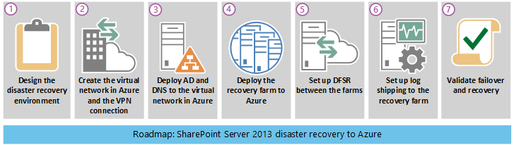

# <a name="sharepoint-server-2013-disaster-recovery-in-microsoft-azure"></a>Ripristino di emergenza di SharePoint Server 2013 in Microsoft Azure

 **Riepilogo:** Con Azure è possibile creare un ambiente di ripristino di emergenza per la farm locale di SharePoint. In questo articolo viene descritto come progettare e implementare questa soluzione.
  
 Quando nell'ambiente locale di SharePoint si verifica un'emergenza, la massima priorità consiste nel riportare in funzione il sistema rapidamente. Il ripristino di emergenza con SharePoint è più semplice quando si dispone di un ambiente di backup già in esecuzione in Microsoft Azure. In questo video vengono illustrati i concetti principali di un ambiente di failover a caldo di SharePoint e forniti i dettagli completi disponibili in questo articolo.
  

  
Utilizzare questo articolo con il modello della soluzione seguente: **Ripristino di emergenza di SharePoint Microsoft Azure**.
  
[
  
](https://go.microsoft.com/fwlink/p/?LinkId=392555)
  
[PDF](https://go.microsoft.com/fwlink/p/?LinkId=392555) |[Visio](https://go.microsoft.com/fwlink/p/?LinkId=392554)
  
Contenuto dell'articolo:
  
- [Utilizzare i servizi infrastruttura di Azure per il ripristino di emergenza](sharepoint-server-2013-disaster-recovery-in-microsoft-azure.md#AZ)
    
- [Descrizione della soluzione](sharepoint-server-2013-disaster-recovery-in-microsoft-azure.md#SOL)
    
- [Architettura dettagliata](sharepoint-server-2013-disaster-recovery-in-microsoft-azure.md#arch)
    
- [Guida di orientamento al ripristino di emergenza](sharepoint-server-2013-disaster-recovery-in-microsoft-azure.md#RDmap)
    
- [Fase 1: Progettare l'ambiente di ripristino di emergenza](sharepoint-server-2013-disaster-recovery-in-microsoft-azure.md#Phase1)
    
- [Fase 2: Creare la rete virtuale di Azure e la connessione VPN.](sharepoint-server-2013-disaster-recovery-in-microsoft-azure.md#Phase2)
    
- [Fase 3: Distribuire Active Directory e Domain Name Services nella rete virtuale di Azure](sharepoint-server-2013-disaster-recovery-in-microsoft-azure.md#Phase3)
    
- [Fase 4: Distribuire la farm di ripristino di SharePoint in Azure](sharepoint-server-2013-disaster-recovery-in-microsoft-azure.md#Phase4)
    
- [Fase 5: Configurare DFSR tra le farm](sharepoint-server-2013-disaster-recovery-in-microsoft-azure.md#Phase5)
    
- [Fase 6: Configurare il log shipping nella farm di ripristino](sharepoint-server-2013-disaster-recovery-in-microsoft-azure.md#Phase6)
    
- [Fase 7: Convalidare failover e ripristino](sharepoint-server-2013-disaster-recovery-in-microsoft-azure.md#Phase7)
    
- [Ambiente del modello di verifica di Microsoft](sharepoint-server-2013-disaster-recovery-in-microsoft-azure.md#POC)
    
- [Suggerimenti per la risoluzione dei problemi](sharepoint-server-2013-disaster-recovery-in-microsoft-azure.md#Troubleshooting)
    
## <a name="use-azure-infrastructure-services-for-disaster-recovery"></a>Utilizzare i servizi infrastruttura di Azure per il ripristino di emergenza
<a name="AZ"> </a>

Molte organizzazioni non dispongono di un ambiente di ripristino di emergenza per SharePoint, che può essere costoso creare e gestire in locale. servizi infrastruttura di Azure fornisce opzioni interessanti per gli ambienti di ripristino di emergenza che sono più flessibili e meno costosi rispetto alle alternative locali.
  
I vantaggi per l'uso di servizi infrastruttura di Azure includono:
  
- **Meno risorse costose** Gestire e pagare per un numero di risorse ridotto rispetto agli ambienti di ripristino di emergenza locali. Il numero di risorse dipende dall'ambiente di ripristino di emergenza scelto: cold standby, warm standby oppure hot standby.
    
- **Migliore flessibilità delle risorse** In caso di emergenza, è possibile aumentare facilmente la farm di SharePoint di ripristino in modo da soddisfare i requisiti di caricamento. Ridurre quando la risorsa non è più necessaria.
    
- **Impegno ridotto dei centri dati** Utilizzare servizi infrastruttura di Azure anziché investire in un centro dati secondario in un'area diversa.
    
Sono disponibili opzioni meno complesse per le organizzazioni con poca esperienza con il ripristino di emergenza e opzioni avanzate per le organizzazioni con requisiti di resilienza elevata. Le definizioni di ambienti cold standby, warm standby e hot standby sono leggermente diverse quando l'ambiente è ospitato su una piattaforma cloud. Nella tabella seguente vengono descritti questi ambienti per la creazione di una farm di ripristino di SharePoint in Azure.
  
**Tabella: Ambienti di ripristino**

|**Tipo di ambiente di ripristino**|**Descrizione**|
|:-----|:-----|
|Hot  <br/> |Una farm a dimensioni complete viene sottoposta a provisioning e viene eseguita allo standby.  <br/> |
|Warm  <br/> |La farm viene creata e le macchine virtuali sono in esecuzione e aggiornate.  <br/> Il ripristino include il collegamento di database di contenuto, le applicazioni dei servizii di provisioning e la ricerca per indicizzazione del contenuto.  <br/> La farm può essere una versione ridotta della farm di produzione e quindi essere ampliata per soddisfare la base utenti completa.  <br/> |
|Cold  <br/> |La farm viene creata completamente, ma le macchine virtuali sono arrestate.  <br/> La gestione dell'ambiente include l'avvio periodico delle macchine virtuali, l'applicazione di patch, l'aggiornamento e la verifica dell'ambiente.  <br/> Avviare l'ambiente completo in caso di calamità.  <br/> |
   
È importante valutare gli RTO e gli RPO dell'organizzazione. Questi requisiti determinano quale ambiente rappresenta l'investimento più appropriato per l'organizzazione.
  
Nel materiale sussidiario di questo articolo viene descritto come implementare un ambiente warm standby. È anche possibile adattarlo a un ambiente cold standby, anche se è necessario seguire ulteriori procedure per supportare questo tipo di ambiente. In questo articolo non viene descritto come implementare una ambiente hot standby.
  
Per ulteriori informazioni sulle soluzioni di ripristino di emergenza, vedere [Concetti relativi a ripristino di emergenza e disponibilità elevata in SharePoint 2013](https://go.microsoft.com/fwlink/p/?LinkID=393114) e[Scegliere una strategia di ripristino di emergenza per SharePoint 2013](https://go.microsoft.com/fwlink/p/?linkid=203228).
  
## <a name="solution-description"></a>Descrizione della soluzione
<a name="SOL"> </a>

La soluzione di ripristino di emergenza con warm standby richiede l'ambiente seguente:
  
- Una farm di produzione di SharePoint locale
    
- Una farm di SharePoint di ripristino in Azure
    
- Una connessione VPN da sito a sito tra i due ambienti.
    
La figura seguente illustra questi tre elementi.
  
**Figura: elementi di una soluzione con warm standby in Azure**


  
Il log shipping di SQL Server con Replica DFS viene utilizzato per copiare i backup di database e i registri transazioni nella farm di ripristino in Azure: 
  
- Replica DFS trasferisce i registri dall'ambiente di produzione all'ambiente di ripristino. In uno scenario WAN, Replica DFS è più efficiente della spedizione diretta dei registri al server secondario in Azure.
    
- I registri vengono riprodotti in SQL Server nell'ambiente di ripristino in Azure.
    
- I database di contenuto di SharePoint sottoposti a log shipping non vengono associati nell'ambiente di ripristino finché non viene eseguita un esercizio di ripristino.
    
Per ripristinare la farm, effettuare i seguenti passaggi:
  
1. Arrestare il log shipping
    
2. Smettere di accettare il traffico alla farm primaria.
    
3. Riprodurre i registri di transazioni finali.
    
4. Collegare i database di contenuto alla farm.
    
5. Ripristinare le applicazioni di servizio dai database di servizi replicati.
    
6. Aggiornare i record DNS in modo che puntino alla farm di ripristino.
    
7. Avviare una ricerca per indicizzazione completa.
    
È consigliabile provare questa procedura regolarmente e documentarla in modo da garantire che il ripristino dal vivo venga eseguito senza problemi. L'associazione dei database di contenuto e il ripristino delle applicazioni di servizio può richiedere del tempo e in genere implica alcune configurazioni manuali.
  
Dopo che è stato eseguito un ripristino, questa soluzione fornisce gli elementi elencati nella tabella seguente.
  
**Tabella: Obiettivi del ripristino della soluzione**

|**Elemento**|**Descrizione**|
|:-----|:-----|
|Siti e contenuto  <br/> |Siti e contenuto sono disponibili nell'ambiente di ripristino.  <br/> |
|Una nuova istanza di ricerca  <br/> |In questa soluzione con warm standby, la ricerca non viene ripristinata dai database di ricerca. I componenti della ricerca nella farm di ripristino sono configurati in modo più simile possibile alla farm di produzione. Una volta ripristinati i siti e il contenuto, viene avviata una ricerca per indicizzazione completa per ricompilare l'indice di ricerca. Non è necessario attendere che la ricerca per indicizzazione venga completata per rendere disponibili i siti e il contenuto.  <br/> |
|Servizi  <br/> | I servizi che archiviano i dati nei database vengono ripristinati dai database sottoposti a log shipping. I servizi che non archiviano i dati nei database vengono semplicemente avviati. <br/>  Non tutti i servizi con i database devono essere ripristinati. Per i seguenti servizi non è necessario il ripristino dai database e possono essere semplicemente avviati dopo il failover: <br/>  Raccolta dati di utilizzo e integrità <br/>  Servizio informazioni sullo stato <br/>  Word Automation <br/>  Qualsiasi altro servizio che non usa un database <br/> |
   
È possibile lavorare con Microsoft Consulting Services (MCS) o un partner per risolvere obiettivi di ripristino più complessi. Tali obiettivi sono riepilogati nella tabella riportata di seguito:
  
**Tabella: Altri elementi che possono essere gestiti da MCS o da un partner**

|**Elemento**|**Descrizione**|
|:-----|:-----|
|Sincronizzazione di soluzioni farm personalizzate  <br/> |In teoria, la configurazione della farm di ripristino è identica alla farm di produzione. È possibile lavorare con un consulente o un partner per valutare se le soluzioni farm personalizzate vengono replicate e se il processo per mantenere sincronizzati i due ambienti è attivo.  <br/> |
|Connessioni a origini dati in locale  <br/> |Potrebbe non essere pratico replicare le connessioni a sistemi di dati di back-end, ad esempio le connessioni controller di dominio di backup e le origini di contenuto di ricerca.  <br/> |
|Scenari di ripristino di ricerca  <br/> |Poiché le distribuzioni di ricerca aziendali tendono a essere abbastanza univoche e complesse, il ripristino della ricerca dai database richiede un investimento maggiore. È possibile lavorare con un consulente o un partner per identificare e implementare gli scenari di ripristino della ricerca che potrebbero essere richiesti dall'organizzazione.  <br/> |
   
Le istruzioni fornite in questo articolo presuppongono che la farm locale sia già progettata e distribuita.
  
## <a name="detailed-architecture"></a>Architettura dettagliata
<a name="arch"> </a>

In teoria, la configurazione della farm di ripristino in Azure è identica alla farm di produzione locale, incluse le seguenti caratteristiche:
  
- Stessa rappresentazione dei ruoli del server
    
- Stessa configurazione delle personalizzazioni
    
- Stessa configurazione dei componenti di ricerca
    
L'ambiente in Azure può essere una versione ridotta della farm di produzione. Se si prevede di ampliare la farm di ripristino dopo il failover, è importante che all'inizio sia rappresentato ciascun tipo di ruolo del server.
  
La replica di alcune configurazioni nell'ambiente di failover potrebbe non essere pratica. Assicurarsi di testare le procedure di failover e l'ambiente per garantire che la farm di failover offra il livello di servizio previsto.
  
Questa soluzione non prevede una topologia specifica per una farm di SharePoint. Il punto centrale di questa soluzione consiste nell'usare Azure per la farm failover e nell'implementare il log shipping e la Replica DFS tra i due ambienti.
  
### <a name="warm-standby-environments"></a>Ambienti con warm standby

In un ambiente con warm standby, tutte le macchine virtuali nell'ambiente Azure sono in esecuzione. L'ambiente è pronto per un esercizio o un evento di failover.
  
Nella figura seguente viene illustrata una soluzione di ripristino di emergenza da una farm di SharePoint locale a una farm di SharePoint basata su Azure che viene configurata come ambiente con warm standby.
  
**Figura: topologia ed elementi chiave di una farm di produzione e di una farm di ripristino con warm standby.**


  
In questo diagramma:
  
- Sono illustrati due ambienti affiancati: la farm di SharePoint locale e la farm con warm standby in Azure.
    
- Ogni ambiente include una condivisione di file.
    
- Ogni farm include quattro livelli. Per ottenere la disponibilità elevata, ogni livello include due server o macchine virtuali configurate in modo identico per un ruolo specifico, ad esempio servizi front-end, cache distribuita, servizi back-end e database. Non è importante in questa figura per mettere in evidenza componenti specifici. Le due farm sono configurate in modo identico.
    
- Il quarto livello è il livello database. Il log shipping viene usato per copiare i log dal server di database secondario dell'ambiente locale nella condivisione file nello stesso ambiente.
    
- Replica DFS copia i file dalla condivisione file nell'ambiente locale alla condivisione file nell'ambiente Azure.
    
- Il log shipping riproduce i log dalla condivisione di file dell'ambiente Azure nella replica primaria nel gruppo di disponibilità AlwaysOn di SQL Server nell'ambiente di ripristino.
    
### <a name="cold-standby-environments"></a>Ambienti con cold standby

In un ambiente con cold standby, è possibile arrestare la maggior parte delle macchine virtuali della farm di SharePoint. Si consiglia di avviare le macchine virtuali di tanto in tanto, ad esempio ogni due settimane o una volta al mese, in modo che ogni macchina virtuale possa sincronizzarsi con il dominio. Le seguenti macchine virtuali nell'ambiente di ripristino Azure devono rimanere in esecuzione per garantire le operazioni continue di log shipping e Replica DFS:
  
- Condivisione file
    
- Server database primario
    
- Almeno una macchina virtuale che esegue Active Directory Domain Services di Windows Server e DNS
    
La figura seguente mostra un ambiente di failover Azure in cui sono in esecuzione la macchina virtuale della condivisione file e la macchina virtuale database SharePoint principale. Tutte le altre macchine virtuali di SharePoint vengono arrestate. La macchina virtuale che esegue Windows Server Active Directory e DNS non è visualizzata.
  
**Figura: farm di ripristino con cold standby e macchine virtuali in esecuzione**


  
Dopo il failover a un ambiente con cold standby, tutte le macchine virtuali vengono avviate ed è necessario configurar il metodo per ottenere la disponibilità elevata dei server di database, ad esempio i gruppi di disponibilità di SQL Server AlwaysOn.
  
Se vengono implementati più gruppi di archiviazione (i database vengono suddivisi tra più set di disponibilità elevata di SQL Server), il database primario per ogni gruppo di archiviazione deve essere in esecuzione per accettare i log associati al relativo gruppo di archiviazione.
  
### <a name="skills-and-experience"></a>Competenze ed esperienze

In questa soluzione di ripristino di emergenza vengono utilizzate più tecnologie. Per garantire che tali tecnologie interagiscano come previsto, ogni componente nell'ambiente locale e Azure deve essere installato e configurato correttamente. È consigliabile che la persona o il team che configura questa soluzione abbia una buona conoscenza operativa e competenze pratiche relative alle tecnologie descritte nei seguenti articoli:
  
- [Servizi di replica DFS](https://go.microsoft.com/fwlink/p/?LinkId=392698)
    
- [Windows Server Failover Clustering (WSFC) con SQL Server](https://go.microsoft.com/fwlink/p/?LinkId=392701)
    
- [Gruppi di disponibili AlwaysOn (SQL Server)](https://go.microsoft.com/fwlink/p/?LinkId=392725)
    
- [Backup e ripristino di database SQL Server](https://go.microsoft.com/fwlink/p/?LinkId=392728)
    
- [Installazione di SharePoint Server 2013 e distribuzione delle farm](https://go.microsoft.com/fwlink/p/?LinkId=393119)
    
- [Microsoft Azure](https://go.microsoft.com/fwlink/p/?LinkId=392729)
    
Infine, si consigliano competenze di scripting che è possibile utilizzare per automatizzare le attività associate a tali tecnologie. È possibile usare le interfacce utente disponibili per completare tutte le attività descritte in questa soluzione. Tuttavia, un approccio manuale può essere dispendioso in termini di tempo e tendente all'errore e offre risultati non coerenti.
  
Oltre a Windows PowerShell, sono disponibili anche le librerie di Windows PowerShell per SQL Server, SharePoint Server e Azure. Non dimenticare T-SQL, che può anche essere utile per ridurre il tempo necessario a configurare e gestire l'ambiente di ripristino di emergenza.
  
## <a name="disaster-recovery-roadmap"></a>Guida di orientamento al ripristino di emergenza
<a name="RDmap"> </a>


  
Questa guida di orientamento presuppone che si disponga già di una farm SharePoint Server 2013 distribuita nell'ambiente di produzione.
  
**Tabella: Guida di orientamento per il ripristino di emergenza**

|**Fase**|**Descrizione**|
|:-----|:-----|
|Fase 1  <br/> |Progettare l'ambiente di ripristino di emergenza.  <br/> |
|Fase 2  <br/> |Creare la rete virtuale di Azure e la connessione VPN.  <br/> |
|Fase 3  <br/> |Distribuire Active Directory e Domain Name Services nella rete virtuale di Azure.  <br/> |
|Fase 4  <br/> |Distribuire la farm di ripristino di SharePoint in Azure  <br/> |
|Fase 5  <br/> |Configurare DFSR tra le farm  <br/> |
|Fase 6  <br/> |Configurare il log shipping nella farm di ripristino  <br/> |
|Fase 7  <br/> | Convalidare le soluzioni di failover e ripristino. Sono incluse le seguenti procedure e tecnologie: <br/>  Arrestare il log shipping <br/>  Ripristinare i backup. <br/>  Eseguire la ricerca per indicizzazione del contenuto. <br/>  Ripristinare i servizi. <br/>  Gestire i record DNS. <br/> |
   
## <a name="phase-1-design-the-disaster-recovery-environment"></a>Fase 1: Progettare l'ambiente di ripristino di emergenza
<a name="Phase1"> </a>

Utilizzare le istruzioni in [Microsoft Azure Architectures for SharePoint 2013](microsoft-azure-architectures-for-sharepoint-2013.md) per progettare l'ambiente di ripristino di emergenza, inclusa la farm di ripristino di SharePoint. È possibile utilizzare le immagini nella[soluzione di ripristino di emergenza di SharePoint nel file Azure](https://go.microsoft.com/fwlink/p/?LinkId=392554) Visio per avviare il processo di progettazione. È consigliabile progettare l'intero ambiente prima di iniziare qualsiasi lavoro nell'ambiente Azure.
  
Oltre al materiale sussidiario fornito in [Microsoft Azure Architectures for SharePoint 2013](microsoft-azure-architectures-for-sharepoint-2013.md) per la progettazione della rete virtuale, la connessione VPN, Active Directory e la farm di SharePoint, assicurarsi di aggiungere un ruolo di condivisione file per l'ambiente di Azure.
  
Per supportare il log shipping in una soluzione di ripristino di emergenza, una macchina virtuale di condivisione file viene aggiunta alla subnet in cui si trovano i ruoli di database. Condivisione file funge anche come terzo nodo di Maggioranza dei nodi per il gruppo di disponibilità SQL Server AlwaysOn. Si tratta della configurazione consigliata per una farm di SharePoint standard che utilizza i gruppi di disponibilità SQL Server AlwaysOn. 
  
> [!NOTE]
> È importante esaminare i prerequisiti per la partecipazione di un database a un gruppo di disponibilità SQL Server AlwaysOn. Per ulteriori informazioni, vedere [Prerequisiti, restrizioni e consigli relativi ai gruppi di disponibilità AlwaysOn](https://go.microsoft.com/fwlink/p/?LinkId=510870). 
  
**Figura: Posizionamento di un file server utilizzato per una soluzione di ripristino di emergenza**


  
In questo diagramma viene aggiunta una macchina virtuale di condivisione file alla stessa subnet Azure che contiene i ruoli del server di database. Non aggiungere la macchina virtuale di condivisione file a un set di disponibilità con altri ruoli del server, ad esempio ruoli di SQL Server.
  
In caso di preoccupazioni relativamente alla disponibilità elevata dei log, prendere in considerazione un approccio diverso utilizzando [Backup e ripristino di SQL Server con il servizio di archiviazione BLOB di Azure](https://go.microsoft.com/fwlink/p/?LinkId=393113). Si tratta di una nuova funzionalità di Azure che salva i log in un URL di archiviazione del BLOB. Questa soluzione non include materiale sussidiario sull'uso di questa caratteristica.
  
Quando si progetta la farm di ripristino, tenere presente che un ambiente di ripristino di emergenza corretto riflette precisamente la farm di produzione che si desidera ripristinare. Le dimensioni della farm di ripristino non sono la caratteristica più importante nel progetto, nella distribuzione e nel test della farm di ripristino. La scala della farm varia da organizzazione a organizzazione in base alle esigenze aziendali. Esiste la possibilità di utilizzare una farm ridimensionata per una breve interruzione o fin quando la domanda di prestazioni e capacità richiede il ridimensionamento della farm.
  
Configurare la farm di ripristino in modo identico alla farm di produzione, per quanto possibile, facendo sì che soddisfi i requisiti di Contratto di servizio in uso e fornisca la funzionalità necessaria a supportare l'azienda. Quando si progetta l'ambiente di ripristino di emergenza, osservare inoltre il processo di gestione delle modifiche per l'ambiente di produzione in uso. È consigliabile estendere il processo di gestione delle modifiche all'ambiente di ripristino aggiornando l'ambiente di ripristino allo stesso intervallo dell'ambiente di produzione. Come parte del processo di gestione delle modifiche, si consiglia di mantenere un elenco dettagliato della configurazione, delle applicazioni e degli utenti della farm. 
  
## <a name="phase-2-create-the-azure-virtual-network-and-vpn-connection"></a>Fase 2: Creare la rete virtuale di Azure e la connessione VPN.
<a name="Phase2"> </a>

In [Connettere una rete locale a una rete virtuale di Microsoft Azure](connect-an-on-premises-network-to-a-microsoft-azure-virtual-network.md)viene illustrato come pianificare e distribuire la rete virtuale in Azure e su come creare la connessione VPN. Seguire il materiale sussidiario nell'argomento per completare le procedure seguenti:
  
- Pianificare lo spazio di indirizzi IP privato di Rete virtuale.
    
- Pianificare le modifiche dell'infrastruttura di routing per la Rete virtuale.
    
- Pianificare le regole del firewall per il traffico da e verso il dispositivo VPN locale.
    
- Creare la rete virtuale cross-premise in Azure.
    
- Configurare il routing tra la rete locale e la Rete virtuale.
    
## <a name="phase-3-deploy-active-directory-and-domain-name-services-to-the-azure-virtual-network"></a>Fase 3: Distribuire Active Directory e Domain Name Services nella rete virtuale di Azure
<a name="Phase3"> </a>

Questa fase include la distribuzione di Windows Server Active Directory e DNS alla Rete virtuale in uno scenario ibrido come descritto in [Microsoft Azure Architectures for SharePoint 2013](microsoft-azure-architectures-for-sharepoint-2013.md) e come illustrato nella figura seguente.
  
**Figura: Configurazione del dominio ibrido Active Directory**


  
Nella figura, nella stessa sottorete vengono distribuite due macchine virtuali. Ognuna delle macchine virtuali ospita due ruoli: Active Directory e DNS
  
Prima di distribuire Active Directory in Azure, leggere [Linee guida per la distribuzione di Active Directory di Windows Server in macchine virtuali di Azure](https://go.microsoft.com/fwlink/p/?linkid=392681). Queste linee guida consentono di determinare se è necessaria un'architettura diversa o servono impostazioni di configurazione differenti per la soluzione.
  
Per il materiale sussidiario sulla configurazione di un controller di dominio in Azure, vedere [Installazione di un controller di dominio Active Directory di replica in una rete virtuale di Azure](https://go.microsoft.com/fwlink/p/?LinkId=392687).
  
Prima di questa fase, non sono state distribuite macchine virtuali nella Rete virtuale. Le macchine virtuali per l'hosting di DNS e Active Directory probabilmente non solo le macchine virtuali più grandi necessarie per la soluzione. Prima di distribuire queste macchine virtuali, creare innanzitutto la macchina virtuale più grande che si pianifica di utilizzare nella Rete virtuale in uso. In questo modo è possibile garantire che la soluzione sia un tag di Azure che consente le dimensioni massime necessarie. Non è necessario configurare tale macchina virtuale in questo momento. È sufficiente crearla e metterla da parte. Se non si esegue questa operazione, è possibile incorrere in una limitazione quando si tenta di creare macchine virtuali più grandi in un secondo momento, un problema già riscontrato al momento della stesura di questo articolo. 
  
## <a name="phase-4-deploy-the-sharepoint-recovery-farm-in-azure"></a>Fase 4: Distribuire la farm di ripristino di SharePoint in Azure
<a name="Phase4"> </a>

Distribuire la farm di SharePoint nella Rete virtuale in base ai piani di progettazione. Potrebbe essere utile rivedere [Pianificazione per SharePoint 2013 nei servizi infrastruttura di Azure](https://go.microsoft.com/fwlink/p/?LinkId=400984) prima di distribuire i ruoli di SharePoint in Azure.
  
Considerare le seguenti procedure apprese con la creazione del nostro ambiente per modelli di verifica:
  
- Creare macchine virtuali mediante il portale Azure o PowerShell.
    
- Azure e Hyper-V non supportano la memoria dinamica. Assicurarsi che sia stato considerato nelle prestazioni e nella pianificazione delle capacità.
    
- Riavviare le macchine virtuali tramite l'interfaccia di Azure, non dall'accesso alla macchina virtuale stessa. L'utilizzo dell'interfaccia di Azure funziona meglio ed è più prevedibile.
    
- Se si desidera arrestare una macchina virtuale per risparmiare sui costi, utilizzare l'interfaccia di Azure. Se si arresta dall'accesso macchina virtuale, gli addebiti continuano ad accumularsi.
    
- Utilizzare una convenzione di denominazione per le macchine virtuali.
    
- Prestare attenzione alla posizione del centro dati in cui vengono distribuite le macchine virtuali.
    
- La funzione di adattamento automatico in Azure non è supportata per i ruoli di SharePoint.
    
- Non configurare gli elementi nella farm che verrà ripristinata, ad esempio le raccolte siti. 
    
## <a name="phase-5-set-up-dfsr-between-the-farms"></a>Fase 5: Configurare DFSR tra le farm
<a name="Phase5"> </a>

Per configurare la replica di file tramite DFSR, utilizzare il componente aggiuntivo di gestione DNS. Tuttavia, prima della configurazione di DFSR, accedere al file server locale e al file server Azure e abilitare il servizio in Windows.
  
Dal Dashboard Server Manager, procedere come segue:
  
- Configurare il server locale.
    
- Avviare **Aggiunta guidata ruoli e funzionalità**.
    
- Apri il nodo **Servizi file e archiviazione**.
    
- Selezionare **Spazi dei nomi DFS** e **Replica DFS**.
    
- Fare clic su **Avanti** per completare la procedura guidata.
    
Nella tabella seguente vengono forniti i collegamenti ad articoli di riferimento DFSR e ai post di blog.
  
**Tabella: Articoli di riferimento per DFSR**

|**Title**|**Descrizione**|
|:-----|:-----|
|[Replica](https://go.microsoft.com/fwlink/p/?LinkId=392732) <br/> |Argomento di DFS Management TechNet con collegamenti per la replica  <br/> |
|[Replica DFS: Guida di sopravvivenza](https://go.microsoft.com/fwlink/p/?LinkId=392737) <br/> |Wiki con collegamenti a informazioni DFS  <br/> |
|[Replica DFS: Domande frequenti](https://go.microsoft.com/fwlink/p/?LinkId=392738) <br/> |Argomento DFS replica TechNet  <br/> |
|[Blog di Jose Barreto](https://go.microsoft.com/fwlink/p/?LinkId=392739) <br/> |Blog scritto dal responsabile programma di un’entità di sicurezza del team di File Server Microsoft  <br/> |
|[Team di Archiviazione Microsoft - Blog sugli schedari](https://go.microsoft.com/fwlink/p/?LinkId=392740) <br/> |Blog su servizi file e le funzionalità di archiviazione in Windows Server  <br/> |
   
## <a name="phase-6-set-up-log-shipping-to-the-recovery-farm"></a>Fase 6: Configurare il log shipping nella farm di ripristino
<a name="Phase6"> </a>

Il log shipping è il componente fondamentale per la configurazione del ripristino di emergenza in questo ambiente. È possibile utilizzare il log shipping per inviare automaticamente i file di registro delle transazioni per i database da un'istanza del server di database primaria a un'istanza del server di database secondaria. Per configurare il log shipping, vedere [Configure log shipping in SharePoint 2013](http://technet.microsoft.com/library/482aeb81-e2aa-419f-a269-5b349a6c4721.aspx). 
  
> [!IMPORTANT]
> Il supporto del log shipping in SharePoint Server è limitato a determinati database. Per ulteriori informazioni, vedere [Opzioni di disponibilità elevata e di ripristino di emergenza supportate per database di SharePoint (SharePoint 2013)](https://go.microsoft.com/fwlink/p/?LinkId=393121). 
  
## <a name="phase-7-validate-failover-and-recovery"></a>Fase 7: Convalidare failover e ripristino
<a name="Phase7"> </a>

L'obiettivo di questa fase finale consiste nel verificare che la soluzione di ripristino di emergenza funzioni come pianificato. A tale scopo, creare un evento di failover che arresti la farm di produzione e avvii di farm di ripristino di sostituzione. È possibile avviare uno scenario di failover manualmente o mediante gli script.
  
Il primo passaggio consiste nell'interrompere le richieste utente in arrivo per i servizi farm o il contenuto. È possibile farlo disattivando le voci DNS o arrestando i server Web front-end. Quando la farm è "inattiva", è possibile eseguire il failover alla farm di ripristino.
  
### <a name="stop-log-shipping"></a>Arrestare il log shipping

È necessario arrestare il log shipping prima del ripristino della farm. Innanzitutto, arrestare il log shipping sul server secondario in Azure, quindi arrestarlo sul server primario locale. Usare lo script seguente per interrompere il log shipping innanzitutto sul server secondario e quindi sul server primario. I nomi dei database nello script potrebbero essere diversi, a seconda dell'ambiente.
  
```
-- This script removes log shipping from the server.
-- Commands must be executed on the secondary server first and then on the primary server.

SET NOCOUNT ON
DECLARE  @PriDB nvarchar(max)
,@SecDB nvarchar(250)
,@PriSrv nvarchar(250)
,@SecSrv nvarchar(250)

Set @PriDB= ''
SET @PriDB = UPPER(@PriDB)
SET @PriDB = REPLACE(@PriDB, ' ', '')
SET @PriDB = '''' + REPLACE(@PriDB, ',', ''', ''') + ''''

Set @SecDB = @PriDB

Exec ( 'Select  ''exec master..sp_delete_log_shipping_secondary_database '' + '''''''' + prm.primary_database +  ''''''''   
from msdb.dbo.log_shipping_monitor_primary prm INNER JOIN msdb.dbo.log_shipping_primary_secondaries sec  ON  prm.primary_database=sec.secondary_database
where prm.primary_database in ( ' + @PriDB + ' )')

Exec ( 'Select  ''exec master..sp_delete_log_shipping_primary_secondary '' + '''''''' + prm.Primary_Database + '''''', '''''' + sec.Secondary_Server + '''''', '''''' + sec.Secondary_database + ''''''''   
from msdb.dbo.log_shipping_monitor_primary prm INNER JOIN msdb.dbo.log_shipping_primary_secondaries sec  ON  prm.primary_database=sec.secondary_database
where prm.primary_database in ( ' + @PriDB + ' )')

Exec ( 'Select  ''exec master..sp_delete_log_shipping_primary_database '' + '''''''' + prm.primary_database +  ''''''''   
from msdb.dbo.log_shipping_monitor_primary prm INNER JOIN msdb.dbo.log_shipping_primary_secondaries sec  ON  prm.primary_database=sec.secondary_database
where prm.primary_database in ( ' + @PriDB + ' )')

Exec ( 'Select  ''exec master..sp_delete_log_shipping_secondary_primary '' + '''''''' + prm.primary_server + '''''', '''''' + prm.primary_database +  ''''''''   
from msdb.dbo.log_shipping_monitor_primary prm INNER JOIN msdb.dbo.log_shipping_primary_secondaries sec  ON  prm.primary_database=sec.secondary_database
where prm.primary_database in ( ' + @PriDB + ' )')

```

### <a name="restore-the-backups"></a>Ripristinare i backup

I backup devono essere ripristinati nell'ordine in cui sono stati creati. Prima di poter ripristinare uno specifico backup dei log delle transazioni, è necessario innanzitutto ripristinare i backup precedenti indicati di seguito senza eseguire il rollback delle transazioni di cui non è stato eseguito il commit (vale a dire, tramite  `WITH NORECOVERY`):
  
- Backup completo del database e ultimo backup differenziale: ripristinare questi backup, se presenti, effettuati prima del backup del log delle transazioni specifico. Prima della creazione del backup di database completo o differenziale più recente, il database utilizzava il modello di recupero completo o il modello di recupero con registrazione minima delle operazioni bulk.
    
- Tutti i backup dei log delle transazioni: ripristinare qualsiasi backup dei log delle transazioni creato dopo il backup del database completo o il backup differenziale (se ne viene ripristinato uno) e prima del backup del log delle transazioni particolare. I backup dei log devono essere applicati nella sequenza in cui sono stati creati, senza gap nella catena di log.
    
Per ripristinare il database del contenuto nel server secondario in modo che venga eseguito il rendering dei siti, rimuovere tutte le connessioni di database prima del ripristino. Per ripristinare il database, eseguire l'istruzione SQL seguente.
  
```
restore database WSS_Content with recovery

```

> [!IMPORTANT]
> Quando si utilizza T-SQL in modo esplicito, specificare **WITH NORECOVERY** o **WITH RECOVERY** in ogni istruzione RESTORE per eliminare qualsiasi ambiguità. Ciò è molto importante quando si creano gli script. Dopo aver ripristinato i backup completi e differenziali, i log delle transazioni possono essere ripristinati in SQL Server Management Studio. Inoltre, poiché il log shipping è già stato arrestato, il database del contenuto è in stato di standby, pertanto è necessario modificare lo stato per l'accesso completo.
  
In SQL Server Management Studio fare clic con il pulsante destro del mouse sul database **WSS_Content**, puntare ad **Attività** > **Ripristina**, quindi fare clic su **Log delle transazioni** (se non è stato ripristinato il backup completo, questa opzione non è disponibile). Per ulteriori informazioni, vedere[Ripristinare un backup del log delle transazioni (SQL Server)](https://go.microsoft.com/fwlink/p/?LinkId=392778).
  
### <a name="crawl-the-content-source"></a>Ricerca per indicizzazione dell'origine contenuto

È necessario avviare una ricerca per indicizzazione completa per ogni origine di contenuto per ripristinare il servizio di ricerca. Si noti che alcune informazioni di analisi dalla farm locale vengono perse, ad esempio i suggerimenti di ricerca. Prima di iniziare la ricerca per indicizzazione completa, utilizzare il cmdlet **Restore-SPEnterpriseSearchServiceApplication** di Windows PowerShell e specificare il database di amministrazione della ricerca di cui è stato eseguito il log shipping e che è stato replicato, **Search_Service__DB_<GUID>**. Questo cmdlet fornisce la configurazione di ricerca, lo schema, le proprietà gestite, le regole e le origini e consente di creare un set predefinito di altri componenti.
  
Per avviare una ricerca per indicizzazione completa, procedere come segue:
  
1. In Amministrazione centrale SharePoint 2013 andare a **Gestione applicazioni** > **Applicazioni di servizio** > **Gestisci applicazioni di servizio** e fare clic sull'applicazione Servizio di ricerca di cui si desidera effettuare una ricerca per indicizzazione.
    
2. Nella pagina **Amministrazione ricerca** fare clic su **Origini di contenuto**, puntare all'origine contenuto desiderata, fare clic sulla freccia e quindi fare clic su **Avvia ricerca per indicizzazione completa**.
    
### <a name="recover-farm-services"></a>Ripristinare i servizi farm
<a name="Reco"> </a>

Nella tabella seguente viene illustrato come ripristinare i servizi che dispongono di database per i quali è stato eseguito il log shipping, i servizi che dispongono di database per i quali non si consiglia il ripristino con il log shipping e i servizi che non dispongono di database.
  
> [!IMPORTANT]
> Ripristinando un database di SharePoint locale nell'ambiente di Azure, i servizi di SharePoint che non sono stati già installati manualmente in Azure non verranno ripristinati. 
  
**Tabella: Riferimenti di database dell'applicazione di servizio**

|**Ripristinare questi servizi dai database per i quali è stato eseguito il log shipping**|**Sebbene questi servizi dispongano di database, ma è consigliabile avviarli senza ripristinarne i database**|**Questi servizi non archiviano i dati nei database. Avviarli dopo il failover**|
|:-----|:-----|:-----|
| Servizio di traduzione automatica <br/>  Servizio metadati gestiti <br/>  Servizio di archiviazione sicura <br/>  Profilo utente. Sono supportati solo i database Profilo e Social tagging. Il database Sincronizzazione non è supportato. <br/>  Servizio impostazioni di sottoscrizione di Microsoft SharePoint Foundation <br/> | Raccolta dati di integrità e utilizzo <br/>  Servizio informazioni sullo stato <br/>  Word Automation <br/> | Excel Services <br/>  PerformancePoint Services <br/>  Conversione PowerPoint <br/>  Servizio grafica di Visio <br/>  Gestione del lavoro <br/> |
   
Nell'esempio seguente viene illustrato come ripristinare il servizio metadati gestiti da un database.
  
Questo metodo utilizza il database Managed_Metadata_DB esistente. Viene eseguito il log shipping del database, ma non è presente alcuna applicazione di servizio attivo nella farm secondaria, pertanto deve essere connesso dopo l'installazione dell'applicazione di servizio.
  
Innanzitutto, utilizzare  `New-SPMetadataServiceApplication` e specificare l'opzione `DatabaseName` con il nome del database ripristinato.
  
Successivamente, configurare la nuova applicazione di servizio metadati gestiti sul server secondario, come indicato di seguito:
  
- Nome: Servizio metadati gestiti
    
- Server di database: il nome del database del log delle transazioni spedito
    
- Nome database:Managed_Metadata_DB
    
- Pool di applicazioni: Applicazioni di servizio di SharePoint 
    
### <a name="manage-dns-records"></a>Gestione dei record DNS
<a name="DNS"> </a>

È necessario creare manualmente i record DNS in modo che puntino alla farm di SharePoint in uso.
  
Nella maggior parte dei casi in cui si dispone di più server Web front-end, è opportuno sfruttare la funzionalità Bilanciamento carico di rete in Windows Server 2012 o un bilanciamento del carico hardware per distribuire le richieste tra i server Web-front-end della farm. Bilanciamento carico di rete consente inoltre di ridurre i rischi distribuendo le richieste agli altri server se uno dei server Web-front-end ha esito negativo. 
  
In genere, quando si configura il bilanciamento del carico di rete, al cluster viene assegnato un singolo indirizzo IP. Viene quindi creato un record host DNS nel provider DNS per la rete che punta al cluster (per questo progetto, un server DNS è inserito in Azure per la resilienza in caso di un errore del centro dati locale.) Ad esempio, è possibile creare un record DNS, in Gestore DNS in Active Directory, denominato  `http://sharepoint.contoso.com`, che punta all'indirizzo IP per il cluster con carico bilanciato.
  
Per l'accesso esterno alla farm di SharePoint, è possibile creare un record host su un server DNS esterno con lo stesso URL utilizzato dai client nella rete Intranet (ad esempio, http://sharepoint.contoso.com) che punta a un indirizzo IP esterno del firewall. Utilizzando questo esempio, una procedura consigliata consiste nel configurare un DNS suddiviso in modo che il server DNS interno sia rilevante per contoso.com e instradi le richieste direttamente al cluster di farm di SharePoint, invece di instradare le richieste DNS al server DNS esterno. È quindi possibile mappare l'indirizzo IP esterno all'indirizzo IP interno del cluster locale in modo che i client trovino le risorse che stanno cercando.
  
Da qui è possibile incorrere in scenari di ripristino di emergenza diversi:
  
 **Scenario di esempio: La farm di SharePoint locale non è disponibile a causa di un errore hardware nella farm di SharePoint locale.** In questo caso, dopo aver completato la procedura per eseguire il failover alla farm di SharePoint di Azure, è possibile configurare il bilanciamento del carico di rete nei server Web front-end della farm di ripristino di SharePoint nello stesso modo utilizzato con la farm locale. È possibile reindirizzare il record host nel provider DNS interno in modo che punti all'indirizzo IP del cluster della farm di ripristino. Si noti che prima che i record memorizzati nella cache dei client vengano aggiornati e puntino alla farm di ripristino potrebbe trascorrere del tempo.
  
 **Scenario di esempio: il centro dati locale viene perso completamente.** Questo scenario potrebbe verificarsi a causa di un disastro naturale, ad esempio un incendio o un'alluvione. In tal caso, è probabile che un'azienda disponga di un centro dati secondario ospitato in un'altra area geografica, nonché una subnet Azure con servizi directory e DNS propri. Come illustrato nello scenario di emergenza precedente, è possibile reindirizzare i record DNS interni ed esterni in modo che puntino alla farm di SharePoint di Azure. Anche in questo caso, prendere nota che la propagazione dei record DNS può richiedere un po' di tempo.
  
Se si usano raccolte siti con nome host, come consigliato in [Architettura e distribuzione di raccolte siti con nome host (SharePoint 2013)](https://go.microsoft.com/fwlink/p/?LinkId=393120), è possibile che più raccolte siti siano ospitate dalla stessa applicazione Web nella farm di SharePoint, con nomi DNS univoci (ad esempio, http://sales.contoso.com e http://marketing.contoso.com). In questo caso, è possibile creare record DNS per ogni raccolta siti che punta all'indirizzo IP del cluster. Quando una richiesta raggiunge i server Web front-end di SharePoint, questi gestiscono il routing di ogni richiesta alla raccolta siti appropriata.
  
## <a name="microsoft-proof-of-concept-environment"></a>Ambiente del modello di verifica di Microsoft
<a name="POC"> </a>

Abbiamo progettato e testato un ambiente di prova per questa soluzione. L'obiettivo di progettazione per il nostro ambiente di testing era quello di distribuire e ripristinare una farm di SharePoint che era possibile trovare in un ambiente del cliente. Dopo aver fatto alcune supposizioni, siamo giunti alla conclusione che la farm dovesse fornire tutte le funzionalità predefinite senza personalizzazioni. La topologia è stata progettata per l'elevata disponibilità utilizzando il materiale sussidiario delle procedure consigliate dal campo e dal gruppo di prodotti.
  
La tabella seguente descrive le macchine virtuali Hyper-V che sono state create e configurate per l'ambiente di test locale.
  
**Tabella: Macchine virtuali per il test locale**

|**Nome del server**|**Ruolo**|**Configurazione**|
|:-----|:-----|:-----|
|DC1  <br/> |Controller di dominino con Active Directory  <br/> |Due processori  <br/> Da 512 MB a 4 GB di RAM  <br/> 1 disco rigido da 127 GB  <br/> |
|RRAS  <br/> |Server configurato con il ruolo di Routing e Accesso remoto (RRAS).  <br/> |Due processori  <br/> 2 - 8 GB di RAM  <br/> 1 disco rigido da 127 GB  <br/> |
|FS1  <br/> |File server con condivisioni per i backup e un endpoint per DFSR.  <br/> |Quattro processori  <br/> 2 - 12 GB di RAM  <br/> 1 disco rigido da 127 GB  <br/> 1 disco rigido da 1 TB (SAN)  <br/> 1 disco rigido da 750 GB  <br/> |
|SP-WFE1, SP-WFE2  <br/> |Server Web front-end.  <br/> |Quattro processori  <br/> 16 GB di RAM  <br/> |
|SP-APP1, SP-APP2, SP-APP3  <br/> |Server applicazioni.  <br/> |Quattro processori  <br/> 2 - 16 GB di RAM  <br/> |
|SP-SQL-HA1 SP-SQL-HA2  <br/> |Server di database, configurati con gruppi di disponibilità AlwaysOn SQL Server 2012 per garantire disponibilità elevata. Questa configurazione utilizza SP-SQL-HA1 e SP-SQL-HA2 come repliche primarie e secondarie.  <br/> |Quattro processori  <br/> 2 - 16 GB di RAM  <br/> |
   
La tabella seguente descrive le configurazioni di unità per le macchine virtuali Hyper-V che abbiamo creato e configurato per i server Web front-end e i server applicazioni per l'ambiente di test locale.
  
**Tabella: Requisiti delle unità macchina virtuale per i server Web front-end e i server applicazioni per il test locale**

|**Lettera di unità**|**Dimensioni**|**Nome della directory**|**Percorso**|
|:-----|:-----|:-----|:-----|
|C  <br/> |80  <br/> |Unità di sistema  <br/> |<DriveLetter>:\\Programmi\\Microsoft SQL Server\\  <br/> |
|E  <br/> |80  <br/> |Unità di registro (40 GB)  <br/> |<DriveLetter>:\\Programmi\\Microsoft SQL Server\\MSSQL10_50.MSSQLSERVER\\MSSQL\\DATI  <br/> |
|F  <br/> |80  <br/> |Pagina (36 GB)  <br/> |<DriveLetter>:\\Programmi\\Microsoft SQL Server\\MSSQL\\DATI  <br/> |
   
La tabella seguente descrive le configurazioni di unità per le macchine virtuali Hyper-V create e configurate per fungere da server di database locali. Nella pagina **Configurazione del motore di database** accedere alla scheda **Directory dati** per impostare e confermare le impostazioni riportate nella tabella seguente.
  
**Tabella: Requisiti delle unità macchina virtuale per i server di database per il test locale**

|**Lettera di unità**|**Dimensioni**|**Nome della directory**|**Percorso**|
|:-----|:-----|:-----|:-----|
|C  <br/> |80  <br/> |Directory radice dati  <br/> |<DriveLetter>:\\Programmi\\Microsoft SQL Server\\  <br/> |
|E  <br/> |500  <br/> |Directory database utente  <br/> |<DriveLetter>:\\Programmi\\Microsoft SQL Server\\MSSQL10_50.MSSQLSERVER\\MSSQL\\DATI  <br/> |
|F  <br/> |500  <br/> |Directory log database utente  <br/> |<DriveLetter>:\\Programmi\\Microsoft SQL Server\\MSSQL10_50.MSSQLSERVER\\MSSQL\\DATI  <br/> |
|G  <br/> |500  <br/> |Directory DB temp  <br/> |<DriveLetter>:\\Programmi\\Microsoft SQL Server\\MSSQL10_50.MSSQLSERVER\\MSSQL\\DATI  <br/> |
|H  <br/> |500  <br/> |Directory log DB temp  <br/> |<DriveLetter>:\\Programmi\\Microsoft SQL Server\\MSSQL10_50.MSSQLSERVER\\MSSQL\\DATI  <br/> |
   
### <a name="setting-up-the-test-environment"></a>Configurazione dell'ambiente di testing

Durante le diverse fasi di distribuzione, in genere il team ha lavorato innanzitutto all'architettura locale e quindi sull'ambiente Azure corrispondente. Questo riflette i casi generali reali in cui erano già in esecuzione le farm di produzione interne. Ciò che è ancora più importante è che è necessario conoscere il carico di lavoro di produzione corrente, la capacità e le prestazioni tipiche. Oltre a creare un modello di ripristino di emergenza in grado di soddisfare i requisiti aziendali, è consigliabile ridimensionare i server della farm di ripristino in modo da fornire un livello minimo di servizio. In un ambiente con cold oppure warm standby, una farm di ripristino in genere è più piccola di una farm di produzione. Quando la farm di ripristino è stabile e in produzione, la farm può essere ridimensionata in verticale e in orizzontale per soddisfare i requisiti di carico di lavoro.
  
Abbiamo distribuito l'ambiente di testing nelle tre fasi indicate di seguito:
  
- Configurazione dell'infrastruttura ibrida
    
- Provisioning dei server
    
- Distribuzione delle farm di SharePoint.
    
#### <a name="set-up-the-hybrid-infrastructure"></a>Configurazione dell'infrastruttura ibrida

Questa fase ha implicato la configurazione di un ambiente di dominio per la farm locale e per la farm di ripristino in Azure. Oltre alle normali attività associate alla configurazione di Active Directory, il team di testing ha implementato una soluzione di routing e una connessione VPN tra i due ambienti.
  
#### <a name="provision-the-servers"></a>Provisioning dei server

Oltre ai server della farm, è stato necessario eseguire il provisioning dei server per i controller di dominio e configurare un server per gestire l'RRAS, nonché la rete VPN da sito a sito. Per il servizio DFSR, è stato eseguito il provisioning di due file server, mentre per i tester è stato eseguito il provisioning di diversi computer client.
  
#### <a name="deploy-the-sharepoint-farms"></a>Distribuzione delle farm di SharePoint.

Le farm di SharePoint sono state distribuite in due fasi, in modo da semplificare la stabilizzazione e la risoluzione dei problemi dell'ambiente, se necessarie. Durante la prima fase, ogni farm è stata distribuita su un numero minimo di server per ogni livello della topologia per supportare la funzionalità necessaria.
  
Abbiamo creato i server di database con SQL Server installato prima di creare i server SharePoint 2013. Poiché si trattava di una nuova distribuzione, abbiamo creato i gruppi di disponibilità prima di distribuire SharePoint. Abbiamo creato tre gruppi in base al materiale sussidiario delle procedure consigliate di MCS. 
  
> [!NOTE]
> Creare database di segnaposto in modo che sia possibile creare gruppi di disponibilità prima dell'installazione di SharePoint. Per ulteriori informazioni, vedere [Configurare gruppi di disponibilità AlwaysOn di SQL Server 2012 per SharePoint 2013](https://go.microsoft.com/fwlink/p/?LinkId=517626)
  
Abbiamo la farm e unito altri server nell'ordine seguente:
  
- Provisioning di SP-SQL-HA1 e SP-SQL-HA2.
    
- Configurazione di AlwaysOn e creazione di tre gruppi di disponibilità per la farm. 
    
- Provisioning di SP-APP1 all'host Amministrazione centrale.
    
- Provisioning di SP-WFE1 e SP-WFE2 per ospitare la cache distribuita. 
    
Abbiamo utilizzato il parametro  _skipRegisterAsDistributedCachehost_ quando abbiamo eseguito **psconfig.exe** alla riga di comando. Per ulteriori informazioni, vedere[Pianificare i feed e il servizio cache distribuita in SharePoint Server 2013](https://go.microsoft.com/fwlink/p/?linkid=270985). 
  
Abbiamo ripetuto i passaggi seguenti nell'ambiente di ripristino:
  
- Provisioning di AZ-SQL-HA1 e AZ-SQL-HA2.
    
- Configurazione di AlwaysOn e creazione di tre gruppi di disponibilità per la farm.
    
- Provisioning di  AZ-APP1 per l’hosting di Amministrazione centrale.
    
- Provisioning di AZ-WFE1 e AZ-WFE2 per ospitare la cache distribuita.
    
Dopo aver configurato la cache distribuita e aggiunto utenti di test e contenuto di test, abbiamo avviato la fase due della distribuzione. Questa operazione ha richiesto la scalabilità dei livelli e la configurazione dei server della farm per supportare la topologia di elevata disponibilità descritta nell'architettura della farm.
  
La tabella seguente descrive le macchine virtuali, le subnet e i set di disponibilità che abbiamo configurato per la nostra farm di ripristino.
  
**Tabella: Infrastruttura della farm di ripristino**

|**Nome del server**|**Ruolo**|**Configurazione**|**Subnet**|**Set di disponibilità**|
|:-----|:-----|:-----|:-----|:-----|
|spDRAD  <br/> |Controller di dominino con Active Directory  <br/> |Due processori  <br/> Da 512 MB a 4 GB di RAM  <br/> 1 disco rigido da 127 GB  <br/> |sp-ADservers  <br/> ||
|AZ-SP-FS  <br/> |File server con condivisioni per i backup e un endpoint per DFSR.  <br/> | Configurazione di A5: <br/>  Due processori <br/>  14 GB di RAM <br/>  1 disco rigido da 127 GB <br/>  1 disco rigido da 135 GB <br/>  1 disco rigido da 127 GB <br/>  1 disco rigido da 150 GB <br/> |sp-databaseservers  <br/> |DATA_SET  <br/> |
|AZ-WFE1, AZ -WFE2  <br/> |Server Web di front-end  <br/> | Configurazione di A5: <br/>  Due processori <br/>  14 GB di RAM <br/>  1 disco rigido da 127 GB <br/> |sp-webservers  <br/> |WFE_SET  <br/> |
|AZ -APP1, AZ -APP2, AZ -APP3  <br/> |Server applicazioni  <br/> | Configurazione di A5: <br/>  Due processori <br/>  14 GB di RAM <br/>  1 disco rigido da 127 GB <br/> |sp-applicationservers  <br/> |APP_SET  <br/> |
|AZ -SQL-HA1, AZ -SQL-HA2  <br/> |Server di database e repliche primarie e secondarie per gruppi di disponibilità AlwaysOn  <br/> | Configurazione di A5: <br/>  Due processori <br/>  14 GB di RAM <br/> |sp-databaseservers  <br/> |DATA_SET  <br/> |
   
### <a name="operations"></a>Operations

Dopo che il team di testing ha stabilizzato gli ambienti della farm e ha completato il test funzionale, sono state iniziate le seguenti attività necessarie per configurare l'ambiente di ripristino locale:
  
- Configurazione di backup completi e differenziali.
    
- Configurazione del servizio DFSR nei file server che trasferiscono i log delle transazioni tra l'ambiente locale e l'ambiente Azure.
    
- Configurazione del log shipping nel server di database principale.
    
- Stabilizzazione, convalidare e risoluzione dei problemi di log shipping in base alle esigenze. Ciò ha incluso l'identificazione e la documentazione di qualsiasi comportamento che potesse causare problemi, ad esempio la latenza di rete, che poteva causare problemi nel log shipping nella sincronizzazione dei file DFSR.
    
### <a name="databases"></a>Database

I nostri test di failover hanno interessato i seguenti database: 
  
- WSS_Content
    
- ManagedMetadata
    
- Database dei profili
    
- Database di sincronizzazione
    
- Database social
    
- Hub tipo di contenuto (un database per un hub diffusione tipo di contenuto dedicato)
    
## <a name="troubleshooting-tips"></a>Suggerimenti per la risoluzione dei problemi
<a name="Troubleshooting"> </a>

La sezione illustra i problemi che si sono verificati durante il test e le relative soluzioni. 
  
### <a name="using-the-term-store-management-tool-caused-the-error-the-managed-metadata-store-or-connection-is-currently-not-available"></a>L'utilizzo dello Strumento di gestione archivio termini ha causato l'errore "The Managed Metadata Store or Connection is currently not available", in cui si comunica che l'archivio dei metadati gestiti o la connessione non è disponibile al momento.

Assicurarsi che l'account del pool di applicazioni utilizzato dall'applicazione Web disponga dell’autorizzazione Accesso in lettura all'archivio termini.
  
### <a name="custom-term-sets-are-not-available-in-the-site-collection"></a>I set di termini personalizzati non sono disponibili nella raccolta siti

Cercare un'associazione tra applicazioni di servizio mancanti tra le raccolte siti del contenuto e l'hub del tipo di contenuto. Inoltre, nella schermata delle proprietà **Metadati gestiti - <site collection name> Connessione**, assicurarsi che questa opzione sia abilitata: **L'applicazione di servizio rappresenta il percorso di archiviazione predefinito per set di termini specifici di colonne.**
  
### <a name="the-get-adforest-windows-powershell-command-generates-the-error-the-term-get-adforest-is-not-recognized-as-the-name-of-a-cmdlet-function-script-file-or-operable-program"></a>Il comando Get-ADForest di Windows PowerShell genera l'errore, "Termine 'Get-ADForest' non riconosciuto come nome di cmdlet, funzione, programma eseguibile o file script."

Quando si configurano i profili utente, è necessario il nome della foresta Active Directory. In Aggiunta guidata ruoli e funzionalità, assicurarsi di aver abilitato il Modulo di Azure Active Directory per Windows PowerShell (nella sezione **Strumenti di amministrazione remota del server> Strumenti di amministrazione ruoli>Strumenti per Servizi di dominio Active Directory e AD LDS**). Inoltre, eseguire i comandi seguenti prima di utilizzare **Get-ADForest**, per garantire che vengano caricate le dipendenze del software.
  
```
Import-module servermanager
Import-module activedirectory

```

### <a name="availability-group-creation-fails-at-starting-the-alwaysonhealth-xevent-session-on-server-name"></a>Errore di creazione del gruppo di disponibilità all'avvio della sessione 'AlwaysOn_health' XEvent in '<server name>'

Verificare che entrambi i nodi del cluster di failover siano nello stato "Attivo" e non "Sospeso" o "Interrotto". 
  
### <a name="sql-server-log-shipping-job-fails-with-access-denied-error-trying-to-connect-to-the-file-share"></a>Il processo di log shipping di SQL Server ha esito negativo con un errore di accesso negato nel tentativo di connettersi alla condivisione file

Assicurarsi che SQL Server Agent sia in esecuzione con le credenziali di rete, anziché le credenziali predefinite.
  
### <a name="sql-server-log-shipping-job-indicates-success-but-no-files-are-copied"></a>Il processo di log shipping di SQL Server indica l'esito positivo, ma i file non vengono copiati

Ciò accade perché la preferenza di backup predefinito per un gruppo di disponibilità è **Preferisco secondario**. Assicurarsi di eseguire il processo di log shipping dal server secondario per il gruppo di disponibilità anziché dal primario; in caso contrario, il processo si interrompe senza avvisi. 
  
### <a name="managed-metadata-service-or-other-sharepoint-service-fails-to-start-automatically-after-installation"></a>Il servizio Metadati gestiti (o un altro servizio di SharePoint) non si avvia automaticamente dopo l'installazione

I servizi potrebbero richiedere alcuni minuti per avviarsi, a seconda delle prestazioni e del carico corrente del server di SharePoint. Scegliere manualmente **Start** per il servizio e fornire il tempo sufficiente per l'avvio aggiornando di tanto in tanto la schermata Servizi nel server per monitorarne lo stato. Nel caso in cui il servizio resti in stato di arresto, abilitare la registrazione diagnostica di SharePoint, tentare di avviare di nuovo il servizio e quindi verificare l'assenza di errori nel log. Per ulteriori informazioni, vedere[Configurare la registrazione diagnostica in SharePoint 2013](https://go.microsoft.com/fwlink/p/?LinkId=510884)
  
### <a name="after-changing-dns-to-the-azure-failover-environment-client-browsers-continue-to-use-the-old-ip-address-for-the-sharepoint-site"></a>Dopo la modifica DNS per l'ambiente di failover di Azure, i browser client continuano a usare il vecchio indirizzo IP del sito di SharePoint

La modifica DNS potrebbe non essere immediatamente visibile a tutti i client. In un client di prova, eseguire il seguente comando da un prompt dei comandi con privilegi elevati e tentare di accedere nuovamente al sito.
  
```
Ipconfig /flushdns
```

## <a name="additional-resources"></a>Risorse aggiuntive
<a name="Troubleshooting"> </a>

[Opzioni di disponibilità elevata e di ripristino di emergenza supportate per database di SharePoint (SharePoint 2013)](https://go.microsoft.com/fwlink/p/?LinkId=393121)
  
[Configurare gruppi di disponibilità AlwaysOn di SQL Server 2012 per SharePoint 2013](https://go.microsoft.com/fwlink/p/?LinkId=393122)
  
## <a name="see-also"></a>Vedere anche

<a name="Troubleshooting"> </a>

[Adozione del cloud e soluzioni ibride](cloud-adoption-and-hybrid-solutions.md)


