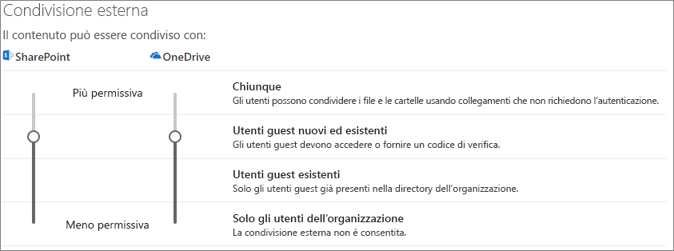
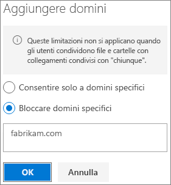

# Limitare l'esposizione accidentale ai file durante la condivisione con gli utenti guestLimit accidental exposure to files when sharing with guests

Quando si condividono file e cartelle con utenti guest sono disponibili diverse opzioni per ridurre le possibilità di condivisione accidentale di informazioni riservate.When sharing files and folders with guests, there are a variety of options to reduce the chances of accidentally sharing confidential information. È possibile scegliere tra le opzioni disponibili in questo articolo per soddisfare al meglio le esigenze dell'organizzazione.You can choose from the options in this article to best meet the needs of your organization.

## Usare le procedure consigliate per i collegamenti di tipo “Chiunque”Use best practices for Anyone links

Se le persone dell'organizzazione devono eseguire una condivisione anonima, ma si incorre nel rischio che gli utenti non autenticati modifichino il contenuto, leggere [Procedure consigliate per la condivisione anonima](best-practices-anonymous-sharing.md) per istruzioni su come gestire la condivisione anonima nell’organizzazione.If people in your organization need to do anonymous sharing, but you're concerned about unauthenticated guests modifying content, read [Best practices for anonymous sharing](best-practices-anonymous-sharing.md) for guidance on how to work with anonymous sharing in your organization.

## Disattivare i collegamenti di tipo “Chiunque”Turn off Anyone links

È consigliabile lasciare abilitati i collegamenti di tipo *Chiunque* per il contenuto appropriato, perché è il modo più semplice per condividere informazioni e contribuisce a ridurre il rischio che gli utenti cerchino altre soluzioni fuori dal controllo del reparto IT.We recommend leaving *Anyone* links enabled for appropriate content because it's the easiest way to share and can help reduce the risk of users seeking other solutions that are outside the control of your IT department. I collegamenti di tipo *Chiunque* possono essere inoltrati ad altri, ma l'accesso ai file è disponibile solo per gli utenti che dispongono del collegamento.*Anyone* links can be forwarded to others, but file access is only available to those who have the link.

Se si vuole che gli utenti eseguano sempre l'autenticazione per accedere al contenuto di SharePoint, Groups o Teams, è possibile disattivare la condivisione *Chiunque*.If you always want guests to authenticate when accessing content in SharePoint, Groups, or Teams, you can turn off *Anyone* sharing. In questo modo è possibile impedire agli utenti di condividere contenuto in modo anonimo.This will prevent users from sharing content anonymously.

Se si disabilitano i collegamenti di tipo *Chiunque*, gli utenti potranno comunque condividerli facilmente con gli utenti guest utilizzando i collegamenti di tipo *Persone specifiche*.If you disable *Anyone* links, users can still easily share with guests using *Specific people* links. In questo caso, per poter accedere al contenuto condiviso, tutti gli utenti guest dovranno eseguire l'autenticazione.In this case, all guests will be required to authenticate before they can access the shared content.

In base alle proprie esigenze, è possibile disabilitare i collegamenti di tipo *Chiunque* per siti specifici o per l'intera organizzazione.Depending on your needs, you can disable *Anyone* links for specific sites, or for your whole organization.

Per disattivare i collegamenti di tipo *Chiunque* per l'organizzazioneTo turn off *Anyone* links for your organization
1. Nella parte sinistra dell'interfaccia di amministrazione di SharePoint, fare clic su **Condivisione**.In the SharePoint Online admin center, in the left navigation, click **configure hybrid**.
2. Impostare le impostazioni di condivisione esterna di SharePoint su **Utenti guest nuovi ed esistenti**.Set the SharePoint external sharing settings to **New and existing guests**. 
   
3. Fare clic su **Salva**.Click **Save**.

Per disattivare i collegamenti di tipo *Chiunque* per un sitoTo turn off *Anyone* links for a site
1. Nella parte sinistra dell'interfaccia di amministrazione di SharePoint, espandere **Siti** e fare clic su **Siti attivi**.In the SharePoint admin center, in the left navigation, expand **Sites** and click **Active sites**.
2. Selezionare il sito del team appena creato.Select the site for the team that you just created.
3. Sulla barra multifunzione fare clic su **Condivisione**.In the ribbon, click **New**.
4. Verificare che la condivisione sia impostata su **Utenti guest nuovi ed esistenti**.Ensure that sharing is set to **New and existing guests**. 
   
5. Se si apportano modifiche, fare clic su **Salva**.If you make any changes, click **Save**.

## Filtro dominiDomain filtering

È possibile usare gli elenchi di domini consentiti o non consentiti per determinare da quali domini gli utenti possono invitare utenti guest.You can use domain allow or deny lists to determine which domains your users can invite guests from.

Con un elenco di domini consentiti è possibile specificare un elenco di domini da cui gli utenti dell'organizzazione possono invitare utenti guest.With an allow list, you can specify a list of domains from which users in your organization can invite guests. Gli inviti guest ad altri domini sono bloccati.Guest invitations to other domains are blocked. Se l'organizzazione collabora solo con utenti guest da un elenco di domini specifici, è possibile usare questa caratteristica per impedire la condivisione con altri domini.If your organization only collaborates with guests from a list of specific domains, you can use this feature to prevent sharing with other domains.

Con un elenco di domini non consentiti è possibile specificare un elenco di domini da cui gli utenti dell'organizzazione non possono invitare utenti guest.With a deny list, you can specify a list of domains from which users in your organization cannot invite guests. Gli inviti guest ai domini presenti nell’elenco sono bloccati.Guest invitations to the listed domains are blocked. Questa opzione può essere utile, ad esempio, se si vuole impedire che alcuni concorrenti specifici diventino utenti guest nell’organizzazione.This can be useful if you have competitors, for example, who you want to prevent from becoming guests in your organization.

Gli elenchi di domini consentiti e non consentiti influiscono solo sulle condivisioni con utenti guest autenticati.The allow and deny lists only affect sharing with authenticated guests. Gli utenti possono continuare a condividere contenuti con utenti guest da domini non consentiti tramite i collegamenti di tipo *Chiunque*, se questi non sono stati disabilitati.Users can still share with guests from prohibited domains by using *Anyone* links if you haven't disabled them. Per ottenere risultati ottimali con gli elenchi di domini consentiti e non consentiti, è consigliabile disabilitare i collegamenti di tipo *Chiunque* come descritto sopra.For best results with domain allow and deny lists, consider disabling *Anyone* links as described above.

Per creare un elenco di domini consentiti o non consentiti per la condivisione guestTo set up a domain allow or deny list for guest sharing
1. Nella parte sinistra dell'interfaccia di amministrazione di SharePoint, fare clic su **Condivisione**.In the SharePoint Online admin center, in the left navigation, click **configure hybrid**.
2. In **Impostazioni avanzate per la condivisione esterna** selezionare la casella di controllo **Limitare la condivisione esterna in base al dominio**.Under **Advanced settings for external sharing**, select the **Limit external sharing by domain** check box.
3. Fare clic su **Aggiungi domini**.Click **Add domains**.
4. Selezionare se si vogliono bloccare i domini, digitare i domini e quindi fare clic su **OK**.Select whether you want to block domains, type the domains, and click **OK**. 
   
5. Fare clic su **Salva**.Click **Save**.

Se si vuole limitare la condivisione in base al dominio a un livello superiore rispetto a SharePoint e OneDrive, è possibile [consentire o bloccare gli inviti agli utenti B2B da organizzazioni specifiche](https://docs.microsoft.com/azure/active-directory/b2b/allow-deny-list) in Azure Active Directory.If you want to limit sharing by domain at a higher level than SharePoint and OneDrive, you can [allow or block invitations to B2B users from specific organizations](https://docs.microsoft.com/azure/active-directory/b2b/allow-deny-list) in Azure Active Directory. (È necessario configurare l’[anteprima dell'integrazione di SharePoint e OneDrive con Azure AD B2B](https://docs.microsoft.com/sharepoint/sharepoint-azureb2b-integration-preview) perché queste impostazioni influiscano su SharePoint e OneDrive.)(You must configure the [SharePoint and OneDrive integration with Azure AD B2B Preview](https://docs.microsoft.com/sharepoint/sharepoint-azureb2b-integration-preview) for these settings to affect SharePoint and OneDrive.)

## Limitare la condivisione guest di file, cartelle e siti a gruppi di sicurezza specificiLimit guest sharing of files, folders, and sites to specified security groups

È possibile limitare la condivisione guest di file, cartelle e siti ai membri di un gruppo di sicurezza specifico.You can restrict guest sharing of files, folders, and sites to members of a specific security group. Questa opzione è utile se si vuole abilitare la condivisione guest, ma con un flusso di lavoro di approvazione o un processo di richiesta.This is useful if you want to enable guest sharing, but with an approval workflow or request process.

Per limitare la condivisione guest ai membri di un gruppo di sicurezzaTo limit guest sharing to members of a security group
1. Nella parte sinistra dell'interfaccia di amministrazione di SharePoint, fare clic su **Condivisione**.In the SharePoint Online admin center, in the left navigation, click **configure hybrid**.
2. In **Altre impostazioni**Under **Other settings**. seguire il collegamento **Limitare la condivisione esterna ai gruppi di sicurezza**.follow the **Limit external sharing to specific security groups** link.
3. In **Chi può condividere all'esterno dell'organizzazione** selezionare una o entrambe le caselle di controllo: a.Under **Who can share outside your organization**, select one or both of the check boxes: a. **Consenti solo agli utenti dei gruppi di sicurezza selezionati di condividere con utenti esterni autenticati** per specificare un gruppo di sicurezza che può condividere con utenti autenticati b.**Let only users in selected security groups share with authenticated external users** to specify a security group that can share with authenticated users b. **Consenti la condivisione con utenti esterni autenticati e usando collegamenti anonimi ai soli utenti dei gruppi di sicurezza selezionati** per specificare un gruppo di sicurezza che può condividere con utenti autenticati e usando collegamenti di tipo Chiunque**Let only users in selected security groups share with authenticated external users and using anonymous links** to specify a security group that can share with authenticated users and by using Anyone links
4. Fare clic su **OK**.Click **OK**.

Si noti che questo influisce su file, cartelle e siti, ma non sui gruppi di Office 365 o su Teams.Note that this affects files, folders, and sites, but not Office 365 groups or Teams. Quando i membri invitano gli utenti guest a un gruppo di Office 365 privato o a un team privato in Microsoft Teams, l'invito viene inviato al proprietario del gruppo o del team per l'approvazione.When members invite guests to a private Office 365 group or a private team in Microsoft Teams, the invitation is sent to the group or team owner for approval.

## Vedere ancheSee Also

[Creare un ambiente di condivisione guest sicuroCreate a secure guest sharing environment](create-a-secure-guest-sharing-environment.md)

[Procedure consigliate per la condivisione di file e cartelle con utenti anonimiBest practices for sharing files and folders with anonymous users](best-practices-anonymous-sharing.md)