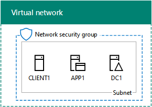
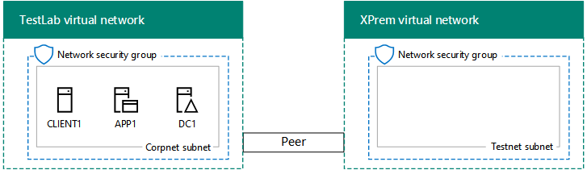

# <a name="simulated-cross-premises-virtual-network-in-azure"></a><span data-ttu-id="938ff-103">Rete virtuale tra più sedi simulata in Azure</span><span class="sxs-lookup"><span data-stu-id="938ff-103">Simulated cross-premises virtual network in Azure</span></span>

 <span data-ttu-id="938ff-104">**Riepilogo:** Creare una rete virtuale simulato tra locali in Microsoft Azure come un ambiente di sviluppo e di testing.</span><span class="sxs-lookup"><span data-stu-id="938ff-104">**Summary:** Create a simulated cross-premises virtual network in Microsoft Azure as a dev/test environment.</span></span>
  
<span data-ttu-id="938ff-p101">In questo articolo viene mostrato come creare un ambiente basato su cloud con Microsoft Azure usando due reti virtuali Azure. Di seguito è riportata la configurazione risultante.  </span><span class="sxs-lookup"><span data-stu-id="938ff-p101">This article steps you through creating a simulated hybrid cloud environment with Microsoft Azure using two Azure virtual networks. Here is the resulting configuration.</span></span> 
  

  
<span data-ttu-id="938ff-108">Questa simula un ambiente di produzione cloud ibrido in IaaS di Azure ed è costituita da:</span><span class="sxs-lookup"><span data-stu-id="938ff-108">This simulates an Azure IaaS hybrid cloud production environment and consists of:</span></span>
  
- <span data-ttu-id="938ff-109">	Una rete locale simulata e semplificata, ospitata in una rete virtuale di Azure (la rete virtuale TestLab).</span><span class="sxs-lookup"><span data-stu-id="938ff-109">A simulated and simplified on-premises network hosted in an Azure virtual network (the TestLab virtual network).</span></span>
    
- <span data-ttu-id="938ff-110">	Una rete virtuale cross-premise simulata ospitata in Azure (XPrem).</span><span class="sxs-lookup"><span data-stu-id="938ff-110">A simulated cross-premises virtual network hosted in Azure (XPrem).</span></span>
    
- <span data-ttu-id="938ff-111">	Una relazione peering di rete virtuale tra le due reti virtuali.</span><span class="sxs-lookup"><span data-stu-id="938ff-111">A VNet peering relationship between the two virtual networks.</span></span>
    
- <span data-ttu-id="938ff-112">	Un controller di dominio secondario nella rete virtuale XPrem.</span><span class="sxs-lookup"><span data-stu-id="938ff-112">A secondary domain controller in the XPrem virtual network.</span></span>
    
<span data-ttu-id="938ff-113">Tale configurazione fornisce una base e un punto di partenza comune da cui è possibile: </span><span class="sxs-lookup"><span data-stu-id="938ff-113">This provides a basis and common starting point from which you can:</span></span> 
  
- <span data-ttu-id="938ff-114">	Sviluppare e testare applicazioni in un ambiente cloud ibrido simulato in IaaS di Azure.</span><span class="sxs-lookup"><span data-stu-id="938ff-114">Develop and test applications in a simulated Azure IaaS hybrid cloud environment.</span></span>
    
- <span data-ttu-id="938ff-115">	Creare configurazioni di test dei computer, alcune all'interno della rete virtuale TestLab e alcune all'interno della rete virtuale XPrem, per simulare carichi di lavoro IT basati su cloud ibridi.</span><span class="sxs-lookup"><span data-stu-id="938ff-115">Create test configurations of computers, some within the TestLab virtual network and some within the XPrem virtual network, to simulate hybrid cloud-based IT workloads.</span></span>
    
<span data-ttu-id="938ff-116">Le fasi principali della configurazione dell'ambiente di sviluppo e testing sono tre:</span><span class="sxs-lookup"><span data-stu-id="938ff-116">There are three major phases to setting up this dev/test environment:</span></span>
  
1. <span data-ttu-id="938ff-117">	Configurare la rete virtuale TestLab.</span><span class="sxs-lookup"><span data-stu-id="938ff-117">Configure the TestLab virtual network.</span></span>
    
2. <span data-ttu-id="938ff-118">Creare la rete virtuale cross-premise.</span><span class="sxs-lookup"><span data-stu-id="938ff-118">Create the cross-premises virtual network.</span></span>
    
3. <span data-ttu-id="938ff-119">Configurare DC2.</span><span class="sxs-lookup"><span data-stu-id="938ff-119">Configure DC2.</span></span>
    
> [!NOTE]
> <span data-ttu-id="938ff-120">Questa configurazione richiede una sottoscrizione a pagamento di Azure.</span><span class="sxs-lookup"><span data-stu-id="938ff-120">This configuration requires a paid Azure subscription.</span></span> 
  

  
> [!TIP]
> <span data-ttu-id="938ff-122">Fare clic [qui](http://aka.ms/catlgstack) per consultare una mappa di tutti gli articoli relativi alla guida del laboratorio di testing cloud di One Microsoft.</span><span class="sxs-lookup"><span data-stu-id="938ff-122">Click [here](http://aka.ms/catlgstack) for a visual map to all the articles in the One Microsoft Cloud Test Lab Guide stack.</span></span>
  
## <a name="phase-1-configure-the-testlab-virtual-network"></a><span data-ttu-id="938ff-123">Fase 1: Configurare la rete virtuale TestLab</span><span class="sxs-lookup"><span data-stu-id="938ff-123">Phase 1: Configure the TestLab virtual network</span></span>

<span data-ttu-id="938ff-124">Utilizzare le istruzioni [nell'ambiente di sviluppo/test di configurazione di Base](base-configuration-dev-test-environment.md) per configurare i computer DC1, APP1 e CLIENT1 nella rete virtuale Azure denominata laboratorio di test.</span><span class="sxs-lookup"><span data-stu-id="938ff-124">Use the instructions in [Base Configuration dev/test environment](base-configuration-dev-test-environment.md) to configure the DC1, APP1, and CLIENT1 computers in the Azure virtual network named TestLab.</span></span>
  
<span data-ttu-id="938ff-125">Questa è la configurazione corrente.</span><span class="sxs-lookup"><span data-stu-id="938ff-125">This is your current configuration.</span></span> 
  

  
## <a name="phase-2-create-the-xprem-virtual-network"></a><span data-ttu-id="938ff-127">Fase 2: Creare la rete virtuale XPrem</span><span class="sxs-lookup"><span data-stu-id="938ff-127">Phase 2: Create the XPrem virtual network</span></span>

<span data-ttu-id="938ff-128">In questa fase, viene creata e configurata la nuova rete virtuale XPrem, viene quindi eseguita la connessione alla rete virtuale TestLab con peering di rete virtuale.</span><span class="sxs-lookup"><span data-stu-id="938ff-128">In this phase, you create and configure the new XPrem virtual network and then connect it to the TestLab virtual network with VNet peering.</span></span>
  
<span data-ttu-id="938ff-129">Innanzitutto, avviare un prompt dei comandi di Azure PowerShell sul computer locale.</span><span class="sxs-lookup"><span data-stu-id="938ff-129">First, start an Azure PowerShell prompt on your local computer.</span></span>
  
> [!NOTE]
> <span data-ttu-id="938ff-p102">Il seguente comando consente di utilizzare la versione più recente di Azure PowerShell. Vedere [iniziare a utilizzare i cmdlet PowerShell di Azure](https://docs.microsoft.com/en-us/powershell/azureps-cmdlets-docs/).</span><span class="sxs-lookup"><span data-stu-id="938ff-p102">The following command sets use the latest version of Azure PowerShell. See [Get started with Azure PowerShell cmdlets](https://docs.microsoft.com/en-us/powershell/azureps-cmdlets-docs/).</span></span> 
  
<span data-ttu-id="938ff-132">Accedere al proprio account Azure con il seguente comando.</span><span class="sxs-lookup"><span data-stu-id="938ff-132">Sign in to your Azure account with the following command.</span></span>
  
```
Login-AzureRMAccount
```

> [!TIP]
> <span data-ttu-id="938ff-133">Fare clic [qui](https://gallery.technet.microsoft.com/PowerShell-commands-for-7844edd0) per ottenere un file di testo che contiene tutti i comandi di PowerShell in questo articolo.</span><span class="sxs-lookup"><span data-stu-id="938ff-133">Click [here](https://gallery.technet.microsoft.com/PowerShell-commands-for-7844edd0) to get a text file that contains all of the PowerShell commands in this article.</span></span>
  
<span data-ttu-id="938ff-134">Ottenere il nome della sottoscrizione utilizzando il comando seguente.</span><span class="sxs-lookup"><span data-stu-id="938ff-134">Get your subscription name using the following command.</span></span>
  
```
Get-AzureRMSubscription | Sort Name | Select Name
```

<span data-ttu-id="938ff-p103">Impostare la sottoscrizione di Azure. Sostituire tutte le virgolette, incluse le \< e > caratteri con i nomi corretti.</span><span class="sxs-lookup"><span data-stu-id="938ff-p103">Set your Azure subscription. Replace everything within the quotes, including the \< and > characters, with the correct names.</span></span>
  
```
$subscrName="<subscription name>"
Get-AzureRmSubscription -SubscriptionName $subscrName | Select-AzureRmSubscription
```

<span data-ttu-id="938ff-137">Successivamente, creare la rete virtuale XPrem e proteggerla con un gruppo di sicurezza di rete con questi comandi.</span><span class="sxs-lookup"><span data-stu-id="938ff-137">Next, create the XPrem virtual network and protect it with a network security group with these commands.</span></span>
  
```
$rgName="<name of the resource group that you used for your TestLab virtual network>"
$locName=(Get-AzureRmResourceGroup -Name $rgName).Location
$Testnet=New-AzureRMVirtualNetworkSubnetConfig -Name "Testnet" -AddressPrefix 192.168.0.0/24
New-AzureRMVirtualNetwork -Name "XPrem" -ResourceGroupName $rgName -Location $locName -AddressPrefix 192.168.0.0/16 -Subnet $Testnet -DNSServer 10.0.0.4
$rule1=New-AzureRMNetworkSecurityRuleConfig -Name "RDPTraffic" -Description "Allow RDP to all VMs on the subnet" -Access Allow -Protocol Tcp -Direction Inbound -Priority 100 -SourceAddressPrefix Internet -SourcePortRange * -DestinationAddressPrefix * -DestinationPortRange 3389
New-AzureRMNetworkSecurityGroup -Name "Testnet" -ResourceGroupName $rgName -Location $locName -SecurityRules $rule1
$vnet=Get-AzureRMVirtualNetwork -ResourceGroupName $rgName -Name XPrem
$nsg=Get-AzureRMNetworkSecurityGroup -Name "Testnet" -ResourceGroupName $rgName
Set-AzureRMVirtualNetworkSubnetConfig -VirtualNetwork $vnet -Name "Testnet" -AddressPrefix 192.168.0.0/24 -NetworkSecurityGroup $nsg
```

<span data-ttu-id="938ff-138">Creare quindi la relazione peering di rete virtuale tra le reti virtuali TestLab e XPrem con questi comandi.</span><span class="sxs-lookup"><span data-stu-id="938ff-138">Next, you create the VNet peering relationship between the TestLab and XPrem VNets with these commands.</span></span>
  
```
$rgName="<name of the resource group that you used for your TestLab virtual network>"
$vnet1=Get-AzureRmVirtualNetwork -ResourceGroupName $rgName -Name TestLab
$vnet2=Get-AzureRmVirtualNetwork -ResourceGroupName $rgName -Name XPrem
Add-AzureRmVirtualNetworkPeering -Name TestLab2XPrem -VirtualNetwork $vnet1 -RemoteVirtualNetworkId $vnet2.Id
Add-AzureRmVirtualNetworkPeering -Name XPrem2TestLab -VirtualNetwork $vnet2 -RemoteVirtualNetworkId $vnet1.Id
```

<span data-ttu-id="938ff-139">Questa è la configurazione corrente.</span><span class="sxs-lookup"><span data-stu-id="938ff-139">This is your current configuration.</span></span> 
  

  
## <a name="phase-3-configure-dc2"></a><span data-ttu-id="938ff-141">Fase 3: Configurare DC2</span><span class="sxs-lookup"><span data-stu-id="938ff-141">Phase 3: Configure DC2</span></span>

<span data-ttu-id="938ff-142">In questa fase, viene creata la macchina virtuale DC2 nella rete virtuale XPrem e viene configurata come controller di dominio di replica.</span><span class="sxs-lookup"><span data-stu-id="938ff-142">In this phase, you create the DC2 virtual machine in the XPrem virtual network and then configure it as a replica domain controller.</span></span>
  
<span data-ttu-id="938ff-p104">Creare innanzitutto una macchina virtuale per DC2. Eseguire questi comandi al prompt dei comandi di Azure PowerShell nel computer locale.</span><span class="sxs-lookup"><span data-stu-id="938ff-p104">First, create a virtual machine for DC2. Run these commands at the Azure PowerShell command prompt on your local computer.</span></span>
  
```
$rgName="<your resource group name>"
$locName=(Get-AzureRmResourceGroup -Name $rgName).Location
$vnet=Get-AzureRMVirtualNetwork -Name XPrem -ResourceGroupName $rgName
$pip=New-AzureRMPublicIpAddress -Name DC2-PIP -ResourceGroupName $rgName -Location $locName -AllocationMethod Dynamic
$nic=New-AzureRMNetworkInterface -Name DC2-NIC -ResourceGroupName $rgName -Location $locName -SubnetId $vnet.Subnets[0].Id -PublicIpAddressId $pip.Id -PrivateIpAddress 192.168.0.4
$vm=New-AzureRMVMConfig -VMName DC2 -VMSize Standard_A1
$cred=Get-Credential -Message "Type the name and password of the local administrator account for DC2."
$vm=Set-AzureRMVMOperatingSystem -VM $vm -Windows -ComputerName DC2 -Credential $cred -ProvisionVMAgent -EnableAutoUpdate
$vm=Set-AzureRMVMSourceImage -VM $vm -PublisherName MicrosoftWindowsServer -Offer WindowsServer -Skus 2016-Datacenter -Version "latest"
$vm=Add-AzureRMVMNetworkInterface -VM $vm -Id $nic.Id
$vm=Set-AzureRmVMOSDisk -VM $vm -Name "DC2-OS" -DiskSizeInGB 128 -CreateOption FromImage -StorageAccountType "StandardLRS"
$diskConfig=New-AzureRmDiskConfig -AccountType "StandardLRS" -Location $locName -CreateOption Empty -DiskSizeGB 20
$dataDisk1=New-AzureRmDisk -DiskName "DC2-DataDisk1" -Disk $diskConfig -ResourceGroupName $rgName
$vm=Add-AzureRmVMDataDisk -VM $vm -Name "DC2-DataDisk1" -CreateOption Attach -ManagedDiskId $dataDisk1.Id -Lun 1
New-AzureRMVM -ResourceGroupName $rgName -Location $locName -VM $vm
```

<span data-ttu-id="938ff-145">Collegare alla macchina virtuale DC2 nuova dal [portale di Azure](https://portal.azure.com) utilizzando il nome dell'account amministratore locale e la password.</span><span class="sxs-lookup"><span data-stu-id="938ff-145">Next, connect to the new DC2 virtual machine from the [Azure portal](https://portal.azure.com) using its local administrator account name and password.</span></span>
  
<span data-ttu-id="938ff-p105">Configurare quindi una regola di Windows Firewall per consentire la verifica di connettività di base del traffico. Eseguire questi comandi in DC2 al prompt dei comandi di Windows PowerShell a livello di amministratore. </span><span class="sxs-lookup"><span data-stu-id="938ff-p105">Next, configure a Windows Firewall rule to allow traffic for basic connectivity testing. From an administrator-level Windows PowerShell command prompt on DC2, run these commands.</span></span> 
  
```
Set-NetFirewallRule -DisplayName "File and Printer Sharing (Echo Request - ICMPv4-In)" -enabled True
ping dc1.corp.contoso.com
```

<span data-ttu-id="938ff-p106">Il comando ping dovrebbe produrre quattro risposte dall'indirizzo IP 10.0.0.4. Si tratta di un test del traffico attraverso la relazione peering di rete virtuale. </span><span class="sxs-lookup"><span data-stu-id="938ff-p106">The ping command should result in four successful replies from IP address 10.0.0.4. This is a test of traffic across the VNet peering relationship.</span></span> 
  
<span data-ttu-id="938ff-150">Successivamente, aggiungere un ulteriore disco dati come nuovo volume con lettera di unità F: con questo comando in DC2 al prompt dei comandi di Windows PowerShell.</span><span class="sxs-lookup"><span data-stu-id="938ff-150">Next, add the extra data disk as a new volume with the drive letter F: with this command from the Windows PowerShell command prompt on DC2.</span></span>
  
```
Get-Disk | Where PartitionStyle -eq "RAW" | Initialize-Disk -PartitionStyle MBR -PassThru | New-Partition -AssignDriveLetter -UseMaximumSize | Format-Volume -FileSystem NTFS -NewFileSystemLabel "WSAD Data"
```

<span data-ttu-id="938ff-p107">Configurare quindi DC2 come controller di dominio di replica per il dominio corp.contoso.com. Eseguire questi comandi in DC2 al prompt dei comandi di Windows PowerShell:</span><span class="sxs-lookup"><span data-stu-id="938ff-p107">Next, configure DC2 as a replica domain controller for the corp.contoso.com domain. Run these commands from the Windows PowerShell command prompt on DC2.</span></span>
  
```
Install-WindowsFeature AD-Domain-Services -IncludeManagementTools
Install-ADDSDomainController -Credential (Get-Credential CORP\\User1) -DomainName "corp.contoso.com" -InstallDns:$true -DatabasePath "F:\\NTDS" -LogPath "F:\\Logs" -SysvolPath "F:\\SYSVOL"
```

<span data-ttu-id="938ff-153">Si noti che viene richiesto di specificare sia il CORP\\User1 password e una password di ripristino servizi modalità (Directory) e il riavvio DC2.</span><span class="sxs-lookup"><span data-stu-id="938ff-153">Note that you are prompted to supply both the CORP\\User1 password and a Directory Services Restore Mode (DSRM) password, and to restart DC2.</span></span> 
  
<span data-ttu-id="938ff-p108">Ora che la rete virtuale XPrem dispone di un proprio server DNS (DC2), è necessario configurare la rete virtuale XPrem per utilizzarlo. Eseguire questi comandi nel computer locale al prompt dei comandi di Azure PowerShell.</span><span class="sxs-lookup"><span data-stu-id="938ff-p108">Now that the XPrem virtual network has its own DNS server (DC2), you must configure the XPrem virtual network to use this DNS server. Run these commands from the Azure PowerShell command prompt on your local computer.</span></span>
  
```
$vnet=Get-AzureRmVirtualNetwork -ResourceGroupName $rgName -name "XPrem"
$vnet.DhcpOptions.DnsServers="192.168.0.4" 
Set-AzureRmVirtualNetwork -VirtualNetwork $vnet
Restart-AzureRmVM -ResourceGroupName $rgName -Name "DC2"
```

<span data-ttu-id="938ff-p109">Dal portale di Azure nel computer locale, la connessione a DC1 con la CORP\\credenziali User1. Per configurare il dominio in modo che gli utenti e computer utilizzano i controller di dominio locale per l'autenticazione, eseguire questi comandi dal prompt dei comandi di Windows PowerShell livello di amministratore in DC1.</span><span class="sxs-lookup"><span data-stu-id="938ff-p109">From the Azure portal on your local computer, connect to DC1 with the CORP\\User1 credentials. To configure the CORP domain so that computers and users use their local domain controller for authentication, run these commands from an administrator-level Windows PowerShell command prompt on DC1.</span></span>
  
```
New-ADReplicationSite -Name "TestLab" 
New-ADReplicationSite -Name "XPrem"
New-ADReplicationSubnet -Name "10.0.0.0/8" -Site "TestLab"
New-ADReplicationSubnet -Name "192.168.0.0/16" -Site "XPrem"
```

<span data-ttu-id="938ff-158">Questa è la configurazione corrente.</span><span class="sxs-lookup"><span data-stu-id="938ff-158">This is your current configuration.</span></span> 
  

  
<span data-ttu-id="938ff-160">L’ambiente cloud ibrido di Azure simulato è ora pronto per eseguire test.</span><span class="sxs-lookup"><span data-stu-id="938ff-160">Your simulated Azure hybrid cloud environment is now ready for testing.</span></span>
  
## <a name="next-step"></a><span data-ttu-id="938ff-161">Passaggio successivo</span><span class="sxs-lookup"><span data-stu-id="938ff-161">Next step</span></span>

<span data-ttu-id="938ff-162">Utilizzare l'ambiente di sviluppo e di testing per simulare una [farm di SharePoint Server 2016 intranet ospitate in Azure](https://technet.microsoft.com/library/mt806351%28v=office.16%29.aspx).</span><span class="sxs-lookup"><span data-stu-id="938ff-162">Use this dev/test environment to simulate a [SharePoint Server 2016 intranet farm hosted in Azure](https://technet.microsoft.com/library/mt806351%28v=office.16%29.aspx).</span></span>
  
## <a name="see-also"></a><span data-ttu-id="938ff-163">See Also</span><span class="sxs-lookup"><span data-stu-id="938ff-163">See Also</span></span>

[<span data-ttu-id="938ff-164">Ambiente di sviluppo/test della configurazione di base</span><span class="sxs-lookup"><span data-stu-id="938ff-164">Base Configuration dev/test environment</span></span>](base-configuration-dev-test-environment.md)
  
[<span data-ttu-id="938ff-165">Ambiente di sviluppo/test di Office 365</span><span class="sxs-lookup"><span data-stu-id="938ff-165">Office 365 dev/test environment</span></span>](office-365-dev-test-environment.md)
  
[<span data-ttu-id="938ff-166">DirSync per l'ambiente di sviluppo/test di Office 365</span><span class="sxs-lookup"><span data-stu-id="938ff-166">DirSync for your Office 365 dev/test environment</span></span>](dirsync-for-your-office-365-dev-test-environment.md)
  
[<span data-ttu-id="938ff-167">Cloud App Security per l'ambiente di sviluppo/test di Office 365</span><span class="sxs-lookup"><span data-stu-id="938ff-167">Cloud App Security for your Office 365 dev/test environment</span></span>](cloud-app-security-for-your-office-365-dev-test-environment.md)
  
[<span data-ttu-id="938ff-168">Protezione avanzata dalle minacce per l'ambiente di sviluppo/test di Office 365</span><span class="sxs-lookup"><span data-stu-id="938ff-168">Advanced Threat Protection for your Office 365 dev/test environment</span></span>](advanced-threat-protection-for-your-office-365-dev-test-environment.md)
  
[<span data-ttu-id="938ff-169">Adozione del cloud e soluzioni ibride</span><span class="sxs-lookup"><span data-stu-id="938ff-169">Cloud adoption and hybrid solutions</span></span>](cloud-adoption-and-hybrid-solutions.md)


