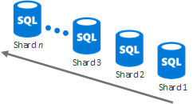
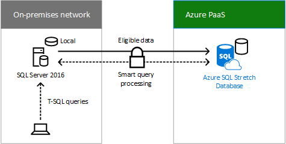
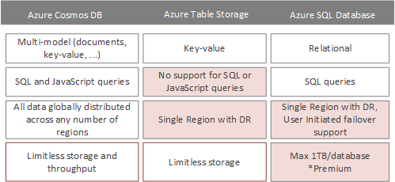

# Alcuni assembly richiestiSome assembly required

 **Sintesi:** visualizzare i dettagli sul set di opzioni di archiviazione cloud che è possibile utilizzare per creare la propria soluzione di archiviazione personalizzata.**Summary:** Get the details on the set of cloud storage options that you can use to create your custom storage solution.
  
Soluzioni di archiviazione "Alcuni assembly richiesti":"Some assembly required " storage solutions:
  
- Utilizza i servizi esistenti come punto di partenza per la soluzione di archiviazione.Use existing services as a starting point for your storage solution.
    
- Richiede la configurazione o la codifica.Require some configuration or coding.
    
- Può essere personalizzato per adattarlo alle proprie esigenze.Can be customized to fit your needs.
    
Le sezioni seguenti descrivono i dettagli di ciascuna soluzione di archiviazione "Alcuni assembly richiesti".The following sections describe the details of each "Some assembly required" storage solution.
  
## Rete per la distribuzione di contenutiAzure Content Delivery Network

### FunzionalitàFeatures

- Analisi avanzate e in tempo realeAdvanced and real time analytics
    
- Sicurezza solida contro DDoSRobust security against DDoS
    
- Ottiene il contenuto automaticamente da un sito Web di Azure o da un servizio cloud di Azure dopo aver configurato l'integrazioneGets content automatically from an Azure Website or Azure Cloud Service once you set up the integration
    
- Nuova relazione con AkamaiNew partnership with Akamai
    
- In grado di gestire picchi improvvisi di traffico e carichi di lavoro elevatiCan handle sudden traffic spikes and heavy loads
    
### Utilizzi comuniCommon uses

- Distribuire audio, video, applicazioni, immagini e altri file in modo più veloce e affidabile ai clienti utilizzando i server a loro più viciniDistribute audio, video, applications, images, and other files faster and more reliably to customers by using the servers that are closest to them
    
### Scenari di archiviazione chiaveKey storage scenarios

- Gestire i datiManage data
    
- Gestire i videoManage videos
    
### RisorseResources

Per ulteriori informazioni, fare clic [qui](https://azure.microsoft.com/services/cdn/).For additional information, click [here](https://azure.microsoft.com/services/cdn/).
  
Per informazioni sui costi, fare clic [qui](https://azure.microsoft.com/pricing/details/cdn/).For cost information, click [here](https://azure.microsoft.com/pricing/details/cdn/).
  
## HdInsightHdInsight

### FunzionalitàFeatures

- Distribuzione di Apache Hadoop con tecnologia cloud Un servizio Data LakeApache Hadoop distribution powered by the cloud A Data Lake service
    
- Ridimensiona in petabyte su richiestaScale to petabytes on demand
    
- Elabora dati non strutturati e semi-strutturati Sviluppa in Java, .NET e così viaProcess unstructured and semi-structured data Develop in Java, .NET, and more
    
- Ignora l'acquisto e la manutenzione di hardwareSkip buying and maintaining hardware
    
- Connette cluster Hadoop locali con il cloudConnect on-premises Hadoop clusters with the cloud
    
- Flessibilità per distribuire progetti Hadoop arbitrari tramite script personalizzati (ad esempio, R, Giraph, Solr)Flexibility to deploy arbitrary Hadoop projects through custom scripts (e.g. R, Giraph, Solr)
    
### Utilizzi comuniCommon uses

- Carichi di lavoro di analisi dei datiData analytics workloads
    
- Framework di elaborazione dei dati in memoria per big data (Spark)In-memory data processing framework for big data (Spark)
    
- Elaborazione del flusso in tempo reale (Storm)Real-time stream processing (Storm)
    
- Elaborazione di grandi transazioni (OLTP) di dati non relazionali (HBase)Large transactional processing (OLTP) of non-relational data (HBase)
    
### Scenari di archiviazione chiaveKey storage scenarios

- Gestire i datiManage data
    
### RisorseResources

Per ulteriori informazioni, fare clic [qui](https://azure.microsoft.com/services/hdinsight/).For additional information, click [here](https://azure.microsoft.com/services/hdinsight/).
  
Per informazioni sui costi, fare clic [qui](https://azure.microsoft.com/pricing/details/hdinsight/).For cost information, click [here](https://azure.microsoft.com/pricing/details/hdinsight/).
  
## Database SQL di AzureAzure SQL Database

### FunzionalitàFeatures

- Ottimizzato per ridurre gestione e costiOptimized to reduce management and costs
    
- Elevata disponibilità automatica, ripristino di emergenza e aggiornamentoAutomatic high availability, disaster recovery, and upgrade
    
- Consigliato per le organizzazioni che gestiscono centinaia o migliaia di database di dimensioni fino a 1 TBRecommended for organizations managing hundreds or thousands of databases of up to 1 TB in size
    
- Le tecniche sharding possono dividere i dati tra database per uno spazio di archiviazione maggiore Sharding techniques can split data across databases for increased storage
    
- Estensione database con SQL Server 2016Stretch database with SQL Server 2016
    
### Utilizzi comuniCommon uses

- Nuove applicazioni progettate per il cloud con dati relazionaliNew cloud-designed applications with relational data
    
- Elaborazione di dati in set di dati schematici, altamente strutturati, con relazioniData processing over schematic, highly structured data sets with relationships
    
- Tipi di dati spaziali o complessiSpatial data or rich data types
    
### Scenari di archiviazione chiaveKey storage scenarios

- Gestire i datiManage data
    
### Database elasticoElastic database

Usare le risorse virtualmente illimitate del database SQL di Azure quando:Use the virtually unlimited resources of Azure SQL Database when:
  
- La quantità totale di dati è troppo grande per rientrare nei limiti di un singolo database.The total amount of data is too large to fit within the constraints of a single database.
    
- La velocità effettiva di transazione del carico di lavoro totale supera le funzionalità di un singolo database.The transaction throughput of the overall workload exceeds the capabilities of a single database.
    
- Tenant richiede l'isolamento fisico tra i database, quindi database separati sono necessari per ogni tenant.Tenants require physical isolation from each other, so separate databases are needed for each tenant.
    
- Sezioni diverse di un database devono risiedere in aree geografiche diverse per conformità, prestazioni o motivi geopolitici.Different sections of a database need to reside in different geographies for compliance, performance, or geopolitical reasons.
    
Con il ridimensionamento verticale, è possibile modificare il livello/l'edizione delle prestazioni del database di Azure oppure tramite pool di database elastici.With vertical scaling, you can change Azure database performance level/edition or by using elastic database pools.
  

  
Con la scalabilità orizzontale, è possibile aggiungere nuovi database in base alle esigenze.With horizontal scaling, you can add new databases as needed.
  

  
Fare clic [qui](https://docs.microsoft.com/azure/sql-database/sql-database-elastic-scale-introduction) per ulteriori informazioni.Click [here](https://docs.microsoft.com/azure/sql-database/sql-database-elastic-scale-introduction) for more information.
  
### Estensione database con SQL Server 2016Stretch Database with SQL Server 2016

L'estensione database è una funzionalità di SQL Server 2016 che consente di spostare in modo sicuro e trasparente semplici dati, come dati aziendali chiusi in una tabella di grandi dimensioni contenente le informazioni sugli ordini dei clienti, in un'estensione database SQL in Azure. Quando estesi, i contenuti di un'istanza di SQL Server, un database o anche una singola tabella sono la combinazione dei dati locali nel server SQL Server 2016 e dei dati remoti in Azure. I dati che diventano idonei per l'estensione vengono spostati automaticamente in Azure mediante SQL Server 2016.Stretch database is a feature of SQL Server 2016 that allows you to transparently and securely move cold data, such as closed business data in a large table that contains customer order information, to a SQL Stretch database in Azure. When stretched, the contents of a SQL Server instance, a database, or even a single table is the combination of local data in SQL Server 2016 server and remote data in Azure. Data that becomes eligible for stretch is automatically moved to Azure by SQL Server 2016.
  

  
Le query degli utenti che includono i dati cronologici vengono inoltrate in modo trasparente all'estensione database Azure SQL. Le query non devono essere riscritte, anche se la tabella viene estesa.User queries that include the historical data are transparently forwarded to Azure SQL Stretch database. The queries do not need to be re-written, even though the table is stretched.
  
Il database esteso fornisce un'opzione conveniente per l'archiviazione a lungo termine e l'accesso trasparente ai dati cronologici. Consente inoltre di risolvere problemi relativi a prestazioni e disponibilità che si verificano quando le tabelle diventano molto grandi.Stretch database provides a cost-effective option for long-term storage and transparent access to historical data. It also solves performance and availability problems that arise when tables become very large.
  
Fare clic [qui](https://msdn.microsoft.com/library/dn935011.aspx) per ulteriori informazioni.Click [here](https://msdn.microsoft.com/library/dn935011.aspx) for more information.
  
### RisorseResources

Per ulteriori informazioni, fare clic [qui](http://azure.microsoft.com/services/sql-database/).For additional information, click [here](http://azure.microsoft.com/services/sql-database/).
  
Per informazioni sui costi, fare clic [qui](http://azure.microsoft.com/pricing/details/sql-database/).For cost information, click [here](http://azure.microsoft.com/pricing/details/sql-database/).
  
## Azure Cosmos DBAzure Cosmos DB

### FunzionalitàFeatures

- Bassa latenza garantita, contratto di servizio con disponibilità del 99,99%, scala flessibile di spazio di archiviazione e velocità effettivaGuaranteed low latency, 99.99% availability SLA with limitless, elastic scale of storage and throughput
    
- Tutti i dati vengono replicati a livello globale in qualsiasi numero di aree geografiche con failover trasparente e quattro livelli di coerenza ben definitiAll data is globally replicated across any number of regions with transparent failover and four well-defined consistency levels
    
- Indicizza automaticamente tutti i dati senza la necessità di schemi o indici secondariAutomatically indexes all your data without requiring schemas or secondary indices
    
- Query SQL e JavaScript avanzate e transazioni di più elementiRich SQL and JavaScript queries and multi-item transactions
    
### Utilizzi comuniCommon uses

- IoT, Mobile e SocialeIoT, Mobile and Social
    
- Video gameGaming
    
- DettaglioRetail
    
- Gestione del contenutoContent management
    
### Scenari di archiviazione chiaveKey storage scenarios

- Gestire i datiManage data
    
### Cosmos DB, Tabelle di Azure e Database SQL di AzureCosmos DB vs. Azure Tables vs. Azure SQL Database

Attributi comuni di Cosmos DB, Archiviazione tabelle di Azure e Database SQL di Azure:Common attributes of Cosmos DB, Azure Table Storage, and Azure SQL Database:
  
- Contratto di servizio con disponibilità di 99,9999.99 availability SLA
    
- Servizi di database interamente gestitiFully managed database services
    
- Conforme alle clausole del modello ISO 27001, HIPAA e UEISO 27001, HIPAA and EU Model Clauses Compliant
    
La tabella seguente mostra gli attributi non comuni di Azure Cosmos DB, Archiviazione tabelle di Azure e Database SQL di Azure.The following table shows the uncommon attributes of Azure Cosmos DB, Azure Table Storage, and Azure SQL Database.
  

  
### RisorseResources

Per ulteriori informazioni, fare clic [qui](http://azure.microsoft.com/services/documentdb/).For additional information, click [here](http://azure.microsoft.com/services/documentdb/).
  
Per informazioni sui costi, fare clic [qui](http://azure.microsoft.com/pricing/details/documentdb/).For cost information, click [here](http://azure.microsoft.com/pricing/details/documentdb/).
  
## Servizi multimediali di AzureAzure Media Services

### FunzionalitàFeatures

- Distribuzione Live e Video on demand (VOD) con scalaLive and video on demand (VOD) delivery with scale
    
- Codifica e streaming altamente disponibiliHighly available encoding and streaming
    
- Supporta Flash, iOS, Android, HTML5 e XboxSupports Flash, iOS, Android, HTML5, and Xbox
    
- Supporto DRM certificato di StudioStudio-certified DRM support
    
- Monetizzazione di contenuto formattatoRich content monetization
    
- Ampio ecosistema di partner pre-integratiBroad ecosystem of pre-integrated partners
    
### Utilizzi comuniCommon uses

- Codificare, archiviare e trasmettere audio e video in scalaEncode, store, and stream audio and video at scale
    
- Streaming e VOD in tempo reale Real time streaming and VOD
    
- Gestione semplificata dei contenuti videoStreamlined video content management
    
### Scenari di archiviazione chiaveKey storage scenarios

- Gestire i videoManage videos
    
### RisorseResources

Per ulteriori informazioni, fare clic [qui](https://azure.microsoft.com/services/media-services/).For additional information, click [here](https://azure.microsoft.com/services/media-services/).
  
Per informazioni sui costi, fare clic [qui](http://azure.microsoft.com/pricing/details/media-services/).For cost information, click [here](http://azure.microsoft.com/pricing/details/media-services/).
  
## Cache Redis di AzureAzure Redis Cache

### FunzionalitàFeatures

- Server Redis dedicato, sicuro con disponibilità elevata con replica di dati e failover gestiti da MicrosoftSecure, dedicated Redis server with high-availability with data replication and failover managed by Microsoft
    
- Consigliato per qualsiasi app che richiede una velocità effettiva elevataRecommended for any app needing high-throughput
    
- Disponibile nelle dimensioni fino a 530 GB e oltre (con Premium e sharding automatico)Available in sizes up to 530 GB and beyond (with Premium and automatic sharding)
    
- La persistenza Redis persiste nei dati memorizzati nella memoria cache nello spazio di archiviazione di AzureRedis Persistence persists in-memory cached data to Azure Storage
    
- Il clustering Redis consente all'utente di raggiungere la scala e la velocità effettiva massimaRedis Clustering allows you to achieve maximum scale and throughput
    
- Sicurezza avanzata e isolamento di rete con supporto rete virtuale di AzureEnhanced security and network isolation with Azure Virtual Network support
    
### Utilizzi comuniCommon uses

- Ricerca inversa dei dati in qualsiasi servizio di archiviazione in Azure, ad esempio Cosmos DB e Database SQL di AzureReverse lookup for data in any storage service in Azure, such as Cosmos DB and Azure SQL Database
    
- Contenuto sincronizzato da altri archivi di datiSynchronized content from other data stores
    
### Scenari di archiviazione chiaveKey storage scenarios

- Dati della cacheCache data
    
- Broker di messaggi per applicazioni ad elevata velocità effettivaMessage broker for high-throughput applications
    
### RisorseResources

Per ulteriori informazioni, fare clic [qui](http://azure.microsoft.com/services/cache/).For additional information, click [here](http://azure.microsoft.com/services/cache/).
  
Per informazioni sui costi, fare clic [qui](http://azure.microsoft.com/pricing/details/cache/).For cost information, click [here](http://azure.microsoft.com/pricing/details/cache/).
  
## SQL Server in una VM di AzureSQL Server on an Azure VM

### FunzionalitàFeatures

- SQL Server in esecuzione come un'applicazione installata in una macchina virtuale AzureSQL Server running as an installed application on an Azure virtual machine
    
- Usare un'immagine della raccolta con SQL Server installato o fornire la propria licenza di SQL ServerUse a gallery image with SQL Server installed or bring your own SQL Server license
    
### Utilizzi comuniCommon uses

- Gestire i dati per le applicazioniManage data for applications
    
### Scenari di archiviazione chiaveKey storage scenarios

- Gestire i datiManage data
    
### RisorseResources

Per ulteriori informazioni, fare clic [qui](http://azure.microsoft.com/services/virtual-machines/).For additional information, click [here](http://azure.microsoft.com/services/virtual-machines/).
  
Per informazioni sui costi, fare clic [qui](http://azure.microsoft.com/pricing/details/virtual-machines/).For cost information, click [here](http://azure.microsoft.com/pricing/details/virtual-machines/).
  
## StorSimpleStorSimple

### FunzionalitàFeatures

- Archiviazione SAN scalabile, ibrida, aziendale, con SSD e HDD nella matrice di archiviazione ibrida locale, con spazio di archiviazione cloud come estensione integrata della soluzioneScalable, enterprise hybrid SAN storage with SSD and HDD in the on-premises hybrid storage array, with cloud storage as an integrated extension of the solution
    
- Deduplicazione incorporata, compressione, collegamento automatico, crittografia non strutturata e dati semistrutturatiInline deduplication, compression, automatic tiering, and encryption unstructured and semi structured data
    
- Protezione automatizzata dei dati esterni tramite snapshot cloudAutomated offsite data protection using cloud snapshots
    
- Ripristino di emergenza altamente efficace, indipendente dalla posizioneHighly-efficient, location-independent disaster recovery
    
- Mobilità dei dati per i dati dell'organizzazione con StorSimple Virtual Appliance in AzureData mobility for enterprise data with StorSimple Virtual Appliance in Azure
    
### Utilizzi comuniCommon uses

- Gestire la crescita di dati correlata a condivisioni file, archivi e altri repository di datiManage data growth related to file shares, archives, and other data repositories
    
- Protezione dei dati esterni e ripristino di emergenza per condivisioni file, macchine virtuali, SQL e SharePoint (tramite archiviazione di blob remoti)Offsite data protection and disaster recovery for file shares, virtual machines, SQL, and SharePoint (using Remote Blob Storage)
    
- Utilizzare snapshot cloud per clonare i dati in Azure e aumentare la flessibilità aziendaleUtilize cloud snapshots to clone data in Azure and increase business agility
    
### Scenari di archiviazione chiaveKey storage scenarios

- Gestire i datiManage data
    
- CollaboraCollaborate
    
### RisorseResources

Per ulteriori informazioni, fare clic [qui](http://azure.microsoft.com/services/storsimple/).For additional information, click [here](http://azure.microsoft.com/services/storsimple/).
  
Per informazioni sui costi, fare clic [qui](http://azure.microsoft.com/pricing/details/storsimple/).For cost information, click [here](http://azure.microsoft.com/pricing/details/storsimple/).
  
## Data Warehouse SQL AzureAzure SQL Data Warehouse

### FunzionalitàFeatures

- Data warehouse elastico che viene ridimensionato in petabyte Fino a 32 query simultaneeElastic data warehouse that scales to petabytes Up to 32 concurrent queries
    
- Gestisce grandi volumi di dati strutturati con analisi rapida Ingrandisce e riduce dinamicamente il calcolo in secondiManage large volumes of structured data with fast analytics Dynamically grow and shrink compute in seconds
    
- Supporta la crittografia dati trasparenteSupports Transparent Data Encryption
    
- Esegue il backup ogni 8 ore per 7 giorniBacked up every 8 hours for 7 days
    
### Utilizzi comuniCommon uses

- Report sulle venditeSales reports
    
- Report sull'usoUsage reports
    
- Grandi quantità di datiLots of data
    
### Scenari di archiviazione chiaveKey storage scenarios

- Gestire i datiManage data
    
### RisorseResources

Per ulteriori informazioni, fare clic [qui](https://azure.microsoft.com/services/sql-data-warehouse/).For additional information, click [here](https://azure.microsoft.com/services/sql-data-warehouse/).
  
Per informazioni sui costi, fare clic [qui](https://azure.microsoft.com/pricing/details/sql-data-warehouse/).For cost information, click [here](https://azure.microsoft.com/pricing/details/sql-data-warehouse/).
  
## Azure Data Lake StoreAzure Data Lake Store

### FunzionalitàFeatures

- Repository con iperscalabilità per carichi di lavoro di analisi dei Big DataA hyper-scale repository for big data analytics workloads
    
- Hadoop Distributed File System per il cloudA Hadoop Distributed File System for the cloud
    
- Nessun limite fisso per dimensioni dei fileNo fixed limits on file size
    
- Nessun limite fisso per le dimensioni degli accountNo fixed limits on account size
    
- Dati strutturati e non strutturati nel rispettivo formato nativoUnstructured and structured data in their native format
    
- Massima produttività possibile per aumentare le prestazioni analiticheMassive throughput to increase analytic performance
    
- Durabilità, disponibilità e affidabilità elevate (contratto di servizio di livello enterprise pari al 99,9% e supporto 24/7)High durability, availability, and reliability (99.9% enterprise-grade SLA and 24/7 support)
    
- Controllo accessi di Azure Active DirectoryAzure Active Directory access control
    
### Utilizzi comuniCommon uses

- Repository di livello aziendale per archiviare ogni tipo di dati raccolti in un'unica posizioneEnterprise-wide repository to store every type of data collected in a single place
    
### Scenari di archiviazione chiaveKey storage scenarios

- Gestire i datiManage data
    
### RisorseResources

Per ulteriori informazioni, fare clic [qui](https://azure.microsoft.com/services/data-lake-store/).For additional information, click [here](https://azure.microsoft.com/services/data-lake-store/).
  
Per informazioni sui costi, fare clic [qui](https://azure.microsoft.com/pricing/details/data-lake-store/).For cost information, click [here](https://azure.microsoft.com/pricing/details/data-lake-store/).
  
## Passaggio successivoNext step

Rivedere le opzioni di archiviazione cloud di [Creare da zero](build-from-the-ground-up.md).Review the [Build from the ground up](build-from-the-ground-up.md) cloud storage options.
  
## Vedere ancheSee Also

[Archiviazione cloud Microsoft per Enterprise ArchitectsMicrosoft Cloud Storage for Enterprise Architects](microsoft-cloud-storage-for-enterprise-architects.md)
  
[Risorse sull'architettura IT del cloud MicrosoftMicrosoft Cloud IT architecture resources](microsoft-cloud-it-architecture-resources.md)

[Guida di orientamento del cloud aziendale Microsoft: risorse per i decision maker del settore ITMicrosoft's Enterprise Cloud Roadmap: Resources for IT Decision Makers](https://sway.com/FJ2xsyWtkJc2taRD)

