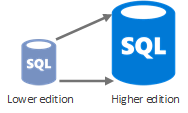
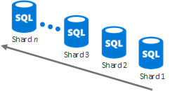
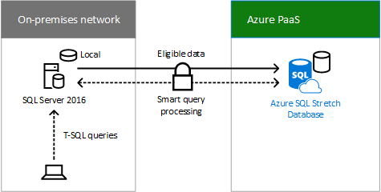

# Alcuni assembly richiesti

 **Sintesi:** visualizzare i dettagli sul set di opzioni di archiviazione cloud che è possibile utilizzare per creare la propria soluzione di archiviazione personalizzata.
  
Soluzioni di archiviazione "Alcuni assembly richiesti":
  
- Utilizza i servizi esistenti come punto di partenza per la soluzione di archiviazione
    
- Richiede la configurazione o la codifica
    
- Può essere personalizzato per adattarlo alle proprie esigenze
    
Le sezioni seguenti descrivono i dettagli di ciascuna soluzione di archiviazione Alcuni assembly richiesti.
  
## Rete per la distribuzione di contenuti

### Funzionalità

- Analisi avanzate e in tempo reale
    
- Sicurezza solida contro DDoS
    
- Ottiene il contenuto automaticamente da un sito Web di Azure o da un servizio cloud di Azure dopo aver configurato l'integrazione
    
- Nuova relazione con Akamai
    
- In grado di gestire picchi improvvisi di traffico e carichi di lavoro elevati
    
### Utilizzi comuni

- Distribuire audio, video, applicazioni, immagini e altri file in modo più veloce e affidabile ai clienti utilizzando i server a loro più vicini
    
### Scenari di archiviazione chiave

- Gestire i dati
    
- Gestire i video
    
### Risorse

Per ulteriori informazioni, fare clic [qui](https://azure.microsoft.com/services/cdn/).
  
Per informazioni sui costi, fare clic [qui](https://azure.microsoft.com/pricing/details/cdn/).
  
## HdInsight

### Funzionalità

- Distribuzione di Apache Hadoop con tecnologia cloud Un servizio Data Lake
    
- Ridimensiona in petabyte su richiesta
    
- Elabora dati non strutturati e semi-strutturati Sviluppa in Java, .NET e così via
    
- Ignora l'acquisto e la manutenzione di hardware
    
- Connette cluster Hadoop locali con il cloud
    
- Flessibilità per distribuire progetti Hadoop arbitrari tramite script personalizzati (ad esempio, R, Giraph, Solr)
    
### Utilizzi comuni

- Carichi di lavoro di analisi dei dati
    
- Framework di elaborazione dei dati in memoria per big data (Spark)
    
- Elaborazione del flusso in tempo reale (Storm)
    
- Elaborazione di grandi transazioni (OLTP) di dati non relazionali (HBase)
    
### Scenari di archiviazione chiave

- Gestire i dati
    
### Risorse

Per ulteriori informazioni, fare clic [qui](https://azure.microsoft.com/services/hdinsight/).
  
Per informazioni sui costi, fare clic [qui](https://azure.microsoft.com/pricing/details/hdinsight/).
  
## Database SQL di Azure

### Funzionalità

- Ottimizzato per ridurre gestione e costi
    
- Elevata disponibilità automatica, ripristino di emergenza e aggiornamento
    
- Consigliato per le organizzazioni che gestiscono centinaia o migliaia di database di dimensioni fino a 1 TB
    
- Le tecniche sharding possono dividere i dati tra database per uno spazio di archiviazione maggiore 
    
- Estensione database con SQL Server 2016
    
### Utilizzi comuni

- Nuove applicazioni progettate per il cloud con dati relazionali
    
- Elaborazione di dati in set di dati schematici, altamente strutturati, con relazioni
    
- Tipi di dati spaziali o complessi
    
### Scenari di archiviazione chiave

- Gestire i dati
    
### Database elastico

Usare le risorse virtualmente illimitate del database SQL di Azure quando:
  
- La quantità totale di dati è troppo grande per rientrare nei limiti di un singolo database.
    
- La velocità effettiva di transazione del carico di lavoro totale supera le funzionalità di un singolo database.
    
- Tenant richiede l'isolamento fisico tra i database, quindi database separati sono necessari per ogni tenant.
    
- Sezioni diverse di un database devono risiedere in aree geografiche diverse per conformità, prestazioni o motivi geopolitici.
    
Con il ridimensionamento verticale, è possibile modificare il livello/l'edizione delle prestazioni del database di Azure oppure tramite pool di database elastici.
  

  
Con la scalabilità orizzontale, è possibile aggiungere nuovi database in base alle esigenze.
  

  
Fare clic [qui](https://docs.microsoft.com/azure/sql-database/sql-database-elastic-scale-introduction) per ulteriori informazioni.
  
### Estensione database con SQL Server 2016

L'estensione database è una funzionalità di SQL Server 2016 che consente di spostare in modo sicuro e trasparente semplici dati, come dati aziendali chiusi in una tabella di grandi dimensioni contenente le informazioni sugli ordini dei clienti, in un'estensione database SQL in Azure. Quando estesi, i contenuti di un'istanza di SQL Server, un database o anche una singola tabella sono la combinazione dei dati locali nel server SQL Server 2016 e dei dati remoti in Azure. I dati che diventano idonei per l'estensione vengono spostati automaticamente in Azure mediante SQL Server 2016.
  

  
Le query utente che includono i dati cronologici vengono inoltrate in modo trasparente al database esteso di SQL Azure. Le query non devono essere scritte nuovamente, anche se la tabella viene estesa.
  
Il database esteso fornisce un'opzione conveniente per l'archiviazione a lungo termine e l'accesso trasparente ai dati cronologici. Consente inoltre di risolvere problemi relativi a prestazioni e disponibilità che si verificano quando le tabelle diventano molto grandi.
  
Fare clic [qui](https://msdn.microsoft.com/library/dn935011.aspx) per ulteriori informazioni.
  
### Risorse

Per ulteriori informazioni, fare clic [qui](http://azure.microsoft.com/services/sql-database/).
  
Per informazioni sui costi, fare clic [qui](http://azure.microsoft.com/pricing/details/sql-database/).
  
## Azure Cosmos DB

### Funzionalità

- Bassa latenza garantita, contratto di servizio con disponibilità del 99,99%, scala flessibile di spazio di archiviazione e velocità effettiva
    
- Tutti i dati vengono replicati a livello globale in qualsiasi numero di aree geografiche con failover trasparente e quattro livelli di coerenza ben definiti
    
- Indicizza automaticamente tutti i dati senza la necessità di schemi o indici secondari
    
- Query SQL e JavaScript avanzate e transazioni di più elementi
    
### Utilizzi comuni

- IoT, Mobile e Sociale
    
- Video game
    
- Dettaglio
    
- Gestione del contenuto
    
### Scenari di archiviazione chiave

- Gestire i dati
    
### Cosmos DB, Tabelle di Azure e Database SQL di Azure

Attributi comuni di Cosmos DB, Archiviazione tabelle di Azure e Database SQL di Azure:
  
- Contratto di servizio con disponibilità di 99,99
    
- Servizi di database interamente gestiti
    
- Conforme alle clausole del modello ISO 27001, HIPAA e UE
    
La tabella seguente mostra gli attributi non comuni di Azure Cosmos DB, Archiviazione tabelle di Azure e Database SQL di Azure.
  

  
### Risorse

Per ulteriori informazioni, fare clic [qui](http://azure.microsoft.com/services/documentdb/).
  
Per informazioni sui costi, fare clic [qui](http://azure.microsoft.com/pricing/details/documentdb/).
  
## Servizi multimediali di Azure

### Funzionalità

- Distribuzione Live e Video on demand (VOD) con scala
    
- Codifica e streaming altamente disponibili
    
- Supporta Flash, iOS, Android, HTML5 e Xbox
    
- Supporto DRM certificato di Studio
    
- Monetizzazione di contenuto formattato
    
- Ampio ecosistema di partner pre-integrati
    
### Utilizzi comuni

- Codificare, archiviare e trasmettere audio e video in scala
    
- Streaming e VOD in tempo reale 
    
- Gestione semplificata dei contenuti video
    
### Scenari di archiviazione chiave

- Gestire i video
    
### Risorse

Per ulteriori informazioni, fare clic [qui](https://azure.microsoft.com/services/media-services/).
  
Per informazioni sui costi, fare clic [qui](http://azure.microsoft.com/pricing/details/media-services/).
  
## Cache Redis di Azure

### Funzionalità

- Server Redis dedicato, sicuro con disponibilità elevata con replica di dati e failover gestiti da Microsoft
    
- Consigliato per qualsiasi app che richiede una velocità effettiva elevata
    
- Disponibile nelle dimensioni fino a 530 GB e oltre (con Premium e sharding automatico)
    
- La persistenza Redis persiste nei dati memorizzati nella memoria cache nello spazio di archiviazione di Azure
    
- Il clustering Redis consente all'utente di raggiungere la scala e la velocità effettiva massima
    
- Sicurezza avanzata e isolamento di rete con supporto rete virtuale di Azure
    
### Utilizzi comuni

- Ricerca inversa dei dati in qualsiasi servizio di archiviazione in Azure, ad esempio Cosmos DB e Database SQL di Azure
    
- Contenuto sincronizzato da altri archivi di dati
    
### Scenari di archiviazione chiave

- Dati della cache
    
- Broker di messaggi per applicazioni ad elevata velocità effettiva
    
### Risorse

Per ulteriori informazioni, fare clic [qui](http://azure.microsoft.com/services/cache/).
  
Per informazioni sui costi, fare clic [qui](http://azure.microsoft.com/pricing/details/cache/).
  
## SQL Server in una VM di Azure

### Funzionalità

- SQL Server in esecuzione come un'applicazione installata in una macchina virtuale Azure
    
- Usare un'immagine della raccolta con SQL Server installato o fornire la propria licenza di SQL Server
    
### Utilizzi comuni

- Gestire i dati per le applicazioni
    
### Scenari di archiviazione chiave

- Gestire i dati
    
- 
    
### Risorse

Per ulteriori informazioni, fare clic [qui](http://azure.microsoft.com/services/virtual-machines/).
  
Per informazioni sui costi, fare clic [qui](http://azure.microsoft.com/pricing/details/virtual-machines/).
  
## StorSimple

### Funzionalità

- Archiviazione SAN scalabile, ibrida, aziendale, con SSD e HDD nella matrice di archiviazione ibrida locale, con spazio di archiviazione cloud come estensione integrata della soluzione
    
- Deduplicazione incorporata, compressione, collegamento automatico, crittografia non strutturata e dati semistrutturati
    
- Protezione automatizzata dei dati esterni tramite snapshot cloud
    
- Ripristino di emergenza altamente efficace, indipendente dalla posizione
    
- Mobilità dei dati per i dati dell'organizzazione con StorSimple Virtual Appliance in Azure
    
### Utilizzi comuni

- Gestire la crescita di dati correlata a condivisioni file, archivi e altri repository di dati
    
- Protezione dei dati esterni e ripristino di emergenza per condivisioni file, macchine virtuali, SQL e SharePoint (tramite archiviazione di blob remoti)
    
- Utilizzare snapshot cloud per clonare i dati in Azure e aumentare la flessibilità aziendale
    
### Scenari di archiviazione chiave

- Gestire i dati
    
- Collabora
    
### Risorse

Per ulteriori informazioni, fare clic [qui](http://azure.microsoft.com/services/storsimple/).
  
Per informazioni sui costi, fare clic [qui](http://azure.microsoft.com/pricing/details/storsimple/).
  
## Data Warehouse SQL Azure

### Funzionalità

- Data warehouse elastico che viene ridimensionato in petabyte Fino a 32 query simultanee
    
- Gestisce grandi volumi di dati strutturati con analisi rapida Ingrandisce e riduce dinamicamente il calcolo in secondi
    
- Supporta la crittografia dati trasparente
    
- Esegue il backup ogni 8 ore per 7 giorni
    
### Utilizzi comuni

- Report sulle vendite
    
- Report sull'uso
    
- Grandi quantità di dati
    
### Scenari di archiviazione chiave

- Gestire i dati
    
### Risorse

Per ulteriori informazioni, fare clic [qui](https://azure.microsoft.com/services/sql-data-warehouse/).
  
Per informazioni sui costi, fare clic [qui](https://azure.microsoft.com/pricing/details/sql-data-warehouse/).
  
## Azure Data Lake Store

### Funzionalità

- Repository con iperscalabilità per carichi di lavoro di analisi dei Big Data
    
- Hadoop Distributed File System per il cloud
    
- Nessun limite fisso per dimensioni dei file
    
- Nessun limite fisso per le dimensioni degli account
    
- Dati strutturati e non strutturati nel rispettivo formato nativo
    
- Massima produttività possibile per aumentare le prestazioni analitiche
    
- Durabilità, disponibilità e affidabilità elevate (contratto di servizio di livello enterprise pari al 99,9% e supporto 24/7)
    
- Controllo accessi di Azure Active Directory
    
### Utilizzi comuni

- Repository di livello aziendale per archiviare ogni tipo di dati raccolti in un'unica posizione
    
### Scenari di archiviazione chiave

- Gestire i dati
    
### Risorse

Per ulteriori informazioni, fare clic [qui](https://azure.microsoft.com/services/data-lake-store/).
  
Per informazioni sui costi, fare clic [qui](https://azure.microsoft.com/pricing/details/data-lake-store/).
  
## Passaggio successivo

Rivedere le opzioni di archiviazione cloud di [Creare da zero](build-from-the-ground-up.md).
  
## See Also

#### 

[Archiviazione cloud Microsoft per Enterprise Architects](microsoft-cloud-storage-for-enterprise-architects.md)
  
[Risorse sull'architettura IT del cloud Microsoft](microsoft-cloud-it-architecture-resources.md)
#### 

[Guida di orientamento del cloud aziendale Microsoft: risorse per i decision maker del settore IT](https://sway.com/FJ2xsyWtkJc2taR)

