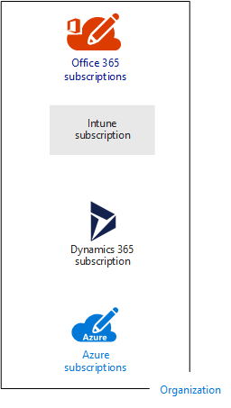
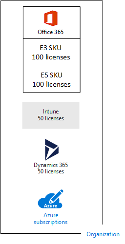
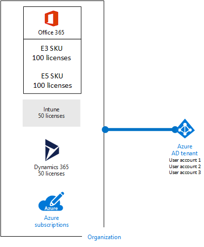
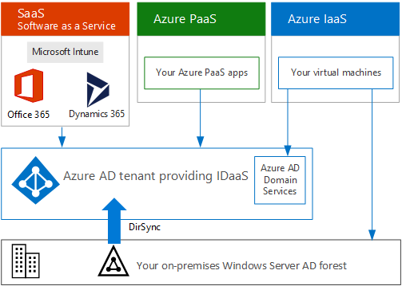

# Subscriptions, licenses, accounts, and tenants for Microsoft's cloud offerings

 **Summary:** Understand the relationships of organizations, subscriptions, licenses, user accounts, and tenants across Microsoft's cloud offerings.
  
Microsoft provides a hierarchy of organizations, subscriptions, licenses, and user accounts for consistent use of identities and billing across its cloud offerings:
  
- Microsoft Office 365
    
    See [business plans and pricing](https://products.office.com/business/compare-office-365-for-business-plans) for more information.
    
- Microsoft Azure
    
    See [Azure pricing](https://azure.microsoft.com/pricing/) for more information.
    
- Microsoft Intune and the Enterprise Mobility + Security (EMS)
    
    See [Intune pricing](https://www.microsoft.com/cloud-platform/microsoft-intune-pricing) for more information.
    
- Microsoft Dynamics 365
    
    See [Dynamics 365 pricing](https://dynamics.microsoft.com/) for more information.
    
## Elementi della gerarchia

Di seguito sono riportati gli elementi della gerarchia:
  
### Organizzazione

Un'organizzazione rappresenta un'entità aziendale che utilizza offerte cloud Microsoft, in genere identificate tramite un nome di dominio DNS pubblico, ad esempio contoso.com. L'organizzazione è un contenitore per le sottoscrizioni.
  
### Sottoscrizioni

A subscription is an agreement with Microsoft to use one or more Microsoft cloud platforms or services, for which charges accrue based on either a per-user license fee or on cloud-based resource consumption. Microsoft's Software as a Service (SaaS)-based cloud offerings (Office 365, Intune/EMS, and Dynamics 365) charge per-user license fees. Microsoft's Platform as a Service (PaaS) and Infrastructure as a Service (IaaS) cloud offerings (Azure) charge based on cloud resource consumption.
  
È anche possibile utilizzare una sottoscrizione di prova, che scade dopo un determinato periodo di tempo o dopo una soglia di consumo. È possibile convertire una sottoscrizione di prova in sottoscrizione a pagamento.
  
Organizations can have multiple subscriptions for Microsoft's cloud offerings. Figure 1 shows an example.
  
**Figure 1: Example of multiple subscriptions for an organization**

  
Nella figura 1 viene mostrata una singola organizzazione che dispone di più sottoscrizioni di Office 365, una di Intune, una di Dynamics 365 e più sottoscrizioni di Azure.
  
### Licenze

For Microsoft's SaaS cloud offerings, a license allows a specific user account to use the services of the cloud offering. You are charged a fixed monthly fee as part of your subscription. Administrators assign licenses to individual user accounts in the subscription. For the example in Figure 2, the Contoso Corporation has an Office 365 Enterprise E5 subscription with 100 licenses, which allows to up to 100 individual user accounts to use Enterprise E5 features and services.
  
**Figure 2: Licenses within the SaaS-based subscriptions for an organization**

  
Per i servizi cloud basati su PaaS di Azure, le licenze software sono integrate nel prezzo del servizio.
  
Per le macchine virtuali basate su IaaS di Azure, potrebbero essere necessarie altre licenze per usare il software o l'applicazione installata sull'immagine di una macchina virtuale. Alcune immagini della macchina virtuale dispongono di versioni concesse in licenza o software installato; i costi sono inclusi nella tariffa al minuto del server. Alcuni esempi sono le immagini della macchina virtuale per SQL Server 2014 e SQL Server 2016.  
  
Alcune immagini della macchina virtuale dispongono di versioni di prova delle applicazioni installate e necessitano di ulteriori licenze software per l'utilizzo dopo il periodo di prova. Ad esempio, l'immagine della macchina virtuale di prova di SharePoint Server 2016 include una versione di prova di SharePoint Server 2016 preinstallata. Per continuare a utilizzare SharePoint Server 2016 dopo il periodo di prova, è necessario acquistare una licenza di SharePoint Server 2016 e le licenze client da Microsoft. Tali costi sono separati rispetto alla sottoscrizione di Azure e si applica ancora la tariffa al minuto di esecuzione della macchina virtuale.
  
### Account utente

User accounts for all of Microsoft's cloud offerings are stored in an Azure Active Directory (AD) tenant, which contains user accounts and groups. An Azure AD tenant can be synchronized with your existing Windows Server AD accounts using Azure AD Connect, a Windows server-based service. This is known as directory synchronization (DirSync).
  
Nella figura 3 viene mostrato un esempio di più sottoscrizioni di un'organizzazione che usa un tenant Azure AD comune, il quale include gli account dell'organizzazione.
  
**Figure 3: Multiple subscriptions of an organization that use the same Azure AD tenant**

  
### Tenant

Per le offerte cloud SaaS, il tenant rappresenta il percorso locale che ospita i server che forniscono i servizi cloud. Ad esempio, Contoso Corporation ha scelto l'Europa per ospitare Office 365, EMS e i tenant di Dynamics 365 per i 15.000 dipendenti della sede di Parigi.
  
I servizi PaaS di Azure e i carichi di lavoro basati su macchina virtuale e ospitati in IaaS di Azure possono avere tenancy in qualsiasi datacenter di Azure in tutto il mondo. Quando si crea un'app o un servizio PaaS di Azure oppure elementi di un carico di lavoro IaaS, si specifica il datacenter di Azure, noto anche come percorso.
  
Un tenant Azure AD è un'istanza specifica di Azure AD che include account e gruppi. Le sottoscrizioni di prova o a pagamento di Office 365, Dynamics 365 o Intune/EMS includono un tenant Azure AD gratuito. Il tenant Azure AD non include altri servizi di Azure e non è lo stesso per la sottoscrizione di prova o a pagamento di Azure.
  
### Riepilogo della gerarchia

Ecco un rapido riepilogo:
  
- Un'organizzazione può avere più sottoscrizioni
    
  - Una sottoscrizione può avere più licenze
    
  - Le licenze possono essere assegnate a singoli account utente
    
  - Gli account utente sono memorizzati in un tenant di Azure AD
    
Ecco un esempio di relazione di organizzazioni, sottoscrizioni, licenze e account utente:
  
- Un'organizzazione identificata dal nome di dominio pubblico.
    
  - Una sottoscrizione di Office 365 Enterprise E3 con licenze utente.
    
    Una sottoscrizione di Office 365 Enterprise E5 con licenze utente.
    
    Una sottoscrizione EMS con licenze utente.
    
    Una sottoscrizione a  Dynamics 365 con licenze utente.
    
    Più sottoscrizioni di Azure.
    
  - Gli account utente dell'organizzazione in un tenant Azure AD comune.
    
Più sottoscrizioni alle offerte cloud di Microsoft sono in grado di usare lo stesso tenant Azure AD che si comporta come un provider di identità comune. Un tenant di Azure AD centrale che contiene gli account sincronizzati di Windows Server AD offre IDaaS basata su cloud per l'organizzazione. Questo è il contenuto della figura 4.
  
**Figure 4: Synchronized on-premises accounts and IDaaS for an organization**

  
La figura 4 mostra in che modo il tenant di Azure AD comune è utilizzato dalle offerte cloud SaaS di Microsoft, le app PaaS di Azure e le macchine virtuali IaaS di Azure che usa Azure AD Domain Services. Azure AD Connect sincronizza la foresta di Windows Server AD locale con il tenant di Azure AD.
  
For more information about identity integration across Microsoft's cloud offerings, see [Microsoft Cloud Identity for Enterprise Architects](https://aka.ms/cloudarchidentity).
  
## Combinazione di sottoscrizioni per offerte cloud di Microsoft

La tabella descrive il modo in cui è possibile combinare più offerte cloud di Microsoft sulla base della sottoscrizione già in possesso per un tipo di offerte cloud (le etichette dall'alto verso il basso della prima colonna) e aggiungendo una sottoscrizione per un'offerta cloud differente (tra le colonne).
  
||**Office 365**|**Azure**|**Intune/EMS**|**Dynamics 365**|
|:-----|:-----|:-----|:-----|:-----|
|**Office 365**   |ND    |È necessario aggiungere una sottoscrizione di Azure all'organizzazione dal portale di Azure.    |È necessario aggiungere una sottoscrizione di Intune/EMS all'organizzazione dal portale di Office 365.    |È necessario aggiungere una sottoscrizione di Dynamics 365 all'organizzazione dal portale di Office 365.    |
|**Azure**   |È necessario aggiungere una sottoscrizione di Office 365 all'organizzazione.     |ND    |È necessario aggiungere una sottoscrizione di Intune/EMS all'organizzazione.    |È necessario aggiungere una sottoscrizione di Dynamics 365 all'organizzazione.    |
|**Intune/EMS**   |È necessario aggiungere una sottoscrizione di Office 365 all'organizzazione.     |È necessario aggiungere una sottoscrizione di Azure all'organizzazione dal portale di Azure.    |ND    |È necessario aggiungere una sottoscrizione di Dynamics 365 all'organizzazione.    |
|**Dynamics 365**   |È necessario aggiungere una sottoscrizione di Office 365 all'organizzazione.     |È necessario aggiungere una sottoscrizione di Azure all'organizzazione dal portale di Azure.    |È necessario aggiungere una sottoscrizione di Intune/EMS all'organizzazione.    |ND    |
   
Un metodo rapido per aggiungere sottoscrizioni all'organizzazione per i servizi basati su SaaS di Microsoft è quello di utilizzare l'interfaccia di amministrazione di Office 365.
  
1. Sign in to the Office 365 portal ([https://portal.office.com](https://portal.office.com)) with your global administrator account, and then click **Admin**.
    
2. From the left navigation of the **Admin center** home page, click **Billing**, and then **Purchase services**.
    
3. On the **Purchase services** page, purchase your new subscriptions.
    
L'interfaccia di amministrazione di Office 365 assegna l'organizzazione e il tenant Azure AD della sottoscrizione di Office 365 alle nuove sottoscrizioni per le offerte cloud basate su SaaS.
  
Per aggiungere una sottoscrizione di Azure con la stessa organizzazione e il tenant di Azure AS della sottoscrizione di Office 365:
  
1. Sign in to the Azure portal ([https://portal.azure.com](https://portal.azure.com)) with your Office 365 global administrator account.
    
2. In the left navigation, click **Subscriptions**, and then click **Add**.
    
3. On the **Add subscription** page, select an offer and complete the payment information and agreement.
    
If you purchased Azure and Office 365 subscriptions separately and want to access the Office 365 Azure AD tenant from your Azure subscription, see the instructions in [Associate an Office 365 tenant with an Azure subscription](https://channel9.msdn.com/Series/Microsoft-Azure-Tutorials/Associate-an-Office-365-tenant-with-an-Azure-subscription).
  
## Vedere anche

[Risorse sull'architettura IT del cloud Microsoft](microsoft-cloud-it-architecture-resources.md)
  
[Test Lab Guide (TLG) di adozione cloud](cloud-adoption-test-lab-guides-tlgs.md)
  
[Modelli architetturali per SharePoint, Exchange, Skype for Business e Lync](architectural-models-for-sharepoint-exchange-skype-for-business-and-lync.md)
  
[Soluzioni ibride](hybrid-solutions.md)
  
[Sottoscrizioni, licenze e account utente per Contoso Corporation](subscriptions-licenses-and-user-accounts-for-the-contoso-corporation.md)

