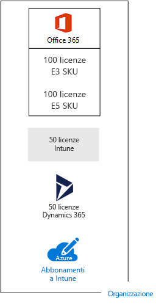

# Sottoscrizioni, licenze, account e tenant per offerte cloud di Microsoft

 **Riepilogo:** comprendere le relazioni delle organizzazioni, le sottoscrizioni, le licenze, gli account utente e i tenant tra le offerte cloud di Microsoft.
  
Microsoft fornisce una gerarchia di organizzazioni, sottoscrizioni, licenze e account utente per garantire un utilizzo uniforme di identità e fatturazione tra le varie offerte cloud:
  
- Microsoft Office 365
    
    Vedere i [piani e i prezzi per le aziende](https://products.office.com/business/compare-office-365-for-business-plans) per ulteriori informazioni.
    
- Microsoft Azure
    
    Vedere i [prezzi per Azure](https://azure.microsoft.com/pricing/) per ulteriori informazioni.
    
- Microsoft Intune ed Enterprise Mobility + Security (EMS)
    
    Vedere i [prezzi per Intune](https://www.microsoft.com/cloud-platform/microsoft-intune-pricing) per ulteriori informazioni.
    
- Microsoft Dynamics 365
    
    Vedere i [prezzi per Dynamics 365](https://dynamics.microsoft.com/) per ulteriori informazioni.
    
## Elementi della gerarchia

Di seguito sono riportati gli elementi della gerarchia:
  
### Organizzazione

Un'organizzazione rappresenta un'entità aziendale che utilizza le offerte cloud di Microsoft, in genere identificate da uno o più nomi di dominio Domain Name System (DNS), ad esempio contoso.com. L'organizzazione è un contenitore per le sottoscrizioni.
  
### Sottoscrizioni

Una sottoscrizione è un contratto stipulato con Microsoft per utilizzare una o più piattaforme cloud oppure servizi di Microsoft pagando un costo stabilito su licenza utente o su consumo delle risorse cloud. Le offerte cloud SaaS di Microsoft (Office 365, Intune/EMS e Dynamics 365) vengono fatturate in base alla licenza per utente. Le offerte cloud PaaS e IaaS di Microsoft vengono fatturate in base al consumo di risorse.
  
È anche possibile utilizzare una sottoscrizione di prova, che scade dopo un determinato periodo di tempo o dopo una soglia di consumo. È possibile convertire una sottoscrizione di prova in sottoscrizione a pagamento.
  
Le organizzazioni possono disporre di più sottoscrizioni per le offerte cloud di Microsoft. Nella figura 1 è riportato un esempio.
  
**Figura 1: esempio di più sottoscrizioni per un'organizzazione**

  
Nella figura 1 viene mostrata una singola organizzazione che dispone di più sottoscrizioni di Office 365, una di Intune, una di Dynamics 365 e più sottoscrizioni di Azure.
  
### Licenze

Per le offerte cloud SaaS di Microsoft, una licenza consente a un account utente specifico di utilizzare l'offerta cloud. Vengono effettuati addebiti mensili fissi come parte della sottoscrizione. Gli amministratori assegnano licenze a singoli account utente nella sottoscrizione. Ad esempio, nella figura 2, Contoso Corporation dispone di una sottoscrizione a Office 365 Enterprise E5 con 100 licenze, che consente a oltre 100 account utente singoli di usare le funzionalità e i servizi di Enterprise E5.
  
**Figura 2: licenze comprese nelle sottoscrizioni basate su SaaS di un'organizzazione**

  
Per i servizi cloud basati su PaaS di Azure, le licenze software sono integrate nel prezzo del servizio.
  
Per le macchine virtuali basate su IaaS di Azure, potrebbero essere necessarie altre licenze per usare il software o l'applicazione installata sull'immagine di una macchina virtuale. Alcune immagini della macchina virtuale dispongono di versioni concesse in licenza o software installato; i costi sono inclusi nella tariffa al minuto del server. Alcuni esempi sono le immagini della macchina virtuale per SQL Server 2014 e SQL Server 2016.  
  
Alcune immagini della macchina virtuale dispongono di versioni di prova delle applicazioni installate e necessitano di ulteriori licenze software per l'utilizzo dopo il periodo di prova. Ad esempio, l'immagine della macchina virtuale di prova di SharePoint Server 2016 include una versione di prova di SharePoint Server 2016 preinstallata. Per continuare a utilizzare SharePoint Server 2016 dopo il periodo di prova, è necessario acquistare una licenza di SharePoint Server 2016 e le licenze client da Microsoft. Tali costi sono separati rispetto alla sottoscrizione di Azure e si applica ancora la tariffa al minuto di esecuzione della macchina virtuale.
  
### Account utente

Gli account utente per tutte le offerte cloud di Microsoft sono archiviati in un tenant di Azure Active Directory (AD) che include gli account utente e i gruppi. Un tenant di Azure AD può essere sincronizzato con gli account Windows Server AD esistenti tramite Azure AD Connect, un servizio basato su server di Windows. Si tratta della cosiddetta sincronizzazione della directory (DirSync).
  
Nella figura 3 viene mostrato un esempio di più sottoscrizioni di un'organizzazione che usa un tenant Azure AD comune, il quale include gli account dell'organizzazione.
  
**Figura 3: più sottoscrizioni di un'organizzazione che utilizza lo stesso tenant di Azure AD**

  
### Tenant

Per le offerte cloud SaaS, il tenant rappresenta il percorso locale che ospita i server che forniscono i servizi cloud. Ad esempio, Contoso Corporation ha scelto l'Europa per ospitare Office 365, EMS e i tenant di Dynamics 365 per i 15.000 dipendenti della sede di Parigi.
  
I servizi PaaS di Azure e i carichi di lavoro basati su macchina virtuale e ospitati in IaaS di Azure possono avere tenancy in qualsiasi datacenter di Azure in tutto il mondo. Quando si crea un'app o un servizio PaaS di Azure oppure elementi di un carico di lavoro IaaS, si specifica il datacenter di Azure, noto anche come percorso.
  
Un tenant Azure AD è un'istanza specifica di Azure AD che include account e gruppi. Le sottoscrizioni di prova o a pagamento di Office 365, Dynamics 365 o Intune/EMS includono un tenant Azure AD gratuito. Il tenant Azure AD non include altri servizi di Azure e non è lo stesso per la sottoscrizione di prova o a pagamento di Azure.
  
### Riepilogo della gerarchia

Ecco un rapido riepilogo:
  
- Un'organizzazione può avere più sottoscrizioni
    
  - Una sottoscrizione può avere più licenze
    
  - Le licenze possono essere assegnate a singoli account utente
    
  - Gli account utente sono memorizzati in un tenant di Azure AD
    
Ecco un esempio di relazione di organizzazioni, sottoscrizioni, licenze e account utente:
  
- Un'organizzazione identificata dal nome di dominio pubblico.
    
  - Una sottoscrizione di Office 365 Enterprise E3 con licenze utente.
    
    Una sottoscrizione di Office 365 Enterprise E5 con licenze utente.
    
    Una sottoscrizione EMS con licenze utente.
    
    Una sottoscrizione a  Dynamics 365 con licenze utente.
    
    Più sottoscrizioni di Azure.
    
  - Gli account utente dell'organizzazione in un tenant Azure AD comune.
    
Più sottoscrizioni alle offerte cloud di Microsoft sono in grado di usare lo stesso tenant Azure AD che si comporta come un provider di identità comune. Un tenant di Azure AD centrale che contiene gli account sincronizzati di Windows Server AD offre IDaaS basata su cloud per l'organizzazione. Questo è il contenuto della figura 4.
  
**Figura 4: account sincronizzati in locale e IDaaS per un'organizzazione**

  
La figura 4 mostra in che modo il tenant di Azure AD comune è utilizzato dalle offerte cloud SaaS di Microsoft, le app PaaS di Azure e le macchine virtuali IaaS di Azure che usa Azure AD Domain Services. Azure AD Connect sincronizza la foresta di Windows Server AD locale con il tenant di Azure AD.
  
Per ulteriori informazioni sull'integrazione dell'identità tra le offerte cloud di Microsoft, vedere [Identità cloud Microsoft per Enterprise Architects](https://aka.ms/cloudarchidentity).
  
## Combinazione di sottoscrizioni per offerte cloud di Microsoft

La tabella descrive il modo in cui è possibile combinare più offerte cloud di Microsoft sulla base della sottoscrizione già in possesso per un tipo di offerte cloud (le etichette dall'alto verso il basso della prima colonna) e aggiungendo una sottoscrizione per un'offerta cloud differente (tra le colonne).
  
||**Office 365**|**Azure**|**Intune/EMS**|**Dynamics 365**|
|:-----|:-----|:-----|:-----|:-----|
|**Office 365**   |ND    |È necessario aggiungere una sottoscrizione di Azure all'organizzazione dal portale di Azure.    |È necessario aggiungere una sottoscrizione di Intune/EMS all'organizzazione dal portale di Office 365.    |È necessario aggiungere una sottoscrizione di Dynamics 365 all'organizzazione dal portale di Office 365.    |
|**Azure**   |È necessario aggiungere una sottoscrizione di Office 365 all'organizzazione.    |ND    |È necessario aggiungere una sottoscrizione di Intune/EMS all'organizzazione.    |È necessario aggiungere una sottoscrizione di Dynamics 365 all'organizzazione.    |
|**Intune/EMS**   |È necessario aggiungere una sottoscrizione di Office 365 all'organizzazione.    |È necessario aggiungere una sottoscrizione di Azure all'organizzazione dal portale di Azure.    |ND    |È necessario aggiungere una sottoscrizione di Dynamics 365 all'organizzazione.    |
|**Dynamics 365**   |È necessario aggiungere una sottoscrizione di Office 365 all'organizzazione.    |È necessario aggiungere una sottoscrizione di Azure all'organizzazione dal portale di Azure.    |È necessario aggiungere una sottoscrizione di Intune/EMS all'organizzazione.    |ND    |
   
Un metodo rapido per aggiungere sottoscrizioni all'organizzazione per i servizi basati su SaaS di Microsoft è quello di utilizzare l'interfaccia di amministrazione di Office 365.
  
1. Accedere a Office 365 ([https://portal.office.com](https://portal.office.com)) con le credenziali dell'account di amministratore globale, quindi fare clic su **Amministratore**.
    
2. Dal riquadro di navigazione a sinistra della home page dell'**interfaccia di amministrazione**, fare clic su **Fatturazione**, quindi su **Acquista servizi**.
    
3. Nella pagina **Acquista servizi**, procedere all'acquisto delle nuove sottoscrizioni.
    
L'interfaccia di amministrazione di Office 365 assegna l'organizzazione e il tenant Azure AD della sottoscrizione di Office 365 alle nuove sottoscrizioni per le offerte cloud basate su SaaS.
  
Per aggiungere una sottoscrizione di Azure con la stessa organizzazione e il tenant di Azure AD della sottoscrizione di Office 365:
  
1. Accedere al portale di Azure ([https://portal.azure.com](https://portal.azure.com)) con l'account di amministratore globale di Office 365.
    
2. Nella barra di spostamento a sinistra, fare clic su **Sottoscrizioni**, quindi su **Aggiungi**.
    
3. Nella pagina **Aggiungi sottoscrizione**, selezionare un'offerta e completare le informazioni di pagamento e il contratto.
    
Se sono state acquistate sottoscrizioni di Azure e Office 365 separate e si desidera accedere al tenant di Office 365 Azure AD dalla sottoscrizione di Azure, vedere le istruzioni riportate nell'articolo [Associare un tenant di Office 365 con una sottoscrizione di Azure](https://channel9.msdn.com/Series/Microsoft-Azure-Tutorials/Associate-an-Office-365-tenant-with-an-Azure-subscription).
  
## Vedere anche

[Risorse sull'architettura IT del cloud Microsoft](microsoft-cloud-it-architecture-resources.md)
  
[Test Lab Guide (TLG) di adozione cloud](cloud-adoption-test-lab-guides-tlgs.md)
  
[Modelli architetturali per SharePoint, Exchange, Skype for Business e Lync](architectural-models-for-sharepoint-exchange-skype-for-business-and-lync.md)
  
[Soluzioni ibride](hybrid-solutions.md)
  
[Sottoscrizioni, licenze e account utente per Contoso Corporation](subscriptions-licenses-and-user-accounts-for-the-contoso-corporation.md)

