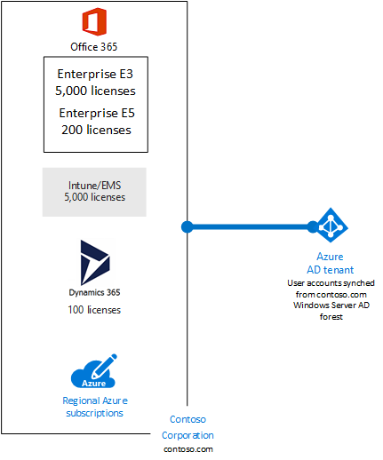
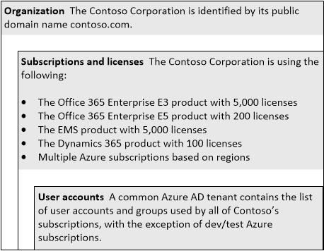

# Sottoscrizioni, licenze e account utente per Contoso Corporation

 **Riepilogo:** Comprensione della struttura delle sottoscrizioni cloud di Contoso, le licenze, gli account utente e tenant.
  
Per garantire un utilizzo coerente di identità e fatturazione per tutte le offerte cloud, Microsoft fornisce una gerarchia di organizzazioni/sottoscrizioni/licenze/account utente:
  
- Organizzazione
    
    L'entità aziendale che utilizza offerte cloud Microsoft, in genere identificate tramite un nome di dominio DNS pubblico, ad esempio contoso.com.
    
- Sottoscrizioni
    
    Per SaaS Microsoft cloud offerte (Office 365, Intune/EMS e Dynamics 365), una sottoscrizione è un prodotto specifico e un set acquistato delle licenze utente. Per Azure, una sottoscrizione consente di fatturazione dei servizi cloud consumato nell'organizzazione.
    
- Licenze
    
    Per le offerte cloud Microsoft SaaS, di una licenza consente a un account utente specifico utilizzare i servizi cloud. Per Azure, le licenze software sono incorporate nel servizio prezzi, ma in alcuni casi che è necessario acquistare licenze software aggiuntive.
    
- Account utente
    
    Gli account utente vengono archiviati in un tenant di Azure AD e possono essere sincronizzati da un provider di identità locale, ad esempio Windows Server AD.
    
## Struttura di Contoso

Contoso ha determinato la struttura seguente per l'organizzazione e per le sottoscrizioni, licenze, account e tenant della stessa:
  
**Nella figura 1: Del Contoso organizzazione, sottoscrizioni, licenze, gli account utente e tenant**

  
Nella figura 1 viene mostrato in che modo l'organizzazione Contoso include più sottoscrizioni ed è legata a un tenant di Azure AD, il quale comprende gli account utente sincronizzati dalla foresta Windows Server AD di contoso.com.
  
- **Organizzazione** Contoso Corporation è identificata dal relativo nome di dominio pubblico contoso.com.
    
  - **Licenze e sottoscrizioni** Contoso Corporation utilizza le operazioni seguenti:
    
  - Il prodotto Office 365 Enterprise E3 con 5.000 licenze
    
  - Il prodotto Office 365 Enterprise E5 con 200 licenze
    
  - Il prodotto EMS con 5.000 licenze
    
  - Prodotto Dynamics 365 con 100 licenze
    
  - Più sottoscrizioni Azure basate sulle aree geografiche
    
  - **Account utente** Un comune tenant di Azure Active Directory contiene l'elenco degli account utente e i gruppi utilizzati da tutte le sottoscrizioni di Contoso, ad eccezione di sviluppo e di testing sottoscrizioni di Azure.
    
Per i tenant Contoso:
  
- Per le offerte cloud SaaS, tenant è il percorso internazionale in cui si trova il server che offrono servizi basati su cloud. Contoso ha scelto la regione Europa per ospitare il tenant Office 365, EMS e Dynamics 365. 
    
- Azure PaaS servizi e applicazioni e carichi di lavoro IaaS IT possono avere tenancy in un Data Center Azure in tutto il mondo. Un tenant di Azure Active Directory è un'istanza specifica di Azure Active Directory contenente gli account e gruppi.
    
- Il comune tenant di Azure Active Directory contenente gli account di sincronizzazione per la foresta Contoso Windows Server Active Directory fornisce IDaaS nelle offerte cloud di Microsoft.
    
Per ulteriori informazioni, vedere [sottoscrizioni, le licenze, gli account utilizzati e tenant per le offerte cloud di Microsoft](subscriptions-licenses-accounts-and-tenants-for-microsoft-cloud-offerings.md).
  
## Sottoscrizioni Azure contoso

Nella figura 2 viene illustrata la struttura gerarchica delle sottoscrizioni Azure Contoso:
  
**Figura 2: Struttura di Contoso per le sottoscrizioni di Azure**

  
- Contoso è nella parte superiore, in base agli accordi aziendali con Microsoft.
    
- Sono disponibili un set di account corrispondente per aree geografiche diverse di Contoso Corporation tutto il mondo, basato sui domini della foresta di Windows Server Active Directory Contoso.
    
- In ogni area, esistono uno o più sottoscrizioni in base alle esigenze di distribuzione di sviluppo, test e produzione dell'area.
    
Ogni sottoscrizione ad Azure può essere associata a un singolo tenant Azure AD contenente account utente e gruppi per l'autenticazione e l'autorizzazione dei servizi Azure. Le sottoscrizioni di produzione utilizzano il tenant di Contoso Azure AD comune.
  
## See Also

[Contoso nel Microsoft Cloud](contoso-in-the-microsoft-cloud.md)
  
[Risorse sull'architettura IT del cloud Microsoft](microsoft-cloud-it-architecture-resources.md)

[Guida di orientamento del cloud aziendale Microsoft: risorse per i decision maker del settore IT](https://sway.com/FJ2xsyWtkJc2taRD)

