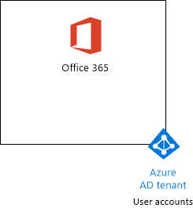

# <a name="the-microsoft-365-enterprise-devtest-environment"></a><span data-ttu-id="b8934-103">Ambiente di sviluppo/testing di Microsoft 365 Enterprise</span><span class="sxs-lookup"><span data-stu-id="b8934-103">The Microsoft 365 Enterprise dev/test environment</span></span>

 <span data-ttu-id="b8934-104">**Riepilogo:** Usare questa guida del laboratorio di testing per creare un ambiente di sviluppo e di testing che includa Office 365 E5, Enterprise Mobility + Security (EMS) E5 e un computer che esegue Windows 10 Enterprise.</span><span class="sxs-lookup"><span data-stu-id="b8934-104">**Summary:** Use this Test Lab Guide to create a dev/test environment that includes Office 365 E5, Enterprise Mobility + Security (EMS) E5, and a computer running Windows 10 Enterprise.</span></span>
  
<span data-ttu-id="b8934-105">In questo articolo vengono fornite istruzioni dettagliate per creare un ambiente semplificato per verificare le funzionalità di [Microsoft 365 Enterprise](https://www.microsoft.com/microsoft-365/enterprise).</span><span class="sxs-lookup"><span data-stu-id="b8934-105">This article provides you with step-by-step instructions to create a simplified environment to test the features and functionality of Microsoft 365 Enterprise.</span></span>
  
## <a name="phase-1-create-your-office-365-e5-subscription"></a><span data-ttu-id="b8934-106">Fase 1: creare la sottoscrizione di Office 365 E5</span><span class="sxs-lookup"><span data-stu-id="b8934-106">Phase 1: Create your Office 365 E5 subscription</span></span>

<span data-ttu-id="b8934-107">Seguire i passaggi della fase 2 e 3 fase dell'[ambiente di sviluppo/testing di Office 365](office-365-dev-test-environment.md) per creare un ambiente di sviluppo e di testing di Office 365 semplificato, come illustrato nella Figura 1.</span><span class="sxs-lookup"><span data-stu-id="b8934-107">Follow the steps in Phase 2 and Phase 3 of Office 365 dev/test environment to create a lightweight Office 365 dev/test environment, as shown in Figure 1.</span></span>
  
<span data-ttu-id="b8934-108">**Figura 1: sottoscrizione di Office 365 E5 con account utente e tenant relativi ad Azure Active Directory (AD)**</span><span class="sxs-lookup"><span data-stu-id="b8934-108">**Figure 1: Your Office 365 E5 subscription with its Azure Active Directory (AD) tenant and user accounts**</span></span>



> [!NOTE]
> <span data-ttu-id="b8934-p101">La sottoscrizione di valutazione Office 365 E5 è valida per 30 giorni e può essere estesa facilmente a 60 giorni. Per un ambiente di sviluppo/testing permanente, creare una nuova sottoscrizione a pagamento con un numero limitato di licenze.</span><span class="sxs-lookup"><span data-stu-id="b8934-p101">The Azure trial  is 30 days. The Office 365 Enterprise E5 Trial subscription is 30 days, which can be easily extended for another 30 days. For a permanent dev/test environment, create a new paid Azure subscription and a new paid Office 365 Enterprise E5 subscription with a small number of licenses.</span></span> 
  
## <a name="phase-2-add-ems"></a><span data-ttu-id="b8934-112">Fase 2: aggiungere EMS</span><span class="sxs-lookup"><span data-stu-id="b8934-112">Phase 2: Add EMS</span></span>

<span data-ttu-id="b8934-113">In questa fase, è possibile iscriversi per la sottoscrizione di valutazione di EMS E5 e aggiungerla alla stessa organizzazione della sottoscrizione di valutazione di Office 365 E5.</span><span class="sxs-lookup"><span data-stu-id="b8934-113">In this phase, you sign up for the EMS E5 trial subscription and add it to the same organization as your Office 365 E5 trial subscription.</span></span>
  
<span data-ttu-id="b8934-114">Prima di tutto, aggiungere la sottoscrizione di valutazione di EMS E5 e assegnare una licenza EMS al proprio account di amministratore globale.</span><span class="sxs-lookup"><span data-stu-id="b8934-114">First, add the EMS E5 trial subscription and assign an EMS license to your global administrator account.</span></span>
  
1. <span data-ttu-id="b8934-p102">Con l'istanza privata di un browser Internet, accedere al portale di Office 365 tramite le credenziali dell'account di amministratore globale. Per informazioni, vedere [Dove accedere a Office 365](https://support.office.com/Article/Where-to-sign-in-to-Office-365-e9eb7d51-5430-4929-91ab-6157c5a050b4).</span><span class="sxs-lookup"><span data-stu-id="b8934-p102">With a private instance of an Internet browser, sign in to the Office 365 portal with your global administrator account credentials. For help, see [Where to sign in to Office 365https://support.office.com/Article/Where-to-sign-in-to-Office-365-e9eb7d51-5430-4929-91ab-6157c5a050b4](https://support.office.com/Article/Where-to-sign-in-to-Office-365-e9eb7d51-5430-4929-91ab-6157c5a050b4).</span></span>
    
2. <span data-ttu-id="b8934-117">Fare clic sul riquadro **Amministratore**.</span><span class="sxs-lookup"><span data-stu-id="b8934-117">Click the **Admin** tile.</span></span>
    
3. <span data-ttu-id="b8934-118">Nella scheda **Interfaccia di amministrazione di Office** del browser fare clic su **Fatturazione > Servizi di acquisto** nel riquadro di spostamento di sinistra.</span><span class="sxs-lookup"><span data-stu-id="b8934-118">On the **Office Admin center** tab in your browser, in the left navigation, click **Billing > Purchase services**.</span></span>
    
4. <span data-ttu-id="b8934-p103">Nella pagina **Acquisto di servizi**, individuare la voce **Enterprise Mobility + Security E5**. Posizionare il puntatore del mouse su di essa e fare clic su **Avvia la versione di valutazione gratuita**.</span><span class="sxs-lookup"><span data-stu-id="b8934-p103">On the **Purchase services** page, find the **Enterprise Mobility + Security E5** item. Hover your mouse pointer over it and click **Start free trial**.</span></span>
    
5. <span data-ttu-id="b8934-121">Nella pagina **Conferma l'ordine**, fare clic su **Prova adesso**.</span><span class="sxs-lookup"><span data-stu-id="b8934-121">On the **Confirm your order** page, click **Try now**.</span></span>
    
6. <span data-ttu-id="b8934-122">Nella pagina **Ricevuta ordine**, fare clic su **Continua**.</span><span class="sxs-lookup"><span data-stu-id="b8934-122">On the **Order receipt** page, click **Continue**.</span></span>
    
7. <span data-ttu-id="b8934-123">Nella scheda **Interfaccia di amministrazione di Office 365** del browser fare clic su **Utenti > Utenti attivi** nel riquadro di spostamento di sinistra.</span><span class="sxs-lookup"><span data-stu-id="b8934-123">On the **Office 365 Admin center** tab in your browser, in the left navigation, click **Users > Active users**.</span></span>
    
8. <span data-ttu-id="b8934-124">Fare clic sull'account amministratore globale e quindi su **Modifica** per le **licenze del prodotto**.</span><span class="sxs-lookup"><span data-stu-id="b8934-124">Click your global administrator account, and then click Edit for Product licenses.</span></span>
    
9. <span data-ttu-id="b8934-125">Nel riquadro **Licenze per i prodotti**, impostare la licenza per i prodotti di **Enterprise Mobility + Security E5** su **Attiva**, fare clic su **Salva** e quindi fare doppio clic su **Chiudi**.</span><span class="sxs-lookup"><span data-stu-id="b8934-125">On the **Product licenses** pane, turn the product license for **Enterprise Mobility + Security E5** to **On**, click **Save,** and then click **Close** twice.</span></span>
    
> [!NOTE]
> <span data-ttu-id="b8934-p104">La sottoscrizione di valutazione Enterprise Mobility + Security E5 è valida per 90 giorni. Per un ambiente di sviluppo/test permanente, creare una nuova sottoscrizione a pagamento con un numero limitato di licenze.</span><span class="sxs-lookup"><span data-stu-id="b8934-p104">The Enterprise Mobility + Security E5 trial subscription is 90 days. For a permanent dev/test environment, create a new paid subscription with a small number of licenses.</span></span> 
  
 <span data-ttu-id="b8934-128">***Se è stata completata la fase 3 di*** [Ambiente di sviluppo/testing di Office 365](office-365-dev-test-environment.md), ripetere i passaggi 8 e 9 della procedura precedente per tutti gli altri account (Utente 2, Utente 3, Utente 4 e Utente 5).</span><span class="sxs-lookup"><span data-stu-id="b8934-128">***If you completed Phase 3 of the*** [Office 365 dev/test environment](office-365-dev-test-environment.md), repeat steps 8 and 9 of the previous procedure for all of your other accounts (User 2, User 3, User 4, and User 5).</span></span>
  
<span data-ttu-id="b8934-129">A questo punto, l'ambiente di sviluppo/di testing dispone di:</span><span class="sxs-lookup"><span data-stu-id="b8934-129">Your dev/test environment now has:</span></span>
  
- <span data-ttu-id="b8934-130">Sottoscrizioni di valutazione di Office 365 E5 Enterprise ed EMS E5 che condividono lo stesso tenant di Azure AD con l'elenco degli account utente in uso.</span><span class="sxs-lookup"><span data-stu-id="b8934-130">Office 365 E5 Enterprise and EMS trial subscriptions sharing the same organization and the same Azure AD tenant with your list of user accounts.</span></span>
- <span data-ttu-id="b8934-131">Tutti gli account utente appropriati (solo l'amministratore globale o tutti e cinque gli account utente), sono abilitati per l'uso di Office 365 E5 ed EMS E5.</span><span class="sxs-lookup"><span data-stu-id="b8934-131">All your appropriate user accounts (either just the global administrator or all five user accounts) are enabled to use Office 365 E5 and EMS E5.</span></span>
    
<span data-ttu-id="b8934-132">La figura 2 mostra la configurazione risultante che consente di aggiungere EMS.</span><span class="sxs-lookup"><span data-stu-id="b8934-132">Figure 2 shows your resulting configuration, which adds EMS.</span></span>
  
<span data-ttu-id="b8934-133">**Figura 2: aggiunta della sottoscrizione di valutazione di EMS**</span><span class="sxs-lookup"><span data-stu-id="b8934-133">**Figure 2: Adding the EMS trial subscription**</span></span>


  
## <a name="phase-3-create-a-windows-10-enterprise-computer"></a><span data-ttu-id="b8934-135">Fase 3: creare un computer con Windows 10 Enterprise</span><span class="sxs-lookup"><span data-stu-id="b8934-135">Phase 3: Create a Windows 10 Enterprise computer</span></span>

<span data-ttu-id="b8934-136">In questa fase, si crea un computer autonomo che esegue Windows 10 Enterprise.</span><span class="sxs-lookup"><span data-stu-id="b8934-136">In this phase, you create a standalone computer running Windows 10 Enterprise.</span></span>
  
### <a name="physical-computer"></a><span data-ttu-id="b8934-137">Computer fisico</span><span class="sxs-lookup"><span data-stu-id="b8934-137">Physical computer</span></span>

<span data-ttu-id="b8934-p105">Procurarsi un personal computer e installarvi Windows 10 Enterprise. È possibile scaricare la versione di valutazione di Windows 10 Enterprise [qui](https://www.microsoft.com/evalcenter/evaluate-windows-10-enterprise).</span><span class="sxs-lookup"><span data-stu-id="b8934-p105">Obtain a personal computer and install Windows 10 Enterprise on it. You can download the Windows 10 Enterprise trial [herehttps://www.microsoft.com/evalcenter/evaluate-windows-10-enterprise](https://www.microsoft.com/evalcenter/evaluate-windows-10-enterprise).</span></span>
  
### <a name="virtual-machine"></a><span data-ttu-id="b8934-140">Macchina virtuale</span><span class="sxs-lookup"><span data-stu-id="b8934-140">Virtual machine</span></span>

<span data-ttu-id="b8934-p106">Creare una macchina virtuale utilizzando l'hypervisor scelto e installarvi Windows 10 Enterprise. È possibile scaricare la versione di valutazione di Windows 10 Enterprise [qui](https://www.microsoft.com/evalcenter/evaluate-windows-10-enterprise).</span><span class="sxs-lookup"><span data-stu-id="b8934-p106">Create a virtual machine using the hypervisor of your choice and install Windows 10 Enterprise on it. You can download the Windows 10 Enterprise trial [herehttps://www.microsoft.com/evalcenter/evaluate-windows-10-enterprise](https://www.microsoft.com/evalcenter/evaluate-windows-10-enterprise).</span></span>
  
### <a name="virtual-machine-in-azure"></a><span data-ttu-id="b8934-143">Macchina virtuale in Azure</span><span class="sxs-lookup"><span data-stu-id="b8934-143">Virtual machine in Azure</span></span>

<span data-ttu-id="b8934-p107">Per creare una macchina virtuale con Windows 10 in Microsoft Azure, ***è necessario disporre di una sottoscrizione basata su Visual Studio***, che abbia accesso all'immagine per Windows 10 Enterprise. Altri tipi di sottoscrizioni di Azure, ad esempio le sottoscrizioni di valutazione e quelle a pagamento, non hanno accesso a tale immagine. Per le informazioni più aggiornate, vedere [Utilizzare un client Windows in Azure per gli scenari di sviluppo/test](https://docs.microsoft.com/azure/virtual-machines/windows/client-images).</span><span class="sxs-lookup"><span data-stu-id="b8934-p107">To create a Windows 10 virtual machine in Microsoft Azure, ***you must have a Visual Studio-based subscription***, which has access to the image for Windows 10 Enterprise. Other types of Azure subscriptions, such as trial and paid subscriptions, do not have access to this image.</span></span>
  
> [!NOTE]
> <span data-ttu-id="b8934-p108">I seguenti comandi consentono di utilizzare la versione più recente di Azure PowerShell. Vedere [Panoramica dei cmdlet di Azure PowerShell](https://docs.microsoft.com/powershell/azureps-cmdlets-docs/). Questi set di comandi creano una macchina virtuale con Windows 10 Enterprise denominata WIN10 e tutte le infrastrutture relative necessarie, tra cui un gruppo di risorse, un account di archiviazione e una rete virtuale. Se si ha già familiarità con i servizi di infrastruttura di Azure, si consiglia di adattare queste istruzioni all’infrastruttura attualmente implementata.</span><span class="sxs-lookup"><span data-stu-id="b8934-p108">The following command sets use Azure PowerShell 1.0.0 and later. See [Get started with Azure PowerShell cmdletshttps://docs.microsoft.com/powershell/azureps-cmdlets-docs/](https://docs.microsoft.com/powershell/azureps-cmdlets-docs/). These command sets build a Windows 10 Enterprise virtual machine named WIN10 and all of its required infrastructure, including a resource group, a storage account, and a virtual network. If you are already familiar with Azure infrastructure services, please adapt these instructions to suit your currently deployed infrastructure.</span></span> 
  
<span data-ttu-id="b8934-151">Innanzitutto, avviare un prompt di Microsoft PowerShell.</span><span class="sxs-lookup"><span data-stu-id="b8934-151">First, start a Microsoft PowerShell prompt.</span></span>
  
<span data-ttu-id="b8934-152">Accedere al proprio account Azure con il seguente comando.</span><span class="sxs-lookup"><span data-stu-id="b8934-152">Sign in to your Azure account with the following command.</span></span>
  
```
Login-AzureRMAccount
```

<span data-ttu-id="b8934-153">Ottenere il nome della sottoscrizione utilizzando il comando seguente.</span><span class="sxs-lookup"><span data-stu-id="b8934-153">Get your subscription name using the following command.</span></span>
  
```
Get-AzureRMSubscription | Sort Name | Select Name
```

<span data-ttu-id="b8934-p109">Impostare la sottoscrizione di Azure. Sostituire tutto il testo racchiuso tra virgolette, compresi i caratteri \< e >, con il nome corretto.</span><span class="sxs-lookup"><span data-stu-id="b8934-p109">Set your Azure subscription. Replace everything within the quotes, including the < and > characters, with the correct name.</span></span>
  
```
$subscr="<subscription name>"
Get-AzureRmSubscription -SubscriptionName $subscr | Select-AzureRmSubscription
```

<span data-ttu-id="b8934-p110">Quindi, creare un nuovo gruppo di risorse. Per definire un nome del gruppo di risorse univoco, utilizzare questo comando per creare un elenco di gruppi di risorse esistenti.</span><span class="sxs-lookup"><span data-stu-id="b8934-p110">Next, create a new resource group. To determine a unique resource group name, use this command to list your existing resource groups.</span></span>
  
```
Get-AzureRMResourceGroup | Sort ResourceGroupName | Select ResourceGroupName
```

<span data-ttu-id="b8934-p111">Creare il nuovo gruppo di risorse con questi comandi. Sostituire tutto il testo racchiuso tra virgolette, compresi i caratteri \< e >, con i nomi corretti.</span><span class="sxs-lookup"><span data-stu-id="b8934-p111">Create your new resource group with these commands. Replace everything within the quotes, including the < and > characters, with the correct names.</span></span>
  
```
$rgName="<resource group name>"
$locName="<location name, such as West US>"
New-AzureRMResourceGroup -Name $rgName -Location $locName
```

<span data-ttu-id="b8934-p112">Successivamente, creare una nuova rete virtuale e la macchina virtuale con WIN10 con questi comandi. Quando richiesto, fornire il nome e la password dell'account Administrator locale per WIN10 e archiviare questi elementi in un luogo sicuro.</span><span class="sxs-lookup"><span data-stu-id="b8934-p112">Next, you create a new virtual network and the WIN10 virtual machine with these commands. When prompted, provide the name and password of the local administrator account for WIN10 and store these in a secure location.</span></span>
  
```
$corpnetSubnet=New-AzureRMVirtualNetworkSubnetConfig -Name Corpnet -AddressPrefix 10.0.0.0/24
New-AzureRMVirtualNetwork -Name "M365Ent-TestLab" -ResourceGroupName $rgName -Location $locName -AddressPrefix 10.0.0.0/8 -Subnet $corpnetSubnet
$rule1=New-AzureRMNetworkSecurityRuleConfig -Name "RDPTraffic" -Description "Allow RDP to all VMs on the subnet" -Access Allow -Protocol Tcp -Direction Inbound -Priority 100 -SourceAddressPrefix Internet -SourcePortRange * -DestinationAddressPrefix * -DestinationPortRange 3389
New-AzureRMNetworkSecurityGroup -Name Corpnet -ResourceGroupName $rgName -Location $locName -SecurityRules $rule1
$vnet=Get-AzureRMVirtualNetwork -ResourceGroupName $rgName -Name "M365Ent-TestLab"
$nsg=Get-AzureRMNetworkSecurityGroup -Name Corpnet -ResourceGroupName $rgName
Set-AzureRMVirtualNetworkSubnetConfig -VirtualNetwork $vnet -Name Corpnet -AddressPrefix "10.0.0.0/24" -NetworkSecurityGroup $nsg
$pip=New-AzureRMPublicIpAddress -Name WIN10-PIP -ResourceGroupName $rgName -Location $locName -AllocationMethod Dynamic
$nic=New-AzureRMNetworkInterface -Name WIN10-NIC -ResourceGroupName $rgName -Location $locName -SubnetId $vnet.Subnets[0].Id -PublicIpAddressId $pip.Id
$vm=New-AzureRMVMConfig -VMName WIN10 -VMSize Standard_D1_V2
$cred=Get-Credential -Message "Type the name and password of the local administrator account for WIN10."
$vm=Set-AzureRMVMOperatingSystem -VM $vm -Windows -ComputerName WIN10 -Credential $cred -ProvisionVMAgent -EnableAutoUpdate
$vm=Set-AzureRMVMSourceImage -VM $vm -PublisherName MicrosoftWindowsDesktop -Offer Windows-10 -Skus RS3-Pro -Version "latest"
$vm=Add-AzureRMVMNetworkInterface -VM $vm -Id $nic.Id
$vm=Set-AzureRmVMOSDisk -VM $vm -Name WIN10-TestLab-OSDisk -DiskSizeInGB 128 -CreateOption FromImage -StorageAccountType "StandardLRS"
New-AzureRMVM -ResourceGroupName $rgName -Location $locName -VM $vm
```

## <a name="phase-4-join-your-windows-10-computer-to-azure-ad"></a><span data-ttu-id="b8934-162">Fase 4: aggiungere il proprio computer con Windows 10 ad Azure AD</span><span class="sxs-lookup"><span data-stu-id="b8934-162">Phase 4: Join your Windows 10 computer to Azure AD</span></span>

<span data-ttu-id="b8934-163">Dopo che la macchina virtuale o fisica con Windows 10 Enterprise è stata creata, accedere con un account amministratore locale.</span><span class="sxs-lookup"><span data-stu-id="b8934-163">After the physical or virtual machine is created, configured with Windows 10 Enterprise, and is running, sign in with a local administrator account.</span></span>
  
> [!NOTE]
> <span data-ttu-id="b8934-p113">Per connettersi a una macchina virtuale in Azure, utilizzare [queste istruzioni](https://docs.microsoft.com/azure/virtual-machines/windows/connect-logon). Effettuare l'accesso con le credenziali dell'account Administrator locale.</span><span class="sxs-lookup"><span data-stu-id="b8934-p113">For a virtual machine in Azure, connect to it using [these instructionshttps://docs.microsoft.com/azure/virtual-machines/windows/connect-logon](https://docs.microsoft.com/azure/virtual-machines/windows/connect-logon). Sign in with the credentials of the local administrator account.</span></span> 
  
<span data-ttu-id="b8934-166">Successivamente, aggiungere il computer WIN10 al tenant di Azure AD delle sottoscrizioni di Office 365 e EMS.</span><span class="sxs-lookup"><span data-stu-id="b8934-166">Next, join the WIN10 computer to the Azure AD tenant of your Office 365 and EMS subscriptions.</span></span>
  
1. <span data-ttu-id="b8934-167">Nel desktop del computer WIN10, fare clic su **Start > Impostazioni > Account > Accedi all'azienda o all'istituto di istruzione > Connetti**.</span><span class="sxs-lookup"><span data-stu-id="b8934-167">At the desktop of the WIN10 computer, click **Start > Settings > Accounts > Access work or school > Connect**.</span></span>
    
2. <span data-ttu-id="b8934-168">Nella finestra di dialogo **Configura un account aziendale o dell'istituto di istruzione**, fare clic su **Aggiungi il dispositivo ad Azure Active Directory**.</span><span class="sxs-lookup"><span data-stu-id="b8934-168">In the **Set up a work or school account** dialog box, click **Join this device to Azure Active Directory**.</span></span>
    
3. <span data-ttu-id="b8934-169">In **Account aziendale o dell'istituto di istruzione**, digitare il nome dell'account Administrator globale della propria sottoscrizione di Office 365, quindi fare clic su **Avanti**.</span><span class="sxs-lookup"><span data-stu-id="b8934-169">In **Work or school account**, type the global administrator account name of your Office 365 subscription, and then click **Next**.</span></span>
    
4. <span data-ttu-id="b8934-170">In **Immettere la password**, digitare la password dell’account Administrator locale, quindi fare clic su **Accedi**.</span><span class="sxs-lookup"><span data-stu-id="b8934-170">In **Enter password**, type the password for your global administrator account, and then click **Sign in**.</span></span>
    
5. <span data-ttu-id="b8934-171">Quando viene richiesto di verificare che l’organizzazione sia la propria, fare clic su **Aggiungi**, quindi fare clic su **Fatto**.</span><span class="sxs-lookup"><span data-stu-id="b8934-171">When prompted to make sure this is your organization, click **Join**, and then click **Done**.</span></span>
    
6. <span data-ttu-id="b8934-172">Chiudere la finestra delle impostazioni.</span><span class="sxs-lookup"><span data-stu-id="b8934-172">Close the settings window.</span></span>
    
<span data-ttu-id="b8934-173">Successivamente, installare Office 365 ProPlus nel computer WIN10</span><span class="sxs-lookup"><span data-stu-id="b8934-173">Next, install Office 2016 on the WIN10 computer</span></span>
  
1. <span data-ttu-id="b8934-p114">Aprire il browser Microsoft Edge e accedere al portale di Office 365 tramite le credenziali dell'account Administrator globale. Per informazioni, vedere [Dove accedere a Office 365](https://support.office.com/Article/Where-to-sign-in-to-Office-365-e9eb7d51-5430-4929-91ab-6157c5a050b4).</span><span class="sxs-lookup"><span data-stu-id="b8934-p114">Open the Microsoft Edge browser and sign in to the Office 365 portal with your global administrator account credentials. For help, see [Where to sign in to Office 365https://support.office.com/Article/Where-to-sign-in-to-Office-365-e9eb7d51-5430-4929-91ab-6157c5a050b4](https://support.office.com/Article/Where-to-sign-in-to-Office-365-e9eb7d51-5430-4929-91ab-6157c5a050b4).</span></span>
    
2. <span data-ttu-id="b8934-176">Nella scheda **Microsoft Office Home**, fare clic su **Installa Office 2016**.</span><span class="sxs-lookup"><span data-stu-id="b8934-176">On the **Microsoft Office Home** tab, click **Install Office 2016**.</span></span>
    
3. <span data-ttu-id="b8934-177">Quando viene richiesto di eseguire operazioni, fare clic su **Esegui**, quindi fare clic su **Sì** per **Controllo dell'account utente**.</span><span class="sxs-lookup"><span data-stu-id="b8934-177">When prompted with what to do, click **Run**, and then click **Yes** for **User Account Control**.</span></span>
    
4. <span data-ttu-id="b8934-p115">Attendere che l’installazione di Office venga completata. Quando viene visualizzato **La configurazione è completata**, fare clic su **Chiudi** due volte.</span><span class="sxs-lookup"><span data-stu-id="b8934-p115">Wait for Office to complete its installation. When you see **You’re all set!**, click **Close** twice.</span></span>
    
<span data-ttu-id="b8934-180">La figura 3 mostra l'ambiente risultante che include il computer WIN10 il quale:</span><span class="sxs-lookup"><span data-stu-id="b8934-180">Figure 3 shows your resulting environment, which includes the WIN10 computer that has joined the Azure AD tenant of your Office 365 and EMS subscriptions.</span></span>

- <span data-ttu-id="b8934-181">È entrato a far parte del tenant di Azure AD delle sottoscrizioni di Office 365 ed EMS.</span><span class="sxs-lookup"><span data-stu-id="b8934-181">Next, join the WIN10 computer to the Azure AD tenant of your Office 365 and EMS subscriptions.</span></span>
- <span data-ttu-id="b8934-182">Si è registrato come dispositivo Azure AD in Intune (EMS).</span><span class="sxs-lookup"><span data-stu-id="b8934-182">Enrolled as an Azure AD device in Intune (EMS).</span></span>
- <span data-ttu-id="b8934-183">Ha Office 365 ProPlus installato.</span><span class="sxs-lookup"><span data-stu-id="b8934-183">Has Office 365 ProPlus installed.</span></span>
  
<span data-ttu-id="b8934-184">**Figura 3: configurazione finale dell'ambiente di sviluppo/test di Microsoft 365**</span><span class="sxs-lookup"><span data-stu-id="b8934-184">**Figure 3: The final configuration of the Microsoft 365 dev/test environment**</span></span>


  
<span data-ttu-id="b8934-186">A questo punto è possibile sperimentare le funzionalità aggiuntive di [Microsoft 365 Enterprise](https://www.microsoft.com/microsoft-365/enterprise).</span><span class="sxs-lookup"><span data-stu-id="b8934-186">You are now ready to experiment with additional features of [Microsoft 365 Enterprisehttps://www.microsoft.com/microsoft-365/enterprise](https://www.microsoft.com/microsoft-365/enterprise).</span></span>
  
## <a name="next-steps"></a><span data-ttu-id="b8934-187">Passaggi successivi</span><span class="sxs-lookup"><span data-stu-id="b8934-187">Next steps</span></span>

<span data-ttu-id="b8934-188">Utilizzare questi articoli aggiuntivi per esplorare le funzionalità di Microsoft 365 Enterprise:</span><span class="sxs-lookup"><span data-stu-id="b8934-188">Use these additional articles to explore features of Microsoft 365 Enterprise:</span></span>
  
- [<span data-ttu-id="b8934-189">Aggiunta di criteri di gestione di applicazioni mobili</span><span class="sxs-lookup"><span data-stu-id="b8934-189">Add mobile application management (MAM) policies</span></span>](https://technet.microsoft.com/library/mt764059.aspx)
    
- [<span data-ttu-id="b8934-190">Registrazione di dispositivi iOS e Android</span><span class="sxs-lookup"><span data-stu-id="b8934-190">Enroll iOS and Android devices in your Microsoft Enterprise 365 dev/test environment</span></span>](https://technet.microsoft.com/library/mt743077.aspx)
    
- [<span data-ttu-id="b8934-191">Configurazione e test di Gestione sicurezza avanzata</span><span class="sxs-lookup"><span data-stu-id="b8934-191">Configure and test Advanced Security Management</span></span>](https://technet.microsoft.com/library/mt757250.aspx)
    
- [<span data-ttu-id="b8934-192">Configurazione e test di Advanced Threat Protection</span><span class="sxs-lookup"><span data-stu-id="b8934-192">Configure and test Advanced Threat Protection</span></span>](https://technet.microsoft.com/library/mt490479.aspx)
    
## <a name="see-also"></a><span data-ttu-id="b8934-193">Vedere anche</span><span class="sxs-lookup"><span data-stu-id="b8934-193">See also</span></span>

- [<span data-ttu-id="b8934-194">Documentazione di Microsoft 365 Enterprise</span><span class="sxs-lookup"><span data-stu-id="b8934-194">Microsoft 365 Enterprise documentation and resources</span></span>](https://docs.microsoft.com/microsoft-365-enterprise/)
- [<span data-ttu-id="b8934-195">Distribuzione di Microsoft 365 Enterprise</span><span class="sxs-lookup"><span data-stu-id="b8934-195">Deploy Microsoft 365 Enterprise</span></span>](https://docs.microsoft.com/microsoft-365/enterprise/deploy-microsoft-365-enterprise)
- [<span data-ttu-id="b8934-196">Ambiente di sviluppo/test One Microsoft Cloud</span><span class="sxs-lookup"><span data-stu-id="b8934-196">The One Microsoft Cloud dev/test environment</span></span>](the-one-microsoft-cloud-dev-test-environment.md)
- [<span data-ttu-id="b8934-197">Test Lab Guide (TLG) di adozione cloud</span><span class="sxs-lookup"><span data-stu-id="b8934-197">Cloud adoption Test Lab Guides (TLGs)</span></span>](cloud-adoption-test-lab-guides-tlgs.md)
