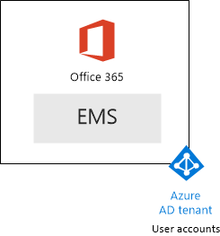

# <a name="the-microsoft-365-enterprise-devtest-environment"></a>Ambiente di sviluppo/testing di Microsoft 365 Enterprise

 **Riepilogo:** Usare questa guida del laboratorio di testing per creare un ambiente di sviluppo e di testing che includa Office 365 E5, Enterprise Mobility + Security (EMS) E5 e un computer che esegue Windows 10 Enterprise.
  
In questo articolo vengono fornite istruzioni dettagliate per creare un ambiente semplificato per verificare le funzionalità di [Microsoft 365 Enterprise](https://www.microsoft.com/microsoft-365/enterprise).
  
## <a name="phase-1-create-your-office-365-e5-subscription"></a>Fase 1: creare la sottoscrizione di Office 365 E5

Seguire i passaggi della fase 2 e 3 fase dell'[ambiente di sviluppo/testing di Office 365](office-365-dev-test-environment.md) per creare un ambiente di sviluppo e di testing di Office 365 semplificato, come illustrato nella Figura 1.
  
**Figura 1: sottoscrizione di Office 365 E5 con account utente e tenant relativi ad Azure Active Directory (AD)**


> [!NOTE]
> La sottoscrizione di valutazione Office 365 E5 è valida per 30 giorni e può essere estesa facilmente a 60 giorni. Per un ambiente di sviluppo/testing permanente, creare una nuova sottoscrizione a pagamento con un numero limitato di licenze. 
  
## <a name="phase-2-add-ems"></a>Fase 2: aggiungere EMS

In questa fase, è possibile iscriversi per la sottoscrizione di valutazione di EMS E5 e aggiungerla alla stessa organizzazione della sottoscrizione di valutazione di Office 365 E5.
  
Prima di tutto, aggiungere la sottoscrizione di valutazione di EMS E5 e assegnare una licenza EMS al proprio account di amministratore globale.
  
1. Con l'istanza privata di un browser Internet, accedere al portale di Office 365 tramite le credenziali dell'account di amministratore globale. Per informazioni, vedere [Dove accedere a Office 365](https://support.office.com/Article/Where-to-sign-in-to-Office-365-e9eb7d51-5430-4929-91ab-6157c5a050b4).
    
2. Fare clic sul riquadro **Amministratore**.
    
3. Nella scheda **Interfaccia di amministrazione di Office** del browser fare clic su **Fatturazione > Servizi di acquisto** nel riquadro di spostamento di sinistra.
    
4. Nella pagina **Acquisto di servizi**, individuare la voce **Enterprise Mobility + Security E5**. Posizionare il puntatore del mouse su di essa e fare clic su **Avvia la versione di valutazione gratuita**.
    
5. Nella pagina **Conferma l'ordine**, fare clic su **Prova adesso**.
    
6. Nella pagina **Ricevuta ordine**, fare clic su **Continua**.
    
7. Nella scheda **Interfaccia di amministrazione di Office 365** del browser fare clic su **Utenti > Utenti attivi** nel riquadro di spostamento di sinistra.
    
8. Fare clic sull'account amministratore globale e quindi su **Modifica** per le **licenze del prodotto**.
    
9. Nel riquadro **Licenze per i prodotti**, impostare la licenza per i prodotti di **Enterprise Mobility + Security E5** su **Attiva**, fare clic su **Salva** e quindi fare doppio clic su **Chiudi**.
    
> [!NOTE]
> La sottoscrizione di valutazione Enterprise Mobility + Security E5 è valida per 90 giorni. Per un ambiente di sviluppo/test permanente, creare una nuova sottoscrizione a pagamento con un numero limitato di licenze. 
  
 ***Se è stata completata la fase 3 di*** [Ambiente di sviluppo/testing di Office 365](office-365-dev-test-environment.md), ripetere i passaggi 8 e 9 della procedura precedente per tutti gli altri account (Utente 2, Utente 3, Utente 4 e Utente 5).
  
A questo punto, l'ambiente di sviluppo/di testing dispone di:
  
- Sottoscrizioni di valutazione di Office 365 E5 Enterprise ed EMS E5 che condividono lo stesso tenant di Azure AD con l'elenco degli account utente in uso.
- Tutti gli account utente appropriati (solo l'amministratore globale o tutti e cinque gli account utente), sono abilitati per l'uso di Office 365 E5 ed EMS E5.
    
La figura 2 mostra la configurazione risultante che consente di aggiungere EMS.
  
**Figura 2: aggiunta della sottoscrizione di valutazione di EMS**


  
## <a name="phase-3-create-a-windows-10-enterprise-computer"></a>Fase 3: creare un computer con Windows 10 Enterprise

In questa fase, si crea un computer autonomo che esegue Windows 10 Enterprise.
  
### <a name="physical-computer"></a>Computer fisico

Procurarsi un personal computer e installarvi Windows 10 Enterprise. È possibile scaricare la versione di valutazione di Windows 10 Enterprise [qui](https://www.microsoft.com/evalcenter/evaluate-windows-10-enterprise).
  
### <a name="virtual-machine"></a>Macchina virtuale

Creare una macchina virtuale utilizzando l'hypervisor scelto e installarvi Windows 10 Enterprise. È possibile scaricare la versione di valutazione di Windows 10 Enterprise [qui](https://www.microsoft.com/evalcenter/evaluate-windows-10-enterprise).
  
### <a name="virtual-machine-in-azure"></a>Macchina virtuale in Azure

Per creare una macchina virtuale con Windows 10 in Microsoft Azure, ***è necessario disporre di una sottoscrizione basata su Visual Studio***, che abbia accesso all'immagine per Windows 10 Enterprise. Altri tipi di sottoscrizioni di Azure, ad esempio le sottoscrizioni di valutazione e quelle a pagamento, non hanno accesso a tale immagine.
  
> [!NOTE]
> I seguenti comandi consentono di utilizzare la versione più recente di Azure PowerShell. Vedere [Panoramica dei cmdlet di Azure PowerShell](https://docs.microsoft.com/powershell/azureps-cmdlets-docs/). Questi set di comandi creano una macchina virtuale con Windows 10 Enterprise denominata WIN10 e tutte le infrastrutture relative necessarie, tra cui un gruppo di risorse, un account di archiviazione e una rete virtuale. Se si ha già familiarità con i servizi di infrastruttura di Azure, si consiglia di adattare queste istruzioni all’infrastruttura attualmente implementata. 
  
Innanzitutto, avviare un prompt di Microsoft PowerShell.
  
Accedere al proprio account Azure con il seguente comando.
  
```
Login-AzureRMAccount
```

Ottenere il nome della sottoscrizione utilizzando il comando seguente.
  
```
Get-AzureRMSubscription | Sort Name | Select Name
```

Impostare la sottoscrizione di Azure. Sostituire tutto il testo racchiuso tra virgolette, compresi i caratteri \< e >, con il nome corretto.
  
```
$subscr="<subscription name>"
Get-AzureRmSubscription -SubscriptionName $subscr | Select-AzureRmSubscription
```

Quindi, creare un nuovo gruppo di risorse. Per definire un nome del gruppo di risorse univoco, utilizzare questo comando per creare un elenco di gruppi di risorse esistenti.
  
```
Get-AzureRMResourceGroup | Sort ResourceGroupName | Select ResourceGroupName
```

Creare il nuovo gruppo di risorse con questi comandi. Sostituire tutto il testo racchiuso tra virgolette, compresi i caratteri \< e >, con i nomi corretti.
  
```
$rgName="<resource group name>"
$locName="<location name, such as West US>"
New-AzureRMResourceGroup -Name $rgName -Location $locName
```

Successivamente, creare una nuova rete virtuale e la macchina virtuale con WIN10 con questi comandi. Quando richiesto, fornire il nome e la password dell'account Administrator locale per WIN10 e archiviare questi elementi in un luogo sicuro.
  
```
$corpnetSubnet=New-AzureRMVirtualNetworkSubnetConfig -Name Corpnet -AddressPrefix 10.0.0.0/24
New-AzureRMVirtualNetwork -Name "M365Ent-TestLab" -ResourceGroupName $rgName -Location $locName -AddressPrefix 10.0.0.0/8 -Subnet $corpnetSubnet
$rule1=New-AzureRMNetworkSecurityRuleConfig -Name "RDPTraffic" -Description "Allow RDP to all VMs on the subnet" -Access Allow -Protocol Tcp -Direction Inbound -Priority 100 -SourceAddressPrefix Internet -SourcePortRange * -DestinationAddressPrefix * -DestinationPortRange 3389
New-AzureRMNetworkSecurityGroup -Name Corpnet -ResourceGroupName $rgName -Location $locName -SecurityRules $rule1
$vnet=Get-AzureRMVirtualNetwork -ResourceGroupName $rgName -Name "M365Ent-TestLab"
$nsg=Get-AzureRMNetworkSecurityGroup -Name Corpnet -ResourceGroupName $rgName
Set-AzureRMVirtualNetworkSubnetConfig -VirtualNetwork $vnet -Name Corpnet -AddressPrefix "10.0.0.0/24" -NetworkSecurityGroup $nsg
$pip=New-AzureRMPublicIpAddress -Name WIN10-PIP -ResourceGroupName $rgName -Location $locName -AllocationMethod Dynamic
$nic=New-AzureRMNetworkInterface -Name WIN10-NIC -ResourceGroupName $rgName -Location $locName -SubnetId $vnet.Subnets[0].Id -PublicIpAddressId $pip.Id
$vm=New-AzureRMVMConfig -VMName WIN10 -VMSize Standard_D1_V2
$cred=Get-Credential -Message "Type the name and password of the local administrator account for WIN10."
$vm=Set-AzureRMVMOperatingSystem -VM $vm -Windows -ComputerName WIN10 -Credential $cred -ProvisionVMAgent -EnableAutoUpdate
$vm=Set-AzureRMVMSourceImage -VM $vm -PublisherName MicrosoftWindowsDesktop -Offer Windows-10 -Skus RS3-Pro -Version "latest"
$vm=Add-AzureRMVMNetworkInterface -VM $vm -Id $nic.Id
$vm=Set-AzureRmVMOSDisk -VM $vm -Name WIN10-TestLab-OSDisk -DiskSizeInGB 128 -CreateOption FromImage -StorageAccountType "StandardLRS"
New-AzureRMVM -ResourceGroupName $rgName -Location $locName -VM $vm
```

## <a name="phase-4-join-your-windows-10-computer-to-azure-ad"></a>Fase 4: aggiungere il proprio computer con Windows 10 ad Azure AD

Dopo che la macchina virtuale o fisica con Windows 10 Enterprise è stata creata, accedere con un account amministratore locale.
  
> [!NOTE]
> Per connettersi a una macchina virtuale in Azure, utilizzare [queste istruzioni](https://docs.microsoft.com/azure/virtual-machines/windows/connect-logon). Effettuare l'accesso con le credenziali dell'account Administrator locale. 
  
Successivamente, aggiungere il computer WIN10 al tenant di Azure AD delle sottoscrizioni di Office 365 e EMS.
  
1. Nel desktop del computer WIN10, fare clic su **Start > Impostazioni > Account > Accedi all'azienda o all'istituto di istruzione > Connetti**.
    
2. Nella finestra di dialogo **Configura un account aziendale o dell'istituto di istruzione**, fare clic su **Aggiungi il dispositivo ad Azure Active Directory**.
    
3. In **Account aziendale o dell'istituto di istruzione**, digitare il nome dell'account Administrator globale della propria sottoscrizione di Office 365, quindi fare clic su **Avanti**.
    
4. In **Immettere la password**, digitare la password dell’account Administrator locale, quindi fare clic su **Accedi**.
    
5. Quando viene richiesto di verificare che l’organizzazione sia la propria, fare clic su **Aggiungi**, quindi fare clic su **Fatto**.
    
6. Chiudere la finestra delle impostazioni.
    
Successivamente, installare Office 2016 nel computer WIN10
  
1. Aprire il browser Microsoft Edge e accedere al portale di Office 365 tramite le credenziali dell'account Administrator globale. Per informazioni, vedere [Dove accedere a Office 365](https://support.office.com/Article/Where-to-sign-in-to-Office-365-e9eb7d51-5430-4929-91ab-6157c5a050b4).
    
2. Nella scheda **Microsoft Office Home**, fare clic su **Installa Office 2016**.
    
3. Quando viene richiesto di eseguire operazioni, fare clic su **Esegui**, quindi fare clic su **Sì** per **Controllo dell'account utente**.
    
4. Attendere che l’installazione di Office venga completata. Quando viene visualizzato **La configurazione è completata**, fare clic su **Chiudi** due volte.
    
La Figura 3 mostra l'ambiente risultante, che include il computer WIN10 aggiunto al tenant di Azure AD delle sottoscrizioni di Office 365 ed EMS.
  
**Figura 3: aggiungere l'account del computer WIN10 al tenant di Azure AD**


  
A questo punto è possibile sperimentare le funzionalità aggiuntive di [Microsoft 365 Enterprise](https://www.microsoft.com/microsoft-365/enterprise).
  
## <a name="next-steps"></a>Passaggi successivi

Utilizzare questi articoli aggiuntivi per esplorare le funzionalità di Microsoft 365 Enterprise:
  
- [Aggiunta di criteri di gestione di applicazioni mobili](https://technet.microsoft.com/library/mt764059.aspx)
    
- [Registrazione di dispositivi iOS e Android](https://technet.microsoft.com/library/mt743077.aspx)
    
- [Configurazione e test di Gestione sicurezza avanzata](https://technet.microsoft.com/library/mt757250.aspx)
    
- [Configurazione e test di Advanced Threat Protection](https://technet.microsoft.com/library/mt490479.aspx)
    
## <a name="see-also"></a>Vedere anche

- [Documentazione di Microsoft 365 Enterprise](https://docs.microsoft.com/microsoft-365-enterprise/)
- [Distribuzione di Microsoft 365 Enterprise](https://docs.microsoft.com/microsoft-365/enterprise/deploy-microsoft-365-enterprise)
- [Ambiente di sviluppo/test One Microsoft Cloud](the-one-microsoft-cloud-dev-test-environment.md)
- [Test Lab Guide (TLG) di adozione cloud](cloud-adoption-test-lab-guides-tlgs.md)
