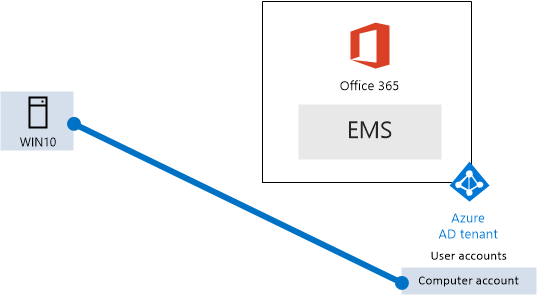

# <a name="the-microsoft-365-enterprise-devtest-environment"></a>Ambiente di sviluppo/test di Microsoft 365 Enterprise

 **Riepilogo:** Utilizzare questa guida dei laboratori di testing per creare un ambiente di sviluppo e di testing che include Office 365 E5, mobilità aziendale + E5 di sicurezza (EMS) e un computer che esegue Windows 10 Enterprise.
  
In questo articolo vengono fornite istruzioni dettagliate per creare un ambiente semplificato per testare le funzionalità di [Microsoft 365 Enterprise](https://www.microsoft.com/microsoft-365/enterprise).
  
## <a name="phase-1-create-your-office-365-e5-subscription"></a>Fase 1: creare la sottoscrizione di Office 365 E5

Seguire i passaggi della fase 2 e la fase 3 dell' [ambiente di sviluppo e di testing di Office 365](office-365-dev-test-environment.md) per creare un ambiente di sviluppo e di testing lightweight Office 365, come illustrato nella figura 1.
  
**Nella figura 1: La sottoscrizione di Office 365 E5 con il relativo account utente e tenant di Azure Active Directory (AD)**


> [!NOTE]
> La sottoscrizione di valutazione di Office 365 E5 è 30 giorni, che possono essere facilmente esteso a 60 giorni. Per un ambiente di sviluppo e di testing permanente, creare una nuova con un numero limitato di licenze di sottoscrizione a pagamento. 
  
## <a name="phase-2-add-ems"></a>Fase 2: aggiungere EMS

In questa fase, è possibile iscriversi per la sottoscrizione di valutazione di EMS E5 e aggiungerla alla stessa organizzazione della sottoscrizione di valutazione di Office 365 E5.
  
Innanzitutto, aggiungere la sottoscrizione di prova EMS E5 e assegna una licenza EMS all'account amministratore globale.
  
1. Con un'istanza privata di un browser, accedere al portale di Office 365 con le credenziali dell'account amministratore globale. Per ulteriori informazioni, vedere [la posizione in cui eseguire l'accesso a Office 365](https://support.office.com/Article/Where-to-sign-in-to-Office-365-e9eb7d51-5430-4929-91ab-6157c5a050b4).
    
2. Scegliere il riquadro **Amministrazione**.
    
3. Nella scheda **Interfaccia di amministrazione di Office** del browser fare clic su **Fatturazione > Servizi di acquisto** nel riquadro di spostamento di sinistra.
    
4. Nella pagina **servizi di acquisto** individuare l'elemento di **sicurezza E5 + mobilità aziendale** . Posizionare il puntatore del mouse su di esso e fare clic su **Start versione di valutazione gratuita**.
    
5. Nella pagina **Conferma l'ordine**, fare clic su **Prova adesso**.
    
6. Nella pagina **Ricevuta ordine**, fare clic su **Continua**.
    
7. Nella scheda **Interfaccia di amministrazione di Office 365** del browser fare clic su **Utenti > Utenti attivi** nel riquadro di spostamento di sinistra.
    
8. Fare clic sull'account di amministratore globale e quindi fare clic su **Modifica** per **le licenze del prodotto**.
    
9. Nel riquadro di **licenze per i prodotti** , attivare la licenza del prodotto per la **mobilità aziendale + E5 di sicurezza** per **in**, fare clic su **Salva** e quindi fare doppio clic su **Chiudi** .
    
> [!NOTE]
> La sottoscrizione di valutazione Enterprise Mobility + Security E5 è valida per 90 giorni. Per un ambiente di sviluppo/test permanente, creare una nuova sottoscrizione a pagamento con un numero limitato di licenze. 
  
 ***Se sono state completate fase 3 del*** [Ambiente di sviluppo e di testing di office 365](office-365-dev-test-environment.md), ripetere i passaggi 8 e 9 della procedura precedente per tutti gli altri account (utente 2, 3 utente, utente 4 e 5 utente).
  
A questo punto, l'ambiente di sviluppo/di testing dispone di:
  
- Office 365 Enterprise E5 ed EMS E5 sottoscrizioni di valutazione condivisione stesso tenant di Azure Active Directory con l'elenco di account utente.
- Tutti gli account utente appropriati (solo l'amministratore globale o tutti gli account utente cinque) sono abilitati all'utilizzo di Office 365 E5 ed EMS E5.
    
La figura 2 mostra la configurazione risultante che consente di aggiungere EMS.
  
**Figura 2: Aggiunta di sottoscrizione di prova EMS**


  
## <a name="phase-3-create-a-windows-10-enterprise-computer"></a>Fase 3: creare un computer con Windows 10 Enterprise

In questa fase, si crea un computer autonomo che esegue Windows 10 Enterprise.
  
### <a name="physical-computer"></a>Computer fisico

Ottenere un personal computer e installare Windows 10 Enterprise su di esso. È possibile scaricare il Windows 10 Enterprise versione di valutazione [di seguito](https://www.microsoft.com/evalcenter/evaluate-windows-10-enterprise).
  
### <a name="virtual-machine"></a>Macchina virtuale

Creare una macchina virtuale utilizzando hypervisor desiderato e installare Windows 10 Enterprise su di esso. È possibile scaricare il Windows 10 Enterprise versione di valutazione [di seguito](https://www.microsoft.com/evalcenter/evaluate-windows-10-enterprise).
  
### <a name="virtual-machine-in-azure"></a>Macchina virtuale in Azure

Per creare una macchina virtuale Windows 10 in Microsoft Azure, ***è necessario disporre di una sottoscrizione di Visual Studio***, che dispone dell'accesso per l'immagine per Windows 10 Enterprise. Altri tipi di sottoscrizioni di Azure, ad esempio le sottoscrizioni di valutazione e a pagamento, non hanno accesso all'immagine.
  
> [!NOTE]
> Il seguente comando consente di utilizzare la versione più recente di Azure PowerShell. Vedere [iniziare a utilizzare i cmdlet PowerShell di Azure](https://docs.microsoft.com/powershell/azureps-cmdlets-docs/). Compilazione di set di una macchina virtuale Windows 10 Enterprise questi comandi denominati WIN10 e tutti i relativi infrastruttura necessaria, tra cui un gruppo di risorse, un account di archiviazione e una rete virtuale. Se si ha già familiarità con i servizi di infrastruttura, adattare queste istruzioni per l'infrastruttura appropriata. 
  
Innanzitutto, avviare un prompt di Microsoft PowerShell.
  
Accedere al proprio account Azure con il seguente comando.
  
```
Login-AzureRMAccount
```

Ottenere il nome della sottoscrizione utilizzando il comando seguente.
  
```
Get-AzureRMSubscription | Sort Name | Select Name
```

Impostare la sottoscrizione di Azure. Sostituire tutte le virgolette, incluse le \< e > caratteri, con il nome corretto.
  
```
$subscr="<subscription name>"
Get-AzureRmSubscription -SubscriptionName $subscr | Select-AzureRmSubscription
```

Quindi, creare un nuovo gruppo di risorse. Per definire un nome del gruppo di risorse univoco, utilizzare questo comando per creare un elenco di gruppi di risorse esistenti.
  
```
Get-AzureRMResourceGroup | Sort ResourceGroupName | Select ResourceGroupName
```

Creare il nuovo gruppo di risorse con questi comandi. Sostituire tutte le virgolette, incluse le \< e > caratteri con i nomi corretti.
  
```
$rgName="<resource group name>"
$locName="<location name, such as West US>"
New-AzureRMResourceGroup -Name $rgName -Location $locName
```

Successivamente, creare una nuova rete virtuale e la macchina virtuale con WIN10 con questi comandi. Quando richiesto, fornire il nome e la password dell'account Administrator locale per WIN10 e archiviare questi elementi in un luogo sicuro.
  
```
$corpnetSubnet=New-AzureRMVirtualNetworkSubnetConfig -Name Corpnet -AddressPrefix 10.0.0.0/24
New-AzureRMVirtualNetwork -Name "M365Ent-TestLab" -ResourceGroupName $rgName -Location $locName -AddressPrefix 10.0.0.0/8 -Subnet $corpnetSubnet
$rule1=New-AzureRMNetworkSecurityRuleConfig -Name "RDPTraffic" -Description "Allow RDP to all VMs on the subnet" -Access Allow -Protocol Tcp -Direction Inbound -Priority 100 -SourceAddressPrefix Internet -SourcePortRange * -DestinationAddressPrefix * -DestinationPortRange 3389
New-AzureRMNetworkSecurityGroup -Name Corpnet -ResourceGroupName $rgName -Location $locName -SecurityRules $rule1
$vnet=Get-AzureRMVirtualNetwork -ResourceGroupName $rgName -Name "M365Ent-TestLab"
$nsg=Get-AzureRMNetworkSecurityGroup -Name Corpnet -ResourceGroupName $rgName
Set-AzureRMVirtualNetworkSubnetConfig -VirtualNetwork $vnet -Name Corpnet -AddressPrefix "10.0.0.0/24" -NetworkSecurityGroup $nsg
$pip=New-AzureRMPublicIpAddress -Name WIN10-PIP -ResourceGroupName $rgName -Location $locName -AllocationMethod Dynamic
$nic=New-AzureRMNetworkInterface -Name WIN10-NIC -ResourceGroupName $rgName -Location $locName -SubnetId $vnet.Subnets[0].Id -PublicIpAddressId $pip.Id
$vm=New-AzureRMVMConfig -VMName WIN10 -VMSize Standard_D1_V2
$cred=Get-Credential -Message "Type the name and password of the local administrator account for WIN10."
$vm=Set-AzureRMVMOperatingSystem -VM $vm -Windows -ComputerName WIN10 -Credential $cred -ProvisionVMAgent -EnableAutoUpdate
$vm=Set-AzureRMVMSourceImage -VM $vm -PublisherName MicrosoftWindowsDesktop -Offer Windows-10 -Skus RS3-Pro -Version "latest"
$vm=Add-AzureRMVMNetworkInterface -VM $vm -Id $nic.Id
$vm=Set-AzureRmVMOSDisk -VM $vm -Name WIN10-TestLab-OSDisk -DiskSizeInGB 128 -CreateOption FromImage -StorageAccountType "StandardLRS"
New-AzureRMVM -ResourceGroupName $rgName -Location $locName -VM $vm
```

## <a name="phase-4-join-your-windows-10-computer-to-azure-ad"></a>Fase 4: aggiungere il proprio computer con Windows 10 ad Azure AD

Dopo aver creata la macchina virtuale con Windows 10 Enterprise o computer fisici, accedere con un account amministratore locale.
  
> [!NOTE]
> Per una macchina virtuale in Azure, eseguire la connessione con [le relative istruzioni](https://docs.microsoft.com/azure/virtual-machines/windows/connect-logon). Accedere con le credenziali dell'account di amministratore locale. 
  
Successivamente, aggiungere il computer WIN10 al tenant di Azure AD delle sottoscrizioni di Office 365 e EMS.
  
1. Il desktop del computer WIN10, fare clic su **Start > Impostazioni > account > accesso ufficio o scuola > Connetti**.
    
2. Nella finestra di dialogo **Configura un account di lavoro o della scuola** , fare clic su **Partecipa alla periferica di Azure Active Directory**.
    
3. In **lavoro o scuola account**, digitare il nome dell'account amministratore globale della sottoscrizione a Office 365 e quindi fare clic su **Avanti**.
    
4. Nella casella **Immettere la password**, digitare la password per l'account amministratore globale e quindi fare clic su **Accedi**.
    
5. Quando richiesto per assicurarsi che si tratta dell'organizzazione, fare clic su **Partecipa**e quindi fare clic su **Fine**.
    
6. Chiudere la finestra delle impostazioni.
    
Installare quindi 2016 Office nel computer WIN10.
  
1. Aprire il browser Microsoft Edge e accedere al portale di Office 365 con le credenziali dell'account amministratore globale. Per ulteriori informazioni, vedere [la posizione in cui eseguire l'accesso a Office 365](https://support.office.com/Article/Where-to-sign-in-to-Office-365-e9eb7d51-5430-4929-91ab-6157c5a050b4).
    
2. Nella scheda **Microsoft Office Home**, fare clic su **Installa Office 2016**.
    
3. Quando richiesto con operazioni da eseguire, fare clic su **Esegui**e quindi fare clic su **Sì** per il **Controllo dell'Account utente**.
    
4. Attendere di Office completare l'installazione. Quando viene visualizzato **sei tutte impostate!**, fare doppio clic su **Chiudi** .
    
La Figura 3 mostra l'ambiente risultante, che include il computer WIN10 aggiunto al tenant di Azure AD delle sottoscrizioni di Office 365 ed EMS.
  
**Figura 3: Aggiungere l'account del computer WIN10 al tenant Azure Active Directory**


  
A questo punto si è pronti acquisire familiarità con le funzionalità aggiuntive di [365 Microsoft Enterprise](https://www.microsoft.com/microsoft-365/enterprise).
  
## <a name="next-steps"></a>Passaggi successivi

Utilizzare questi articoli aggiuntivi per esplorare le funzionalità di Microsoft 365 Enterprise:
  
- [Aggiungere criteri di gestione (MAM) applicazione per dispositivi mobili](https://technet.microsoft.com/library/mt764059.aspx)
    
- [Registrare iOS e dispositivi Android](https://technet.microsoft.com/library/mt743077.aspx)
    
- [Configurare e gestire la sicurezza avanzata di test](https://technet.microsoft.com/library/mt757250.aspx)
    
- [Configurare e testare avanzate Threat Protection](https://technet.microsoft.com/library/mt490479.aspx)
    
## <a name="see-also"></a>Concetti

- [Documentazione Microsoft 365 Enterprise](https://docs.microsoft.com/microsoft-365-enterprise/)
- [Distribuire Microsoft 365 Enterprise](https://docs.microsoft.com/microsoft-365/enterprise/deploy-microsoft-365-enterprise)
- [L'ambiente di sviluppo e di testing uno Cloud Microsoft](the-one-microsoft-cloud-dev-test-environment.md)
- [Test Lab Guide (TLG) di adozione cloud ](cloud-adoption-test-lab-guides-tlgs.md)
