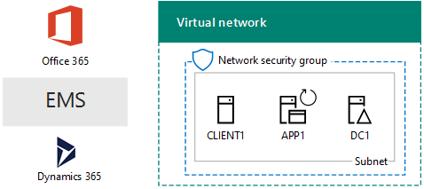
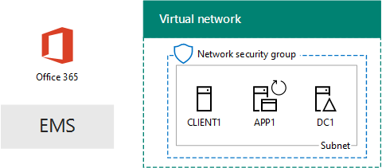

# Ambiente di sviluppo/test One Microsoft CloudThe One Microsoft Cloud dev/test environment

 **Riepilogo:** Utilizzare questa guida dei laboratori di testing per creare un ambiente di sviluppo e di testing che includa tutte le offerte cloud di Microsoft.**Summary:** Use this Test Lab Guide to create a dev/test environment that includes all of Microsoft's cloud offerings.
  
Con le istruzioni disponibili in questo articolo, si crea una rete Intranet simulata in Servizi infrastruttura di Microsoft Azure e quindi si aggiungono gli abbonamenti di Microsoft Office 365, Microsoft Enterprise Mobility + Security (EMS) e Microsoft Dynamics 365. Il risultato è un'organizzazione semplificata che utilizza tutte le offerte cloud di Microsoft contemporaneamente in un singolo ambiente di sviluppo/test. With the instructions in this article, you create a simulated intranet in Microsoft Azure infrastructure services and then add Microsoft Office 365, Microsoft Enterprise Mobility + Security (EMS), and Microsoft Dynamics 365 subscriptions. The result is a simplified organization that uses all Microsoft's cloud offerings at the same time in a single dev/test environment. 
  

  
È possibile utilizzare la configurazione risultante per:You can use the resulting configuration to:
  
- Sfruttare l'integrazione tra le offerte cloud di Microsoft, come l'infrastruttura di gestione delle identità fornita da Azure Active Directory (AD).Experience the integration across Microsoft's cloud offerings, such as the common identity infrastructure provided by Azure Active Directory (AD).
    
- Valutare gli scenari end-to-end che includono più offerte di Microsoft Cloud.Evaluate end-to-end scenarios that include multiple Microsoft Cloud offerings.
    
- Creare una demo, un modello di verifica o una configurazione di sviluppo/test che utilizzi più offerte di Microsoft Cloud.Create a demo, proof-of-concept, or dev/test configuration that uses multiple Microsoft Cloud offerings.
    
- Compilare le competenze di Microsoft Cloud per lo sviluppo professionale.Build your Microsoft Cloud skills for professional development.
    
## Fase 1: creare una rete Intranet simulata e aggiungere Office 365Phase 1: Create a simulated intranet and add Office 365

Seguire le istruzioni riportate in [DirSync per l'ambiente di sviluppo e di testing di Office 365](dirsync-for-your-office-365-dev-test-environment.md).Follow the instructions in [DirSync for your Office 365 dev/test environment](dirsync-for-your-office-365-dev-test-environment.md).
  
Nella figura 1 viene illustrata la configurazione risultante, che include Office 365 e una rete intranet simulata in esecuzione in servizi di infrastruttura e la sincronizzazione delle directory da una foresta di Windows Server Active Directory (AD) locale.Figure 1 shows your resulting configuration, which includes Office 365 and a simulated intranet running in Azure infrastructure services and directory synchronization from an on-premises Windows Server Active Directory (AD) forest.
  
**Nella figura 1: Simulata intranet in Azure con Office 365****Figure 1: The simulated intranet in Azure with Office 365**

  
> [!NOTE]
> La versione di valutazione di Azure è 30 giorni. La sottoscrizione di valutazione di Office 365 Enterprise E5 è 30 giorni, può essere facilmente estesa per altri 30 giorni. Per un ambiente di sviluppo e di testing permanente, creare un nuovo pagamento sottoscrizione Azure e una nuova sottoscrizione di Office 365 Enterprise E5 pagamento con un piccolo numero di licenze.The Azure trial is 30 days. The Office 365 Enterprise E5 Trial subscription is 30 days, which can be easily extended for another 30 days. For a permanent dev/test environment, create a new paid Azure subscription and a new paid Office 365 Enterprise E5 subscription with a small number of licenses. 
  
## Fase 2: aggiungere EMSPhase 2: Add EMS

In questa fase, è possibile iscriversi per la sottoscrizione di valutazione di EMS e aggiungerla alla stessa organizzazione della sottoscrizione di prova di Office 365.In this phase, you sign up for the EMS trial subscription and add it to the same organization as your Office 365 trial subscription.
  
1. Con un browser di uno computer desktop o da CLIENT1, accedere al portale di Office 365 in [https://portal.office.com](https://portal.office.com) con le credenziali dell'account di amministratore globale.With a browser on either your desktop computer or from CLIENT1, sign in to the Office 365 portal at [https://portal.office.com](https://portal.office.com) with the credentials of your global administrator account.
    
2. Scegliere il riquadro **Amministrazione**.Click the **Admin** tile.
    
3. Nella scheda **Interfaccia di amministrazione di Office** del browser fare clic su **Fatturazione > Servizi di acquisto** nel riquadro di spostamento di sinistra.On the **Office Admin center** tab in your browser, in the left navigation, click **Billing > Purchase services**.
    
4. Nella pagina **servizi di acquisto** individuare l'elemento di **sicurezza E5 + mobilità aziendale** . Posizionare il puntatore del mouse su di esso e fare clic su **Start versione di valutazione gratuita**.On the **Purchase services** page, find the **Enterprise Mobility + Security E5** item. Hover your mouse pointer over it and click **Start free trial**.
    
5. Nella pagina **Conferma l'ordine**, fare clic su **Prova adesso**.On the **Confirm your order** page, click **Try now**.
    
6. Nella pagina **Ricevuta ordine**, fare clic su **Continua**.On the **Order receipt** page, click **Continue**.
    
> [!NOTE]
> La sottoscrizione di valutazione Enterprise Mobility + Security E5 è valida per 90 giorni. Per un ambiente di sviluppo/test permanente, creare una nuova sottoscrizione a pagamento con un numero limitato di licenze.The Enterprise Mobility + Security E5 trial subscription is 90 days. For a permanent dev/test environment, create a new paid subscription with a small number of licenses. 
  
Successivamente, attivare la licenza Enterprise Mobility + Security E5 per tutti gli account utente.Next, enable the Enterprise Mobility + Security E5 license for all user accounts.
  
1. Nella scheda **Interfaccia di amministrazione di Office 365** del browser fare clic su **Utenti > Utenti attivi** nel riquadro di spostamento di sinistra.On the **Office 365 Admin center** tab in your browser, in the left navigation, click **Users > Active users**.
    
2. Fare clic sull'account di amministratore globale e quindi fare clic su **Modifica** per **le licenze del prodotto**.Click your global administrator account, and then click **Edit** for **Product licenses**.
    
3. Nel riquadro di **licenze per i prodotti** , attivare la licenza del prodotto per la **mobilità aziendale + E5 di sicurezza** per **in**, fare clic su **Salva** e quindi fare doppio clic su **Chiudi** .On the **Product licenses** pane, turn the product license for **Enterprise Mobility + Security E5** to **On**, click **Save,** and then click **Close** twice.
    
4. Per tutti gli altri account (User1, User 2, User 3, User 4 e User 5), eseguire i passaggi 2 e 3.For all of your other accounts (User1, User 2, User 3, User 4, and User 5), do steps 2 and 3.
    
A questo punto, l'ambiente di sviluppo/test dispone di:Your dev/test environment now has:
  
- Una rete Intranet in esecuzione nei servizi infrastruttura di Azure.A simulated intranet running in Azure infrastructure services.
    
- Sottoscrizioni di valutazione di Office 365 E5 Enterprise ed EMS che condividono la stessa organizzazione e lo stesso tenant di Azure AD con l'elenco di account utente in uso.Office 365 E5 Enterprise and EMS trial subscriptions sharing the same organization and the same Azure AD tenant with your list of user accounts.
    
- Tutti gli account utente abilitati per usare Office 365 E5 ed EMS.All of your user accounts enabled to use Office 365 E5 Enterprise and EMS.
    
La figura 2 mostra la configurazione risultante che consente di aggiungere EMS.Figure 2 shows your resulting configuration, which adds EMS.
  
**Figura 2: Simulata intranet in Azure con Office 365 ed EMS****Figure 2: The simulated intranet in Azure with Office 365 and EMS**

  
## Fase 3: Aggiungere Dynamics 365Phase 3: Add Dynamics 365

In questa fase, è possibile iscriversi per la sottoscrizione di valutazione di Dynamics 365 e aggiungerla alla stessa organizzazione delle sottoscrizioni di prova di Office 365 ed EMS.In this phase, you sign up for the Dynamics 365 trial subscription and add it to the same organization as your Office 365 and EMS trial subscriptions.
  
1. Utilizzando un browser in un computer desktop o da CLIENT1, accedere al portale di Office 365 in [https://portal.office.com](https://portal.office.com) con le credenziali dell'account di amministratore globale.Using a browser on either your desktop computer or from CLIENT1, sign in to the Office 365 portal at [https://portal.office.com](https://portal.office.com) with the credentials of your global administrator account.
    
2. Fare clic sul riquadro **Amministratore**.Click the **Admin** tile.
    
3. Nella scheda dell' **interfaccia di amministrazione di Office**, nella barra di spostamento sinistra, fare clic su **Fatturazione > Acquisto di servizi**.On the **Office admin center** tab, in the left navigation, click **Billing > Purchase services**.
    
4. Nella pagina **Acquisto di servizi**, individuare la voce **Dynamics 365 Plan 1 Enterprise Edition**. Posizionare il puntatore del mouse su di essa e fare clic su **Avvia la versione di valutazione gratuita**.On the **Purchase services** page, find the **Dynamics 365 Plan 1 Enterprise Edition** item. Hover your mouse pointer over it and click **Start free trial**.
    
5. Nella pagina **Conferma l'ordine**, fare clic su **Prova adesso**.On the **Confirm your order** page, click **Try now**.
    
6. Nella pagina **Ricevuta ordine**, fare clic su **Continua**.On the **Order receipt** page, click **Continue**.
    
> [!NOTE]
> La sottoscrizione di valutazione Dynamics 365 Plan 1 Enterprise Edition è valida per 30 giorni. È possibile estendere la sottoscrizione di prova per altri 30 giorni. Per un ambiente di sviluppo/test permanente, creare una nuova sottoscrizione a pagamento con un numero limitato di licenze.The Dynamics 365 Plan 1 Enterprise Edition trial subscription is 30 days. You can easily extend the trail subscription for another 30 days. For a permanent dev/test environment, create a new paid subscription with a small number of licenses. 
  
Utilizzare questa procedura per assegnare le licenze Dynamics 365 all'amministratore globale e agli account User 2 e User 3 e renderli amministratori di sistema.Use these steps to assign Dynamics 365 licenses to the global administrator, User 2, and User 3 accounts and make them system administrators.
  
1. Nella scheda dell' **interfaccia di amministrazione di Office**, fare clic su **Utenti > Utenti attivi**.On the **Office admin center** tab, click **Users > Active users**.
    
2. Nell'elenco di utenti attivi, fare clic sull'account dell'amministratore globale, quindi su **Modifica** per **Licenze per i prodotti**.In the list of active users, click your global administrator account, and then click **Edit** for **Product licenses**.
    
3. Nel riquadro **Licenze per i prodotti**, impostare la licenza per i prodotti di **Dynamics 365 Plan 1 Enterprise Edition** su **Attiva**, fare clic su **Salva** e quindi fare doppio clic su **Chiudi**.On the **Product licenses** pane, turn the product license for **Dynamics 365 Plan 1 Enterprise Edition** to **On**, click **Save,** and then click **Close** twice.
    
4. Eseguire i passaggi 2 e 3 per gli account User 2 e User 3.Perform steps 2 and 3 for the User 2 and User 3 accounts.
    
5. Chiudere la scheda dell' **interfaccia di amministrazione di Office**.Close the **Office admin center** tab.
    
Seguire questi passaggi per configurare gli account User 2 e User 3 come amministratori di sistema di Dynamics 365.Use these steps to configure the User 2 and User 3 accounts as Dynamics 365 system administrators.
  
1. Nella scheda di **interfaccia di amministrazione di Office** nel browser, nel riquadro di spostamento sinistra fare clic su **Admin Center**e quindi **Dynamics 365**.On the **Office Admin center** tab in your browser, in the left navigation, click **Admin centers**, and then click **Dynamics 365**.
    
    Potrebbe essere necessario attendere il completamento del provisioning di Dynamics 365 prima che Dynamics 365 venga visualizzato nel menu.You may need to wait for Dynamics 365 to finish provisioning before Dynamics 365 appears in the menu.
    
2. Nella scheda Dynamics 365, fare clic su **Tutti**, quindi su **Completa impostazione.**On the Dynamics 365 tab, click **All of these**, and then click **Complete Setup.**
    
    Attendere il completamento dell'impostazione.Wait for setup to complete.
    
    Al termine dell'operazione, viene visualizzato un Dashboard impegni di vendita in base ai dati di esempio che fa parte della sottoscrizione di prova. Attendere alcuni minuti per visualizzare il video di **introduzione alla valutazione**. Al termine, chiudere la finestra del video.When setup completes, it displays a Sales Activity Dashboard based on sample data that is part of the trail subscription. Take a few moments to view the **Welcome to your trial** video. Close the video window when complete.
    
3. Nella barra degli strumenti nella parte superiore, fare clic sulla freccia in giù accanto a **Vendite**, fare clic su **Impostazioni**, quindi su **Sicurezza**.On the toolbar at the top, click the down arrow next to **Sales**, click **Settings**, and then click **Security**.
    
4. Nella pagina **Sicurezza**, fare clic su **Utenti**.On the **Security** page, click **Users**.
    
5. Nell'elenco di utenti, fare clic su **User 2**.In the list of users, click **User 2**.
    
6. Nella barra degli strumenti, fare clic su **Gestisci ruoli**.In the tool bar, click **Manage Roles**.
    
7. In **Gestisci ruoli**, fare clic su **Amministratore di sistema** e quindi fare clic su **OK**.In **Manage Roles**, click **System Administrator**, and then click **OK**.
    
8. Nella barra degli strumenti nella parte superiore fare clic su **Sicurezza**.In the tool bar at the top click **Security**.
    
9. Ripetere i passaggi 5-8 per l'account User 3.Repeat steps 5-8 for the User 3 account.
    
10. Chiudere la scheda **Utente: Scheda User3**.Close the **User: User3** tab.
    
> [!NOTE]
> All'account di amministratore globale di Office 365 è stato assegnato automaticamente il ruolo di amministratore di sistema di Dynamics 365.Your Office 365 global administrator account was automatically assigned the Dynamics 365 system administrator role. 
  
A questo punto, l'ambiente di sviluppo/test dispone di:Your dev/test environment now has:
  
- Una rete Intranet in esecuzione nei servizi infrastruttura di Azure.A simulated intranet running in Azure infrastructure services.
    
- Sottoscrizioni di valutazione di Office 365 E5 Enterprise, EMS e Dynamics 365 che condividono la stessa organizzazione e lo stesso tenant di Azure AD con l'elenco di account utente in uso.Office 365 E5 Enterprise, EMS, and Dynamics 365 trial subscriptions sharing the same organization and the same Azure AD tenant with your list of user accounts.
    
- Tutti gli account utente abilitati per usare Office 365 E5 ed EMS.All of your user accounts enabled to use Office 365 E5 Enterprise and EMS.
    
- Gli account di amministratore globale dell'organizzazione, User 2 e User 3 sono abilitati per l'utilizzo di Dynamics 365 e sono amministratori di sistema di Dynamics 365.Your global enterprise administrator, User 2, and User 3 accounts are enabled to use Dynamics 365 and are Dynamics 365 system administrators.
    
Nella figura 3 è riportata la configurazione risultante.Figure 3 shows your resulting configuration.
  
**Figura 3: Simulata intranet in Azure con Office 365, EMS e Dynamics 365****Figure 3: The simulated intranet in Azure with Office 365, EMS, and Dynamics 365**

  
## Passaggi successiviNext steps

È ora possibile sperimentare l'ambiente di sviluppo/test di One Microsoft Cloud. Ecco alcune idee per esperienze guidate:You can now experiment with your One Microsoft Cloud dev/test environment. Here are some ideas for guided experiences:
  
- [Configurare i criteri di gestione (MAM) mobile applicazione EMS per le applicazioni di Office 365Configure mobile application management (MAM) policies in EMS for Office 365 applications](https://technet.microsoft.com/library/mt764059.aspx)
    
- [Effettuare una dimostrazione Exchange Online in Office 365 integrazione con i contatti Dynamics 365Demonstrate Exchange Online in Office 365 integration with Dynamics 365 contacts](https://technet.microsoft.com/library/mt798313.aspx)
    
- [Creare una rete simulato tra locali in servizi di infrastruttura per l'hosting dei carichi di lavoro basate su serverCreate a simulated cross-premises network in Azure infrastructure services for hosting server-based workloads](https://technet.microsoft.com/library/mt745150.aspx)
    
## Vedere ancheSee Also

[Test Lab Guide (TLG) di adozione cloudCloud adoption Test Lab Guides (TLGs)](cloud-adoption-test-lab-guides-tlgs.md)
  
[Risorse sull'architettura IT del cloud MicrosoftMicrosoft Cloud IT architecture resources](microsoft-cloud-it-architecture-resources.md)
  
[Soluzioni ibrideHybrid solutions](hybrid-solutions.md)
  
[Soluzioni di sicurezzaSecurity solutions](security-solutions.md)

