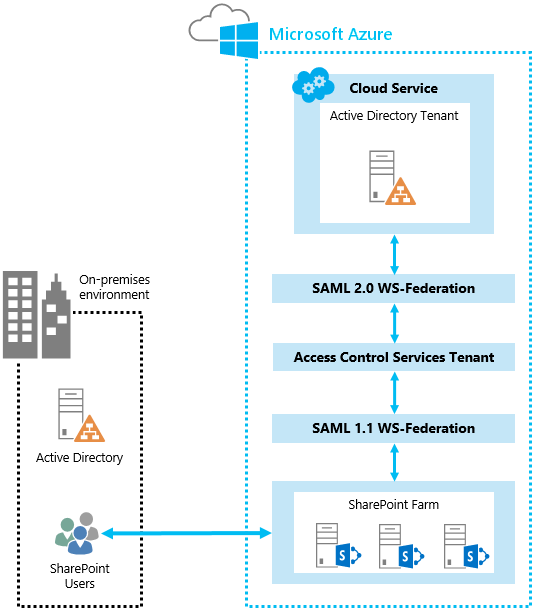

# <a name="using-microsoft-azure-active-directory-for-sharepoint-2013-authentication"></a>Con Microsoft Azure Active Directory per l'autenticazione di SharePoint 2013

 **Riepilogo:** Informazioni su come utilizzare il servizio di controllo di accesso di Azure per autenticare gli utenti di SharePoint Server 2013 con Azure Active Directory.
  
Può risultare più semplice gestire gli utenti tramite l'autenticazione di essi con provider di identità diversi. Considerare come sia comodo utilizzare un provider di identità attendibili, ma un utente di gestione. Ad esempio, avere un tipo di autenticazione per gli utenti che accedono a SharePoint Server 2013 nel cloud e l'altro per gli utenti di SharePoint 2013 nell'ambiente locale. Il servizio di controllo di accesso di Azure rende possibili queste scelte. 
  
In questo articolo viene illustrato come è possibile utilizzare il servizio di controllo di accesso di Azure per autenticare gli utenti di SharePoint 2013 con Azure Active Directory, anziché di Active Directory locale. In questa configurazione, Azure Active Directory diventa un provider di identità attendibile per SharePoint 2013. Questa configurazione viene aggiunto un metodo di autenticazione utente distinto dall'autenticazione di Active Directory utilizzato per l'installazione di SharePoint 2013. Per trarre vantaggio da questo articolo, è consigliabile acquisire familiarità con WS-Federation. Per ulteriori informazioni, vedere [Understanding WS-Federation](https://go.microsoft.com/fwlink/p/?linkid=188052).
  
Nella figura seguente viene illustrato il funzionamento dell'autenticazione per gli utenti di SharePoint 2013 in questa configurazione.
  

  
Nell'esempio viene utilizzata in questo articolo viene fornita da Lorenzo Evans, Microsoft Architect per il centro di eccellenza Azure. 
  
Per informazioni sull'accessibilità di SharePoint 2013, vedere [accessibilità per SharePoint 2013](https://go.microsoft.com/fwlink/p/?LinkId=393123).
  
## <a name="configuration-overview"></a>Panoramica della configurazione

Eseguire la procedura generale per configurare l'ambiente da utilizzare Azure Active Directory come un provider di identità di SharePoint 2013.
  
1. Creare una nuova tenant di Azure Active Directory e spazio dei nomi.
    
2. Aggiungere un provider di identità WS-Federation.
    
3. Aggiungere SharePoint come applicazione relying party.
    
4. Creare un certificato autofirmato da utilizzare per SSL.
    
5. Creare un gruppo di regole per l'autenticazione basata sulle attestazioni.
    
6. Configurare il certificato x. 509.
    
7. Creare un mapping delle attestazioni.
    
8. Configurare SharePoint per il nuovo provider di identità.
    
9. Impostare le autorizzazioni.
    
10. Verificare il nuovo provider.
    
## <a name="create-azure-ad-tenant-and-namespace"></a>Creare nomi e tenant di Azure Active Directory

Utilizzare la procedura seguente per creare un nuovo tenant di Azure Active Directory e uno spazio dei nomi associato. In questo esempio viene utilizzato lo spazio dei nomi "blueskyabove". 
  
1. Nel portale di gestione di Azure, fare clic su **Active Directory**e quindi creare un nuovo tenant di Azure Active Directory.
    
2. Fare clic su **Spazi dei nomi controllo di accesso**e creare un nuovo spazio dei nomi. 
    
3. Fare clic su **Gestisci** sulla barra degli strumenti inferiore. Verrà aperto in questo percorso https://blueskyabove.accesscontrol.windows.net/v2/mgmt/web.
    
4. Aprire Windows PowerShell. Utilizzare il Microsoft Online Services Module per Windows PowerShell, che è un prerequisito per l'installazione dei cmdlet di Windows PowerShell Azure.
    
5. Dal prompt dei comandi di Windows PowerShell digitare il comando: `Connect-Msolservice`, quindi digitare le credenziali.
    
    > [!NOTE]
    > Per ulteriori informazioni su come utilizzare i cmdlet di Azure per Windows PowerShell, vedere [Gestione Azure AD tramite Windows PowerShell](https://go.microsoft.com/fwlink/p/?LinkId=393124). 
  
6. Un prompt dei comandi di Windows PowerShell digitare i comandi seguenti:
    
  ```
  Import-Module MSOnlineExtended -Force
  ```

  ```
  $replyUrl = New-MsolServicePrincipalAddresses -Address "https://blueskyabove.accesscontrol.windows.net/"
  ```

  ```
  New-MsolServicePrincipal -ServicePrincipalNames @("https://blueskyabove.accesscontrol.windows.net/") -DisplayName "BlueSkyAbove ACS Namespace" -Addresses $replyUrl
  ```

    Nella figura seguente viene illustrato il risultato di output.
    
     
  
## <a name="add-a-ws-federation-identity-provider-to-the-namespace"></a>Aggiungere un provider di identità WS-Federation lo spazio dei nomi

Utilizzare la procedura seguente per aggiungere un nuovo provider di identità WS-Federation allo spazio dei nomi blueskyabove.
  
1. Dal portale di gestione di Azure, passare ad **Active Directory** > **Specificatori di controllo di accesso**, fare clic su **Crea una nuova istanza**e quindi fare clic su **Gestisci**.
    
2. Dal portale di controllo di accesso di Azure, fare clic su **Provider di identità** > **Add**, come illustrato nella figura riportata di seguito.
    
     
  
3. Fare clic su **provider di identità WS-Federation**, come illustrato nella figura riportata di seguito e quindi fare clic su **Avanti**.
    
     
  
4. Compilare il testo del collegamento visualizzato nome e l'accesso e quindi fare clic su **Salva**. Per l'URL dei metadati WS-Federation, digitare https://accounts.accesscontrol.windows.net/blueskyabove.onmicrosoft.com/FederationMetadata/2007-06/FederationMetadata.xml. Nella figura seguente viene illustrata l'impostazione.
    
     
  
## <a name="add-sharepoint-as-a-relying-party-application"></a>Aggiungere SharePoint come applicazione relying party

Utilizzare la procedura seguente per aggiungere SharePoint come applicazione relying party.
  
Per ulteriori informazioni sulle impostazioni dell'applicazione relying party, vedere [Utilizzo di applicazioni di terze parti](https://go.microsoft.com/fwlink/p/?LinkId=393125).
  
1. Dal portale di controllo di accesso di Azure, fare clic su **Relying party applicazioni**e quindi fare clic su **Aggiungi**, come illustrato nella figura riportata di seguito.
    
     
  
## <a name="create-a-self-signed-certificate-to-use-for-ssl"></a>Creazione di un certificato autofirmato da utilizzare per SSL

Utilizzare la procedura seguente per creare un certificato autofirmato, nuovo da utilizzare per le comunicazioni protette tramite SSL.
  
1. Estendere l'applicazione web per utilizzare lo stesso URL come PublishingSite, ma utilizzare SSL con la porta 443, come illustrato nella figura riportata di seguito.
    
     
  
2. In Gestione IIS, fare doppio clic su **Certificati del Server**.
    
3. Nel riquadro **Azioni** fare clic su **Crea certificato autofirmato**. Digitare un nome descrittivo del certificato nella casella **specificare un nome descrittivo per il certificato** e quindi fare clic su **OK**.
    
4. Nella finestra di dialogo **Modifica Binding sito** verificare che il nome host è identico al nome descrittivo, come illustrato nella figura riportata di seguito.
    
     
  
     
  
5. Dal portale di gestione di Azure, fare clic sulla macchina virtuale che si desidera configurare e quindi fare clic su **endpoint**.
    
6. Fare clic su **Aggiungi**e quindi fare clic su **-->** (per Avanti).
    
7. In **nome**digitare un nome per l'endpoint.
    
8. In **Porta pubblico** e **Privato porta**, digitare i numeri di porta che si desidera utilizzare e quindi il segno di spunta per il completamento. Questi numeri possono essere diversi. Ai fini di questo articolo, viene utilizzato 443, come illustrato nella figura riportata di seguito.
    
     
  
    > [!NOTE]
    > Per ulteriori informazioni su come aggiungere un endpoint per una macchina virtuale in Azure, vedere [come impostare di endpoint per una macchina virtuale](https://go.microsoft.com/fwlink/p/?LinkId=393126). 
  
9. Dal portale di servizi di controllo di accesso, aggiungere una relying party, come illustrato nella figura riportata di seguito.
    
     
  
## <a name="create-a-rule-group-for-claims-based-authentication"></a>Creare un gruppo di regole per l'autenticazione basata sulle attestazioni

Utilizzare la procedura seguente per creare un nuovo gruppo di regole per controllare l'autenticazione basata sulle attestazioni.
  
1. Nel riquadro sinistro fare clic su **gruppi di regole**e quindi fare clic su **Aggiungi**.
    
2. Digitare un nome per il gruppo di regole, fare clic su **Salva**e quindi fare clic su **Genera**. Ai fini di questo articolo, viene utilizzato **spvms.cloudapp.net for gruppo predefinito di regole**, come illustrato nella figura riportata di seguito.
    
     
  
     
  
    > [!NOTE]
    > Per ulteriori informazioni su come creare gruppi di regole, vedere [gruppi di regole e regole](https://go.microsoft.com/fwlink/p/?LinkId=393128). 
  
3. Fare clic sul gruppo regola che si desidera modificare e quindi fare clic sulla regola di attestazione che si desidera modificare. Ai fini di questo articolo, è aggiungere una regola di attestazioni per il gruppo da passare **nome** come **upn**, come illustrato nella figura seguente.
    
     
  
4. Eliminare la regola delle attestazioni esistente denominata **upn**e lasciare la regola **Nome delle attestazioni di UPN** , come illustrato nella figura seguente.
    
     
  
## <a name="configure-the-x509-certificate"></a>Configurare il certificato x. 509

Utilizzare la procedura seguente per configurare il certificato x. 509 da utilizzare per la firma di token.
  
1. Nel riquadro servizio controllo di accesso, lo **sviluppo**, fare clic su **integrazione delle applicazioni**.
    
2. Nella Guida di **Riferimento all'Endpoint**, individuare **Federation** associato tenant Azure e quindi copiare il percorso nella barra degli indirizzi del browser.
    
3. Nel file **Federation** XML, individuare la sezione **RoleDescriptor** e copiare le informazioni di _<X509Certificate>_ elemento, come illustrato nella figura riportata di seguito.
    
     
  
4. Dalla radice dell'unità c:\\, creare una cartella denominata **certificati**.
    
5. Salvare le informazioni X509Certificate nella cartella c:\\certificati con il nome di file, **AcsTokenSigning.cer**.
    
    > [!NOTE]
    > Deve essere salvato il nome del file con estensione cer. 
  
     
  
## <a name="create-a-claim-mapping-by-using-windows-powershell"></a>Creare un mapping delle attestazioni tramite Windows PowerShell

Utilizzare la procedura seguente per creare un mapping delle attestazioni tramite Windows PowerShell.
  
Verificare di essere membri dei ruoli e dei gruppi seguenti:
  
1. ruolo predefinito del server **securityadmin** nell'istanza di SQL Server.
    
2. ruolo predefinito del database **db_owner** in tutti i database che verranno aggiornati.
    
3. Gruppo Administrators nel server in cui vengono eseguiti i cmdlet di Windows PowerShell.
    
Un amministratore può utilizzare il cmdlet **Add-SPShellAdmin** per concedere le autorizzazioni a utilizzare i cmdlet di SharePoint 2013.
  
> [!NOTE]
> Se si dispone delle autorizzazioni, rivolgersi all'amministratore di installazione o l'amministratore di SQL Server per richiedere le autorizzazioni. Per ulteriori informazioni sulle autorizzazioni di Windows PowerShell, vedere [Add-SPShellAdmin](http://technet.microsoft.com/library/2ddfad84-7ca8-409e-878b-d09cb35ed4aa.aspx). 
  
1. Dal menu **Start** , scegliere **Tutti i programmi**.
    
2. Fare clic su **Prodotti Microsoft SharePoint 2013**.
    
3. Fare clic su **SharePoint 2013 Management Shell**.
    
4. Al prompt dei comandi di Windows PowerShell digitare i comandi seguenti per creare un mapping delle attestazioni:
    
  ```
  $cert = New-Object System.Security.Cryptography.X509Certificates.X509Certificate2("c:\\certificates\\AcsTokenSigning.cer")
  ```

  ```
  New-SPTrustedRootAuthority -Name "ACS BlueSkyAbove Token Signing" -Certificate $cert
  ```

  ```
  $map = New-SPClaimTypeMapping -IncomingClaimType "http://schemas.xmlsoap.org/ws/2005/05/identity/claims/upn" -IncomingClaimTypeDisplayName "UPN" -SameAsIncoming
  ```

  ```
  $map2 = New-SPClaimTypeMapping -IncomingClaimType "http://schemas.xmlsoap.org/ws/2005/05/identity/claims/givenname" -IncomingClaimTypeDisplayName "GivenName" -SameAsIncoming
  ```

  ```
  $map3 = New-SPClaimTypeMapping -IncomingClaimType "http://schemas.xmlsoap.org/ws/2005/05/identity/claims/surname" -IncomingClaimTypeDisplayName "SurName" -SameAsIncoming
  ```

  ```
  $realm = "urn:sharepoint:spvms"
  ```

  ```
  $ap = New-SPTrustedIdentityTokenIssuer -Name "ACS Provider" -Description "SharePoint secured by SAML in ACS" -realm $realm -ImportTrustCertificate $cert -ClaimsMappings $map,$map2,$map3 -SignInUrl "https://blueskyabove.accesscontrol.windows.net/v2/wsfederation" -IdentifierClaim "http://schemas.xmlsoap.org/ws/2005/05/identity/claims/upn"
  ```

## <a name="configure-sharepoint-for-the-new-identity-provider"></a>Configurare SharePoint per il nuovo provider di identità

Utilizzare la procedura seguente per configurare l'installazione di SharePoint per il nuovo provider di identità per Azure Active Directory.
  
1. Verificare che l'account utente che esegue questa procedura sia membro del gruppo di SharePoint Amministratori farm.
    
2. In Amministrazione centrale fare clic su **Gestione applicazioni**nella home page.
    
3. Nella sezione **Applicazioni Web** della pagina **Gestione applicazioni** fare clic su **Gestisci applicazioni web**.
    
4. Selezionare l'applicazione Web appropriata.
    
5. Nella barra multifunzione fare clic su **Provider di autenticazione**.
    
6. In **area**fare clic sul nome dell'area. Ad esempio, **Default**.
    
7. Nella pagina **Modifica autenticazione** nella sezione **Tipi di autenticazione delle attestazioni** selezionare **provider di identità attendibili**e fare clic sul nome del provider, ovvero ai fini di questo articolo **Provider ACS**. Fare clic su **OK**.
    
8. Nella figura seguente viene illustrata l'impostazione **Provider attendibili** .
    

  
## <a name="set-the-permissions"></a>Impostare le autorizzazioni

Utilizzare la procedura seguente per impostare le autorizzazioni per accedere all'applicazione web.
  
1. In Amministrazione centrale fare clic su **Gestione applicazioni**nella home page.
    
2. Nella sezione **Applicazioni Web** della pagina **Gestione applicazioni** fare clic su **Gestisci applicazioni web**.
    
3. Fare clic sull'applicazione web appropriata e quindi fare clic su **Criteri utente**.
    
4. In **criteri per l'applicazione Web**fare clic su **Aggiungi utenti**.
    
5. Nella finestra di dialogo **Aggiungi utenti** fare clic sull'area appropriata in **aree**e quindi fare clic su **Avanti**.
    
6. Nella casella finestra di dialogo **Aggiungi utenti** typeuser2@blueskyabove.onmicrosoft.com (ACS Provider).
    
7. In **autorizzazioni**fare clic su **Controllo completo**.
    
8. Fare clic su **Fine** e quindi su **OK**.
    
Nella figura seguente viene illustrata la sezione **Aggiungi utenti** di un'applicazione web esistente.
  

  
## <a name="verify-the-new-provider"></a>Verificare il nuovo provider

Utilizzare la procedura seguente per verificare che il nuovo provider di identità funzioni accertandosi che il nuovo provider di autenticazione sia presente nel prompt di accesso.
  
1. Eseguire l'accesso utilizzando il nuovo provider denominato **Blu d' sopra**, come illustrato nella figura riportata di seguito.
    
     
  
## <a name="additional-resources"></a>Risorse aggiuntive

[Informazioni sui WS-Federation](https://go.microsoft.com/fwlink/p/?linkid=188052)
  
[Adozione del cloud e soluzioni ibride](cloud-adoption-and-hybrid-solutions.md)
  
## <a name="join-the-discussion"></a>Partecipare alla discussione

|**Contattaci**|**Descrizione**|
|:-----|:-----|
|**Ottenere la soluzione necessaria** <br/> |Microsoft sta creando documenti contenenti soluzioni che fanno riferimento a numerosi prodotti e servizi. Fornire commenti e suggerimenti sulle soluzioni tra server proposte o richiedere una soluzione specifica inviando un'e-mail all'indirizzo [MODAcontent@microsoft.com](mailto:cloudadopt@microsoft.com?Subject=[Cloud%20Adoption%20Content%20Feedback]:%20).<br/> |
|**Partecipare alla discussione sulle soluzioni** <br/> |Se si è appassionati di soluzioni basate sul cloud, prendere in considerazione l'idea di accedere al Cloud Adoption Advisory Board (CAAB) per connettersi con una community più ampia e vivace di sviluppatori di contenuti Microsoft, professionisti del settore e clienti di tutto il mondo. Per accedervi, diventare un membro dell'[area CAAB (Cloud Adoption Advisory Board)](https://aka.ms/caab) della Community tecnica Microsoft e inviare una breve e-mail all'indirizzo [CAAB@microsoft.com](mailto:caab@microsoft.com?Subject=I%20just%20joined%20the%20Cloud%20Adoption%20Advisory%20Board!). Chiunque può leggere i contenuti correlati alla community nel [blog di CAAB](https://blogs.technet.com/b/solutions_advisory_board/). Tuttavia, i membri CAAB ricevono inviti a webinar privati che descrivono le nuove soluzioni e risorse relative all'adozione del cloud.  <br/> |
|**Ottenere l'immagine visualizzata** <br/> |Se si desidera una copia modificabile dell'immagine visualizzata in questo articolo, Microsoft si occuperà di inviarla. Inviare la propria richiesta tramite e-mail, includendo l'URL e il titolo dell'immagine, all'indirizzo [cloudadopt@microsoft.com](mailto:cloudadopt@microsoft.com?subject=[Art%20Request]:%20).  <br/> |
   

